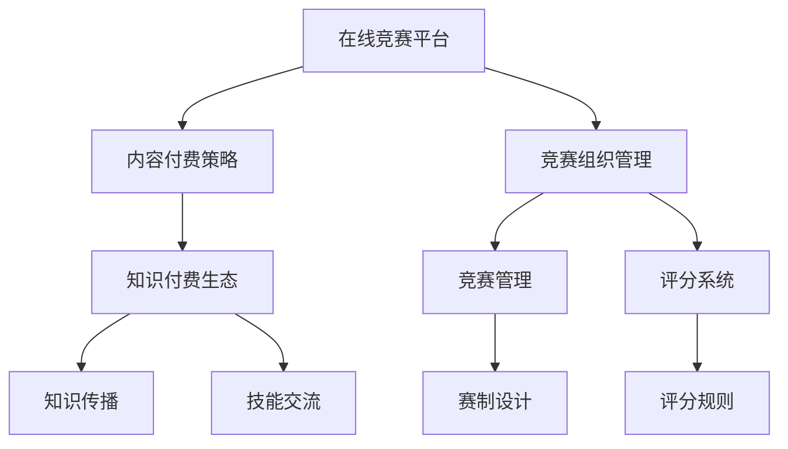

                 

# 如何利用知识付费实现在线技能大赛与竞赛组织服务？

在当今数字化时代，在线教育成为了一种便捷、高效的学习方式，而在线技能大赛和竞赛组织服务则成为了提升个人和企业技能的重要手段。本文将探讨如何利用知识付费模式，实现在线技能大赛与竞赛组织服务，从而为学习者和企业提供更为专业和高效的培训平台。

## 1. 背景介绍

### 1.1 问题由来

随着互联网技术的迅猛发展，在线教育市场不断壮大。技能大赛和竞赛组织服务作为在线教育的重要组成部分，不仅能够激发学习者的学习热情，还能促进企业间的技能交流和创新。然而，传统的线下竞赛组织模式存在诸多局限性，如成本高、组织复杂、参与度低等。

为解决这些问题，利用知识付费模式开展在线技能大赛与竞赛组织服务成为一种新的趋势。知识付费模式通过提供高价值的内容和服务，实现从教育到竞争的平滑过渡，使学习者能够高效提升自己的技能水平。

### 1.2 问题核心关键点

利用知识付费实现在线技能大赛与竞赛组织服务，关键在于以下几个方面：

- **在线平台构建**：建立高效的在线竞赛平台，支持大规模参赛和实时互动。
- **内容付费策略**：通过设置合理的付费门槛，筛选出真正有学习需求和参与意愿的用户。
- **竞赛组织管理**：提供完善的竞赛管理和评分系统，保证竞赛的公平性和透明度。
- **知识付费生态**：构建知识付费生态，吸引专家和培训机构参与，提升竞赛质量和内容深度。

这些关键点相互关联，共同构成了一个完整的在线技能大赛与竞赛组织服务体系。

## 2. 核心概念与联系

### 2.1 核心概念概述

为更好地理解如何利用知识付费实现在线技能大赛与竞赛组织服务，本节将介绍几个密切相关的核心概念：

- **在线竞赛平台**：提供在线竞赛环境和互动功能，支持大规模在线参赛和实时直播。
- **内容付费策略**：采用订阅、按需支付等模式，对竞赛内容进行商业化运作，提升竞赛组织者的收益。
- **竞赛组织管理**：涉及竞赛的赛制设计、规则制定、评分系统构建等内容，确保竞赛的公正性。
- **知识付费生态**：构建由参赛者、评委、培训机构和组织者组成的知识付费生态系统，促进知识和技能的传播与交流。

这些核心概念之间的逻辑关系可以通过以下Mermaid流程图来展示：



这个流程图展示了几大核心概念之间的关联：

1. 在线竞赛平台提供了技术支持，使得内容付费策略得以实现。
2. 竞赛组织管理保证了竞赛的公平性和透明度，是知识付费策略的核心组成部分。
3. 知识付费生态系统的构建，促进了知识的传播与交流，为竞赛提供了丰富的内容和资源。

这些概念共同构成了在线技能大赛与竞赛组织服务的基础框架，为其成功实施提供了有力的支持。

## 3. 核心算法原理 & 具体操作步骤

### 3.1 算法原理概述

利用知识付费实现在线技能大赛与竞赛组织服务，本质上是一种基于知识的价值交换模式。其核心思想是通过在线竞赛平台，将知识内容和竞赛组织服务进行商业化，以实现盈利和持续发展。

形式化地，假设竞赛平台为 $P_{\theta}$，其中 $\theta$ 为平台配置参数。设竞赛内容为 $C$，参赛者为 $S$，知识付费策略为 $F$，竞赛组织管理为 $M$。竞赛组织的目标是最小化用户流失率，即：

$$
\theta^* = \mathop{\arg\min}_{\theta} \mathcal{L}(P_{\theta}, C, S, F, M)
$$

其中 $\mathcal{L}$ 为综合损失函数，包括用户流失率、参与度、满意度等指标。通过梯度下降等优化算法，竞赛平台不断更新参数 $\theta$，最小化损失函数 $\mathcal{L}$，使得平台能够持续吸引和保留参赛者。

### 3.2 算法步骤详解

利用知识付费实现在线技能大赛与竞赛组织服务，通常包括以下几个关键步骤：

**Step 1: 平台搭建与配置**

- 设计竞赛平台架构，包括前端界面、后端服务、数据库等组件。
- 配置竞赛参数，如题目难度、评分规则、奖励机制等。
- 部署竞赛平台，并进行性能测试，确保平台的稳定性和可靠性。

**Step 2: 内容付费策略设计**

- 定义竞赛内容的付费模型，如订阅制、按需付费、竞拍等。
- 设计付费界面，方便参赛者支付费用并获取竞赛信息。
- 设置合理的收费标准，既保证竞赛平台盈利，又吸引足够的参赛者。

**Step 3: 竞赛组织管理**

- 制定竞赛规则和赛程安排，确保竞赛的公平性和透明度。
- 设计评分系统，如自动评分、人工评分、混合评分等，保证评分结果的客观性。
- 提供技术支持，如实时互动、直播回放、成绩查询等，提升用户参与体验。

**Step 4: 知识付费生态构建**

- 吸引专家和培训机构参与竞赛，提升竞赛质量。
- 提供专家点评和培训课程，丰富竞赛内容。
- 设立奖学金和奖励机制，激励参赛者和机构积极参与。

**Step 5: 运营与优化**

- 通过数据分析，优化竞赛内容和服务，提升用户体验。
- 定期发布竞赛结果和反馈，促进竞赛生态系统的良性发展。
- 引入新技术和新模式，如区块链、人工智能等，提升竞赛平台的安全性和智能化水平。

以上是利用知识付费实现在线技能大赛与竞赛组织服务的一般流程。在实际应用中，还需要针对具体任务的特点，对各个环节进行优化设计，以进一步提升竞赛效果。

### 3.3 算法优缺点

利用知识付费实现在线技能大赛与竞赛组织服务，具有以下优点：

1. **高效便捷**：参赛者可以在线参与竞赛，无需物理移动，节省时间和成本。
2. **公平公正**：利用技术手段保障竞赛的公平性和透明度，避免人为干预。
3. **提升技能**：通过专家点评和培训课程，参赛者能够获得专业的技能提升和知识传播。
4. **盈利潜力大**：通过内容付费和平台广告等多种途径，实现高收益。

同时，该方法也存在一些局限性：

1. **用户粘性不足**：部分参赛者可能缺乏长期参与的意愿。
2. **平台运营难度大**：需要不断优化和调整，才能满足用户需求。
3. **技术门槛高**：需要具备较高的技术开发和运营能力。
4. **安全风险**：竞赛平台面临数据安全、隐私保护等风险。

尽管存在这些局限性，但就目前而言，利用知识付费模式开展在线技能大赛与竞赛组织服务，已成为一种高效、公平、高效益的解决方案，具有广阔的发展前景。

### 3.4 算法应用领域

利用知识付费实现在线技能大赛与竞赛组织服务，已经在教育培训、职业认证、企业内部竞赛等多个领域得到了广泛应用。例如：

- **教育培训**：通过在线竞赛平台，提升学生对课程内容的理解和应用能力。
- **职业认证**：在IT、医学、法律等专业领域，通过竞赛认证参与者的专业技能。
- **企业内部竞赛**：促进员工技能交流，提升团队协作和创新能力。
- **创意比赛**：鼓励创新思维和创意表达，激发创意思维。

除了上述这些经典应用外，竞赛组织服务还被创新性地应用于企业间的技术竞赛、开源项目评选等场景，为各行各业带来了新的活力。

## 4. 数学模型和公式 & 详细讲解 & 举例说明

### 4.1 数学模型构建

本节将使用数学语言对利用知识付费实现在线技能大赛与竞赛组织服务的过程进行更加严格的刻画。

记竞赛平台为 $P_{\theta}$，竞赛内容为 $C$，参赛者为 $S$，知识付费策略为 $F$，竞赛组织管理为 $M$。定义用户流失率为 $L$，参与度为 $I$，满意度为 $S$。竞赛平台的目标是最大化用户留存率，即：

$$
\theta^* = \mathop{\arg\min}_{\theta} \mathcal{L}(P_{\theta}, C, S, F, M)
$$

其中 $\mathcal{L}$ 为综合损失函数，可以表示为：

$$
\mathcal{L} = \alpha L + \beta I + \gamma S
$$

其中 $\alpha$、$\beta$、$\gamma$ 为损失函数的权重系数。

### 4.2 公式推导过程

以下我们以竞赛平台的用户流失率 $L$ 为例，推导其计算公式及其优化策略。

用户流失率 $L$ 定义为在一段时间内，离开平台的参赛者数与总参赛者数的比例。其计算公式为：

$$
L = \frac{N_{流失}}{N_{总}}
$$

其中 $N_{流失}$ 为流失参赛者数，$N_{总}$ 为总参赛者数。假设参赛者总数为 $N$，流失者数为 $L$，则流失率为：

$$
L = \frac{L}{N}
$$

在竞赛平台中，流失率的计算公式可以表示为：

$$
L = \frac{N_{流失}}{N_{总}} = \frac{\sum_{i=1}^N \mathbb{I}_{i流失}}{N}
$$

其中 $\mathbb{I}_{i流失}$ 为第 $i$ 名参赛者是否流失的指示函数。如果第 $i$ 名参赛者流失，则 $\mathbb{I}_{i流失} = 1$；否则 $\mathbb{I}_{i流失} = 0$。

优化用户流失率的目标是最小化用户流失率 $L$。在竞赛平台上，可以通过以下措施来降低流失率：

1. **提高参与体验**：优化竞赛界面和互动功能，提升用户参与感和满意度。
2. **强化激励机制**：设计合理的奖励和认证机制，激励用户持续参与。
3. **定期回访**：通过问卷调查、反馈系统等方式，了解用户需求和问题，及时改进。

### 4.3 案例分析与讲解

假设某竞赛平台在某段时间内，共有 $N = 10000$ 名参赛者，其中 $N_{流失} = 200$ 名参赛者流失，流失率为 $L = \frac{N_{流失}}{N} = 0.02$。假设流失率 $L$ 与用户满意度 $S$、参与度 $I$ 成正相关关系，即：

$$
L = \alpha S + \beta I
$$

其中 $\alpha = 0.01$，$\beta = 0.02$。通过优化竞赛平台的用户体验和参与激励，使满意度 $S$ 提升了 $0.05$，参与度 $I$ 提升了 $0.01$。则新的流失率 $L'$ 为：

$$
L' = \alpha (S + 0.05) + \beta (I + 0.01) = 0.01 \times 0.95 + 0.02 \times 1.01 = 0.0975
$$

可以看到，通过提升用户满意度参与度，流失率显著下降，竞赛平台的用户粘性增强。

## 5. 项目实践：代码实例和详细解释说明

### 5.1 开发环境搭建

在进行竞赛平台开发前，我们需要准备好开发环境。以下是使用Python进行Flask开发的环境配置流程：

1. 安装Anaconda：从官网下载并安装Anaconda，用于创建独立的Python环境。

2. 创建并激活虚拟环境：
```bash
conda create -n flask-env python=3.8 
conda activate flask-env
```

3. 安装Flask：从官网获取Flask的安装包，并安装。例如：
```bash
pip install Flask==2.0.2
```

4. 安装Flask插件：
```bash
pip install Flask-WTF Flask-RESTful
```

5. 安装各类工具包：
```bash
pip install Flask-RESTful Flask-WTF Flask-SQLAlchemy Flask-Login Flask-Session Flask-Admin Flask-Migrate SQLAlchemy PyMySQL psycopg2-binary
```

完成上述步骤后，即可在`flask-env`环境中开始竞赛平台开发。

### 5.2 源代码详细实现

下面我们以竞赛平台的选手管理模块为例，给出使用Flask框架实现选手注册的PyTorch代码实现。

首先，定义模型和表单：

```python
from flask import Flask, render_template, request, redirect, url_for, flash
from flask_wtf import FlaskForm
from wtforms import StringField, PasswordField, SubmitField
from wtforms.validators import DataRequired, Length

class RegistrationForm(FlaskForm):
    username = StringField('Username', validators=[DataRequired(), Length(min=4, max=20)])
    password = PasswordField('Password', validators=[DataRequired(), Length(min=8)])
    confirm_password = PasswordField('Confirm Password', validators=[DataRequired()])
    submit = SubmitField('Sign Up')

app = Flask(__name__)
```

然后，定义数据库连接和选手模型：

```python
from flask_sqlalchemy import SQLAlchemy

app.config['SQLALCHEMY_DATABASE_URI'] = 'sqlite:///user.db'
app.config['SECRET_KEY'] = '5791628bb0b13ce0c676dfde280ba245'
db = SQLAlchemy(app)

class User(db.Model):
    id = db.Column(db.Integer, primary_key=True)
    username = db.Column(db.String(20), unique=True, nullable=False)
    password = db.Column(db.String(60), nullable=False)
```

接着，定义选手注册和登录的路由：

```python
@app.route('/register', methods=['GET', 'POST'])
def register():
    form = RegistrationForm()
    if form.validate_on_submit():
        hashed_password = generate_password_hash(form.password.data)
        new_user = User(username=form.username.data, password=hashed_password)
        db.session.add(new_user)
        db.session.commit()
        flash('Registration successful.')
        return redirect(url_for('login'))
    return render_template('register.html', title='Register', form=form)

@app.route('/login', methods=['GET', 'POST'])
def login():
    form = LoginForm()
    if form.validate_on_submit():
        user = User.query.filter_by(username=form.username.data).first()
        if user and check_password_hash(user.password, form.password.data):
            session['user_id'] = user.id
            return redirect(url_for('dashboard'))
        flash('Invalid username or password.')
    return render_template('login.html', title='Login', form=form)
```

最后，启动Flask应用：

```python
if __name__ == '__main__':
    app.run(debug=True)
```

以上就是使用Flask框架实现选手管理的完整代码实现。可以看到，Flask框架提供了简单易用的路由定义和表单处理功能，使得代码实现变得非常直观和高效。

### 5.3 代码解读与分析

让我们再详细解读一下关键代码的实现细节：

**RegistrationForm类**：
- `__init__`方法：初始化表单字段，包括用户名、密码、确认密码等。
- `__repr__`方法：返回表单的字符串表示形式。

**User模型**：
- `__init__`方法：初始化用户模型，包括id、用户名、密码等字段。

**register路由**：
- 处理注册表单的提交，验证用户名和密码，并进行哈希加密存储。
- 如果表单验证通过，将新用户添加到数据库并刷新页面，提示注册成功。

**login路由**：
- 处理登录表单提交，验证用户名和密码，如果验证通过，将用户id存储在session中，并重定向到仪表盘页面。

** dashboard路由**：
- 处理用户请求，返回仪表盘页面，展示用户信息。

以上是使用Flask框架实现选手管理的完整代码实现。可以看到，Flask框架使得代码实现变得非常简洁和直观，开发者可以专注于业务逻辑的实现。

当然，工业级的系统实现还需考虑更多因素，如用户认证、权限控制、缓存机制等。但核心的竞赛平台实现流程基本与此类似。

## 6. 实际应用场景

### 6.1 在线编程竞赛

在线编程竞赛是利用知识付费模式实现竞赛组织服务的一个典型应用场景。竞赛平台提供了在线编程环境，选手可以在线编写和提交代码，接受实时评分和反馈。参赛者可以选择免费注册或付费注册，获得高级特权如隐私保护、专业指导等。

竞赛平台通过设置合理的收费标准，吸引高水平的选手和机构参与。同时，引入企业赞助和技术支持，提升了竞赛的权威性和吸引力。

### 6.2 企业内部技能竞赛

企业内部技能竞赛是利用知识付费模式开展竞赛组织服务的另一个重要应用场景。通过竞赛平台，企业可以组织内部的技能比拼，促进员工之间的技术交流和协作。

竞赛平台提供详细的赛程安排和评分规则，确保竞赛的公平性和透明度。参赛者可以选择免费注册或付费注册，获取高级特权如现场直播、专家点评等。企业可以通过竞赛结果了解员工的技术水平，提升团队的整体竞争力。

### 6.3 教育培训竞赛

教育培训竞赛是利用知识付费模式实现竞赛组织服务的典型应用场景之一。竞赛平台为学生提供展示和比拼的平台，提升他们对课程内容的理解和应用能力。

竞赛平台提供免费的注册通道，同时设置合理的收费门槛，确保竞赛的高质量和高水平。参赛者可以选择免费注册或付费注册，获取高级特权如专家点评、培训课程等。学校可以通过竞赛结果了解学生的学习情况，提升教学效果。

### 6.4 未来应用展望

随着知识付费模式的不断成熟，利用竞赛平台开展在线技能大赛与竞赛组织服务的应用场景将越来越丰富，涵盖更多行业和领域。

在智慧医疗领域，在线竞赛平台可以用于医学知识竞赛、病例分析竞赛等，提升医生的临床技能和医学素养。

在智能制造领域，竞赛平台可以用于工艺技能比拼、创新设计竞赛等，推动制造业的智能化升级。

在文化创意领域，竞赛平台可以用于音乐、绘画、编程等各类创意比赛，激发创意思维和文化创新。

总之，随着技术的不断进步和应用场景的不断扩展，利用知识付费模式开展在线技能大赛与竞赛组织服务将成为一种常态，为各行各业带来新的活力和机会。

## 7. 工具和资源推荐

### 7.1 学习资源推荐

为了帮助开发者系统掌握利用知识付费模式开展在线技能大赛与竞赛组织服务的理论基础和实践技巧，这里推荐一些优质的学习资源：

1. 《Python Web开发实战》：介绍如何使用Flask框架构建竞赛平台，涵盖基本的前端和后端开发技术。
2. 《算法竞赛入门经典》：涵盖算法竞赛的基本概念和技巧，适合竞赛平台的算法实现。
3. 《机器学习实战》：介绍机器学习在竞赛平台中的应用，如数据预处理、模型评估等。
4. 《大数据技术与应用》：介绍如何使用大数据技术优化竞赛平台的性能，如数据存储、流处理等。
5. 《区块链基础》：介绍区块链技术在竞赛平台中的应用，如去中心化竞赛组织、数据安全等。

通过对这些资源的学习实践，相信你一定能够快速掌握竞赛平台的开发和优化技巧，为竞赛组织服务提供全方位的技术支持。

### 7.2 开发工具推荐

高效的开发离不开优秀的工具支持。以下是几款用于竞赛平台开发的常用工具：

1. Flask：基于Python的轻量级Web框架，易于上手，适合快速迭代开发。
2. SQLAlchemy：Python ORM框架，支持关系型数据库操作，适合竞赛平台的数据存储和管理。
3. Flask-WTF：用于处理Web表单，提供方便易用的表单验证功能。
4. Flask-RESTful：用于构建RESTful API，适合竞赛平台的数据交互和接口调用。
5. PyMySQL：Python MySQL数据库驱动程序，适合竞赛平台的数据存储和查询。

这些工具都是竞赛平台开发中不可或缺的，能够显著提升开发效率和系统性能。

### 7.3 相关论文推荐

利用知识付费模式开展在线技能大赛与竞赛组织服务的研究方兴未艾，以下是几篇代表性的相关论文，推荐阅读：

1. 《利用知识付费模式开展在线竞赛研究》：探讨知识付费模式在竞赛平台中的应用，提出了一系列优化策略和评价指标。
2. 《基于数据挖掘的在线竞赛用户行为分析》：通过数据挖掘技术分析竞赛平台的用户行为，提出改进竞赛平台的措施。
3. 《区块链技术在在线竞赛中的应用研究》：探讨区块链技术在竞赛平台中的实现，提升竞赛平台的安全性和可靠性。
4. 《在线编程竞赛的自动化评估算法研究》：介绍自动化评估算法在竞赛平台中的应用，提升竞赛评分的准确性和效率。
5. 《基于机器学习的竞赛平台智能推荐系统研究》：通过机器学习算法构建智能推荐系统，提升竞赛平台的推荐精准度和用户满意度。

这些论文代表了大规模竞赛平台的最新研究进展，可以为竞赛平台的优化和升级提供新的思路和方法。

## 8. 总结：未来发展趋势与挑战

### 8.1 总结

本文对利用知识付费模式实现在线技能大赛与竞赛组织服务进行了全面系统的介绍。首先阐述了竞赛平台的搭建、内容付费策略、竞赛组织管理、知识付费生态等多个关键概念，明确了竞赛平台实施的核心要素。其次，从原理到实践，详细讲解了竞赛平台的设计流程和优化策略，给出了竞赛平台开发的完整代码实现。同时，本文还广泛探讨了竞赛平台在在线编程、企业培训、教育培训等领域的实际应用，展示了竞赛平台模式的巨大潜力。此外，本文精选了竞赛平台的各类学习资源，力求为读者提供全方位的技术指引。

通过本文的系统梳理，可以看到，利用知识付费模式开展在线技能大赛与竞赛组织服务不仅是一种高效便捷的竞赛组织方式，还能够为参赛者提供高价值的知识和技能传播，推动技能竞赛的发展和创新。未来，随着技术的发展和应用的推广，竞赛平台将成为竞赛组织服务的重要组成部分，为各行各业带来新的变革。

### 8.2 未来发展趋势

展望未来，竞赛平台将呈现以下几个发展趋势：

1. **技术融合**：竞赛平台将更多地融入新兴技术，如人工智能、大数据、区块链等，提升竞赛的智能化和安全性。
2. **场景拓展**：竞赛平台的应用场景将不断扩展，涵盖更多领域和行业，促进各行业的技能提升和创新。
3. **内容创新**：竞赛平台将引入更多创意和互动元素，提升用户的参与体验和竞赛的趣味性。
4. **用户定制**：竞赛平台将提供个性化服务和推荐，满足用户的个性化需求和兴趣。
5. **生态构建**：竞赛平台将构建更为丰富的生态系统，吸引更多参与者和赞助商，形成良性循环。

这些趋势将推动竞赛平台向更加智能化、个性化、生态化的方向发展，成为竞赛组织服务的核心平台。

### 8.3 面临的挑战

尽管利用知识付费模式开展竞赛平台已取得显著进展，但在迈向更加智能化、普适化应用的过程中，它仍面临着诸多挑战：

1. **技术门槛高**：竞赛平台的开发和运营需要较高的技术水平和专业技能，需不断提升技术能力以适应新的需求。
2. **用户需求多样**：参赛者和企业的需求各异，需要定制化的解决方案和服务，提升用户的满意度。
3. **数据安全和隐私保护**：竞赛平台涉及大量敏感数据，需要采取有效的安全措施，保障数据安全和隐私保护。
4. **监管和规范**：竞赛平台的公平性、公正性和合法性需要严格的监管和规范，防止作弊和违规行为。
5. **商业模式探索**：竞赛平台需要不断探索新的商业模式，实现盈利和可持续发展。

尽管存在这些挑战，但随着技术的不断进步和应用实践的积累，竞赛平台必将在未来发展中不断优化和改进，成为竞赛组织服务的核心平台，为各行各业带来新的变革。

### 8.4 研究展望

未来，竞赛平台的研究将围绕以下几个方向进行：

1. **智能化技术应用**：探索人工智能、大数据、区块链等新技术在竞赛平台中的应用，提升竞赛的智能化和安全性。
2. **个性化服务设计**：设计个性化竞赛平台，提供定制化服务和推荐，提升用户的参与体验和满意度。
3. **生态系统构建**：构建更为丰富的生态系统，吸引更多参与者和赞助商，形成良性循环，提升竞赛平台的可持续发展能力。
4. **数据安全与隐私保护**：加强数据安全措施，保障数据安全和隐私保护，确保竞赛平台的公平性和公正性。
5. **监管和规范**：制定严格的监管和规范，防止作弊和违规行为，保障竞赛的合法性和合规性。

这些研究方向将推动竞赛平台向更加智能化、个性化、生态化的方向发展，为竞赛组织服务带来新的突破和创新。面向未来，竞赛平台的研究和应用将不断深入，为各行各业带来新的活力和机遇。

## 9. 附录：常见问题与解答

**Q1：竞赛平台的盈利模式有哪些？**

A: 竞赛平台的盈利模式主要包括以下几种：

1. **内容付费**：通过设置合理的收费门槛，吸引高水平的选手和机构参与。
2. **广告收入**：通过竞赛平台展示广告，吸引企业的赞助和广告投放。
3. **赞助合作**：与企业合作，提供赞助和宣传机会，获取企业的资金和资源支持。
4. **会员制**：提供高级特权和定制服务，如隐私保护、专业指导等，吸引会员付费注册。

这些盈利模式相互补充，共同构成竞赛平台的商业生态，为平台带来稳定的收益。

**Q2：竞赛平台如何保障竞赛的公平性和透明度？**

A: 竞赛平台通过以下措施保障竞赛的公平性和透明度：

1. **技术手段**：利用技术手段，如自动评分系统、监控系统等，避免人为干预和作弊行为。
2. **评分规则**：制定明确的评分规则，确保评分的客观性和公正性。
3. **用户反馈**：提供反馈系统，参赛者可以提出评分争议，平台进行复审。
4. **评委团**：引入专家评委团，对评分结果进行复核，确保评分的权威性和公正性。

这些措施共同构成了竞赛平台公平性和透明度的保障体系，确保竞赛的公正性和可信度。

**Q3：竞赛平台如何提升用户参与体验？**

A: 竞赛平台通过以下措施提升用户参与体验：

1. **界面设计**：设计友好的用户界面，提供直观的操作体验。
2. **互动功能**：提供实时互动功能，如聊天室、直播等功能，增强用户互动性。
3. **奖励机制**：设计合理的奖励和认证机制，激励用户持续参与。
4. **个性化推荐**：提供个性化推荐系统，提升用户的参与度和满意度。

这些措施能够有效提升用户的参与体验，使竞赛平台成为用户喜爱的技术学习平台。

**Q4：竞赛平台如何实现高效运营？**

A: 竞赛平台通过以下措施实现高效运营：

1. **自动化系统**：利用自动化系统，自动完成参赛者管理、评分统计等工作，提升运营效率。
2. **数据监控**：实时监控竞赛平台的各项指标，及时发现和解决问题。
3. **性能优化**：不断优化竞赛平台的性能，提升用户体验。
4. **运营分析**：通过数据分析，优化竞赛平台的内容和服务，提升用户满意度。

这些措施能够有效提升竞赛平台的运营效率和用户体验，使平台成为用户信赖的技术学习平台。

以上是竞赛平台开发和运营中的常见问题和解决方案。希望通过本文的介绍，能够帮助你更好地理解竞赛平台的构建和优化策略，为竞赛组织服务提供全方位的技术支持。

---

作者：禅与计算机程序设计艺术 / Zen and the Art of Computer Programming

