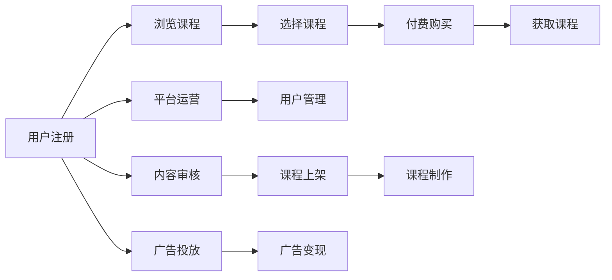

                 

## 1. 背景介绍

在数字化时代，人们获取知识的方式发生了翻天覆地的变化。从传统的书籍、课堂教学，到如今的网络课程、知识付费平台，知识传播的途径越来越多样化。然而，随着内容创作的门槛不断降低，知识付费市场也逐渐暴露出一些问题：内容同质化严重、价格虚高、用户体验不佳等。那么，知识付费真的值得投资吗？如何在这个竞争激烈的市场中脱颖而出？本文将为你详细解答。

### 1.1 知识付费市场现状

知识付费市场自2016年起快速发展，各类知识付费平台如雨后春笋般涌现。例如，得到、喜马拉雅、知乎live等。这些平台通常提供包括在线课程、电子书、音频内容等多种形式的知识产品。用户通过付费获取知识，满足自我提升和技能学习的需要。

知识付费市场的爆发式增长得益于以下几点：
- **学习需求增加**：快节奏的现代社会使得终身学习成为必然选择，越来越多的人希望通过付费获得专业的知识培训。
- **内容分发便捷**：移动互联网和智能设备的普及，使得知识获取更加方便快捷。
- **营销推广成功**：各大平台通过付费会员、KOL推荐、广告投放等手段，不断吸引用户注册付费，提升平台收入。

### 1.2 知识付费的优点

知识付费不仅能够满足用户的学习需求，还能带来以下几方面的优势：
- **时间成本低**：相比于传统的线下学习，知识付费产品随时随地可以访问，节省了大量时间。
- **学习效果高效**：知识付费产品通常由行业专家制作，内容质量有保障，学习效率高。
- **个性化学习**：根据用户的学习进度和兴趣，推荐适合的内容，提升学习体验。

## 2. 核心概念与联系

### 2.1 核心概念概述

在进行知识付费项目开发之前，需要理解几个核心概念：

- **知识付费平台**：提供付费内容的在线平台，如得到、喜马拉雅等。
- **课程制作**：制作高质量的付费课程，包括视频、音频、文本等形式。
- **平台运营**：包括用户管理、内容审核、广告投放等运营工作。
- **广告变现**：通过平台内广告展示，为品牌提供广告位，实现收入。

通过这些概念之间的联系，可以构建一个完整的知识付费平台。

### 2.2 核心概念原理和架构的 Mermaid 流程图



这个流程图展示了知识付费平台的基本流程：用户注册平台后浏览课程，选择感兴趣的课程进行付费购买，然后获取课程内容；同时，平台通过运营管理用户、审核内容、投放广告等方式，实现收入。

## 3. 核心算法原理 & 具体操作步骤

### 3.1 算法原理概述

知识付费平台的核心算法包括用户推荐、内容分发、广告推荐等。这些算法通过数据挖掘和机器学习技术，优化用户和内容的匹配度，提升平台的变现能力。

以用户推荐算法为例，其主要任务是通过分析用户行为和偏好，为用户推荐最适合的课程内容。常用的推荐算法包括协同过滤、基于内容的推荐、混合推荐等。协同过滤算法通过用户行为数据，找到相似用户并推荐其购买过的课程；基于内容的推荐算法通过分析课程内容特征，找到与用户兴趣相符的课程；混合推荐算法则结合多种推荐策略，提升推荐效果。

### 3.2 算法步骤详解

#### 3.2.1 用户行为数据采集

知识付费平台的推荐算法首先需要大量的用户行为数据。这些数据包括用户的浏览历史、搜索关键词、购买记录等。通过分析这些数据，可以构建用户画像，挖掘用户兴趣和偏好。

例如，某用户最近浏览了“Python编程基础”课程，购买了“数据分析与可视化”课程，那么推荐系统可以认为该用户对数据科学领域感兴趣。

#### 3.2.2 课程内容特征提取

内容特征提取是推荐算法的重要环节。通过分析课程标题、描述、大纲、用户评分等信息，可以提取出课程的核心特征。例如，“Python编程基础”课程可以提取出“Python语言”、“编程基础”、“入门级”等特征。

#### 3.2.3 推荐算法实现

推荐算法有多种实现方式，如基于协同过滤的算法、基于内容的推荐算法、混合推荐算法等。以下以基于协同过滤的推荐算法为例，介绍其实现过程。

##### 3.2.3.1 用户画像构建

用户画像包括用户的兴趣、偏好、历史行为等。通过分析用户的行为数据，可以构建用户画像。例如，某用户对数据科学、人工智能等课程表现出较高的兴趣，那么推荐系统可以为该用户推荐类似课程。

##### 3.2.3.2 课程相似度计算

课程相似度计算是协同过滤算法的重要环节。通过计算不同课程之间的相似度，可以找出与用户兴趣相符的课程。常用的相似度计算方法包括余弦相似度、皮尔逊相关系数等。

##### 3.2.3.3 推荐结果排序

推荐结果排序是推荐算法的最后一步。通过综合考虑用户画像和课程相似度，可以为每个用户推荐最合适的课程。常用的排序方法包括基于最大相关度排序、基于平均相关度排序等。

### 3.3 算法优缺点

#### 3.3.1 优点

- **个性化推荐**：通过分析用户行为，提供个性化推荐，提升用户满意度。
- **高精准度**：通过多种推荐策略的融合，提升推荐效果，减少误推荐。
- **高效扩展**：推荐算法可以高效扩展，适用于大规模平台。

#### 3.3.2 缺点

- **数据质量依赖高**：推荐算法的精准度高度依赖用户行为数据的质量。
- **推荐偏见**：用户行为数据中可能存在偏见，导致推荐结果不公平。
- **推荐漏洞**：用户数据可能存在不完整或虚假信息，导致推荐漏洞。

### 3.4 算法应用领域

知识付费平台的推荐算法可以应用于多个领域，如电商、新闻、音乐等。通过构建用户画像，分析用户行为，提供个性化推荐，提升用户满意度和平台收入。

## 4. 数学模型和公式 & 详细讲解 & 举例说明

### 4.1 数学模型构建

#### 4.1.1 协同过滤算法

协同过滤算法通过用户行为数据，找到相似用户并推荐其购买过的课程。其数学模型如下：

$$
\text{User}_{i,j} = \frac{\text{Cosine}(\text{Matrix}_i, \text{Matrix}_j)}{\sqrt{\text{Sum}(\text{Matrix}_i \times \text{Matrix}_i)} \times \sqrt{\text{Sum}(\text{Matrix}_j \times \text{Matrix}_j)}}
$$

其中，$\text{User}_{i,j}$表示用户i对用户j的相似度，$\text{Matrix}_i$和$\text{Matrix}_j$分别表示用户i和用户j的评分矩阵。

#### 4.1.2 基于内容的推荐算法

基于内容的推荐算法通过分析课程内容特征，找到与用户兴趣相符的课程。其数学模型如下：

$$
\text{User}_{i,j} = \frac{\text{Sum}(\text{Matrix}_i \times \text{Matrix}_j)}{\sqrt{\text{Sum}(\text{Matrix}_i \times \text{Matrix}_i)} \times \sqrt{\text{Sum}(\text{Matrix}_j \times \text{Matrix}_j)}}
$$

其中，$\text{User}_{i,j}$表示用户i和课程j之间的相似度，$\text{Matrix}_i$表示课程i的内容特征向量。

### 4.2 公式推导过程

#### 4.2.1 协同过滤算法推导

协同过滤算法的核心是计算用户i和用户j之间的相似度。余弦相似度的推导如下：

$$
\text{Cosine}(\text{Matrix}_i, \text{Matrix}_j) = \frac{\text{Sum}(\text{Matrix}_i \times \text{Matrix}_j)}{\sqrt{\text{Sum}(\text{Matrix}_i \times \text{Matrix}_i)} \times \sqrt{\text{Sum}(\text{Matrix}_j \times \text{Matrix}_j)}}
$$

其中，$\text{Sum}(\text{Matrix}_i \times \text{Matrix}_i)$表示用户i的评分矩阵的范数，$\text{Sum}(\text{Matrix}_j \times \text{Matrix}_j)$表示用户j的评分矩阵的范数。

#### 4.2.2 基于内容的推荐算法推导

基于内容的推荐算法的核心是计算用户i和课程j之间的相似度。其推导如下：

$$
\text{Sum}(\text{Matrix}_i \times \text{Matrix}_j) = \text{Sum}(\text{Matrix}_i) \times \text{Sum}(\text{Matrix}_j)
$$

其中，$\text{Sum}(\text{Matrix}_i)$表示课程i的内容特征向量，$\text{Sum}(\text{Matrix}_j)$表示课程j的内容特征向量。

### 4.3 案例分析与讲解

#### 4.3.1 协同过滤算法案例

假设某知识付费平台有100个用户，每个用户对10门课程进行了评分。通过协同过滤算法，可以构建用户画像，找到与用户兴趣相符的课程。例如，用户A对课程1、2、3进行了评分，用户B对课程4、5、6进行了评分，那么可以通过计算用户A和用户B之间的相似度，推荐课程1、2、3给用户B。

#### 4.3.2 基于内容的推荐算法案例

假设某知识付费平台有50门课程，每门课程包含10个内容特征。通过基于内容的推荐算法，可以分析课程特征，找到与用户兴趣相符的课程。例如，某用户对课程A、B、C感兴趣，那么可以通过分析课程A、B、C的内容特征，推荐与这些课程内容相似的课程。

## 5. 项目实践：代码实例和详细解释说明

### 5.1 开发环境搭建

知识付费平台的开发环境通常需要Python和相关框架的支持。以下是一个简单的开发环境搭建步骤：

1. **安装Python**：在Linux或Windows系统上安装Python 3.x版本。

2. **安装Pip**：确保系统已安装Pip，用于安装Python包。

3. **安装Flask**：Flask是一个轻量级Web框架，用于搭建知识付费平台的API接口。

4. **安装MySQL**：安装MySQL数据库，用于存储用户数据和课程数据。

5. **安装Redis**：安装Redis缓存系统，用于优化数据读取和存储。

6. **安装Nginx**：安装Nginx Web服务器，用于发布知识付费平台的Web应用。

### 5.2 源代码详细实现

以下是一个简单的知识付费平台的Python代码实现，包括用户注册、课程浏览、课程购买等功能。

```python
# 用户注册
def register_user(username, password):
    # 从数据库中获取用户信息
    user = get_user_from_db(username)
    if user is None:
        # 创建新用户，插入数据库
        create_user_in_db(username, password)
        return True
    else:
        return False

# 课程浏览
def browse_courses(username):
    # 从数据库中获取用户已浏览的课程
    courses = get_browsed_courses_from_db(username)
    # 从数据库中获取课程信息
    course_list = []
    for course_id in courses:
        course_info = get_course_from_db(course_id)
        course_list.append(course_info)
    return course_list

# 课程购买
def purchase_course(username, course_id):
    # 从数据库中获取课程信息
    course_info = get_course_from_db(course_id)
    # 检查课程价格
    if not course_info['price']:
        return False
    # 从数据库中获取用户余额
    user_balance = get_user_balance_from_db(username)
    if user_balance < course_info['price']:
        return False
    # 从数据库中更新用户余额
    update_user_balance_in_db(username, user_balance - course_info['price'])
    # 将课程加入用户已购买课程
    add_purchased_course_to_db(username, course_id)
    return True
```

### 5.3 代码解读与分析

上述代码实现了知识付费平台的部分功能，包括用户注册、课程浏览、课程购买等。其中，`register_user`函数用于注册新用户，`browse_courses`函数用于获取用户已浏览的课程，`purchase_course`函数用于购买课程。这些函数都从数据库中读取和写入数据，以实现平台的核心功能。

## 6. 实际应用场景

知识付费平台可以应用于多个实际场景，如在线教育、职业培训、技能提升等。通过为用户提供高质量的课程内容，帮助其提升技能和知识水平。

### 6.1 在线教育

在线教育平台提供各种形式的课程内容，包括视频课程、音频课程、文本课程等。用户可以根据自己的兴趣和需求，选择适合的课程进行学习。

### 6.2 职业培训

职业培训平台提供技能培训课程，帮助职场人士提升职业技能，增强竞争力。例如，IT技能培训、管理培训等。

### 6.3 技能提升

技能提升平台提供专业技能培训课程，帮助用户提升工作技能和生活技能。例如，英语培训、厨艺培训、编程培训等。

## 7. 工具和资源推荐

### 7.1 学习资源推荐

#### 7.1.1 Python编程

- **《Python编程：从入门到实践》**：入门Python编程的好书，涵盖Python基础知识和实际应用。
- **《流畅的Python》**：深入讲解Python高级特性和编程技巧，适合进阶学习。

#### 7.1.2 数据库

- **《MySQL必知必会》**：MySQL数据库的入门指南，讲解MySQL基本操作和高级特性。
- **《Redis设计与实现》**：讲解Redis缓存系统的原理和使用方法。

#### 7.1.3 Web开发

- **《Flask Web开发：实战》**：讲解Flask框架的实际应用，涵盖Flask的API开发、数据库操作等。
- **《Web开发实战》**：讲解Web开发的基础知识和实际应用，涵盖HTML、CSS、JavaScript等技术。

### 7.2 开发工具推荐

#### 7.2.1 IDE

- **PyCharm**：Python编程的IDE，支持Python的各种框架和库，适合开发知识付费平台。
- **Visual Studio Code**：轻量级代码编辑器，支持各种编程语言和插件，适合编写Python代码。

#### 7.2.2 数据库

- **MySQL Workbench**：MySQL数据库的管理工具，支持数据库设计和操作。
- **Redis Desktop Manager**：Redis缓存系统的管理工具，支持Redis数据库的操作和监控。

#### 7.2.3 Web服务器

- **Nginx**：高性能Web服务器，支持负载均衡、缓存等功能，适合发布知识付费平台的Web应用。

### 7.3 相关论文推荐

#### 7.3.1 推荐算法

- **《协同过滤推荐系统》**：介绍协同过滤算法的原理和实现方法。
- **《基于内容的推荐算法》**：介绍基于内容的推荐算法的原理和实现方法。

## 8. 总结：未来发展趋势与挑战

### 8.1 研究成果总结

知识付费平台通过推荐算法，为用户提供个性化推荐，提升用户体验和平台收入。未来，知识付费平台将在以下方面取得新的突破：

- **推荐算法优化**：通过多种推荐策略的融合，提升推荐效果，减少误推荐。
- **用户行为分析**：通过深度学习和数据分析技术，进一步提升用户画像的准确度。
- **多模态推荐**：结合视觉、语音、文本等多种模态数据，提升推荐效果。

### 8.2 未来发展趋势

未来，知识付费平台将在以下方面取得新的突破：

- **个性化推荐**：通过深度学习和数据分析技术，进一步提升推荐效果，减少误推荐。
- **多模态推荐**：结合视觉、语音、文本等多种模态数据，提升推荐效果。
- **实时推荐**：通过实时数据分析和推荐算法，提升推荐的时效性和精准度。

### 8.3 面临的挑战

知识付费平台在发展过程中也面临一些挑战：

- **数据质量**：推荐算法的精准度高度依赖用户行为数据的质量。如果用户行为数据存在偏差或不完整，可能导致推荐结果不准确。
- **用户粘性**：如何保持用户的持续活跃度，是知识付费平台的重要挑战。需要不断优化用户体验和推荐算法，提高用户满意度。
- **内容质量**：高质量课程的获取成本较高，如何保证课程内容的质量和更新频率，是知识付费平台的关键。

### 8.4 研究展望

未来，知识付费平台需要在以下方面进行研究：

- **内容多样化**：提供多种形式的课程内容，满足不同用户的需求。
- **社交互动**：通过社交功能，增强用户互动，提升用户体验。
- **数据分析**：通过深度学习和数据分析技术，提升用户画像的准确度，优化推荐算法。

## 9. 附录：常见问题与解答

### 9.1 常见问题解答

#### 9.1.1 如何保证课程质量？

课程质量是知识付费平台的核心。可以通过以下方法保证课程质量：
- **专家审核**：邀请行业专家审核课程内容，确保课程质量。
- **用户反馈**：收集用户反馈，对低质量课程进行下架或修改。
- **持续更新**：定期更新课程内容，保持课程的时效性和相关性。

#### 9.1.2 如何提高用户粘性？

用户粘性是知识付费平台的重要指标。可以通过以下方法提高用户粘性：
- **个性化推荐**：通过推荐算法，提供个性化推荐，提升用户满意度。
- **互动功能**：提供评论、讨论等互动功能，增强用户参与度。
- **会员制度**：通过会员制度，提供更多特权和优惠，提高用户忠诚度。

#### 9.1.3 如何降低用户流失？

用户流失是知识付费平台面临的主要问题。可以通过以下方法降低用户流失：
- **优质课程**：提供优质课程，满足用户的学习需求。
- **用户体验**：提升平台的用户体验，减少用户流失。
- **用户反馈**：收集用户反馈，及时解决问题，提升用户满意度。

---

作者：禅与计算机程序设计艺术 / Zen and the Art of Computer Programming

