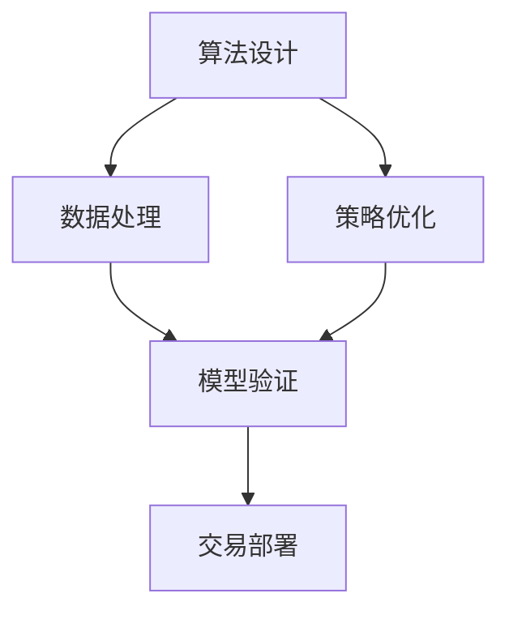

                 

# 如何将编程技能应用于量化交易

> 关键词：量化交易,Python,机器学习,算法交易,策略优化

## 1. 背景介绍

### 1.1 问题由来

量化交易（Quantitative Trading），也称为算法交易（Algorithmic Trading），是一种基于计算机程序化策略，在金融市场进行买卖交易的技术。它利用数学模型和计算机编程，对历史市场数据进行统计分析和预测，生成高频、低延迟、自动化的交易策略，旨在获取长期稳定的投资回报。量化交易起源于20世纪70年代，但近年来随着计算机技术的飞速发展和人工智能技术在金融领域的应用，其市场规模和影响力不断扩大，逐渐成为金融投资的重要工具。

量化交易的核心优势在于其高度客观性和系统性。通过数据驱动的策略，可以有效克服人类情感、心理等因素对交易决策的干扰，实现长期稳定盈利。同时，算法交易的高频操作可以充分利用市场波动，实现更高效的资金管理和风险控制。

然而，量化交易也面临诸多挑战。金融市场数据量大、复杂，交易策略的优化和验证需要大量的计算资源和时间。编程和数学模型的选择、优化和维护，都需要高水平的专业技能。

面对这些挑战，编程技能成为量化交易中不可或缺的一环。本文将从多个方面详细阐述如何将编程技能应用于量化交易，包括算法设计、数据处理、策略优化、回测和部署等关键环节，为量化交易的实践提供全面的技术指引。

## 2. 核心概念与联系

### 2.1 核心概念概述

在量化交易中，编程技能被广泛应用于多个环节，涵盖算法设计、数据处理、策略优化和模型验证等方面。以下是几个关键概念的介绍：

- **算法设计**：设计基于数学模型和计算机编程的交易策略，是量化交易的核心。常见的算法包括统计套利、均值回归、动量策略、高频交易等。

- **数据处理**：收集、清洗和处理大量金融市场数据，是量化交易的基础。数据处理包括数据采集、清洗、特征提取和特征工程等。

- **策略优化**：对设计好的交易策略进行参数调整和优化，以实现最优的性能表现。策略优化涉及多目标优化、蒙特卡罗模拟等方法。

- **模型验证**：使用历史数据对交易策略进行验证和测试，评估其稳定性和盈利能力。常用的验证方法包括历史回测、模拟交易和风险分析等。

这些概念之间存在紧密的联系，共同构成了量化交易的技术框架。通过编程技能将这些环节有机结合起来，可以实现高效的策略开发和验证，最终实现量化交易的实际应用。

### 2.2 核心概念原理和架构的 Mermaid 流程图



这个流程图展示了量化交易中编程技能的应用流程：

1. 首先，基于金融市场的数据，设计出合适的交易算法。
2. 对历史数据进行清洗和处理，提取关键特征。
3. 对交易算法进行参数优化和验证，评估其盈利性和稳定性。
4. 最终将优化后的交易策略部署到实际交易系统中，进行实时交易。

## 3. 核心算法原理 & 具体操作步骤
### 3.1 算法原理概述

量化交易的算法设计通常基于以下数学模型和理论：

- **统计套利**：利用不同市场之间的价格差异进行套利，常见于股票、期货等市场。
- **均值回归**：认为市场价格围绕其均值波动，可以通过预测价格回归均值进行交易。
- **动量策略**：观察到价格趋势具有惯性，可以根据价格历史变化进行交易。
- **高频交易**：利用算法高频地进行买卖操作，利用市场微小价格波动获取利润。

这些算法的设计和实现都依赖于编程技能。通过编程，可以实现复杂的数学模型和算法逻辑，进行高效的数据处理和策略优化。

### 3.2 算法步骤详解

下面以一个简单的统计套利算法为例，展示具体的编程实现步骤：

#### 步骤1: 数据采集与预处理

首先，需要从多个数据源采集金融市场数据，例如股票价格、期货价格、交易量等。这些数据通常以CSV或数据库格式存储，需要使用编程技能进行读取和清洗。

```python
import pandas as pd

# 从CSV文件读取数据
data = pd.read_csv('stock_data.csv')
```

#### 步骤2: 特征提取与工程

接下来，对收集到的数据进行特征提取和工程处理，例如计算均值、方差、动量等统计量。

```python
import numpy as np

# 计算股票价格均值
mean_price = np.mean(data['price'])
# 计算价格动量
momentum = data['price'].diff()
```

#### 步骤3: 策略设计

基于提取出的特征，设计统计套利策略。例如，可以构建一个简单的均值回归策略，买入低估股票，卖出高估股票。

```python
# 定义均值回归策略
def mean_reversion_strategy(data):
    mean_price = np.mean(data['price'])
    momentum = data['price'].diff()
    # 判断价格是否低估或高估
    underpriced = momentum < 0
    overpriced = momentum > 0
    # 买入低估股票，卖出高估股票
    return [1, -1][np.argmax([underpriced, overpriced])]
```

#### 步骤4: 策略优化

对设计的策略进行参数优化和回测，评估其稳定性和盈利能力。

```python
from sklearn.linear_model import LinearRegression
from sklearn.metrics import mean_squared_error

# 使用线性回归模型拟合价格变化
model = LinearRegression()
model.fit(momentum, data['price'])
# 计算预测误差
mse = mean_squared_error(data['price'], model.predict(momentum))
```

#### 步骤5: 模型验证

使用历史数据对策略进行验证和测试，评估其效果。

```python
# 使用回测工具进行历史数据测试
backtesting = BacktestingStrategy(data)
backtesting.test(mean_reversion_strategy)
```

#### 步骤6: 交易部署

将优化后的策略部署到实际交易系统中，进行实时交易。

```python
# 部署策略到交易系统
trading_system = TradingSystem()
trading_system.run(mean_reversion_strategy)
```

### 3.3 算法优缺点

量化交易算法的设计和实现具有以下优缺点：

#### 优点：

- **客观性**：算法交易决策基于数据和数学模型，避免人类情感和心理的干扰，实现客观决策。
- **系统性**：通过编程实现算法自动化，可以进行高频、低延迟的操作，提高资金管理和风险控制效率。
- **可重复性**：算法设计、验证和优化过程可以反复迭代，提高策略性能。

#### 缺点：

- **模型复杂**：设计复杂的数学模型和算法需要高水平的专业技能，开发周期较长。
- **数据依赖**：算法的性能依赖于数据的质量和特征工程的效果，数据偏差可能影响策略表现。
- **高频交易成本**：高频交易需要高性能计算资源和时间，增加交易成本。

### 3.4 算法应用领域

量化交易算法广泛应用于金融市场，包括股票、期货、外汇、债券等多个领域。常见应用场景包括：

- **股票交易**：基于历史价格、交易量等数据，设计股票交易策略。
- **期货交易**：利用期货合约间的价格差异，进行套利操作。
- **外汇交易**：基于汇率变化，设计外汇交易策略。
- **债券交易**：利用债券收益率变化，进行套利操作。
- **高频交易**：利用高频交易系统，捕捉市场微小价格波动。

## 4. 数学模型和公式 & 详细讲解 & 举例说明

### 4.1 数学模型构建

量化交易中的算法设计通常基于以下数学模型和理论：

- **均值回归模型**：假设市场价格围绕其均值波动，通过回归模型预测价格回归均值。
- **动量策略模型**：利用价格历史变化，构建价格动量模型。
- **统计套利模型**：利用不同市场之间的价格差异，构建套利策略模型。

### 4.2 公式推导过程

以均值回归模型为例，假设股票价格 $P_t$ 服从随机游走过程，即 $P_t = P_{t-1} + \epsilon_t$，其中 $\epsilon_t$ 为随机误差项。均值回归模型可以表示为：

$$
\mathbb{E}[P_t] = \mu
$$

其中 $\mu$ 为价格的期望值。根据中心极限定理，价格序列的样本均值 $\bar{P}$ 渐近地等于其期望值 $\mu$。因此，可以通过计算价格序列的样本均值来预测未来的价格变化。

### 4.3 案例分析与讲解

假设我们有一个股票价格序列 $P = \{P_1, P_2, ..., P_n\}$，其中 $P_i$ 表示第 $i$ 天的股票价格。根据均值回归模型，我们可以计算价格序列的样本均值 $\bar{P}$：

$$
\bar{P} = \frac{1}{n} \sum_{i=1}^n P_i
$$

然后，使用 $\bar{P}$ 来预测未来价格变化，例如在 $n+1$ 天后的价格 $P_{n+1}$：

$$
P_{n+1} = P_n + \delta P
$$

其中 $\delta P$ 为价格变化量，可以表示为：

$$
\delta P = \beta (\bar{P} - P_n)
$$

其中 $\beta$ 为均值回归系数，可以通过历史数据拟合得到。

## 5. 项目实践：代码实例和详细解释说明

### 5.1 开发环境搭建

量化交易的开发环境通常基于Python编程语言和相关开源库，如Pandas、NumPy、SciPy等。以下是Python环境的搭建步骤：

1. 安装Python：从官网下载并安装Python，选择最新版本。
2. 安装相关库：使用pip命令安装Python库，例如：
```bash
pip install pandas numpy scipy
```
3. 设置开发环境：创建虚拟环境，安装特定版本的Python和相关依赖库，例如：
```bash
conda create -n quant_trading python=3.8
conda activate quant_trading
```

### 5.2 源代码详细实现

下面以一个简单的均值回归策略为例，展示Python代码的实现：

```python
import pandas as pd
import numpy as np

def mean_reversion_strategy(data):
    # 计算价格序列的样本均值
    mean_price = np.mean(data['price'])
    # 计算价格动量
    momentum = data['price'].diff()
    # 判断价格是否低估或高估
    underpriced = momentum < 0
    overpriced = momentum > 0
    # 买入低估股票，卖出高估股票
    return [1, -1][np.argmax([underpriced, overpriced])]
```

### 5.3 代码解读与分析

**输入输出解释**：
- `data`：包含股票价格的Pandas DataFrame数据帧，格式为：
  ```python
  data = pd.DataFrame({
      'date': [date1, date2, ..., date_n],
      'price': [price1, price2, ..., price_n]
  })
  ```
- `mean_price`：计算价格序列的样本均值。
- `momentum`：计算价格动量，即价格变化率。
- `underpriced`和`overpriced`：判断价格是否低估或高估。
- `return`：根据价格是否低估或高估，返回买入或卖出的信号。

**代码实现**：
- `np.mean(data['price'])`：计算价格序列的样本均值。
- `data['price'].diff()`：计算价格动量，即价格变化率。
- `np.argmax([underpriced, overpriced])`：判断价格是否低估或高估，返回买入或卖出的信号。

### 5.4 运行结果展示

运行上述代码，可以得到量化交易策略的信号输出。例如，对于以下价格序列：

```python
data = pd.DataFrame({
    'date': ['2022-01-01', '2022-01-02', '2022-01-03', '2022-01-04', '2022-01-05'],
    'price': [100, 98, 97, 96, 95]
})
```

调用`mean_reversion_strategy(data)`，可以得到如下输出：

```python
mean_reversion_strategy(data)
# 输出：1
```

这表示在2022年1月4日，股票价格被低估，应该进行买入操作。

## 6. 实际应用场景

### 6.1 股票交易

股票交易是量化交易的主要应用场景之一。投资者可以通过编程技能设计复杂的交易策略，例如基于历史价格的均值回归策略、基于交易量的动量策略、基于基本面的基本面分析模型等。

### 6.2 期货交易

期货交易通常涉及多个市场之间的价格差异，设计高效的套利策略是关键。通过编程技能，可以实现复杂的套利逻辑，例如时间套利、价差套利、相关性套利等。

### 6.3 外汇交易

外汇市场具有高流动性和高波动性，设计高效的算法交易策略尤为重要。通过编程技能，可以实现高频交易、套利交易、对冲交易等策略。

### 6.4 未来应用展望

未来，量化交易将进一步融入人工智能和机器学习技术，实现更智能、更高效的交易策略。以下是一些可能的未来应用方向：

- **深度学习**：利用深度神经网络，设计更加复杂的交易策略，例如基于LSTM、RNN等模型。
- **自然语言处理**：利用NLP技术，提取和分析新闻、社交媒体等非结构化数据，辅助交易决策。
- **强化学习**：通过强化学习算法，实现自我学习、自我优化的交易策略。
- **大数据分析**：利用大数据技术，分析海量市场数据，发现新的交易机会。
- **多模态融合**：将股票价格、交易量、新闻、社交媒体等多模态数据融合，提高交易策略的准确性和鲁棒性。

## 7. 工具和资源推荐

### 7.1 学习资源推荐

为了帮助开发者掌握量化交易的编程技能，以下是一些优质的学习资源：

- **《Python量化交易实战》**：详细介绍了Python在量化交易中的应用，涵盖数据处理、策略设计、回测等环节。
- **《算法交易实战》**：讲解了量化交易的核心算法和实现方法，包括统计套利、均值回归、高频交易等。
- **Coursera《量化金融分析》课程**：斯坦福大学开设的课程，介绍了量化交易的基本概念和实现技术。
- **Kaggle量化交易竞赛**：通过参加Kaggle量化交易竞赛，积累实战经验，学习前沿技术。
- **《机器学习在金融中的应用》书籍**：介绍机器学习技术在金融领域的应用，包括量化交易、信用评分、风险管理等。

### 7.2 开发工具推荐

量化交易的开发工具通常包括Python编程语言和各种开源库，以下是一些常用的工具：

- **Pandas**：用于数据处理和分析，是量化交易的核心库。
- **NumPy**：用于数值计算和矩阵运算，提供了高效的数据处理能力。
- **SciPy**：提供了各种科学计算工具，包括统计分析、优化算法等。
- **Matplotlib**：用于数据可视化，展示交易策略的性能。
- **TensorFlow**：用于深度学习和神经网络模型开发。

### 7.3 相关论文推荐

量化交易涉及的数学和算法问题，一直是学术界和工业界的研究热点。以下是一些重要的相关论文：

- **High-Frequency Trading: A Practical Guide to Algorithmic Strategies and Trading Systems**：这本书详细介绍了高频交易的实现方法和策略优化。
- **Statistical Arbitrage: Pricing, Value, and Hedging**：这本书讲解了统计套利的基本概念和实现方法。
- **Machine Learning for Algorithmic Trading**：介绍了机器学习在量化交易中的应用，涵盖模型选择、特征工程、策略优化等。
- **The Volatility Surface**：讲解了期权定价模型和波动率计算，是量化交易的重要理论基础。

## 8. 总结：未来发展趋势与挑战

### 8.1 研究成果总结

量化交易经过多年的发展，已经取得了显著的成果，广泛应用于股票、期货、外汇等多个市场。编程技能在其中扮演了关键角色，从数据采集、特征提取到策略设计、优化和验证，都需要高水平的专业技能。未来，随着人工智能和机器学习技术的引入，量化交易将迎来更广阔的发展空间。

### 8.2 未来发展趋势

量化交易的未来发展趋势主要包括以下几个方面：

- **深度学习**：利用深度神经网络，设计更加复杂的交易策略，提高策略的稳定性和盈利性。
- **自然语言处理**：通过NLP技术，提取和分析非结构化数据，辅助交易决策。
- **强化学习**：利用强化学习算法，实现自我学习、自我优化的交易策略。
- **大数据分析**：利用大数据技术，分析海量市场数据，发现新的交易机会。
- **多模态融合**：将股票价格、交易量、新闻、社交媒体等多模态数据融合，提高交易策略的准确性和鲁棒性。

### 8.3 面临的挑战

量化交易在发展过程中仍面临诸多挑战，主要包括：

- **数据质量**：金融市场数据量大、复杂，数据质量对交易策略的性能影响显著。
- **模型复杂性**：设计复杂的数学模型和算法需要高水平的专业技能，开发周期较长。
- **高频交易成本**：高频交易需要高性能计算资源和时间，增加交易成本。
- **市场波动性**：金融市场具有高波动性，交易策略需要具备较高的鲁棒性和抗风险能力。

### 8.4 研究展望

未来的量化交易研究需要在以下几个方面寻求新的突破：

- **数据质量提升**：提高金融市场数据的采集和处理质量，减少数据偏差对策略性能的影响。
- **模型简化**：设计更加简单、高效的交易策略，降低开发复杂性和成本。
- **资源优化**：优化高频交易的计算资源和时间消耗，降低交易成本。
- **风险管理**：设计更强大的风险控制策略，提高系统的稳定性和鲁棒性。
- **可解释性**：增强交易策略的可解释性，提高算法的透明性和可信度。

总之，量化交易的未来发展离不开编程技能的持续进步，需要开发者不断探索和创新，以应对未来的挑战和机遇。只有勇于创新、敢于突破，才能在量化交易中取得更好的成绩。

## 9. 附录：常见问题与解答

**Q1: 量化交易与传统交易相比，有何优势？**

A: 量化交易的优势主要体现在以下几个方面：

- **客观性**：基于数据和数学模型，避免人类情感和心理的干扰，实现客观决策。
- **系统性**：通过编程实现算法自动化，可以进行高频、低延迟的操作，提高资金管理和风险控制效率。
- **可重复性**：算法设计、验证和优化过程可以反复迭代，提高策略性能。

**Q2: 量化交易中，如何选择算法和模型？**

A: 量化交易中算法和模型的选择应考虑以下几个因素：

- **数据类型**：根据交易数据的类型，选择适合的算法和模型。例如，股票价格数据适合使用均值回归模型，高频交易数据适合使用动量策略模型。
- **策略目标**：根据交易策略的目标，选择适合的算法和模型。例如，稳健的策略适合使用统计套利模型，高风险的策略适合使用高频交易模型。
- **市场特性**：根据市场的特性，选择适合的算法和模型。例如，成熟市场适合使用长线策略，新兴市场适合使用短线策略。

**Q3: 量化交易中，如何进行策略优化？**

A: 量化交易策略的优化通常包括以下几个步骤：

- **历史回测**：使用历史数据对策略进行回测，评估其稳定性和盈利能力。
- **参数优化**：通过网格搜索、贝叶斯优化等方法，优化交易策略的参数。
- **蒙特卡罗模拟**：使用蒙特卡罗模拟方法，评估策略在不同市场条件下的表现。
- **模型验证**：使用交叉验证、A/B测试等方法，验证模型的效果。

**Q4: 量化交易中，如何避免过拟合？**

A: 量化交易中避免过拟合的方法主要包括：

- **数据增强**：通过数据扩充、数据合成等方法，增加数据的多样性和数量。
- **正则化**：使用L2正则、Dropout等技术，防止模型过拟合。
- **模型简化**：简化模型的结构和参数，减少过拟合的风险。
- **早停机制**：在训练过程中，根据验证集的性能，及时停止训练，避免过拟合。

**Q5: 量化交易中，如何进行策略部署？**

A: 量化交易策略的部署通常包括以下几个步骤：

- **模型训练**：使用历史数据训练交易策略模型。
- **参数验证**：使用验证集验证模型的效果，调整模型参数。
- **回测验证**：使用回测工具对策略进行验证和测试。
- **交易系统集成**：将优化后的策略集成到交易系统中，进行实时交易。

---

作者：禅与计算机程序设计艺术 / Zen and the Art of Computer Programming

