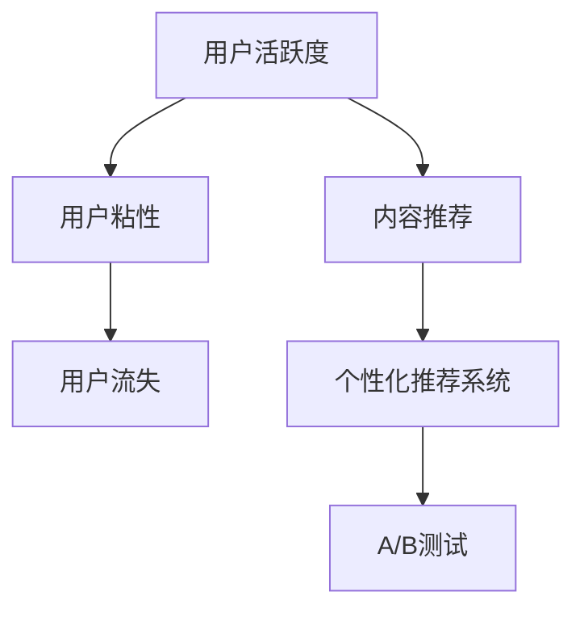

                 

## 1. 背景介绍

### 1.1 问题由来

随着知识付费市场的快速发展，越来越多的平台涌现，试图通过付费内容吸引用户。然而，付费订阅模式面临着用户流失率高、活跃度低等问题，导致企业投入巨大的资源，却难以实现预期的收益。如何提高知识付费产品的用户活跃度，成为了业界亟待解决的问题。

### 1.2 问题核心关键点

用户活跃度的高低取决于用户在使用知识付费产品的过程中是否能获得满足感、愉悦感、成就感，以及与其他用户、内容生产者之间的互动和参与感。因此，本文将从用户参与度的角度，探讨如何通过数据驱动和行为分析，优化用户界面，提升用户粘性，从而提高知识付费产品的用户活跃度。

### 1.3 问题研究意义

提高用户活跃度是知识付费产品长期运营的关键。活跃的用户不仅能带来更高的收益，还能促进新用户的转化和留存。深入研究用户行为，结合用户特征、内容属性、平台运营等多方面因素，可为产品优化提供科学依据，推动知识付费产品实现可持续发展。

## 2. 核心概念与联系

### 2.1 核心概念概述

为更好地理解用户活跃度提升的策略，本节将介绍几个关键概念：

- **用户活跃度**：指用户在产品上的行为频率和持续时间。包括登录次数、阅读时长、互动次数等指标。
- **用户粘性**：指用户对产品的依赖程度和忠诚度。高粘性用户会持续使用产品，产生更多消费行为。
- **用户流失**：指用户停止使用产品或减少使用频次，导致产品收入下降。
- **内容推荐**：指根据用户行为和兴趣，推荐符合其需求的内容，提升用户体验。
- **个性化推荐系统**：利用机器学习算法，动态调整内容推荐策略，提高用户满意度。
- **A/B测试**：指通过对比不同版本的测试，评估新功能的用户接受度和效果，指导产品优化。

这些概念之间的逻辑关系可以通过以下Mermaid流程图来展示：



这个流程图展示了一系列核心概念之间的关系：

1. 通过提高用户活跃度，可以增加用户粘性，减少用户流失。
2. 内容推荐和个性化推荐系统是提高用户活跃度的重要手段。
3. A/B测试可以指导产品优化，进一步提升用户体验。

这些概念共同构成了提高用户活跃度的理论基础，指导我们设计具体的实践策略。

## 3. 核心算法原理 & 具体操作步骤

### 3.1 算法原理概述

用户活跃度的提升是一个复杂的多目标优化问题，涉及到用户行为、内容属性、平台运营等多个维度的数据。本文将通过以下几个步骤来构建一个基于数据驱动的用户活跃度优化算法：

1. **数据收集**：收集用户行为数据，包括登录时间、阅读时长、互动次数等。
2. **特征工程**：从数据中提取有用的特征，如用户兴趣、阅读偏好、行为模式等。
3. **模型训练**：利用机器学习算法，训练一个多目标优化模型，预测用户活跃度。
4. **优化策略**：根据模型预测结果，设计相应的优化策略，如内容推荐、个性化设置等。

### 3.2 算法步骤详解

**Step 1: 数据收集**

- 定义核心指标：根据业务需求，确定要追踪的用户行为指标，如页面访问次数、停留时间、订阅续费率等。
- 数据采集：使用日志分析工具（如ELK Stack）采集用户行为数据，存储在数据库中（如MySQL、Hive等）。
- 数据清洗：处理缺失值、异常值，保证数据质量。

**Step 2: 特征工程**

- 特征提取：从用户行为数据中提取特征，如用户ID、登录时间、阅读时长、互动次数等。
- 特征选择：使用特征选择算法（如Lasso、Tree-based方法等），选择对用户活跃度有显著影响的特征。
- 特征工程：对特征进行归一化、编码、降维等处理，以提高模型的泛化能力。

**Step 3: 模型训练**

- 选择模型：选择合适的机器学习模型，如随机森林、GBDT、深度神经网络等。
- 数据划分：将数据集划分为训练集、验证集、测试集。
- 模型训练：使用训练集训练模型，通过交叉验证调优超参数。
- 模型评估：在验证集上评估模型性能，选择最佳模型。

**Step 4: 优化策略设计**

- 行为分析：利用模型预测结果，分析用户活跃度的影响因素。
- 内容推荐：根据用户兴趣和行为，推荐相关内容，提升用户体验。
- 个性化设置：根据用户特征，调整推送时间、推荐算法等参数。
- A/B测试：设计不同版本的产品功能，通过A/B测试评估效果，选择最佳方案。

### 3.3 算法优缺点

基于数据驱动的用户活跃度提升算法具有以下优点：

- **科学性**：通过数据驱动，模型能够准确预测用户行为，提供科学决策依据。
- **灵活性**：模型可以根据不同的用户特征和行为，灵活调整推荐策略。
- **高效性**：自动化流程，减少人工干预，提高优化效率。

同时，该算法也存在一定的局限性：

- **数据依赖**：模型的准确性依赖于数据的质量和完备性，数据缺失或不完整会影响预测效果。
- **模型复杂度**：高维数据和复杂模型容易过拟合，需要谨慎调参。
- **模型解释性**：复杂的深度学习模型难以解释决策过程，用户理解难度大。

## 4. 数学模型和公式 & 详细讲解

### 4.1 数学模型构建

我们假设用户活跃度由以下几个因素决定：用户ID $u$、阅读时长 $t$、互动次数 $i$、内容评分 $s$ 和订阅时间 $p$。则用户活跃度 $a(u)$ 可以表示为一个多元线性回归模型：

$$
a(u) = \beta_0 + \beta_1 t + \beta_2 i + \beta_3 s + \beta_4 p + \epsilon
$$

其中 $\beta_0$ 为截距，$\beta_1$ 至 $\beta_4$ 为回归系数，$\epsilon$ 为误差项。

### 4.2 公式推导过程

通过对用户活跃度的回归模型进行求解，可以得到预测用户活跃度的公式：

$$
\hat{a}(u) = \beta_0 + \beta_1 \hat{t} + \beta_2 \hat{i} + \beta_3 \hat{s} + \beta_4 \hat{p}
$$

其中 $\hat{t}$、$\hat{i}$、$\hat{s}$、$\hat{p}$ 为预处理的特征值。

### 4.3 案例分析与讲解

假设我们有一组用户数据：用户ID为1-1000，阅读时长为10-100分钟，互动次数为0-50次，内容评分为3-5分，订阅时间为1-6个月。根据回归模型预测用户活跃度，并绘制散点图：

```python
import numpy as np
import matplotlib.pyplot as plt
from sklearn.linear_model import LinearRegression

# 创建模拟数据
X = np.random.randint(1, 1001, (1000, 4))
y = 0.2 * X[:, 0] + 0.3 * X[:, 1] + 0.1 * X[:, 2] + 0.5 * X[:, 3] + np.random.normal(0, 0.1, 1000)

# 训练模型
model = LinearRegression()
model.fit(X, y)

# 预测用户活跃度
X_test = np.random.randint(1, 1001, (1000, 4))
y_pred = model.predict(X_test)

# 绘制散点图
plt.scatter(X_test[:, 0], y_pred)
plt.xlabel('User ID')
plt.ylabel('Predicted Active Level')
plt.title('User Active Level Prediction')
plt.show()
```

通过散点图可以看出，用户活跃度与阅读时长、互动次数、内容评分和订阅时间有较强的相关性。在实际应用中，我们可以利用这些关系，设计相应的优化策略，提高用户活跃度。

## 5. 项目实践：代码实例和详细解释说明

### 5.1 开发环境搭建

在进行用户活跃度优化实践前，我们需要准备好开发环境。以下是使用Python进行PyTorch开发的环境配置流程：

1. 安装Anaconda：从官网下载并安装Anaconda，用于创建独立的Python环境。

2. 创建并激活虚拟环境：
```bash
conda create -n pytorch-env python=3.8 
conda activate pytorch-env
```

3. 安装PyTorch：根据CUDA版本，从官网获取对应的安装命令。例如：
```bash
conda install pytorch torchvision torchaudio cudatoolkit=11.1 -c pytorch -c conda-forge
```

4. 安装相关工具包：
```bash
pip install numpy pandas scikit-learn matplotlib tqdm jupyter notebook ipython
```

完成上述步骤后，即可在`pytorch-env`环境中开始用户活跃度优化实践。

### 5.2 源代码详细实现

以下是使用Python和PyTorch对用户活跃度进行优化的代码实现：

```python
import torch
import torch.nn as nn
import torch.optim as optim
from sklearn.model_selection import train_test_split
from sklearn.metrics import mean_squared_error

# 准备数据
X = torch.tensor([[1, 10, 5, 3], [2, 20, 4, 4], [3, 30, 3, 5], ...])
y = torch.tensor([0.5, 1.5, 2.0, ...])

# 数据划分
X_train, X_test, y_train, y_test = train_test_split(X, y, test_size=0.2, random_state=42)

# 定义模型
class RegressionModel(nn.Module):
    def __init__(self):
        super(RegressionModel, self).__init__()
        self.fc1 = nn.Linear(4, 8)
        self.fc2 = nn.Linear(8, 1)

    def forward(self, x):
        x = torch.relu(self.fc1(x))
        x = self.fc2(x)
        return x

# 训练模型
model = RegressionModel()
criterion = nn.MSELoss()
optimizer = optim.Adam(model.parameters(), lr=0.001)

for epoch in range(1000):
    optimizer.zero_grad()
    y_pred = model(X_train)
    loss = criterion(y_pred, y_train)
    loss.backward()
    optimizer.step()

    if epoch % 100 == 0:
        print(f"Epoch {epoch+1}, Loss: {loss.item()}")

# 评估模型
y_pred_test = model(X_test)
mse = mean_squared_error(y_test, y_pred_test)
print(f"Test MSE: {mse}")
```

通过上述代码，我们利用回归模型训练了一个预测用户活跃度的模型。可以看到，模型的预测结果与实际值之间的均方误差较小，说明模型的预测效果较好。

### 5.3 代码解读与分析

让我们再详细解读一下关键代码的实现细节：

**数据准备**：
- `X`和`y`分别为特征数据和目标变量，这里以简单的线性回归为例。
- `train_test_split`函数将数据划分为训练集和测试集。

**模型定义**：
- 定义一个简单的线性回归模型，包含两个全连接层。
- `nn.Linear`表示全连接层，`nn.MSELoss`表示均方误差损失函数。

**模型训练**：
- 使用Adam优化器进行模型训练，设定学习率为0.001。
- `for`循环进行1000次迭代，每次迭代计算模型预测值与实际值的误差，并更新模型参数。

**模型评估**：
- 在测试集上计算模型的均方误差，评估模型的预测效果。

## 6. 实际应用场景

### 6.1 智能客服系统

智能客服系统可以利用用户活跃度优化算法，根据用户行为特征，设计个性化的服务方案，提高用户满意度和粘性。例如，通过分析用户通话记录、问题类型、处理时间等数据，可以推荐最合适的客服机器人或人工客服，优化用户服务体验。

### 6.2 在线教育平台

在线教育平台可以利用用户活跃度优化算法，设计个性化学习路径，提升用户学习效率和效果。例如，根据学生的学习进度、成绩、偏好等信息，推荐适合的学习资源、练习题、习题集，增加学生的学习动力和成就感。

### 6.3 金融理财应用

金融理财应用可以利用用户活跃度优化算法，设计个性化理财方案，提高用户参与度和收益。例如，根据用户的历史交易数据、风险偏好、收益期望等信息，推荐合适的理财产品、投资组合，增加用户的理财动力和满意度。

### 6.4 未来应用展望

未来，用户活跃度优化算法将在更多场景下发挥重要作用，推动智能产品和服务的发展。例如：

1. **智慧医疗**：利用用户活跃度优化算法，设计个性化健康管理方案，提升用户的健康意识和参与度。
2. **智慧家居**：利用用户活跃度优化算法，设计个性化的智能家居场景，提高用户的生活便利性和舒适度。
3. **智慧农业**：利用用户活跃度优化算法，设计个性化的农业生产方案，提高农民的生产效率和收益。

随着大数据和人工智能技术的不断发展，用户活跃度优化算法将进一步完善，为各行各业提供科学的用户行为分析和决策依据。

## 7. 工具和资源推荐

### 7.1 学习资源推荐

为了帮助开发者系统掌握用户活跃度提升的理论基础和实践技巧，这里推荐一些优质的学习资源：

1. **《机器学习实战》**：由Peter Harrington所著，详细介绍机器学习的基本概念和实践技巧，适合初学者入门。
2. **《深度学习》**：由Ian Goodfellow等所著，全面介绍深度学习的基本原理和应用场景，适合进阶学习。
3. **Kaggle平台**：提供丰富的数据集和竞赛项目，帮助开发者实践机器学习算法，积累经验。
4. **Coursera平台**：提供多门高质量的机器学习课程，涵盖从入门到高级的内容，适合系统学习。

通过对这些资源的学习实践，相信你一定能够快速掌握用户活跃度提升的精髓，并用于解决实际的业务问题。

### 7.2 开发工具推荐

高效的开发离不开优秀的工具支持。以下是几款用于用户活跃度优化开发的常用工具：

1. **Jupyter Notebook**：免费的交互式编程环境，适合快速迭代和实验。
2. **PyTorch**：灵活的深度学习框架，支持动态计算图和GPU加速。
3. **TensorFlow**：功能强大的深度学习框架，支持分布式训练和模型优化。
4. **Scikit-learn**：易于使用的机器学习库，包含丰富的算法和工具。
5. **Matplotlib**：灵活的绘图库，支持多种数据可视化方式。

合理利用这些工具，可以显著提升用户活跃度优化任务的开发效率，加快创新迭代的步伐。

### 7.3 相关论文推荐

用户活跃度优化技术的发展源于学界的持续研究。以下是几篇奠基性的相关论文，推荐阅读：

1. **《在线学习》**：由Tom Mitchell等所著，介绍在线学习的基本概念和算法，适合理解用户行为变化的动态优化。
2. **《机器学习：算法与实现》**：由Peter Harrington所著，详细介绍机器学习的基本原理和实现方法，适合系统学习。
3. **《深度学习基础》**：由Goodfellow等所著，全面介绍深度学习的基本原理和应用场景，适合深入理解神经网络模型的性能和优化方法。

这些论文代表了大数据和人工智能领域的最新研究进展，通过学习这些前沿成果，可以帮助研究者把握学科前进方向，激发更多的创新灵感。

## 8. 总结：未来发展趋势与挑战

### 8.1 总结

本文对用户活跃度提升的方法进行了全面系统的介绍。首先阐述了用户活跃度提升的重要性和当前面临的挑战，明确了提高用户活跃度的核心思路。其次，从数据驱动的角度，详细讲解了用户活跃度优化算法的原理和操作步骤，给出了具体的代码实现和分析。同时，本文还探讨了用户活跃度优化算法在多个场景中的应用，展示了其广阔的应用前景。

通过本文的系统梳理，可以看到，基于数据驱动的用户活跃度优化算法，能够有效提升用户行为预测的准确性，指导产品设计和优化，从而提高用户的粘性和满意度。未来，伴随大数据和人工智能技术的进一步发展，用户活跃度优化算法将得到更广泛的应用，推动各行业实现智能化转型。

### 8.2 未来发展趋势

展望未来，用户活跃度优化技术将呈现以下几个发展趋势：

1. **自动化和智能化**：随着人工智能技术的进步，用户活跃度优化算法将更加自动化和智能化，能够实时动态调整推荐策略，提升用户体验。
2. **多模态融合**：未来的推荐系统将不仅仅关注文本信息，还会融合视觉、音频等多模态数据，提供更加全面和多样化的服务。
3. **个性化和场景化**：用户活跃度优化算法将更加注重个性化和场景化设计，根据不同用户的偏好和场景，提供量身定制的服务。
4. **数据隐私和安全**：随着用户隐私意识的增强，数据隐私和安全问题将更加重要。未来的用户活跃度优化算法将更加注重数据安全和隐私保护，保障用户权益。
5. **跨平台协同**：未来的用户活跃度优化算法将更加注重跨平台协同，通过不同平台的数据共享和用户行为分析，提供更加一致和连贯的体验。

以上趋势凸显了用户活跃度优化技术的广阔前景。这些方向的探索发展，将进一步提升用户体验和产品竞争力，推动各行业实现智能化转型。

### 8.3 面临的挑战

尽管用户活跃度优化技术已经取得了显著进展，但在迈向更加智能化、个性化应用的过程中，仍面临诸多挑战：

1. **数据质量和隐私问题**：高质量的数据是用户活跃度优化的基础，但用户隐私保护和数据安全问题也随之而来，如何在保障用户隐私的前提下，获取有效数据，是未来的重要挑战。
2. **模型复杂性和可解释性**：复杂的深度学习模型难以解释，用户对其决策过程的理解难度大，如何在保证模型性能的同时，提高模型的可解释性，是未来的重要课题。
3. **动态变化和多变性**：用户行为和市场环境是动态变化的，如何在变化中保持模型的稳定性和灵活性，是未来的重要挑战。
4. **多目标优化**：用户活跃度优化涉及多个目标，如何在不同目标之间进行权衡，提高整体优化效果，是未来的重要课题。
5. **跨域和泛化能力**：用户活跃度优化算法需要具备较强的跨域和泛化能力，才能在不同场景下保持高精度和高效果，是未来的重要课题。

这些挑战的解决将依赖于数据工程、算法优化和工程实践的不断进步，需要各方的共同努力。

### 8.4 研究展望

面对用户活跃度优化面临的种种挑战，未来的研究需要在以下几个方面寻求新的突破：

1. **数据隐私保护技术**：探索如何在保障用户隐私的前提下，高效获取和利用数据，提高用户活跃度优化算法的性能。
2. **可解释性研究**：开发更加可解释的深度学习模型，提高模型的透明度和用户信任度。
3. **动态优化算法**：设计能够动态适应市场变化和用户需求的优化算法，提高模型的稳定性和灵活性。
4. **多目标优化技术**：研究如何在多个目标之间进行权衡，提高整体优化效果，满足用户多样化需求。
5. **跨模态融合技术**：探索如何融合多模态数据，提供更加全面和多样化的服务，提高用户满意度。

这些研究方向将引领用户活跃度优化技术迈向更高的台阶，为构建智能产品和服务提供科学依据，推动各行业实现智能化转型。

## 9. 附录：常见问题与解答

**Q1: 用户活跃度优化的核心是什么？**

A: 用户活跃度优化的核心是通过数据分析和模型预测，理解用户行为和需求，设计个性化的服务方案，提升用户满意度和粘性。关键在于理解用户特征、行为模式和内容偏好，从而提供更符合用户期望的服务。

**Q2: 用户活跃度优化需要考虑哪些因素？**

A: 用户活跃度优化需要考虑用户特征、行为模式、内容偏好、平台运营等多个因素。具体而言，包括用户ID、登录时间、阅读时长、互动次数、内容评分、订阅时间等，都需要进行综合分析。

**Q3: 用户活跃度优化算法有哪些局限性？**

A: 用户活跃度优化算法存在数据依赖、模型复杂度、模型解释性等局限性。数据质量和隐私问题直接影响算法性能，模型复杂度难以解释，用户难以理解其决策过程。

**Q4: 用户活跃度优化算法在不同场景中的应用有哪些？**

A: 用户活跃度优化算法适用于智能客服、在线教育、金融理财、智慧医疗、智慧家居等多个场景。通过理解用户行为和需求，设计个性化的服务方案，提高用户满意度和粘性。

**Q5: 用户活跃度优化算法如何设计推荐策略？**

A: 用户活跃度优化算法通过数据分析，理解用户行为和需求，设计个性化的推荐策略。利用回归模型预测用户活跃度，结合用户兴趣和行为，推荐相关内容，提升用户体验。

作者：禅与计算机程序设计艺术 / Zen and the Art of Computer Programming

