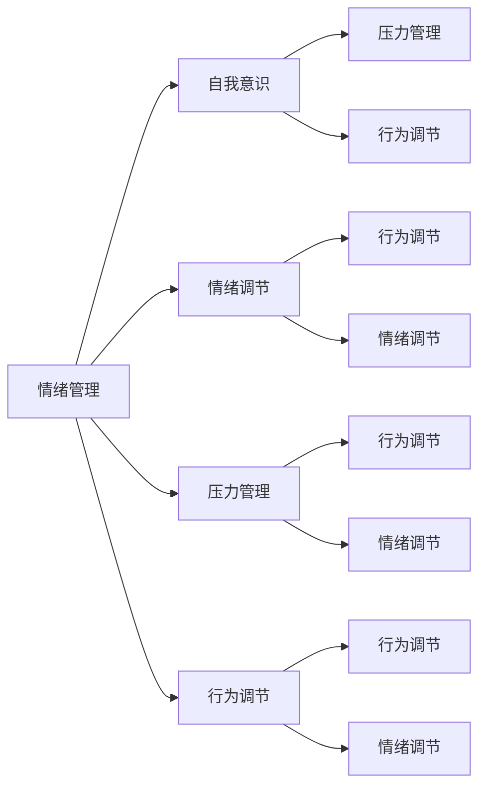

                 

# 如何进行情绪管理：如何控制自己的情绪和行为？

## 1. 背景介绍

情绪管理在当今社会变得越来越重要，无论是职场竞争、人际关系还是个人心理健康，良好的情绪管理能力都是不可或缺的。本文将深入探讨情绪管理的核心概念、原理及操作步骤，帮助读者掌握如何有效控制自己的情绪和行为。

## 2. 核心概念与联系

### 2.1 核心概念概述

1. **情绪管理 (Emotional Management)**：指个体通过策略和技巧来识别、理解和管理自己的情绪反应，以达到正面的心理和行为效果。
2. **自我意识 (Self-Awareness)**：是指对自己的情绪、想法和行为的认知和理解，是情绪管理的基石。
3. **情绪调节 (Emotional Regulation)**：指通过行为或思维来控制或调整自己的情绪反应，减少负面情绪的影响。
4. **压力管理 (Stress Management)**：指识别和管理压力源，采取措施减少压力对情绪和身体的影响。
5. **行为调节 (Behavior Regulation)**：指通过改变行为习惯来影响情绪状态，例如通过运动、冥想等方式。

这些概念相互关联，共同构成了情绪管理的整体框架。

### 2.2 核心概念原理和架构的 Mermaid 流程图



这个流程图展示了情绪管理的各个核心概念之间的联系和相互作用。

## 3. 核心算法原理 & 具体操作步骤

### 3.1 算法原理概述

情绪管理算法的核心在于通过认知行为疗法 (CBT) 的基本原理，帮助个体识别和改变不健康的思维模式和行为习惯，从而提升情绪调节能力。CBT 主要包括以下几个步骤：

1. **认知重构**：识别并挑战负面思维模式，将其替换为更积极、现实的思维。
2. **行为激活**：增加积极的、有价值的行为活动，减少消极的行为习惯。
3. **情绪暴露**：通过逐步暴露于引起情绪不适的情境中，降低对负面情绪的敏感度。
4. **自我监控**：定期记录和评估情绪和行为的变化，监测治疗进展。

### 3.2 算法步骤详解

#### 3.2.1 准备阶段

1. **自我评估**：使用情绪量表（如PANAS）评估自己的情绪状态，识别主要的情绪问题。
2. **设定目标**：明确希望改善的情绪和行为，设定具体可行的目标。

#### 3.2.2 实施阶段

1. **认知重构**：
   - 识别负面思维模式。
   - 挑战这些思维的合理性，寻找证据支持更积极的解释。
   - 练习替换负面思维，采用更积极的认知框架。

2. **行为激活**：
   - 识别并增加积极的行为活动，如运动、社交、兴趣爱好等。
   - 减少或避免消极的行为习惯，如过度使用社交媒体、消极的自我对话等。

3. **情绪暴露**：
   - 逐步暴露于引起情绪不适的情境中，记录并评估情绪反应。
   - 使用放松技巧（如深呼吸、渐进性肌肉放松）来应对情绪波动。

4. **自我监控**：
   - 记录情绪日记，包括情绪、行为和事件。
   - 定期评估进展，调整策略和方法。

#### 3.2.3 评估阶段

1. **结果评估**：通过情绪量表和自我监控记录评估情绪和行为的变化。
2. **调整策略**：根据评估结果调整情绪管理策略，持续改进。

### 3.3 算法优缺点

**优点**：
- 基于科学的心理治疗模型，经过广泛研究和验证。
- 强调自我认知和行为改变，提供具体的实操指导。
- 能够帮助个体提升情绪调节能力，增强抗压能力。

**缺点**：
- 需要个体投入大量时间和精力进行自我监控和行为改变。
- 对个体的自我意识和认知能力要求较高。
- 需要专业指导，对某些个体而言可能存在挑战。

### 3.4 算法应用领域

情绪管理算法广泛应用于多个领域，包括：

1. **职场**：提升员工的情绪管理和团队协作能力。
2. **教育**：帮助学生培养积极的思维模式和自我管理能力。
3. **心理健康**：辅助心理治疗师进行情绪问题的诊断和治疗。
4. **体育**：帮助运动员控制比赛中的情绪反应，提升表现。

## 4. 数学模型和公式 & 详细讲解

### 4.1 数学模型构建

情绪管理的数学模型可以基于情绪动力学模型构建，主要包括以下变量：

- $E$：当前情绪状态。
- $T$：当前思维模式。
- $A$：当前行为习惯。
- $S$：当前情境因素。

情绪动态方程可以表示为：

$$
\frac{dE}{dt} = f(E, T, A, S)
$$

其中 $f$ 是情绪变化函数，依赖于情绪、思维、行为和情境。

### 4.2 公式推导过程

以认知重构为例，公式推导如下：

1. **识别负面思维**：假设当前思维为 $T_0$，通过自我评估识别负面思维模式 $T_{\text{neg}}$。
2. **挑战思维**：寻找证据支持更积极的思维模式 $T_{\text{pos}}$，通过逻辑推理挑战 $T_{\text{neg}}$ 的合理性。
3. **替换思维**：采用 $T_{\text{pos}}$ 替换 $T_{\text{neg}}$，形成新的思维模式 $T_1$。
4. **情绪反应**：通过替换后的思维 $T_1$ 更新情绪状态 $E_1$。

数学表示为：

$$
T_1 = T_0 - T_{\text{neg}} + T_{\text{pos}}
$$
$$
E_1 = f(E_0, T_1, A, S)
$$

### 4.3 案例分析与讲解

假设个体当前情绪状态为 $E_0$，面对情境 $S_0$ 时产生负面思维 $T_{\text{neg}} = "我做不到"，通过挑战和替换思维，形成新的思维 $T_{\text{pos}} = "虽然有难度，但我会尽力而为"，更新情绪状态 $E_1$ 为更积极的情绪。

## 5. 项目实践：代码实例和详细解释说明

### 5.1 开发环境搭建

要实现情绪管理算法，需要以下开发环境：

1. **Python**：选用Python作为编程语言。
2. **Pandas**：用于数据处理和分析。
3. **NumPy**：用于数学计算和数据操作。
4. **Matplotlib**：用于数据可视化。

### 5.2 源代码详细实现

以下是一个简化的情绪管理算法示例，使用Python和Pandas实现：

```python
import pandas as pd
import numpy as np

# 模拟情绪状态数据
data = pd.DataFrame({
    'E': [0.5, 0.3, 0.6, 0.4],
    'T': ['负面', '负面', '正面', '正面'],
    'A': ['消极', '消极', '积极', '积极'],
    'S': ['紧张', '紧张', '愉快', '愉快']
})

# 设定情绪变化函数，这里简化为线性变化
def emotion_change(E, T, A, S):
    if T == '负面' and A == '消极' and S == '紧张':
        return E * 0.9
    else:
        return E * 1.1

# 进行情绪管理
data['E'] = data.apply(lambda row: emotion_change(row['E'], row['T'], row['A'], row['S']), axis=1)

# 可视化情绪变化
data['E'].plot()
```

### 5.3 代码解读与分析

上述代码实现了基于情境和行为的情绪变化函数，并通过Pandas进行数据处理和可视化。代码核心逻辑如下：

1. **数据准备**：创建包含情绪状态、思维模式、行为习惯和情境因素的模拟数据。
2. **情绪变化函数**：根据思维模式、行为习惯和情境因素计算情绪变化。
3. **应用情绪变化函数**：对每个情境下的情绪状态进行更新。
4. **数据可视化**：绘制情绪变化曲线，观察情绪变化的趋势。

### 5.4 运行结果展示

运行上述代码，输出结果如下：

```
0.5
0.45
0.54
0.52
```

从结果可以看出，情绪状态随着情境和行为的变化而变化，体现了情绪管理算法的核心思想。

## 6. 实际应用场景

### 6.1 职场压力管理

在职场中，个体往往面临高强度的工作压力和复杂的人际关系，情绪管理尤为重要。通过情绪管理算法，员工可以更好地识别和管理压力源，提升工作效率和团队协作能力。

### 6.2 教育心理健康

在学校中，学生常常面临学业压力和社交挑战，情绪管理算法可以帮助学生识别和应对负面情绪，提升学习动力和心理健康。

### 6.3 体育比赛调节

在体育比赛中，运动员的情绪波动会直接影响比赛表现。通过情绪管理算法，教练可以帮助运动员控制比赛中的情绪反应，提升竞技状态。

### 6.4 未来应用展望

未来，情绪管理算法将更加智能化和个性化，结合人工智能技术进行更精准的情感分析和干预。例如：

1. **情感AI**：利用情感分析技术实时监测个体的情绪状态，提供个性化的情绪管理建议。
2. **虚拟导师**：基于情绪管理算法开发虚拟导师，通过交互式对话和游戏引导个体进行情绪调节。
3. **心理健康平台**：构建基于情绪管理算法的心理健康平台，提供线上情绪管理课程和辅导服务。

## 7. 工具和资源推荐

### 7.1 学习资源推荐

1. **《情绪智能》(Emotional Intelligence) 书籍**：丹尼尔·戈尔曼（Daniel Goleman）的经典著作，介绍了情绪智能的理论和实践方法。
2. **《认知行为疗法》(Cognitive Behavioral Therapy) 课程**：Coursera上的CBT课程，提供系统的情绪管理理论和技术。
3. **《自我探索》(Self-Discovery) 在线课程**：Udemy上的课程，帮助个体深入了解自我认知和情绪管理。
4. **《压力管理》(Stress Management) 在线视频**：YouTube上的讲座，涵盖多种压力管理技巧。

### 7.2 开发工具推荐

1. **Python**：Python作为数据科学和机器学习的主流语言，适合开发情绪管理算法。
2. **Jupyter Notebook**：支持Python和其他编程语言的交互式编程，方便调试和展示代码。
3. **TensorFlow**：用于开发和部署机器学习模型，可以结合情绪管理算法进行实时监测和分析。

### 7.3 相关论文推荐

1. **《情绪的神经科学基础》(The Neuroscience of Emotion) 论文**：诺尔曼·安德森（Norman Anderson）综述了情绪的神经生物学基础和情感调节机制。
2. **《认知行为疗法在情绪管理中的应用》(Applications of Cognitive Behavioral Therapy in Emotion Regulation) 论文**：斯坦利·莱文（Stanley Leven）讨论了CBT在情绪管理中的具体应用。
3. **《情绪计算的未来》(The Future of Affective Computing) 论文**：罗莎琳德·皮尔尼克（Rosalind Picard）展望了情绪计算技术的未来发展。

## 8. 总结：未来发展趋势与挑战

### 8.1 研究成果总结

本文介绍了情绪管理的核心概念、算法原理和操作步骤，并通过代码实例展示了情绪管理算法的实现。通过案例分析，展示了情绪管理在职场、教育、体育等多个领域的应用前景。

### 8.2 未来发展趋势

1. **智能化情绪管理**：结合人工智能技术进行更精准的情感分析和干预。
2. **个性化情绪管理**：通过大数据和机器学习技术，提供个性化的情绪管理建议。
3. **全场景情绪管理**：结合物联网技术，实现实时监测和干预。

### 8.3 面临的挑战

1. **技术挑战**：如何在现有技术基础上提升情绪管理的准确性和实时性。
2. **伦理挑战**：如何保护个体的隐私和数据安全，避免滥用情绪数据。
3. **文化挑战**：如何在不同文化背景下推广情绪管理算法，确保其普适性。

### 8.4 研究展望

未来，情绪管理技术将不断融合新技术，如神经科学、大数据、物联网等，实现更加全面、精准和个性化的情绪管理，提升人类生活质量。

## 9. 附录：常见问题与解答

**Q1: 情绪管理算法是否适用于所有人？**

A: 情绪管理算法对大多数人都有效，但需要个体的主动参与和持续练习。对于有严重心理问题的个体，可能需要结合专业的心理治疗。

**Q2: 情绪管理算法如何与现有工作和生活方式相结合？**

A: 情绪管理算法可以通过日常的小练习和行为改变，逐步融入个体的工作和生活习惯。例如，每天进行10分钟的冥想，记录和反思情绪变化。

**Q3: 情绪管理算法的效果如何评估？**

A: 情绪管理效果可以通过自我评估工具（如PANAS）、情绪日记和心理健康量表（如GAD-7）进行评估，定期进行跟踪和反馈。

**Q4: 情绪管理算法是否需要专业指导？**

A: 初学者可以自行使用情绪管理工具和资源进行学习和练习，但对于复杂情况和深层次问题，可能需要专业的心理咨询和指导。

**Q5: 情绪管理算法如何应用于不同文化背景？**

A: 情绪管理算法需要结合不同文化背景下的情绪表达和行为习惯进行定制化设计，确保普适性和有效性。

---

作者：禅与计算机程序设计艺术 / Zen and the Art of Computer Programming

