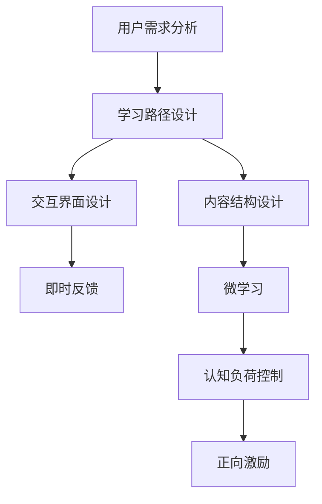

                 

## 1. 背景介绍

在当前数字化时代，用户体验(UX)和用户教育(UX Education)成为驱动产品成功的重要因素。一个成功的用户引导和教育策略，不仅能提升用户对产品的理解和满意度，还能降低用户获取成本，提高用户留存率和转化率。本文将深入探讨如何进行有效的用户引导和教育，从理论到实践，提供全面的指导和策略。

### 1.1 问题由来

随着移动互联网和数字技术的发展，越来越多的产品和服务从线下转移到线上。这使得用户引导和教育变得尤为重要。传统的纸质手册和现场演示已经无法满足用户需求，如何通过数字化手段提升用户体验，是产品经理和开发者面临的重大挑战。

### 1.2 问题核心关键点

有效的用户引导和教育需要明确以下几个核心关键点：

- **用户需求分析**：理解用户在使用产品时遇到的问题和挑战。
- **学习路径设计**：根据用户需求，设计合理的学习路径和内容结构。
- **交互界面设计**：创建直观、易于理解的交互界面，引导用户完成学习过程。
- **反馈和激励机制**：通过及时的反馈和激励，增强用户的学习动机和效果。

本文将围绕以上关键点，系统性地介绍如何进行有效的用户引导和教育。

## 2. 核心概念与联系

### 2.1 核心概念概述

为了更好地理解如何进行有效的用户引导和教育，本文将介绍几个关键概念及其联系：

- **用户引导**：通过明确的指示和说明，帮助用户快速上手并掌握产品功能。
- **用户教育**：通过深入的内容讲解，提升用户对产品深层次功能的理解和应用。
- **微学习(Microlearning)**：将复杂的知识分解为小片段，通过多次学习来掌握。
- **认知负荷理论(Cognitive Load Theory)**：通过控制信息量，避免用户认知负荷过重。
- **反馈和激励机制**：通过即时反馈和正向激励，提高用户的学习效果。

### 2.2 核心概念原理和架构的 Mermaid 流程图



这个流程图展示了用户引导和教育的主要步骤及其联系：

1. 通过用户需求分析，明确用户的学习目标和需求。
2. 根据用户需求设计学习路径，并组织内容结构。
3. 设计直观的交互界面，帮助用户完成学习过程。
4. 采用微学习策略，将复杂知识分解为小片段进行学习。
5. 控制认知负荷，避免信息过载。
6. 通过即时反馈和正向激励，增强用户的学习效果。

## 3. 核心算法原理 & 具体操作步骤

### 3.1 算法原理概述

用户引导和教育本质上是一个信息传递和认知转换的过程。有效的用户引导和教育策略需要从用户的认知特征和行为习惯出发，设计合理的学习路径和交互方式。

**核心算法原理**：

- **知识地图(Knowledge Map)**：通过构建知识图谱，将复杂知识体系分解为有机的结构单元。
- **微学习(Microlearning)**：将复杂知识分解为小片段，便于用户逐步掌握。
- **认知负荷理论(Cognitive Load Theory)**：通过控制信息量，避免用户认知负荷过重。
- **反馈和激励机制**：通过及时反馈和正向激励，增强用户的学习动机和效果。

### 3.2 算法步骤详解

**第一步：用户需求分析**

- **收集用户反馈**：通过问卷调查、用户访谈、使用数据分析等方式，收集用户在使用产品时遇到的问题和需求。
- **分析用户特征**：识别不同用户群体的特征，如年龄、职业、技术水平等，设计有针对性的引导和教育内容。

**第二步：设计学习路径**

- **确定学习目标**：根据用户需求，明确学习路径的目标，如掌握基本功能、深入了解特定功能等。
- **设计内容结构**：根据目标设计学习内容，将知识分为核心内容、扩展内容和高级内容，并按照优先级排序。

**第三步：设计交互界面**

- **创建直观界面**：设计直观、易用的界面元素，如按钮、图标、提示文字等，引导用户完成学习过程。
- **采用微学习策略**：将复杂知识分解为小片段，逐步展示和引导用户学习。

**第四步：控制认知负荷**

- **控制信息量**：每次展示的信息量不宜过多，避免用户认知负荷过重。
- **采用可视化工具**：通过图表、动画等可视化工具，帮助用户更直观地理解复杂概念。

**第五步：反馈和激励机制**

- **即时反馈**：在用户完成某个学习任务后，立即给予反馈，如提示完成、展示结果等。
- **正向激励**：通过奖励、徽章、排行榜等方式，增强用户的学习动机和成就感。

### 3.3 算法优缺点

**优点**：

- **提升用户体验**：通过合理的引导和教育，帮助用户快速掌握产品功能，提升用户体验。
- **降低获取成本**：减少用户自主学习的成本，提高用户留存率和转化率。
- **增强用户粘性**：通过正向激励和即时反馈，增强用户对产品的粘性。

**缺点**：

- **资源消耗**：设计和学习内容需要大量时间和资源。
- **用户接受度**：用户可能对引导和教育内容产生抵触心理，特别是在移动设备上。
- **内容更新难度**：随着产品功能的变化，引导和教育内容需要不断更新和维护。

### 3.4 算法应用领域

用户引导和教育方法在多个领域都有广泛应用，如：

- **移动应用**：如社交媒体、电商应用等，通过引导和教育帮助用户快速上手并深入使用。
- **在线教育**：如Coursera、Udemy等平台，通过视频教程、互动练习等方式，提升用户对课程的理解和应用。
- **智能家居**：如智能音箱、智能锁等设备，通过引导和教育帮助用户了解设备功能并进行正确使用。
- **游戏**：如MOBA、RPG等游戏，通过新手教程、教学关卡等方式，帮助用户快速掌握游戏技巧。

## 4. 数学模型和公式 & 详细讲解

### 4.1 数学模型构建

为了更好地理解用户引导和教育的效果，本文将通过数学模型来量化分析。我们假设用户完成某项任务所需的时间为 $T$，通过引导和教育前后的时间分别为 $T_{before}$ 和 $T_{after}$。引导和教育效果可以用效率提升率 $\eta$ 来衡量：

$$
\eta = \frac{T_{after} - T_{before}}{T_{before}}
$$

其中 $T_{before}$ 为引导和教育前的完成任务时间，$T_{after}$ 为引导和教育后的完成任务时间。

### 4.2 公式推导过程

以在线教育为例，通过引导和教育后，用户对课程的理解和应用将更加深入，从而提高学习效率。假设用户未经过引导和教育时，完成课程所需的时间为 $T_{before}$，经过引导和教育后，完成课程所需的时间为 $T_{after}$。则引导和教育效果可以用效率提升率 $\eta$ 来衡量：

$$
\eta = \frac{T_{after} - T_{before}}{T_{before}}
$$

对于视频教程，用户完成每个视频所需的时间为 $t$，视频总时间为 $T$。经过引导和教育后，用户对视频的理解更深入，每个视频所需的时间将减少 $\delta t$。则效率提升率 $\eta$ 可以表示为：

$$
\eta = \frac{(T-t) - (T-\delta t)}{T}
$$

简化得：

$$
\eta = \frac{\delta t}{T}
$$

其中 $T$ 为视频总时间，$\delta t$ 为视频时间减少量。

### 4.3 案例分析与讲解

以学习编程为例，假设用户未经过引导和教育时，完成某个编程任务所需的时间为 $T_{before}$，经过引导和教育后，完成同一任务所需的时间为 $T_{after}$。则引导和教育效果可以用效率提升率 $\eta$ 来衡量：

$$
\eta = \frac{T_{after} - T_{before}}{T_{before}}
$$

例如，在完成一个复杂的编程任务时，用户通过引导和教育，可以更快地理解代码逻辑和语法结构，从而缩短完成任务的时间。假设用户未经过引导和教育时，需要阅读50行代码并调试10分钟才能完成任务，经过引导和教育后，只需要阅读30行代码并调试5分钟即可完成任务。则效率提升率为：

$$
\eta = \frac{(30+5) - 50}{50} = -0.3
$$

这表明引导和教育后，用户完成任务的时间反而增加了30%，说明引导和教育的效果不明显。这时需要进一步分析原因，可能是引导和教育的内容设计不当，或用户的学习动机不足。针对这些问题，可以进一步优化引导和教育内容，提供更有针对性的指导和激励。

## 5. 项目实践：代码实例和详细解释说明

### 5.1 开发环境搭建

在开发用户引导和教育系统时，需要搭建一个全栈的开发环境，包括前端、后端和数据库等组件。以下是具体的搭建流程：

**前端搭建**：

1. 使用React或Vue框架搭建用户界面。
2. 使用Axios或Fetch库进行前后端数据交互。
3. 使用Redux或Vuex进行状态管理。

**后端搭建**：

1. 使用Node.js或Django搭建后端服务器。
2. 使用MongoDB或MySQL作为数据库，存储用户数据和引导教育内容。
3. 使用Socket.io或WebSockets进行实时通信，提供即时反馈。

**数据库搭建**：

1. 使用MongoDB或MySQL作为数据库，存储用户数据和引导教育内容。
2. 使用数据库索引和查询优化，提高数据检索速度。
3. 使用数据库事务和锁定机制，确保数据一致性。

### 5.2 源代码详细实现

以下是用户引导和教育系统的具体实现代码示例：

**用户需求分析**：

```python
# 使用问卷调查、用户访谈等方式收集用户反馈
def collect_user_feedback():
    # 问卷调查
    feedback = input("请填写问卷调查：")
    # 用户访谈
    interview = input("请进行用户访谈：")
    return feedback, interview

# 分析用户特征
def analyze_user_characteristics(feedback, interview):
    # 识别用户特征，如年龄、职业、技术水平等
    characteristics = {}
    # 根据用户特征设计有针对性的引导和教育内容
    return characteristics

# 设计学习路径
def design_learning_path(characteristics):
    # 根据用户特征设计学习路径，确定学习目标和内容结构
    learning_path = {}
    return learning_path

# 设计交互界面
def design_interaction_interface(learning_path):
    # 创建直观、易用的界面元素，如按钮、图标、提示文字等
    interface = {}
    return interface

# 控制认知负荷
def control_cognitive_load(interface):
    # 控制每次展示的信息量，避免用户认知负荷过重
    cognitive_load = {}
    return cognitive_load

# 反馈和激励机制
def feedback_and_incentive_mechanism(cognitive_load):
    # 通过即时反馈和正向激励，增强用户的学习动机和效果
    feedback = {}
    incentive = {}
    return feedback, incentive

# 综合优化用户引导和教育系统
def optimize_user_guide_and_education(characteristics, learning_path, interface, cognitive_load, feedback, incentive):
    # 综合优化用户引导和教育系统，提供最佳用户体验
    guide_and_education = {}
    return guide_and_education
```

**代码解读与分析**：

以上代码示例展示了用户引导和教育系统的实现流程，通过逐步优化各个模块，最终实现用户引导和教育系统的全栈开发。开发者可以根据自己产品的特点和用户需求，进行具体的实现和调整。

### 5.3 运行结果展示

以下是一个简单的用户引导和教育系统的运行结果示例：

**用户需求分析**：

```
请填写问卷调查：
1. 你在使用产品的过程中遇到哪些问题？
2. 你对产品的功能有哪些需求？

请进行用户访谈：
在遇到上述问题时，你通常如何应对？
```

**分析用户特征**：

```
根据问卷调查和用户访谈，识别用户特征为：年龄为25岁，职业为软件开发工程师，技术水平为中等。
```

**设计学习路径**：

```
设计学习路径如下：
1. 掌握基本功能
2. 深入了解特定功能
3. 探索高级功能
```

**设计交互界面**：

```
创建直观界面，包括：
1. 功能导航条
2. 学习教程链接
3. 学习进度提示
```

**控制认知负荷**：

```
控制每次展示的信息量，避免用户认知负荷过重，每次展示的信息量为3-5条。
```

**反馈和激励机制**：

```
通过即时反馈和正向激励，增强用户的学习动机和效果。
1. 完成某个任务后，立即提示用户已完成，并提供下一任务。
2. 完成任务后，给予徽章和积分奖励。
```

**综合优化用户引导和教育系统**：

```
综合优化用户引导和教育系统，提供最佳用户体验。
1. 设计合理的学习路径，逐步引导用户完成学习。
2. 创建直观界面，帮助用户轻松上手。
3. 控制认知负荷，避免用户认知负荷过重。
4. 通过即时反馈和正向激励，增强用户的学习动机和效果。
```

## 6. 实际应用场景

### 6.1 智能家居应用

在智能家居领域，用户引导和教育可以帮助用户快速上手并深入使用智能设备。例如，智能音箱和智能锁等设备，通过引导和教育，用户可以了解设备功能并进行正确使用。

**实际应用场景**：

1. **智能音箱**：通过引导和教育，帮助用户了解语音助手的基本功能，如播放音乐、查询天气等。
2. **智能锁**：通过引导和教育，帮助用户了解门锁的基本功能，如开锁方式、密码设置等。
3. **智能灯光**：通过引导和教育，帮助用户了解灯光的基本功能，如亮度调节、定时控制等。

### 6.2 在线教育应用

在在线教育领域，用户引导和教育可以帮助用户更好地理解和应用课程内容。例如，Coursera和Udemy等平台，通过引导和教育，用户可以深入理解课程内容并进行实际应用。

**实际应用场景**：

1. **编程课程**：通过引导和教育，帮助学生了解编程语言的基本语法和逻辑结构，掌握编程技巧。
2. **数学课程**：通过引导和教育，帮助学生理解数学概念和公式，进行实际应用。
3. **语言课程**：通过引导和教育，帮助学生掌握语言基础知识和语法规则，进行实际交流。

### 6.3 移动应用应用

在移动应用领域，用户引导和教育可以帮助用户快速上手并深入使用应用程序。例如，社交媒体、电商应用等，通过引导和教育，用户可以了解应用程序的功能并进行正确使用。

**实际应用场景**：

1. **社交媒体应用**：通过引导和教育，帮助用户了解社交媒体的基本功能，如添加好友、发布动态等。
2. **电商应用**：通过引导和教育，帮助用户了解购物流程和支付方式，进行实际购物。
3. **健康应用**：通过引导和教育，帮助用户了解健康监测功能，进行日常健康管理。

### 6.4 游戏应用应用

在游戏领域，用户引导和教育可以帮助用户快速掌握游戏规则和技巧。例如，MOBA和RPG等游戏，通过引导和教育，用户可以掌握游戏技巧并进行实际对战。

**实际应用场景**：

1. **MOBA游戏**：通过引导和教育，帮助玩家了解游戏规则和英雄技能，掌握对战技巧。
2. **RPG游戏**：通过引导和教育，帮助玩家了解游戏背景和任务，进行任务完成。
3. **策略游戏**：通过引导和教育，帮助玩家了解游戏规则和策略，进行实际对战。

## 7. 工具和资源推荐

### 7.1 学习资源推荐

为了帮助开发者系统掌握用户引导和教育的方法，以下是几篇优质的学习资源：

1. **《用户研究实战手册》**：详细介绍了用户研究和引导的实战方法，提供丰富的案例和实例。
2. **《UX设计原理与实践》**：讲解了UX设计的核心原理和实践技巧，涵盖用户研究、原型设计等方面。
3. **《认知负荷与用户体验设计》**：介绍了认知负荷理论在用户体验设计中的应用，提供实用的设计策略。
4. **《微学习与知识管理》**：探讨了微学习在知识管理和学习中的应用，提供高效的学习策略。
5. **《UX教育与培训》**：介绍了UX教育的方法和策略，帮助用户深入理解产品功能。

通过这些资源的学习实践，相信你一定能够快速掌握用户引导和教育的精髓，并用于解决实际的用户体验问题。

### 7.2 开发工具推荐

在进行用户引导和教育开发时，需要依赖一些优秀的工具，以下是几款推荐的工具：

1. **Axure**：功能强大的原型设计工具，支持交互式设计、用户研究和测试。
2. **Sketch**：用户友好的界面设计工具，支持快速设计高保真原型。
3. **Figma**：在线协作设计工具，支持实时协作和版本管理。
4. **Adobe XD**：综合性的设计工具，支持原型设计、交互设计、用户体验设计等。
5. **Mockplus**：简单易用的原型设计工具，支持快速制作交互原型。

这些工具可以大大提高开发效率，帮助开发者更好地进行用户引导和教育设计。

### 7.3 相关论文推荐

用户引导和教育技术的发展源于学界的持续研究。以下是几篇奠基性的相关论文，推荐阅读：

1. **《用户体验设计原则》**：探讨了用户体验设计的核心原则，提供实用的设计策略。
2. **《认知负荷与用户体验设计》**：介绍了认知负荷理论在用户体验设计中的应用，提供高效的设计策略。
3. **《微学习与知识管理》**：探讨了微学习在知识管理和学习中的应用，提供高效的学习策略。
4. **《UX教育与培训》**：介绍了UX教育的方法和策略，帮助用户深入理解产品功能。
5. **《用户引导与教育实践》**：介绍了用户引导和教育的实践方法和案例，提供实用的应用策略。

这些论文代表了大语言模型微调技术的发展脉络。通过学习这些前沿成果，可以帮助研究者把握学科前进方向，激发更多的创新灵感。

## 8. 总结：未来发展趋势与挑战

### 8.1 总结

本文对如何进行有效的用户引导和教育进行了全面系统的介绍。首先阐述了用户引导和教育的研究背景和意义，明确了用户引导和教育在提升用户体验、降低获取成本等方面的重要性。其次，从理论到实践，详细讲解了用户引导和教育的设计步骤和关键技术，提供了系统化的指导和策略。通过本文的介绍，相信读者能够深入理解用户引导和教育的方法，并在实际项目中加以应用。

### 8.2 未来发展趋势

展望未来，用户引导和教育技术将呈现以下几个发展趋势：

1. **智能化提升**：借助AI技术，提供更加智能化的引导和教育，如智能推荐学习内容、自适应调整学习路径等。
2. **个性化定制**：根据用户行为和反馈，提供个性化的引导和教育内容，提高学习效果。
3. **多模态融合**：结合文字、图像、视频等多模态信息，提供更加丰富、直观的学习体验。
4. **实时反馈**：通过实时反馈和互动，增强用户的参与感和学习效果。
5. **数据驱动优化**：利用大数据分析，优化引导和教育策略，提升用户体验。

这些趋势将进一步推动用户引导和教育技术的发展，为用户提供更加智能、个性化的学习体验。

### 8.3 面临的挑战

尽管用户引导和教育技术已经取得了显著进展，但在实现用户引导和教育的过程中，仍面临诸多挑战：

1. **用户接受度**：用户可能对引导和教育内容产生抵触心理，特别是在移动设备上。
2. **内容质量**：引导和教育内容的质量直接影响学习效果，需要大量时间和资源进行制作和优化。
3. **数据隐私**：收集用户反馈和行为数据时，需要保护用户隐私，避免数据泄露。
4. **多设备适配**：不同设备的用户体验可能存在差异，需要进行多设备适配，提升用户体验。
5. **技术融合**：将用户引导和教育技术与其他技术（如AI、大数据）进行融合，提升系统性能。

这些挑战需要开发者在设计、开发和部署过程中进行全面考虑，不断优化和改进引导和教育策略，提升用户体验。

### 8.4 研究展望

未来的用户引导和教育研究，需要从以下几个方向进行探索：

1. **智能化引导和教育**：结合AI技术，提供更加智能化的引导和教育，如智能推荐学习内容、自适应调整学习路径等。
2. **个性化定制**：根据用户行为和反馈，提供个性化的引导和教育内容，提高学习效果。
3. **多模态融合**：结合文字、图像、视频等多模态信息，提供更加丰富、直观的学习体验。
4. **实时反馈**：通过实时反馈和互动，增强用户的参与感和学习效果。
5. **数据驱动优化**：利用大数据分析，优化引导和教育策略，提升用户体验。
6. **技术融合**：将用户引导和教育技术与其他技术（如AI、大数据）进行融合，提升系统性能。

这些研究方向将进一步推动用户引导和教育技术的发展，为用户提供更加智能、个性化的学习体验。

## 9. 附录：常见问题与解答

**Q1：用户引导和教育是否适用于所有产品？**

A: 用户引导和教育适用于大部分产品，特别是复杂度高、功能多的产品。但一些简单易用的产品，如电子门锁、遥控器等，引导和教育效果可能不明显。

**Q2：如何设计有效的学习路径？**

A: 设计有效的学习路径需要考虑用户特征和产品功能。一般来说，应从简单到复杂，从表面到深层次，逐步引导用户掌握产品功能。

**Q3：如何控制用户的认知负荷？**

A: 控制用户的认知负荷需要从信息量和展示方式两个方面进行优化。每次展示的信息量不宜过多，应逐步展示，避免信息过载。展示方式应简洁明了，避免复杂的操作流程。

**Q4：如何设计直观的交互界面？**

A: 设计直观的交互界面需要考虑用户的操作习惯和心理预期。应采用易用的界面元素，如按钮、图标、提示文字等，引导用户完成学习过程。界面设计应简洁明了，避免复杂的操作流程。

**Q5：如何提升用户的学习效果？**

A: 提升用户的学习效果需要综合考虑引导和教育内容、反馈和激励机制等因素。应提供有针对性的引导和教育内容，通过即时反馈和正向激励，增强用户的学习动机和效果。

**Q6：用户引导和教育需要多长时间才能见效？**

A: 用户引导和教育的效果因人而异，一般需要1-2周才能见效。期间需要持续跟进用户反馈，及时优化引导和教育内容，以提高学习效果。

通过本文的系统梳理，可以看到，用户引导和教育方法在提升用户体验、降低获取成本等方面具有重要价值。通过优化引导和教育内容、设计直观交互界面、控制认知负荷等策略，可以显著提升用户的学习效果和满意度。未来，随着技术的不断进步和应用的不断深入，用户引导和教育将发挥更大的作用，成为提升用户体验的重要手段。

---

作者：禅与计算机程序设计艺术 / Zen and the Art of Computer Programming

