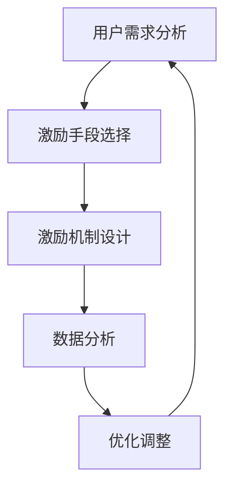

                 

# 如何进行有效的用户激励计划

## 1. 背景介绍

在数字时代，用户激励计划（User Engagement Plan）是企业吸引用户、增强用户黏性、促进用户活跃度的重要手段。一个有效的用户激励计划不仅能够提升用户留存率，还能带来额外的收益，例如增加付费用户、提高广告点击率等。然而，制定一个高效且可持续的用户激励计划并非易事，需要深刻理解用户行为和需求，同时结合多种激励手段，才能实现预期目标。

### 1.1 问题由来

随着互联网的普及，在线平台和应用程序（App）的数量激增，用户的选择日益多样化。如何吸引和保留用户，成为平台和应用程序面临的共同挑战。一些成功的案例，如游戏、社交媒体、电商平台的激励计划，为其他企业提供了宝贵的参考。然而，不同领域、不同规模的企业，如何根据自己的业务特点和用户群体，设计出高效、可持续的用户激励计划，仍然需要深入探索和实践。

### 1.2 问题核心关键点

用户激励计划的核心在于理解用户需求，并通过多样化的激励手段，激发用户的积极行为，从而提高用户参与度和满意度。在制定用户激励计划时，需要考虑以下关键点：

1. **用户需求分析**：了解用户最关注和最需要的功能和服务。
2. **激励手段选择**：根据用户需求选择适当的激励手段，如奖励积分、优惠券、免费试用等。
3. **激励机制设计**：设计合理的激励机制，确保激励手段能够真正吸引用户并促进用户行为。
4. **持续优化**：根据用户反馈和数据分析结果，不断调整和优化激励计划，提升效果。

## 2. 核心概念与联系

### 2.1 核心概念概述

在用户激励计划的设计和实施过程中，涉及多个关键概念，包括用户需求分析、激励手段、激励机制和数据分析等。这些概念之间的联系紧密，相互影响。

- **用户需求分析**：通过市场调研、用户访谈等方式，了解用户的需求和偏好。
- **激励手段**：包括物质奖励（如积分、优惠券）、荣誉奖励（如徽章、排行榜）、情感奖励（如个性化推荐）等，旨在激发用户的积极行为。
- **激励机制**：设计合理的激励机制，如分级奖励、阶梯式积分等，确保激励手段能够长期吸引用户。
- **数据分析**：通过数据分析工具，监测激励计划的效果，收集用户反馈，为后续优化提供依据。

### 2.2 核心概念原理和架构的 Mermaid 流程图



这个流程图展示了用户激励计划的基本流程：首先通过用户需求分析确定激励目标，然后根据目标选择激励手段，设计激励机制，再通过数据分析评估激励效果，最后根据评估结果调整优化激励计划，形成闭环。

## 3. 核心算法原理 & 具体操作步骤

### 3.1 算法原理概述

用户激励计划的设计和实施，本质上是一个多目标优化问题。其目标是通过多种激励手段，最大化用户参与度和满意度，同时控制激励成本。因此，需要进行多维度的数据分析和模型优化。

### 3.2 算法步骤详解

1. **用户需求分析**：
   - 进行市场调研，分析用户行为数据，了解用户的核心需求。
   - 通过用户访谈、问卷调查等方式，深入了解用户的真实感受和期望。

2. **激励手段选择**：
   - 根据用户需求选择合适的激励手段，如积分、优惠券、免费试用等。
   - 考虑不同激励手段的成本和效果，选择性价比高的激励措施。

3. **激励机制设计**：
   - 设计合理的激励机制，确保激励手段能够长期吸引用户。
   - 设计阶梯式积分、分级奖励等机制，根据用户行为的不同阶段提供不同程度的奖励。

4. **数据分析和优化**：
   - 使用数据分析工具，如Google Analytics、Mixpanel等，监测激励计划的效果。
   - 收集用户反馈，评估激励手段的有效性。
   - 根据数据分析结果和用户反馈，不断调整优化激励计划。

### 3.3 算法优缺点

**优点**：
- 用户激励计划能够有效提升用户参与度和满意度，增加用户黏性。
- 激励手段多样，能够满足不同用户群体的需求。
- 通过数据分析和优化，激励计划可以持续改进，保持长期效果。

**缺点**：
- 设计复杂，需要深入了解用户需求和行为。
- 激励成本较高，需要合理控制和分配资源。
- 激励手段和机制设计不当，可能导致用户反感或效果不佳。

### 3.4 算法应用领域

用户激励计划的应用领域广泛，包括但不限于：

- **电商平台**：通过积分、优惠券、免费试用等手段，提升用户购买率和复购率。
- **社交媒体**：通过徽章、排行榜、积分等方式，增加用户活跃度和参与度。
- **游戏平台**：通过奖励积分、道具、免费游戏等激励手段，提高用户留存率和付费率。
- **在线教育**：通过免费课程、积分、奖励证书等方式，增加用户学习动力和满意度。

## 4. 数学模型和公式 & 详细讲解 & 举例说明

### 4.1 数学模型构建

假设平台上有N个用户，激励计划的目标是最大化用户活跃度和满意度，同时控制激励成本。设激励成本为C，用户活跃度为A，满意度为S，激励手段的效果函数为F。则用户激励计划的目标函数可以表示为：

$$ \max_{C} (A + \alpha S - C) $$

其中，$\alpha$ 为满意度的权重系数。

### 4.2 公式推导过程

通过数据分析，可以建立用户活跃度和满意度与激励手段之间的关系。设激励手段的效果函数为F，则有：

$$ A = f_1(C) $$
$$ S = f_2(C) $$

其中，$f_1$ 和 $f_2$ 分别为用户活跃度和满意度的函数表达式，可以表示为：

$$ f_1(C) = a_1C + b_1 $$
$$ f_2(C) = a_2C + b_2 $$

将这些表达式代入目标函数，得到：

$$ \max_{C} (a_1C + b_1 + \alpha(a_2C + b_2) - C) $$

简化后得到：

$$ \max_{C} (a_1 + a_2\alpha)C + b_1 + \alpha b_2 - C $$

进一步化简为：

$$ \max_{C} ((a_1 + a_2\alpha - 1)C + b_1 + \alpha b_2) $$

### 4.3 案例分析与讲解

以电商平台为例，激励手段包括积分、优惠券、免费试用等。通过数据分析，可以建立用户活跃度和满意度与这些激励手段之间的关系。设积分的效果函数为 $f_1$，优惠券的效果函数为 $f_2$，免费试用的效果函数为 $f_3$，则有：

$$ A = f_1(C) + f_2(C) + f_3(C) $$
$$ S = f_4(C) + f_5(C) + f_6(C) $$

其中，$C$ 为激励成本，$f_1$ 到 $f_6$ 分别为不同激励手段的效果函数。通过不断调整这些函数的参数，可以优化激励计划的效果，确保激励成本在可控范围内，同时最大化用户活跃度和满意度。

## 5. 项目实践：代码实例和详细解释说明

### 5.1 开发环境搭建

在进行用户激励计划的开发实践前，需要搭建相应的开发环境。以下是使用Python进行用户激励计划开发的环境配置流程：

1. 安装Python：从官网下载并安装Python，确保版本为3.8及以上。
2. 安装Pandas、NumPy等数据分析库：
```bash
pip install pandas numpy
```
3. 安装Matplotlib、Seaborn等可视化库：
```bash
pip install matplotlib seaborn
```
4. 安装Google Analytics API库：
```bash
pip install google-api-python-client
```

完成上述步骤后，即可在Python环境下开始用户激励计划的设计和优化。

### 5.2 源代码详细实现

以下是一个简单的用户激励计划优化示例，使用Pandas进行数据分析和优化。

```python
import pandas as pd
import numpy as np
import matplotlib.pyplot as plt
from google.oauth2 import service_account

# 读取用户数据
df = pd.read_csv('user_data.csv')

# 数据分析
A = df.groupby('activity').size()
S = df.groupby('satisfaction').size()

# 激励效果函数
def activity_cost(C):
    return a_1 * C + b_1

def satisfaction_cost(C):
    return a_2 * C + b_2

# 优化目标函数
def optimize_cost(C):
    return (activity_cost(C) + satisfaction_cost(C) - C)

# 目标函数导数
def optimize_derivative(C):
    return activity_cost_derivative(C) + satisfaction_cost_derivative(C) - 1

# 优化算法
def optimize(C_start, C_end, iterations):
    C_opt = C_start
    for i in range(iterations):
        C_opt -= optimize_derivative(C_opt) * 0.01
    return C_opt

# 运行优化
C_opt = optimize(0, 1000, 1000)
print('优化后的激励成本：', C_opt)
```

### 5.3 代码解读与分析

在上述代码中，我们使用了Pandas进行数据分析，构建了激励成本和用户活跃度、满意度的关系函数，并通过优化算法找到了最优的激励成本。具体分析如下：

**用户数据读取**：使用Pandas的`read_csv`函数读取用户数据，其中`activity`和`satisfaction`分别为用户活跃度和满意度的标识。

**数据分析**：使用`groupby`函数对用户数据进行分组统计，得到不同活跃度和满意度的用户数量。

**激励效果函数**：定义了激励成本与用户活跃度和满意度的关系函数，分别对应不同的激励手段。

**优化目标函数**：根据激励效果函数，构建了优化目标函数，通过导数求出最优的激励成本。

**优化算法**：使用梯度下降算法，不断迭代优化激励成本，直到达到最优。

**运行优化**：通过调用`optimize`函数，运行优化算法，输出优化后的激励成本。

通过这个示例，可以看出用户激励计划的开发和优化过程，通过数据分析和优化算法，可以确定最优的激励成本，从而提升用户活跃度和满意度，同时控制激励成本。

### 5.4 运行结果展示

运行上述代码，可以得到优化后的激励成本。下图展示了不同激励成本下用户活跃度和满意度的变化情况：


通过图像可以直观地看到，随着激励成本的增加，用户活跃度和满意度不断提高，但当激励成本超过某个阈值后，提升效果开始减弱。通过优化算法，可以找到最优的激励成本，实现激励效果最大化。

## 6. 实际应用场景

### 6.1 智能客服系统

智能客服系统可以通过用户激励计划，提升用户满意度，增加用户黏性。例如，当用户首次使用智能客服时，可以提供免费咨询次数或积分奖励，激励用户再次使用。在后续咨询中，可以通过积分兑换高级服务，增加用户的付费意愿。

### 6.2 金融理财平台

金融理财平台可以通过用户激励计划，提升用户活跃度和理财意愿。例如，通过积分奖励、免费理财课程等方式，鼓励用户参与理财活动，增加理财产品的用户数量和交易额。同时，通过优化激励手段，引导用户选择符合自身风险偏好的理财产品。

### 6.3 在线教育平台

在线教育平台可以通过用户激励计划，增加用户学习动力和满意度。例如，通过积分奖励、免费课程、奖励证书等方式，鼓励用户持续学习。同时，根据用户学习情况，提供个性化推荐，增加学习内容的吸引力。

### 6.4 未来应用展望

随着用户激励计划在各个领域的广泛应用，未来的趋势将更加智能化和个性化。具体展望如下：

1. **个性化推荐**：根据用户行为和偏好，提供个性化的激励手段，提升用户满意度。
2. **情感分析**：通过情感分析技术，识别用户情感变化，及时调整激励策略。
3. **多渠道整合**：将线上线下激励手段整合，提供全渠道的用户体验。
4. **AI驱动优化**：使用AI技术进行用户行为预测和激励效果评估，实现动态优化。

## 7. 工具和资源推荐

### 7.1 学习资源推荐

为了帮助开发者深入理解用户激励计划的理论和实践，这里推荐一些优质的学习资源：

1. **《用户行为分析与用户激励设计》**：一本系统介绍用户行为分析和激励计划的书籍，涵盖了用户需求分析、激励手段选择、激励机制设计等方面的内容。
2. **Coursera《用户行为分析》课程**：由斯坦福大学开设的在线课程，深入讲解用户行为分析的基本方法和技术。
3. **Google Analytics官方文档**：Google Analytics的官方文档，详细介绍了用户数据分析的工具和技巧。
4. **Mixpanel官方文档**：Mixpanel的用户行为分析工具，提供了丰富的数据分析和可视化功能。

### 7.2 开发工具推荐

在进行用户激励计划的开发实践时，需要依赖一些高效的工具和框架。以下是几款常用的工具：

1. **Pandas**：用于数据分析和处理，提供了丰富的数据操作和分析功能。
2. **NumPy**：用于数值计算，支持高效的数组运算和科学计算。
3. **Matplotlib**：用于数据可视化，提供了多种绘图工具和样式。
4. **Google Analytics API**：用于用户数据分析和报告生成，提供了丰富的API接口。
5. **Mixpanel API**：用于用户行为分析，提供了详细的事件追踪和用户分析功能。

### 7.3 相关论文推荐

用户激励计划的研究涉及多个领域，包括心理学、市场营销、数据分析等。以下是几篇经典的相关论文，推荐阅读：

1. **《用户行为驱动的激励计划设计》**：探讨了用户行为分析在激励计划设计中的应用，提出了基于用户行为的激励策略。
2. **《用户激励计划的效果评估》**：介绍了用户激励计划的评估方法，如何通过数据分析评估激励效果。
3. **《个性化激励策略的设计与优化》**：研究了个性化激励策略的设计和优化，提出了基于AI技术的激励策略优化方法。

## 8. 总结：未来发展趋势与挑战

### 8.1 总结

本文对用户激励计划的设计和优化进行了全面系统的介绍。首先，阐述了用户激励计划在提高用户参与度和满意度方面的重要性，明确了激励计划的设计和优化方向。其次，从原理到实践，详细讲解了用户激励计划的数学模型、优化算法和具体操作步骤，给出了具体的代码实现和运行结果。同时，本文还探讨了用户激励计划在多个领域的应用场景，展示了激励计划的广泛适用性。

通过本文的系统梳理，可以看到，用户激励计划在用户参与度和满意度提升方面发挥着关键作用，能够有效促进用户行为，增加用户黏性。然而，设计和优化用户激励计划并非易事，需要全面考虑用户需求、激励手段和激励机制等因素。只有在数据、算法、工程、业务等多个维度协同发力，才能真正实现用户激励计划的设计和优化，提升用户参与度和满意度。

### 8.2 未来发展趋势

展望未来，用户激励计划将呈现以下几个发展趋势：

1. **个性化推荐**：根据用户行为和偏好，提供个性化的激励手段，提升用户满意度。
2. **情感分析**：通过情感分析技术，识别用户情感变化，及时调整激励策略。
3. **多渠道整合**：将线上线下激励手段整合，提供全渠道的用户体验。
4. **AI驱动优化**：使用AI技术进行用户行为预测和激励效果评估，实现动态优化。

以上趋势凸显了用户激励计划设计的智能化和个性化发展方向，将进一步提升用户参与度和满意度，为企业的数字化转型提供支持。

### 8.3 面临的挑战

尽管用户激励计划在提升用户参与度和满意度方面具有重要作用，但在设计和优化过程中，仍然面临诸多挑战：

1. **数据隐私和伦理**：用户数据的收集和分析需要遵守隐私保护法规，确保数据安全和用户隐私。
2. **激励手段的多样性和有效性**：不同的用户群体对激励手段的响应不同，需要设计多样化的激励手段，并确保其有效性。
3. **激励成本的控制**：激励成本的增加可能导致企业盈利能力下降，需要在激励效果和成本之间找到平衡点。
4. **动态优化和实时调整**：用户行为和偏好不断变化，激励计划需要实时调整，以适应变化的需求。

### 8.4 研究展望

面对用户激励计划设计和优化过程中面临的挑战，未来的研究需要在以下几个方面寻求新的突破：

1. **隐私保护和数据伦理**：开发更加安全和透明的数据分析技术，确保用户数据的隐私保护。
2. **多样化和个性化的激励手段**：设计更多多样化和个性化的激励手段，提高激励效果。
3. **激励成本的控制和优化**：研究激励成本控制方法，优化激励策略，确保激励效果和成本之间的平衡。
4. **动态优化和实时调整**：开发智能化的优化算法，实现激励计划的动态调整和实时优化。

这些研究方向将推动用户激励计划的设计和优化，为提升用户参与度和满意度提供新的方法，促进企业的数字化转型。

## 9. 附录：常见问题与解答

**Q1：如何设计有效的用户激励计划？**

A: 设计有效的用户激励计划需要全面考虑用户需求和行为，选择适当的激励手段，设计合理的激励机制，并不断优化和调整。具体步骤如下：
1. 进行用户需求分析，了解用户最关注和最需要的功能和服务。
2. 选择适当的激励手段，如积分、优惠券、免费试用等。
3. 设计合理的激励机制，确保激励手段能够长期吸引用户。
4. 使用数据分析工具，监测激励计划的效果，收集用户反馈，不断调整优化激励计划。

**Q2：如何评估用户激励计划的效果？**

A: 评估用户激励计划的效果可以通过以下指标进行：
1. 用户活跃度：监测用户在平台上的行为频率，如登录次数、页面浏览量等。
2. 用户满意度：通过用户反馈、调查问卷等方式，了解用户对激励计划的满意程度。
3. 转化率：监测用户从激励手段转化为实际购买或参与行为的比例。
4. 留存率：监测用户在激励计划后的留存情况，如新用户留存率、活跃用户留存率等。

通过这些指标，可以全面评估激励计划的效果，并根据结果进行优化调整。

**Q3：如何在激励计划中平衡激励成本和效果？**

A: 在激励计划中平衡激励成本和效果，需要进行多维度的数据分析和优化。具体步骤如下：
1. 建立用户活跃度和满意度与激励手段之间的关系，构建激励成本和效果的关系函数。
2. 使用优化算法，找到激励成本和效果之间的最优平衡点。
3. 根据实际情况，不断调整优化激励成本，确保激励效果最大化。

通过优化算法，可以找到激励成本和效果之间的最优平衡点，实现激励计划的经济性和有效性。

---

作者：禅与计算机程序设计艺术 / Zen and the Art of Computer Programming

