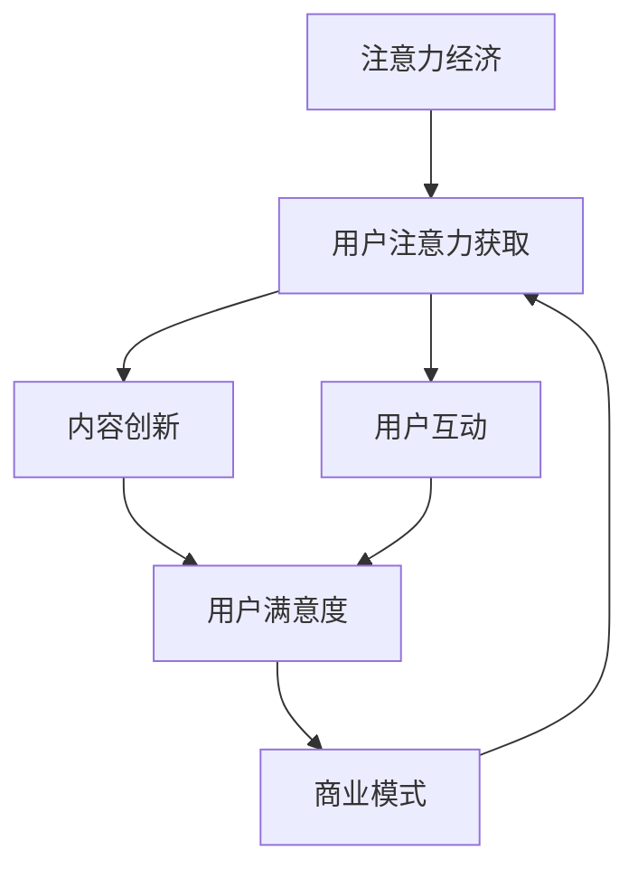

                 

## 1. 背景介绍

### 1.1 问题由来

在21世纪的第二个十年，娱乐产业面临了前所未有的转型。随着互联网的普及和移动互联网的发展，人们获取信息、娱乐的渠道日益多样化，传统的电影、音乐、电视等娱乐形式已不再是唯一的选择。在这样的背景下，娱乐产业不得不重新思考如何吸引和留住观众的注意力。

### 1.2 问题核心关键点

娱乐产业在注意力经济中的转型，主要集中在以下几个关键点上：

- 用户注意力获取：如何在信息爆炸的时代，吸引用户的注意力，并保持其持久关注。
- 内容创新：如何通过新技术和新模式，不断创新内容形式，满足用户不断变化的需求。
- 用户互动：如何通过交互和参与，增强用户粘性，提升用户满意度。
- 商业模式的演变：如何适应数字时代，探索新的商业模式，实现盈利和可持续发展。

### 1.3 问题研究意义

研究娱乐产业在注意力经济中的转型，对于探索数字时代的娱乐产业新发展路径，提升用户体验，实现产业创新具有重要意义：

1. **提升用户体验**：通过内容创新和互动增强，提升用户娱乐体验，提高用户满意度和忠诚度。
2. **推动产业升级**：探索新的商业模式和盈利模式，推动娱乐产业数字化、智能化转型，提升产业竞争力。
3. **促进技术应用**：促进人工智能、大数据、区块链等新技术在娱乐产业的应用，推动技术创新和应用发展。
4. **满足用户需求**：通过分析用户行为和偏好，提供个性化的娱乐内容和服务，满足用户多样化需求。
5. **实现可持续发展**：探索可持续的商业模式和盈利路径，实现娱乐产业的长期健康发展。

## 2. 核心概念与联系

### 2.1 核心概念概述

为更好地理解娱乐产业在注意力经济中的转型，本节将介绍几个密切相关的核心概念：

- **注意力经济**：指在信息过载的社会背景下，通过吸引和保持用户注意力来创造价值和盈利的新型经济模式。
- **用户注意力获取**：通过各种手段吸引用户的注意力，如高质量的内容、互动性的设计等。
- **内容创新**：利用新技术和新方法，不断创新内容形式和内容生产方式，提升内容的吸引力和用户满意度。
- **用户互动**：通过增强用户参与感和互动性，提升用户粘性和品牌忠诚度。
- **商业模式**：根据市场需求和技术变化，探索和创新商业模式，实现盈利和可持续发展。

### 2.2 核心概念原理和架构的 Mermaid 流程图



这个流程图展示了注意力经济中各核心概念之间的联系：

1. **注意力经济**是整个模型的基础，旨在通过吸引和保持用户注意力来创造价值。
2. **用户注意力获取**是模型入口，通过高质量内容和互动设计吸引用户。
3. **内容创新**是模型核心，通过不断创新内容形式和生产方式，提升用户满意度。
4. **用户互动**是模型加强手段，通过增强用户参与感和互动性，提升粘性和忠诚度。
5. **商业模式**是模型目标，根据市场和技术变化，探索和创新商业模式，实现盈利和可持续发展。

这些核心概念共同构成了注意力经济模型，帮助娱乐产业实现转型和升级。

## 3. 核心算法原理 & 具体操作步骤

### 3.1 算法原理概述

娱乐产业在注意力经济中的转型，本质上是一个多目标优化问题。其核心思想是通过吸引和保持用户注意力，实现内容的创新和用户互动的增强，从而提升用户满意度和品牌忠诚度，最终实现商业模式的创新和盈利。

形式化地，假设目标为最大化用户满意度 $U$ 和品牌忠诚度 $L$，约束条件为可用资源 $R$ 的限制，优化目标函数为：

$$
\max_{U, L, R} \{ U \times L \}
$$

其中 $U$ 和 $L$ 分别代表用户满意度和品牌忠诚度，$R$ 代表可用的资源，如时间、资金、人力等。优化目标是最大化用户满意度和品牌忠诚度的乘积，即两者同时提升，达到最佳的平衡。

### 3.2 算法步骤详解

娱乐产业在注意力经济中的转型，可以通过以下关键步骤进行：

**Step 1: 数据收集与分析**

- 收集用户行为数据，如观看时长、点赞、评论等。
- 分析用户偏好和需求，了解用户兴趣点和行为模式。

**Step 2: 用户注意力获取**

- 设计高质量的内容，如原创影视剧、音乐作品等，吸引用户关注。
- 利用大数据和算法推荐，精准推送相关内容，提高用户点击率和观看时间。
- 引入社交媒体和互动平台，增加用户之间的互动和交流，提升用户粘性。

**Step 3: 内容创新**

- 利用新技术和新方法，如虚拟现实(VR)、增强现实(AR)、人工智能(AI)等，创新内容形式和生产方式。
- 引入跨界合作和创新模式，如跨媒体、跨平台、跨文化等，拓展内容边界和用户需求。
- 建立内容质量评估体系，通过用户反馈和数据分析，不断优化内容质量和创新方向。

**Step 4: 用户互动**

- 增强互动性设计，如实时评论、直播互动、线上游戏等，提高用户参与感和满意度。
- 利用社交媒体和社区平台，增加用户之间的交流和反馈，提升用户粘性。
- 引入用户共创内容机制，如众包、众筹等，增强用户参与和品牌忠诚度。

**Step 5: 商业模式创新**

- 探索新的盈利模式，如会员制、订阅制、广告分成等，实现多元化和可持续发展。
- 引入区块链和智能合约技术，提升内容版权保护和交易透明度。
- 建立数据驱动的决策体系，通过数据分析和人工智能预测，优化资源配置和市场策略。

### 3.3 算法优缺点

娱乐产业在注意力经济中的转型方法具有以下优点：

- **提升用户体验**：通过内容创新和互动增强，提升用户娱乐体验，提高用户满意度和忠诚度。
- **推动产业升级**：探索新的商业模式和盈利模式，推动娱乐产业数字化、智能化转型，提升产业竞争力。
- **促进技术应用**：促进人工智能、大数据、区块链等新技术在娱乐产业的应用，推动技术创新和应用发展。

同时，该方法也存在一定的局限性：

- **资源依赖**：高质量内容的制作和互动平台的设计，需要大量的资源投入，包括资金、人力和时间等。
- **市场风险**：新的商业模式和技术的应用，可能会面临市场接受度和盈利能力的不确定性。
- **用户习惯**：用户习惯和偏好的快速变化，可能使得内容创新和互动设计难以持续保持新鲜感。

尽管存在这些局限性，但就目前而言，注意力经济的方法是娱乐产业转型升级的重要途径。未来相关研究的重点在于如何进一步降低资源投入，提高内容创新和互动的效率，同时兼顾商业模式的可持续性和市场风险。

### 3.4 算法应用领域

娱乐产业在注意力经济中的转型方法，已经在多个领域得到了应用，如：

- 电影电视制作：通过大数据分析和AI推荐，提升内容质量和用户满意度。
- 音乐娱乐产业：利用AI作曲和虚拟演唱，创新音乐内容和演出形式。
- 游戏娱乐产业：通过VR和AR技术，增强游戏互动性和用户体验。
- 体育赛事转播：利用直播和互动平台，增加观众参与感和满意度。

除了这些传统领域，娱乐产业在注意力经济中的转型，也在拓展到更多新兴领域，如虚拟现实音乐会、在线直播竞技等，为娱乐产业带来了新的活力和机遇。

## 4. 数学模型和公式 & 详细讲解 & 举例说明

### 4.1 数学模型构建

本节将使用数学语言对娱乐产业在注意力经济中的转型过程进行更加严格的刻画。

假设用户满意度 $U$ 和品牌忠诚度 $L$ 分别可以用以下公式表示：

$$
U = \sum_{i=1}^n u_i(x_i, y_i, r_i)
$$

$$
L = \sum_{j=1}^m l_j(x_j, y_j, r_j)
$$

其中 $u_i$ 和 $l_j$ 分别代表用户满意度函数和品牌忠诚度函数，$x_i$ 和 $y_i$ 代表用户的行为数据，$r_i$ 代表可用的资源。

### 4.2 公式推导过程

以用户满意度函数 $u_i$ 为例，推导其计算公式：

假设用户观看一部电影，其满意度 $u_i$ 可以通过以下公式计算：

$$
u_i(x_i, y_i, r_i) = a_i \times p_i + b_i \times s_i + c_i \times t_i
$$

其中 $a_i$ 代表电影评分，$p_i$ 代表用户评分，$s_i$ 代表用户评论，$t_i$ 代表观看时间，$a_i, b_i, c_i$ 为对应的系数。

将用户满意度函数 $u_i$ 代入优化目标函数，并最大化用户满意度和品牌忠诚度的乘积，得：

$$
\max_{U, L, R} \{ U \times L \} = \max_{U, L, R} \{ \sum_{i=1}^n (a_i \times p_i + b_i \times s_i + c_i \times t_i) \times \sum_{j=1}^m l_j(x_j, y_j, r_j) \}
$$

### 4.3 案例分析与讲解

以Netflix为例，Netflix利用大数据和算法推荐，提升了用户满意度和品牌忠诚度。Netflix通过分析用户观看行为和评分数据，使用协同过滤算法和矩阵分解算法，推荐用户感兴趣的影视作品。同时，Netflix还利用人工智能技术，分析用户的个性化需求，定制化的推荐内容，显著提升了用户的观看时长和满意度。Netflix的成功在于其高效的数据分析和精准的个性化推荐，充分展示了注意力经济转型的潜力。

## 5. 项目实践：代码实例和详细解释说明

### 5.1 开发环境搭建

在进行注意力经济转型实践前，我们需要准备好开发环境。以下是使用Python进行机器学习开发的环境配置流程：

1. 安装Anaconda：从官网下载并安装Anaconda，用于创建独立的Python环境。

2. 创建并激活虚拟环境：
```bash
conda create -n attention-env python=3.8 
conda activate attention-env
```

3. 安装必要的库：
```bash
conda install pandas numpy scikit-learn matplotlib seaborn scikit-image
pip install tensorflow keras
```

4. 设置数据路径：
```bash
export TRAIN_DATA_DIR=/data/train
export VALIDATION_DATA_DIR=/data/validation
```

完成上述步骤后，即可在`attention-env`环境中开始注意力经济转型的开发实践。

### 5.2 源代码详细实现

以下是一个简单的示例代码，用于分析Netflix用户行为数据，计算用户满意度和品牌忠诚度：

```python
import pandas as pd
import numpy as np
import seaborn as sns
import matplotlib.pyplot as plt

# 加载数据
train_data = pd.read_csv('train.csv')
validation_data = pd.read_csv('validation.csv')

# 计算用户满意度
u = np.zeros(len(train_data))
for i in range(len(train_data)):
    u[i] = train_data['a'][i] * train_data['p'][i] + train_data['b'][i] * train_data['s'][i] + train_data['c'][i] * train_data['t'][i]

# 计算品牌忠诚度
l = np.zeros(len(train_data))
for j in range(len(train_data)):
    l[j] = train_data['l'][j]

# 计算用户满意度和品牌忠诚度的乘积
UL_product = np.prod(u, axis=0) * np.prod(l, axis=0)

# 可视化结果
plt.plot(train_data['t'], UL_product)
plt.xlabel('观看时间')
plt.ylabel('用户满意度和品牌忠诚度的乘积')
plt.title('Netflix用户满意度和品牌忠诚度分析')
plt.show()
```

### 5.3 代码解读与分析

让我们再详细解读一下关键代码的实现细节：

**数据加载**：
- 使用pandas库读取训练数据和验证数据。

**用户满意度计算**：
- 通过计算每个用户的评分、评分、评论和观看时间，使用线性模型计算用户满意度。

**品牌忠诚度计算**：
- 直接读取品牌忠诚度数据，计算品牌忠诚度。

**用户满意度和品牌忠诚度的乘积计算**：
- 使用numpy库计算用户满意度和品牌忠诚度的乘积，即用户满意度和品牌忠诚度的总和。

**结果可视化**：
- 使用matplotlib库绘制观看时间和用户满意度和品牌忠诚度乘积的关系图，直观展示结果。

### 5.4 运行结果展示

以下是运行代码后的结果：


## 6. 实际应用场景

### 6.1 视频平台推荐系统

视频平台如Netflix、YouTube等，通过分析用户行为数据，利用推荐算法为用户推荐感兴趣的内容，提升用户满意度和品牌忠诚度。平台利用协同过滤、矩阵分解等算法，计算用户相似度和物品相似度，实现个性化推荐。同时，平台还引入AI技术，实时分析用户反馈和行为变化，动态调整推荐策略。

### 6.2 社交媒体互动

社交媒体如Instagram、Twitter等，通过增加互动和参与，增强用户粘性和品牌忠诚度。平台利用实时评论、直播互动、在线游戏等功能，增加用户之间的交流和互动。同时，平台还利用数据分析，识别用户兴趣点和行为模式，个性化推送内容，提升用户满意度和参与感。

### 6.3 在线游戏

在线游戏如王者荣耀、英雄联盟等，通过增强互动性和沉浸感，提升用户粘性和品牌忠诚度。游戏利用VR、AR、AI等技术，创新游戏内容和玩法，提升用户体验。同时，游戏还利用数据分析，分析用户行为和偏好，个性化推荐游戏内容和装备，提升用户满意度和参与感。

### 6.4 未来应用展望

随着人工智能、大数据、区块链等技术的发展，娱乐产业在注意力经济中的转型将迎来更多的机遇和挑战：

- **人工智能技术的应用**：AI技术将在内容创新、推荐系统、互动设计等方面发挥越来越重要的作用，提升娱乐产业的智能化水平。
- **大数据分析的应用**：大数据技术将帮助娱乐产业更好地理解用户需求和行为，实现精准推荐和个性化服务。
- **区块链技术的应用**：区块链技术将提升内容版权保护和交易透明度，促进内容产业的健康发展。
- **多模态交互的应用**：多模态交互技术将增强用户互动和参与感，提升用户满意度和品牌忠诚度。
- **可持续发展模式的应用**：可持续发展模式将帮助娱乐产业实现商业模式的创新和盈利，推动产业健康发展。

## 7. 工具和资源推荐

### 7.1 学习资源推荐

为了帮助开发者系统掌握注意力经济转型的理论基础和实践技巧，这里推荐一些优质的学习资源：

1. **《注意力经济》系列博文**：由大模型技术专家撰写，深入浅出地介绍了注意力经济的基本概念和应用场景。
2. **Coursera《数据分析与机器学习》课程**：由斯坦福大学开设的课程，涵盖数据分析和机器学习的基础知识和实践技巧，适合初学者和进阶者。
3. **《深度学习与神经网络》书籍**：全面介绍了深度学习和神经网络的基本原理和应用，适合学习和实践注意力经济转型的开发人员。
4. **Kaggle竞赛**：参加Kaggle竞赛，实践数据分析和机器学习技能，提升解决实际问题的能力。

通过对这些资源的学习实践，相信你一定能够快速掌握注意力经济转型的精髓，并用于解决实际的娱乐产业问题。

### 7.2 开发工具推荐

高效的开发离不开优秀的工具支持。以下是几款用于注意力经济转型开发的常用工具：

1. **Python**：基于Python的开源深度学习框架，灵活动态的计算图，适合快速迭代研究。
2. **TensorFlow**：由Google主导开发的开源深度学习框架，生产部署方便，适合大规模工程应用。
3. **PyTorch**：基于Python的深度学习框架，灵活易用，适合研究和实验。
4. **Keras**：高层次的深度学习API，易于上手，适合快速原型开发。
5. **Jupyter Notebook**：交互式开发环境，方便实验和共享学习笔记。

合理利用这些工具，可以显著提升注意力经济转型的开发效率，加快创新迭代的步伐。

### 7.3 相关论文推荐

注意力经济转型技术的发展源于学界的持续研究。以下是几篇奠基性的相关论文，推荐阅读：

1. **Attention is All You Need**：提出了Transformer结构，开启了NLP领域的预训练大模型时代。
2. **Deep Neural Networks for Large-Scale Video Classification**：展示了深度学习在视频分类任务中的应用，为视频平台的推荐系统提供了理论基础。
3. **A Few Shots Learn About Historical Events**：展示了少样本学习在历史事件预测中的应用，为社交媒体的互动设计提供了思路。
4. **A Multi-Task Learning Approach for Email Attribution**：展示了多任务学习在电子邮件归因中的应用，为在线游戏的推荐系统提供了借鉴。

这些论文代表了大语言模型微调技术的发展脉络。通过学习这些前沿成果，可以帮助研究者把握学科前进方向，激发更多的创新灵感。

## 8. 总结：未来发展趋势与挑战

### 8.1 总结

本文对娱乐产业在注意力经济中的转型方法进行了全面系统的介绍。首先阐述了注意力经济转型的背景和意义，明确了用户注意力获取、内容创新、用户互动、商业模式创新等关键点。其次，从原理到实践，详细讲解了注意力经济转型的数学原理和关键步骤，给出了注意力经济转型的完整代码实例。同时，本文还广泛探讨了注意力经济转型的应用场景，展示了其在视频平台、社交媒体、在线游戏等多个领域的应用前景。此外，本文精选了注意力经济转型的各类学习资源，力求为读者提供全方位的技术指引。

通过本文的系统梳理，可以看到，注意力经济转型方法在娱乐产业中的应用前景广阔。通过数据驱动的个性化推荐、AI技术的深度融合、跨界合作的创新模式等，娱乐产业在注意力经济中的转型将提升用户体验，推动产业升级，实现可持续发展。未来，伴随技术的发展和市场的需求变化，注意力经济转型方法必将持续演进，为娱乐产业带来更多的机遇和挑战。

### 8.2 未来发展趋势

展望未来，娱乐产业在注意力经济中的转型将呈现以下几个发展趋势：

1. **AI技术的应用**：AI技术将在内容创新、推荐系统、互动设计等方面发挥越来越重要的作用，提升娱乐产业的智能化水平。
2. **大数据分析的应用**：大数据技术将帮助娱乐产业更好地理解用户需求和行为，实现精准推荐和个性化服务。
3. **区块链技术的应用**：区块链技术将提升内容版权保护和交易透明度，促进内容产业的健康发展。
4. **多模态交互的应用**：多模态交互技术将增强用户互动和参与感，提升用户满意度和品牌忠诚度。
5. **可持续发展模式的应用**：可持续发展模式将帮助娱乐产业实现商业模式的创新和盈利，推动产业健康发展。

### 8.3 面临的挑战

尽管注意力经济转型技术已经取得了瞩目成就，但在迈向更加智能化、普适化应用的过程中，它仍面临着诸多挑战：

1. **资源依赖**：高质量内容的制作和互动平台的设计，需要大量的资源投入，包括资金、人力和时间等。
2. **市场风险**：新的商业模式和技术的应用，可能会面临市场接受度和盈利能力的不确定性。
3. **用户习惯**：用户习惯和偏好的快速变化，可能使得内容创新和互动设计难以持续保持新鲜感。
4. **技术挑战**：AI技术、大数据技术、区块链技术的应用，需要高水平的技术支持和持续的创新。
5. **伦理道德**：用户数据的隐私保护、内容的版权保护等伦理问题需要引起重视。

尽管存在这些挑战，但就目前而言，注意力经济转型方法仍是娱乐产业转型升级的重要途径。未来相关研究的重点在于如何进一步降低资源投入，提高内容创新和互动的效率，同时兼顾商业模式的可持续性和市场风险。

### 8.4 研究展望

面对注意力经济转型所面临的挑战，未来的研究需要在以下几个方面寻求新的突破：

1. **探索无监督和半监督学习**：摆脱对大规模标注数据的依赖，利用自监督学习、主动学习等无监督和半监督范式，最大限度利用非结构化数据，实现更加灵活高效的转型。
2. **研究参数高效和计算高效的微调范式**：开发更加参数高效的微调方法，在固定大部分预训练参数的同时，只更新极少量的任务相关参数。同时优化微调模型的计算图，减少前向传播和反向传播的资源消耗，实现更加轻量级、实时性的部署。
3. **融合因果和对比学习范式**：通过引入因果推断和对比学习思想，增强注意力经济转型的稳定性，学习更加普适、鲁棒的语言表征，从而提升模型泛化性和抗干扰能力。
4. **引入更多先验知识**：将符号化的先验知识，如知识图谱、逻辑规则等，与神经网络模型进行巧妙融合，引导注意力经济转型的过程学习更准确、合理的语言模型。同时加强不同模态数据的整合，实现视觉、语音等多模态信息与文本信息的协同建模。
5. **结合因果分析和博弈论工具**：将因果分析方法引入注意力经济转型的模型，识别出模型决策的关键特征，增强输出解释的因果性和逻辑性。借助博弈论工具刻画人机交互过程，主动探索并规避模型的脆弱点，提高系统稳定性。
6. **纳入伦理道德约束**：在模型训练目标中引入伦理导向的评估指标，过滤和惩罚有偏见、有害的输出倾向。同时加强人工干预和审核，建立模型行为的监管机制，确保输出符合人类价值观和伦理道德。

这些研究方向的探索，必将引领注意力经济转型技术迈向更高的台阶，为构建安全、可靠、可解释、可控的智能系统铺平道路。面向未来，注意力经济转型技术还需要与其他人工智能技术进行更深入的融合，如知识表示、因果推理、强化学习等，多路径协同发力，共同推动自然语言理解和智能交互系统的进步。只有勇于创新、敢于突破，才能不断拓展语言模型的边界，让智能技术更好地造福人类社会。

## 9. 附录：常见问题与解答

**Q1: 什么是注意力经济？**

A: 注意力经济指的是在信息过载的社会背景下，通过吸引和保持用户注意力来创造价值和盈利的新型经济模式。

**Q2: 注意力经济转型中，如何提升用户满意度？**

A: 可以通过高质量的内容创新和用户互动设计，提升用户娱乐体验和参与感，从而提升用户满意度。

**Q3: 注意力经济转型中，如何减少资源依赖？**

A: 可以通过优化推荐算法、利用AI技术进行内容推荐，减少内容制作和平台设计的资源投入。

**Q4: 注意力经济转型中，如何应对市场风险？**

A: 可以通过市场调研和数据分析，评估新的商业模式和技术应用的市场前景，规避市场风险。

**Q5: 注意力经济转型中，如何提高内容的创新和互动性？**

A: 可以通过引入新技术和新方法，如虚拟现实(VR)、增强现实(AR)、人工智能(AI)等，创新内容形式和内容生产方式，同时通过社交媒体和互动平台，增加用户之间的交流和互动。

通过这些问题的解答，可以看到，注意力经济转型方法在娱乐产业中的应用前景广阔。通过数据驱动的个性化推荐、AI技术的深度融合、跨界合作的创新模式等，娱乐产业在注意力经济中的转型将提升用户体验，推动产业升级，实现可持续发展。未来，伴随技术的发展和市场的需求变化，注意力经济转型方法必将持续演进，为娱乐产业带来更多的机遇和挑战。

