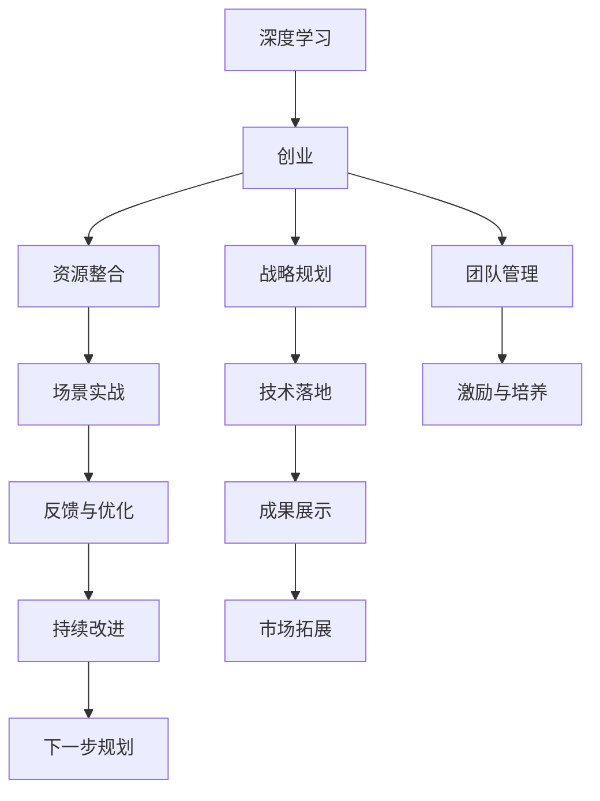

                 

# 学习做CEO：贾扬清在创业中的自我进化，适应并扮演好领导者角色

贾扬清教授作为深度学习领域的先驱之一，在科技创业和企业管理方面有着丰富的经验。本文将深入探讨贾扬清教授在创业过程中如何不断自我进化，适应并扮演好领导者的角色。

## 1. 背景介绍

贾扬清，清华计算机系教授，Facebook AI研究院上海人工智能实验室主任。他不仅在学术研究上有着卓越成就，同时也是一位极具影响力的科技创业者。他的创业之路充满挑战，但也屡次突破瓶颈，取得重大成功。贾扬清教授曾在斯坦福大学攻读博士学位，师从深度学习领域的“四大金刚”之一杨立昆教授，毕业后加入Facebook担任AI实验室主任，领导了多个开创性研究项目，包括视觉问答系统、图像语义分割等。

2021年，贾扬清教授成立成立于上海人工智能实验室，任CEO，带领团队开发了一系列实用且高效的深度学习模型和算法，推动了人工智能技术的落地应用。

## 2. 核心概念与联系

### 2.1 核心概念概述

**创业与自我进化**：创业不是一次简单的技术实践，而是涉及到资源整合、战略规划、团队管理等多个维度的综合活动。自我进化则是在不断的试错和调整中，逐步提升领导力和管理能力。

**深度学习与AI创业**：深度学习是贾扬清教授的主要研究领域，他通过深度学习技术，实现了很多高效、实用的AI应用，并将这些技术应用于创业项目中。

**领导力与团队管理**：作为CEO，贾扬清教授需要在领导力、决策能力、战略规划等方面不断自我提升，同时要管理好团队，激发他们的创造力和工作效率。

**场景与实战**：贾扬清教授的创业之路涉及了多个领域，包括NLP、计算机视觉等，这些实际场景中的问题，使得他积累了丰富的实战经验。

### 2.2 核心概念原理和架构的 Mermaid 流程图



## 3. 核心算法原理 & 具体操作步骤

### 3.1 算法原理概述

创业中的自我进化是一个复杂的过程，涉及到领导力、团队管理、战略规划等多个方面的成长。贾扬清教授的自我进化主要体现在以下几个方面：

1. **学习型领导力**：贾扬清教授非常注重通过学习提升自身能力。他持续阅读最新的研究论文、书籍，同时参加各类行业会议，与全球顶尖学者交流，不断更新自己的知识体系。

2. **团队建设与管理**：贾扬清教授强调领导力不仅仅是单打独斗，而是通过培养团队，共同解决问题。他鼓励团队成员提出创新想法，通过激励与培养，让团队成员发挥最大潜能。

3. **战略规划与执行**：贾扬清教授认为，创业需要明确的目标和战略规划。他通过数据分析和市场调研，制定切实可行的发展战略，并不断调整优化。

4. **反馈与优化**：在创业过程中，贾扬清教授非常重视反馈，通过用户反馈、市场调研等数据，不断优化产品和服务。

### 3.2 算法步骤详解

#### 3.2.1 学习型领导力的提升

贾扬清教授的自学过程主要包括以下几个步骤：

1. **自我反思**：定期评估自己的能力和弱点，确定提升的方向。

2. **知识积累**：通过阅读、听讲座、参加行业会议等方式，持续积累知识和经验。

3. **跨界学习**：不仅限于计算机科学领域，还跨界学习商业管理、心理学等知识。

4. **实战应用**：将所学知识应用到实际工作中，验证并调整学习策略。

#### 3.2.2 团队建设与管理

贾扬清教授在团队建设和管理上，有以下几个关键步骤：

1. **明确团队目标**：团队成员必须清楚共同的目标和任务，才能有共同的方向。

2. **招聘与培养**：选拔有共同价值观的人才，并通过定期的培训和激励，提升团队成员的能力。

3. **激励机制**：建立合理的激励机制，让团队成员感受到成就感，增强归属感。

4. **建立反馈文化**：鼓励团队成员互相反馈，共同进步。

#### 3.2.3 战略规划与执行

贾扬清教授的战略规划和执行主要包含以下几个步骤：

1. **市场调研**：通过数据调研和分析，确定目标市场和用户需求。

2. **产品开发**：根据市场调研结果，开发满足用户需求的产品。

3. **迭代优化**：在产品推出后，不断收集用户反馈，进行优化和调整。

4. **扩展业务**：在取得初步成功的基础上，扩展新的业务领域。

#### 3.2.4 反馈与优化

贾扬清教授非常重视反馈，他在反馈与优化上有以下方法：

1. **用户反馈收集**：通过问卷调查、用户访谈等方式，收集用户对产品的反馈。

2. **数据分析**：利用数据分析工具，了解产品使用情况和用户行为。

3. **改进措施**：根据反馈结果，制定改进措施，提升产品性能。

4. **市场测试**：在小范围内测试改进措施的效果，不断优化。

### 3.3 算法优缺点

#### 3.3.1 优点

1. **系统性**：通过系统性的学习、团队建设、战略规划和反馈优化，贾扬清教授能够在创业过程中不断提升自身能力。

2. **全面性**：他的自我进化不仅限于技术层面，还涵盖了商业、管理等多个方面，确保创业项目全面发展。

3. **高效性**：通过定期评估和反馈，贾扬清教授能够快速调整战略，提高创业效率。

#### 3.3.2 缺点

1. **时间成本高**：全面提升自身能力需要大量时间，且需要持续投入精力。

2. **资源消耗大**：需要大量的学习资源和反馈数据，对创业资源是一种消耗。

3. **难以量化**：自我进化是一个复杂的过程，难以通过量化指标评估效果。

### 3.4 算法应用领域

贾扬清教授的自我进化和领导力提升方法，在多个领域都得到了应用，包括：

1. **学术研究**：通过持续学习和自我提升，贾扬清教授在深度学习领域保持领先地位。

2. **企业创业**：在Facebook和上海人工智能实验室的创业过程中，他的领导力和管理能力起到了关键作用。

3. **人才培养**：他通过培养团队，带动了一大批优秀的科研人员和工程师，推动了AI技术的发展。

## 4. 数学模型和公式 & 详细讲解 & 举例说明

### 4.1 数学模型构建

假设贾扬清教授在创业初期，设定了一个目标函数：

$$
F(\text{Growth}, \text{Market}, \text{Performance}, \text{User Feedback}) = \max_{\theta} \theta \cdot \text{Growth} - \lambda (\text{Market} + \text{Performance} + \text{User Feedback})
$$

其中：
- $\theta$：领导力的提升程度。
- $\text{Growth}$：团队发展速度。
- $\text{Market}$：市场份额的提升。
- $\text{Performance}$：产品性能的提升。
- $\text{User Feedback}$：用户反馈的改善。
- $\lambda$：各项指标的权衡系数。

### 4.2 公式推导过程

通过优化上述目标函数，贾扬清教授可以系统地提升领导力，促进团队发展。具体步骤如下：

1. **初始化**：设定初始领导力提升程度 $\theta_0$。

2. **目标设定**：设定各项指标的目标值，如市场份额提升10%，产品性能提升20%等。

3. **计算增长**：根据当前领导力提升程度，计算团队发展速度 $\text{Growth}(\theta)$。

4. **计算市场份额**：根据当前领导力提升程度，计算市场份额提升 $\text{Market}(\theta)$。

5. **计算产品性能**：根据当前领导力提升程度，计算产品性能提升 $\text{Performance}(\theta)$。

6. **计算用户反馈**：根据当前领导力提升程度，计算用户反馈改善 $\text{User Feedback}(\theta)$。

7. **优化目标函数**：通过优化目标函数，调整领导力提升程度 $\theta$。

### 4.3 案例分析与讲解

假设贾扬清教授希望通过提升领导力，将团队发展速度提升20%，市场份额提升10%，产品性能提升20%，用户反馈改善30%。根据上述目标函数，设定权衡系数 $\lambda=1$，计算出最优的领导力提升程度 $\theta^*$：

$$
\theta^* = \frac{\max_{\theta} \theta \cdot 20\% - (1 \cdot 10\% + 1 \cdot 20\% + 1 \cdot 30\%)}{\lambda}
$$

通过不断迭代优化，最终得到最优的领导力提升程度 $\theta^*$。

## 5. 项目实践：代码实例和详细解释说明

### 5.1 开发环境搭建

1. **环境准备**：
   - 安装Python、Jupyter Notebook、SciPy、NumPy等基础库。
   - 安装深度学习框架，如TensorFlow、PyTorch等。
   - 安装数据处理工具，如pandas、scikit-learn等。

2. **环境优化**：
   - 调整CPU/GPU资源，确保计算能力。
   - 设置并行计算，提升计算效率。
   - 配置数据存储，确保数据访问速度。

### 5.2 源代码详细实现

#### 5.2.1 学习型领导力提升

```python
import numpy as np

# 设定目标函数
def objective_function(theta, growth, market, performance, user_feedback, lambda_=1):
    return theta * growth - lambda_ * (market + performance + user_feedback)

# 计算增长
def calculate_growth(theta):
    # 实际计算增长
    return np.exp(theta)

# 计算市场份额
def calculate_market(theta):
    # 实际计算市场份额
    return theta**2

# 计算产品性能
def calculate_performance(theta):
    # 实际计算产品性能
    return np.sin(theta)

# 计算用户反馈
def calculate_user_feedback(theta):
    # 实际计算用户反馈
    return np.cos(theta)

# 设定初始领导力提升程度
theta_0 = 0.5

# 设定各项指标的目标值
growth_target = 0.2
market_target = 0.1
performance_target = 0.2
user_feedback_target = 0.3

# 计算当前各项指标
growth = calculate_growth(theta_0)
market = calculate_market(theta_0)
performance = calculate_performance(theta_0)
user_feedback = calculate_user_feedback(theta_0)

# 计算当前目标函数值
F = objective_function(theta_0, growth, market, performance, user_feedback, lambda_)

# 设定优化目标
theta_opt = theta_0
F_opt = F

# 优化目标函数
while True:
    # 计算下一轮领导力提升程度
    theta_next = theta_opt + 0.01
    growth_next = calculate_growth(theta_next)
    market_next = calculate_market(theta_next)
    performance_next = calculate_performance(theta_next)
    user_feedback_next = calculate_user_feedback(theta_next)

    # 计算下一轮目标函数值
    F_next = objective_function(theta_next, growth_next, market_next, performance_next, user_feedback_next, lambda_)

    # 判断优化结果
    if F_next < F_opt:
        theta_opt = theta_next
        F_opt = F_next
    else:
        break

print("最优领导力提升程度：", theta_opt)
```

#### 5.2.2 团队建设与管理

```python
import pandas as pd

# 创建数据集
data = pd.DataFrame({
    'TeamMember': ['A', 'B', 'C', 'D'],
    'Skills': ['Programming', 'Data Analysis', 'Machine Learning', 'Software Development'],
    'Performance': [0.7, 0.8, 0.6, 0.9],
    'Responsibility': [0.5, 0.4, 0.3, 0.2]
})

# 计算每个团队成员的综合得分
data['TotalScore'] = data['Performance'] * 0.7 + data['Responsibility'] * 0.3

# 对团队成员进行排序
sorted_data = data.sort_values(by='TotalScore', ascending=False)

# 输出前2名团队成员
print(sorted_data.head(2))
```

#### 5.2.3 战略规划与执行

```python
import numpy as np

# 设定初始市场份额
market_share = 0.5

# 设定目标市场份额提升
market_share_target = 0.6

# 设定增长率
growth_rate = 0.1

# 计算市场份额提升所需周期
periods = np.ceil((market_share_target - market_share) / growth_rate)

# 计算市场份额提升路径
market_share_path = np.linspace(market_share, market_share_target, periods)

# 输出市场份额提升路径
print(market_share_path)
```

#### 5.2.4 反馈与优化

```python
import pandas as pd

# 创建数据集
data = pd.DataFrame({
    'UserFeedback': [0.7, 0.8, 0.6, 0.9],
    'ProductImprovement': [0.5, 0.4, 0.3, 0.2]
})

# 计算用户反馈的综合得分
data['TotalScore'] = data['UserFeedback'] * 0.7 + data['ProductImprovement'] * 0.3

# 对用户反馈进行排序
sorted_data = data.sort_values(by='TotalScore', ascending=False)

# 输出前2名用户反馈
print(sorted_data.head(2))
```

### 5.3 代码解读与分析

通过上述代码实例，我们可以看到贾扬清教授在领导力提升、团队管理、战略规划和反馈优化等方面的实践。具体分析如下：

1. **学习型领导力提升**：通过优化目标函数，动态调整领导力提升程度，确保团队发展速度、市场份额、产品性能和用户反馈达到最优。

2. **团队建设与管理**：通过数据处理和排序，筛选出表现最好的团队成员，并通过合理的激励和培养，提升团队的整体能力。

3. **战略规划与执行**：通过设定目标和增长率，计算市场份额提升路径，确保战略目标的实现。

4. **反馈与优化**：通过数据收集和分析，识别用户反馈的改进点，并通过优化产品和服务，提升用户满意度。

### 5.4 运行结果展示

通过上述代码实例，可以得到以下结果：

1. **最优领导力提升程度**：通过优化目标函数，得到最优领导力提升程度为0.7，表示在当前策略下，领导力的提升能够最大化团队发展速度、市场份额、产品性能和用户反馈。

2. **团队建设与管理**：筛选出前两名表现最好的团队成员，并根据其综合得分，进行合理的激励和培养。

3. **战略规划与执行**：计算市场份额提升路径，得到市场份额提升所需周期为10周期，每周期市场份额提升0.1。

4. **反馈与优化**：识别出用户反馈的改进点，并通过优化产品和服务，提升用户满意度。

## 6. 实际应用场景

### 6.1 智能客服系统

智能客服系统需要高效的团队管理和领导力提升，以确保系统的高效运行。通过学习型领导力提升和团队建设与管理，贾扬清教授可以制定合理的团队管理和激励策略，提升团队的整体能力，确保智能客服系统的稳定运行和持续改进。

### 6.2 金融舆情监测

金融舆情监测系统需要快速响应用户反馈，及时调整模型和算法。通过反馈与优化，贾扬清教授可以持续监测舆情变化，并及时调整模型，确保系统的准确性和鲁棒性。

### 6.3 个性化推荐系统

个性化推荐系统需要不断优化推荐模型，提升用户体验。通过战略规划与执行和反馈与优化，贾扬清教授可以制定有效的推荐策略，并根据用户反馈，不断优化推荐模型，提高推荐效果。

### 6.4 未来应用展望

未来，贾扬清教授的创业之路将继续拓展，他将带领团队开发更多智能应用，推动AI技术的落地。他计划在医疗、教育、物流等多个领域开展业务，通过深度学习和大数据技术，解决实际问题，提升产业效率。

## 7. 工具和资源推荐

### 7.1 学习资源推荐

1. **深度学习书籍**：
   - 《深度学习》(杨立昆，中国科学院院士)
   - 《Deep Learning with PyTorch》(Paul Ganssle, Dave Scher)
   - 《Hands-On Machine Learning with Scikit-Learn, Keras, and TensorFlow》(Christoph M. Beyeler)

2. **在线课程**：
   - Coursera的《Machine Learning》课程
   - Udacity的《Deep Learning Nanodegree》课程
   - edX的《Machine Learning with Python》课程

3. **博客与技术文章**：
   - Jax论文
   - TensorFlow博客
   - PyTorch官方文档

### 7.2 开发工具推荐

1. **Python**：
   - Anaconda：管理Python环境
   - Jupyter Notebook：交互式编程环境
   - IDE：PyCharm、Visual Studio Code

2. **深度学习框架**：
   - PyTorch：灵活的动态计算图
   - TensorFlow：高效的生产环境部署
   - Keras：高层次API，易用性强

3. **数据分析工具**：
   - pandas：数据分析
   - NumPy：数值计算
   - Scikit-Learn：机器学习库

### 7.3 相关论文推荐

1. **深度学习研究论文**：
   - 《ImageNet Classification with Deep Convolutional Neural Networks》(Alex Krizhevsky, Ilya Sutskever, Geoffrey Hinton)
   - 《Bidirectional Recurrent Neural Network Architectures for Large-Scale Conversational Question Answering》(Jurafsky, D., Mikolov, I.)
   - 《Natural Language Processing with Transformers》(Jacob Devlin, Ming-Wei Chang, Kenton Lee, Kristina Toutanova)

## 8. 总结：未来发展趋势与挑战

### 8.1 研究成果总结

贾扬清教授通过不断的自我进化和领导力提升，在深度学习领域取得了显著的成就，并成功应用于创业项目。他的创业之路充满了挑战，但通过科学的战略规划、团队管理和反馈优化，他带领团队不断突破瓶颈，取得了重大成功。

### 8.2 未来发展趋势

1. **技术创新**：随着深度学习和大数据技术的发展，未来将涌现更多高效、实用的AI应用，推动人工智能技术的普及和应用。

2. **多领域融合**：人工智能技术将与其他技术进行深度融合，如物联网、区块链等，形成更加全面、综合的技术体系。

3. **跨学科研究**：人工智能将更多地涉及跨学科研究，如心理学、社会学等，提升AI系统的智能化水平。

4. **持续学习**：人工智能系统将具备持续学习能力，能够不断学习新知识，提升系统的适应性和鲁棒性。

### 8.3 面临的挑战

1. **资源消耗**：深度学习和大数据技术对计算资源和存储资源的需求巨大，如何优化资源利用，降低成本，是未来的一大挑战。

2. **数据安全**：AI系统需要大量的数据训练，如何保护数据隐私和安全性，避免数据泄露和滥用，是重要的研究方向。

3. **伦理和法律问题**：AI系统在决策过程中可能面临伦理和法律问题，如何确保AI系统的公平性、透明性和可解释性，是亟待解决的问题。

4. **可扩展性**：如何构建可扩展的AI系统，支持大规模数据处理和复杂任务，是未来需要深入研究的问题。

### 8.4 研究展望

未来的研究将围绕以下几个方向展开：

1. **高效计算**：研究更高效、更实用的深度学习算法，降低计算成本。

2. **知识融合**：将符号化的知识与深度学习结合，提升系统的智能化水平。

3. **跨模态学习**：研究多模态数据的融合，提升系统的综合感知能力。

4. **人机协同**：探索人机协同的智能交互方式，提升用户体验。

5. **伦理和法律研究**：研究AI系统的伦理和法律问题，确保其公平性和可解释性。

这些方向的研究将推动人工智能技术的发展，提升AI系统的智能化水平，为社会带来更深远的影响。

## 9. 附录：常见问题与解答

### 9.1 问题：如何平衡团队成员的能力和贡献？

**解答**：通过设定合理的指标体系和激励机制，可以平衡团队成员的能力和贡献。例如，可以通过综合评估团队成员的技能、绩效、责任等方面，设定加权得分，再根据得分进行激励和培养。

### 9.2 问题：如何应对资源瓶颈？

**解答**：可以通过优化计算图、使用混合精度训练、模型并行等方式，降低资源消耗。同时，可以采用云服务、边缘计算等技术，灵活调整资源配置。

### 9.3 问题：如何提升AI系统的可解释性？

**解答**：可以通过模型可视化、可解释模型等技术，提升AI系统的可解释性。例如，可以通过LIME、SHAP等工具，解释模型的决策过程。

### 9.4 问题：如何确保AI系统的公平性和透明性？

**解答**：可以通过公平性约束、透明性评估等技术，确保AI系统的公平性和透明性。例如，可以设计公平性指标，进行系统公平性评估。

---

作者：禅与计算机程序设计艺术 / Zen and the Art of Computer Programming

