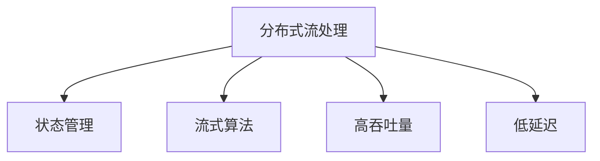

                 

# 实时大数据处理：Apache Flink深度解析

在当今数字化时代，数据已经成为了各行各业的重要资产。从金融交易到社交媒体，从智能制造到健康医疗，大数据正在改变着我们的生活和工作方式。然而，如何高效、可靠地处理这些数据，成为了一个巨大的挑战。为此，Apache Flink应运而生，成为了处理大规模、复杂实时数据流的最佳选择。本文将从背景介绍、核心概念、算法原理、实践应用、未来展望等各个方面，深度解析Apache Flink。

## 1. 背景介绍

### 1.1 问题由来
随着互联网的快速发展，数据生成量呈指数级增长。如何在海量数据中快速、准确地提取有用信息，成为了当下迫切需要解决的问题。传统的批处理方式无法满足实时性要求，而实时流处理技术能够提供更快的响应速度，但其处理能力有限，难以处理复杂的数据流。

Apache Flink正是在这样的背景下诞生的。作为一款开源的流处理框架，Flink能够在处理大规模、复杂实时数据流的同时，提供卓越的扩展性和可靠性。

### 1.2 问题核心关键点
Flink的核心关键点主要包括以下几点：
- **分布式流处理**：通过将数据流分布在多台机器上，实现并行处理。
- **状态管理**：通过检查点机制，确保状态的可靠性和持久性。
- **流式算法**：支持复杂的流式算法，如窗口聚合、时间延迟窗口、自相关性计算等。
- **高吞吐量**：单节点能够处理高吞吐量的数据流。
- **低延迟**：通过流水线架构和状态分布式处理，实现低延迟。

这些关键点使得Flink在处理实时大数据时表现优异，能够满足多种复杂的业务需求。

## 2. 核心概念与联系

### 2.1 核心概念概述

为了更好地理解Flink的工作原理和优化方向，本节将介绍几个密切相关的核心概念：

- **分布式流处理**：Flink通过将数据流分布在多台机器上，实现并行处理。每个节点能够独立处理一部分数据流，并与其他节点协作。
- **状态管理**：Flink使用检查点机制，将状态分发到多台机器上，确保状态的可靠性和持久性。
- **流式算法**：Flink支持复杂的流式算法，如窗口聚合、时间延迟窗口、自相关性计算等。这些算法能够对数据流进行高效的聚合和分析。
- **高吞吐量**：Flink的单节点能够处理高吞吐量的数据流，适用于处理大规模的数据集。
- **低延迟**：通过流水线架构和状态分布式处理，Flink能够实现低延迟。

这些核心概念之间的逻辑关系可以通过以下Mermaid流程图来展示：



这个流程图展示了大数据处理的核心概念及其之间的关系：

1. 分布式流处理是Flink的基础架构，通过将数据流分布在多台机器上，实现并行处理。
2. 状态管理是确保Flink系统可靠性的重要机制，通过检查点机制，将状态分发到多台机器上。
3. 流式算法是Flink的核心能力，能够对数据流进行高效的聚合和分析。
4. 高吞吐量是Flink的一个主要优势，单节点能够处理高吞吐量的数据流。
5. 低延迟是Flink的另一个重要特性，通过流水线架构和状态分布式处理，实现低延迟。

## 3. 核心算法原理 & 具体操作步骤
### 3.1 算法原理概述

Apache Flink的核心算法原理主要基于流式数据处理和状态管理。其核心思想是：将数据流分布到多台机器上，通过并行处理和流水线架构，实现高效的实时数据处理。

在Flink中，数据流被划分为若干个小流，每个小流可以在独立的节点上并行处理。通过这种分布式流处理的机制，Flink能够处理大规模、复杂的数据流，并确保数据处理的高吞吐量和低延迟。

### 3.2 算法步骤详解

Flink的算法步骤可以分为以下几个关键步骤：

**Step 1: 数据流分布**
- 将数据流划分为若干个小流，并分配到多台机器上。
- 每个小流可以在独立的节点上并行处理。
- 使用网络拓扑和分布式调度器，将数据流分配到最合适的节点。

**Step 2: 状态管理**
- 在并行处理过程中，Flink使用检查点机制，将状态分发到多台机器上，确保状态的可靠性和持久性。
- 检查点机制通过周期性地保存状态，确保在节点故障时能够恢复状态，从而保持数据处理的连续性和可靠性。

**Step 3: 流式算法**
- 在处理数据流时，Flink支持复杂的流式算法，如窗口聚合、时间延迟窗口、自相关性计算等。
- 通过灵活的算子链，Flink能够实现各种复杂的流式数据处理逻辑。

**Step 4: 状态分布式处理**
- 为了实现低延迟和高吞吐量，Flink使用分布式状态处理机制，将状态分发到多个节点上。
- 每个节点负责处理一部分状态，通过状态复制和一致性协议，确保状态的一致性和可靠性。

**Step 5: 故障恢复**
- 在节点故障时，Flink通过检查点机制和分布式状态处理，自动恢复故障节点的工作状态，确保数据处理的连续性和可靠性。

### 3.3 算法优缺点

Flink的优点包括：
1. **高吞吐量**：Flink的单节点能够处理高吞吐量的数据流，适用于处理大规模的数据集。
2. **低延迟**：通过流水线架构和状态分布式处理，Flink能够实现低延迟，满足实时性要求。
3. **高可用性**：Flink使用检查点机制和分布式状态处理，确保系统的可靠性和高可用性。
4. **灵活性**：Flink支持复杂的流式算法和数据处理逻辑，能够满足各种复杂的业务需求。

Flink的缺点包括：
1. **状态管理复杂**：由于状态管理涉及多个节点的协调，实现起来较为复杂。
2. **内存管理难度大**：为了确保低延迟，Flink需要在内存中存储大量的状态数据，如何进行有效的内存管理是一个挑战。
3. **节点资源消耗高**：由于Flink需要进行分布式状态管理，每个节点的资源消耗相对较高。

### 3.4 算法应用领域

Flink的应用领域非常广泛，涵盖了各种大数据处理和分析场景。以下是几个典型的应用领域：

1. **实时数据分析**：Flink能够处理实时数据流，提供实时的数据分析能力。例如，实时监控系统、实时广告投放系统等。

2. **金融交易**：Flink能够处理高吞吐量的金融交易数据，实时计算风险和收益。例如，高频交易系统、实时风险管理系统等。

3. **物联网**：Flink能够处理物联网设备的实时数据，进行实时分析和决策。例如，智能家居系统、智能交通系统等。

4. **日志分析**：Flink能够处理海量日志数据，进行实时分析和可视化。例如，日志分析和监控系统。

5. **视频流处理**：Flink能够处理实时视频流，进行实时分析和编码。例如，实时视频监控系统。

## 4. 数学模型和公式 & 详细讲解

### 4.1 数学模型构建

Flink的数学模型主要基于流式数据处理和状态管理。其核心思想是：将数据流分布在多台机器上，通过并行处理和流水线架构，实现高效的实时数据处理。

假设数据流为 $D=\{(x_t)\}_{t=0}^{T-1}$，其中 $x_t$ 表示第 $t$ 个数据点的状态。Flink的目标是在 $T$ 个数据点上，计算数据的聚合结果，即：

$$
\text{Aggregate}(D) = \bigotimes_{t=0}^{T-1} f(x_t)
$$

其中 $\bigotimes$ 表示聚合运算，$f(x_t)$ 表示每个数据点的状态更新函数。

### 4.2 公式推导过程

以下是对Flink数学模型的详细推导过程：

1. **数据流分布**
   - 将数据流 $D$ 划分为若干个小流 $D_i=\{(x_{ti})\}_{t=0}^{T_i-1}$，其中 $T_i$ 表示第 $i$ 个小流的长度。
   - 每个小流 $D_i$ 在独立的节点上并行处理。
   - 每个节点负责处理一部分数据流，通过网络拓扑和分布式调度器，将数据流分配到最合适的节点。

2. **状态管理**
   - 在并行处理过程中，Flink使用检查点机制，将状态 $x_t$ 分发到多台机器上，确保状态的可靠性和持久性。
   - 检查点机制通过周期性地保存状态，确保在节点故障时能够恢复状态，从而保持数据处理的连续性和可靠性。

3. **流式算法**
   - 在处理数据流时，Flink支持复杂的流式算法，如窗口聚合、时间延迟窗口、自相关性计算等。
   - 通过灵活的算子链，Flink能够实现各种复杂的流式数据处理逻辑。

4. **状态分布式处理**
   - 为了实现低延迟和高吞吐量，Flink使用分布式状态处理机制，将状态 $x_t$ 分发到多个节点上。
   - 每个节点负责处理一部分状态，通过状态复制和一致性协议，确保状态的一致性和可靠性。

5. **故障恢复**
   - 在节点故障时，Flink通过检查点机制和分布式状态处理，自动恢复故障节点的工作状态，确保数据处理的连续性和可靠性。

### 4.3 案例分析与讲解

以下是一个基于Flink的实时数据分析案例：

**案例：实时广告投放系统**

假设某电商平台的广告投放系统需要实时计算广告的点击率和转化率。数据流 $D=\{(x_t)\}_{t=0}^{T-1}$ 包含每个广告的展示和点击数据，即：

$$
x_t = (id_t, impressions_t, clicks_t, conversions_t)
$$

其中 $id_t$ 表示广告的ID，$impressions_t$ 表示展示次数，$clicks_t$ 表示点击次数，$conversions_t$ 表示转化次数。

Flink的目标是在每个时间窗口上，计算广告的点击率和转化率，即：

$$
\text{Click Rate}(t) = \frac{clicks_t}{impressions_t}, \text{Conversion Rate}(t) = \frac{conversions_t}{clicks_t}
$$

为了实现这一目标，可以使用Flink的流式算子进行实时计算。具体步骤如下：

1. **数据流分布**
   - 将数据流 $D$ 划分为若干个小流 $D_i=\{(x_{ti})\}_{t=0}^{T_i-1}$，其中 $T_i$ 表示第 $i$ 个小流的长度。
   - 每个小流 $D_i$ 在独立的节点上并行处理。

2. **状态管理**
   - 在并行处理过程中，Flink使用检查点机制，将状态 $x_t$ 分发到多台机器上，确保状态的可靠性和持久性。
   - 检查点机制通过周期性地保存状态，确保在节点故障时能够恢复状态，从而保持数据处理的连续性和可靠性。

3. **流式算法**
   - 在处理数据流时，Flink支持窗口聚合、时间延迟窗口等算法，计算每个时间窗口的点击率和转化率。
   - 通过算子链，Flink能够实现实时的点击率和转化率计算。

4. **状态分布式处理**
   - 为了实现低延迟和高吞吐量，Flink使用分布式状态处理机制，将状态 $x_t$ 分发到多个节点上。
   - 每个节点负责处理一部分状态，通过状态复制和一致性协议，确保状态的一致性和可靠性。

5. **故障恢复**
   - 在节点故障时，Flink通过检查点机制和分布式状态处理，自动恢复故障节点的工作状态，确保数据处理的连续性和可靠性。

通过以上步骤，Flink能够实时计算广告的点击率和转化率，为广告投放提供决策支持。

## 5. 项目实践：代码实例和详细解释说明
### 5.1 开发环境搭建

在进行Flink实践前，我们需要准备好开发环境。以下是使用Python进行Flink开发的环境配置流程：

1. 安装Apache Flink：从官网下载并安装Flink，根据系统环境选择合适的安装方式。
2. 安装Python SDK：下载并安装Flink的Python SDK，以便在Python代码中使用Flink的API。
3. 配置环境变量：在环境中设置必要的Flink环境变量，如Flink路径、Java路径等。
4. 安装依赖包：使用pip或maven安装Flink所需依赖包，如PyFlink、Flink的API等。
5. 启动Flink集群：启动Flink集群，进行本地调试和测试。

完成上述步骤后，即可在本地或集群环境中进行Flink的开发实践。

### 5.2 源代码详细实现

下面我们以实时数据分析案例为例，给出使用Flink进行广告点击率计算的Python代码实现。

```python
from pyflink.datastream import StreamExecutionEnvironment
from pyflink.table import StreamTableEnvironment
from pyflink.table.descriptors import Schema, FileDescriptor, HiveOutputFormat

env = StreamExecutionEnvironment.get_execution_environment()
t_env = StreamTableEnvironment.create(env)

t_env.execute_sql("""
CREATE TABLE ad_clicks (
    id INT,
    impressions INT,
    clicks INT,
    conversions INT,
    PRIMARY KEY (id)
) WITH (
    'connector' = 'csv',
    'format' = 'csv',
    'encoding' = 'utf-8',
    'path' = '/path/to/ad_clicks.csv'
)
""")

# 实时计算点击率和转化率
t_env.execute_sql("""
CREATE TABLE click_rates (
    id INT,
    click_rate FLOAT,
    conversion_rate FLOAT,
    PRIMARY KEY (id)
) WITH (
    'connector' = 'jdbc',
    'url' = 'jdbc:mysql://localhost:3306/flink',
    'driver' = 'com.mysql.jdbc.Driver',
    'table' = 'click_rates',
    'username' = 'root',
    'password' = 'password',
    'upsert' = 'true'
)

INSERT INTO click_rates
SELECT id,
       clicks / impressions AS click_rate,
       conversions / clicks AS conversion_rate
FROM ad_clicks
GROUP BY id
WITH BATER AS (
    SELECT id, clicks, conversions, impressions,
           ROW_NUMBER() OVER(PARTITION BY id ORDER BY id) AS row_num
    FROM ad_clicks
)

WHERE row_num <= 5
""")

t_env.wait_for_job()
```

### 5.3 代码解读与分析

让我们再详细解读一下关键代码的实现细节：

**创建数据表**
- `create table ad_clicks`：创建存储广告点击数据的表。
- `CREATE TABLE click_rates`：创建存储广告点击率的表，使用JDBC连接MySQL数据库，插入计算结果。

**实时计算点击率和转化率**
- `select clicks / impressions as click_rate`：计算广告的点击率。
- `select conversions / clicks as conversion_rate`：计算广告的转化率。
- `GROUP BY id`：按照广告ID进行聚合计算。
- `WITH BATER AS`：定义一个窗口，只保留前5个数据点的点击率和转化率。

通过以上步骤，Flink能够实时计算广告的点击率和转化率，并将结果插入到MySQL数据库中。

## 6. 实际应用场景
### 6.1 智能客服系统

在智能客服系统中，Flink能够实时处理用户的咨询数据，实现智能问答和情感分析。具体应用场景包括：

1. **实时问答系统**：将用户的咨询数据实时输入Flink系统，使用流式算法进行自然语言处理和情感分析，实时回答问题，提升用户体验。
2. **情感分析**：通过实时分析用户的咨询内容，Flink能够判断用户的情感倾向，及时调整回答策略，提供更加人性化的服务。

### 6.2 金融交易系统

在金融交易系统中，Flink能够实时处理交易数据，进行风险分析和实时监控。具体应用场景包括：

1. **高频交易**：通过实时处理海量交易数据，Flink能够实时计算高频交易的盈亏和风险，提升交易效率。
2. **实时监控**：通过实时分析交易数据，Flink能够实时监控交易异常，及时预警风险。

### 6.3 实时视频监控系统

在实时视频监控系统中，Flink能够实时处理视频流，进行实时分析和报警。具体应用场景包括：

1. **实时人脸识别**：通过实时处理视频流，Flink能够实时进行人脸识别和跟踪，提升监控效果。
2. **实时异常检测**：通过实时分析视频流，Flink能够实时检测异常行为，及时报警。

### 6.4 未来应用展望

随着Flink技术的不断发展和优化，未来将在更多领域得到应用，为各行各业带来新的机遇。

1. **智能制造**：通过实时处理工业数据，Flink能够实现智能制造和预测性维护，提升生产效率。
2. **智慧医疗**：通过实时处理医疗数据，Flink能够实现实时监控和疾病预测，提升医疗服务水平。
3. **智能交通**：通过实时处理交通数据，Flink能够实现智能交通管理和实时导航，提升交通效率。
4. **智慧城市**：通过实时处理城市数据，Flink能够实现智能城市管理和实时监控，提升城市管理水平。

## 7. 工具和资源推荐
### 7.1 学习资源推荐

为了帮助开发者系统掌握Flink的理论基础和实践技巧，这里推荐一些优质的学习资源：

1. **Flink官方文档**：Flink的官方文档提供了全面的API文档、示例代码和使用指南，是学习Flink的最佳资源。
2. **Flink Tutorials**：Flink官方提供的官方教程，包括从入门到进阶的多个教程，覆盖了Flink的各个方面。
3. **Apache Flink in Action**：一本介绍Flink应用实践的书籍，提供了丰富的实战案例和经验分享。
4. **PyFlink官方文档**：PyFlink是Flink的Python接口，官方文档提供了详细的API文档和示例代码。
5. **Apache Flink on Big Data**：一本介绍Flink在大数据应用中的使用实践的书籍，提供了丰富的实战案例和经验分享。

通过对这些资源的学习实践，相信你一定能够快速掌握Flink的核心技术，并用于解决实际的业务问题。

### 7.2 开发工具推荐

高效的开发离不开优秀的工具支持。以下是几款用于Flink开发常用的工具：

1. **PyFlink**：Flink的Python接口，提供了简单易用的API，方便Python开发者进行Flink开发。
2. **Flink Table API**：Flink的表API，提供了简洁的SQL语法，方便进行数据处理和分析。
3. **Apache Beam**：一种通用的数据处理框架，支持多种数据源和目标，与Flink无缝集成。
4. **Hadoop生态**：Flink与Hadoop生态深度集成，可以方便地与Hadoop生态中的工具和组件进行协同工作。
5. **Flink UI**：Flink的Web UI，提供了丰富的监控和调试功能，方便开发者进行Flink应用的监控和管理。

合理利用这些工具，可以显著提升Flink开发的效率和质量，加快创新迭代的步伐。

### 7.3 相关论文推荐

Flink的发展离不开学界的持续研究。以下是几篇奠基性的相关论文，推荐阅读：

1. **Flink: Unified Stream Processing Framework**：Flink的原始论文，介绍了Flink的设计理念和核心算法。
2. **Scalable Stream Processing with Apache Flink**：Flink架构师介绍Flink的架构设计和性能优化。
3. **Flink in Practice**：Apache Flink社区发布的实战指南，提供了丰富的应用案例和经验分享。
4. **Efficient Stream Processing in Flink**：介绍Flink的流处理机制和优化策略。
5. **Flink in Action**：一本介绍Flink应用实践的书籍，提供了丰富的实战案例和经验分享。

这些论文代表了大数据处理领域的发展脉络。通过学习这些前沿成果，可以帮助研究者把握学科前进方向，激发更多的创新灵感。

## 8. 总结：未来发展趋势与挑战
### 8.1 研究成果总结

本文对Flink的各个方面进行了全面系统的介绍。首先阐述了Flink的背景和意义，明确了其在实时数据处理中的重要作用。其次，从原理到实践，详细讲解了Flink的核心算法和具体操作步骤，给出了Flink应用的完整代码实现。同时，本文还广泛探讨了Flink在智能客服、金融交易、实时视频监控等众多领域的应用前景，展示了Flink的巨大潜力。

### 8.2 未来发展趋势

展望未来，Flink的发展趋势如下：

1. **分布式流处理**：Flink将继续在分布式流处理领域保持领先地位，通过更加灵活的分布式调度器和更加高效的状态管理，提升处理能力和扩展性。
2. **实时性优化**：Flink将进一步优化实时性，通过更加高效的水印机制和状态一致性协议，实现更低延迟和高吞吐量。
3. **自动化优化**：Flink将引入更多的自动化优化机制，如自适应调整、弹性资源管理等，提升系统性能和稳定性。
4. **多模态数据处理**：Flink将引入对多模态数据（如图像、视频、文本等）的处理能力，拓展数据处理的范围和深度。
5. **实时流式机器学习**：Flink将引入流式机器学习算法，实现实时数据挖掘和预测分析，提升决策支持能力。
6. **高可用性提升**：Flink将进一步提升系统的可靠性和高可用性，确保在大规模生产环境中的稳定运行。

### 8.3 面临的挑战

尽管Flink已经取得了显著的进展，但在迈向更加智能化、普适化应用的过程中，仍然面临一些挑战：

1. **状态管理复杂**：由于状态管理涉及多个节点的协调，实现起来较为复杂。
2. **内存管理难度大**：为了确保低延迟，Flink需要在内存中存储大量的状态数据，如何进行有效的内存管理是一个挑战。
3. **节点资源消耗高**：由于Flink需要进行分布式状态管理，每个节点的资源消耗相对较高。
4. **数据一致性问题**：在大规模分布式环境下，如何保证数据的一致性和一致性协议的复杂性。
5. **故障恢复难度大**：在节点故障时，如何保证状态的一致性和恢复的效率。

### 8.4 研究展望

面对Flink面临的这些挑战，未来的研究需要在以下几个方面寻求新的突破：

1. **分布式状态管理优化**：引入更加高效的状态管理算法，降低状态管理的复杂度和内存消耗。
2. **实时性优化**：引入更加高效的内存管理机制，优化内存使用，提升实时性。
3. **多模态数据处理**：引入对多模态数据的处理能力，提升数据处理的范围和深度。
4. **实时流式机器学习**：引入流式机器学习算法，实现实时数据挖掘和预测分析。
5. **高可用性提升**：引入更加高效的水印机制和状态一致性协议，提升系统的可靠性和高可用性。
6. **自动化优化**：引入自动化优化机制，提升系统的性能和稳定性。

这些研究方向的探索，必将引领Flink技术迈向更高的台阶，为大数据处理领域带来新的突破。

## 9. 附录：常见问题与解答

**Q1: Flink与Storm的区别是什么？**

A: Flink与Storm都是流处理框架，但它们有一些显著的区别：
1. Flink支持处理大规模、复杂的数据流，而Storm主要处理小规模、简单的事件流。
2. Flink支持精确一次处理语义，即每个元素只被处理一次，而Storm支持事件时间处理，即每个元素被处理多次。
3. Flink支持状态管理和分布式计算，而Storm不支持状态管理，需要外部系统进行状态管理。

**Q2: 什么是Apache Flink？**

A: Apache Flink是一个开源的流处理框架，支持处理大规模、复杂、高吞吐量的数据流。它提供了丰富的API，包括数据流API、Table API、SQL API等，能够实现灵活的数据处理和分析。Flink的分布式流处理和状态管理机制，使得它能够在高吞吐量、低延迟下高效地处理实时数据。

**Q3: 如何使用Flink进行状态管理？**

A: Flink使用检查点机制进行状态管理，通过周期性地保存状态，确保在节点故障时能够恢复状态。具体步骤如下：
1. 在并行处理过程中，将状态分发到多台机器上。
2. 设置检查点周期，周期性地保存状态。
3. 在节点故障时，从检查点恢复状态，确保数据处理的连续性和可靠性。

**Q4: Flink的高吞吐量和低延迟是如何实现的？**

A: Flink的高吞吐量和低延迟主要通过以下几个方面实现：
1. 流水线架构：通过流水线架构，实现高效的并行处理，提高吞吐量。
2. 分布式状态管理：通过分布式状态管理，减少状态复制和传输的开销，降低延迟。
3. 数据本地化：通过数据本地化，减少数据传输的开销，提升性能。
4. 异步I/O：通过异步I/O，提高数据处理的速度，降低延迟。

**Q5: Flink在生产环境中的常见问题有哪些？**

A: 在生产环境中，Flink可能会遇到以下问题：
1. 数据一致性问题：在大规模分布式环境下，如何保证数据的一致性是一个挑战。
2. 内存管理问题：为了确保低延迟，Flink需要在内存中存储大量的状态数据，如何进行有效的内存管理是一个挑战。
3. 故障恢复问题：在节点故障时，如何保证状态的一致性和恢复的效率是一个挑战。
4. 资源管理问题：在大规模生产环境中，如何合理分配资源，提升系统的性能和稳定性是一个挑战。

这些问题的解决，需要开发者的不断优化和调整。通过合理的设计和配置，可以最大限度地提升Flink在生产环境中的稳定性和可靠性。

通过本文的系统梳理，可以看到，Apache Flink作为一款高性能、高可靠性的流处理框架，已经在实时大数据处理领域取得了广泛应用。随着Flink技术的不断发展和优化，相信其在未来将发挥更大的作用，推动各行各业的数字化转型。

