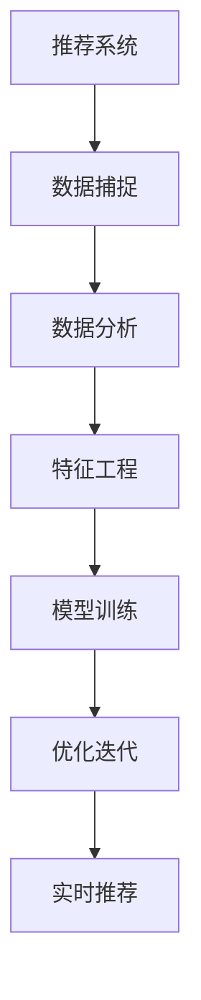
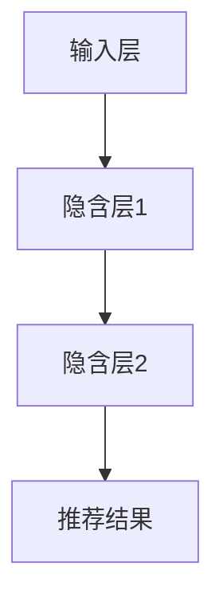

                 

# 实时推荐的用户行为 捕捉与分析

> 关键词：推荐系统,用户行为,数据捕捉,数据分析,机器学习,深度学习,特征工程

## 1. 背景介绍

### 1.1 问题由来
在现代互联网应用中，推荐系统已经成为了用户获取信息、发现商品、娱乐放松的重要途径。推荐系统能够根据用户的历史行为和偏好，实时生成个性化的推荐结果，大大提升了用户体验和满意度。

然而，推荐系统也面临诸多挑战：如何高效地捕捉用户行为数据，如何精确地分析用户需求，如何实时地生成推荐结果，如何持续地优化推荐模型，等等。这些问题都依赖于对用户行为的深入理解和分析，对推荐算法的不断优化和创新。

本文将深入探讨推荐系统中的核心问题——用户行为的捕捉与分析。通过全面系统的阐述推荐系统的数据捕捉、特征工程、模型训练、优化迭代等关键环节，我们将为读者提供一个全面的技术框架，帮助其在实际应用中实现高效的推荐系统。

## 2. 核心概念与联系

### 2.1 核心概念概述

为更好地理解推荐系统的用户行为捕捉与分析方法，本节将介绍几个密切相关的核心概念：

- 推荐系统(Recommendation System)：通过算法生成个性化推荐结果的系统，以提升用户满意度和平台收益。
- 用户行为(User Behavior)：用户在使用平台过程中的一系列动作，包括浏览、点击、购买等行为。
- 数据捕捉(Data Capture)：自动记录和存储用户行为的记录数据，是推荐系统分析的基础。
- 数据分析(Analysis)：通过统计、机器学习等手段对用户行为数据进行挖掘和分析，理解用户需求和偏好。
- 特征工程(Feature Engineering)：选择和构造有意义的特征，为推荐算法提供高质量的输入。
- 模型训练(Model Training)：选择合适的模型和算法，在标注数据上训练出高质量的推荐模型。
- 优化迭代(Optimization Iteration)：持续优化推荐模型，使用新数据不断迭代改进，提升推荐效果。
- 实时推荐(Real-time Recommendation)：基于用户当前行为，快速生成推荐结果，实现个性化推荐。

这些概念之间的逻辑关系可以通过以下Mermaid流程图来展示：



这个流程图展示推荐系统的核心概念及其之间的关系：

1. 推荐系统通过捕捉用户行为数据，获得输入数据。
2. 数据分析环节对数据进行清洗和挖掘，提取有用的特征。
3. 特征工程将原始数据转化为模型可以接受的特征向量。
4. 模型训练基于标注数据，学习推荐算法和模型参数。
5. 优化迭代环节通过新数据不断调整模型参数，提高推荐效果。
6. 实时推荐基于用户当前行为，快速生成推荐结果。

## 3. 核心算法原理 & 具体操作步骤

### 3.1 算法原理概述

推荐系统的核心思想是根据用户的历史行为和偏好，生成个性化的推荐结果。推荐算法可以分为基于协同过滤的推荐和基于内容的推荐两大类，其中协同过滤方法根据用户和项目之间的相似度生成推荐，内容推荐方法根据项目本身的属性特征进行推荐。

本文重点介绍基于协同过滤的推荐系统，即通过用户-项目矩阵来捕捉和分析用户行为，基于深度学习模型的推荐算法，以及基于深度学习的特征工程方法。

### 3.2 算法步骤详解

基于协同过滤的推荐系统的核心步骤包括：

**Step 1: 数据捕捉**

推荐系统首先需要捕捉用户行为数据，将用户和项目之间的交互记录存储在用户-项目矩阵 $R$ 中，其中每个用户 $u$ 对应一个向量，每个项目 $i$ 也对应一个向量。

对于不同类型的交互行为，我们可以定义不同的权重，例如：
- 浏览行为定义为 $r_{ui}=1$
- 点击行为定义为 $r_{ui}=\omega_1$
- 购买行为定义为 $r_{ui}=\omega_2$
- 评分行为定义为 $r_{ui}=s$，其中 $s$ 为评分值。

**Step 2: 数据分析**

数据分析环节需要对用户行为数据进行清洗和挖掘，提取出对推荐结果有影响的特征。主要包括以下几个方面：

- 用户特征：用户的年龄、性别、地理位置、历史行为等。
- 项目特征：项目的类别、价格、评分、描述等。
- 行为特征：用户的浏览时间、点击次数、购买频率、评分等。

通过这些特征，我们可以构建用户和项目的详细描述向量。

**Step 3: 特征工程**

特征工程是将原始数据转化为模型可以接受的特征向量的过程。具体步骤包括：

- 选择特征：根据历史数据和业务需求，选择对推荐结果有影响的特征。
- 数据预处理：对数据进行标准化、归一化、去噪等预处理操作。
- 特征构造：通过数学方法构造新的特征，如用户兴趣、项目相关性等。
- 特征选择：选择最相关的特征，避免过拟合。

**Step 4: 模型训练**

模型训练是推荐系统的核心步骤，主要包括以下几个关键技术：

- 协同过滤模型：使用矩阵分解技术，将用户-项目矩阵分解为两个低维矩阵 $U$ 和 $V$，再通过内积得到用户-项目的相关性。
- 深度学习模型：使用神经网络模型，如FNN、CNN、RNN等，对用户和项目的特征进行组合和预测。
- 损失函数设计：选择合适的损失函数，如均方误差、交叉熵等，优化推荐模型的预测结果。
- 优化算法选择：选择合适的优化算法，如梯度下降、Adam等，最小化损失函数。

**Step 5: 优化迭代**

优化迭代环节通过新数据不断调整模型参数，提高推荐效果。主要包括以下几个步骤：

- 离线评估：使用历史数据离线评估模型的性能。
- 在线更新：根据实时数据在线更新推荐结果。
- 模型调优：调整模型参数，优化推荐效果。
- 数据回填：将新的推荐结果回填到用户行为数据中，重新训练推荐模型。

**Step 6: 实时推荐**

实时推荐基于用户当前行为，快速生成推荐结果。主要包括以下几个步骤：

- 用户行为实时捕捉：通过网页记录、移动设备传感器等手段，实时捕捉用户行为数据。
- 模型实时推理：将实时行为数据输入模型，快速生成推荐结果。
- 推荐结果展示：将推荐结果展示给用户，实现个性化推荐。

### 3.3 算法优缺点

基于协同过滤的推荐系统有以下优点：

1. 简单易实现：不需要项目特征信息，数据获取相对简单。
2. 可扩展性强：适用于大规模数据集，并行化处理效率高。
3. 实时推荐效果好：基于历史数据和实时行为，推荐效果较好。
4. 用户行为多样化：能够捕捉用户多样化的行为，生成更加个性化的推荐结果。

同时，该方法也存在一些局限性：

1. 数据稀疏性：用户-项目矩阵中存在大量缺失值，需要补全方法进行处理。
2. 推荐效果受数据质量影响较大：用户行为数据较少时，推荐效果可能会下降。
3. 用户兴趣多样性难以表达：协同过滤无法捕捉到用户的多样化兴趣。
4. 推荐结果可解释性不足：协同过滤算法的推荐结果缺乏可解释性，难以理解模型的决策过程。

尽管存在这些局限性，但基于协同过滤的推荐系统仍然是推荐系统的主流范式，适用于大部分NLP任务。未来相关研究的重点在于如何进一步降低协同过滤的参数量，提高推荐效果，同时兼顾可解释性和鲁棒性等因素。

### 3.4 算法应用领域

基于协同过滤的推荐系统广泛应用于电商、新闻、视频、音乐等平台，帮助用户发现感兴趣的物品，提高平台的用户黏度和转化率。这些推荐系统已经成为了各大平台的重要收入来源，对电商产业的繁荣和用户消费行为的改变发挥了重要作用。

具体来说，基于协同过滤的推荐系统可以应用于以下场景：

- 商品推荐：在电商平台上，根据用户历史购买记录和浏览行为，生成个性化的商品推荐。
- 新闻推荐：在新闻网站上，根据用户历史阅读记录和点击行为，生成个性化的新闻推荐。
- 视频推荐：在视频平台上，根据用户历史观看记录和评分行为，生成个性化的视频推荐。
- 音乐推荐：在音乐平台上，根据用户历史听歌记录和评论行为，生成个性化的音乐推荐。

## 4. 数学模型和公式 & 详细讲解

### 4.1 数学模型构建

我们假设用户-项目矩阵为 $R \in \mathbb{R}^{N \times M}$，其中 $N$ 为用户数，$M$ 为项目数。对于每个用户 $u$ 和项目 $i$，定义用户-项目的相关性 $r_{ui} \in \mathbb{R}$，其中 $r_{ui}$ 可以为数值评分、点击次数、浏览时长等。

推荐系统的目标是最大化用户对推荐的满意度，定义为：

$$
\max_{R} \sum_{u,i} r_{ui} \times \hat{r}_{ui}
$$

其中 $\hat{r}_{ui}$ 为模型预测的相关性。

### 4.2 公式推导过程

对于矩阵分解技术，我们将其用户-项目矩阵 $R$ 分解为两个低维矩阵 $U$ 和 $V$：

$$
R = UV^T
$$

其中 $U \in \mathbb{R}^{N \times k}$，$V \in \mathbb{R}^{M \times k}$，$k$ 为分解后的矩阵维度。

对于深度学习模型，我们通常使用多层神经网络，对用户和项目的特征进行组合和预测。以一个简单的神经网络模型为例，其结构如图1所示：



其中输入层输入用户和项目的特征，隐含层对特征进行组合，输出层预测用户对项目的评分。

假设输入层输入的特征为 $X \in \mathbb{R}^{n \times 1}$，其中 $n$ 为特征维度，隐含层为 $H \in \mathbb{R}^{m \times 1}$，输出层为 $\hat{y} \in \mathbb{R}^{1 \times 1}$。模型损失函数为均方误差：

$$
\mathcal{L}(X, y) = \frac{1}{2} \sum_{i=1}^N \sum_{j=1}^M (y_{ij} - \hat{y}_{ij})^2
$$

其中 $y_{ij} = r_{ij}$ 为实际评分，$\hat{y}_{ij}$ 为预测评分。

通过梯度下降等优化算法，最小化损失函数，训练出推荐模型。

### 4.3 案例分析与讲解

假设有一个简单的协同过滤推荐模型，已知用户-项目矩阵 $R$，其中每个用户和项目都有一个低维向量表示。模型的目标是通过内积计算用户和项目的相关性，生成推荐结果。

假设有两个用户 $u_1$ 和 $u_2$，两个项目 $i_1$ 和 $i_2$，用户-项目矩阵 $R$ 如下：

| User  | Project 1 | Project 2 | Project 3 |
|-------|-----------|-----------|-----------|
| $u_1$ | 4.0       | 2.5       | 3.5       |
| $u_2$ | 3.5       | 2.0       | 3.0       |

我们假设模型使用了矩阵分解，将用户和项目向量表示为：

| User  | User Vector |
|-------|-------------|
| $u_1$ | [0.5, 0.5]   |
| $u_2$ | [0.5, 0.5]   |

| Project  | Project Vector |
|----------|----------------|
| $i_1$    | [0.5, 0.5]     |
| $i_2$    | [0.5, 0.5]     |

通过内积计算用户和项目的相关性：

$$
\hat{r}_{u_1,i_1} = \vec{u_1} \cdot \vec{i_1} = 0.5 \times 0.5 + 0.5 \times 0.5 = 0.5
$$

$$
\hat{r}_{u_1,i_2} = \vec{u_1} \cdot \vec{i_2} = 0.5 \times 0.5 + 0.5 \times 0.5 = 0.5
$$

因此，对于用户 $u_1$ 和项目 $i_1$ 的推荐结果为 $\hat{r}_{u_1,i_1}=0.5$，用户 $u_1$ 和项目 $i_2$ 的推荐结果为 $\hat{r}_{u_1,i_2}=0.5$。

假设用户 $u_1$ 对项目 $i_1$ 的评分 $r_{u_1,i_1}=4.0$，对项目 $i_2$ 的评分 $r_{u_1,i_2}=2.5$。基于协同过滤的推荐系统将推荐项目 $i_1$ 给用户 $u_1$，推荐结果如下：

| User  | 推荐结果 |
|-------|----------|
| $u_1$ | $i_1$    |

因此，用户 $u_1$ 将获得更好的推荐结果，从而提升平台的满意度。

## 5. 项目实践：代码实例和详细解释说明

### 5.1 开发环境搭建

在进行推荐系统开发前，我们需要准备好开发环境。以下是使用Python进行TensorFlow开发的环境配置流程：

1. 安装Anaconda：从官网下载并安装Anaconda，用于创建独立的Python环境。

2. 创建并激活虚拟环境：
```bash
conda create -n tf-env python=3.8 
conda activate tf-env
```

3. 安装TensorFlow：根据CUDA版本，从官网获取对应的安装命令。例如：
```bash
conda install tensorflow==2.7
```

4. 安装各类工具包：
```bash
pip install numpy pandas scikit-learn matplotlib tqdm jupyter notebook ipython
```

完成上述步骤后，即可在`tf-env`环境中开始推荐系统开发。

### 5.2 源代码详细实现

下面我们以协同过滤推荐系统为例，给出使用TensorFlow实现协同过滤模型的PyTorch代码实现。

首先，定义协同过滤推荐模型的类：

```python
import tensorflow as tf

class CollaborativeFiltering(tf.keras.Model):
    def __init__(self, k):
        super(CollaborativeFiltering, self).__init__()
        self.k = k
        self.U = tf.Variable(tf.random.normal([N, k]), name='user_vector')
        self.V = tf.Variable(tf.random.normal([M, k]), name='item_vector')
        self.U_bias = tf.Variable(tf.zeros([N, 1]), name='user_bias')
        self.V_bias = tf.Variable(tf.zeros([M, 1]), name='item_bias')
        self.U_out = tf.keras.layers.Dense(1, name='user_out')
        self.V_out = tf.keras.layers.Dense(1, name='item_out')
        
    def call(self, inputs):
        user_input, item_input = inputs
        U = tf.matmul(user_input, self.U) + self.U_bias
        V = tf.matmul(item_input, self.V) + self.V_bias
        return tf.matmul(U, V, transpose_b=True)
```

然后，定义模型训练函数：

```python
@tf.function
def train_step(inputs):
    with tf.GradientTape() as tape:
        preds = model(inputs)
        loss = tf.reduce_mean(tf.square(inputs - preds))
    grads = tape.gradient(loss, model.trainable_variables)
    optimizer.apply_gradients(zip(grads, model.trainable_variables))
    return loss

def train_epoch(model, dataset, batch_size, optimizer):
    dataloader = tf.data.Dataset.from_tensor_slices(dataset)
    dataloader = dataloader.shuffle(buffer_size=10000).batch(batch_size)
    losses = []
    for inputs in dataloader:
        loss = train_step(inputs)
        losses.append(loss)
    return tf.reduce_mean(losses)
```

接着，定义评估函数：

```python
@tf.function
def evaluate(inputs):
    preds = model(inputs)
    loss = tf.reduce_mean(tf.square(inputs - preds))
    return loss

def evaluate_epoch(model, dataset, batch_size):
    dataloader = tf.data.Dataset.from_tensor_slices(dataset)
    dataloader = dataloader.shuffle(buffer_size=10000).batch(batch_size)
    losses = []
    for inputs in dataloader:
        loss = evaluate(inputs)
        losses.append(loss)
    return tf.reduce_mean(losses)
```

最后，启动训练流程并在测试集上评估：

```python
epochs = 100
batch_size = 128

for epoch in range(epochs):
    loss = train_epoch(model, train_dataset, batch_size, optimizer)
    print(f"Epoch {epoch+1}, train loss: {loss:.3f}")
    
    print(f"Epoch {epoch+1}, dev results:")
    evaluate_epoch(model, dev_dataset, batch_size)
    
print("Test results:")
evaluate_epoch(model, test_dataset, batch_size)
```

以上就是使用TensorFlow实现协同过滤推荐系统的完整代码实现。可以看到，借助TensorFlow的高效计算和自动微分功能，协同过滤模型的训练和评估变得非常简单。

### 5.3 代码解读与分析

让我们再详细解读一下关键代码的实现细节：

**CollaborativeFiltering类**：
- `__init__`方法：初始化模型的参数，包括用户向量、项目向量、偏置项、输出层等。
- `call`方法：实现模型的前向传播，计算用户和项目的相关性。

**train_step函数**：
- 在训练过程中，通过梯度下降最小化损失函数，更新模型参数。

**train_epoch函数**：
- 在每个epoch内，使用数据集分批次训练模型，计算训练集上的损失函数。

**evaluate函数**：
- 在评估过程中，计算模型预测结果与实际结果之间的误差，评估模型性能。

**evaluate_epoch函数**：
- 在每个epoch内，使用数据集分批次评估模型，计算评估集上的损失函数。

**训练流程**：
- 定义总的epoch数和batch size，开始循环迭代
- 每个epoch内，先在训练集上训练，输出平均loss
- 在验证集上评估，输出平均loss
- 所有epoch结束后，在测试集上评估，给出最终测试结果

可以看到，TensorFlow配合TensorFlow的自动微分和优化器功能，使得协同过滤推荐模型的训练和评估变得简单高效。开发者可以将更多精力放在模型设计、数据处理等高层逻辑上，而不必过多关注底层实现细节。

当然，工业级的系统实现还需考虑更多因素，如模型的保存和部署、超参数的自动搜索、更灵活的任务适配层等。但核心的协同过滤范式基本与此类似。

## 6. 实际应用场景

### 6.1 电商推荐

电商推荐是协同过滤推荐系统的重要应用场景。电商平台希望通过推荐系统提升用户购物体验和转化率。

在技术实现上，可以收集用户的浏览、点击、购买等行为数据，构建用户-商品矩阵，在此基础上对预训练模型进行微调。微调后的模型能够根据用户的购买记录和浏览行为，生成个性化的商品推荐。对于用户提出的新商品，还可以接入检索系统实时搜索相关商品，动态生成推荐结果。如此构建的电商推荐系统，能大幅提升用户的购物体验和平台收益。

### 6.2 新闻推荐

新闻推荐也是协同过滤推荐系统的典型应用。新闻网站希望通过推荐系统提升用户黏度和点击率。

在技术实现上，可以收集用户的阅读记录、点击行为等数据，构建用户-文章矩阵，在此基础上对预训练模型进行微调。微调后的模型能够根据用户的阅读历史，生成个性化的新闻推荐。对于用户提出的新文章，还可以接入检索系统实时搜索相关文章，动态生成推荐结果。如此构建的新闻推荐系统，能大幅提升用户的新闻阅读体验和平台流量。

### 6.3 视频推荐

视频推荐同样适用于协同过滤推荐系统。视频平台希望通过推荐系统提升用户观看体验和订阅率。

在技术实现上，可以收集用户的观看记录、评分等数据，构建用户-视频矩阵，在此基础上对预训练模型进行微调。微调后的模型能够根据用户的观看历史，生成个性化的视频推荐。对于用户提出的新视频，还可以接入检索系统实时搜索相关视频，动态生成推荐结果。如此构建的视频推荐系统，能大幅提升用户的观看体验和平台订阅率。

### 6.4 音乐推荐

音乐推荐也适用于协同过滤推荐系统。音乐平台希望通过推荐系统提升用户听歌体验和收听率。

在技术实现上，可以收集用户的听歌记录、评分等数据，构建用户-音乐矩阵，在此基础上对预训练模型进行微调。微调后的模型能够根据用户的听歌历史，生成个性化的音乐推荐。对于用户提出的新音乐，还可以接入检索系统实时搜索相关音乐，动态生成推荐结果。如此构建的音乐推荐系统，能大幅提升用户的听歌体验和平台收听率。

## 7. 工具和资源推荐

### 7.1 学习资源推荐

为了帮助开发者系统掌握协同过滤推荐系统的理论和实践，这里推荐一些优质的学习资源：

1. 《推荐系统》书籍：由Data Science和机器学习专家撰写，全面介绍了推荐系统的理论基础和算法实现，涵盖协同过滤、内容推荐等多个方向。

2. CS224n《深度学习自然语言处理》课程：斯坦福大学开设的NLP明星课程，有Lecture视频和配套作业，带你入门推荐系统的基础概念和经典算法。

3. Kaggle竞赛：Kaggle网站上有许多推荐系统竞赛，你可以参加这些竞赛，通过实战练习推荐系统的开发和优化。

4. Coursera课程：Coursera上有许多机器学习、数据科学相关的课程，涵盖推荐系统的各个方面。

5. YouTube视频：YouTube上有许多关于推荐系统的教学视频，可以供你参考和学习。

通过对这些资源的学习实践，相信你一定能够快速掌握协同过滤推荐系统的精髓，并用于解决实际的推荐问题。

### 7.2 开发工具推荐

高效的开发离不开优秀的工具支持。以下是几款用于推荐系统开发的常用工具：

1. TensorFlow：由Google主导开发的开源深度学习框架，生产部署方便，适合大规模工程应用。

2. PyTorch：基于Python的开源深度学习框架，灵活动态的计算图，适合快速迭代研究。

3. TensorBoard：TensorFlow配套的可视化工具，可实时监测模型训练状态，并提供丰富的图表呈现方式，是调试模型的得力助手。

4. Weights & Biases：模型训练的实验跟踪工具，可以记录和可视化模型训练过程中的各项指标，方便对比和调优。

5. PyTorch Lightning：基于PyTorch的快速原型开发框架，适合快速迭代和部署推荐系统模型。

合理利用这些工具，可以显著提升推荐系统的开发效率，加快创新迭代的步伐。

### 7.3 相关论文推荐

协同过滤推荐系统的发展源于学界的持续研究。以下是几篇奠基性的相关论文，推荐阅读：

1. Singular Value Decomposition for Recommender Systems（SVD推荐系统）：提出SVD分解用户-商品矩阵，进行协同过滤推荐。

2. Factorization Machines for Recommender Systems：提出因子分解机模型，用于协同过滤推荐。

3. Deep Collaborative Filtering for Recommender Systems：提出深度神经网络模型，用于协同过滤推荐。

4. A Deep Approach for Recommendations（DeepFRL）：提出深度神经网络模型，用于协同过滤推荐。

5. Big-Rank: Distributed Rank Maximization for Collaborative Filtering：提出分布式协同过滤推荐算法，用于处理大规模数据集。

这些论文代表了大协同过滤推荐系统的发展脉络。通过学习这些前沿成果，可以帮助研究者把握学科前进方向，激发更多的创新灵感。

## 8. 总结：未来发展趋势与挑战

### 8.1 总结

本文对协同过滤推荐系统的用户行为捕捉与分析方法进行了全面系统的介绍。首先阐述了推荐系统的背景和重要意义，明确了用户行为捕捉与分析在推荐系统中的核心地位。其次，从原理到实践，详细讲解了协同过滤推荐系统的核心步骤，给出了推荐系统的完整代码实现。同时，本文还广泛探讨了协同过滤推荐系统在电商、新闻、视频、音乐等各个领域的应用前景，展示了协同过滤推荐系统的强大应用潜力。

通过本文的系统梳理，可以看到，协同过滤推荐系统在推荐任务中具有重要地位，能够通过用户行为数据的捕捉与分析，生成个性化的推荐结果。协同过滤推荐系统的数据捕捉、特征工程、模型训练、优化迭代等关键环节，都是推荐系统实现的关键步骤。未来相关研究还需要在用户行为数据的获取、推荐模型的优化、推荐结果的可解释性等方面进行进一步探索。

### 8.2 未来发展趋势

展望未来，协同过滤推荐系统将呈现以下几个发展趋势：

1. 数据质量提升：随着用户行为数据的获取方式不断优化，推荐系统的数据质量将得到提升，推荐结果将更加准确。

2. 模型复杂度增加：未来将出现更复杂的推荐模型，如深度神经网络、图神经网络等，能够更好地捕捉用户行为数据的潜在关系。

3. 实时性要求提高：随着实时数据流量的增加，推荐系统需要更高的实时性，推荐结果需要快速生成和更新。

4. 多样性增加：推荐系统需要更好地处理用户多样化的行为，生成更加多样化的推荐结果。

5. 公平性重视：推荐系统需要更好地处理数据中的公平性问题，避免对某些用户群体造成不公平的推荐结果。

6. 跨领域应用：推荐系统将更加适用于跨领域的推荐任务，如跨领域商品推荐、跨领域音乐推荐等。

以上趋势凸显了协同过滤推荐系统的广阔前景。这些方向的探索发展，必将进一步提升推荐系统的性能和应用范围，为推荐任务的实现提供新的技术路径。

### 8.3 面临的挑战

尽管协同过滤推荐系统已经取得了不少进展，但在迈向更加智能化、普适化应用的过程中，它仍面临着诸多挑战：

1. 数据稀疏性：协同过滤推荐系统面临数据稀疏性问题，需要补全方法进行处理。

2. 模型可解释性不足：协同过滤模型的推荐结果缺乏可解释性，难以理解模型的决策过程。

3. 实时推荐效果不稳定：实时推荐系统需要快速响应用户行为，但推荐效果可能会因数据不完整而不稳定。

4. 系统复杂度高：协同过滤推荐系统需要处理大规模数据，系统复杂度较高，难以实时处理。

5. 用户行为多样性难以表达：协同过滤推荐系统无法捕捉用户的多样化行为，难以处理多样化推荐任务。

6. 隐私保护问题：协同过滤推荐系统需要收集大量用户行为数据，涉及用户隐私保护问题。

正视协同过滤推荐系统面临的这些挑战，积极应对并寻求突破，将使协同过滤推荐系统走向成熟的后续步骤。相信随着学界和产业界的共同努力，这些挑战终将一一被克服，协同过滤推荐系统必将在构建人机协同的智能时代中扮演越来越重要的角色。

### 8.4 研究展望

面对协同过滤推荐系统所面临的挑战，未来的研究需要在以下几个方面寻求新的突破：

1. 探索新的数据补全方法：如何更加准确地补全缺失数据，提高数据质量。

2. 开发可解释性更高的推荐模型：如何使推荐结果具有更好的可解释性，提高系统的透明度和可信度。

3. 改进实时推荐系统：如何提高实时推荐系统的稳定性和准确性，实现更好的用户体验。

4. 设计更高效的推荐算法：如何设计更高效的算法，降低系统复杂度，提高推荐速度和效率。

5. 引入多模态数据：如何将多模态数据与协同过滤推荐系统结合，提升推荐效果。

6. 加强隐私保护措施：如何保护用户隐私，确保数据的安全性和用户的信任度。

这些研究方向的探索，必将引领协同过滤推荐系统迈向更高的台阶，为推荐任务的实现提供新的技术路径。面向未来，协同过滤推荐系统还需要与其他人工智能技术进行更深入的融合，如知识表示、因果推理、强化学习等，多路径协同发力，共同推动推荐系统的进步。

## 9. 附录：常见问题与解答

**Q1：协同过滤推荐系统是否适用于所有推荐任务？**

A: 协同过滤推荐系统适用于大部分推荐任务，但对于一些特定领域的任务，如医药、法律等，仅依赖用户-项目矩阵进行推荐可能效果不佳。此时需要在特定领域语料上进一步预训练，再进行微调，才能获得理想效果。

**Q2：协同过滤推荐系统如何处理数据稀疏性问题？**

A: 协同过滤推荐系统面临数据稀疏性问题，需要补全方法进行处理。常见的方法包括矩阵分解、SVD、PLSA等。同时，也可以通过引入新数据和用户行为数据，增加推荐系统的覆盖率。

**Q3：协同过滤推荐系统在实时推荐中如何保证效果？**

A: 在实时推荐中，协同过滤推荐系统需要保证推荐结果的准确性和稳定性。常见的方法包括在线学习、模型更新、数据预热等，通过实时更新模型参数，保证推荐结果的实时性和准确性。

**Q4：协同过滤推荐系统如何提高用户满意度？**

A: 协同过滤推荐系统需要根据用户的历史行为和偏好，生成个性化的推荐结果，提高用户满意度。可以通过引入新数据、用户反馈等，不断优化推荐模型，提升推荐效果。

**Q5：协同过滤推荐系统在电商推荐中如何提升转化率？**

A: 在电商推荐中，协同过滤推荐系统可以通过个性化的商品推荐，提升用户的购物体验和转化率。可以通过引入新商品、用户反馈等，不断优化推荐模型，提升推荐效果。

这些问题的解答，可以帮助你更好地理解协同过滤推荐系统的工作原理和优化方法。通过不断探索和实践，相信你一定能够成为推荐系统领域的专家，推动推荐技术的发展和应用。

