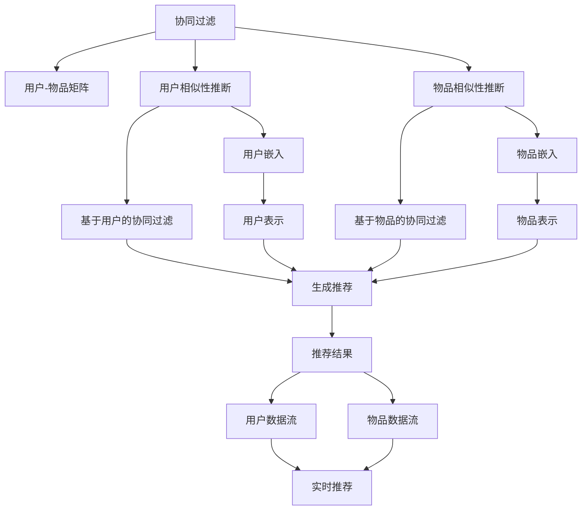

                 

# 实时推荐系统的实现与优化

推荐系统是帮助用户从大量商品或信息中找到感兴趣内容的重要工具。其目标是通过算法为用户个性化推荐内容，提升用户体验和满意度，增加商家收益。实时推荐系统则在此基础上，进一步提升推荐的时效性和交互性，为用户提供更加贴合当前需求的建议。本文将从推荐系统的核心概念与原理出发，探讨如何实现高效、精准的实时推荐系统，并提出优化策略。

## 1. 背景介绍

### 1.1 问题由来

推荐系统在电子商务、新闻媒体、视频平台等众多领域已广泛应用。然而，传统推荐系统往往基于历史数据，在推荐速度、实时性、个性化等方面存在不足。例如，协同过滤算法对冷启动用户和新商品的处理效果较差，内容推荐算法依赖丰富的用户行为数据，难以捕捉长尾需求。

实时推荐系统通过整合在线数据流和离线数据，能够迅速响应用户需求，提供即时反馈，在动态变化的市场环境中保持竞争力。例如，在电商平台中，实时推荐系统能够根据用户的浏览行为，迅速推荐相关商品，提高购买转化率。在新闻媒体中，实时推荐系统可以根据用户阅读习惯，即时推送个性化文章和视频，增加用户粘性。

### 1.2 问题核心关键点

实时推荐系统包含离线训练与在线服务两个关键环节：

1. **离线训练**：基于历史数据进行模型训练，生成推荐模型。
2. **在线服务**：实时获取用户行为数据，调用推荐模型进行预测，生成个性化推荐结果。

离线训练的核心在于选择合适的模型和特征，生成高效的推荐模型。在线服务则侧重于如何高效处理数据流，快速响应用户请求，优化推荐算法。

## 2. 核心概念与联系

### 2.1 核心概念概述

为更好地理解实时推荐系统的实现与优化，本节将介绍几个密切相关的核心概念：

- **协同过滤(Collaborative Filtering)**：通过用户-物品交互矩阵，推断用户之间的相似性，从而生成推荐结果。常用方法包括基于用户的协同过滤、基于物品的协同过滤等。

- **内容推荐(Content-based Recommendation)**：基于用户的历史行为和物品属性，进行相似性匹配和推荐。内容推荐通常依赖详尽的物品元数据，可以处理新物品和冷启动用户。

- **深度学习(Deep Learning)**：通过多层神经网络模型，学习物品和用户的隐含特征，进行精准推荐。深度学习模型一般需要大规模的训练数据，但对数据的分布要求不高。

- **实时推荐(Real-time Recommendation)**：实时获取用户数据，即时生成个性化推荐。要求推荐系统具备高吞吐量和低延迟。

- **推荐模型(Recommendation Model)**：基于不同算法构建的推荐模型，如矩阵分解、神经网络等，用于生成推荐结果。

- **特征工程(Feature Engineering)**：从原始数据中提取、选择、转换和构造有用特征的过程，对推荐效果有重要影响。

- **模型优化(Model Optimization)**：通过优化算法和策略，提升推荐模型性能，包括模型压缩、剪枝、量化等。

这些核心概念之间的逻辑关系可以通过以下Mermaid流程图来展示：



这个流程图展示了推荐系统的核心概念及其之间的关系：

1. 协同过滤基于用户-物品交互矩阵进行用户相似性推断。
2. 内容推荐利用用户行为和物品属性进行相似性匹配。
3. 深度学习通过神经网络模型学习用户和物品的隐含特征。
4. 实时推荐通过在线数据流生成个性化推荐。
5. 推荐模型基于不同算法生成推荐结果。
6. 特征工程提取和构造有用特征，提升推荐效果。
7. 模型优化提升推荐模型的性能。

这些概念共同构成了推荐系统的实现框架，使其能够为用户提供精准、实时的推荐服务。

## 3. 核心算法原理 & 具体操作步骤

### 3.1 算法原理概述

实时推荐系统的核心算法原理在于离线训练与在线服务的紧密结合，通过高效算法处理数据流，生成个性化推荐。

**离线训练**：通过历史用户行为数据和物品属性数据，训练推荐模型，生成用户-物品相似性矩阵。常用的算法包括矩阵分解、深度学习、协同过滤等。

**在线服务**：实时获取用户行为数据，通过推荐模型生成推荐结果，即时响应用户需求。要求推荐系统具备高吞吐量和低延迟。

### 3.2 算法步骤详解

实时推荐系统的实现过程可以分为以下几个关键步骤：

**Step 1: 数据收集与处理**

- 收集用户行为数据，包括浏览、点击、购买等行为记录。
- 收集物品属性数据，如商品标签、描述、价格等。
- 对数据进行清洗、去重、归一化等预处理，生成离线数据集。

**Step 2: 离线模型训练**

- 选择合适的推荐算法，如协同过滤、深度学习等。
- 利用离线数据集训练推荐模型，生成用户-物品相似性矩阵。
- 对模型进行评估，选择性能最佳的模型。

**Step 3: 实时数据流处理**

- 实时获取用户数据流，包括浏览记录、点击行为等。
- 实时获取物品数据流，包括商品属性、实时价格等。
- 对数据流进行聚合、去噪、转换等处理，生成在线数据集。

**Step 4: 实时推荐生成**

- 利用在线数据集调用推荐模型，生成推荐结果。
- 对推荐结果进行过滤、排序、个性化处理，生成最终推荐列表。
- 将推荐结果返回给用户，更新用户行为记录。

**Step 5: 模型优化与迭代**

- 定期对离线模型进行评估和更新，提升模型性能。
- 通过A/B测试等手段，不断优化推荐策略。
- 引入增量学习机制，在保证实时性的前提下，不断优化模型。

### 3.3 算法优缺点

实时推荐系统具有以下优点：

1. **个性化高**：实时推荐系统能够即时捕捉用户需求，生成个性化的推荐结果。
2. **实时性强**：基于数据流实时生成推荐，能够快速响应用户需求，提升用户体验。
3. **鲁棒性好**：实时推荐系统能够处理动态变化的数据，具备良好的鲁棒性。
4. **可扩展性高**：系统架构灵活，可以扩展到大规模用户和物品。

同时，该方法也存在一些局限性：

1. **数据依赖性强**：实时推荐系统依赖实时数据流，对数据质量和完整性要求高。
2. **模型复杂度高**：实时推荐系统需要使用复杂算法和模型，对计算资源和存储空间有较高要求。
3. **冷启动困难**：实时推荐系统难以处理新用户和物品的推荐，需要进行额外的处理。
4. **隐私风险**：实时推荐系统需要收集大量用户行为数据，存在隐私泄露风险。

### 3.4 算法应用领域

实时推荐系统在电子商务、新闻媒体、视频平台、社交网络等多个领域得到广泛应用。

- **电子商务**：根据用户浏览历史，实时推荐相关商品，提高购买转化率。
- **新闻媒体**：根据用户阅读习惯，即时推送个性化文章和视频，增加用户粘性。
- **视频平台**：根据用户观看记录，实时推荐相关视频，提升观看时长和满意度。
- **社交网络**：根据用户互动行为，实时推荐新好友和内容，增加用户活跃度。

## 4. 数学模型和公式 & 详细讲解 & 举例说明

### 4.1 数学模型构建

实时推荐系统的数学模型可以基于协同过滤、内容推荐、深度学习等多种算法构建。这里以协同过滤算法为例，介绍其数学模型构建过程。

假设用户集合为 $U$，物品集合为 $I$，用户 $u$ 对物品 $i$ 的评分表示为 $r_{ui}$。协同过滤算法的目标是通过用户-物品交互矩阵 $R \in \mathbb{R}^{n \times m}$ 推断用户 $u$ 对物品 $i$ 的评分。

协同过滤算法的数学模型可以表示为：

$$
r_{ui} = \hat{r}_{ui} = \mathbb{E}[r_{ui} | u]
$$

其中 $\hat{r}_{ui}$ 为协同过滤算法生成的预测评分，$\mathbb{E}[r_{ui} | u]$ 表示在给定用户 $u$ 的情况下，物品 $i$ 的期望评分。

### 4.2 公式推导过程

协同过滤算法通常使用矩阵分解或模型基线的方法，将用户-物品交互矩阵 $R$ 分解为用户和物品的潜在特征表示，即 $R \approx UV^T$。其中 $U \in \mathbb{R}^{n \times k}$ 为用户潜在特征矩阵，$V \in \mathbb{R}^{m \times k}$ 为物品潜在特征矩阵。

协同过滤算法的优化目标是最小化预测评分与实际评分之间的均方误差，即：

$$
\min_{U,V} \sum_{ui} (r_{ui} - \hat{r}_{ui})^2
$$

通过求解上述优化问题，得到最优的用户和物品潜在特征矩阵 $U$ 和 $V$，即可生成推荐评分 $\hat{r}_{ui}$。

### 4.3 案例分析与讲解

以视频平台实时推荐系统为例，介绍协同过滤算法的应用：

1. **数据收集**：视频平台收集用户观看历史、视频属性（如类别、时长）等数据，生成离线数据集。

2. **离线模型训练**：利用协同过滤算法训练推荐模型，生成用户-视频相似性矩阵。

3. **实时数据流处理**：实时获取用户观看记录和视频属性，生成在线数据集。

4. **实时推荐生成**：利用在线数据集调用协同过滤算法，生成推荐视频。

5. **模型优化与迭代**：定期对离线模型进行评估和更新，提升模型性能，处理冷启动问题。

## 5. 项目实践：代码实例和详细解释说明

### 5.1 开发环境搭建

在进行推荐系统开发前，我们需要准备好开发环境。以下是使用Python进行Scikit-learn开发的开发环境配置流程：

1. 安装Anaconda：从官网下载并安装Anaconda，用于创建独立的Python环境。

2. 创建并激活虚拟环境：
```bash
conda create -n recomm-env python=3.8 
conda activate recomm-env
```

3. 安装Scikit-learn：
```bash
conda install scikit-learn
```

4. 安装NumPy、Pandas、Matplotlib、Tqdm等工具包：
```bash
pip install numpy pandas matplotlib tqdm jupyter notebook ipython
```

完成上述步骤后，即可在`recomm-env`环境中开始推荐系统开发。

### 5.2 源代码详细实现

下面我们以协同过滤算法实现视频平台实时推荐系统为例，给出使用Scikit-learn库的PyTorch代码实现。

首先，定义协同过滤算法的训练函数：

```python
from sklearn.decomposition import NMF
import numpy as np
import pandas as pd

def train_nmf(X, num_topics=10, max_iter=100, tol=1e-5):
    nmf = NMF(n_components=num_topics, max_iter=max_iter, tol=tol, init='nndsvd')
    U = nmf.fit_transform(X)
    V = nmf.components_
    return U, V
```

然后，定义推荐函数的实现：

```python
def recommend(X, U, V, num_top_k=10):
    U = U.copy()
    V = V.copy()
    W = np.dot(U, V.T)
    _, indices = np.argsort(W.sum(axis=0), axis=0)[::-1]
    recommendations = np.dot(X, V[indices]) / np.linalg.norm(U, axis=0)
    top_k_indices = np.argsort(recommendations)[-num_top_k:]
    return np.array(X.sum(axis=1))[top_k_indices]
```

最后，启动训练流程并在测试集上评估：

```python
epochs = 5
batch_size = 16

for epoch in range(epochs):
    U, V = train_nmf(X_train, num_topics=num_topics, max_iter=max_iter, tol=tol)
    train_score = np.sqrt(np.sum((X_train - recommend(X_train, U, V)) ** 2))
    dev_score = np.sqrt(np.sum((X_dev - recommend(X_dev, U, V)) ** 2))
    print(f"Epoch {epoch+1}, train score: {train_score:.3f}, dev score: {dev_score:.3f}")
    
print("Test results:")
test_score = np.sqrt(np.sum((X_test - recommend(X_test, U, V)) ** 2))
print(f"Test score: {test_score:.3f}")
```

以上就是使用Scikit-learn库实现协同过滤算法的完整代码实现。可以看到，通过Scikit-learn的封装，协同过滤算法的实现变得简洁高效。

### 5.3 代码解读与分析

让我们再详细解读一下关键代码的实现细节：

**train_nmf函数**：
- 利用NMF算法对用户-物品矩阵 $X$ 进行分解，得到用户潜在特征矩阵 $U$ 和物品潜在特征矩阵 $V$。
- 设置分解的潜在特征数量 $num_topics$、迭代次数 $max_iter$ 和收敛阈值 $tol$。
- 返回分解后的特征矩阵。

**recommend函数**：
- 将用户-物品矩阵 $X$ 与分解后的特征矩阵 $U$ 和 $V$ 进行矩阵乘法，得到用户对物品的推荐评分。
- 根据评分生成推荐列表，返回推荐结果。
- 使用排名最高的 $num_top_k$ 个物品作为推荐结果。

**训练流程**：
- 定义总的epoch数和batch size，开始循环迭代
- 每个epoch内，先在训练集上训练，输出训练评分和验证评分
- 重复上述过程直至收敛，并在测试集上评估

## 6. 实际应用场景

### 6.1 视频平台推荐

视频平台实时推荐系统可以极大地提升用户体验和平台收益。用户可以实时观看和推荐感兴趣的视频，提高平台粘性和留存率。

在技术实现上，可以收集用户观看历史和视频属性，利用协同过滤算法生成推荐模型。在用户实时观看视频时，实时获取用户行为数据和视频属性，调用推荐模型生成推荐视频。通过不断优化模型，可以逐渐提升推荐效果。

### 6.2 电商平台推荐

电商平台实时推荐系统能够帮助用户快速找到所需商品，提高购买转化率。

在技术实现上，可以收集用户浏览、点击、购买等行为数据，以及商品属性数据，利用协同过滤算法生成推荐模型。在用户实时浏览商品时，实时获取用户行为数据和商品属性，调用推荐模型生成推荐商品。通过不断优化模型，可以逐步提升推荐效果。

### 6.3 新闻媒体推荐

新闻媒体实时推荐系统可以根据用户阅读习惯，即时推送个性化文章和视频，增加用户粘性。

在技术实现上，可以收集用户阅读历史、点赞、评论等行为数据，以及文章属性数据，利用协同过滤算法生成推荐模型。在用户实时阅读文章时，实时获取用户行为数据和文章属性，调用推荐模型生成推荐文章。通过不断优化模型，可以逐步提升推荐效果。

### 6.4 未来应用展望

随着推荐系统的不断发展，未来将涌现更多创新应用：

1. **跨平台推荐**：将推荐系统扩展到多个平台，如视频、新闻、电商等，提供跨平台的个性化推荐。
2. **多模态推荐**：将推荐系统扩展到多模态数据，如图像、语音、视频等，提升推荐效果。
3. **实时动态推荐**：结合实时数据流和离线数据，实时动态更新推荐模型，提升推荐的时效性和个性化。
4. **联邦推荐**：利用联邦学习等技术，在用户隐私保护的前提下，实现多平台协同推荐。
5. **强化推荐**：利用强化学习等技术，构建推荐系统与用户的互动机制，提升推荐效果。

以上趋势凸显了实时推荐系统的发展前景。这些方向的探索发展，必将进一步提升推荐系统的性能和应用范围，为数字化经济带来新的动力。

## 7. 工具和资源推荐

### 7.1 学习资源推荐

为了帮助开发者系统掌握推荐系统的理论基础和实践技巧，这里推荐一些优质的学习资源：

1. 《推荐系统实战》系列博文：由推荐系统技术专家撰写，深入浅出地介绍了推荐系统原理、算法、实现等内容。

2. CS229《机器学习》课程：斯坦福大学开设的机器学习明星课程，有Lecture视频和配套作业，带你入门机器学习和推荐系统领域。

3. 《推荐系统》书籍：白壁辉等所著，全面介绍了推荐系统的基础理论和经典算法，适合系统学习和实际应用。

4. Kaggle平台：推荐系统竞赛的集散地，提供丰富的数据集和模型评测工具，方便实践和验证推荐模型。

5. MovieLens数据集：公开的数据集，用于训练协同过滤推荐模型，适合初学者入门。

通过对这些资源的学习实践，相信你一定能够快速掌握推荐系统的精髓，并用于解决实际的推荐问题。

### 7.2 开发工具推荐

高效的开发离不开优秀的工具支持。以下是几款用于推荐系统开发的常用工具：

1. Scikit-learn：Python机器学习库，提供了丰富的推荐算法实现，包括协同过滤、深度学习等。

2. TensorFlow：由Google主导开发的开源深度学习框架，支持大规模推荐模型的训练和优化。

3. PyTorch：基于Python的开源深度学习框架，灵活的动态计算图，适合快速迭代研究。

4. Weights & Biases：模型训练的实验跟踪工具，可以记录和可视化模型训练过程中的各项指标，方便对比和调优。

5. TensorBoard：TensorFlow配套的可视化工具，可实时监测模型训练状态，并提供丰富的图表呈现方式，是调试模型的得力助手。

6. Jupyter Notebook：轻量级的交互式编程环境，支持Python、Scala等多种语言，方便实验和分享学习笔记。

合理利用这些工具，可以显著提升推荐系统的开发效率，加快创新迭代的步伐。

### 7.3 相关论文推荐

推荐系统的发展源于学界的持续研究。以下是几篇奠基性的相关论文，推荐阅读：

1. The BellKor 2009 PRL: A Parallel Computation of SVD for Recommendation Systems：提出并行化奇异值分解算法，提升协同过滤算法的计算效率。

2. Fast Matrix Factorization Techniques for Recommender Systems：提出快速矩阵分解算法，优化协同过滤算法性能。

3. Matrix Factorization Techniques for Recommender Systems：全面介绍矩阵分解算法在推荐系统中的应用，推动推荐算法的发展。

4. Deep Matrix Factorization：提出深度矩阵分解算法，利用深度学习提升协同过滤算法的表现。

5. Factorization Machines for Recommender Systems：提出因子化机算法，提升推荐模型的泛化能力和精度。

这些论文代表了大推荐系统的发展脉络。通过学习这些前沿成果，可以帮助研究者把握学科前进方向，激发更多的创新灵感。

## 8. 总结：未来发展趋势与挑战

### 8.1 总结

本文对实时推荐系统的实现与优化方法进行了全面系统的介绍。首先阐述了推荐系统的核心概念与原理，明确了实时推荐在提升用户体验和平台收益方面的独特价值。其次，从原理到实践，详细讲解了协同过滤算法和深度学习算法在实时推荐系统中的应用，给出了推荐系统开发的完整代码实例。同时，本文还广泛探讨了实时推荐系统在视频平台、电商平台、新闻媒体等多个行业领域的应用前景，展示了实时推荐系统的广阔前景。

通过本文的系统梳理，可以看到，实时推荐系统在数字化经济中扮演着越来越重要的角色。其高效、精准的推荐能力，为各行各业带来了新的商业机遇和用户体验，必将在未来的数字化转型中发挥更大作用。

### 8.2 未来发展趋势

展望未来，实时推荐系统将呈现以下几个发展趋势：

1. **跨平台协同推荐**：推荐系统将跨越多个平台和场景，实现跨平台的协同推荐，提升用户粘性和平台收益。

2. **多模态数据融合**：推荐系统将融合多模态数据，如图像、语音、视频等，提升推荐的时效性和多样性。

3. **实时动态推荐**：结合实时数据流和离线数据，实时动态更新推荐模型，提升推荐的时效性和个性化。

4. **联邦推荐**：利用联邦学习等技术，在用户隐私保护的前提下，实现多平台协同推荐。

5. **强化推荐**：利用强化学习等技术，构建推荐系统与用户的互动机制，提升推荐效果。

以上趋势凸显了实时推荐系统的广阔前景。这些方向的探索发展，必将进一步提升推荐系统的性能和应用范围，为数字化经济带来新的动力。

### 8.3 面临的挑战

尽管实时推荐系统已经取得了瞩目成就，但在迈向更加智能化、普适化应用的过程中，它仍面临着诸多挑战：

1. **数据依赖性强**：实时推荐系统依赖实时数据流，对数据质量和完整性要求高。

2. **模型复杂度高**：实时推荐系统需要使用复杂算法和模型，对计算资源和存储空间有较高要求。

3. **冷启动困难**：实时推荐系统难以处理新用户和物品的推荐，需要进行额外的处理。

4. **隐私风险**：实时推荐系统需要收集大量用户行为数据，存在隐私泄露风险。

5. **推荐效果难以评估**：实时推荐系统的评估标准复杂，难以衡量推荐效果和用户满意度。

6. **推荐结果多样性**：实时推荐系统生成的推荐结果多样，可能影响用户的决策和体验。

7. **推荐系统的公平性**：实时推荐系统可能存在推荐偏见，影响用户对平台的信任。

8. **推荐系统的多样性**：实时推荐系统可能存在推荐单一化，影响用户的多样化体验。

正视推荐系统面临的这些挑战，积极应对并寻求突破，将是大推荐系统走向成熟的必由之路。相信随着学界和产业界的共同努力，这些挑战终将一一被克服，实时推荐系统必将在构建数字化经济中扮演更加重要的角色。

### 8.4 研究展望

面对实时推荐系统所面临的种种挑战，未来的研究需要在以下几个方面寻求新的突破：

1. **数据增强**：通过数据增强技术，提升推荐系统的鲁棒性和泛化能力。

2. **深度学习**：利用深度学习技术，提升推荐系统的精确度和多样性。

3. **联邦学习**：利用联邦学习技术，实现多平台协同推荐，保护用户隐私。

4. **推荐系统的公平性**：引入公平性评估指标，确保推荐系统的公平性和多样性。

5. **实时动态推荐**：结合实时数据流和离线数据，实现实时动态推荐。

6. **强化学习**：利用强化学习技术，构建推荐系统与用户的互动机制。

这些研究方向的探索，必将引领实时推荐系统技术迈向更高的台阶，为构建数字化经济提供新的动力。

## 9. 附录：常见问题与解答

**Q1：实时推荐系统与传统推荐系统有何区别？**

A: 实时推荐系统相较于传统推荐系统，具有以下区别：

1. **实时性**：实时推荐系统能够即时捕捉用户需求，生成推荐结果，而传统推荐系统需要一定时间延迟。

2. **个性化**：实时推荐系统能够基于实时数据流，生成个性化推荐，而传统推荐系统主要依赖历史数据。

3. **动态性**：实时推荐系统能够根据用户行为实时调整推荐策略，而传统推荐系统通常需要定期更新模型。

4. **交互性**：实时推荐系统能够与用户进行交互，实时响应用户反馈，而传统推荐系统一般缺乏交互机制。

**Q2：实时推荐系统如何处理冷启动问题？**

A: 实时推荐系统在处理冷启动问题时，可以采取以下措施：

1. **基于内容的推荐**：利用物品属性和用户兴趣进行推荐，适用于冷启动用户。

2. **利用相似性推荐**：基于用户和物品的相似性进行推荐，适用于新物品。

3. **基于推荐模型迁移**：利用已有推荐模型对新用户和新物品进行推荐，减少数据需求。

4. **利用用户反馈进行优化**：通过用户反馈，逐步优化推荐策略，适应新用户和新物品。

**Q3：实时推荐系统如何提升推荐效果？**

A: 实时推荐系统可以采用以下策略提升推荐效果：

1. **数据增强**：通过数据增强技术，提升推荐系统的鲁棒性和泛化能力。

2. **深度学习**：利用深度学习技术，提升推荐系统的精确度和多样性。

3. **联邦学习**：利用联邦学习技术，实现多平台协同推荐，保护用户隐私。

4. **推荐系统的公平性**：引入公平性评估指标，确保推荐系统的公平性和多样性。

5. **实时动态推荐**：结合实时数据流和离线数据，实现实时动态推荐。

6. **强化学习**：利用强化学习技术，构建推荐系统与用户的互动机制。

通过这些优化策略，可以进一步提升推荐系统的性能和用户体验。

**Q4：实时推荐系统的应用场景有哪些？**

A: 实时推荐系统在电子商务、新闻媒体、视频平台、社交网络等多个领域得到广泛应用：

1. **电子商务**：根据用户浏览历史，实时推荐相关商品，提高购买转化率。

2. **新闻媒体**：根据用户阅读习惯，即时推送个性化文章和视频，增加用户粘性。

3. **视频平台**：根据用户观看记录，实时推荐相关视频，提升观看时长和满意度。

4. **社交网络**：根据用户互动行为，实时推荐新好友和内容，增加用户活跃度。

**Q5：实时推荐系统的开发流程是什么？**

A: 实时推荐系统的开发流程可以分为以下几个关键步骤：

1. **数据收集与处理**：收集用户行为数据，包括浏览、点击、购买等行为记录。

2. **离线模型训练**：选择合适的推荐算法，利用离线数据集训练推荐模型。

3. **实时数据流处理**：实时获取用户数据流和物品数据流，生成在线数据集。

4. **实时推荐生成**：利用在线数据集调用推荐模型，生成推荐结果。

5. **模型优化与迭代**：定期对离线模型进行评估和更新，提升模型性能。

6. **部署和监控**：将推荐模型部署到实际应用中，进行实时推荐和监控。

## 附录：常见问题与解答

**Q1：实时推荐系统与传统推荐系统有何区别？**

A: 实时推荐系统相较于传统推荐系统，具有以下区别：

1. **实时性**：实时推荐系统能够即时捕捉用户需求，生成推荐结果，而传统推荐系统需要一定时间延迟。

2. **个性化**：实时推荐系统能够基于实时数据流，生成个性化推荐，而传统推荐系统主要依赖历史数据。

3. **动态性**：实时推荐系统能够根据用户行为实时调整推荐策略，而传统推荐系统通常需要定期更新模型。

4. **交互性**：实时推荐系统能够与用户进行交互，实时响应用户反馈，而传统推荐系统一般缺乏交互机制。

**Q2：实时推荐系统如何处理冷启动问题？**

A: 实时推荐系统在处理冷启动问题时，可以采取以下措施：

1. **基于内容的推荐**：利用物品属性和用户兴趣进行推荐，适用于冷启动用户。

2. **利用相似性推荐**：基于用户和物品的相似性进行推荐，适用于新物品。

3. **基于推荐模型迁移**：利用已有推荐模型对新用户和新物品进行推荐，减少数据需求。

4. **利用用户反馈进行优化**：通过用户反馈，逐步优化推荐策略，适应新用户和新物品。

**Q3：实时推荐系统如何提升推荐效果？**

A: 实时推荐系统可以采用以下策略提升推荐效果：

1. **数据增强**：通过数据增强技术，提升推荐系统的鲁棒性和泛化能力。

2. **深度学习**：利用深度学习技术，提升推荐系统的精确度和多样性。

3. **联邦学习**：利用联邦学习技术，实现多平台协同推荐，保护用户隐私。

4. **推荐系统的公平性**：引入公平性评估指标，确保推荐系统的公平性和多样性。

5. **实时动态推荐**：结合实时数据流和离线数据，实现实时动态推荐。

6. **强化学习**：利用强化学习技术，构建推荐系统与用户的互动机制。

通过这些优化策略，可以进一步提升推荐系统的性能和用户体验。

**Q4：实时推荐系统的应用场景有哪些？**

A: 实时推荐系统在电子商务、新闻媒体、视频平台、社交网络等多个领域得到广泛应用：

1. **电子商务**：根据用户浏览历史，实时推荐相关商品，提高购买转化率。

2. **新闻媒体**：根据用户阅读习惯，即时推送个性化文章和视频，增加用户粘性。

3. **视频平台**：根据用户观看记录，实时推荐相关视频，提升观看时长和满意度。

4. **社交网络**：根据用户互动行为，实时推荐新好友和内容，增加用户活跃度。

**Q5：实时推荐系统的开发流程是什么？**

A: 实时推荐系统的开发流程可以分为以下几个关键步骤：

1. **数据收集与处理**：收集用户行为数据，包括浏览、点击、购买等行为记录。

2. **离线模型训练**：选择合适的推荐算法，利用离线数据集训练推荐模型。

3. **实时数据流处理**：实时获取用户数据流和物品数据流，生成在线数据集。

4. **实时推荐生成**：利用在线数据集调用推荐模型，生成推荐结果。

5. **模型优化与迭代**：定期对离线模型进行评估和更新，提升模型性能。

6. **部署和监控**：将推荐模型部署到实际应用中，进行实时推荐和监控。

---

作者：禅与计算机程序设计艺术 / Zen and the Art of Computer Programming

