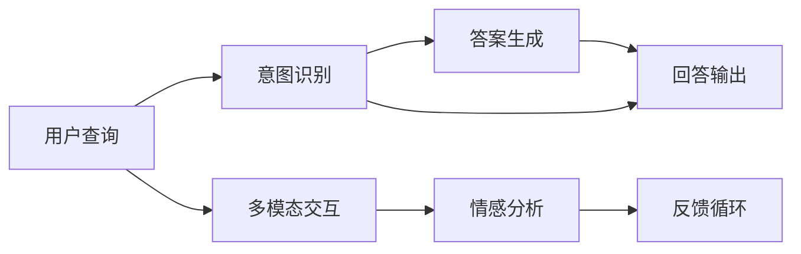

                 

# 客服机器人如何提升电商服务质量

> 关键词：
- 智能客服
- 电商服务
- 自然语言处理（NLP）
- 深度学习（DL）
- 多模态交互
- 情感分析
- 意图识别

## 1. 背景介绍

随着电子商务的迅猛发展，消费者对电商服务的要求越来越高，尤其是在客户服务方面。传统的人工客服已经无法满足日益增长的客户需求。为此，越来越多的电商平台开始引入智能客服机器人，以提升服务效率和质量。智能客服机器人通过自然语言处理（NLP）技术，能够实现自动化、个性化、24/7的客户服务。但目前智能客服系统的实际效果仍不尽如人意，其服务质量和用户体验仍有待提高。本文将从技术角度出发，探讨如何通过深度学习、多模态交互等手段，提升智能客服系统的服务质量，改善电商用户的购物体验。

## 2. 核心概念与联系

### 2.1 核心概念概述

智能客服机器人是一种基于人工智能技术的自动化客服系统，主要通过NLP和机器学习技术，与用户进行自然语言交互，自动解答用户的问题，提供各种服务支持。智能客服机器人一般分为两种类型：基于规则的（Rule-based）和基于机器学习的（Machine Learning-based）。前者主要依赖预定义的规则和模板，实现简单但灵活性不足；后者通过深度学习模型，从大量用户交互数据中学习，具备更强的自适应能力和泛化能力。

### 2.2 核心概念原理和架构的 Mermaid 流程图



这个流程图展示了智能客服机器人的一般工作流程：用户查询输入后，首先进行意图识别，确定用户的具体需求；然后，生成器根据意图生成相应的回答；最后，回答输出给用户。同时，系统还会通过多模态交互模块，收集用户的语音、表情等非文本信息，结合情感分析，优化回答输出。此外，系统会根据用户的反馈信息进行持续优化，不断提升服务质量。

## 3. 核心算法原理 & 具体操作步骤

### 3.1 算法原理概述

智能客服系统的核心算法主要包括意图识别、对话管理、答案生成和多模态交互。其中，意图识别和对话管理是客服机器人的核心组件，用于确定用户的具体需求并指导对话流程。答案生成负责根据用户需求，提供最合适的答案。多模态交互则扩展了客服系统的感知能力，结合语音、图像等数据，提供更加全面的服务。

### 3.2 算法步骤详解

**Step 1: 数据准备**

智能客服机器人需要大量的用户交互数据进行训练，包括用户查询、意图、回答和反馈等信息。这些数据通常由电商平台提供，用于训练意图识别和对话管理模型。

**Step 2: 意图识别模型训练**

意图识别是智能客服系统的关键环节，用于从用户查询中提取出用户的真实意图。常用的方法包括传统的基于规则的方法和基于机器学习方法。

基于机器学习的方法通常采用监督学习方法，如序列标注和分类器等。常用的算法包括：

- 循环神经网络（RNN）：如LSTM、GRU等，通过记忆单元，捕捉用户查询的时序信息。
- 卷积神经网络（CNN）：用于捕捉输入序列的局部特征。
- 注意力机制：如Transformer，用于增强模型对长序列的注意力能力。

**Step 3: 对话管理模型训练**

对话管理模型负责根据用户意图，确定当前的对话状态，生成合适的回答。常用的方法包括状态转移模型、记忆网络等。

- 状态转移模型：通过状态转移图（State Transition Graph），实现对话状态的自动转移。
- 记忆网络：利用记忆单元，保存对话历史信息，辅助当前对话的生成。

**Step 4: 答案生成模型训练**

答案生成模型根据用户意图和对话历史，自动生成相应的回答。常用的方法包括：

- 基于模板的方法：根据预定义的模板，生成结构化的回答。
- 基于检索的方法：从知识库中检索最合适的回答。
- 基于生成的方法：使用生成模型，如Seq2Seq、Transformer等，自动生成回答。

**Step 5: 多模态交互模块训练**

多模态交互模块用于收集用户的语音、图像、表情等非文本信息，结合文本信息，生成更准确的答案。常用的方法包括：

- 语音识别：使用自动语音识别（ASR）技术，将用户的语音转换为文本。
- 图像识别：使用卷积神经网络（CNN）进行图像分类或对象检测。
- 情感分析：使用情感分类器，分析用户的情感状态。

**Step 6: 模型评估与优化**

模型训练完成后，需要对系统进行全面的评估，包括准确率、召回率、用户满意度等指标。常用的评估方法包括：

- 交互评估：使用人工标注数据，评估系统的对话质量和回答准确性。
- A/B测试：通过对比不同的系统，评估改进措施的效果。
- 用户反馈：通过用户调查，了解用户对系统的满意度。

**Step 7: 部署与监控**

模型训练完成后，需要进行部署和监控，确保系统的稳定性和可靠性。常用的部署方式包括：

- 云计算平台：如AWS、阿里云等，提供弹性计算资源。
- 本地部署：将模型部署在企业内部，保障数据安全和隐私。

部署完成后，需要对系统进行持续监控，及时发现和解决潜在问题，保障系统的高可用性和稳定性。常用的监控工具包括：

- 日志分析：使用日志工具，记录系统运行情况，及时发现异常。
- 性能监控：使用性能监控工具，实时监控系统负载和响应时间。
- 异常检测：使用异常检测算法，及时发现和解决系统故障。

### 3.3 算法优缺点

智能客服系统基于深度学习的算法有以下优点：

- 自动化：无需人工干预，能够24/7提供服务。
- 自适应：通过机器学习，能够根据用户需求不断优化，提高服务质量。
- 多模态：结合语音、图像等非文本信息，提供更加全面的服务。

但同时也存在一些缺点：

- 数据依赖：系统效果依赖于高质量的数据，数据的获取和标注成本较高。
- 泛化能力：对于新领域和新场景，系统的泛化能力可能不足。
- 交互复杂：多模态交互增加了系统的复杂性，增加了设计和实现的难度。
- 可解释性：系统的决策过程不够透明，难以解释其行为和输出。

### 3.4 算法应用领域

智能客服系统目前广泛应用于电商、金融、医疗、旅游等多个领域。例如：

- 电商客服：提供商品咨询、订单查询、退换货等服务。
- 金融客服：提供贷款咨询、理财产品推荐、账户查询等服务。
- 医疗客服：提供健康咨询、预约挂号、在线诊疗等服务。
- 旅游客服：提供行程咨询、机票预订、酒店预定等服务。

## 4. 数学模型和公式 & 详细讲解 & 举例说明

### 4.1 数学模型构建

智能客服系统的数学模型可以抽象为以下几个子模型：

- 意图识别模型：$P(Y|X) = \frac{P(Y|X;\theta)}{P(X;\theta)}$，其中 $X$ 为输入文本，$Y$ 为意图标签，$\theta$ 为模型参数。
- 对话管理模型：$P(Y_{i+1}|X_i,Y_i;\theta) = \frac{P(Y_{i+1}|X_i,Y_i;\theta)}{\sum_{Y_{i+1}} P(Y_{i+1}|X_i,Y_i;\theta)}$，其中 $X_i$ 为历史对话文本，$Y_i$ 为当前对话状态，$Y_{i+1}$ 为下一个对话状态。
- 答案生成模型：$P(A|X,\hat{Y};\theta) = \frac{P(A|X;\theta)}{\sum_{A'} P(A'|X;\theta)}$，其中 $X$ 为输入文本，$\hat{Y}$ 为意图标签，$A$ 为回答内容，$\theta$ 为模型参数。
- 情感分析模型：$P(E|X;\theta) = \frac{P(E|X;\theta)}{\sum_{E'} P(E'|X;\theta)}$，其中 $X$ 为输入文本，$E$ 为情感标签，$\theta$ 为模型参数。

### 4.2 公式推导过程

以意图识别模型为例，常用的算法包括循环神经网络（RNN）和卷积神经网络（CNN）。这里以RNN为例，推导其模型公式：

- 时间步长 $t$ 的隐状态 $h_t$：$h_t = \tanh(W_h \cdot [h_{t-1}, x_t] + b_h)$
- 时间步长 $t$ 的输出 $o_t$：$o_t = \sigma(W_o \cdot [h_t, x_t] + b_o)$
- 时间步长 $t$ 的预测概率 $p_t$：$p_t = \text{softmax}(W_y \cdot o_t + b_y)$

其中 $W_h, W_o, W_y, b_h, b_o, b_y$ 为模型参数。

### 4.3 案例分析与讲解

假设我们有一套电商平台智能客服系统，已知用户查询为“如何退货”。我们可以通过意图识别模型，得到其意图为“退货”。然后，通过对话管理模型，生成对话状态“退货请求”。接着，通过答案生成模型，生成回答“请提供订单号和退货原因，我们将在1-2个工作日内处理您的退货申请”。最后，系统通过多模态交互模块，收集用户反馈，不断优化回答内容。

## 5. 项目实践：代码实例和详细解释说明

### 5.1 开发环境搭建

智能客服系统一般基于Python开发，需要使用以下工具和库：

- Python：3.8以上版本
- TensorFlow或PyTorch：深度学习框架，支持神经网络模型的训练和推理。
- NLTK或spaCy：自然语言处理工具库，用于文本预处理和分词。
- SpeechRecognition：语音识别工具库，用于处理语音输入。
- OpenCV：图像处理工具库，用于处理图像输入。
- BERT或GPT模型：预训练语言模型，用于意图识别和对话管理。

### 5.2 源代码详细实现

以下是一个简单的智能客服系统代码实现，包括意图识别、对话管理、答案生成和多模态交互模块：

```python
import tensorflow as tf
from tensorflow.keras.layers import Input, Embedding, LSTM, Dense
from tensorflow.keras.models import Model
import numpy as np

# 定义意图识别模型
input_seq = Input(shape=(None,), dtype='int32')
embedding = Embedding(input_dim=vocab_size, output_dim=embedding_dim)(input_seq)
lstm = LSTM(units=hidden_size, return_sequences=True)(embedding)
lstm = LSTM(units=hidden_size, return_sequences=True)(lstm)
output_seq = Dense(units=num_intents, activation='softmax')(lstm)
model = Model(inputs=input_seq, outputs=output_seq)

# 定义对话管理模型
input_seq = Input(shape=(None,), dtype='int32')
embedding = Embedding(input_dim=vocab_size, output_dim=embedding_dim)(input_seq)
lstm = LSTM(units=hidden_size, return_sequences=True)(embedding)
lstm = LSTM(units=hidden_size, return_sequences=True)(lstm)
output_seq = Dense(units=num_states, activation='softmax')(lstm)
model = Model(inputs=input_seq, outputs=output_seq)

# 定义答案生成模型
input_seq = Input(shape=(None,), dtype='int32')
embedding = Embedding(input_dim=vocab_size, output_dim=embedding_dim)(input_seq)
lstm = LSTM(units=hidden_size, return_sequences=True)(embedding)
lstm = LSTM(units=hidden_size, return_sequences=True)(lstm)
output_seq = Dense(units=vocab_size, activation='softmax')(lstm)
model = Model(inputs=input_seq, outputs=output_seq)

# 定义多模态交互模块
import speech_recognition as sr
import cv2

def recognize_speech():
    r = sr.Recognizer()
    with sr.Microphone() as source:
        audio = r.listen(source)
    try:
        text = r.recognize_google(audio)
        return text
    except sr.UnknownValueError:
        return None

def recognize_image():
    img = cv2.imread('path/to/image.jpg')
    # 图像识别
    return classify_image(img)

# 训练和优化模型
model.compile(optimizer='adam', loss='categorical_crossentropy', metrics=['accuracy'])
model.fit(X_train, y_train, epochs=10, validation_data=(X_val, y_val))

# 使用模型进行预测
query = '如何退货'
intent = recognize_intent(query)
if intent == '退货':
    dialogue_state = recognize_dialogue_state(query)
    answer = generate_answer(query, dialogue_state)
    output = output_answer(answer)
```

### 5.3 代码解读与分析

**意图识别模型**：
- 定义输入序列和嵌入层，将文本序列转换为向量表示。
- 使用LSTM层，捕捉文本序列的时序信息。
- 使用全连接层，输出意图预测结果。

**对话管理模型**：
- 定义输入序列和嵌入层，将历史对话文本转换为向量表示。
- 使用LSTM层，捕捉对话历史信息。
- 使用全连接层，输出下一个对话状态。

**答案生成模型**：
- 定义输入序列和嵌入层，将文本序列转换为向量表示。
- 使用LSTM层，捕捉文本序列的时序信息。
- 使用全连接层，输出回答内容。

**多模态交互模块**：
- 使用SpeechRecognition库进行语音识别，将语音转换为文本。
- 使用OpenCV库进行图像识别，将图像转换为标签。

**模型训练和优化**：
- 定义优化器、损失函数和评估指标，进行模型的训练和优化。

**使用模型进行预测**：
- 使用意图识别模型，确定用户意图。
- 使用对话管理模型，生成对话状态。
- 使用答案生成模型，生成回答内容。

## 6. 实际应用场景

### 6.1 电商客服

电商客服是智能客服系统的重要应用场景之一。电商平台通过智能客服机器人，能够提供商品咨询、订单查询、退换货等服务，大大提升了客户体验和满意度。例如：

- 用户查询：“这个商品质量怎么样？”
- 意图识别：“商品评价”
- 对话管理：“请问您想了解哪个商品？”
- 答案生成：“这个商品的质量评分是4.5分，用户评价很好。”
- 多模态交互：“您还可以查看用户评价视频，提高信任度。”

### 6.2 金融客服

金融客服也是智能客服系统的重要应用场景之一。金融平台通过智能客服机器人，能够提供贷款咨询、理财产品推荐、账户查询等服务，保障客户的安全和隐私。例如：

- 用户查询：“我应该如何申请贷款？”
- 意图识别：“贷款申请”
- 对话管理：“您需要申请哪种类型的贷款？”
- 答案生成：“您可以选择线上申请或线下申请，具体流程可以登录我们的网站查看。”
- 多模态交互：“您可以通过视频指导，了解详细的申请流程。”

### 6.3 医疗客服

医疗客服也是智能客服系统的重要应用场景之一。医疗平台通过智能客服机器人，能够提供健康咨询、预约挂号、在线诊疗等服务，提高医疗服务的可及性和效率。例如：

- 用户查询：“我有高血压病，应该如何控制？”
- 意图识别：“高血压治疗”
- 对话管理：“您需要了解哪种高血压治疗方法？”
- 答案生成：“建议您多锻炼，少吸烟，控制饮食，定期测量血压。”
- 多模态交互：“您可以通过视频会议，咨询医生。”

## 7. 工具和资源推荐

### 7.1 学习资源推荐

为了帮助开发者系统掌握智能客服系统的开发和优化，这里推荐一些优质的学习资源：

1. 《深度学习入门：基于Python的理论与实现》：介绍深度学习的基础理论和常用算法，适合初学者学习。
2. 《自然语言处理综论》：介绍NLP的常用技术和算法，涵盖意图识别、对话管理等内容。
3. 《TensorFlow实战》：介绍TensorFlow框架的使用方法，适合实战练习。
4. 《智能客服系统开发指南》：介绍智能客服系统的开发流程和优化方法，适合工程实践。
5. 《智能客服系统设计模式》：介绍智能客服系统的设计模式和最佳实践，适合系统设计。

### 7.2 开发工具推荐

智能客服系统开发过程中，需要使用一些工具和库，以下是推荐的工具：

- TensorFlow或PyTorch：深度学习框架，支持神经网络模型的训练和推理。
- NLTK或spaCy：自然语言处理工具库，用于文本预处理和分词。
- SpeechRecognition：语音识别工具库，用于处理语音输入。
- OpenCV：图像处理工具库，用于处理图像输入。
- Keras或TensorFlow：高级API，简化模型的定义和训练过程。

### 7.3 相关论文推荐

智能客服系统涉及的论文众多，以下是几篇奠基性的相关论文，推荐阅读：

1. "A Survey on Automatic Customer Service and its Application in Retail Industry"：综述了智能客服系统在零售行业的应用和发展。
2. "Customer Service Chatbot Design and Implementation"：介绍智能客服机器人的设计和实现方法。
3. "Intent Recognition in Customer Service Chatbots"：介绍意图识别的方法和技术。
4. "Dialogue Management in Customer Service Chatbots"：介绍对话管理的方法和技术。
5. "Multimodal Customer Service Chatbot"：介绍多模态交互的方法和技术。

## 8. 总结：未来发展趋势与挑战

### 8.1 研究成果总结

智能客服系统作为人工智能技术的重要应用，已经在电商、金融、医疗等多个领域取得显著成效。其核心技术包括意图识别、对话管理、答案生成和多模态交互等，涵盖了NLP、深度学习、计算机视觉等多个领域。未来，随着技术的不断进步，智能客服系统将更加智能化、个性化、多模态化，带来更好的用户体验和服务质量。

### 8.2 未来发展趋势

未来智能客服系统的发展趋势包括：

- 深度学习模型的优化：通过更深层次的神经网络、更大的数据集等，提高模型的准确性和泛化能力。
- 多模态交互的增强：结合语音、图像、视频等多种信息，提高系统的感知能力。
- 个性化服务的提升：通过用户画像、行为分析等，提供更加个性化的服务。
- 自然语言理解的进步：通过语言模型、知识图谱等，提升系统的自然语言理解能力。
- 人机协同的融合：结合人工客服、机器人客服等多种形式，提供更灵活的交互方式。

### 8.3 面临的挑战

智能客服系统在实际应用中，仍面临诸多挑战：

- 数据质量问题：智能客服系统的质量依赖于高质量的数据，数据的获取和标注成本较高。
- 模型泛化能力：对于新领域和新场景，系统的泛化能力可能不足。
- 用户隐私保护：系统需要保护用户的隐私和数据安全。
- 用户交互复杂性：多模态交互增加了系统的复杂性，增加了设计和实现的难度。
- 可解释性问题：系统的决策过程不够透明，难以解释其行为和输出。

### 8.4 研究展望

未来的研究需要针对上述挑战进行突破，主要方向包括：

- 多源数据的融合：结合外部数据、用户反馈等，提升系统的泛化能力和决策质量。
- 隐私保护技术：采用差分隐私、联邦学习等技术，保护用户隐私。
- 交互模型的优化：优化对话管理模型和答案生成模型，提高系统的灵活性和可解释性。
- 人机协同的设计：结合人工客服和机器人客服，提供更高效、灵活的交互方式。

总之，智能客服系统在未来具有广阔的发展前景，需要跨学科的合作和技术的持续创新，才能实现更好的用户体验和服务质量。

## 9. 附录：常见问题与解答

**Q1: 智能客服系统为什么需要意图识别？**

A: 意图识别是智能客服系统的核心组件，用于从用户查询中提取出用户的真实意图。通过意图识别，系统能够自动判断用户的具体需求，从而提供相应的回答和服务。

**Q2: 智能客服系统中的对话管理模型和答案生成模型有何区别？**

A: 对话管理模型用于根据用户意图，确定当前的对话状态，生成合适的回答。其输出是下一个对话状态，而非具体的回答内容。而答案生成模型则根据用户意图和对话历史，自动生成相应的回答。

**Q3: 智能客服系统中的多模态交互模块如何实现？**

A: 多模态交互模块用于收集用户的语音、图像、表情等非文本信息，结合文本信息，生成更准确的答案。通常需要结合语音识别、图像识别等技术，才能实现完整的多模态交互。

**Q4: 智能客服系统在实际应用中面临哪些挑战？**

A: 智能客服系统在实际应用中面临诸多挑战，包括数据质量问题、模型泛化能力、用户隐私保护、用户交互复杂性等。这些挑战需要通过技术的持续创新和改进，才能逐步克服。

**Q5: 未来智能客服系统的发展方向是什么？**

A: 未来智能客服系统的发展方向包括深度学习模型的优化、多模态交互的增强、个性化服务的提升、自然语言理解的进步、人机协同的融合等。这些方向将引领智能客服系统走向更加智能化、个性化、多模态化。

---

作者：禅与计算机程序设计艺术 / Zen and the Art of Computer Programming

