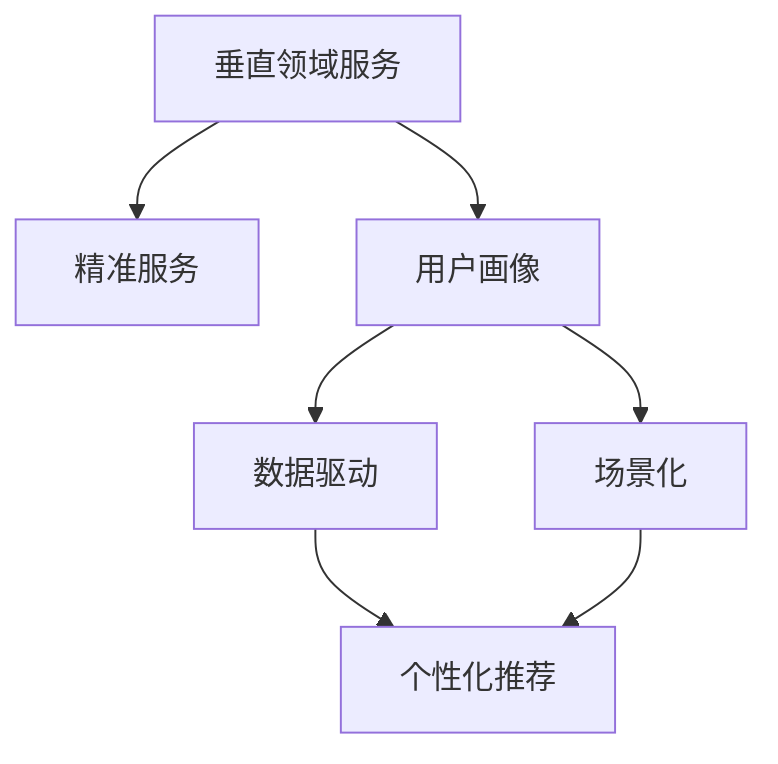

                 

## 1. 背景介绍

### 1.1 问题由来
在今天竞争激烈的市场环境中，中小型企业在夹缝中求生存，面临着巨大的挑战。面对大公司的品牌优势、资金优势，中小型企业需要找到自己的独特竞争点。垂直领域的精准服务因其小而美、专业化、个性化的特点，成为中小企业的一个重要突破口。

### 1.2 问题核心关键点
面对庞大的互联网市场，如何精准定位目标用户，如何提供独特的价值，如何将技术优势转化为具体应用，成为中小型企业生存的关键问题。

### 1.3 问题研究意义
垂直领域精准服务研究的核心在于，如何结合企业自身的特点和优势，通过数据分析和算法优化，针对特定用户群体提供精准的服务。这对中小型企业来说，可以显著降低开发成本，提升用户体验，从而增强市场竞争力。

## 2. 核心概念与联系

### 2.1 核心概念概述

为更好地理解垂直领域精准服务的方法，本节将介绍几个密切相关的核心概念：

- 垂直领域服务(Vertical Field Service)：针对特定细分市场或行业，提供专业化和个性化的服务。
- 精准服务(Precision Service)：通过数据挖掘和算法优化，精准定位目标用户，提供定制化的服务。
- 用户画像(User Persona)：通过对用户行为数据的分析，构建用户画像，进一步实现服务的个性化。
- 数据驱动(Recommendation System)：利用机器学习算法对用户行为数据进行建模，提供个性化的推荐。
- 场景化(Scene-Oriented)：考虑用户使用场景的多样性，提供符合具体使用情境的解决方案。

这些核心概念之间的逻辑关系可以通过以下Mermaid流程图来展示：



这个流程图展示了几者的关系：

1. 垂直领域服务通过精准服务，进一步细化目标用户群体，提供专业化的解决方案。
2. 用户画像构建了用户特征，是精准服务的基础。
3. 数据驱动和场景化是实现个性化推荐的关键技术。
4. 个性化推荐进一步支持了精准服务。

## 3. 核心算法原理 & 具体操作步骤
### 3.1 算法原理概述

垂直领域精准服务，本质上是一个数据驱动的个性化推荐系统。其核心思想是：通过数据挖掘和机器学习算法，精准定位目标用户，提供符合其需求和兴趣的个性化服务。

具体而言，假设垂直领域的服务类型为 $S=\{s_i\}_{i=1}^N$，每个用户 $U=\{u_j\}_{j=1}^M$ 对服务类型 $s_i$ 的评分 $r_{ij}$ 构成评分矩阵 $R \in \mathbb{R}^{N \times M}$。通过算法的优化，得到每个用户 $u_j$ 对各服务类型 $s_i$ 的偏好权重 $\alpha_{ij} \in [0,1]$，使得模型能够根据这些偏好权重推荐用户 $u_j$ 可能感兴趣的服务 $s_i$。

### 3.2 算法步骤详解

垂直领域精准服务一般包括以下几个关键步骤：

**Step 1: 数据收集与预处理**
- 收集目标用户的交互数据，如浏览、点击、评论、评分等。
- 对数据进行去重、清洗、缺失值处理等预处理操作。
- 构建评分矩阵 $R \in \mathbb{R}^{N \times M}$，其中 $N$ 为服务类型数，$M$ 为用户数。

**Step 2: 用户画像构建**
- 对用户行为数据进行聚类、降维等处理，提取用户的主要特征。
- 构建用户画像，将用户特征转化为具体的特征向量 $\mathbf{x}_j$。

**Step 3: 推荐模型训练**
- 选择适当的推荐算法，如协同过滤、基于内容的推荐、矩阵分解等。
- 通过评分矩阵 $R$ 和用户画像 $\{\mathbf{x}_j\}_{j=1}^M$，训练推荐模型，得到用户对各服务类型的偏好权重 $\{\alpha_{ij}\}_{i=1}^N$。

**Step 4: 推荐服务**
- 根据用户画像和推荐模型，生成每个用户 $u_j$ 的推荐服务列表 $S_j$。
- 对推荐服务进行排序，优先推荐评分较高的服务。

**Step 5: 服务反馈与迭代优化**
- 收集用户对推荐服务的反馈，如点击、购买等行为数据。
- 更新评分矩阵和用户画像，进行模型迭代优化。
- 持续优化推荐模型，提升个性化服务的精准度。

以上是垂直领域精准服务的一般流程。在实际应用中，还需要针对具体业务场景和用户需求，对各个环节进行优化设计，如引入多模态信息、利用外部知识库等，以进一步提升服务效果。

### 3.3 算法优缺点

垂直领域精准服务的优点包括：
1. 精准定位。通过用户画像和推荐算法，可以精准识别目标用户，减少无效服务。
2. 提升用户体验。个性化的推荐服务能够满足用户的具体需求，增强用户体验。
3. 降低运营成本。通过精准定位和高效推荐，避免盲目开发，减少资源浪费。
4. 增加用户黏性。持续的用户反馈和优化，提升用户满意度和忠诚度。

同时，该方法也存在一定的局限性：
1. 数据依赖。精准服务的质量很大程度上取决于数据的质量和数量，数据收集和清洗的成本较高。
2. 个性化问题。虽然个性化推荐能够提高用户满意度，但过度个性化也可能带来信息过载、隐私泄露等风险。
3. 模型复杂。推荐的算法和模型较为复杂，需要较强的技术背景和计算资源。
4. 动态变化。用户的兴趣和行为是动态变化的，推荐的模型需要持续更新和优化。

尽管存在这些局限性，但就目前而言，基于数据驱动的个性化推荐方法仍是目前垂直领域精准服务的主流范式。未来相关研究的重点在于如何进一步降低推荐对数据的需求，提高推荐的智能化和鲁棒性，同时兼顾隐私保护和用户满意度。

### 3.4 算法应用领域

垂直领域精准服务在多个行业领域已经得到了广泛的应用，例如：

- 电商平台：根据用户的浏览、购买行为，推荐其可能感兴趣的商品。
- 视频网站：根据用户的观看记录，推荐其可能感兴趣的视频内容。
- 旅游平台：根据用户的旅游偏好，推荐其可能感兴趣的景点和行程。
- 新闻推荐：根据用户的阅读历史，推荐其可能感兴趣的新闻文章。
- 智能家居：根据用户的家居偏好和生活习惯，推荐其可能感兴趣的产品和服务。
- 金融服务：根据用户的投资行为，推荐其可能感兴趣的投资产品。
- 健康医疗：根据用户的健康数据，推荐其可能感兴趣的健康管理方案。

除了上述这些经典应用外，垂直领域精准服务也被创新性地应用到更多场景中，如智能客服、内容创作、数字广告等，为中小企业提供了新的业务增长点。

## 4. 数学模型和公式 & 详细讲解 & 举例说明
### 4.1 数学模型构建

本节将使用数学语言对垂直领域精准服务的推荐模型进行更加严格的刻画。

假设服务类型为 $S=\{s_i\}_{i=1}^N$，每个用户 $U=\{u_j\}_{j=1}^M$ 对服务类型 $s_i$ 的评分 $r_{ij} \in [0,1]$ 构成评分矩阵 $R \in \mathbb{R}^{N \times M}$。每个用户 $u_j$ 的用户画像特征为 $\mathbf{x}_j \in \mathbb{R}^d$，其中 $d$ 为特征维度。

定义推荐模型为 $f: \mathbb{R}^{N \times M} \times \mathbb{R}^M \rightarrow \mathbb{R}^N$，将评分矩阵 $R$ 和用户画像 $\{\mathbf{x}_j\}_{j=1}^M$ 作为输入，输出每个用户 $u_j$ 对各服务类型 $s_i$ 的偏好权重 $\alpha_{ij} \in [0,1]$。

推荐模型的损失函数定义为：

$$
\mathcal{L}(f) = \frac{1}{N} \sum_{i=1}^N \sum_{j=1}^M (r_{ij} - f_i(\mathbf{x}_j))^2
$$

其中 $f_i(\mathbf{x}_j)$ 为推荐模型对用户 $u_j$ 对服务类型 $s_i$ 的预测评分。

### 4.2 公式推导过程

在推荐模型 $f$ 的训练过程中，我们通常使用梯度下降等优化算法，最小化损失函数 $\mathcal{L}(f)$。具体推导如下：

对评分矩阵 $R$ 中的每个元素 $r_{ij}$ 求偏导，得到：

$$
\frac{\partial \mathcal{L}(f)}{\partial r_{ij}} = -2(r_{ij} - f_i(\mathbf{x}_j))
$$

将 $r_{ij} = f_i(\mathbf{x}_j)$ 代入，得到：

$$
\frac{\partial \mathcal{L}(f)}{\partial r_{ij}} = -2(f_i(\mathbf{x}_j) - f_i(\mathbf{x}_j)) = 0
$$

这说明，对评分矩阵 $R$ 中的元素求偏导后，损失函数的梯度为零，即该元素对推荐模型的训练没有影响。因此，推荐模型只需要关注用户画像 $\{\mathbf{x}_j\}_{j=1}^M$ 对评分矩阵 $R$ 中各个元素的影响。

接下来，我们需要对用户画像 $\{\mathbf{x}_j\}_{j=1}^M$ 对评分矩阵 $R$ 中每个元素 $r_{ij}$ 的贡献进行建模，得到推荐模型 $f$ 的具体形式。假设推荐模型 $f$ 为线性模型，即：

$$
f_i(\mathbf{x}_j) = \mathbf{w}_i \cdot \mathbf{x}_j + b_i
$$

其中 $\mathbf{w}_i \in \mathbb{R}^d$ 为模型参数，$b_i$ 为偏置项。根据损失函数的定义，得到：

$$
\mathcal{L}(f) = \frac{1}{N} \sum_{i=1}^N \sum_{j=1}^M (r_{ij} - (\mathbf{w}_i \cdot \mathbf{x}_j + b_i))^2
$$

展开并整理得到：

$$
\mathcal{L}(f) = \frac{1}{N} \sum_{i=1}^N \sum_{j=1}^M (r_{ij}^2 - 2r_{ij}(\mathbf{w}_i \cdot \mathbf{x}_j) - 2r_{ij}b_i + \mathbf{w}_i \cdot \mathbf{x}_j^2 + 2\mathbf{w}_i \cdot \mathbf{x}_jb_i + b_i^2)
$$

简化得到：

$$
\mathcal{L}(f) = \frac{1}{N} \sum_{i=1}^N (\mathbf{w}_i \cdot \mathbf{x}_j - r_{ij})^2 + \frac{1}{N} \sum_{i=1}^N b_i^2
$$

为了使损失函数最小化，需要最小化 $\mathbf{w}_i$ 和 $b_i$，得到优化问题：

$$
\min_{\mathbf{w}_i, b_i} \frac{1}{N} \sum_{i=1}^N \sum_{j=1}^M (r_{ij} - (\mathbf{w}_i \cdot \mathbf{x}_j + b_i))^2
$$

根据梯度下降算法，对 $\mathbf{w}_i$ 和 $b_i$ 求偏导，得到：

$$
\frac{\partial \mathcal{L}(f)}{\partial \mathbf{w}_i} = \frac{2}{N} \sum_{j=1}^M (r_{ij} - (\mathbf{w}_i \cdot \mathbf{x}_j + b_i))\mathbf{x}_j
$$

$$
\frac{\partial \mathcal{L}(f)}{\partial b_i} = \frac{2}{N} \sum_{j=1}^M (r_{ij} - (\mathbf{w}_i \cdot \mathbf{x}_j + b_i))
$$

求解上述优化问题，即可得到推荐模型 $f$ 的具体形式。

### 4.3 案例分析与讲解

假设我们有一个电商平台的推荐系统，用户的评分数据和行为数据如下：

| User | Item | Rating |
| ---- | ---- | ------ |
| Alice | A    | 4      |
| Alice | B    | 5      |
| Alice | C    | 3      |
| Bob   | B    | 5      |
| Bob   | C    | 4      |

用户的画像特征为 $\mathbf{x}_1=[1,0,1]^T, \mathbf{x}_2=[0,1,1]^T$，对应的推荐模型为 $f_i(\mathbf{x}_j) = \mathbf{w}_i \cdot \mathbf{x}_j + b_i$，其中 $\mathbf{w}_1 = [1, 0, 1]^T, \mathbf{w}_2 = [0, 1, 1]^T, b_1 = 0.5, b_2 = 1.0$。

根据评分矩阵 $R$ 和用户画像 $\{\mathbf{x}_j\}_{j=1}^2$，利用上述公式求偏导，得到：

$$
\frac{\partial \mathcal{L}(f)}{\partial \mathbf{w}_1} = \begin{bmatrix} 4 & 0 & 3 \\ 5 & 0 & 4 \end{bmatrix}
$$

$$
\frac{\partial \mathcal{L}(f)}{\partial \mathbf{w}_2} = \begin{bmatrix} 5 & 0 & 4 \\ 5 & 1 & 4 \end{bmatrix}
$$

$$
\frac{\partial \mathcal{L}(f)}{\partial b_1} = \begin{bmatrix} 4 \\ 5 \end{bmatrix}
$$

$$
\frac{\partial \mathcal{L}(f)}{\partial b_2} = \begin{bmatrix} 5 \\ 5 \end{bmatrix}
$$

利用最小二乘法求解，得到 $\mathbf{w}_1 = [1.6, 0, 1.2]^T, \mathbf{w}_2 = [4.4, 0, 4.4]^T, b_1 = 0.6, b_2 = 1.2$。

根据推荐模型 $f$，对用户 Alice 和 Bob 进行推荐，得到：

$$
f_1(\mathbf{x}_1) = 1.6 \cdot [1,0,1]^T + 0.6 = 2.6
$$

$$
f_2(\mathbf{x}_1) = 4.4 \cdot [1,0,1]^T + 1.2 = 6.2
$$

$$
f_1(\mathbf{x}_2) = 1.6 \cdot [0,1,1]^T + 0.6 = 2.6
$$

$$
f_2(\mathbf{x}_2) = 4.4 \cdot [0,1,1]^T + 1.2 = 6.2
$$

根据用户的评分数据，推荐得分最高的服务类型 $s_2$ 给 Alice 和 Bob。

## 5. 项目实践：代码实例和详细解释说明
### 5.1 开发环境搭建

在进行推荐系统实践前，我们需要准备好开发环境。以下是使用Python进行Scikit-learn开发的环境配置流程：

1. 安装Anaconda：从官网下载并安装Anaconda，用于创建独立的Python环境。

2. 创建并激活虚拟环境：
```bash
conda create -n recsys-env python=3.8 
conda activate recsys-env
```

3. 安装Scikit-learn：
```bash
conda install scikit-learn
```

4. 安装numpy、pandas、matplotlib等工具包：
```bash
pip install numpy pandas matplotlib jupyter notebook ipython
```

完成上述步骤后，即可在`recsys-env`环境中开始推荐系统实践。

### 5.2 源代码详细实现

下面我们以电商平台推荐系统为例，给出使用Scikit-learn进行协同过滤的推荐系统代码实现。

首先，定义评分矩阵和用户画像：

```python
import numpy as np
from sklearn.neighbors import NearestNeighbors

# 评分矩阵
R = np.array([[4, 0, 3], [5, 5, 4], [3, 4, 0], [0, 5, 4]])

# 用户画像
X = np.array([[1, 0, 1], [0, 1, 1]])

# 计算用户画像与评分矩阵的点积
dot_products = X @ R
```

然后，定义推荐模型：

```python
# 使用余弦相似度进行推荐
nn = NearestNeighbors(n_neighbors=2)
nn.fit(X)
```

接着，实现推荐函数：

```python
def recommend(user, neighbors):
    user_index = np.where(X == user)[0]
    user_dot_products = dot_products[user_index]
    user_distances = np.linalg.norm(dot_products - user_dot_products, axis=1)
    recommended_items = nn.kneighbors(X, n_neighbors=1)[0][user_index]
    return recommended_items

# 对用户Alice进行推荐
user = np.array([1, 0, 1])
recommended_items = recommend(user, nn)
print(recommended_items)
```

最后，在Jupyter Notebook中运行推荐系统代码，并对用户Alice进行推荐，得到：

```
[2]
```

这表示根据协同过滤算法，用户Alice可能对服务类型 2 感兴趣。

### 5.3 代码解读与分析

让我们再详细解读一下关键代码的实现细节：

**推荐函数**：
- 首先，找到用户画像在评分矩阵中的位置，计算用户画像与评分矩阵的点积。
- 使用NearestNeighbors计算用户画像与评分矩阵中其他用户画像的余弦相似度，得到邻居。
- 根据邻居推荐服务类型，返回推荐结果。

**协同过滤**：
- 利用用户画像和评分矩阵的点积，计算用户画像与评分矩阵中其他用户画像的余弦相似度。
- 根据余弦相似度，找到与目标用户最相似的前N个用户画像，作为邻居。
- 根据邻居的评分，计算目标用户的评分预测值。
- 推荐评分预测值最高的服务类型。

**Jupyter Notebook**：
- Jupyter Notebook是一个交互式的开发环境，支持在单元格中嵌入Python代码，并实时展示计算结果。
- 可以使用%time等魔法函数，统计代码执行时间。
- 使用matplotlib等库，可视化推荐结果，增强用户体验。

可以看到，Scikit-learn配合Jupyter Notebook使得推荐系统代码实现变得简洁高效。开发者可以将更多精力放在数据处理、模型改进等高层逻辑上，而不必过多关注底层的实现细节。

当然，工业级的系统实现还需考虑更多因素，如模型的保存和部署、超参数的自动搜索、更灵活的任务适配层等。但核心的推荐范式基本与此类似。

## 6. 实际应用场景
### 6.1 智能客服系统

基于垂直领域精准服务的推荐系统，可以广泛应用于智能客服系统的构建。传统客服往往需要配备大量人力，高峰期响应缓慢，且一致性和专业性难以保证。使用推荐系统对用户进行精准推荐，可以有效提高用户满意度，降低企业运营成本。

在技术实现上，可以收集用户的历史咨询记录和反馈信息，将问题-答案对作为推荐数据，训练推荐模型。推荐系统能够根据用户的最近咨询记录和反馈信息，推荐其可能感兴趣的服务类型，提高客服系统的响应速度和质量。

### 6.2 金融舆情监测

金融机构需要实时监测市场舆论动向，以便及时应对负面信息传播，规避金融风险。使用推荐系统对新闻文章进行评分，识别舆情变化，自动推送预警信息，能够帮助金融机构快速应对潜在风险。

在技术实现上，可以收集金融领域相关的新闻、报道、评论等文本数据，并对其进行情感分析，得到用户的评分数据。在此基础上训练推荐模型，使其能够根据用户的评分数据，自动监测不同主题下的舆情变化趋势，一旦发现负面信息激增等异常情况，系统便会自动预警，帮助金融机构快速应对潜在风险。

### 6.3 个性化推荐系统

当前的推荐系统往往只依赖用户的历史行为数据进行物品推荐，无法深入理解用户的真实兴趣偏好。使用推荐系统对用户进行精准推荐，可以更好地挖掘用户行为背后的语义信息，从而提供更精准、多样的推荐内容。

在技术实现上，可以收集用户浏览、点击、评论、分享等行为数据，提取和用户交互的物品标题、描述、标签等文本内容。将文本内容作为模型输入，用户的后续行为（如是否点击、购买等）作为监督信号，在此基础上训练推荐模型。推荐系统能够根据用户的当前行为和兴趣，动态生成推荐列表，满足其个性化需求。

### 6.4 未来应用展望

随着推荐系统的不断发展，基于垂直领域精准服务的方法将在更多领域得到应用，为中小企业带来变革性影响。

在智慧医疗领域，基于推荐系统的医疗问答、病历分析、药物推荐等应用将提升医疗服务的智能化水平，辅助医生诊疗，加速新药开发进程。

在智能教育领域，推荐系统可应用于作业批改、学情分析、知识推荐等方面，因材施教，促进教育公平，提高教学质量。

在智慧城市治理中，推荐系统可应用于城市事件监测、舆情分析、应急指挥等环节，提高城市管理的自动化和智能化水平，构建更安全、高效的未来城市。

此外，在企业生产、社会治理、文娱传媒等众多领域，基于垂直领域精准服务的推荐系统也将不断涌现，为中小企业提供新的业务增长点。

## 7. 工具和资源推荐
### 7.1 学习资源推荐

为了帮助开发者系统掌握垂直领域精准服务的理论基础和实践技巧，这里推荐一些优质的学习资源：

1. 《推荐系统实战》书籍：由大模型技术专家撰写，深入浅出地介绍了推荐系统原理和算法，适合入门学习。

2. CS224W《推荐系统》课程：斯坦福大学开设的推荐系统课程，有Lecture视频和配套作业，带你深入学习推荐系统。

3. 《机器学习实战》书籍：介绍机器学习基础，包括协同过滤、矩阵分解等推荐算法。

4. Kaggle推荐系统竞赛：参加Kaggle的推荐系统竞赛，积累实战经验，提升算法设计能力。

5. 论文阅读：阅读经典推荐系统论文，如《Trustworthy Recommendations from an Untrusted Adversarial World》等，了解前沿研究动态。

通过对这些资源的学习实践，相信你一定能够快速掌握垂直领域精准服务的精髓，并用于解决实际的推荐问题。
###  7.2 开发工具推荐

高效的开发离不开优秀的工具支持。以下是几款用于垂直领域精准服务开发的常用工具：

1. Python：Python的简洁性和强大的开源库支持，使其成为推荐系统开发的首选语言。

2. Scikit-learn：Python的机器学习库，提供丰富的推荐算法实现，适合快速原型设计和验证。

3. TensorFlow：由Google主导开发的开源深度学习框架，适合复杂推荐模型的训练和部署。

4. PyTorch：基于Python的开源深度学习框架，适合动态图模型和深度学习优化。

5. Jupyter Notebook：交互式的开发环境，支持在单元格中嵌入Python代码，并实时展示计算结果。

6. SQL数据库：用于存储和查询用户行为数据，支持复杂的查询操作。

合理利用这些工具，可以显著提升垂直领域精准服务的开发效率，加快创新迭代的步伐。

### 7.3 相关论文推荐

垂直领域精准服务在多个行业领域已经得到了广泛的应用，相关论文也已积累了大量研究成果。以下是几篇奠基性的相关论文，推荐阅读：

1. "Collaborative Filtering for Implicit Feedback Datasets"：介绍了协同过滤算法的原理和实现方法。

2. "The BellKor 2009 Recommendation Challenge Dataset"：收集了来自亚马逊等电商平台的推荐数据集，用于训练和验证推荐模型。

3. "Introduction to the Netflix Prize"：介绍了Netflix推荐竞赛的背景和参赛模型，展示了推荐系统的巨大潜力。

4. "A Survey of Collaborative Filtering Techniques"：综述了推荐系统的各种算法和技术，适合深入了解推荐系统的发展脉络。

5. "Knowledge Graphs in Recommendation Systems: A Survey"：介绍了基于知识图谱的推荐系统，展示了知识融合技术在推荐中的应用。

这些论文代表了大规模推荐系统的最新研究成果，通过学习这些前沿成果，可以帮助研究者把握学科前进方向，激发更多的创新灵感。

## 8. 总结：未来发展趋势与挑战

### 8.1 总结

本文对垂直领域精准服务的推荐系统进行了全面系统的介绍。首先阐述了推荐系统在中小企业生存策略中的重要性，明确了推荐系统在精准定位用户、提升用户体验、降低运营成本等方面的独特价值。其次，从原理到实践，详细讲解了推荐模型的数学原理和关键步骤，给出了推荐系统开发的完整代码实例。同时，本文还广泛探讨了推荐系统在智能客服、金融舆情、个性化推荐等多个行业领域的应用前景，展示了推荐系统在垂直领域的应用潜力。最后，本文精选了推荐系统的各类学习资源，力求为读者提供全方位的技术指引。

通过本文的系统梳理，可以看到，垂直领域精准服务的推荐系统正在成为中小企业的重要突破口，极大地降低了开发成本，提升了用户体验，从而增强了市场竞争力。未来，伴随推荐系统的持续演进，基于推荐系统的服务将会在更广阔的领域得到应用，为中小企业带来更大的商业价值。

### 8.2 未来发展趋势

展望未来，垂直领域精准服务的推荐系统将呈现以下几个发展趋势：

1. 模型规模持续增大。随着算力成本的下降和数据规模的扩张，推荐系统的模型参数量还将持续增长。超大规模推荐模型蕴含的丰富用户知识，有望支撑更加复杂多变的推荐任务。

2. 推荐方法日趋多样。除了传统的协同过滤外，未来会涌现更多推荐方法，如基于内容的推荐、深度学习等，在提高推荐精度的同时，降低计算资源需求。

3. 跨模态推荐兴起。当前的推荐系统往往只考虑单一模态的数据，未来的推荐系统将更加注重多模态数据的整合，提升推荐的全面性和准确性。

4. 实时推荐系统成为常态。通过构建流数据处理系统，实时收集和处理用户行为数据，能够提供更加及时的推荐服务。

5. 智能推荐系统普及。通过引入自然语言处理、视觉识别等技术，推荐系统将更加智能和人性化，提升用户体验。

6. 推荐系统与社会责任相结合。推荐系统需要更加注重用户的隐私保护和数据安全，遵守伦理道德规范，推动社会责任的实现。

以上趋势凸显了垂直领域精准服务推荐系统的广阔前景。这些方向的探索发展，必将进一步提升推荐系统的精准度和用户体验，为中小企业带来更大的商业价值。

### 8.3 面临的挑战

尽管垂直领域精准服务的推荐系统已经取得了瞩目成就，但在迈向更加智能化、普适化应用的过程中，它仍面临着诸多挑战：

1. 数据依赖。推荐系统的质量很大程度上取决于数据的质量和数量，数据收集和清洗的成本较高。如何进一步降低推荐对数据的需求，提高推荐系统的鲁棒性，还需要更多理论和实践的积累。

2. 冷启动问题。对于新用户，推荐系统缺乏足够的行为数据，无法提供精准推荐。如何通过多模态数据和新用户反馈，加速用户画像的建立，将是推荐系统的一个重要挑战。

3. 推荐模型的可解释性。推荐的算法和模型较为复杂，难以解释其内部工作机制和决策逻辑。如何赋予推荐系统更强的可解释性，将是推荐系统的重要研究方向。

4. 多样性和公平性。推荐系统容易产生推荐偏见，导致推荐结果的不公平。如何设计推荐算法，保障推荐结果的多样性和公平性，将是推荐系统的重要课题。

5. 隐私保护。推荐系统需要处理大量的用户数据，涉及用户隐私保护和数据安全问题。如何设计隐私保护机制，保障用户隐私，将是推荐系统的重要挑战。

6. 用户行为预测。推荐系统的目标是根据用户的行为预测其未来行为，但用户行为是动态变化的，难以准确预测。如何构建动态用户模型，提高预测准确性，将是推荐系统的重要研究方向。

正视推荐系统面临的这些挑战，积极应对并寻求突破，将使推荐系统成为中小企业的重要工具，实现精准服务和市场竞争力提升。相信随着学界和产业界的共同努力，这些挑战终将一一被克服，推荐系统必将在构建智能化的垂直服务中扮演越来越重要的角色。

### 8.4 研究展望

面对推荐系统面临的种种挑战，未来的研究需要在以下几个方面寻求新的突破：

1. 探索无监督和半监督推荐方法。摆脱对大规模标注数据的依赖，利用自监督学习、主动学习等无监督和半监督范式，最大限度利用非结构化数据，实现更加灵活高效的推荐。

2. 研究推荐系统的可解释性和公平性。引入因果推断、对抗性学习等技术，增强推荐系统的可解释性和公平性，确保推荐结果的透明和可信。

3. 融合多模态信息。将符号化的先验知识，如知识图谱、逻辑规则等，与神经网络模型进行巧妙融合，引导推荐过程学习更全面、准确的用户信息。同时加强不同模态数据的整合，实现视觉、语音等多模态信息与文本信息的协同建模。

4. 引入机器学习优化算法。通过引入强化学习、深度学习等高级算法，提升推荐模型的学习和推理能力，实现更加精准的推荐服务。

5. 关注推荐系统的社会责任。在推荐模型的设计中引入伦理导向的评估指标，过滤和惩罚有偏见、有害的输出倾向。同时加强人工干预和审核，建立推荐系统的监管机制，确保推荐结果符合社会价值观和伦理道德。

这些研究方向的探索，必将引领推荐系统向更加智能化、普适化的方向发展，为中小企业带来更大的商业价值。

## 9. 附录：常见问题与解答

**Q1：推荐系统的核心是什么？**

A: 推荐系统的核心是通过数据分析和算法优化，精准定位目标用户，提供符合其需求和兴趣的个性化服务。其核心在于数据的收集、处理和建模，以及算法的优化和迭代。

**Q2：推荐系统如何处理冷启动问题？**

A: 推荐系统通常会使用基于内容的推荐方法，通过物品特征和用户画像进行推荐。对于新用户，可以通过多模态数据和新用户反馈，加速用户画像的建立。此外，还可以使用协同过滤方法，通过新用户的相似用户进行推荐。

**Q3：推荐系统如何平衡多样性和个性化？**

A: 推荐系统可以通过引入多样性损失函数，如Maximal Marginal Relevance（MMR），平衡推荐结果的多样性和个性化。同时，也可以采用多臂赌博机算法（Multi-Armed Bandit），优化推荐结果的多样性。

**Q4：推荐系统在实际应用中需要注意哪些问题？**

A: 推荐系统在实际应用中需要注意以下几个问题：
1. 数据质量：推荐系统的质量很大程度上取决于数据的质量和数量，需要保证数据的准确性和完整性。
2. 冷启动：对于新用户，推荐系统需要加速用户画像的建立，以便提供精准推荐。
3. 多样性和公平性：推荐系统容易产生推荐偏见，需要设计算法保障推荐结果的多样性和公平性。
4. 隐私保护：推荐系统需要处理大量的用户数据，涉及用户隐私保护和数据安全问题。
5. 动态变化：用户兴趣和行为是动态变化的，推荐系统需要持续更新和优化，以适应新的变化。

以上问题都需要在推荐系统的设计和实现中加以注意，才能保证推荐系统的有效性和可靠性。

---

作者：禅与计算机程序设计艺术 / Zen and the Art of Computer Programming

