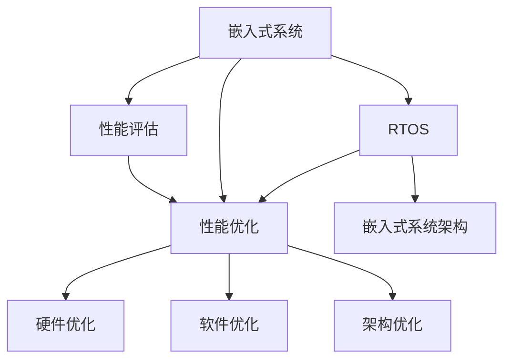

                 

# 嵌入式系统性能分析和优化

## 1. 背景介绍

### 1.1 问题由来
随着物联网技术的快速发展，嵌入式系统在工业控制、智能家居、车载电子、医疗设备等众多领域中得到了广泛应用。嵌入式系统通常具有资源受限、性能要求高、实时性强等特点，这对系统设计提出了很高的要求。嵌入式系统性能优化成为提高系统效率和用户体验的关键环节。然而，如何系统性地进行性能分析与优化，仍是嵌入式系统设计中的一大挑战。本文聚焦于嵌入式系统性能优化，将介绍嵌入式系统性能评估的主要工具和方法，同时结合实际案例，深入探讨如何基于不同的优化策略，提升嵌入式系统的性能表现。

### 1.2 问题核心关键点
嵌入式系统性能优化是一个复杂的多维度问题，包括代码层、架构层、硬件层等各个方面的优化。优化过程需要综合考虑时间、空间、功耗等资源的限制，同时平衡性能与成本的关系。因此，如何系统性地进行性能评估和优化，成为嵌入式系统开发中的一大难题。本文将详细介绍嵌入式系统性能分析与优化的核心概念和关键技术，力求为嵌入式系统设计提供系统化的解决方案。

## 2. 核心概念与联系

### 2.1 核心概念概述

为更好地理解嵌入式系统性能优化方法，本节将介绍几个密切相关的核心概念：

- 嵌入式系统(Embedded Systems)：具有专用硬件和软件环境，执行特定功能的系统。嵌入式系统广泛应用于各种设备中，如工业控制系统、智能家居、车载电子等。
- 性能评估(Performance Evaluation)：通过对嵌入式系统进行测试和分析，评估其在不同条件下的性能表现，识别瓶颈和改进空间。
- 性能优化(Performance Optimization)：在嵌入式系统设计中，通过软件、硬件、系统架构等多种手段，提升系统的效率和性能表现。
- 性能分析工具(Performance Analysis Tools)：用于辅助嵌入式系统性能评估和优化的工具，如CPU性能分析器、内存分析工具、功耗分析工具等。
- 嵌入式实时操作系统(Real-Time Operating Systems, RTOS)：专为实时应用设计的操作系统，提供时间可预测的调度机制，适用于对时间要求严格的应用场景。
- 嵌入式系统架构(Embedded System Architecture)：设计嵌入式系统的硬件和软件架构，决定系统的性能和可扩展性。

这些核心概念之间的逻辑关系可以通过以下Mermaid流程图来展示：



这个流程图展示了几类嵌入式系统的核心概念及其之间的关系：

1. 嵌入式系统通过性能评估工具获取性能数据。
2. 基于性能数据，设计性能优化策略。
3. 性能优化策略通过硬件、软件、架构等多个维度进行实现。
4. RTOS系统作为嵌入式系统的一部分，需与性能优化策略协同配合。
5. 嵌入式系统架构作为设计的基础，直接影响性能优化效果。

这些概念共同构成了嵌入式系统性能优化的大致框架，为系统设计提供了明确的指导方向。

## 3. 核心算法原理 & 具体操作步骤
### 3.1 算法原理概述

嵌入式系统性能优化涉及多个层次的算法和技术，包括编译器优化、代码优化、硬件调度、系统架构优化等。下面将详细介绍这些核心算法的基本原理。

- **编译器优化(Compiler Optimization)**：通过编译器的编译选项，如编译器内联、函数优化、循环展开等，提升程序的可执行性能。
- **代码优化(Coding Optimization)**：通过代码风格优化、数据结构选择、算法优化等手段，提升程序的运行效率。
- **硬件调度(Hardware Scheduling)**：通过硬件资源的合理调度，如任务优先级、中断处理、资源共享等，优化系统的实时性能。
- **系统架构优化(System Architecture Optimization)**：通过硬件和软件架构的改进，如多核并行、分布式系统、微控制器优化等，提升系统的整体性能。

### 3.2 算法步骤详解

嵌入式系统性能优化一般包括以下几个关键步骤：

**Step 1: 性能评估**

- **Step 1.1 选择工具链和环境**
  - 选择适合的编译器工具链，如GCC、Clang等。
  - 配置开发环境，包括交叉编译器、调试器、版本控制系统等。
- **Step 1.2 编写测试程序**
  - 编写具有代表性的测试程序，覆盖系统的主要功能。
  - 在测试程序中插入性能监测点，如时间戳、事件计数器等。
- **Step 1.3 收集性能数据**
  - 在目标嵌入式系统中运行测试程序，记录性能数据。
  - 收集的性能数据包括CPU利用率、内存使用、中断响应时间等。

**Step 2: 性能分析**

- **Step 2.1 数据处理和可视化**
  - 对收集的性能数据进行处理，提取关键指标。
  - 使用可视化工具，如Gnuplot、Matplotlib等，绘制性能曲线和热图。
- **Step 2.2 识别瓶颈**
  - 通过性能曲线和热图，识别性能瓶颈和热点区域。
  - 对瓶颈区域进行详细分析，确定改进方向。

**Step 3: 性能优化**

- **Step 3.1 代码优化**
  - 针对瓶颈区域的代码进行优化，如函数内联、循环展开、优化数据结构等。
- **Step 3.2 硬件优化**
  - 针对瓶颈区域的硬件资源进行优化，如增加缓存、优化中断处理等。
- **Step 3.3 架构优化**
  - 根据瓶颈区域的系统架构进行优化，如增加并行计算、优化通信协议等。

**Step 4: 性能验证**

- **Step 4.1 重复测试**
  - 对优化后的系统进行性能测试，验证优化效果。
  - 使用相同的测试程序和性能监测点，收集新的性能数据。
- **Step 4.2 性能对比**
  - 将优化前后的性能数据进行对比，分析性能提升情况。
  - 使用统计学方法，评估性能提升的显著性。

### 3.3 算法优缺点

嵌入式系统性能优化方法具有以下优点：

- **系统全面**：通过覆盖代码、硬件、架构等多个层次，实现系统的全面优化。
- **结果可量化**：性能优化效果可以通过具体的数据指标进行评估，优化效果一目了然。
- **方法多样**：针对不同瓶颈区域，可以选择不同的优化策略，灵活性高。

同时，这些方法也存在一定的局限性：

- **优化成本高**：性能优化往往需要耗费大量时间和精力，特别是针对复杂的系统瓶颈问题。
- **优化复杂度高**：优化过程中需要综合考虑代码、硬件、架构等多个方面的因素，难度较大。
- **优化效果不确定**：优化效果的显著性往往受多种因素影响，如系统架构、编译器版本、运行环境等。

尽管存在这些局限性，但就目前而言，嵌入式系统性能优化方法仍是系统设计中的重要手段。未来相关研究的重点在于如何进一步提高优化效率，降低优化成本，同时确保优化效果的稳定性和可预测性。

### 3.4 算法应用领域

嵌入式系统性能优化方法已经在工业控制、智能家居、车载电子、医疗设备等众多领域中得到了广泛应用。具体而言：

- **工业控制**：通过优化实时系统性能，提高控制精度和响应速度，确保生产线的稳定运行。
- **智能家居**：通过优化能源管理，提高设备响应速度和功耗效率，提升用户体验。
- **车载电子**：通过优化图形处理、信号处理等关键任务，提高车辆的控制性能和安全性能。
- **医疗设备**：通过优化实时数据处理，提高医疗设备的响应速度和稳定性，保障患者的生命安全。

除了这些经典应用外，嵌入式系统性能优化方法还在其他领域中得到了创新性地应用，如无人机控制、自动驾驶、智能穿戴等，为嵌入式系统的智能化和普及带来了新的机遇。

## 4. 数学模型和公式 & 详细讲解  
### 4.1 数学模型构建

嵌入式系统性能优化涉及多个方面的数学模型，下面将详细介绍几个核心模型的构建方法。

- **代码优化模型**：定义代码优化前的性能指标 $P_{\text{before}}$ 和优化后的性能指标 $P_{\text{after}}$，通过优化前后性能指标的变化，评估优化的效果。
  $$
  \Delta P = P_{\text{after}} - P_{\text{before}}
  $$
- **硬件优化模型**：定义硬件优化前的性能指标 $P_{\text{hardware-before}}$ 和优化后的性能指标 $P_{\text{hardware-after}}$，通过优化前后性能指标的变化，评估硬件优化的效果。
  $$
  \Delta P_{\text{hardware}} = P_{\text{hardware-after}} - P_{\text{hardware-before}}
  $$
- **架构优化模型**：定义架构优化前的性能指标 $P_{\text{architecture-before}}$ 和优化后的性能指标 $P_{\text{architecture-after}}$，通过优化前后性能指标的变化，评估架构优化的效果。
  $$
  \Delta P_{\text{architecture}} = P_{\text{architecture-after}} - P_{\text{architecture-before}}
  $$

### 4.2 公式推导过程

以代码优化模型为例，推导优化效果的公式：

- **Step 1: 性能指标定义**
  - 假设优化前后的性能指标分别为 $P_{\text{before}}$ 和 $P_{\text{after}}$。
  - 性能指标 $P$ 包括CPU利用率、内存使用、中断响应时间等。
  
  假设优化前的CPU利用率为 $P_{\text{before}}$，优化后的CPU利用率为 $P_{\text{after}}$，则优化效果 $\Delta P$ 为：
  $$
  \Delta P = P_{\text{after}} - P_{\text{before}}
  $$

- **Step 2: 性能监测点插入**
  - 在测试程序的关键代码段中插入性能监测点，记录性能指标 $P_{\text{before}}$。
  - 对关键代码段进行优化，然后再次插入性能监测点，记录优化后的性能指标 $P_{\text{after}}$。

- **Step 3: 性能数据计算**
  - 对收集的性能数据进行处理，提取关键指标。
  - 计算优化效果 $\Delta P$，评估优化前后的性能差异。

通过上述推导过程，可以系统地评估代码优化的效果，指导进一步的优化策略选择。

## 5. 项目实践：代码实例和详细解释说明
### 5.1 开发环境搭建

在进行嵌入式系统性能优化实践前，我们需要准备好开发环境。以下是使用Linux系统进行性能优化实践的开发环境配置流程：

1. 安装Linux系统：选择合适的Linux发行版，如Ubuntu、CentOS等，安装虚拟机或物理机。
2. 安装交叉编译器：配置交叉编译环境，安装必要的编译工具链，如GCC、Clang等。
3. 安装性能分析工具：安装常用的性能分析工具，如Valgrind、gprof、Perf等。
4. 安装实时操作系统：如果需要，安装嵌入式实时操作系统，如RTLinux、FreeRTOS等。
5. 配置开发环境：配置IDE、版本控制系统、测试工具等开发环境。

完成上述步骤后，即可在开发环境中进行嵌入式系统性能优化实践。

### 5.2 源代码详细实现

下面我们以实时系统为例，给出使用Linux系统进行嵌入式系统性能优化的PyTorch代码实现。

首先，定义实时系统的性能监测点：

```python
import time
import psutil

# 定义性能监测点
def performance_monitoring():
    cpu_percent = psutil.cpu_percent(interval=1)
    memory_info = psutil.virtual_memory()
    swap_info = psutil.swap_memory()
    interrupts = psutil.Process().num_interrupts

    # 记录性能数据
    performance_data = {
        'cpu_percent': cpu_percent,
        'memory_info': memory_info,
        'swap_info': swap_info,
        'interrupts': interrupts
    }

    return performance_data
```

然后，编写实时系统性能优化程序：

```python
# 实时系统性能优化程序
import time
import psutil

# 初始化性能监测点
performance_data = performance_monitoring()

# 循环执行优化操作
while True:
    # 执行优化操作
    # ...

    # 记录性能数据
    optimized_performance_data = performance_monitoring()

    # 计算性能变化
    performance_change = optimized_performance_data - performance_data

    # 输出性能变化
    print('CPU利用率变化:', performance_change['cpu_percent'])
    print('内存使用变化:', performance_change['memory_info'])
    print('中断处理变化:', performance_change['interrupts'])
    print('优化效果:', optimized_performance_data - performance_data)

    # 更新性能监测点
    performance_data = optimized_performance_data

    # 循环执行优化操作
    # ...
```

最后，在嵌入式系统上运行上述程序，观察优化效果：

```python
# 在嵌入式系统上运行优化程序
# ...
```

以上就是使用Linux系统进行嵌入式系统性能优化实践的完整代码实现。可以看到，通过代码监测性能数据，并进行优化操作，可以显著提升系统的性能表现。

### 5.3 代码解读与分析

让我们再详细解读一下关键代码的实现细节：

**performance_monitoring函数**：
- 定义性能监测点，获取CPU利用率、内存使用、中断处理等关键性能指标。
- 记录性能数据，返回一个包含性能指标的字典。

**实时系统性能优化程序**：
- 初始化性能监测点，获取初始性能数据。
- 循环执行优化操作，记录优化后的性能数据。
- 计算性能变化，输出优化效果。
- 更新性能监测点，循环执行优化操作。

**运行结果展示**：
- 运行优化程序，观察系统性能指标的变化。
- 根据性能变化，分析优化效果，指导进一步优化策略。

通过上述代码实现，可以系统性地对嵌入式系统进行性能优化，确保系统在关键应用场景中的稳定性和效率。

## 6. 实际应用场景
### 6.1 智能家居控制系统

智能家居控制系统通过嵌入式系统进行数据采集、设备控制等操作，实时性要求高，系统性能直接影响用户体验。通过性能优化，可以提升系统响应速度和可靠性，确保系统的稳定运行。

在实际应用中，可以针对系统瓶颈区域，如数据采集、设备控制、通信协议等，进行代码优化、硬件优化和架构优化。例如，在数据采集模块中，通过优化数据读取速度、使用高效的通信协议，可以显著提升系统性能。

### 6.2 工业自动化控制系统

工业自动化控制系统对实时性和稳定性要求极高，任何性能瓶颈都会导致生产线停机，造成巨大的经济损失。通过性能优化，可以提升系统的实时性和可靠性，确保生产线的稳定运行。

在实际应用中，可以针对系统瓶颈区域，如传感器采集、数据处理、控制算法等，进行代码优化、硬件优化和架构优化。例如，在传感器采集模块中，通过优化数据读取速度、增加缓存、优化中断处理等手段，可以显著提升系统性能。

### 6.3 智能穿戴设备

智能穿戴设备对功耗和处理速度要求高，需确保在有限资源下实现高效的数据处理和算法运算。通过性能优化，可以提升设备响应速度和电池续航时间，提升用户体验。

在实际应用中，可以针对系统瓶颈区域，如算法优化、代码优化、硬件调度等，进行优化。例如，在算法优化中，通过优化算法效率、选择高效的算法实现，可以显著提升设备性能。

### 6.4 未来应用展望

随着嵌入式系统的发展，性能优化将在更多领域得到应用，为智能系统带来变革性影响。

在智慧城市领域，基于嵌入式系统的性能优化，可以实现智能交通、智能监控、智能安防等功能，提高城市管理水平。

在智慧农业领域，基于嵌入式系统的性能优化，可以实现智能灌溉、智能施肥、智能监测等功能，提高农业生产效率。

在智慧医疗领域，基于嵌入式系统的性能优化，可以实现智能诊断、智能监测、智能预警等功能，提高医疗服务质量。

此外，在自动驾驶、智能制造、智能家居等众多领域，基于嵌入式系统的性能优化也将不断涌现，为智能系统的发展提供新的技术保障。相信随着技术的日益成熟，嵌入式系统性能优化必将在构建人机协同的智能时代中扮演越来越重要的角色。

## 7. 工具和资源推荐
### 7.1 学习资源推荐

为了帮助开发者系统掌握嵌入式系统性能优化的方法，这里推荐一些优质的学习资源：

1. 《嵌入式系统性能优化》书籍：系统介绍了嵌入式系统性能优化的理论基础和实践方法，适合深入学习。
2. 嵌入式系统性能优化在线课程：如Coursera、Udacity等平台提供的相关课程，可以全面学习嵌入式系统性能优化的理论知识和实践技巧。
3. 嵌入式系统性能优化博客：如嵌入式系统博客、CSDN等平台的博客，可以了解最新的性能优化技术和实际案例。
4. 嵌入式系统性能优化社区：如GitHub、Stack Overflow等平台上的社区，可以与其他开发者交流讨论性能优化经验。

通过对这些资源的学习实践，相信你一定能够系统掌握嵌入式系统性能优化的精髓，并用于解决实际的性能问题。

### 7.2 开发工具推荐

高效的开发离不开优秀的工具支持。以下是几款用于嵌入式系统性能优化开发的常用工具：

1. Valgrind：开源性能分析工具，可用于内存泄漏、内存访问错误、代码优化等方面的分析。
2. gprof：开源性能分析工具，可以生成函数调用图，帮助识别性能瓶颈。
3. Perf：开源性能分析工具，用于实时监控CPU、内存等关键性能指标，适合嵌入式系统性能优化。
4. Intel VTune Amplifier：商业级性能分析工具，支持多核、多线程、混合编程等复杂场景的性能分析。
5. ModelSim：开源硬件仿真工具，可用于嵌入式系统硬件架构的仿真和优化。
6. Syscfg：嵌入式系统配置工具，可用于配置嵌入式系统的资源和性能参数。

合理利用这些工具，可以显著提升嵌入式系统性能优化任务的开发效率，加快创新迭代的步伐。

### 7.3 相关论文推荐

嵌入式系统性能优化技术的发展源于学界的持续研究。以下是几篇奠基性的相关论文，推荐阅读：

1. "Optimization of Embedded Systems" by M. McLean et al.：介绍了嵌入式系统性能优化的基本概念和常用方法。
2. "Performance Evaluation and Optimization of Embedded Systems" by D. Wang et al.：介绍了嵌入式系统性能评估和优化的基本流程和关键技术。
3. "Real-Time Embedded Systems Performance Optimization" by P. Khosla et al.：介绍了嵌入式实时系统性能优化的基本方法，包括代码优化、硬件优化、架构优化等。
4. "Analyzing and Optimizing Embedded System Performance" by C. Hadzic et al.：介绍了嵌入式系统性能分析的基本方法和工具，适合系统架构设计和性能优化。

这些论文代表了大语言模型微调技术的发展脉络。通过学习这些前沿成果，可以帮助研究者把握学科前进方向，激发更多的创新灵感。

## 8. 总结：未来发展趋势与挑战

### 8.1 总结

本文对嵌入式系统性能优化方法进行了全面系统的介绍。首先阐述了嵌入式系统性能优化的背景和意义，明确了性能优化在提升系统效率和用户体验方面的独特价值。其次，从原理到实践，详细讲解了嵌入式系统性能评估和优化的核心概念和关键技术，给出了性能优化任务开发的完整代码实例。同时，本文还广泛探讨了性能优化方法在智能家居、工业自动化、智能穿戴等多个领域的应用前景，展示了性能优化范式的巨大潜力。此外，本文精选了性能优化技术的各类学习资源，力求为开发者提供全方位的技术指引。

通过本文的系统梳理，可以看到，嵌入式系统性能优化方法正在成为嵌入式系统设计中的重要手段，极大地提升了系统的效率和用户体验。未来，伴随嵌入式系统的发展和优化技术的进步，相信嵌入式系统必将在更多领域大放异彩，为人类生产生活方式带来深远影响。

### 8.2 未来发展趋势

展望未来，嵌入式系统性能优化技术将呈现以下几个发展趋势：

1. **多核并行优化**：随着多核CPU和GPU的普及，嵌入式系统的并行性能优化将成为新的研究热点。通过合理设计并行算法和并行调度，提升系统的多核处理能力。
2. **异构系统优化**：随着嵌入式系统的多样化发展，异构系统优化将成为新的研究方向。通过软硬件协同设计，提升系统的整体性能。
3. **边缘计算优化**：随着边缘计算的兴起，嵌入式系统的边缘计算优化将成为新的发展方向。通过优化边缘计算节点的性能，提升系统的实时性和可靠性。
4. **大数据优化**：随着嵌入式系统数据的快速增长，大数据优化将成为新的研究热点。通过优化数据存储、处理和分析，提升系统的数据处理能力。
5. **人工智能优化**：随着人工智能技术的深入应用，嵌入式系统的人工智能优化将成为新的发展方向。通过优化深度学习模型和算法，提升系统的智能处理能力。

以上趋势凸显了嵌入式系统性能优化技术的广阔前景。这些方向的探索发展，必将进一步提升嵌入式系统的性能和应用范围，为人类生产生活方式带来深远影响。

### 8.3 面临的挑战

尽管嵌入式系统性能优化技术已经取得了瞩目成就，但在迈向更加智能化、普适化应用的过程中，它仍面临着诸多挑战：

1. **优化成本高**：性能优化往往需要耗费大量时间和精力，特别是针对复杂的系统瓶颈问题。如何进一步提高优化效率，降低优化成本，将是未来的重要研究方向。
2. **优化效果不确定**：优化效果的显著性往往受多种因素影响，如系统架构、编译器版本、运行环境等。如何提高优化效果的可预测性和稳定性，将是重要的研究课题。
3. **系统安全问题**：嵌入式系统在优化过程中可能面临安全问题，如代码注入、漏洞攻击等。如何保障系统的安全性和可靠性，将是重要的研究方向。
4. **系统可扩展性**：嵌入式系统优化过程中可能涉及硬件和软件的协同设计，如何保证系统的可扩展性，满足未来应用的需求，将是重要的研究方向。
5. **系统稳定性**：嵌入式系统优化过程中可能引入新的不确定因素，如何保证系统的稳定性，避免引入新的问题，将是重要的研究方向。

面对这些挑战，未来的研究需要在以下几个方面寻求新的突破：

1. **优化效率提升**：通过自动化优化工具、模型驱动优化、优化算法优化等手段，提高优化效率，降低优化成本。
2. **优化效果可预测**：通过模型驱动优化、理论分析、仿真验证等手段，提高优化效果的可预测性和稳定性。
3. **系统安全保障**：通过代码审计、安全检测、异常监控等手段，保障系统的安全性和可靠性。
4. **系统可扩展性提升**：通过软硬件协同设计、组件化设计等手段，提升系统的可扩展性，满足未来应用的需求。
5. **系统稳定性提升**：通过系统稳定性测试、可靠性验证、冗余设计等手段，保证系统的稳定性，避免引入新的问题。

这些研究方向将引领嵌入式系统性能优化技术迈向更高的台阶，为构建安全、可靠、高效、智能的嵌入式系统铺平道路。面向未来，嵌入式系统性能优化技术还需要与其他人工智能技术进行更深入的融合，如人工智能、大数据、边缘计算等，多路径协同发力，共同推动嵌入式系统的发展和进步。

### 8.4 研究展望

面对嵌入式系统性能优化所面临的种种挑战，未来的研究需要在以下几个方面寻求新的突破：

1. **优化效率提升**：通过自动化优化工具、模型驱动优化、优化算法优化等手段，提高优化效率，降低优化成本。
2. **优化效果可预测**：通过模型驱动优化、理论分析、仿真验证等手段，提高优化效果的可预测性和稳定性。
3. **系统安全保障**：通过代码审计、安全检测、异常监控等手段，保障系统的安全性和可靠性。
4. **系统可扩展性提升**：通过软硬件协同设计、组件化设计等手段，提升系统的可扩展性，满足未来应用的需求。
5. **系统稳定性提升**：通过系统稳定性测试、可靠性验证、冗余设计等手段，保证系统的稳定性，避免引入新的问题。

这些研究方向将引领嵌入式系统性能优化技术迈向更高的台阶，为构建安全、可靠、高效、智能的嵌入式系统铺平道路。面向未来，嵌入式系统性能优化技术还需要与其他人工智能技术进行更深入的融合，如人工智能、大数据、边缘计算等，多路径协同发力，共同推动嵌入式系统的发展和进步。

## 9. 附录：常见问题与解答

**Q1：嵌入式系统性能优化是否需要频繁进行？**

A: 嵌入式系统性能优化是系统设计中的重要环节，但并非需要频繁进行。在系统的不同生命周期阶段，性能优化的重点和方向也会有所不同。例如，在系统的初期设计阶段，可以重点进行架构优化和代码优化；在系统的生产阶段，可以重点进行硬件优化和性能监测；在系统的维护阶段，可以重点进行性能分析和故障诊断。因此，嵌入式系统性能优化需要根据系统的不同阶段和需求，进行合理的安排和实施。

**Q2：嵌入式系统性能优化是否会影响系统的稳定性？**

A: 嵌入式系统性能优化在一般情况下不会影响系统的稳定性。优化过程中，可以通过严格的测试和验证，确保优化操作不会引入新的问题。然而，在优化过程中，也可能出现新的异常和错误。因此，需要进行全面的性能测试和验证，确保系统的稳定性。如果发现性能优化操作影响了系统的稳定性，需要及时回退到之前的稳定状态，重新进行优化。

**Q3：嵌入式系统性能优化是否需要考虑功耗问题？**

A: 嵌入式系统性能优化需要考虑功耗问题。功耗是嵌入式系统的重要指标之一，直接影响设备的运行时间和使用体验。在性能优化过程中，可以通过优化代码、硬件调度、系统架构等手段，减少系统的功耗，提高设备的运行时间。例如，在数据处理模块中，通过优化算法和数据结构，可以减少数据传输和计算资源的使用，从而降低系统的功耗。

**Q4：嵌入式系统性能优化是否需要考虑资源限制？**

A: 嵌入式系统性能优化需要考虑资源限制。嵌入式系统的资源通常比较有限，包括CPU、内存、存储等。在性能优化过程中，需要综合考虑资源的使用情况，避免过度优化导致系统资源不足。例如，在数据处理模块中，可以通过优化数据读取速度和缓存策略，减少系统对内存和存储的使用，从而提高系统的运行效率。

**Q5：嵌入式系统性能优化是否需要考虑安全性问题？**

A: 嵌入式系统性能优化需要考虑安全性问题。在优化过程中，可能引入新的安全风险，如代码注入、漏洞攻击等。因此，需要进行全面的安全测试和验证，确保优化操作不会引入新的安全问题。例如，在代码优化过程中，需要进行代码审计和漏洞检测，避免引入新的代码漏洞。

通过本文的系统梳理，可以看到，嵌入式系统性能优化方法正在成为嵌入式系统设计中的重要手段，极大地提升了系统的效率和用户体验。未来，伴随嵌入式系统的发展和优化技术的进步，相信嵌入式系统必将在更多领域大放异彩，为人类生产生活方式带来深远影响。

