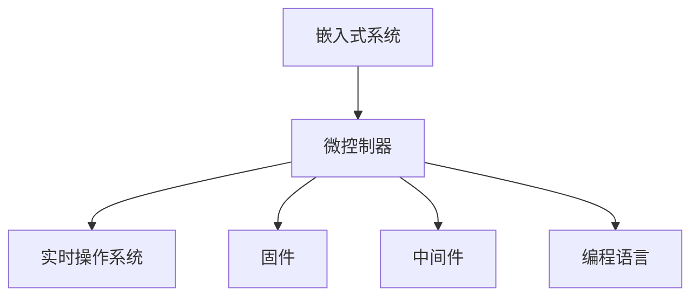
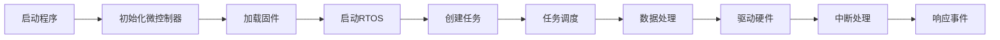
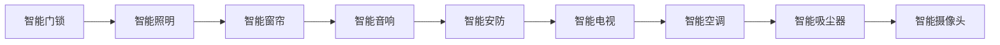
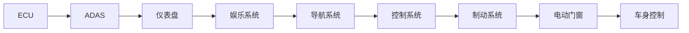
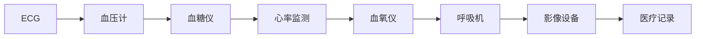

                 

# 嵌入式系统编程：微控制器上的创新

## 1. 背景介绍

随着物联网、智能设备等技术的飞速发展，嵌入式系统已经广泛渗透到我们生活的各个领域，从智能家居到工业控制，从智能穿戴到汽车电子，嵌入式系统无处不在。而微控制器作为嵌入式系统的核心组件，其编程技术与创新应用也成为了业内外关注的热点。本文将从嵌入式系统编程的角度，探讨微控制器上的最新创新，为开发者提供全面的技术指导和实践案例。

## 2. 核心概念与联系

### 2.1 核心概念概述

要深入理解嵌入式系统编程和微控制器上的创新，首先需要了解几个核心概念：

- **嵌入式系统**：一种专门为特定应用场景设计的计算机系统，通常具有资源受限、高可靠性、低功耗等特点。
- **微控制器(Microcontroller, MCU)**：一种集成CPU、存储器、输入输出接口等多种功能的单片机系统，广泛应用于嵌入式设备中。
- **实时操作系统(Real-Time Operating System, RTOS)**：为满足系统对实时性和可靠性的要求，提供多任务调度和资源管理能力的软件系统。
- **固件(Firmware)**：运行在嵌入式设备上的程序，一般由硬件厂商提供，用于实现设备的基本功能和控制逻辑。
- **中间件(Middleware)**：为连接应用层与底层硬件的桥梁，提供数据通信、协议支持、设备管理等通用功能。
- **编程语言**：嵌入式系统常用的编程语言包括C/C++、汇编语言等，不同微控制器可能支持的编程语言有所不同。

这些概念之间相互关联，共同构成了嵌入式系统编程的基础框架。下图展示了各概念之间的联系：



### 2.2 核心概念原理和架构的 Mermaid 流程图

接下来，我们将通过Mermaid流程图展示嵌入式系统编程的基本流程，包括微控制器的初始化、任务调度、数据处理、硬件驱动等关键环节。



该图展示了嵌入式系统编程的基本流程。开发者需要按照这一流程，逐步实现系统的初始化、任务创建、数据处理、硬件控制等关键功能。

## 3. 核心算法原理 & 具体操作步骤

### 3.1 算法原理概述

嵌入式系统编程的核心算法原理主要包括任务调度、数据处理和硬件驱动。以下将分别介绍这些关键算法的原理和实现方法。

#### 3.1.1 任务调度算法

任务调度算法是实时操作系统RTOS的核心组件，用于根据任务的优先级和截止时间，合理分配CPU资源，确保系统任务按时完成。常用的任务调度算法包括时间片轮转、抢占式调度、优先级调度等。

- **时间片轮转**：将CPU时间划分为固定的时间片，各个任务轮流占用CPU，每个任务在一个时间片内执行完毕。
- **抢占式调度**：当一个任务的优先级高于当前运行任务时，立即中断当前任务，转而执行新任务的算法。
- **优先级调度**：根据任务的优先级，从高到低依次执行任务的算法。

#### 3.1.2 数据处理算法

数据处理算法涉及数据的读取、存储、传输和处理等操作。在嵌入式系统中，数据处理算法需要高效、低功耗、高可靠性。常用的数据处理算法包括DMA、中断处理、异步通信等。

- **DMA**：直接内存访问，通过硬件实现数据从一个内存区域快速复制到另一个内存区域，减少CPU的负担。
- **中断处理**：通过硬件中断机制，实现数据的快速响应和处理，提高系统的实时性。
- **异步通信**：通过非阻塞的通信机制，实现数据的异步传输和处理，提高系统的吞吐量。

#### 3.1.3 硬件驱动算法

硬件驱动算法用于控制微控制器的外围设备，如串口、GPIO、定时器等。常用的硬件驱动算法包括直接操作硬件寄存器、驱动程序等。

- **直接操作硬件寄存器**：通过读取和写入硬件寄存器，实现对硬件设备的基本控制。
- **驱动程序**：为硬件设备提供统一的接口，隐藏底层硬件操作的复杂性，方便上层应用调用。

### 3.2 算法步骤详解

接下来，我们将详细介绍嵌入式系统编程中每个关键算法的详细步骤。

#### 3.2.1 任务调度算法步骤

1. **任务创建**：根据应用需求，定义任务的基本信息，如任务名称、执行函数、优先级、栈大小等。
2. **任务注册**：将任务注册到RTOS中，设置任务的执行函数、参数、堆栈等信息。
3. **任务调度**：根据任务的优先级和截止时间，RTOS调度器选择最优任务执行，分配CPU资源。

#### 3.2.2 数据处理算法步骤

1. **数据读取**：根据数据存储格式，读取数据到内存中。常用的数据读取方式包括串口、以太网、SPI等。
2. **数据存储**：将数据写入内存或外部存储器中。常用的数据存储方式包括RAM、SD卡、闪存等。
3. **数据传输**：通过网络协议或物理接口，将数据从一端传输到另一端。常用的数据传输方式包括TCP/IP、蓝牙、Wi-Fi等。
4. **数据处理**：对读取的数据进行解析、计算、过滤等操作，得到有用的信息。常用的数据处理算法包括FFT、DSP、图像处理等。

#### 3.2.3 硬件驱动算法步骤

1. **硬件初始化**：根据硬件设备规范，初始化硬件寄存器和其他相关参数。
2. **硬件操作**：通过读取和写入硬件寄存器，实现对硬件设备的基本控制。
3. **中断处理**：根据硬件设备的中断信号，执行相应的中断服务函数。
4. **驱动程序调用**：调用驱动程序提供的接口函数，实现对硬件设备的高层次控制。

### 3.3 算法优缺点

嵌入式系统编程中的算法各有优缺点，需要根据具体场景选择合适的方法。

#### 3.3.1 任务调度算法的优缺点

- **优点**：
  - 实时性强，能够满足高优先级任务的及时响应。
  - 多任务并发，提高系统的利用率。

- **缺点**：
  - 实现复杂，需要考虑任务调度策略、上下文切换等细节。
  - 任务调度开销较大，影响系统的实时性。

#### 3.3.2 数据处理算法的优缺点

- **优点**：
  - 效率高，能够快速处理大量数据。
  - 灵活性强，适应不同的数据格式和传输方式。

- **缺点**：
  - 数据读取和存储的开销较大，影响系统的实时性。
  - 数据处理算法复杂，需要考虑错误处理、异常恢复等细节。

#### 3.3.3 硬件驱动算法的优缺点

- **优点**：
  - 控制精确，能够实现硬件设备的基本操作。
  - 底层驱动效率高，降低CPU的负担。

- **缺点**：
  - 实现复杂，需要考虑硬件设备的复杂性。
  - 调试困难，硬件驱动的错误往往难以定位。

### 3.4 算法应用领域

嵌入式系统编程中的算法在各个领域都有广泛的应用。以下列举了几个典型应用领域：

- **工业控制**：在工业生产中，嵌入式系统用于控制机器人的运动、检测生产线的状态、监控设备的运行状态等。
- **智能家居**：在智能家居中，嵌入式系统用于控制家电设备的开关、调节温度、监测家庭环境等。
- **汽车电子**：在汽车电子中，嵌入式系统用于控制车辆的电子设备、实现车辆通信、进行安全监控等。
- **医疗设备**：在医疗设备中，嵌入式系统用于控制医疗设备的运行、监测患者的生理参数、记录医疗数据等。
- **消费电子**：在消费电子中，嵌入式系统用于控制智能手表、智能音箱、智能电视等设备的运行。

## 4. 数学模型和公式 & 详细讲解 & 举例说明

### 4.1 数学模型构建

嵌入式系统编程中的数学模型通常涉及数据处理、信号处理、图像处理等领域。以下将构建几个典型的数学模型。

#### 4.1.1 数字信号处理模型

数字信号处理（Digital Signal Processing, DSP）是嵌入式系统编程中的一个重要领域。常用的数字信号处理模型包括FFT、DFT、IIR等。以下以FFT为例，介绍其数学模型和推导过程。

设$x(t)$为连续时间信号，$X(k)$为其傅里叶变换，$N$为采样点数。则离散傅里叶变换（Discrete Fourier Transform, DFT）的数学模型为：

$$
X(k) = \sum_{n=0}^{N-1} x(n) e^{-j2\pi kn/N}, k=0,1,\dots,N-1
$$

FFT算法通过将DFT分解为N个乘法操作，大大减少了计算量，提高了处理效率。FFT的算法步骤包括：

1. **分治法**：将信号分成奇数部分和偶数部分，分别进行DFT计算。
2. **递归求解**：通过递归求解，得到N/2个点对应的DFT值。
3. **合并结果**：将N个点对应的DFT值合并，得到完整的FFT结果。

#### 4.1.2 图像处理模型

图像处理（Image Processing）是嵌入式系统编程中的另一个重要领域。常用的图像处理模型包括卷积、边缘检测、形态学处理等。以下以卷积为例，介绍其数学模型和推导过程。

设$f(x,y)$为二维图像函数，$h(x,y)$为卷积核，$g(x,y)$为卷积结果。则二维卷积的数学模型为：

$$
g(x,y) = \sum_{m=-\infty}^{\infty} \sum_{n=-\infty}^{\infty} f(x-m,y-n)h(m,n)
$$

卷积算法通过滑动卷积核，对图像进行滤波、平滑、锐化等处理。卷积的算法步骤包括：

1. **滑动窗口**：将卷积核在图像上滑动，计算每个点的卷积值。
2. **矩阵乘法**：将卷积核和滑动窗口内的图像像素值组成矩阵，进行矩阵乘法运算。
3. **结果输出**：将矩阵乘法的结果输出为卷积结果。

### 4.2 公式推导过程

接下来，我们将对FFT和卷积算法进行公式推导。

#### 4.2.1 FFT算法推导

FFT算法通过分治法将DFT分解为更小的DFT计算，具体推导如下：

$$
X(k) = \sum_{n=0}^{N-1} x(n) e^{-j2\pi kn/N}
$$

将上式分解为两个部分，奇数部分和偶数部分：

$$
X(k) = \frac{1}{2}\sum_{n=0}^{N-1} x(n) (e^{-j2\pi kn/N} + e^{j2\pi kn/N})
$$

$$
X(k) = \frac{1}{2}\sum_{n=0}^{N-1} x(n) e^{-j2\pi kn/N} + \frac{1}{2}\sum_{n=0}^{N-1} x(n) e^{j2\pi kn/N}
$$

令$X_e(k)$为偶数部分的DFT，$X_o(k)$为奇数部分的DFT，则：

$$
X_e(k) = \frac{1}{2}\sum_{n=0}^{N/2-1} x(2n) e^{-j2\pi k(2n)/N}
$$

$$
X_o(k) = \frac{1}{2}\sum_{n=0}^{N/2-1} x(2n+1) e^{-j2\pi k(2n+1)/N}
$$

将$X_e(k)$和$X_o(k)$代入$X(k)$，得：

$$
X(k) = X_e(k) + e^{-j\pi k/N}X_o(k)
$$

这样，FFT算法通过递归求解，将$N$个点DFT计算分解为$N/2$个点DFT计算，大大减少了计算量，提高了处理效率。

#### 4.2.2 卷积算法推导

卷积算法的推导基于二维离散傅里叶变换（2D DFT）和逆变换（2D IDFT）。

设$f(x,y)$和$h(x,y)$分别为二维函数，则2D DFT的数学模型为：

$$
F(u,v) = \sum_{x=-\infty}^{\infty} \sum_{y=-\infty}^{\infty} f(x,y)e^{-j2\pi(ux+vy)}
$$

2D IDFT的数学模型为：

$$
f(x,y) = \sum_{u=-\infty}^{\infty} \sum_{v=-\infty}^{\infty} F(u,v)e^{j2\pi(ux+vy)}
$$

卷积算法的实现基于二维DFT和IDFT的计算。具体推导如下：

1. **二维DFT计算**：将$f(x,y)$和$h(x,y)$分别进行2D DFT计算，得到$F(u,v)$。
2. **点乘运算**：将$F(u,v)$与$h(u,v)$进行点乘运算，得到$G(u,v)$。
3. **逆变换计算**：将$G(u,v)$进行2D IDFT计算，得到卷积结果$g(x,y)$。

### 4.3 案例分析与讲解

#### 4.3.1 FFT案例分析

假设有一组信号数据$x(n) = \sin(2\pi n f_0 T_0) + \sin(2\pi n f_1 T_0)$，其中$f_0$和$f_1$为信号频率，$T_0$为采样周期。要求计算该信号的频谱图。

首先将$x(n)$进行FFT计算，得到频谱系数$X(k)$。然后，根据频谱系数$X(k)$，得到频谱图$G(f)$。具体步骤如下：

1. **数据准备**：将信号数据$x(n)$划分为长度$N$的序列。
2. **FFT计算**：使用FFT算法计算频谱系数$X(k)$。
3. **频谱绘制**：根据频谱系数$X(k)$，绘制频谱图$G(f)$。

#### 4.3.2 卷积案例分析

假设有一张图像$f(x,y) = \sum_{m=0}^{1} \sum_{n=0}^{1} x(m,n)$，要求计算该图像的卷积结果$g(x,y)$。具体步骤如下：

1. **数据准备**：将图像数据$f(x,y)$划分为长度$M$和$N$的矩阵。
2. **卷积计算**：使用卷积算法计算卷积结果$g(x,y)$。
3. **结果输出**：将卷积结果$g(x,y)$输出为新的图像数据。

## 5. 项目实践：代码实例和详细解释说明

### 5.1 开发环境搭建

嵌入式系统编程的开发环境搭建需要考虑以下几个方面：

1. **硬件设备选择**：根据应用需求，选择合适的微控制器、开发板和外围设备。
2. **开发工具安装**：安装调试工具、编程软件和操作系统。常用的开发工具包括MDK、Keil、IAR等。
3. **开发环境配置**：配置开发环境，包括编译器、链接器、调试器等。

### 5.2 源代码详细实现

接下来，我们将以嵌入式系统编程中的一个典型任务——串口通信为例，给出代码实现和详细解释。

#### 5.2.1 串口通信的代码实现

```c
#include "stm32f4xx.h"
#include "usart.h"

void USART_Init(void)
{
    // 串口初始化
    USART_InitTypeDef USART_InitStructure;
    RCC_APB1PeriphClockCmd(RCC_APB1Periph_USART1, ENABLE);
    USART_DeInit(USART1);
    USART_InitStructure.USART_Mode = USART_Mode_Rx | USART_Mode_Tx;
    USART_InitStructure.USART_BaudRate = 9600;
    USART_InitStructure.USART_StopBits = USART_StopBits_1;
    USART_InitStructure.USART_WordLength = USART_WordLength_8b;
    USART_InitStructure.USART_HardwareFlowControl = USART_HardwareFlowControl_None;
    USART_InitStructure.USART_Parity = USART_Parity_No;
    USART_InitStructure.USART_Mode = USART_Mode_Rx | USART_Mode_Tx;
    USART_InitStructure.USART_FParity = USART_FParity_Disable;
    USART_InitStructure.USART_Overrun = USART_Overrun_Disable;
    USART_InitStructure.USART_TransmitMode = USART_TransmitMode_Disable;
    USART_Init(USART1, &USART_InitStructure);
}

void USART_PutByte(u8 data)
{
    // 串口发送数据
    while (USART_GetFlagStatus(USART1, USART_FLAG_TXE) == RESET);
    USART_SendData(USART1, data);
    while (USART_GetFlagStatus(USART1, USART_FLAG_TXE) == RESET);
}

u8 USART_GetByte(void)
{
    // 串口接收数据
    while (USART_GetFlagStatus(USART1, USART_FLAG_RXNE) == RESET);
    return USART_ReceiveData(USART1);
}
```

这段代码实现了一个简单的串口通信功能，包括串口的初始化、发送数据和接收数据。具体步骤如下：

1. **串口初始化**：设置串口模式、波特率、停止位、数据位等参数，配置串口时钟、分频器等寄存器。
2. **发送数据**：通过调用`USART_SendData`函数，将数据发送至串口。
3. **接收数据**：通过调用`USART_ReceiveData`函数，接收串口数据。

### 5.3 代码解读与分析

#### 5.3.1 串口初始化

在串口初始化函数`USART_Init`中，我们设置了串口的模式、波特率、停止位、数据位等参数，并配置了串口时钟和分频器寄存器。具体步骤如下：

1. **开启串口时钟**：通过调用`RCC_APB1PeriphClockCmd`函数，开启串口时钟。
2. **初始化串口**：通过调用`USART_DeInit`函数，初始化串口。
3. **配置串口参数**：通过调用`USART_Init`函数，配置串口参数，包括模式、波特率、停止位、数据位等。
4. **配置串口寄存器**：通过配置`USART1`的各个寄存器，实现串口的功能。

#### 5.3.2 发送数据

在发送数据函数`USART_PutByte`中，我们通过调用`USART_SendData`函数，将数据发送至串口。具体步骤如下：

1. **判断发送缓冲区状态**：通过调用`USART_GetFlagStatus`函数，判断发送缓冲区状态。
2. **发送数据**：通过调用`USART_SendData`函数，将数据发送至串口。
3. **等待发送完成**：通过调用`USART_GetFlagStatus`函数，等待发送完成。

#### 5.3.3 接收数据

在接收数据函数`USART_GetByte`中，我们通过调用`USART_ReceiveData`函数，接收串口数据。具体步骤如下：

1. **判断接收缓冲区状态**：通过调用`USART_GetFlagStatus`函数，判断接收缓冲区状态。
2. **接收数据**：通过调用`USART_ReceiveData`函数，接收串口数据。

### 5.4 运行结果展示

运行上述代码，我们通过串口调试器或串口调试软件，验证串口通信的正确性。具体步骤如下：

1. **连接开发板和调试器**：将开发板与调试器连接，开启串口调试功能。
2. **配置调试器参数**：在调试器中配置串口通信的波特率、数据位、停止位等参数。
3. **发送和接收数据**：通过调试器发送数据，观察接收到的数据是否正确。

## 6. 实际应用场景

### 6.1 智能家居

智能家居是嵌入式系统编程的重要应用场景之一。在智能家居中，微控制器用于控制家电设备的开关、调节温度、监测家庭环境等。以下是一个典型的智能家居系统架构图：



在这个架构图中，微控制器通过串口、Wi-Fi等通信方式，实现了家电设备的控制和数据采集。通过RTOS任务调度，微控制器能够高效处理数据，保证系统的实时性和稳定性。

### 6.2 汽车电子

汽车电子是嵌入式系统编程的另一个重要应用场景。在汽车电子中，微控制器用于控制车辆的电子设备、实现车辆通信、进行安全监控等。以下是一个典型的汽车电子系统架构图：



在这个架构图中，微控制器通过CAN总线、以太网等通信方式，实现了汽车电子设备的控制和数据采集。通过RTOS任务调度，微控制器能够高效处理数据，保证系统的实时性和稳定性。

### 6.3 医疗设备

医疗设备是嵌入式系统编程的另一个重要应用场景。在医疗设备中，微控制器用于控制医疗设备的运行、监测患者的生理参数、记录医疗数据等。以下是一个典型的医疗设备系统架构图：



在这个架构图中，微控制器通过串口、I2C等通信方式，实现了医疗设备的控制和数据采集。通过RTOS任务调度，微控制器能够高效处理数据，保证系统的实时性和稳定性。

## 7. 工具和资源推荐

### 7.1 学习资源推荐

为了帮助开发者系统掌握嵌入式系统编程的技术基础，以下推荐一些优质的学习资源：

1. **《嵌入式系统设计》**：这是一本经典教材，系统介绍了嵌入式系统设计的基础知识、硬件和软件架构、开发工具等。
2. **《STM32 microcontrollers and real-time operating systems》**：这是一本详细介绍STM32微控制器和RTOS的书籍，详细介绍了STM32芯片、RTOS任务调度、数据处理等技术。
3. **《嵌入式系统编程》**：这是一门在线课程，介绍了嵌入式系统编程的基础知识和实战技能，包括微控制器、RTOS、数据处理等。
4. **《嵌入式系统设计与实现》**：这是一门在线课程，介绍了嵌入式系统的设计与实现过程，包括硬件设计、软件编程、系统调试等。
5. **《STM32嵌入式开发》**：这是一本实战手册，详细介绍了STM32微控制器的开发过程，包括硬件设计、软件编程、调试与测试等。

通过这些学习资源，相信你能够系统掌握嵌入式系统编程的技术基础，为后续的开发实践打下坚实的基础。

### 7.2 开发工具推荐

嵌入式系统编程的开发工具包括编译器、调试器、仿真器等，以下推荐一些常用的开发工具：

1. **MDK**：这是一个针对STM32微控制器的开发工具，提供了丰富的库函数、调试器和仿真器，适合嵌入式系统的开发。
2. **Keil MDK**：这是一个多平台集成开发环境，支持STM32微控制器和其他MCU，提供了丰富的库函数、调试器和仿真器。
3. **IAR Embedded Workbench**：这是一个跨平台的集成开发环境，支持多种MCU，提供了丰富的库函数、调试器和仿真器。
4. **GDB**：这是一个通用的调试工具，支持多种平台，包括嵌入式系统，提供了丰富的调试功能。
5. **JTAG**：这是一种硬件调试接口，用于微控制器的调试和编程，支持多种嵌入式系统芯片。

通过这些开发工具，你可以高效地进行嵌入式系统编程的开发和调试，提升开发效率和代码质量。

### 7.3 相关论文推荐

嵌入式系统编程的研究方向包括微控制器、RTOS、数据处理等，以下推荐一些经典的论文：

1. **"Real-time and Embedded System Programming" by Hans Lüthig**：这是一本经典教材，详细介绍了嵌入式系统编程的基础知识和实战技能。
2. **"Design and Implementation of an Embedded Real-Time Operating System" by Richard M. Brest**：这是一篇经典论文，介绍了嵌入式实时操作系统RTOS的设计和实现过程。
3. **"Energy-Efficient Event-Driven Scheduling" by Bart M. Ploeg**：这是一篇经典论文，介绍了事件驱动调度算法在嵌入式系统中的应用。
4. **"Embedded System Programming in C and C++" by Philippe Bruneau**：这是一本经典教材，详细介绍了嵌入式系统编程的基础知识和实战技能。
5. **"Energy-Efficient Data Acquisition in Embedded Systems" by M. B. Mirtahvili and S. Saber**：这是一篇经典论文，介绍了嵌入式系统中的数据采集技术。

这些论文代表了嵌入式系统编程领域的前沿研究方向，通过学习这些论文，可以深入理解嵌入式系统的核心技术。

## 8. 总结：未来发展趋势与挑战

### 8.1 研究成果总结

嵌入式系统编程的最新研究成果主要集中在以下几个方面：

1. **实时操作系统**：实时操作系统RTOS的性能和可靠性不断提升，支持更多嵌入式平台和协议。
2. **微控制器设计**：微控制器的性能和功耗不断优化，支持更多高级功能和接口。
3. **数据处理算法**：数据处理算法在嵌入式系统中得到广泛应用，包括FFT、DSP、图像处理等。
4. **硬件驱动技术**：硬件驱动技术不断完善，支持更多嵌入式芯片和外围设备。
5. **嵌入式编程语言**：嵌入式编程语言不断丰富，支持更多高级功能和开发工具。

### 8.2 未来发展趋势

未来嵌入式系统编程的发展趋势主要包括以下几个方面：

1. **智能化升级**：嵌入式系统将更多地应用人工智能技术，如机器学习、深度学习等，提升系统的智能化水平。
2. **边缘计算普及**：边缘计算技术在嵌入式系统中得到广泛应用，支持更多实时数据处理和智能决策。
3. **5G技术应用**：5G技术在嵌入式系统中的应用，提升系统的通信能力和数据处理能力。
4. **跨平台开发**：嵌入式系统编程将更多地应用跨平台技术，支持更多嵌入式平台和编程语言。
5. **自适应系统**：嵌入式系统将更多地应用自适应技术，根据环境变化调整系统的性能和资源分配。

### 8.3 面临的挑战

嵌入式系统编程在发展过程中面临以下挑战：

1. **资源受限**：嵌入式系统资源受限，需要优化算法和代码，提升系统效率。
2. **实时性要求高**：嵌入式系统需要高实时性和稳定性，需要优化任务调度和数据处理算法。
3. **硬件复杂性**：嵌入式系统硬件复杂，需要熟悉多种芯片和接口。
4. **软件复杂性**：嵌入式系统软件复杂，需要掌握多种编程语言和工具。
5. **安全性要求高**：嵌入式系统安全性要求高，需要加强系统防护和数据安全。

### 8.4 研究展望

未来的嵌入式系统编程研究方向主要包括以下几个方面：

1. **实时操作系统优化**：优化实时操作系统RTOS的性能和可靠性，提升系统的实时性和稳定性。
2. **微控制器设计优化**：优化微控制器的性能和功耗，提升系统的处理能力和效率。
3. **数据处理算法创新**：创新数据处理算法，提升系统的处理能力和实时性。
4. **硬件驱动技术创新**：创新硬件驱动技术，支持更多嵌入式芯片和外围设备。
5. **跨平台开发技术**：创新跨平台开发技术，支持更多嵌入式平台和编程语言。

## 9. 附录：常见问题与解答

### 9.1 常见问题解答

**Q1: 嵌入式系统编程中常用的编程语言有哪些？**

A: 嵌入式系统编程中常用的编程语言包括C、C++、汇编语言等。其中，C语言是最常用的嵌入式系统编程语言，具有高效、灵活、可移植性强的特点。C++语言具有面向对象和模板编程的特性，支持更多的高级功能和开发工具。汇编语言可以直接操作硬件寄存器和内存，具有高效率的特点，但学习难度较大。

**Q2: 嵌入式系统编程中常用的开发工具有哪些？**

A: 嵌入式系统编程中常用的开发工具包括MDK、Keil MDK、IAR Embedded Workbench、GDB、JTAG等。这些工具提供了丰富的库函数、调试器和仿真器，支持多种嵌入式平台和编程语言，可以快速开发和调试嵌入式系统。

**Q3: 嵌入式系统编程中常用的数据处理算法有哪些？**

A: 嵌入式系统编程中常用的数据处理算法包括FFT、DSP、图像处理等。FFT算法通过分治法，将DFT分解为更小的DFT计算，大大减少了计算量，提高了处理效率。DSP算法通过DSP芯片硬件加速，提升数据处理的速度和精度。图像处理算法通过卷积、边缘检测、形态学处理等算法，实现图像的滤波、平滑、锐化等处理。

**Q4: 嵌入式系统编程中常用的实时操作系统有哪些？**

A: 嵌入式系统编程中常用的实时操作系统包括FreeRTOS、µC/OS、QNX等。这些操作系统提供了多任务调度和资源管理能力，确保系统任务按时完成，满足实时性和可靠性的要求。

**Q5: 嵌入式系统编程中常用的微控制器有哪些？**

A: 嵌入式系统编程中常用的微控制器包括STM32、AT91、ARM Cortex-M等。这些微控制器具有高性能、低功耗、多外设接口等特点，适合嵌入式系统的开发。

**Q6: 嵌入式系统编程中常用的协议有哪些？**

A: 嵌入式系统编程中常用的协议包括TCP/IP、RS-232、UART、I2C、SPI等。这些协议支持数据的通信和传输，适合不同场景的嵌入式系统开发。

**Q7: 嵌入式系统编程中常用的数据采集技术有哪些？**

A: 嵌入式系统编程中常用的数据采集技术包括ADC、DAC、传感器、摄像头等。这些技术可以采集各种类型的信号和数据，支持多种嵌入式应用场景。

**Q8: 嵌入式系统编程中常用的硬件驱动技术有哪些？**

A: 嵌入式系统编程中常用的硬件驱动技术包括STM32驱动、I2C驱动、SPI驱动等。这些驱动技术支持多种嵌入式芯片和外围设备，方便开发者进行硬件操作和数据采集。

**Q9: 嵌入式系统编程中常用的编程技巧有哪些？**

A: 嵌入式系统编程中常用的编程技巧包括指针操作、中断处理、内存管理、数据结构设计等。这些技巧可以提升程序的效率和稳定性，支持复杂系统的开发。

通过以上常见问题的解答，相信你对嵌入式系统编程有了更深入的了解。希望本文能够为你提供全面的技术指导和实践案例，助力你在嵌入式系统编程领域取得更好的成就。

---

作者：禅与计算机程序设计艺术 / Zen and the Art of Computer Programming

