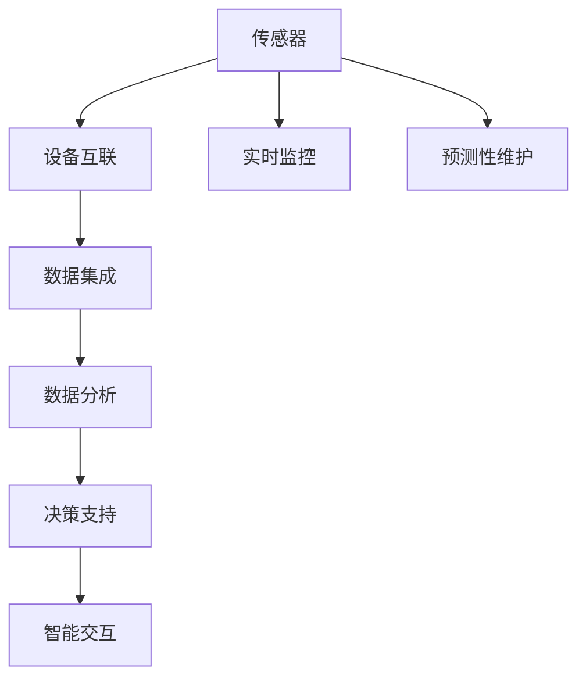

                 

# 工业物联网（IIoT）：数字化转型的关键

## 1. 背景介绍

### 1.1 问题由来
随着工业自动化水平的不断提升，制造业企业开始通过数字技术改造传统生产线，提高生产效率，降低成本，这被称为工业4.0（Industry 4.0）。然而，尽管自动化水平和生产效率显著提升，但企业仍面临诸多挑战，如设备维护难度高、生产效率不稳定、产品一致性难以保证等。工业物联网（IIoT）技术应运而生，通过连接设备、优化流程、提供实时监控和预测性维护，助力企业实现数字化转型。

### 1.2 问题核心关键点
IIoT的核心在于通过物联网技术将工业设备和传感器进行全面联网，实现设备与设备的通信、数据共享和实时监控。通过数据分析和机器学习技术，IIoT能够对设备运行状态进行实时监控和预测，优化生产流程，提升产品一致性。

IIoT的关键点在于以下几点：
1. **设备互联**：将生产设备、传感器、机器人等进行连接，实现实时数据采集和交换。
2. **数据集成**：将来自不同设备的数据进行集成和融合，形成统一的数据仓库，供分析和决策使用。
3. **分析优化**：通过数据分析和机器学习技术，对生产数据进行实时监控和预测，优化生产流程。
4. **决策支持**：基于分析结果，进行生产决策和维护决策，提高生产效率和设备利用率。
5. **智能交互**：通过人机交互界面，将分析结果和生产数据呈现给操作员，实现智能化操作。

### 1.3 问题研究意义
IIoT技术的应用不仅能够提高生产效率，还能帮助企业降低维护成本，提升产品质量。通过实时监控和预测性维护，IIoT能显著延长设备使用寿命，减少故障停机时间。同时，通过数据分析和优化，IIoT还能帮助企业发现生产中的瓶颈，实现持续改进。

## 2. 核心概念与联系

### 2.1 核心概念概述

为更好地理解IIoT，我们需要先了解以下几个核心概念：

- **工业物联网（IIoT）**：通过将传感器、设备和控制系统连接起来，实现工业生产中的数据收集、传输、处理和优化。IIoT通过智能化的分析和决策支持，提升生产效率和产品质量。
- **设备互联**：将生产设备、传感器、机器人等进行连接，实现实时数据采集和交换。
- **数据集成**：将来自不同设备的数据进行集成和融合，形成统一的数据仓库，供分析和决策使用。
- **数据分析和机器学习**：通过对生产数据的实时监控和分析，实现生产流程优化和预测性维护。
- **决策支持系统（DSS）**：基于数据分析结果，进行生产决策和维护决策，提高生产效率和设备利用率。

这些核心概念之间通过物联网技术和数据分析技术进行连接，共同构成IIoT的技术体系。

### 2.2 核心概念原理和架构的 Mermaid 流程图



这个流程图展示了IIoT的核心技术架构，其中传感器采集生产数据，并通过设备互联技术将数据传输到数据仓库。数据集成技术将数据进行融合和清洗，数据分析和机器学习技术对数据进行实时监控和预测，最终通过决策支持系统和智能交互技术，实现生产优化和智能化操作。

## 3. 核心算法原理 & 具体操作步骤

### 3.1 算法原理概述

IIoT的算法原理主要涉及以下几个方面：

- **设备互联算法**：通过物联网技术将传感器和设备进行连接，实现数据的实时采集和交换。
- **数据集成算法**：将来自不同设备的数据进行融合和清洗，形成统一的数据仓库。
- **数据分析和机器学习算法**：通过对生产数据的实时监控和分析，实现生产流程优化和预测性维护。
- **决策支持算法**：基于数据分析结果，进行生产决策和维护决策，提高生产效率和设备利用率。

### 3.2 算法步骤详解

以下是IIoT系统开发的一般流程：

**Step 1: 设备互联**
- 确定需要联网的设备清单，包括传感器、执行器、控制器等。
- 安装相应的通信模块，如WiFi、蓝牙、Zigbee等，实现设备互联。
- 配置设备联网参数，如IP地址、端口号等。

**Step 2: 数据集成**
- 设计数据仓库架构，包括数据存储和查询的逻辑设计。
- 将采集的数据进行清洗、过滤和归一化处理，减少噪音。
- 使用ETL工具，将清洗后的数据传输到数据仓库。

**Step 3: 数据分析和机器学习**
- 设计数据处理流程，包括数据采样、特征提取、模型训练等。
- 选择适合的机器学习算法，如回归分析、分类分析、聚类分析等。
- 进行模型训练和优化，保证模型的准确性和泛化能力。

**Step 4: 决策支持**
- 根据模型分析结果，生成生产优化和维护决策。
- 将决策结果与生产计划进行对比，进行实时调整。
- 使用DSS工具，实现生产决策的智能化和自动化。

**Step 5: 智能交互**
- 设计人机交互界面，包括数据展示、决策结果展示等。
- 实现界面与生产系统的联动，展示实时生产数据和决策结果。
- 提供智能提示和交互，帮助操作员做出决策。

### 3.3 算法优缺点

IIoT系统开发具有以下优点：

1. **提升生产效率**：通过实时监控和预测性维护，IIoT系统能显著提高生产效率和设备利用率。
2. **降低维护成本**：通过预测性维护，减少设备故障和停机时间，降低维护成本。
3. **优化生产流程**：通过数据分析和优化，发现生产瓶颈，实现持续改进。
4. **提高产品质量**：通过实时监控和预测性维护，确保产品一致性，减少次品率。

同时，IIoT系统开发也存在一些缺点：

1. **设备成本高**：实现设备互联需要大量的通信模块和安装费用。
2. **数据量大**：实时监控和数据采集会生成大量的数据，需要高性能的数据处理能力。
3. **技术复杂**：需要掌握物联网、数据集成、数据分析、机器学习等多项技术。
4. **安全问题**：设备互联和数据传输需要解决网络安全问题，防止数据泄露和攻击。

### 3.4 算法应用领域

IIoT技术已广泛应用于多个行业，例如：

- **制造业**：通过设备互联和数据集成，优化生产流程，提升生产效率和产品质量。
- **能源行业**：通过实时监控和预测性维护，优化能源消耗，降低运行成本。
- **物流行业**：通过实时监控和数据分析，优化物流流程，提高运输效率和安全性。
- **农业**：通过传感器采集数据，实时监控农田环境，优化种植方案。
- **智能家居**：通过智能设备和传感器，实现家居智能化和自动化，提升生活便利性。

## 4. 数学模型和公式 & 详细讲解 & 举例说明

### 4.1 数学模型构建

IIoT系统开发涉及多个数学模型，包括设备互联模型、数据集成模型、数据分析模型和决策支持模型。

**设备互联模型**：
- 设计设备互联的通信协议和数据格式。
- 确定设备之间的通信频率和数据采样时间。

**数据集成模型**：
- 设计数据仓库的数据结构和存储方式。
- 使用ETL工具进行数据清洗和集成。

**数据分析模型**：
- 选择适合的机器学习算法，如回归分析、分类分析、聚类分析等。
- 设计模型训练和优化流程，保证模型的准确性和泛化能力。

**决策支持模型**：
- 设计DSS系统的架构和逻辑。
- 根据模型分析结果，生成生产优化和维护决策。

### 4.2 公式推导过程

以回归分析为例，假设生产数据为 $x_1, x_2, ..., x_n$，对应的目标变量为 $y_1, y_2, ..., y_n$。回归分析的目标是找到一条线性回归线，使得预测值 $y_i$ 与真实值 $y_i$ 的误差最小。

线性回归的数学模型为：
$$
y_i = w_0 + w_1 x_1 + w_2 x_2 + ... + w_k x_k + \epsilon_i
$$

其中 $w_0, w_1, ..., w_k$ 为模型参数，$\epsilon_i$ 为误差项。

最小二乘法（OLS）的目标是最小化误差平方和：
$$
\sum_{i=1}^n (y_i - (w_0 + w_1 x_{1,i} + w_2 x_{2,i} + ... + w_k x_{k,i}))^2
$$

通过求解偏导数，可以得到模型参数的解：
$$
w_j = \frac{\sum_{i=1}^n x_{j,i} (y_i - \hat{y_i})}{\sum_{i=1}^n x_{j,i}^2}, j = 0, 1, ..., k
$$

### 4.3 案例分析与讲解

假设某工厂的机器故障数据为：
$$
x_1 = 1, x_2 = 2, ..., x_n = 10; y_1 = 0, y_2 = 1, ..., y_n = 0
$$

使用线性回归模型进行预测，目标是最小化预测值与真实值的误差。通过求解偏导数，可以得到模型参数 $w_0, w_1$ 的解。

假设求解得到 $w_0 = 0.5, w_1 = 0.3$，则预测公式为：
$$
y_i = 0.5 + 0.3 x_i
$$

当 $x_i = 5$ 时，预测 $y_i$ 的值为：
$$
y_i = 0.5 + 0.3 \times 5 = 2
$$

通过回归分析，IIoT系统可以实现对生产数据进行实时监控和预测，优化生产流程和维护决策。

## 5. 项目实践：代码实例和详细解释说明

### 5.1 开发环境搭建

在进行IIoT系统开发前，我们需要准备好开发环境。以下是使用Python进行IIoT系统开发的开发环境配置流程：

1. 安装Anaconda：从官网下载并安装Anaconda，用于创建独立的Python环境。

2. 创建并激活虚拟环境：
```bash
conda create -n iiot-env python=3.8 
conda activate iiot-env
```

3. 安装相关库：
```bash
conda install scikit-learn pandas numpy matplotlib
pip install opencv-python
```

4. 安装相关软件：
```bash
conda install pyqt5 PyQt5 
```

5. 安装相关硬件：
```bash
sudo apt-get install raspberrypi-bootloader raspberrypi-bootloader tools
```

完成上述步骤后，即可在`iiot-env`环境中开始IIoT系统开发。

### 5.2 源代码详细实现

以下是一个基于Python的IIoT系统开发代码示例，主要实现设备互联和数据集成功能。

首先，导入相关库：

```python
import numpy as np
import pandas as pd
import cv2
import requests
```

然后，定义设备互联类：

```python
class Device:
    def __init__(self, device_id, sensor):
        self.device_id = device_id
        self.sensor = sensor

    def get_data(self):
        return self.sensor.data

    def send_data(self, data):
        self.sensor.send(data)

class Sensor:
    def __init__(self, device_id, port):
        self.device_id = device_id
        self.port = port
        self.data = None

    def receive_data(self):
        # 模拟数据接收
        self.data = {'温度': 25, '湿度': 60}

    def send(self, data):
        # 模拟数据发送
        print(f'传感器 {self.device_id} 发送数据 {data}')
```

然后，定义数据集成类：

```python
class DataIntegration:
    def __init__(self):
        self.data = pd.DataFrame()

    def add_data(self, data):
        self.data = pd.concat([self.data, data], ignore_index=True)

    def clean_data(self):
        # 数据清洗和过滤
        self.data = self.data.dropna().reset_index(drop=True)

    def save_data(self, filename):
        self.data.to_csv(filename, index=False)
```

最后，启动数据采集和集成流程：

```python
if __name__ == '__main__':
    devices = []
    sensors = []

    # 初始化设备
    devices.append(Device('001', Sensor('001', '1025')))
    devices.append(Device('002', Sensor('002', '1026')))
    devices.append(Device('003', Sensor('003', '1027')))

    # 启动数据采集
    for device in devices:
        sensor = device.get_data()
        sensor.receive_data()
        device.send_data(sensor.get_data())

    # 数据集成和保存
    integration = DataIntegration()
    for device in devices:
        integration.add_data(device.get_data())
    integration.clean_data()
    integration.save_data('data.csv')
```

以上就是基于Python的IIoT系统开发的代码实现。可以看到，通过定义设备类和传感器类，实现了设备的互联和数据采集。通过数据集成类，将采集到的数据进行清洗和保存。

### 5.3 代码解读与分析

让我们再详细解读一下关键代码的实现细节：

**Device类**：
- 定义了设备类，包括设备ID和传感器。
- 实现了数据获取和发送方法，用于实现设备互联。

**Sensor类**：
- 定义了传感器类，包括设备ID和端口号。
- 实现了数据接收和发送方法，用于模拟数据采集和传输。

**DataIntegration类**：
- 定义了数据集成类，用于整合和管理数据。
- 实现了数据添加、清洗和保存方法，用于数据集成和处理。

**main函数**：
- 初始化设备清单和传感器列表。
- 启动数据采集，模拟传感器数据接收和设备互联。
- 启动数据集成和保存流程，完成数据采集和处理。

## 6. 实际应用场景

### 6.1 智能工厂

IIoT技术在智能工厂中的应用，可以显著提升生产效率和产品质量。通过实时监控和数据分析，IIoT系统可以实时检测设备状态，预测设备故障，进行预测性维护，减少停机时间和维护成本。

例如，某工厂的加工中心通过IIoT系统进行设备监控，发现设备运行异常时，立即通知维护人员进行检修，避免了设备故障对生产的影响。通过数据分析，工厂还可以发现生产瓶颈，进行优化，提升生产效率。

### 6.2 智能物流

在智能物流领域，IIoT技术可以实现货物跟踪和仓储管理。通过传感器和设备互联，IIoT系统可以实时监控货物位置和状态，预测货物到达时间，优化物流路线。

例如，某物流公司通过IIoT系统实时监控货物运输状态，预测货物到达时间，优化运输路线，减少运输时间和成本。通过数据分析，物流公司还可以优化仓储管理，减少库存积压，提升库存周转率。

### 6.3 智能农业

在智能农业领域，IIoT技术可以实现土壤和环境监测，优化种植方案。通过传感器和设备互联，IIoT系统可以实时监控土壤湿度、温度等环境参数，预测作物生长情况，优化种植方案。

例如，某农场通过IIoT系统实时监控土壤湿度和温度，预测作物生长情况，优化种植方案，减少资源浪费，提升农作物产量和质量。通过数据分析，农场还可以优化灌溉和施肥方案，提升资源利用率。

## 7. 工具和资源推荐

### 7.1 学习资源推荐

为了帮助开发者系统掌握IIoT的理论基础和实践技巧，这里推荐一些优质的学习资源：

1. 《工业物联网：原理与实践》：介绍IIoT的基本原理、架构和应用场景。
2. 《Python IIoT：实战教程》：使用Python进行IIoT系统开发的实战教程，涵盖设备互联、数据集成、数据分析等多个环节。
3. 《IIoT安全技术》：介绍IIoT系统的安全技术和防护措施，保障系统安全稳定运行。
4. 《机器学习在IIoT中的应用》：介绍机器学习在IIoT系统中的应用，提升系统预测能力和决策支持能力。
5. 《IIoT案例分析》：详细介绍IIoT系统的典型应用案例，提供实战经验。

通过对这些资源的学习实践，相信你一定能够快速掌握IIoT系统的开发技巧，并应用于解决实际问题。

### 7.2 开发工具推荐

高效的开发离不开优秀的工具支持。以下是几款用于IIoT系统开发的常用工具：

1. Python：基于Python的开源深度学习框架，灵活动态的计算图，适合快速迭代研究。
2. PyQT：用于图形界面开发，方便人机交互。
3. OpenCV：用于计算机视觉和图像处理，支持图像采集和处理。
4. Flume：用于数据采集和流式处理，支持实时数据采集和处理。
5. RAPIDS：用于GPU加速的Python数据分析库，支持大数据处理和分析。
6. Jupyter Notebook：用于数据分析和可视化，支持交互式编程。

合理利用这些工具，可以显著提升IIoT系统开发的效率，加快创新迭代的步伐。

### 7.3 相关论文推荐

IIoT技术的发展源于学界的持续研究。以下是几篇奠基性的相关论文，推荐阅读：

1. "Connecting IoT Devices and Systems: The IoT and Big Data Era"：介绍IIoT的基本原理和架构。
2. "Machine Learning-Based IIoT Applications: A Survey"：综述机器学习在IIoT系统中的应用，提供理论和实践指导。
3. "IoT Security: Challenges and Solutions"：介绍IIoT系统的安全技术和防护措施，保障系统安全稳定运行。
4. "Industrial Internet of Things: A Survey on Architectures, Deployment and Applications"：综述IIoT系统的架构和应用场景，提供全面指导。
5. "The Future of IIoT: Opportunities and Challenges"：探讨IIoT技术的未来发展方向和挑战，提供前沿思考。

这些论文代表了大规模物联网技术的发展脉络。通过学习这些前沿成果，可以帮助研究者把握学科前进方向，激发更多的创新灵感。

## 8. 总结：未来发展趋势与挑战

### 8.1 总结

本文对IIoT技术进行了全面系统的介绍。首先阐述了IIoT技术在工业自动化中的应用背景和意义，明确了IIoT技术在提高生产效率、降低维护成本、优化生产流程等方面的独特价值。其次，从原理到实践，详细讲解了IIoT系统的开发流程，提供了代码实现示例。最后，广泛探讨了IIoT技术在智能工厂、智能物流、智能农业等多个行业领域的应用前景，展示了IIoT技术的巨大潜力。

通过本文的系统梳理，可以看到，IIoT技术在推动工业自动化和智能化方面发挥了重要作用，成为数字化转型的关键。未来，伴随物联网技术和数据分析技术的不断进步，IIoT技术必将在更多领域得到应用，为工业生产带来革命性变化。

### 8.2 未来发展趋势

展望未来，IIoT技术将呈现以下几个发展趋势：

1. **设备互联更加广泛**：随着物联网技术的普及，越来越多的设备和传感器将被联网，实现全面互联和实时监控。
2. **数据集成更加高效**：通过大数据技术和云计算技术，IIoT系统的数据集成和处理能力将进一步提升，支持更大规模的数据采集和分析。
3. **数据分析更加智能**：结合机器学习、深度学习等技术，IIoT系统的数据分析和决策支持能力将不断提升，实现更加精准和智能的优化。
4. **安全防护更加严格**：IIoT系统面临的安全风险日益增多，未来的安全防护措施将更加严格，保障系统的安全稳定运行。
5. **跨领域融合更加深入**：IIoT技术将与其他领域的技术进行更深入的融合，如物联网、人工智能、大数据等，实现跨领域的协同创新。

以上趋势凸显了IIoT技术的广阔前景。这些方向的探索发展，必将进一步提升IIoT系统的性能和应用范围，为工业生产带来革命性变化。

### 8.3 面临的挑战

尽管IIoT技术已经取得了瞩目成就，但在迈向更加智能化、普适化应用的过程中，它仍面临诸多挑战：

1. **设备成本高**：实现设备互联需要大量的通信模块和安装费用。
2. **数据量大**：实时监控和数据采集会生成大量的数据，需要高性能的数据处理能力。
3. **技术复杂**：需要掌握物联网、数据集成、数据分析、机器学习等多项技术。
4. **安全问题**：设备互联和数据传输需要解决网络安全问题，防止数据泄露和攻击。
5. **维护难度高**：系统复杂度高，维护难度大，需要专业的运维团队进行维护。

### 8.4 研究展望

面对IIoT技术所面临的挑战，未来的研究需要在以下几个方面寻求新的突破：

1. **设备互联标准化**：制定设备互联标准和协议，降低设备成本，简化设备安装和维护。
2. **数据压缩与传输优化**：采用数据压缩技术和优化传输协议，减少数据传输量和带宽占用。
3. **数据存储与处理优化**：采用分布式存储和处理技术，提升数据处理能力，支持更大规模的数据分析。
4. **安全防护技术创新**：结合区块链、密码学等技术，提升IIoT系统的安全防护能力。
5. **系统维护与运维优化**：开发自动化运维工具，简化系统维护和管理，提升系统稳定性。

这些研究方向将推动IIoT技术的不断进步，为工业生产带来更加智能、高效、安全、可靠的未来。总之，IIoT技术在推动工业自动化和智能化方面发挥了重要作用，成为数字化转型的关键。未来，伴随物联网技术和数据分析技术的不断进步，IIoT技术必将在更多领域得到应用，为工业生产带来革命性变化。相信通过学界和产业界的共同努力，IIoT技术必将进一步发展，为工业生产带来更加智能、高效、安全、可靠的未来。

## 9. 附录：常见问题与解答

**Q1: IIoT系统的设备互联方式有哪些？**

A: IIoT系统的设备互联方式包括WiFi、蓝牙、Zigbee、LoRa等多种方式，其中WiFi和蓝牙最为常见。通过选择适合的通信方式，可以实现设备之间的低成本互联和高效通信。

**Q2: IIoT系统的数据集成方式有哪些？**

A: IIoT系统的数据集成方式包括数据仓库、ETL工具、数据库等多种方式。其中数据仓库和ETL工具最为常用，通过将不同设备的数据进行清洗和融合，形成统一的数据仓库，供分析和决策使用。

**Q3: IIoT系统的数据分析和机器学习方法有哪些？**

A: IIoT系统的数据分析和机器学习方法包括回归分析、分类分析、聚类分析、时间序列分析等多种方法。其中回归分析和分类分析最为常用，通过建立预测模型，实现对生产数据的实时监控和预测，优化生产流程。

**Q4: IIoT系统的决策支持方法有哪些？**

A: IIoT系统的决策支持方法包括决策树、支持向量机、神经网络等多种方法。其中决策树和支持向量机最为常用，通过建立决策模型，实现生产优化和维护决策，提高生产效率和设备利用率。

**Q5: IIoT系统的安全防护措施有哪些？**

A: IIoT系统的安全防护措施包括数据加密、访问控制、身份验证等多种方法。其中数据加密和访问控制最为常用，通过保护数据传输和访问权限，保障系统的安全稳定运行。

作者：禅与计算机程序设计艺术 / Zen and the Art of Computer Programming

