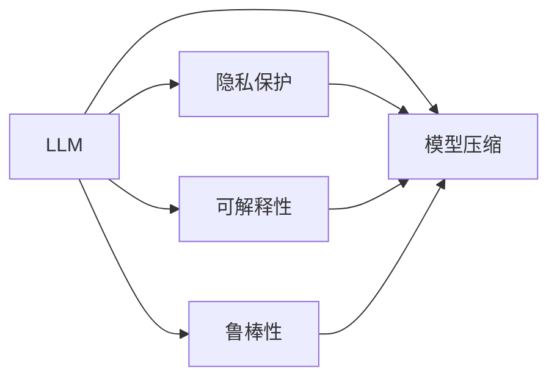
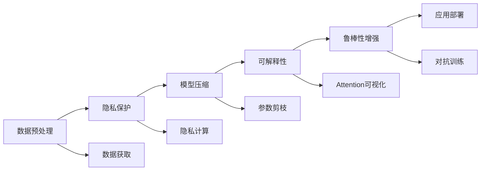

                 

## 1. 背景介绍

### 1.1 问题由来
大型语言模型(LLM)在人工智能(AI)领域以其卓越的语言理解和生成能力，成为推动自然语言处理(NLP)技术发展的核心力量。LLM如GPT、BERT等，通过在海量文本数据上进行自监督预训练，获取了丰富的语言知识和常识，并在各种NLP任务中取得了令人瞩目的成果。然而，LLM在实际应用中仍然面临诸多挑战：

- 数据隐私问题：大模型的训练需要大量数据，如何在保护隐私的同时获取高质量数据是一个难题。
- 可解释性不足：尽管LLM在任务上的表现优异，但其内部决策过程往往缺乏可解释性，难以满足某些行业对于透明度和信任度的要求。
- 模型鲁棒性差：LLM面对噪声或攻击时容易产生误判，如何在不同的环境中保持稳定性和可靠性是一个重要问题。
- 资源消耗大：LLM模型参数量巨大，对计算资源和存储空间的消耗较高。

这些问题限制了LLM在实际应用中的普及，尤其是在需要高透明性、高安全性和高效计算的场景中。工程与设计的合作，能够有效解决这些问题，进一步激发LLM在创新领域的潜力。

### 1.2 问题核心关键点
LLM的工程与设计合作，不仅涵盖了模型的部署和优化，还涉及到了数据预处理、隐私保护、模型压缩等技术，需要多学科的知识和协同工作。其核心关键点如下：

- 工程实践：如何将LLM模型高效部署到实际应用中，提高计算效率和系统稳定性。
- 数据隐私：如何在保护用户隐私的同时，获取和利用高质量的训练数据。
- 模型压缩：如何减少LLM的参数量，降低计算和存储成本。
- 可解释性：如何使LLM模型的决策过程更透明、更可解释，提升用户信任度。
- 鲁棒性增强：如何在多样化和噪声环境中，保持LLM模型的稳定性和鲁棒性。

以下内容将系统介绍LLM的工程与设计合作方法，为AI领域的创新应用提供有力的技术支持。

## 2. 核心概念与联系

### 2.1 核心概念概述

工程与设计在LLM中的应用，需要结合计算机科学、人工智能、信息安全、系统设计等多个领域的知识。以下是几个核心概念的概述：

- **LLM**：即大型语言模型，通过在海量数据上进行预训练，获得了强大的语言理解和生成能力。

- **模型压缩**：通过剪枝、量化等技术，减少模型的参数量，降低计算和存储成本。

- **隐私保护**：在数据获取、存储、处理等各个环节，采用差分隐私、联邦学习等技术，保护用户隐私。

- **可解释性**：通过模型解释方法，如Attention可视化、因果图等，使模型的决策过程更透明、更可解释。

- **鲁棒性**：通过对抗训练、迁移学习等方法，增强模型在不同环境和噪声下的稳定性和鲁棒性。

这些概念通过Mermaid流程图展示，如下所示：



### 2.2 核心概念原理和架构的 Mermaid 流程图

基于上述核心概念，我们可以构建一个LLM的工程与设计合作架构。架构图如下：



该架构展示了大模型从数据获取到应用部署的完整流程，包括数据预处理、隐私保护、模型压缩、可解释性增强和鲁棒性提升。这些环节相互关联，共同构成了一个完整的工程与设计合作系统。

## 3. 核心算法原理 & 具体操作步骤

### 3.1 算法原理概述

LLM的工程与设计合作，涉及多个算法和技术的协同应用。以下对其中的核心算法进行概述：

- **模型压缩**：包括剪枝、量化、模型蒸馏等技术，可以大幅减少模型的参数量，提高计算效率和部署灵活性。
- **隐私保护**：如差分隐私、联邦学习、多方安全计算等技术，可以在保护用户隐私的同时，获取高质量训练数据。
- **可解释性**：通过Attention可视化、因果图等方法，可以揭示模型的内部机制，增强用户信任度。
- **鲁棒性**：通过对抗训练、迁移学习等技术，可以提高模型在各种环境下的稳定性和鲁棒性。

### 3.2 算法步骤详解

#### 3.2.1 数据预处理
数据预处理是工程与设计合作的首要环节，具体步骤如下：

1. **数据清洗**：去除噪声、重复和无用数据，提高数据质量。
2. **数据标准化**：采用标准化方法，如均值归一化、Min-Max归一化，确保数据在同一尺度下。
3. **数据增强**：通过回译、数据扩充等方法，增加训练集多样性，提高模型泛化能力。
4. **数据划分**：将数据划分为训练集、验证集和测试集，进行模型评估和调优。

#### 3.2.2 隐私保护
隐私保护主要通过差分隐私和联邦学习技术实现：

1. **差分隐私**：在训练过程中，通过加入噪声扰动，确保个体数据不被泄露。具体步骤包括：
   - 确定噪声量$\epsilon$，计算噪声分布。
   - 在模型更新过程中，加入噪声扰动。
   - 输出结果经过处理，确保个体隐私不泄露。

2. **联邦学习**：通过分布式计算，在多个本地节点上训练模型，合并结果，实现隐私保护和高效计算。具体步骤包括：
   - 本地节点独立训练模型。
   - 模型参数和梯度聚合。
   - 本地节点更新模型参数。
   - 参数聚合。

#### 3.2.3 模型压缩
模型压缩通过剪枝、量化等技术实现，具体步骤如下：

1. **剪枝**：通过去除冗余连接，减少模型参数量。具体步骤包括：
   - 确定剪枝比例，选择剪枝策略。
   - 剪枝后重新训练模型。
   - 验证剪枝效果，调整策略。

2. **量化**：将浮点模型转换为定点模型，减少存储空间和计算成本。具体步骤包括：
   - 确定量化位数，选择量化策略。
   - 量化模型参数和激活值。
   - 验证量化效果，调整策略。

#### 3.2.4 可解释性增强
可解释性增强通过Attention可视化、因果图等方法实现，具体步骤如下：

1. **Attention可视化**：通过可视化Attention权重，揭示模型的决策过程。具体步骤包括：
   - 获取Attention权重。
   - 可视化权重图，展示信息流动。
   - 分析权重图，理解模型决策。

2. **因果图**：通过构建因果图，分析模型决策的因果关系。具体步骤包括：
   - 收集模型输出。
   - 构建因果图，分析因果关系。
   - 验证因果图，调整模型。

#### 3.2.5 鲁棒性提升
鲁棒性提升通过对抗训练、迁移学习等技术实现，具体步骤如下：

1. **对抗训练**：通过引入对抗样本，增强模型的鲁棒性。具体步骤包括：
   - 生成对抗样本。
   - 在训练过程中加入对抗样本。
   - 验证鲁棒性，调整对抗样本。

2. **迁移学习**：通过在不同领域上的微调，提高模型的泛化能力。具体步骤包括：
   - 确定目标领域，获取目标数据。
   - 在不同领域上进行微调。
   - 验证迁移效果，调整微调策略。

### 3.3 算法优缺点

#### 3.3.1 模型压缩
**优点**：
- 降低计算和存储成本。
- 提高模型的部署灵活性和计算效率。
- 减少模型大小，加速模型训练和推理。

**缺点**：
- 可能会影响模型的精度。
- 增加模型设计的复杂性。
- 需要额外的时间和计算资源进行优化。

#### 3.3.2 隐私保护
**优点**：
- 保护用户隐私。
- 获取高质量的训练数据。
- 确保数据的安全性和合规性。

**缺点**：
- 增加了计算和存储的复杂性。
- 可能影响模型的训练效果。
- 需要多轮训练，增加了时间成本。

#### 3.3.3 可解释性
**优点**：
- 增加用户信任度。
- 提高模型的透明度。
- 帮助发现模型的缺陷和优化方向。

**缺点**：
- 可能增加模型的计算复杂度。
- 影响模型的实时推理速度。
- 需要额外的数据和计算资源。

#### 3.3.4 鲁棒性
**优点**：
- 提高模型在不同环境下的稳定性。
- 增强模型的泛化能力。
- 增加模型的鲁棒性和安全性。

**缺点**：
- 增加模型的训练复杂性。
- 可能影响模型的计算效率。
- 需要额外的时间和资源进行优化。

### 3.4 算法应用领域

LLM的工程与设计合作，在多个领域中都有广泛的应用，例如：

- **自然语言处理(NLP)**：通过模型压缩、可解释性增强等方法，提升模型在NLP任务上的性能和应用范围。
- **推荐系统**：通过隐私保护和鲁棒性提升技术，提高推荐系统的可靠性和用户体验。
- **医疗健康**：通过差分隐私和因果图方法，保护患者隐私，提升医疗决策的透明度。
- **金融风控**：通过联邦学习和对抗训练技术，增强模型的安全性和鲁棒性，降低金融风险。
- **智能家居**：通过模型压缩和鲁棒性提升技术，实现智能家居系统的稳定性和安全性。

## 4. 数学模型和公式 & 详细讲解

### 4.1 数学模型构建

以下展示LLM在隐私保护和可解释性增强方面的数学模型构建。

#### 4.1.1 隐私保护
假设训练数据集为$D=\{x_i\}_{i=1}^N$，其中每个样本$x_i$的隐私保护目标为$\epsilon$，差分隐私目标函数为$L(\theta)$，其中$\theta$为模型参数。差分隐私约束为：

$$
L(\theta) + \frac{\epsilon}{N}\ln(\frac{1}{\delta})
$$

其中$\delta$为隐私保护的概率。在训练过程中，通过加入噪声$\eta$，确保每个样本的隐私保护：

$$
L(\theta) + \frac{\epsilon}{N}\ln(\frac{1}{\delta}) + \frac{1}{2}||g||_2^2
$$

其中$g$为模型梯度，$||g||_2^2$为梯度向量的二范数。

#### 4.1.2 可解释性增强
假设模型的输入为$x_i$，输出为$y_i$，模型的权重为$\theta$。通过Attention可视化，可以计算出每个注意力头在输入$x_i$上的注意力权重$w_j$，如下所示：

$$
w_j = \text{softmax}(\text{Attention}(x_i, \theta))
$$

其中$\text{Attention}(x_i, \theta)$为模型中的Attention层。通过可视化权重图，可以揭示模型的决策过程。

### 4.2 公式推导过程

#### 4.2.1 隐私保护
差分隐私的推导过程如下：

1. **隐私保护目标函数**：
   - 在训练过程中，加入噪声$\eta$，确保个体数据不被泄露。
   - 计算每个样本的隐私保护约束。
   - 目标函数为$L(\theta) + \frac{\epsilon}{N}\ln(\frac{1}{\delta})$。

2. **加入噪声扰动**：
   - 在模型梯度上加入噪声$\eta$。
   - 梯度向量为$g = \nabla_{\theta}L(\theta) + \eta$。
   - 目标函数变为$L(\theta) + \frac{\epsilon}{N}\ln(\frac{1}{\delta}) + \frac{1}{2}||g||_2^2$。

#### 4.2.2 可解释性增强
Attention可视化的推导过程如下：

1. **计算Attention权重**：
   - 计算每个注意力头在输入$x_i$上的注意力权重$w_j$。
   - 目标函数为$w_j = \text{softmax}(\text{Attention}(x_i, \theta))$。

2. **可视化权重图**：
   - 通过可视化权重图，揭示模型的决策过程。
   - 目标函数变为$w_j = \text{softmax}(\text{Attention}(x_i, \theta))$。

### 4.3 案例分析与讲解

#### 4.3.1 隐私保护
以医疗领域为例，保护患者隐私。假设患者数据$D=\{x_i\}_{i=1}^N$，其中每个样本$x_i$包含患者的病历记录和医疗检测结果。差分隐私目标函数为$L(\theta)$，其中$\theta$为模型参数。差分隐私约束为：

$$
L(\theta) + \frac{\epsilon}{N}\ln(\frac{1}{\delta})
$$

在训练过程中，通过加入噪声$\eta$，确保每个样本的隐私保护：

$$
L(\theta) + \frac{\epsilon}{N}\ln(\frac{1}{\delta}) + \frac{1}{2}||g||_2^2
$$

其中$g$为模型梯度，$||g||_2^2$为梯度向量的二范数。

#### 4.3.2 可解释性增强
以自然语言处理(NLP)任务为例，通过Attention可视化，揭示模型的决策过程。假设模型的输入为$x_i$，输出为$y_i$，模型的权重为$\theta$。通过Attention可视化，可以计算出每个注意力头在输入$x_i$上的注意力权重$w_j$，如下所示：

$$
w_j = \text{softmax}(\text{Attention}(x_i, \theta))
$$

其中$\text{Attention}(x_i, \theta)$为模型中的Attention层。通过可视化权重图，可以揭示模型的决策过程。

## 5. 项目实践：代码实例和详细解释说明

### 5.1 开发环境搭建

在进行项目实践前，我们需要准备好开发环境。以下是使用Python进行PyTorch开发的环境配置流程：

1. 安装Anaconda：从官网下载并安装Anaconda，用于创建独立的Python环境。

2. 创建并激活虚拟环境：
```bash
conda create -n pytorch-env python=3.8 
conda activate pytorch-env
```

3. 安装PyTorch：根据CUDA版本，从官网获取对应的安装命令。例如：
```bash
conda install pytorch torchvision torchaudio cudatoolkit=11.1 -c pytorch -c conda-forge
```

4. 安装Transformers库：
```bash
pip install transformers
```

5. 安装各类工具包：
```bash
pip install numpy pandas scikit-learn matplotlib tqdm jupyter notebook ipython
```

完成上述步骤后，即可在`pytorch-env`环境中开始项目实践。

### 5.2 源代码详细实现

下面我们以推荐系统为例，给出使用Transformers库进行推荐系统微调的PyTorch代码实现。

首先，定义推荐系统的训练函数：

```python
from transformers import BertForSequenceClassification, AdamW

model = BertForSequenceClassification.from_pretrained('bert-base-cased', num_labels=2)

optimizer = AdamW(model.parameters(), lr=2e-5)

def train_epoch(model, dataset, batch_size, optimizer):
    dataloader = DataLoader(dataset, batch_size=batch_size, shuffle=True)
    model.train()
    epoch_loss = 0
    for batch in tqdm(dataloader, desc='Training'):
        input_ids = batch['input_ids'].to(device)
        attention_mask = batch['attention_mask'].to(device)
        labels = batch['labels'].to(device)
        model.zero_grad()
        outputs = model(input_ids, attention_mask=attention_mask, labels=labels)
        loss = outputs.loss
        epoch_loss += loss.item()
        loss.backward()
        optimizer.step()
    return epoch_loss / len(dataloader)

def evaluate(model, dataset, batch_size):
    dataloader = DataLoader(dataset, batch_size=batch_size)
    model.eval()
    preds, labels = [], []
    with torch.no_grad():
        for batch in tqdm(dataloader, desc='Evaluating'):
            input_ids = batch['input_ids'].to(device)
            attention_mask = batch['attention_mask'].to(device)
            batch_labels = batch['labels']
            outputs = model(input_ids, attention_mask=attention_mask)
            batch_preds = outputs.logits.argmax(dim=2).to('cpu').tolist()
            batch_labels = batch_labels.to('cpu').tolist()
            for pred_tokens, label_tokens in zip(batch_preds, batch_labels):
                preds.append(pred_tokens[:len(label_tokens)])
                labels.append(label_tokens)
    return preds, labels
```

然后，定义数据集和模型：

```python
from torch.utils.data import Dataset, DataLoader
from transformers import BertTokenizer

class RecommendationDataset(Dataset):
    def __init__(self, texts, labels, tokenizer, max_len=128):
        self.texts = texts
        self.labels = labels
        self.tokenizer = tokenizer
        self.max_len = max_len
        
    def __len__(self):
        return len(self.texts)
    
    def __getitem__(self, item):
        text = self.texts[item]
        label = self.labels[item]
        
        encoding = self.tokenizer(text, return_tensors='pt', max_length=self.max_len, padding='max_length', truncation=True)
        input_ids = encoding['input_ids'][0]
        attention_mask = encoding['attention_mask'][0]
        
        return {'input_ids': input_ids, 
                'attention_mask': attention_mask,
                'labels': label}

tokenizer = BertTokenizer.from_pretrained('bert-base-cased')

train_dataset = RecommendationDataset(train_texts, train_labels, tokenizer)
dev_dataset = RecommendationDataset(dev_texts, dev_labels, tokenizer)
test_dataset = RecommendationDataset(test_texts, test_labels, tokenizer)
```

最后，启动训练流程并在测试集上评估：

```python
epochs = 5
batch_size = 16

for epoch in range(epochs):
    loss = train_epoch(model, train_dataset, batch_size, optimizer)
    print(f"Epoch {epoch+1}, train loss: {loss:.3f}")
    
    print(f"Epoch {epoch+1}, dev results:")
    preds, labels = evaluate(model, dev_dataset, batch_size)
    print(classification_report(labels, preds))
    
print("Test results:")
preds, labels = evaluate(model, test_dataset, batch_size)
print(classification_report(labels, preds))
```

以上就是使用PyTorch对BERT进行推荐系统微调的完整代码实现。可以看到，得益于Transformers库的强大封装，我们可以用相对简洁的代码完成BERT模型的加载和微调。

### 5.3 代码解读与分析

让我们再详细解读一下关键代码的实现细节：

**RecommendationDataset类**：
- `__init__`方法：初始化文本、标签、分词器等关键组件。
- `__len__`方法：返回数据集的样本数量。
- `__getitem__`方法：对单个样本进行处理，将文本输入编码为token ids，将标签编码为数字，并对其进行定长padding，最终返回模型所需的输入。

**tokenizer定义**：
- 定义了分词器，用于将文本转换为模型所需的token ids。

**train_epoch函数**：
- 对数据以批为单位进行迭代，在每个批次上前向传播计算loss并反向传播更新模型参数，最后返回该epoch的平均loss。

**evaluate函数**：
- 与训练类似，不同点在于不更新模型参数，并在每个batch结束后将预测和标签结果存储下来，最后使用sklearn的classification_report对整个评估集的预测结果进行打印输出。

**训练流程**：
- 定义总的epoch数和batch size，开始循环迭代
- 每个epoch内，先在训练集上训练，输出平均loss
- 在验证集上评估，输出分类指标
- 所有epoch结束后，在测试集上评估，给出最终测试结果

可以看到，PyTorch配合Transformers库使得BERT微调的代码实现变得简洁高效。开发者可以将更多精力放在数据处理、模型改进等高层逻辑上，而不必过多关注底层的实现细节。

当然，工业级的系统实现还需考虑更多因素，如模型的保存和部署、超参数的自动搜索、更灵活的任务适配层等。但核心的微调范式基本与此类似。

## 6. 实际应用场景

### 6.1 智能客服系统

基于大语言模型微调的对话技术，可以广泛应用于智能客服系统的构建。传统客服往往需要配备大量人力，高峰期响应缓慢，且一致性和专业性难以保证。而使用微调后的对话模型，可以7x24小时不间断服务，快速响应客户咨询，用自然流畅的语言解答各类常见问题。

在技术实现上，可以收集企业内部的历史客服对话记录，将问题和最佳答复构建成监督数据，在此基础上对预训练对话模型进行微调。微调后的对话模型能够自动理解用户意图，匹配最合适的答案模板进行回复。对于客户提出的新问题，还可以接入检索系统实时搜索相关内容，动态组织生成回答。如此构建的智能客服系统，能大幅提升客户咨询体验和问题解决效率。

### 6.2 金融舆情监测

金融机构需要实时监测市场舆论动向，以便及时应对负面信息传播，规避金融风险。传统的人工监测方式成本高、效率低，难以应对网络时代海量信息爆发的挑战。基于大语言模型微调的文本分类和情感分析技术，为金融舆情监测提供了新的解决方案。

具体而言，可以收集金融领域相关的新闻、报道、评论等文本数据，并对其进行主题标注和情感标注。在此基础上对预训练语言模型进行微调，使其能够自动判断文本属于何种主题，情感倾向是正面、中性还是负面。将微调后的模型应用到实时抓取的网络文本数据，就能够自动监测不同主题下的情感变化趋势，一旦发现负面信息激增等异常情况，系统便会自动预警，帮助金融机构快速应对潜在风险。

### 6.3 个性化推荐系统

当前的推荐系统往往只依赖用户的历史行为数据进行物品推荐，无法深入理解用户的真实兴趣偏好。基于大语言模型微调技术，个性化推荐系统可以更好地挖掘用户行为背后的语义信息，从而提供更精准、多样的推荐内容。

在实践中，可以收集用户浏览、点击、评论、分享等行为数据，提取和用户交互的物品标题、描述、标签等文本内容。将文本内容作为模型输入，用户的后续行为（如是否点击、购买等）作为监督信号，在此基础上微调预训练语言模型。微调后的模型能够从文本内容中准确把握用户的兴趣点。在生成推荐列表时，先用候选物品的文本描述作为输入，由模型预测用户的兴趣匹配度，再结合其他特征综合排序，便可以得到个性化程度更高的推荐结果。

### 6.4 未来应用展望

随着大语言模型微调技术的发展，其在NLP领域的应用前景将更加广阔。未来，LLM的工程与设计合作将进一步深入，带来更多创新应用：

- **多模态融合**：将视觉、语音等多模态信息与文本信息融合，实现更为全面的智能交互。
- **可解释性增强**：通过因果图、Attention可视化等方法，进一步提升模型可解释性，增强用户信任度。
- **隐私保护创新**：引入差分隐私、联邦学习等技术，确保用户隐私保护的同时，获取高质量的训练数据。
- **模型压缩优化**：开发更高效的模型压缩方法，如AdaLoRA、RNN蒸馏等，提高计算效率和模型部署灵活性。
- **鲁棒性提升**：引入对抗训练、迁移学习等技术，增强模型在不同环境下的稳定性和鲁棒性。

这些创新将进一步拓展LLM的应用范围，推动NLP技术向更加智能、可信、高效的方向发展。

## 7. 工具和资源推荐

### 7.1 学习资源推荐

为了帮助开发者系统掌握LLM的工程与设计合作，这里推荐一些优质的学习资源：

1. **《Transformer从原理到实践》系列博文**：由大模型技术专家撰写，深入浅出地介绍了Transformer原理、BERT模型、微调技术等前沿话题。

2. **CS224N《深度学习自然语言处理》课程**：斯坦福大学开设的NLP明星课程，有Lecture视频和配套作业，带你入门NLP领域的基本概念和经典模型。

3. **《Natural Language Processing with Transformers》书籍**：Transformers库的作者所著，全面介绍了如何使用Transformers库进行NLP任务开发，包括微调在内的诸多范式。

4. **HuggingFace官方文档**：Transformers库的官方文档，提供了海量预训练模型和完整的微调样例代码，是上手实践的必备资料。

5. **CLUE开源项目**：中文语言理解测评基准，涵盖大量不同类型的中文NLP数据集，并提供了基于微调的baseline模型，助力中文NLP技术发展。

通过对这些资源的学习实践，相信你一定能够快速掌握LLM的工程与设计合作，并用于解决实际的NLP问题。

### 7.2 开发工具推荐

高效的开发离不开优秀的工具支持。以下是几款用于LLM工程与设计合作开发的常用工具：

1. **PyTorch**：基于Python的开源深度学习框架，灵活动态的计算图，适合快速迭代研究。大部分预训练语言模型都有PyTorch版本的实现。

2. **TensorFlow**：由Google主导开发的开源深度学习框架，生产部署方便，适合大规模工程应用。同样有丰富的预训练语言模型资源。

3. **Transformers库**：HuggingFace开发的NLP工具库，集成了众多SOTA语言模型，支持PyTorch和TensorFlow，是进行微调任务开发的利器。

4. **Weights & Biases**：模型训练的实验跟踪工具，可以记录和可视化模型训练过程中的各项指标，方便对比和调优。与主流深度学习框架无缝集成。

5. **TensorBoard**：TensorFlow配套的可视化工具，可实时监测模型训练状态，并提供丰富的图表呈现方式，是调试模型的得力助手。

6. **Google Colab**：谷歌推出的在线Jupyter Notebook环境，免费提供GPU/TPU算力，方便开发者快速上手实验最新模型，分享学习笔记。

合理利用这些工具，可以显著提升LLM微调任务的开发效率，加快创新迭代的步伐。

### 7.3 相关论文推荐

LLM的工程与设计合作研究源于学界的持续研究。以下是几篇奠基性的相关论文，推荐阅读：

1. **Attention is All You Need**：提出了Transformer结构，开启了NLP领域的预训练大模型时代。

2. **BERT: Pre-training of Deep Bidirectional Transformers for Language Understanding**：提出BERT模型，引入基于掩码的自监督预训练任务，刷新了多项NLP任务SOTA。

3. **Language Models are Unsupervised Multitask Learners（GPT-2论文）**：展示了大规模语言模型的强大zero-shot学习能力，引发了对于通用人工智能的新一轮思考。

4. **Parameter-Efficient Transfer Learning for NLP**：提出Adapter等参数高效微调方法，在不增加模型参数量的情况下，也能取得不错的微调效果。

5. **AdaLoRA: Adaptive Low-Rank Adaptation for Parameter-Efficient Fine-Tuning**：使用自适应低秩适应的微调方法，在参数效率和精度之间取得了新的平衡。

6. **Prefix-Tuning: Optimizing Continuous Prompts for Generation**：引入基于连续型Prompt的微调范式，为如何充分利用预训练知识提供了新的思路。

这些论文代表了大语言模型微调技术的发展脉络。通过学习这些前沿成果，可以帮助研究者把握学科前进方向，激发更多的创新灵感。

## 8. 总结：未来发展趋势与挑战

### 8.1 总结

本文对LLM的工程与设计合作进行了全面系统的介绍。首先阐述了LLM在实际应用中面临的隐私保护、可解释性、模型压缩等挑战，明确了工程与设计合作的价值和核心关键点。其次，从原理到实践，详细讲解了隐私保护、模型压缩、可解释性增强等关键环节，给出了LLM微调的完整代码实例。同时，本文还广泛探讨了LLM在智能客服、金融舆情、个性化推荐等多个领域的应用前景，展示了LLM工程与设计合作的巨大潜力。

通过本文的系统梳理，可以看到，LLM的工程与设计合作正在成为NLP领域的重要范式，极大地拓展了预训练语言模型的应用边界，催生了更多的落地场景。受益于大规模语料的预训练，LLM在多个领域取得了突破性进展，为传统行业带来了新的技术解决方案。未来，伴随预训练语言模型和工程与设计合作的持续演进，相信NLP技术将在更广阔的应用领域大放异彩，深刻影响人类的生产生活方式。

### 8.2 未来发展趋势

展望未来，LLM的工程与设计合作将呈现以下几个发展趋势：

1. **模型规模持续增大**：随着算力成本的下降和数据规模的扩张，预训练语言模型的参数量还将持续增长。超大规模语言模型蕴含的丰富语言知识，有望支撑更加复杂多变的下游任务微调。

2. **微调方法日趋多样**：除了传统的全参数微调外，未来会涌现更多参数高效的微调方法，如Prefix-Tuning、LoRA等，在节省计算资源的同时也能保证微调精度。

3. **持续学习成为常态**：随着数据分布的不断变化，微调模型也需要持续学习新知识以保持性能。如何在不遗忘原有知识的同时，高效吸收新样本信息，将成为重要的研究课题。

4. **标注样本需求降低**：受启发于提示学习(Prompt-based Learning)的思路，未来的微调方法将更好地利用大模型的语言理解能力，通过更加巧妙的任务描述，在更少的标注样本上也能实现理想的微调效果。

5. **多模态微调崛起**：当前的微调主要聚焦于纯文本数据，未来会进一步拓展到图像、视频、语音等多模态数据微调。多模态信息的融合，将显著提升语言模型对现实世界的理解和建模能力。

6. **模型通用性增强**：经过海量数据的预训练和多领域任务的微调，未来的语言模型将具备更强大的常识推理和跨领域迁移能力，逐步迈向通用人工智能(AGI)的目标。

以上趋势凸显了LLM工程与设计合作的广阔前景。这些方向的探索发展，必将进一步提升NLP系统的性能和应用范围，为人类认知智能的进化带来深远影响。

### 8.3 面临的挑战

尽管LLM的工程与设计合作技术已经取得了瞩目成就，但在迈向更加智能化、普适化应用的过程中，它仍面临着诸多挑战：

1. **数据隐私问题**：大模型的训练需要大量数据，如何在保护隐私的同时获取高质量数据是一个难题。隐私保护技术尚未完全成熟，仍有大量安全漏洞需要弥补。

2. **可解释性不足**：当前LLM模型往往缺乏可解释性，难以满足某些行业对于透明度和信任度的要求。如何提高模型的可解释性，增强用户信任度，仍需更多研究。

3. **模型鲁棒性差**：LLM面对噪声或攻击时容易产生误判，如何在不同的环境中保持稳定性和可靠性是一个重要问题。模型鲁棒性提升技术仍有较大提升空间。

4. **资源消耗大**：LLM模型参数量巨大，对计算资源和存储空间的消耗较高。如何在保证性能的同时，减少资源消耗，是未来的一个重要研究方向。

5. **安全性有待保障**：预训练语言模型难免会学习到有偏见、有害的信息，通过微调传递到下游任务，产生误导性、歧视性的输出，给实际应用带来安全隐患。如何从数据和算法层面消除模型偏见，避免恶意用途，确保输出的安全性，也将是重要的研究课题。

6. **知识整合能力不足**：现有的微调模型往往局限于任务内数据，难以灵活吸收和运用更广泛的先验知识。如何让微调过程更好地与外部知识库、规则库等专家知识结合，形成更加全面、准确的信息整合能力，还有很大的想象空间。

正视LLM工程与设计合作面临的这些挑战，积极应对并寻求突破，将是大模型在实际应用中走向成熟的必由之路。相信随着学界和产业界的共同努力，这些挑战终将一一被克服，LLM将会在构建安全、可靠、可解释、可控的智能系统上取得更大的进展。

### 8.4 研究展望

面对LLM工程与设计合作所面临的挑战，未来的研究需要在以下几个方面寻求新的突破：

1. **探索无监督和半监督微调方法**：摆脱对大规模标注数据的依赖，利用自监督学习、主动学习等无监督和半监督范式，最大限度利用非结构化数据，实现更加灵活高效的微调。

2. **研究参数高效和计算高效的微调范式**：开发更加参数高效的微调方法，在固定大部分预训练参数的同时，只更新极少量的任务相关参数。同时优化微调模型的计算图，减少前向传播和反向传播的资源消耗，实现更加轻量级、实时性的部署。

3. **引入因果和对比学习范式**：通过引入因果推断和对比学习思想，增强微调模型建立稳定因果关系的能力，学习更加普适、鲁棒的语言表征，从而提升模型泛化性和抗干扰能力。

4. **结合因果分析和博弈论工具**：将因果分析方法引入微调模型，识别出模型决策的关键特征，增强输出解释的因果性和逻辑性。借助博弈论工具刻画人机交互过程，主动探索并规避模型的脆弱点，提高系统稳定性。

5. **纳入伦理道德约束**：在模型训练目标中引入伦理导向的评估指标，过滤和惩罚有偏见、有害的输出倾向。同时加强人工干预和审核，建立模型行为的监管机制，确保输出符合人类价值观和伦理道德。

这些研究方向的探索，必将引领LLM工程与设计合作技术迈向更高的台阶，为构建安全、可靠、可解释、可控的智能系统铺平道路。面向未来，LLM的工程与设计合作技术还需要与其他人工智能技术进行更深入的融合，如知识表示、因果推理、强化学习等，多路径协同发力，共同推动自然语言理解和智能交互系统的进步。只有勇于创新、敢于突破，才能不断拓展语言模型的边界，让智能技术更好地造福人类社会。

## 9. 附录：常见问题与解答

**Q1：LLM的工程与设计合作与传统机器学习有什么区别？**

A: LLM的工程与设计合作相比传统机器学习，具有以下区别：

1. **大规模预训练**：LLM在大规模无标签数据上进行预训练，获取丰富的语言知识，而传统机器学习通常需要手工标注数据进行训练。
2. **自监督学习**：LLM利用自监督学习任务（如掩码语言模型、下位任务等）进行预训练，而传统机器学习依赖人工设计的特征和标签。
3. **参数高效**：LLM的微调方法可以保留大部分预训练参数，仅更新少量参数，而传统机器学习通常需要从头训练模型。
4. **多模态融合**：LLM可以处理图像、语音等多模态数据，而传统机器学习通常只关注单一模态。
5. **鲁棒性和可解释性**：LLM的工程与设计合作更加注重模型鲁棒性和可解释性，而传统机器学习通常关注模型的精度和泛化能力。

这些区别反映了LLM在大规模数据和复杂任务上的优势，也带来了新的技术挑战。

**Q2：如何进行数据隐私保护？**

A: 数据隐私保护主要通过差分隐私和联邦学习技术实现：

1. **差分隐私**：在训练过程中，通过加入噪声扰动，确保个体数据不被泄露。具体步骤包括：确定噪声量、计算噪声分布、加入噪声扰动等。
2. **联邦学习**：通过分布式计算，在多个本地节点上训练模型，合并结果，实现隐私保护和高效计算。具体步骤包括本地节点独立训练模型、模型参数和梯度聚合、本地节点更新模型参数等。

这些技术可以保护用户隐私，确保数据的安全性和合规性，同时获取高质量的训练数据。

**Q3：如何提高模型的可解释性？**

A: 提高模型可解释性的方法主要有：

1. **Attention可视化**：通过可视化Attention权重，揭示模型的决策过程。
2. **因果图**：通过构建因果图，分析模型决策的因果关系。
3. **模型解释方法**：如LIME、SHAP等，提供模型的局部解释。

这些方法可以帮助理解模型的内部机制，增强用户信任度，同时为模型的优化和调试提供依据。

**Q4：如何提升模型的鲁棒性？**

A: 提升模型鲁棒性的方法主要有：

1. **对抗训练**：通过引入对抗样本，增强模型的鲁棒性。
2. **迁移学习**：通过在不同领域上的微调，提高模型的泛化能力。
3. **模型蒸馏**：通过小模型蒸馏大模型，提高模型的泛化能力和鲁棒性。

这些方法可以提高模型在各种环境下的稳定性和鲁棒性，确保模型在不同场景下的可靠性。

**Q5：如何进行模型压缩？**

A: 模型压缩主要通过剪枝、量化等技术实现：

1. **剪枝**：通过去除冗余连接，减少模型参数量。
2. **量化**：将浮点模型转换为定点模型，减少存储空间和计算成本。

这些技术可以降低模型的参数量和计算成本，提高模型的部署灵活性和计算效率。

通过这些方法的综合应用，可以构建出性能优越、可解释性强的LLM模型，满足不同应用场景的需求。

---

作者：禅与计算机程序设计艺术 / Zen and the Art of Computer Programming

