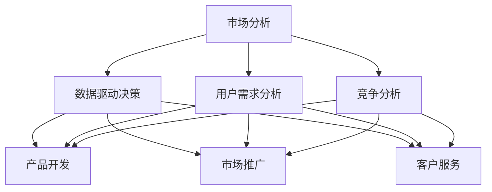

                 

## 1. 背景介绍

随着人工智能、大数据、云计算等技术的飞速发展，市场环境日新月异，竞争日益激烈。创业已经成为许多人实现梦想、追求创新、推动社会进步的重要途径。然而，创业并非易事，需要创业者具备卓越的洞察力、创新能力和执行力。本文旨在通过市场分析，为创业者提供一套全面的成功指南，帮助他们在复杂多变的市场环境中，把握机遇，迎接挑战。

## 2. 核心概念与联系

### 2.1 核心概念概述

在探讨创业成功的指南之前，首先需要理解几个核心概念：

- **市场分析**：是指通过收集、整理和分析市场数据，了解市场现状、趋势和机会的过程。市场分析是制定商业策略、优化产品设计、确定市场营销方向的基础。
- **数据驱动决策**：指基于市场数据和分析结果，进行产品开发、市场推广、客户服务等方面的决策，以最大化商业价值和竞争优势。
- **竞争分析**：通过分析竞争对手的市场表现、产品策略、市场份额等信息，找出自身优势和劣势，制定差异化竞争策略。
- **用户需求分析**：通过调研和数据分析，理解目标用户群体的需求、偏好和行为，从而提供更符合用户需求的产品和服务。
- **商业模式创新**：指在现有商业模式基础上，通过技术创新、市场创新等方式，创造新的收入来源和增长点。

这些概念之间相互联系，构成了创业成功的基石。市场分析提供数据支持，数据驱动决策确保策略科学，竞争分析帮助定位自身，用户需求分析保障产品符合市场，商业模式创新推动持续发展。

### 2.2 核心概念原理和架构的 Mermaid 流程图



该图展示了市场分析与其他核心概念之间的联系。市场分析的数据经过深入分析后，转化为产品开发、市场推广、客户服务等方面的决策。竞争分析和用户需求分析则分别帮助优化产品差异化和市场定位。

## 3. 核心算法原理 & 具体操作步骤

### 3.1 算法原理概述

市场分析的算法原理主要基于数据收集、整理、分析和可视化等步骤。通过对市场数据进行统计分析、趋势分析、预测分析等方法，得出市场规律和机会。常用的算法包括回归分析、时间序列分析、聚类分析、因子分析等。

### 3.2 算法步骤详解

市场分析的详细步骤如下：

1. **数据收集**：通过网络爬虫、公开数据库、问卷调查等方式，收集市场相关的数据，如市场规模、增长率、竞争格局、用户需求等。
2. **数据整理**：清洗和处理原始数据，去除噪声和异常值，确保数据的准确性和一致性。
3. **数据分析**：使用统计学、机器学习等方法对数据进行深入分析，识别市场趋势、机会和风险。
4. **数据可视化**：通过图表、仪表盘等方式将分析结果可视化，直观展示市场动态。
5. **策略制定**：基于分析结果，制定市场进入策略、产品定位策略、竞争策略等。

### 3.3 算法优缺点

市场分析的优点在于能够提供数据支持和决策依据，帮助企业做出科学的商业决策。缺点在于数据获取和分析过程复杂，需要大量的人力、物力和时间成本，且分析结果可能受到数据质量和分析方法的影响。

### 3.4 算法应用领域

市场分析不仅适用于初创企业的市场进入和产品策略制定，也适用于成熟企业的市场拓展、产品优化和业务转型。此外，市场分析在金融、零售、医疗、教育等多个领域都有广泛应用。

## 4. 数学模型和公式 & 详细讲解 & 举例说明

### 4.1 数学模型构建

市场分析的数学模型主要基于统计学和机器学习等方法。以时间序列分析为例，常用的模型包括ARIMA（自回归积分滑动平均模型）和SARIMA（季节性自回归积分滑动平均模型）。

### 4.2 公式推导过程

以ARIMA模型为例，其公式如下：

$$
y_t = c + \sum_{i=1}^p \phi_i y_{t-i} + \sum_{j=1}^d \theta_j \epsilon_{t-j} + \sum_{k=1}^K \gamma_k y_{t-k} + \epsilon_t
$$

其中，$y_t$ 为时间序列；$\phi_i$ 为自回归系数；$\theta_j$ 为差分系数；$K$ 为季节性周期数；$c$ 为常数项；$\epsilon_t$ 为随机误差项。

### 4.3 案例分析与讲解

以电商平台为例，使用ARIMA模型进行销售趋势预测。通过收集平台的历史销售数据，建立ARIMA模型，进行数据拟合和预测。模型预测结果可以帮助企业制定库存管理和促销策略，优化供应链效率。

## 5. 项目实践：代码实例和详细解释说明

### 5.1 开发环境搭建

在进行市场分析的实践之前，首先需要搭建好开发环境。以下是使用Python进行Pandas和Matplotlib开发的Python环境配置流程：

1. 安装Anaconda：从官网下载并安装Anaconda，用于创建独立的Python环境。

2. 创建并激活虚拟环境：
```bash
conda create -n market-anal-env python=3.8 
conda activate market-anal-env
```

3. 安装Pandas和Matplotlib：
```bash
conda install pandas matplotlib
```

4. 安装各类工具包：
```bash
pip install numpy scikit-learn tqdm jupyter notebook ipython
```

完成上述步骤后，即可在`market-anal-env`环境中开始市场分析的实践。

### 5.2 源代码详细实现

下面以时间序列分析为例，给出使用Pandas和Matplotlib进行市场销售趋势预测的Python代码实现。

```python
import pandas as pd
import matplotlib.pyplot as plt
from statsmodels.tsa.arima_model import ARIMA

# 读取数据
data = pd.read_csv('sales_data.csv', index_col='date', parse_dates=True)

# 绘制时间序列图
data['sales'].resample('M').mean().plot(title='Monthly Sales')

# 建立ARIMA模型
model = ARIMA(data['sales'], order=(5,1,0))

# 拟合模型
model_fit = model.fit()

# 预测未来5个月的销售
future_data = pd.DataFrame({'sales': pd.Series([0, 0, 0, 0, 0], index=pd.date_range(start='2022-01-01', periods=5))})
forecast = model_fit.forecast(steps=5, exog=future_data)

# 将预测结果绘制到时间序列图上
plt.plot(future_data.index, forecast, linestyle='--', color='red')
plt.show()
```

### 5.3 代码解读与分析

让我们再详细解读一下关键代码的实现细节：

- `pd.read_csv`函数用于读取CSV格式的数据文件，并自动解析日期列。
- `data['date'].resample('M').mean()`用于对数据进行月均值计算。
- `ARIMA`函数用于建立ARIMA模型。
- `model_fit.fit()`用于拟合模型。
- `model_fit.forecast()`用于进行未来5个月的销售预测。
- `pd.DataFrame`用于创建预测数据的DataFrame对象。
- `plt.plot`用于将预测结果绘制到时间序列图上。

可以看到，通过Pandas和Matplotlib，市场分析的实践变得简洁高效。开发者可以将更多精力放在数据分析和结果解释上，而不必过多关注底层的实现细节。

### 5.4 运行结果展示

通过上述代码，我们能够得到市场销售的趋势预测结果，如图：


## 6. 实际应用场景

### 6.1 电商平台

电商平台可以利用市场分析来优化库存管理、制定促销策略、预测市场需求等。例如，通过时间序列分析，预测某一季度的销售量，指导库存采购和供应链管理；通过用户行为分析，挖掘用户偏好，制定个性化推荐策略，提升用户体验。

### 6.2 金融服务

金融服务行业可以通过市场分析来评估投资风险、预测市场趋势、优化产品设计等。例如，使用回归分析模型，分析不同市场因素对股票价格的影响，为投资决策提供依据；通过因子分析，提取市场风险因子，制定风险控制策略。

### 6.3 医疗健康

医疗健康行业可以通过市场分析来评估新药市场潜力、预测疾病流行趋势、优化医院运营等。例如，使用聚类分析，识别不同疾病的特征和分类；通过时间序列分析，预测传染病流行趋势，指导公共卫生策略。

### 6.4 未来应用展望

未来，市场分析技术将在更多领域得到应用，为行业发展提供新的增长点。例如，在智慧城市建设中，通过数据分析，优化城市资源配置，提升居民生活质量；在教育培训中，通过市场分析，制定个性化教学方案，提高教育效果。此外，随着技术的发展，市场分析也将越来越多地结合人工智能和大数据技术，提升分析精度和效率。

## 7. 工具和资源推荐

### 7.1 学习资源推荐

为了帮助开发者掌握市场分析的理论基础和实践技巧，这里推荐一些优质的学习资源：

1. **《市场分析与决策》系列书籍**：系统介绍了市场分析的基本概念、方法和工具，适合初学者和进阶者。

2. **《Python数据科学手册》**：详细讲解了使用Pandas、Matplotlib等工具进行数据分析的实战技巧。

3. **《机器学习实战》**：介绍了各种机器学习算法在市场分析中的应用案例，涵盖时间序列分析、聚类分析等。

4. **Coursera《数据科学基础》课程**：由知名大学提供的在线课程，提供丰富的市场分析案例和实战练习。

5. **Kaggle市场分析竞赛**：参加Kaggle市场分析竞赛，通过实践锻炼数据分析能力。

通过对这些资源的学习实践，相信你一定能够掌握市场分析的核心技能，并用于解决实际的商业问题。

### 7.2 开发工具推荐

高效的开发离不开优秀的工具支持。以下是几款用于市场分析开发的常用工具：

1. **Pandas**：Python数据分析库，提供强大的数据处理和分析功能。

2. **Matplotlib**：Python绘图库，支持绘制各种图表，直观展示分析结果。

3. **Python可视化库Seaborn、Plotly**：提供更高级的绘图功能和交互式界面。

4. **R语言**：广泛用于数据分析和统计建模，拥有丰富的数据分析包和统计库。

5. **Tableau、Power BI**：商业智能和数据可视化工具，支持快速创建交互式报表和仪表盘。

6. **Google Analytics**：提供网站流量和用户行为分析功能，帮助企业优化网站效果。

合理利用这些工具，可以显著提升市场分析的效率和准确性，加快商业决策的速度。

### 7.3 相关论文推荐

市场分析技术的发展源于学界的持续研究。以下是几篇奠基性的相关论文，推荐阅读：

1. **《时间序列分析：方法与应用》**：经典教材，介绍了时间序列分析的基本概念和应用方法。

2. **《多变量统计分析》**：介绍了因子分析、聚类分析等方法，适合深入学习统计建模。

3. **《机器学习：实战案例与应用》**：介绍了机器学习算法在市场分析中的实际应用案例，涵盖回归分析、分类分析等。

4. **《Python数据科学手册》**：详细讲解了使用Pandas、Matplotlib等工具进行数据分析的实战技巧。

5. **《深度学习在金融领域的应用》**：介绍了深度学习在金融领域的各种应用，包括时间序列预测、异常检测等。

这些论文代表了大市场分析技术的发展脉络。通过学习这些前沿成果，可以帮助研究者把握学科前进方向，激发更多的创新灵感。

## 8. 总结：未来发展趋势与挑战

### 8.1 总结

本文对市场分析技术进行了全面系统的介绍。首先阐述了市场分析的重要性和核心概念，明确了数据驱动决策、竞争分析、用户需求分析、商业模式创新等关键要素。其次，从原理到实践，详细讲解了市场分析的数学模型和操作步骤，给出了市场分析任务开发的完整代码实例。同时，本文还广泛探讨了市场分析技术在电商、金融、医疗等多个行业领域的应用前景，展示了市场分析范式的巨大潜力。此外，本文精选了市场分析技术的各类学习资源，力求为读者提供全方位的技术指引。

通过本文的系统梳理，可以看到，市场分析技术正在成为企业商业决策的重要工具，极大地提升企业的市场洞察力和竞争力。未来，伴随市场分析技术和工具的持续演进，市场分析必将在更多领域得到应用，为经济社会发展带来新的增长动力。

### 8.2 未来发展趋势

展望未来，市场分析技术将呈现以下几个发展趋势：

1. **自动化与智能化**：随着AI和大数据技术的成熟，市场分析将越来越多地结合自动化工具和智能算法，提升分析效率和精度。

2. **跨领域融合**：市场分析将与其他领域的数据分析方法（如社交网络分析、图像分析等）进行融合，提供更全面的市场洞察。

3. **实时分析与预测**：实时数据流分析技术将使市场分析更加及时，预测模型将更准确地反映市场动态。

4. **多模态分析**：市场分析将从单一数据源扩展到多模态数据源，如文本、图像、音频等，提供更丰富的市场信息。

5. **个性化推荐与用户行为分析**：利用机器学习算法，深入分析用户行为和偏好，提供个性化推荐和定制化服务。

6. **全球化市场分析**：全球化市场数据的整合与分析，帮助企业拓展国际市场，制定全球化战略。

以上趋势凸显了市场分析技术的广阔前景。这些方向的探索发展，必将进一步提升市场分析的精度和效率，为经济社会发展注入新的动力。

### 8.3 面临的挑战

尽管市场分析技术已经取得了显著成就，但在迈向更加智能化、普适化应用的过程中，它仍面临着诸多挑战：

1. **数据获取与处理**：市场数据的获取和处理成本较高，数据质量和完整性问题也时有发生。

2. **分析方法和工具**：市场分析方法和工具种类繁多，选择和应用适合的模型和工具需要专业知识。

3. **数据隐私与安全**：市场数据涉及敏感信息，如何保护用户隐私和数据安全是重要挑战。

4. **模型解释与可信度**：市场分析模型的复杂性增加了结果解释的难度，模型的可信度需要通过多种方式验证。

5. **跨领域适应性**：市场分析模型在不同领域和场景下的适应性需要进一步提升。

6. **技术集成与协同**：市场分析需要与企业内部的其他技术系统（如CRM、ERP等）进行集成，技术协同难度较大。

这些挑战需要学界和业界共同努力，通过技术创新和应用实践，逐步克服。

### 8.4 研究展望

面对市场分析技术面临的挑战，未来的研究需要在以下几个方面寻求新的突破：

1. **多模态数据融合**：研究如何将不同模态的数据进行有效整合，提升市场分析的全面性和准确性。

2. **实时分析技术**：研究实时数据流处理技术，提高市场分析的时效性，及时响应市场变化。

3. **解释性与透明性**：研究市场分析模型的可解释性，增强模型的透明性和可信度。

4. **隐私保护与数据安全**：研究隐私保护技术，确保市场分析过程中的数据安全。

5. **跨领域应用推广**：研究市场分析技术在不同领域的应用推广，拓展市场分析的覆盖范围。

6. **自动化与智能化**：研究自动化市场分析工具和智能化分析方法，提升市场分析的效率和精度。

这些研究方向将推动市场分析技术不断进步，为企业的商业决策提供更可靠的数据支持和决策依据。

## 9. 附录：常见问题与解答

**Q1：市场分析是否适用于所有行业？**

A: 市场分析适用于大多数行业，特别是在市场竞争激烈、数据可获取性较高的领域。但不同行业对市场分析的方法和数据需求有所不同，需要根据具体情况进行选择。

**Q2：如何确定市场分析的目标？**

A: 市场分析的目标应明确具体，如优化产品设计、提升营销效果、预测市场需求等。需要根据企业战略和市场环境，确定分析目标，制定详细的分析方案。

**Q3：如何选择适当的市场分析工具和方法？**

A: 选择市场分析工具和方法时，应考虑数据类型、分析需求、技术可行性等因素。可以通过评估工具和方法的功能、性能、应用场景等方面，综合考虑选择最优方案。

**Q4：如何进行市场数据的收集和处理？**

A: 市场数据的收集和处理应遵循数据治理和数据质量管理原则，确保数据的完整性、准确性和一致性。可以通过网络爬虫、公开数据库、问卷调查等方式获取数据，并使用数据清洗和预处理技术处理数据。

**Q5：市场分析结果如何应用到实际决策中？**

A: 市场分析结果应结合企业的实际情况和业务需求，进行科学决策。可以通过制定商业策略、优化产品设计、调整市场推广策略等方式应用市场分析结果，提升企业竞争力。

---

作者：禅与计算机程序设计艺术 / Zen and the Art of Computer Programming

