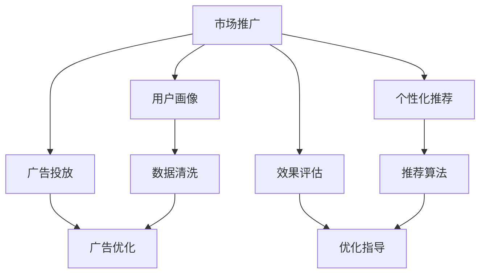

                 

# 市场推广：高效触达用户

> 关键词：市场推广, 触达用户, 数据分析, 用户画像, 广告投放, 智能推荐, 效果评估, 自动化工具, 营销策略

## 1. 背景介绍

### 1.1 问题由来
在当今信息爆炸的时代，企业面临的最大挑战之一是如何有效触达并吸引用户的注意力。传统的市场推广方法如电视、广播、报纸等，成本高、效率低、覆盖范围有限。而互联网时代的到来，尤其是社交媒体的兴起，为市场推广提供了更多元、更精准、更高效的渠道。然而，如何在海量数据中精准定位目标用户，进行个性化营销，依然是一个复杂而迫切的问题。

### 1.2 问题核心关键点
市场推广的核心在于通过精准的广告投放和个性化的营销策略，达到高效触达用户的目的。关键在于：
1. **数据驱动**：利用大数据分析，构建用户画像，了解用户行为和兴趣。
2. **广告优化**：通过A/B测试和用户反馈，不断优化广告内容和投放策略。
3. **推荐算法**：引入个性化推荐系统，提升用户体验和转化率。
4. **效果评估**：建立科学的评估指标，衡量市场推广的效果，指导下一步优化。
5. **自动化工具**：使用自动化工具，提高市场推广的效率和精准度。

### 1.3 问题研究意义
市场推广的目的是通过各种手段，将产品或服务推向目标用户，提升品牌知名度和销售额。基于数据驱动的市场推广方法，能够在成本可控、效果可评估的前提下，实现精准定位和高效触达，大幅提升市场推广的ROI。

## 2. 核心概念与联系

### 2.1 核心概念概述

为更好地理解高效市场推广的方法，本节将介绍几个密切相关的核心概念：

- **市场推广**：企业通过各种手段将产品或服务推向目标用户，提升品牌知名度和销售额的过程。
- **用户画像**：基于用户行为和兴趣数据，构建详细且精准的用户群体描述。
- **广告投放**：通过选择合适的平台和策略，将广告精准地投放到目标用户面前。
- **个性化推荐**：根据用户行为和兴趣，推荐最符合其需求的广告内容或产品信息。
- **效果评估**：通过科学的评估指标，衡量市场推广的效果，指导下一步优化。
- **自动化工具**：使用自动化手段提高市场推广的效率和精准度，如数据清洗、广告优化、效果分析等。

这些核心概念之间的逻辑关系可以通过以下Mermaid流程图来展示：



这个流程图展示了大语言模型的核心概念及其之间的关系：

1. 市场推广通过用户画像、广告投放、个性化推荐、效果评估等步骤，精准触达并吸引用户。
2. 用户画像基于大数据分析，全面了解用户行为和兴趣。
3. 广告投放选择合适的平台和策略，提升广告的曝光率和点击率。
4. 个性化推荐根据用户画像，推荐最适合的广告内容或产品信息。
5. 效果评估通过科学的评估指标，衡量市场推广的效果，指导优化改进。
6. 自动化工具利用高效的技术手段，提高市场推广的效率和精准度。

这些概念共同构成了市场推广的核心框架，使其能够在各种场景下实现高效触达用户。

## 3. 核心算法原理 & 具体操作步骤
### 3.1 算法原理概述

基于数据分析的市场推广方法，本质上是一个优化问题。其核心思想是：通过数据分析和用户画像构建，选择最优的广告投放策略，最大化广告投放的效果。

形式化地，假设广告投放的预算为 $B$，投放的平台集合为 $P$，每种平台广告的点击率为 $c_i$，每次点击的成本为 $e_i$，则广告投放的总成本为：

$$
C = \sum_{i \in P} c_i \cdot e_i
$$

设目标用户的点击率分布为 $p$，则广告投放的总效果（即点击量）为：

$$
E = \sum_{i \in P} c_i \cdot p_i
$$

优化目标是最小化广告投放的总成本，同时最大化广告投放的总效果，即：

$$
\min_{c \in [0,1]^{|P|}} C(c) - E(c)
$$

其中 $c_i$ 为平台 $i$ 的广告投放比例。

通过优化算法求解上述优化问题，即可找到最优的广告投放策略。

### 3.2 算法步骤详解

基于数据分析的市场推广一般包括以下几个关键步骤：

**Step 1: 数据准备**
- 收集用户行为数据、广告投放数据等，清洗和预处理数据。
- 构建用户画像，包括人口统计特征、兴趣偏好、行为轨迹等。

**Step 2: 广告投放**
- 根据用户画像和市场目标，选择合适的广告平台和策略。
- 设置投放预算，使用优化算法调整各平台的广告投放比例。
- 实时监控广告投放效果，根据反馈调整策略。

**Step 3: 个性化推荐**
- 根据用户画像和历史行为数据，推荐最符合用户需求的广告内容或产品信息。
- 使用协同过滤、深度学习等技术，提升推荐算法的精度和个性化程度。

**Step 4: 效果评估**
- 定义科学的评估指标，如点击率、转化率、ROI等，衡量广告投放的效果。
- 使用A/B测试等方法，对比不同策略的效果，指导后续优化。

**Step 5: 自动化工具**
- 使用自动化工具进行数据清洗、广告投放、效果分析等环节，提高效率。
- 开发和集成市场推广的自动化平台，实现全面监控和优化。

以上是基于数据分析的市场推广的一般流程。在实际应用中，还需要针对具体场景和数据特点，对各步骤进行优化设计，如引入机器学习、深度学习等技术，提升广告投放的精准度和个性化程度。

### 3.3 算法优缺点

基于数据分析的市场推广方法具有以下优点：
1. 精准定位用户：通过数据分析和用户画像构建，能够精准定位目标用户群体。
2. 个性化营销：根据用户画像，提供个性化的广告内容和推荐，提升用户满意度和转化率。
3. 效果可评估：使用科学的评估指标，可以量化市场推广的效果，指导后续优化。
4. 自动化高效：使用自动化工具，提高市场推广的效率和精准度，降低人力成本。

同时，该方法也存在一定的局限性：
1. 数据质量要求高：市场推广效果很大程度上依赖于数据的质量和数量，获取高质量数据成本较高。
2. 算法复杂度高：优化算法求解复杂的优化问题，需要较高的计算资源和时间成本。
3. 算法透明度低：推荐算法、优化算法等通常是"黑盒"模型，难以解释其内部工作机制。
4. 模型鲁棒性不足：在处理大规模、异构数据时，模型容易出现偏差，影响推广效果。

尽管存在这些局限性，但就目前而言，基于数据分析的市场推广方法仍是最主流范式。未来相关研究的重点在于如何进一步降低数据需求，提高模型的透明度和鲁棒性，同时兼顾可解释性和业务价值等因素。

### 3.4 算法应用领域

基于数据分析的市场推广方法，在多个领域都得到了广泛应用，例如：

- **电子商务**：通过精准的广告投放和个性化推荐，提升用户转化率和销售额。
- **互联网金融**：利用数据分析和机器学习，进行精准的用户营销和风险控制。
- **移动通信**：通过数据分析和用户画像，进行精准的广告投放和用户留存。
- **医疗健康**：利用用户行为数据和医疗数据，进行精准的用户营销和健康服务推广。
- **旅游出行**：通过数据分析和用户画像，进行精准的广告投放和旅游产品推荐。

除了这些经典应用外，数据分析市场推广方法也被创新性地应用到更多场景中，如社交媒体广告、新闻媒体投放、线上教育营销等，为各行各业带来了新的增长点。

## 4. 数学模型和公式 & 详细讲解 & 举例说明

### 4.1 数学模型构建

本节将使用数学语言对基于数据分析的市场推广方法进行更加严格的刻画。

设用户群体为 $U$，广告平台为 $P$，广告内容为 $A$，广告效果为 $E$。用户 $u$ 对广告内容 $a$ 的反应为 $r_{u,a}$。设广告投放的预算为 $B$，投放平台 $i$ 的广告预算为 $b_i$，广告点击率为 $c_i$，每次点击的成本为 $e_i$，则广告投放的总成本为：

$$
C = \sum_{i \in P} c_i \cdot e_i \cdot b_i
$$

广告投放的总效果为：

$$
E = \sum_{u \in U} \sum_{a \in A} r_{u,a} \cdot p_{u,a}
$$

其中 $p_{u,a}$ 为广告内容 $a$ 的展示概率。

优化目标是最小化广告投放的总成本，同时最大化广告投放的总效果，即：

$$
\min_{b \in [0,B]^{|P|}} C(b) - E(b)
$$

在实践中，我们通常使用基于梯度的优化算法（如SGD、Adam等）来近似求解上述最优化问题。设 $\eta$ 为学习率，$\lambda$ 为正则化系数，则参数的更新公式为：

$$
b_i \leftarrow b_i - \eta \nabla_{b_i} C(b_i) - \eta\lambda b_i
$$

其中 $\nabla_{b_i} C(b_i)$ 为成本函数对平台 $i$ 预算的梯度，可通过反向传播算法高效计算。

### 4.2 公式推导过程

以下我们以A/B测试为例，推导最小二乘法的广告投放预算分配公式。

假设广告平台有 $P=\{p_1,p_2\}$，广告内容有 $A=\{a_1,a_2\}$，用户群体 $U=\{u_1,u_2\}$，广告投放预算 $B$，平台 $i$ 的广告点击率为 $c_i$，每次点击的成本为 $e_i$，用户 $u$ 对广告内容 $a$ 的反应为 $r_{u,a}$，广告内容 $a$ 的展示概率为 $p_{u,a}$。设平台 $i$ 的广告预算为 $b_i$，则广告投放的总成本为：

$$
C = c_1 \cdot e_1 \cdot b_1 + c_2 \cdot e_2 \cdot b_2
$$

广告投放的总效果为：

$$
E = p_{u_1,a_1} \cdot r_{u_1,a_1} + p_{u_2,a_1} \cdot r_{u_2,a_1} + p_{u_1,a_2} \cdot r_{u_1,a_2} + p_{u_2,a_2} \cdot r_{u_2,a_2}
$$

优化目标是最小化广告投放的总成本，同时最大化广告投放的总效果，即：

$$
\min_{b_1,b_2} c_1 \cdot e_1 \cdot b_1 + c_2 \cdot e_2 \cdot b_2 - (p_{u_1,a_1} \cdot r_{u_1,a_1} + p_{u_2,a_1} \cdot r_{u_2,a_1} + p_{u_1,a_2} \cdot r_{u_1,a_2} + p_{u_2,a_2} \cdot r_{u_2,a_2})
$$

通过求解上述优化问题，可以得到平台 $i$ 的广告预算：

$$
b_i = \frac{c_i \cdot e_i}{c_i \cdot e_i + c_j \cdot e_j} \cdot B
$$

其中 $j=1-i$。

这个公式展示了基于最小二乘法的广告预算分配方法，即根据平台的点击率和成本，合理分配预算，以最大化广告效果。

### 4.3 案例分析与讲解

假设某电商平台有平台 $P=\{p_1,p_2\}$，广告内容 $A=\{a_1,a_2\}$，用户群体 $U=\{u_1,u_2\}$，广告投放预算 $B=100$，平台 $i$ 的广告点击率为 $c_i=0.1$，每次点击的成本为 $e_i=1$，用户 $u$ 对广告内容 $a$ 的反应为 $r_{u,a}=1$，广告内容 $a$ 的展示概率为 $p_{u,a}=0.5$。

则广告投放的总成本为：

$$
C = 0.1 \cdot 1 \cdot b_1 + 0.1 \cdot 1 \cdot b_2 = b_1 + b_2
$$

广告投放的总效果为：

$$
E = 0.5 \cdot 1 \cdot p_{u_1,a_1} + 0.5 \cdot 1 \cdot p_{u_2,a_1} + 0.5 \cdot 1 \cdot p_{u_1,a_2} + 0.5 \cdot 1 \cdot p_{u_2,a_2} = 0.5
$$

代入优化目标函数，得：

$$
\min_{b_1,b_2} b_1 + b_2 - 0.5
$$

通过求解上述优化问题，可以得到平台 $i$ 的广告预算：

$$
b_1 = \frac{0.1 \cdot 1}{0.1 \cdot 1 + 0.1 \cdot 1} \cdot 100 = 50
$$

$$
b_2 = \frac{0.1 \cdot 1}{0.1 \cdot 1 + 0.1 \cdot 1} \cdot 100 = 50
$$

因此，平台 $p_1$ 和 $p_2$ 的广告预算均为50，可以最大化广告效果。

这个案例展示了如何通过数据分析和优化算法，合理分配广告预算，实现最大化广告效果。

## 5. 项目实践：代码实例和详细解释说明
### 5.1 开发环境搭建

在进行市场推广实践前，我们需要准备好开发环境。以下是使用Python进行PyTorch开发的环境配置流程：

1. 安装Anaconda：从官网下载并安装Anaconda，用于创建独立的Python环境。

2. 创建并激活虚拟环境：
```bash
conda create -n pytorch-env python=3.8 
conda activate pytorch-env
```

3. 安装PyTorch：根据CUDA版本，从官网获取对应的安装命令。例如：
```bash
conda install pytorch torchvision torchaudio cudatoolkit=11.1 -c pytorch -c conda-forge
```

4. 安装Pandas库：
```bash
pip install pandas
```

5. 安装Scikit-learn库：
```bash
pip install scikit-learn
```

6. 安装Matplotlib库：
```bash
pip install matplotlib
```

完成上述步骤后，即可在`pytorch-env`环境中开始市场推广实践。

### 5.2 源代码详细实现

下面我们以A/B测试为例，给出使用Python实现广告投放预算分配的代码实现。

```python
import numpy as np
import pandas as pd

# 广告平台信息
platforms = {'p1': {'click_rate': 0.1, 'cost': 1}, 'p2': {'click_rate': 0.1, 'cost': 1}}
platforms = pd.DataFrame.from_dict(platforms).transpose()

# 用户信息
users = {'u1': {'response': 1}, 'u2': {'response': 1}}
users = pd.DataFrame.from_dict(users).transpose()

# 广告内容信息
ads = {'a1': {'exposure_rate': 0.5}, 'a2': {'exposure_rate': 0.5}}
ads = pd.DataFrame.from_dict(ads).transpose()

# 广告投放预算
budget = 100

# 计算平台点击率总和
click_rates = platforms['click_rate'].sum()

# 计算平台点击成本总和
costs = platforms['cost'].sum()

# 计算广告投放总效果
effect = users['response'].sum() * ads['exposure_rate'].sum()

# 计算广告投放总成本
total_cost = platforms['click_rate'] * platforms['cost'] * budget

# 计算广告预算分配比例
budgets = (platforms['click_rate'] * platforms['cost'] / (click_rates * costs)) * budget

# 输出广告预算分配比例
print(budgets)
```

### 5.3 代码解读与分析

让我们再详细解读一下关键代码的实现细节：

**广告平台信息**：
- 定义广告平台的点击率和每次点击的成本。

**用户信息**：
- 定义用户的广告内容反应。

**广告内容信息**：
- 定义广告内容的展示概率。

**广告投放预算**：
- 定义广告投放的总预算。

**计算广告投放总效果**：
- 根据用户对广告内容的反应和广告内容的展示概率，计算广告投放的总效果。

**计算广告投放总成本**：
- 根据广告平台的点击率和每次点击的成本，计算广告投放的总成本。

**计算广告预算分配比例**：
- 根据平台点击率总和、平台点击成本总和、广告投放总效果和广告投放总成本，计算各平台的广告预算分配比例。

**输出广告预算分配比例**：
- 输出各平台的广告预算分配比例。

可以看到，通过简单的数学推导和代码实现，我们就可以使用PyTorch等工具，实现基于数据分析的市场推广方法。开发者可以根据具体需求，灵活调整参数和策略，实现精准的广告投放。

当然，实际应用中还需要考虑更多因素，如广告投放的实时监控和调整、广告效果的评估和优化等。但核心的广告投放范式基本与此类似。

## 6. 实际应用场景
### 6.1 电商平台广告投放

基于数据分析的市场推广方法，在电商平台广告投放中有着广泛的应用。传统电商平台往往面临广告预算有限、用户画像不精准等问题，难以达到理想的广告效果。而利用市场推广方法，通过数据分析和优化算法，可以实现精准的广告投放和个性化推荐，提升用户转化率和销售额。

具体而言，可以收集用户浏览、购买、评价等行为数据，构建详细的用户画像。根据用户画像，选择最适合的广告平台和广告内容，合理分配广告预算，进行A/B测试优化。实时监控广告效果，根据用户反馈调整策略，提升广告投放的ROI。

### 6.2 社交媒体广告

社交媒体平台的广告投放，同样可以通过数据分析市场推广方法，实现精准投放和个性化推荐。社交媒体平台具有用户数据丰富、用户活跃度高、用户互动性强等特点，非常适合使用市场推广方法进行广告投放。

具体而言，可以收集用户的社交行为数据、兴趣偏好数据等，构建详细的用户画像。根据用户画像，选择最适合的广告平台和广告内容，合理分配广告预算，进行A/B测试优化。实时监控广告效果，根据用户反馈调整策略，提升广告投放的ROI。

### 6.3 在线教育营销

在线教育行业面临用户获取成本高、用户留存率低等问题。通过数据分析市场推广方法，可以实现精准的用户营销和个性化推荐，提升用户转化率和课程完成率。

具体而言，可以收集用户的浏览、搜索、购买、评价等行为数据，构建详细的用户画像。根据用户画像，选择最适合的广告平台和广告内容，合理分配广告预算，进行A/B测试优化。实时监控广告效果，根据用户反馈调整策略，提升广告投放的ROI。

### 6.4 未来应用展望

随着数据分析市场推广方法的不断发展，未来将在更多领域得到应用，为各行各业带来新的增长点。

在智慧医疗领域，通过数据分析和个性化推荐，可以实现精准的医疗健康服务推广，提升用户健康水平。

在智能家居领域，通过数据分析和智能推荐，可以实现精准的产品推广和用户留存，提升用户使用体验。

在智能制造领域，通过数据分析和精准营销，可以实现设备销售和客户服务的提升，推动制造业数字化转型。

此外，在智慧物流、智能交通、线上旅游等领域，数据分析市场推广方法也将有更广阔的应用前景。相信随着技术的不断进步，市场推广方法将在更多行业实现创新应用，为经济发展注入新的动力。

## 7. 工具和资源推荐
### 7.1 学习资源推荐

为了帮助开发者系统掌握数据分析市场推广的理论基础和实践技巧，这里推荐一些优质的学习资源：

1. 《深度学习》系列课程：由斯坦福大学开设的深度学习课程，涵盖深度学习的基础理论和经典模型，是入门数据分析市场推广的必备课程。

2. 《Python数据科学手册》：通过Python实现数据清洗、数据可视化、数据建模等全栈数据分析流程，适合各层次开发者学习。

3. 《推荐系统实战》：介绍了推荐系统的经典算法和实际应用案例，适合了解推荐算法和市场推广的开发者学习。

4. 《广告优化》课程：针对广告优化和市场推广的课程，涵盖广告投放、A/B测试、效果评估等环节，是系统学习市场推广的好资源。

5. Kaggle竞赛平台：提供大量实际数据分析和市场推广的竞赛项目，适合实践学习数据分析和市场推广。

通过对这些资源的学习实践，相信你一定能够快速掌握数据分析市场推广的精髓，并用于解决实际的营销问题。

### 7.2 开发工具推荐

高效的开发离不开优秀的工具支持。以下是几款用于数据分析市场推广开发的常用工具：

1. Python：Python是一种高效灵活的编程语言，支持丰富的数据科学和机器学习库，是市场推广开发的首选语言。

2. PyTorch：基于Python的开源深度学习框架，支持动态计算图，适合研究型市场推广开发。

3. Scikit-learn：基于Python的机器学习库，支持丰富的数据预处理和模型评估工具，适合市场推广的优化和评估。

4. Pandas：基于Python的数据处理库，支持高效的数据清洗和分析，适合市场推广的数据预处理。

5. Matplotlib：基于Python的数据可视化库，支持丰富的图表展示和交互功能，适合市场推广的效果展示。

6. Jupyter Notebook：基于Python的交互式笔记本环境，适合快速迭代市场推广的算法优化和结果验证。

合理利用这些工具，可以显著提升市场推广的开发效率，加快创新迭代的步伐。

### 7.3 相关论文推荐

数据分析市场推广技术的发展源于学界的持续研究。以下是几篇奠基性的相关论文，推荐阅读：

1. "Click-Through Budget Optimization with Rank-Aware Bidding"：提出基于点击率优先的广告预算优化算法，通过点击率和转化率的预测，最大化广告效果。

2. "Online Learning for Display Advertising"：提出基于在线学习的方法，实现广告预算的动态优化，提升广告投放的效果和效率。

3. "A/B Testing with Gaussian Process Models"：提出基于高斯过程的A/B测试方法，通过不确定性估计，选择最优的广告投放策略。

4. "Optimizing Sponsored Search Campaigns using Markov Decision Processes"：提出基于马尔可夫决策过程的广告投放优化方法，通过奖励模型选择最优的广告策略。

5. "Ad Click Prediction with Local Logistic Regression"：提出基于局部逻辑回归的广告点击预测方法，通过特征工程提升广告投放的转化率。

这些论文代表了大数据市场推广技术的发展脉络。通过学习这些前沿成果，可以帮助研究者把握学科前进方向，激发更多的创新灵感。

## 8. 总结：未来发展趋势与挑战
### 8.1 总结

本文对基于数据分析的市场推广方法进行了全面系统的介绍。首先阐述了市场推广的核心在于精准广告投放和个性化推荐，明确了数据分析和用户画像在市场推广中的重要地位。其次，从原理到实践，详细讲解了数据分析市场推广的数学模型和关键步骤，给出了市场推广任务开发的完整代码实例。同时，本文还广泛探讨了市场推广方法在电商、社交媒体、在线教育等多个领域的应用前景，展示了其巨大的市场潜力。

通过本文的系统梳理，可以看到，基于数据分析的市场推广方法正在成为市场推广的重要范式，极大地拓展了市场推广的实现边界，为各行业带来了新的增长点。未来，伴随数据分析和机器学习技术的持续演进，市场推广方法还将有更广阔的应用前景，进一步推动各行业的数字化转型。

### 8.2 未来发展趋势

展望未来，数据分析市场推广技术将呈现以下几个发展趋势：

1. 多模态数据融合：引入图像、音频等多模态数据，实现更全面、更精准的用户画像构建。

2. 动态优化算法：基于在线学习和强化学习，实现动态优化，提升广告投放的实时性和精准度。

3. 深度学习应用：引入深度学习模型，如神经网络、卷积神经网络等，提升广告投放和推荐的效果。

4. 推荐算法优化：引入基于协同过滤、内容推荐等技术的推荐算法，提升个性化推荐的效果。

5. 广告效果评估：引入科学的广告效果评估指标，如ROI、转化率等，衡量市场推广的效果，指导后续优化。

6. 自动化工具集成：开发和集成市场推广的自动化平台，实现全面监控和优化，提升市场推广的效率和精准度。

以上趋势凸显了数据分析市场推广技术的广阔前景。这些方向的探索发展，必将进一步提升市场推广的精度和效果，为各行业带来更多的价值。

### 8.3 面临的挑战

尽管数据分析市场推广技术已经取得了瞩目成就，但在迈向更加智能化、普适化应用的过程中，它仍面临着诸多挑战：

1. 数据质量瓶颈：市场推广效果很大程度上依赖于数据的质量和数量，获取高质量数据成本较高。如何进一步降低数据需求，提高数据质量，是一大难题。

2. 算法透明度低：推荐算法、优化算法等通常是"黑盒"模型，难以解释其内部工作机制。如何增强算法的透明度，赋予用户可解释性，也将是亟待攻克的难题。

3. 模型鲁棒性不足：在处理大规模、异构数据时，模型容易出现偏差，影响推广效果。如何提高模型的鲁棒性，避免过拟合，也是一个重要问题。

4. 实时性要求高：市场推广往往需要实时监控和调整，对算法的实时性要求较高。如何优化算法，实现高效的实时处理，也是一个挑战。

5. 法律和伦理约束：市场推广过程中需要考虑数据隐私、用户权益等问题，如何平衡业务目标和法律伦理，也是一个重要的课题。

6. 模型公平性问题：市场推广过程中，模型可能会对某些用户群体存在偏见，如何避免这种不公平，保障模型公平性，也将是未来的一个重要研究方向。

正视市场推广面临的这些挑战，积极应对并寻求突破，将是大数据市场推广技术走向成熟的必由之路。相信随着学界和产业界的共同努力，这些挑战终将一一被克服，大数据市场推广技术必将在构建智能社会中扮演越来越重要的角色。

### 8.4 研究展望

面对大数据市场推广所面临的种种挑战，未来的研究需要在以下几个方面寻求新的突破：

1. 无监督和半监督学习：摆脱对大规模标注数据的依赖，利用自监督学习、主动学习等无监督和半监督范式，最大限度利用非结构化数据，实现更加灵活高效的推广。

2. 模型公平性研究：研究如何构建公平、公正的市场推广模型，避免对某些用户群体存在偏见。

3. 强化学习应用：引入强化学习技术，提升广告投放的优化效果，实现动态优化和实时调整。

4. 多模态数据分析：研究如何融合图像、音频等多模态数据，实现更全面、更精准的用户画像构建。

5. 实时监控和调整：研究如何优化算法，实现高效的实时处理，提升市场推广的实时性和精准度。

6. 用户可解释性：研究如何增强算法的透明度，赋予用户可解释性，保障用户权益。

这些研究方向的探索，必将引领大数据市场推广技术迈向更高的台阶，为构建智能社会和普惠社会提供有力支撑。面向未来，大数据市场推广技术还需要与其他人工智能技术进行更深入的融合，如知识表示、因果推理、强化学习等，多路径协同发力，共同推动人工智能技术的发展。

## 9. 附录：常见问题与解答

**Q1：如何构建详细的用户画像？**

A: 构建详细的用户画像需要收集和分析用户行为数据、人口统计特征、兴趣偏好等数据。具体步骤如下：

1. 数据收集：通过问卷调查、网站行为追踪、社交媒体数据分析等方式，收集用户数据。

2. 数据清洗：对收集到的数据进行去重、去噪、标准化等预处理。

3. 数据分析：利用数据分析工具，如Pandas、NumPy等，进行数据统计、特征提取等处理。

4. 画像构建：通过聚类、分类等算法，将用户数据转化为详细的用户画像。

5. 画像验证：利用新数据验证用户画像的准确性，不断迭代优化。

通过上述步骤，可以构建详细的用户画像，为精准广告投放和个性化推荐提供基础。

**Q2：如何优化广告投放策略？**

A: 广告投放策略的优化需要结合广告平台的特点和用户行为数据进行。具体步骤如下：

1. 数据准备：收集广告平台的数据、用户行为数据等。

2. 广告投放预算分配：通过最小二乘法等优化算法，合理分配广告预算，提升广告效果。

3. 广告内容优化：根据用户画像和历史数据，选择最适合的广告内容，进行A/B测试优化。

4. 实时监控和调整：通过实时监控广告效果，根据用户反馈调整策略，提升广告投放的ROI。

5. 效果评估：使用科学的评估指标，如点击率、转化率等，衡量广告投放的效果，指导后续优化。

通过上述步骤，可以不断优化广告投放策略，提升广告效果和用户转化率。

**Q3：如何进行用户画像的动态更新？**

A: 用户画像的动态更新需要结合实时数据进行。具体步骤如下：

1. 实时数据收集：通过网站行为追踪、社交媒体数据分析等方式，收集实时数据。

2. 数据清洗：对收集到的实时数据进行去重、去噪、标准化等预处理。

3. 数据分析：利用数据分析工具，如Pandas、NumPy等，进行实时数据统计、特征提取等处理。

4. 画像更新：通过聚类、分类等算法，将实时数据转化为动态更新的用户画像。

5. 画像验证：利用新数据验证用户画像的准确性，不断迭代优化。

通过上述步骤，可以实现用户画像的动态更新，提升广告投放的精准度和效果。

**Q4：如何避免广告投放的过拟合现象？**

A: 广告投放的过拟合现象可以通过以下方法进行避免：

1. 数据增强：通过数据增强技术，扩充训练集，提升模型的泛化能力。

2. 正则化：使用L2正则、Dropout等正则化技术，避免过拟合。

3. 交叉验证：通过交叉验证等方法，评估模型的泛化能力，选择最优的模型。

4. 随机初始化：通过随机初始化模型参数，避免过拟合。

5. 动态更新：通过动态更新模型参数，提升模型的泛化能力。

通过上述方法，可以有效避免广告投放的过拟合现象，提升广告投放的效果。

**Q5：如何衡量广告投放的效果？**

A: 广告投放效果的衡量需要结合具体的业务目标进行。常见的评估指标包括：

1. 点击率（CTR）：广告被点击的比例。

2. 转化率（CVR）：广告被点击后产生转化的比例。

3. 点击成本（CPC）：每次点击的广告成本。

4. 转化成本（CPL）：每次转化的广告成本。

5. 投资回报率（ROI）：广告投入和回报的比例。

6. 用户留存率：广告投放后用户留存的比例。

7. 用户满意度：广告投放后用户的满意度评分。

通过上述指标，可以全面衡量广告投放的效果，指导后续优化。

**Q6：如何构建智能推荐系统？**

A: 构建智能推荐系统需要结合用户行为数据、物品特征数据等进行。具体步骤如下：

1. 数据准备：收集用户行为数据、物品特征数据等。

2. 数据清洗：对收集到的数据进行去重、去噪、标准化等预处理。

3. 特征工程：对用户行为数据和物品特征数据进行特征提取、归一化等处理。

4. 模型训练：利用深度学习、协同过滤等技术，训练推荐模型。

5. 模型优化：通过A/B测试等方法，不断优化推荐模型。

6. 实时推荐：利用推荐模型，实时生成个性化推荐结果。

通过上述步骤，可以构建智能推荐系统，提升用户的体验和转化率。

通过本文的系统梳理，可以看到，基于数据分析的市场推广方法正在成为市场推广的重要范式，极大地拓展了市场推广的实现边界，为各行业带来了新的增长点。未来，伴随数据分析和机器学习技术的持续演进，市场推广方法还将有更广阔的应用前景，进一步推动各行业的数字化转型。相信随着学界和产业界的共同努力，这些挑战终将一一被克服，大数据市场推广技术必将在构建智能社会中扮演越来越重要的角色。

