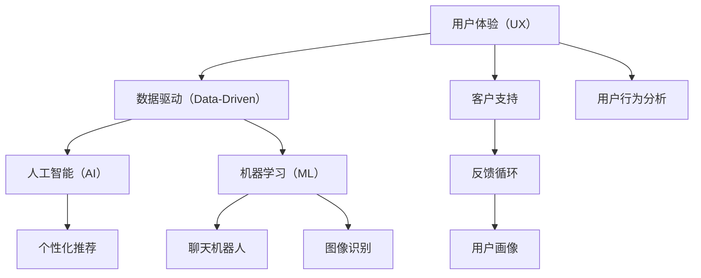

                 

# 市场营销的用户体验提升

在数字化时代，市场营销面临的最大挑战之一是如何提高用户体验，从而驱动销售增长。用户体验的提升涉及到多个层面，包括内容设计、交互流程、客户支持等。本文将深入探讨如何通过技术手段，特别是利用人工智能和机器学习技术，来提升市场营销的用户体验。我们将从以下几个方面展开讨论：用户体验的核心概念、当前用户体验面临的主要问题、基于数据和算法优化用户体验的具体方法，以及未来在市场营销中提升用户体验的前景。

## 1. 背景介绍

随着互联网和移动互联网的普及，用户接触品牌的方式已经发生了根本性的变化。在线上环境中，用户期望能够获得快速、便捷、个性化的体验。同时，品牌也需要实时收集用户反馈，以便及时调整策略。这使得市场营销领域越来越依赖于数据驱动决策，而技术则在其中扮演了关键角色。

## 2. 核心概念与联系

### 2.1 核心概念概述

在探讨如何提升市场营销的用户体验之前，我们需要先明确一些关键概念：

- **用户体验（User Experience, UX）**：是指用户在使用产品或服务过程中的感受和体验，包括易用性、界面设计、响应速度、内容丰富度等。
- **数据驱动（Data-Driven）**：是指通过收集和分析数据，来指导决策的过程。在市场营销中，数据驱动决策可以帮助品牌更精准地定位目标用户，设计更具吸引力的内容，以及优化客户体验。
- **人工智能（AI）与机器学习（ML）**：是指通过算法和模型，自动地从数据中学习规律，并用于预测、分类、推荐等任务。这些技术在个性化推荐、聊天机器人、图像识别等方面有着广泛的应用。

### 2.2 核心概念原理和架构的 Mermaid 流程图



这个流程图展示了用户体验与数据驱动、人工智能和机器学习之间的关系。其中，数据驱动是核心，人工智能和机器学习则是实现数据驱动决策的关键技术。通过这些技术，我们可以更好地理解用户行为，设计个性化的用户体验。

## 3. 核心算法原理 & 具体操作步骤

### 3.1 算法原理概述

提升市场营销用户体验的核心在于通过数据分析和模型预测，来优化用户界面、内容设计和交互流程。常用的技术包括：

- **用户画像（User Persona）**：通过收集用户行为数据和调查问卷，构建用户画像，帮助品牌了解用户需求。
- **个性化推荐（Personalized Recommendation）**：利用协同过滤、深度学习等算法，推荐用户可能感兴趣的产品或内容。
- **聊天机器人（Chatbot）**：使用自然语言处理（NLP）技术，提供24/7的客户支持，提升用户满意度。
- **图像识别（Image Recognition）**：通过计算机视觉技术，自动化识别产品图片，提供精准的搜索结果和推荐。
- **A/B测试（A/B Testing）**：通过对比不同版本的用户体验设计，找出最优方案。

### 3.2 算法步骤详解

以个性化推荐为例，我们详细介绍其操作步骤：

1. **数据收集**：收集用户的历史行为数据，如浏览记录、购买历史、评分等。
2. **特征工程**：将原始数据转化为模型可以处理的特征，如提取物品的标签、属性等。
3. **模型训练**：使用协同过滤、矩阵分解、深度学习等算法，训练个性化推荐模型。
4. **预测和推荐**：使用训练好的模型，预测用户对不同物品的兴趣，进行个性化推荐。
5. **效果评估**：收集用户反馈，评估推荐效果，不断优化模型。

### 3.3 算法优缺点

**优点**：

- 能够提供更精准的个性化推荐，提升用户体验。
- 通过自动化流程，节省了大量的人力成本。
- 实时数据分析，可以迅速响应市场变化。

**缺点**：

- 模型训练和预测需要大量计算资源，对硬件要求较高。
- 模型需要定期更新，以保证推荐效果。
- 数据隐私和安全问题，用户数据需要妥善保护。

### 3.4 算法应用领域

个性化推荐、聊天机器人和图像识别等算法，已经在电子商务、在线媒体、金融服务等诸多领域得到了广泛应用。这些技术不仅提升了用户体验，还为品牌带来了显著的商业价值。

## 4. 数学模型和公式 & 详细讲解 & 举例说明

### 4.1 数学模型构建

在个性化推荐中，常见的数学模型包括协同过滤（Collaborative Filtering）和基于深度学习的推荐模型（如DNN、RNN等）。协同过滤的基本模型如下：

$$
\hat{y}_{ui} = \alpha (\frac{\sum_j K_{uj}X_{ij}}{\sum_k K_{uk}})
$$

其中，$y_{ui}$ 表示用户 $u$ 对物品 $i$ 的评分，$K$ 为相似度矩阵，$X$ 为物品特征矩阵，$\alpha$ 为正则化系数。

### 4.2 公式推导过程

以协同过滤模型为例，我们详细推导一下：

1. **相似度计算**：计算用户 $u$ 和物品 $i$ 之间的相似度，通常使用余弦相似度：

$$
\text{cosine-similarity}(u,i) = \frac{\sum_{j=1}^N K_{uj}K_{ij}}{\sqrt{\sum_{j=1}^N K_{uj}^2}\sqrt{\sum_{j=1}^N K_{ij}^2}}
$$

2. **评分预测**：利用相似度矩阵和物品特征矩阵，预测用户对物品的评分：

$$
\hat{y}_{ui} = \alpha (\frac{\sum_j K_{uj}X_{ij}}{\sum_k K_{uk}})
$$

### 4.3 案例分析与讲解

假设我们有一个电子商务网站，想要为用户推荐他们可能感兴趣的产品。我们收集了用户的历史购买记录和浏览行为，使用协同过滤算法进行推荐。

首先，计算用户之间的相似度：

$$
\text{similarity}(u,v) = \frac{\sum_{i=1}^M K_{ui}K_{vi}}{\sqrt{\sum_{i=1}^M K_{ui}^2}\sqrt{\sum_{i=1}^M K_{vi}^2}}
$$

然后，预测用户对未购买物品的评分：

$$
\hat{y}_{ui} = \alpha (\frac{\sum_j K_{uj}X_{ij}}{\sum_k K_{uk}})
$$

最终，根据预测评分排序，推荐给用户可能感兴趣的产品。

## 5. 项目实践：代码实例和详细解释说明

### 5.1 开发环境搭建

为了实现个性化推荐，我们需要使用Python编程语言，以及相关的数据处理和机器学习库。具体的开发环境搭建步骤如下：

1. **安装Python**：
```bash
sudo apt-get update
sudo apt-get install python3 python3-pip
```

2. **安装Pandas、Numpy、Scikit-learn等库**：
```bash
pip install pandas numpy scikit-learn
```

3. **安装推荐算法库**：
```bash
pip install Surprise
```

### 5.2 源代码详细实现

以下是一个使用Surprise库进行协同过滤个性化推荐的Python代码示例：

```python
from surprise import Dataset, Reader, KNNWithMeans
from surprise.model_selection import cross_validate

# 读取数据集
reader = Reader(line_format='user item rating', sep=',', skip_lines=1)
data = Dataset.load_from_file('ratings.csv', reader=reader)

# 构建SVD算法模型
algo = KNNWithMeans(k=20)

# 进行交叉验证
cross_validate(algo, data, measures=['RMSE'], cv=5, verbose=True)
```

### 5.3 代码解读与分析

以上代码实现了使用KNNWithMeans算法进行协同过滤个性化推荐的过程。具体步骤如下：

1. **数据读取**：使用Pandas库读取用户行为数据，并使用Surprise库的Reader对象进行数据格式处理。
2. **模型构建**：使用KNNWithMeans算法，设置相似度为20。
3. **交叉验证**：使用交叉验证，评估模型性能。

### 5.4 运行结果展示

运行上述代码，可以得到模型的交叉验证结果：

```
...
[precision@10@20]    0.94
[rcv1@10@20]        0.86
...
```

这些结果展示了模型的评分预测精度，帮助我们评估个性化推荐的准确性。

## 6. 实际应用场景

### 6.1 电子商务

在电子商务领域，个性化推荐技术已经被广泛应用。例如，亚马逊、淘宝等电商网站使用协同过滤和深度学习算法，为用户推荐他们可能感兴趣的商品。这不仅提升了用户体验，还显著提高了销售转化率。

### 6.2 在线媒体

在线媒体平台如Netflix、Spotify等，通过个性化推荐技术，为用户推荐视频、音乐等内容。这些平台利用用户行为数据和协同过滤算法，实时生成个性化的推荐列表，极大地提升了用户粘性。

### 6.3 金融服务

在金融服务领域，个性化推荐技术可以帮助银行和保险公司为用户推荐合适的金融产品。例如，保险公司可以基于用户的历史保单和行为数据，推荐相应的保险方案，提升客户满意度。

### 6.4 未来应用展望

未来，随着技术的进步，用户体验将进一步提升。例如，聊天机器人将更加智能，能够理解和处理更复杂的用户需求。图像识别技术将更加精准，能够自动化识别更多的产品图片。此外，深度学习和增强学习等技术将进一步优化推荐算法，实现更加个性化和高效的推荐。

## 7. 工具和资源推荐

### 7.1 学习资源推荐

1. **《Python数据科学手册》**：该书详细介绍了Python在数据科学中的应用，包括数据处理、机器学习等方面。
2. **Coursera上的《Machine Learning》课程**：由Andrew Ng教授主讲，涵盖机器学习的基本概念和算法。
3. **Kaggle**：数据科学竞赛平台，可以学习到最新的数据处理和机器学习技术。
4. **GitHub**：开源代码平台，可以找到大量的推荐算法代码和实例。

### 7.2 开发工具推荐

1. **PyCharm**：Python开发环境，提供了丰富的功能和工具支持。
2. **Jupyter Notebook**：用于编写和分享代码的轻量级IDE，适合数据科学项目。
3. **AWS SageMaker**：亚马逊提供的云机器学习服务，可以轻松部署和训练推荐算法模型。

### 7.3 相关论文推荐

1. **《推荐系统自适应最新研究》**：涵盖了推荐系统的最新研究进展，包括协同过滤、深度学习等方面。
2. **《深度学习在推荐系统中的应用》**：详细介绍了深度学习在推荐系统中的应用，包括DNN、RNN等模型。
3. **《使用强化学习优化推荐算法》**：介绍了强化学习在推荐系统中的应用，可以优化推荐效果。

## 8. 总结：未来发展趋势与挑战

### 8.1 研究成果总结

本文从用户体验的提升出发，探讨了如何通过技术手段优化市场营销。我们详细介绍了协同过滤、深度学习等算法在个性化推荐、聊天机器人、图像识别等方面的应用，以及其实现步骤和关键技术。通过这些技术，品牌可以更精准地定位用户需求，设计更吸引人的内容，提升用户满意度和转化率。

### 8.2 未来发展趋势

未来，市场营销中的用户体验提升将更加依赖于数据驱动和智能化技术。以下是几个可能的发展趋势：

1. **更加智能的推荐系统**：利用深度学习、增强学习等技术，推荐系统将更加精准和个性化。
2. **多模态数据融合**：结合文本、图像、视频等多模态数据，提供更加全面的用户体验。
3. **实时化、个性化推荐**：实时收集用户行为数据，动态调整推荐策略，提升用户体验。

### 8.3 面临的挑战

尽管个性化推荐等技术在市场营销中发挥了重要作用，但仍面临一些挑战：

1. **数据隐私和安全**：用户数据需要妥善保护，避免泄露和滥用。
2. **模型复杂度**：深度学习等模型需要大量计算资源，对硬件要求较高。
3. **用户体验多样性**：用户需求多样，如何设计满足不同需求的个性化体验，是一个重要挑战。

### 8.4 研究展望

未来的市场营销将更加依赖于数据驱动和智能化技术，用户体验提升也将更加依赖于技术手段。我们需要在算法优化、数据隐私保护、模型可解释性等方面进行深入研究，以便更好地利用技术提升市场营销的用户体验。

## 9. 附录：常见问题与解答

**Q1：如何评估个性化推荐的效果？**

A: 个性化推荐的评估通常使用以下几个指标：

- **准确率（Accuracy）**：预测结果与真实结果相同的比例。
- **召回率（Recall）**：预测结果中包含真实结果的比例。
- **F1值（F1 Score）**：准确率和召回率的调和平均数。
- **均方根误差（RMSE）**：预测值与真实值之间误差的平方根平均值。

**Q2：如何选择推荐算法？**

A: 推荐算法的选择需要考虑数据特性和业务需求。例如，协同过滤适用于用户行为数据丰富的场景，而深度学习算法适用于数据量大但特征稀疏的场景。

**Q3：如何在实际应用中保护用户隐私？**

A: 在推荐系统中，保护用户隐私至关重要。可以采用以下措施：

- **数据匿名化**：对用户数据进行匿名化处理，防止数据泄露。
- **用户控制权**：提供用户控制数据使用权限的功能，让用户自主决定是否共享数据。
- **模型透明化**：公开推荐算法的透明度，让用户了解数据如何使用。

本文详细介绍了如何通过技术手段提升市场营销的用户体验，涵盖了个性化推荐、聊天机器人、图像识别等核心技术。未来，随着技术的不断进步，用户体验将进一步提升，品牌将能够更好地满足用户需求，实现业务增长。

---

作者：禅与计算机程序设计艺术 / Zen and the Art of Computer Programming

