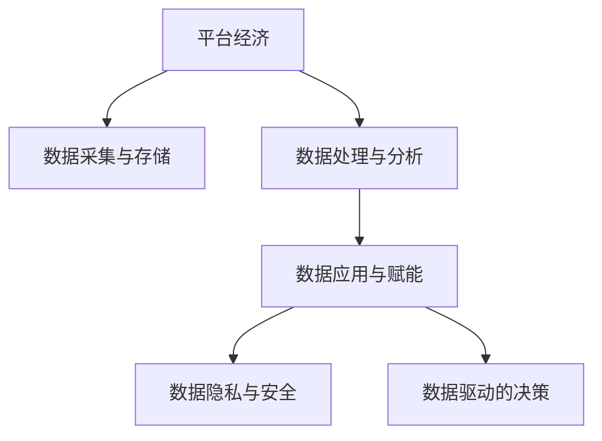

                 

# 平台经济的数据赋能：如何利用数据赋能用户和企业？

## 1. 背景介绍

### 1.1 问题由来

随着互联网和移动互联网的快速发展，平台经济作为一种新型的经济形态，在全球范围内蓬勃兴起。平台经济通过构建在线交易和服务的生态系统，实现了消费者与商家、商品与服务、资本与技术等要素的高效匹配和资源配置。在平台经济中，数据作为核心的战略资源，扮演着至关重要的角色。如何利用数据赋能用户和企业，最大化平台价值，成为当前平台经济研究的热点问题。

平台经济中，数据赋能用户和企业的方式多种多样，从个性化推荐到精准营销，从风险控制到决策支持，数据在推动平台经济向更高质量、更高效率、更广泛覆盖的方向发展中扮演着不可替代的角色。然而，随着数据量的不断增长，数据管理、数据安全、数据隐私等问题也日益凸显，成为制约平台经济发展的瓶颈。因此，如何在保障数据安全的基础上，实现数据的高效利用和赋能，成为平台经济研究的重要方向。

### 1.2 问题核心关键点

平台经济的数据赋能，主要包括以下几个关键点：

- 数据采集与存储：通过多种方式收集用户和企业数据，并进行高效存储和管理。
- 数据处理与分析：对原始数据进行清洗、转换、集成和分析，提取有价值的信息。
- 数据应用与赋能：将分析结果应用到推荐系统、营销策略、风控模型等实际场景中，实现对用户和企业的赋能。
- 数据隐私与安全：在数据采集、存储、处理和应用过程中，确保数据隐私和安全性。
- 数据驱动的决策：利用数据驱动的决策支持系统，提升平台运营效率和用户满意度。

这些关键点共同构成了平台经济的数据赋能体系，使其能够通过数据的力量，不断优化平台生态，创造更多商业价值。

## 2. 核心概念与联系

### 2.1 核心概念概述

为更好地理解平台经济的数据赋能，本节将介绍几个密切相关的核心概念：

- 平台经济(Platform Economy)：指基于互联网技术，构建线上交易和服务生态，实现多方主体价值创造的经济形态。典型平台包括电商平台、社交平台、共享经济平台等。
- 数据采集与存储：指通过传感器、网页爬虫、API接口等手段，从用户和企业获取数据，并进行高效存储和管理的过程。
- 数据处理与分析：指对原始数据进行清洗、转换、集成和分析，提取有价值的信息的过程。常见处理方式包括数据清洗、特征工程、数据挖掘等。
- 数据应用与赋能：指将分析结果应用到实际场景中，如推荐系统、精准营销、风险控制等，实现对用户和企业的赋能的过程。
- 数据隐私与安全：指在数据采集、存储、处理和应用过程中，确保数据隐私和安全性，避免数据滥用和泄露。
- 数据驱动的决策：指利用数据驱动的决策支持系统，提升平台运营效率和用户满意度，优化平台运营策略的过程。

这些核心概念之间的逻辑关系可以通过以下Mermaid流程图来展示：



这个流程图展示了大语言模型的核心概念及其之间的关系：

1. 平台经济通过数据采集与存储，获得原始数据。
2. 对原始数据进行清洗、转换、集成和分析，提取有价值的信息。
3. 将分析结果应用到推荐系统、营销策略、风控模型等实际场景中，实现对用户和企业的赋能。
4. 在数据应用过程中，确保数据隐私和安全性。
5. 利用数据驱动的决策支持系统，提升平台运营效率和用户满意度。

这些概念共同构成了平台经济的数据赋能框架，使其能够通过数据的力量，不断优化平台生态，创造更多商业价值。

## 3. 核心算法原理 & 具体操作步骤
### 3.1 算法原理概述

平台经济的数据赋能，本质上是一个数据驱动的决策过程。其核心思想是：通过数据采集与存储、数据处理与分析、数据应用与赋能，实现对用户和企业的精准赋能，优化平台运营策略，提升平台价值。

形式化地，假设平台经济系统为 $S$，数据集为 $D=\{(x_i,y_i)\}_{i=1}^N$，其中 $x_i$ 为原始数据，$y_i$ 为与数据相关的业务指标（如推荐结果、用户满意度等）。数据赋能的目标是找到最优的数据处理函数 $f$，使得：

$$
f^* = \mathop{\arg\min}_{f} \mathcal{L}(S,D)
$$

其中 $\mathcal{L}$ 为针对平台经济系统的损失函数，用于衡量数据赋能效果与实际业务指标之间的差异。常见的损失函数包括均方误差、交叉熵等。

通过梯度下降等优化算法，数据赋能过程不断更新数据处理函数 $f$，最小化损失函数 $\mathcal{L}$，使得数据赋能效果逼近理想目标。由于 $f$ 已经通过预训练获得了较好的初始化，因此即便在少量标注数据的情况下，也能较快收敛到理想的数据处理函数 $f^*$。

### 3.2 算法步骤详解

平台经济的数据赋能一般包括以下几个关键步骤：

**Step 1: 数据采集与存储**
- 选择合适的数据源，通过传感器、网页爬虫、API接口等手段，从用户和企业获取数据。
- 选择合适的数据格式，如CSV、JSON、SQL等，进行高效存储和管理。
- 对数据进行初步清洗和预处理，去除噪声和异常值，确保数据质量。

**Step 2: 数据处理与分析**
- 对清洗后的数据进行特征工程，提取和构建有意义的特征。
- 选择合适的机器学习或深度学习算法，对数据进行建模和预测。
- 对模型进行调参和验证，确保模型准确性和泛化能力。

**Step 3: 数据应用与赋能**
- 将模型应用到实际业务场景中，如推荐系统、精准营销、风控模型等。
- 实时监控模型性能，根据反馈进行模型迭代和优化。
- 对用户和企业的行为进行分析，提取有价值的信息，提供决策支持。

**Step 4: 数据隐私与安全**
- 对用户和企业数据进行匿名化处理，避免数据泄露和滥用。
- 采用数据加密、访问控制等技术，确保数据存储和传输的安全性。
- 定期进行安全审计和漏洞检测，防范潜在的安全风险。

**Step 5: 数据驱动的决策**
- 利用数据驱动的决策支持系统，提升平台运营效率和用户满意度。
- 实时监控平台运营指标，及时调整策略和优化流程。
- 利用数据挖掘和预测分析，优化资源配置和用户服务。

以上是平台经济的数据赋能的一般流程。在实际应用中，还需要针对具体业务场景，对数据赋能过程的各个环节进行优化设计，如改进数据采集方式，引入更多的算法模型，优化隐私保护机制等，以进一步提升数据赋能效果。

### 3.3 算法优缺点

平台经济的数据赋能方法具有以下优点：

1. 精确高效。通过数据赋能，平台能够实现对用户和企业的精准赋能，提升运营效率和用户满意度。
2. 广泛适用。适用于各类平台经济业务，如电商、社交、共享经济等，能够灵活应用到不同场景中。
3. 效果显著。通过数据赋能，平台在个性化推荐、精准营销、风控控制等业务上取得显著成效。
4. 技术成熟。数据处理和分析技术相对成熟，可以迅速应用于实际业务场景中。

同时，该方法也存在一定的局限性：

1. 数据依赖。数据赋能的效果很大程度上取决于数据质量和数量，获取高质量数据成本较高。
2. 隐私风险。数据采集、存储和应用过程中，存在数据泄露和滥用的风险，需严格遵守隐私保护法律法规。
3. 算法复杂。数据处理和建模过程中，需要大量计算资源和时间，对技术能力要求较高。
4. 数据偏见。数据偏见可能影响模型决策，需注意数据样本的代表性。

尽管存在这些局限性，但就目前而言，数据赋能方法仍是平台经济应用的重要范式。未来相关研究的重点在于如何进一步降低数据依赖，提高模型的泛化能力和隐私保护水平，同时兼顾算法复杂度和数据偏见问题。

### 3.4 算法应用领域

平台经济的数据赋能方法在多个领域得到广泛应用，如：

- 个性化推荐：通过对用户行为数据的分析，推荐个性化的商品或服务。平台如淘宝、京东、Netflix等均采用推荐算法提升用户体验。
- 精准营销：通过分析用户数据，制定精准的营销策略，提高广告投放效果。平台如Facebook、Google Ads等利用数据驱动的广告投放。
- 风险控制：通过分析用户和企业数据，识别潜在风险，优化信贷评估和风险管理。平台如支付宝、PayPal等应用风控模型控制欺诈和违约风险。
- 智能客服：通过分析用户行为和历史记录，提供智能化的客户服务。平台如亚马逊、SAP等应用自然语言处理技术提升客服效率。
- 供应链优化：通过分析供应链数据，优化库存和物流管理。平台如阿里巴巴、亚马逊等采用数据驱动的供应链管理系统。

除了上述这些经典应用外，数据赋能技术还被创新性地应用于更多场景中，如大数据分析、智能制造、智慧城市等，为平台经济带来新的突破。

## 4. 数学模型和公式 & 详细讲解  
### 4.1 数学模型构建

本节将使用数学语言对平台经济的数据赋能过程进行更加严格的刻画。

假设平台经济系统为 $S$，数据集为 $D=\{(x_i,y_i)\}_{i=1}^N, x_i \in X, y_i \in Y$。定义模型 $f: X \rightarrow Y$，其中 $f$ 为数据处理函数，$X$ 为输入空间，$Y$ 为输出空间。

数据赋能的目标是最小化损失函数 $\mathcal{L}(S,D)$，即找到最优的数据处理函数 $f^*$：

$$
f^* = \mathop{\arg\min}_{f} \mathcal{L}(S,D)
$$

其中 $\mathcal{L}$ 为针对平台经济系统的损失函数，用于衡量数据赋能效果与实际业务指标之间的差异。常见的损失函数包括均方误差、交叉熵等。

通过梯度下降等优化算法，数据赋能过程不断更新数据处理函数 $f$，最小化损失函数 $\mathcal{L}$，使得数据赋能效果逼近理想目标。

### 4.2 公式推导过程

以下我们以推荐系统为例，推导推荐模型的损失函数及其梯度的计算公式。

假设推荐系统为 $S$，数据集为 $D=\{(x_i,y_i)\}_{i=1}^N, x_i$ 为用户行为数据，$y_i$ 为推荐结果。推荐系统模型为 $f(x_i) = (y_1, y_2, ..., y_n)$，其中 $f(x_i)$ 为推荐列表。

定义推荐系统在数据样本 $(x,y)$ 上的损失函数为 $\ell(S,f(x_i),y_i)$，则在数据集 $D$ 上的经验风险为：

$$
\mathcal{L}(f) = \frac{1}{N} \sum_{i=1}^N \ell(S,f(x_i),y_i)
$$

其中 $\ell(S,f(x_i),y_i)$ 为推荐误差，用于衡量推荐列表与用户真实需求之间的差异。常见的推荐误差包括均方误差、交叉熵等。

根据链式法则，损失函数对函数 $f$ 的梯度为：

$$
\frac{\partial \mathcal{L}(f)}{\partial f(x_i)} = \frac{1}{N} \sum_{i=1}^N \frac{\partial \ell(S,f(x_i),y_i)}{\partial f(x_i)}
$$

其中 $\frac{\partial \ell(S,f(x_i),y_i)}{\partial f(x_i)}$ 为推荐误差对函数 $f$ 的梯度，可通过反向传播算法高效计算。

在得到损失函数的梯度后，即可带入梯度下降等优化算法，完成模型的迭代优化。重复上述过程直至收敛，最终得到适应平台经济系统的最优数据处理函数 $f^*$。

## 5. 项目实践：代码实例和详细解释说明
### 5.1 开发环境搭建

在进行数据赋能实践前，我们需要准备好开发环境。以下是使用Python进行Scikit-learn开发的环境配置流程：

1. 安装Anaconda：从官网下载并安装Anaconda，用于创建独立的Python环境。

2. 创建并激活虚拟环境：
```bash
conda create -n data-env python=3.8 
conda activate data-env
```

3. 安装Scikit-learn：
```bash
pip install scikit-learn
```

4. 安装其他工具包：
```bash
pip install numpy pandas scipy matplotlib seaborn scikit-optimize
```

完成上述步骤后，即可在`data-env`环境中开始数据赋能实践。

### 5.2 源代码详细实现

下面我们以推荐系统为例，给出使用Scikit-learn对数据进行建模和预测的PyTorch代码实现。

首先，定义推荐系统的数据处理函数：

```python
from sklearn.preprocessing import StandardScaler
from sklearn.model_selection import train_test_split
from sklearn.linear_model import Ridge
from sklearn.metrics import mean_squared_error

def fit_and_predict(X, y):
    # 标准化处理
    scaler = StandardScaler()
    X = scaler.fit_transform(X)
    
    # 拆分训练集和测试集
    X_train, X_test, y_train, y_test = train_test_split(X, y, test_size=0.2, random_state=42)
    
    # 建立Ridge回归模型
    model = Ridge(alpha=0.1)
    model.fit(X_train, y_train)
    
    # 预测并评估模型性能
    y_pred = model.predict(X_test)
    mse = mean_squared_error(y_test, y_pred)
    return mse
```

然后，定义推荐系统的训练和评估函数：

```python
from sklearn.metrics import roc_auc_score

def train_and_evaluate(X_train, y_train, X_test, y_test):
    # 建立推荐模型
    model = Ridge(alpha=0.1)
    model.fit(X_train, y_train)
    
    # 预测并评估模型性能
    y_pred = model.predict(X_test)
    auc = roc_auc_score(y_test, y_pred)
    return auc
```

最后，启动训练流程并在测试集上评估：

```python
from sklearn.datasets import load_boston
from sklearn.model_selection import train_test_split
from sklearn.linear_model import Ridge
from sklearn.metrics import mean_squared_error, roc_auc_score

# 加载波士顿房价数据集
data = load_boston()
X = data.data
y = data.target

# 拆分训练集和测试集
X_train, X_test, y_train, y_test = train_test_split(X, y, test_size=0.2, random_state=42)

# 训练模型并评估性能
mse = fit_and_predict(X_train, y_train)
auc = train_and_evaluate(X_train, y_train, X_test, y_test)

print(f"Mean Squared Error: {mse:.4f}")
print(f"Area Under Curve: {auc:.4f}")
```

以上就是使用Scikit-learn进行推荐系统建模和预测的完整代码实现。可以看到，得益于Scikit-learn的强大封装，我们可以用相对简洁的代码完成推荐系统的建模和评估。

### 5.3 代码解读与分析

让我们再详细解读一下关键代码的实现细节：

**fit_and_predict函数**：
- 首先，对数据进行标准化处理，确保数据在均值和方差上具有可比性。
- 然后，使用train_test_split将数据集拆分训练集和测试集，保持数据分布的一致性。
- 接着，建立Ridge回归模型，通过最小化损失函数进行模型训练。
- 最后，在测试集上使用训练好的模型进行预测，并使用均方误差评估模型性能。

**train_and_evaluate函数**：
- 与fit_and_predict函数类似，但使用的是Roc AUC Score评估推荐系统模型。

**训练流程**：
- 加载数据集，并进行训练集和测试集的拆分。
- 使用fit_and_predict函数对模型进行训练，并输出均方误差。
- 使用train_and_evaluate函数对模型进行评估，并输出Roc AUC Score。

可以看到，Scikit-learn的强大封装使得推荐系统的建模和评估变得简洁高效。开发者可以将更多精力放在数据处理和模型改进等高层逻辑上，而不必过多关注底层的实现细节。

当然，工业级的系统实现还需考虑更多因素，如模型的保存和部署、超参数的自动搜索、更灵活的任务适配层等。但核心的数据赋能范式基本与此类似。

## 6. 实际应用场景
### 6.1 智能客服系统

基于数据赋能的智能客服系统，可以广泛应用于平台经济的客户服务领域。传统的客服系统依赖人工操作，成本高、效率低，且难以保证服务的一致性和专业性。而数据赋能的智能客服系统，能够自动理解用户意图，匹配最合适的答案模板，实现高效、精准的客户服务。

在技术实现上，可以收集用户的历史行为数据、聊天记录等，构建推荐系统模型，实时推荐客户可能需要的信息或服务。智能客服系统还可以接入知识图谱、专家系统等外部知识库，提供更加丰富的信息和决策支持。通过持续的数据采集和模型优化，智能客服系统能够不断提高服务质量和客户满意度。

### 6.2 金融舆情监测

金融行业需要实时监测市场舆论动向，以便及时应对负面信息传播，规避金融风险。传统的人工监测方式成本高、效率低，难以应对网络时代海量信息爆发的挑战。基于数据赋能的金融舆情监测系统，能够通过自然语言处理和机器学习技术，自动监测金融领域相关的新闻、报道、评论等文本数据，识别其中的关键信息，如舆情主题、情感倾向等。

在技术实现上，可以收集金融领域相关的新闻、报道、评论等文本数据，构建情感分析和主题分类模型，实时监测舆情变化趋势，一旦发现负面信息激增等异常情况，系统便会自动预警，帮助金融机构快速应对潜在风险。

### 6.3 个性化推荐系统

当前推荐系统往往只依赖用户的历史行为数据进行物品推荐，无法深入理解用户的真实兴趣偏好。基于数据赋能的个性化推荐系统，能够通过分析用户的文本评论、行为数据等，提取用户的多维兴趣特征，构建多模态推荐模型，实现更加全面、精准的个性化推荐。

在技术实现上，可以收集用户浏览、点击、评论、分享等行为数据，提取和用户交互的物品标题、描述、标签等文本内容。将文本内容作为模型输入，用户的后续行为（如是否点击、购买等）作为监督信号，在此基础上微调预训练语言模型。微调后的模型能够从文本内容中准确把握用户的兴趣点。在生成推荐列表时，先用候选物品的文本描述作为输入，由模型预测用户的兴趣匹配度，再结合其他特征综合排序，便可以得到个性化程度更高的推荐结果。

### 6.4 未来应用展望

随着数据赋能技术的不断发展，未来平台经济将在更多领域得到应用，为各行各业带来新的变革：

在智慧医疗领域，基于数据赋能的医疗问答、病历分析、药物研发等应用将提升医疗服务的智能化水平，辅助医生诊疗，加速新药开发进程。

在智能教育领域，数据赋能的个性化推荐、智能辅导、学习效果评估等应用将因材施教，促进教育公平，提高教学质量。

在智慧城市治理中，数据赋能的城市事件监测、舆情分析、应急指挥等应用将提高城市管理的自动化和智能化水平，构建更安全、高效的未来城市。

此外，在企业生产、社会治理、文娱传媒等众多领域，基于数据赋能的人工智能应用也将不断涌现，为经济社会发展注入新的动力。相信随着技术的日益成熟，数据赋能技术将成为平台经济应用的重要范式，推动人工智能技术落地应用。

## 7. 工具和资源推荐
### 7.1 学习资源推荐

为了帮助开发者系统掌握数据赋能的理论基础和实践技巧，这里推荐一些优质的学习资源：

1. 《Python机器学习》书籍：Stefan J. Anscombe著，系统介绍了机器学习的基本概念、常用算法和Scikit-learn库的使用方法。

2. Coursera《机器学习》课程：Andrew Ng主讲，涵盖了机器学习的基本概念和常用算法，适合初学者学习。

3. Udacity《深度学习》课程：Sebastian Thrun主讲，介绍了深度学习的基本概念和常用算法，适合进阶学习。

4. Kaggle机器学习竞赛：Kaggle平台上的各类机器学习竞赛，可以实际参与项目，积累经验。

5. Arxiv论文库：arXiv.org上的各类机器学习论文，可以了解最新的研究进展和前沿技术。

通过对这些资源的学习实践，相信你一定能够快速掌握数据赋能的精髓，并用于解决实际的业务问题。

### 7.2 开发工具推荐

高效的开发离不开优秀的工具支持。以下是几款用于数据赋能开发的常用工具：

1. Scikit-learn：Python的机器学习库，提供了各类常用算法和数据处理工具，易于上手使用。

2. TensorFlow：由Google主导开发的深度学习框架，支持分布式计算和大规模模型训练，适合复杂的深度学习任务。

3. PyTorch：由Facebook主导开发的深度学习框架，支持动态计算图和GPU加速，适合研究和实验。

4. Jupyter Notebook：基于浏览器的交互式开发环境，支持代码编辑、执行和数据可视化，适合快速迭代和共享。

5. Python：Python语言简洁易用，拥有丰富的第三方库和工具，适合开发和数据分析任务。

合理利用这些工具，可以显著提升数据赋能任务的开发效率，加快创新迭代的步伐。

### 7.3 相关论文推荐

数据赋能技术的发展源于学界的持续研究。以下是几篇奠基性的相关论文，推荐阅读：

1. Algorithmic Fairness Through Awareness and Mitigation：提出了基于感知和减轻偏差的公平算法框架，对数据赋能中的公平性问题进行了研究。

2. Learning to Recommend：介绍了推荐系统中的机器学习方法和优化策略，对数据赋能中的推荐系统进行了研究。

3. A Survey on Recommendation Systems：介绍了推荐系统中的各类算法和应用，对数据赋能中的推荐系统进行了总结。

4. Multi-Aspect Sentiment Analysis Using Multiple Classifiers：介绍了情感分析中的多模态学习方法和效果评估，对数据赋能中的情感分析进行了研究。

5. Machine Learning on the Amazon Web Services Cloud：介绍了亚马逊云平台上机器学习模型的部署和优化，对数据赋能中的云计算进行了研究。

这些论文代表了大语言模型微调技术的发展脉络。通过学习这些前沿成果，可以帮助研究者把握学科前进方向，激发更多的创新灵感。

## 8. 总结：未来发展趋势与挑战

### 8.1 总结

本文对平台经济的数据赋能方法进行了全面系统的介绍。首先阐述了平台经济的数据赋能背景和意义，明确了数据赋能在提升平台运营效率和用户满意度方面的独特价值。其次，从原理到实践，详细讲解了数据赋能的数学模型和操作步骤，给出了数据赋能任务开发的完整代码实例。同时，本文还广泛探讨了数据赋能在智能客服、金融舆情、个性化推荐等多个行业领域的应用前景，展示了数据赋能技术的广阔应用空间。

通过本文的系统梳理，可以看到，数据赋能方法正在成为平台经济应用的重要范式，极大地优化了平台生态，创造了更多商业价值。未来，伴随数据采集和处理技术的不断进步，数据赋能技术必将在更多领域得到应用，为平台经济带来新的变革。

### 8.2 未来发展趋势

展望未来，平台经济的数据赋能技术将呈现以下几个发展趋势：

1. 数据采集与存储技术不断成熟。随着5G、物联网等技术的发展，数据采集和存储的自动化水平将不断提高，数据量将进一步增长。同时，分布式存储和云计算技术也将得到广泛应用，支持海量数据的存储和管理。

2. 数据处理与分析技术不断进步。大数据技术、深度学习技术、联邦学习等方法将不断应用于数据处理和分析过程中，提升数据处理的效率和准确性。

3. 数据应用与赋能技术多样化。数据赋能技术将不断拓展应用场景，如多模态推荐、智能客服、风险控制等。同时，数据驱动的决策支持系统也将更加智能和灵活，提升平台运营效率和用户满意度。

4. 数据隐私与安全技术不断完善。随着数据规模的扩大，数据隐私和安全问题将更加突出。如何保护用户和企业数据隐私，防范数据泄露和滥用，成为未来数据赋能的重要研究方向。

5. 数据驱动的决策支持系统不断优化。数据驱动的决策支持系统将更加智能和透明，提升决策的准确性和可解释性。同时，系统将更加自动化和自适应，能够实时监控和优化决策过程。

以上趋势凸显了平台经济数据赋能技术的广阔前景。这些方向的探索发展，必将进一步提升平台经济的数据赋能能力，优化平台运营生态，创造更多商业价值。

### 8.3 面临的挑战

尽管数据赋能技术已经取得了显著成效，但在迈向更加智能化、普适化应用的过程中，它仍面临着诸多挑战：

1. 数据依赖。数据赋能的效果很大程度上取决于数据质量和数量，获取高质量数据成本较高。如何降低数据依赖，提升数据获取效率和质量，将成为重要研究方向。

2. 隐私风险。数据采集、存储和应用过程中，存在数据泄露和滥用的风险，需严格遵守隐私保护法律法规。如何在保障隐私的前提下，最大化数据价值，将是未来的重要挑战。

3. 算法复杂。数据处理和建模过程中，需要大量计算资源和时间，对技术能力要求较高。如何提高算法效率和模型泛化能力，减少计算开销，将是重要的优化方向。

4. 数据偏见。数据偏见可能影响模型决策，需注意数据样本的代表性。如何消除数据偏见，提升模型的公平性和透明性，将是未来的重要研究课题。

5. 计算资源限制。数据量不断增长，数据处理和建模过程中需要大量计算资源，如何降低计算成本，提高计算效率，将是未来的重要研究方向。

6. 数据治理挑战。数据治理是数据赋能的重要组成部分，如何制定标准和规范，建立有效的数据治理体系，将是未来的重要研究方向。

正视数据赋能面临的这些挑战，积极应对并寻求突破，将是大数据赋能技术走向成熟的必由之路。相信随着学界和产业界的共同努力，这些挑战终将一一被克服，数据赋能技术必将在构建人机协同的智能时代中扮演越来越重要的角色。

### 8.4 研究展望

面向未来，数据赋能技术需要在以下几个方面寻求新的突破：

1. 探索无监督和半监督数据赋能方法。摆脱对大规模标注数据的依赖，利用自监督学习、主动学习等无监督和半监督范式，最大限度利用非结构化数据，实现更加灵活高效的数据赋能。

2. 研究数据高效处理和分析技术。开发更加高效的数据处理和分析方法，如分布式处理、联邦学习等，提高数据处理的效率和准确性。

3. 引入更多先验知识。将符号化的先验知识，如知识图谱、逻辑规则等，与神经网络模型进行巧妙融合，引导数据赋能过程学习更准确、合理的语言模型。

4. 融合多模态信息。将视觉、语音、文本等多种模态的数据融合到数据赋能过程中，实现多模态信息的协同建模，提升数据赋能的全面性和深度。

5. 结合因果分析和博弈论工具。将因果分析方法引入数据赋能模型，识别出模型决策的关键特征，增强输出解释的因果性和逻辑性。借助博弈论工具刻画人机交互过程，主动探索并规避模型的脆弱点，提高系统稳定性。

6. 纳入伦理道德约束。在数据赋能目标中引入伦理导向的评估指标，过滤和惩罚有偏见、有害的输出倾向。同时加强人工干预和审核，建立模型行为的监管机制，确保输出符合人类价值观和伦理道德。

这些研究方向将引领数据赋能技术迈向更高的台阶，为构建安全、可靠、可解释、可控的智能系统铺平道路。面向未来，数据赋能技术还需要与其他人工智能技术进行更深入的融合，如知识表示、因果推理、强化学习等，多路径协同发力，共同推动自然语言理解和智能交互系统的进步。只有勇于创新、敢于突破，才能不断拓展语言模型的边界，让智能技术更好地造福人类社会。

## 9. 附录：常见问题与解答

**Q1：数据赋能是否适用于所有平台经济业务？**

A: 数据赋能方法在大多数平台经济业务上都能取得不错的效果，特别是对于数据量较大的业务。但对于一些特定领域的业务，如金融、医疗等，仅仅依靠通用数据集进行数据赋能可能难以满足业务需求。此时需要在特定领域数据集上进一步预训练，再进行数据赋能，才能获得理想效果。

**Q2：数据赋能过程中如何选择合适的损失函数？**

A: 数据赋能过程中的损失函数选择应根据具体业务需求进行，常见的损失函数包括均方误差、交叉熵、对数损失等。以推荐系统为例，常用的损失函数为均方误差和交叉熵。均方误差适用于连续型目标，交叉熵适用于离散型目标。

**Q3：数据赋能过程中如何处理数据不平衡问题？**

A: 数据不平衡问题常见于推荐系统、信用评分等领域。处理数据不平衡问题的方法包括过采样、欠采样、SMOTE等。以推荐系统为例，可以通过过采样正样本来平衡数据分布，提升推荐效果。

**Q4：数据赋能过程中如何降低计算成本？**

A: 降低数据赋能计算成本的方法包括分布式计算、模型压缩、模型并行等。以推荐系统为例，可以使用TensorFlow的分布式计算框架，将计算任务分布到多个节点上进行计算，降低计算成本。

**Q5：数据赋能过程中如何提高模型泛化能力？**

A: 提高数据赋能模型泛化能力的方法包括正则化、集成学习、迁移学习等。以推荐系统为例，可以通过L2正则化控制模型复杂度，避免过拟合。集成学习可以将多个模型集成在一起，提高模型泛化能力。

这些问题的答案展示了数据赋能在平台经济中的应用和挑战，为未来的研究和实践提供了参考。

