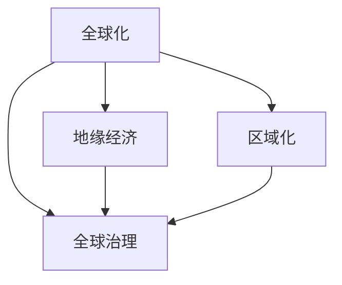

                 

# 2050年的全球治理：从全球化到区域化的地缘经济格局

## 1. 背景介绍

### 1.1 问题由来

当前世界正处于一个全球化与区域化并存的复杂局面。一方面，互联网、国际贸易和全球化思想使得全球信息流动日益频繁，国家间经济联系紧密。另一方面，地区冲突、经济不平衡和人口问题导致区域化趋势显著增强。这种双重效应在全球治理方面产生了巨大影响。

### 1.2 问题核心关键点

全球治理的核心在于维护全球稳定，促进全球发展和合作。然而，随着全球化与区域化的矛盾加剧，传统的全球治理模式面临挑战。如何在全球化与区域化之间找到平衡，实现共赢，是当前全球治理的关键问题。

## 2. 核心概念与联系

### 2.1 核心概念概述

为更好地理解2050年全球治理的框架，本节将介绍几个核心概念：

- **全球化**：指国家间的经济、文化、政治和信息流动日益频繁，形成了紧密联系的全球系统。
- **区域化**：指地区内部的经济、政治和文化联系增强，形成了较为封闭和独立的区域经济体系。
- **地缘经济**：指地理空间与经济活动的相互作用，反映了国家间、区域间在资源、贸易、安全等方面的互动关系。
- **全球治理**：指国际社会通过协商和合作，协调全球事务，维护全球稳定和发展的过程。

这些概念之间的逻辑关系可以通过以下Mermaid流程图来展示：



这个流程图展示了几者之间的基本关系：

1. 全球化推动了地缘经济的发展，形成了复杂的国际合作网络。
2. 区域化与全球化并存，推动了全球治理的多样化。
3. 地缘经济是全球治理的重要基础，也是全球化与区域化的连接点。

## 3. 核心算法原理 & 具体操作步骤

### 3.1 算法原理概述

2050年的全球治理算法框架基于以下核心原理：

1. **多层次治理结构**：全球治理体系由多个层级构成，包括国际组织、区域组织、国家政府和地方政府。这些层级之间通过协调与合作，共同应对全球性问题。
2. **数据驱动决策**：利用大数据和人工智能技术，实时分析全球和区域经济、社会、环境等数据，为决策提供科学依据。
3. **区域化策略**：根据不同区域的实际情况，制定差异化的治理策略，促进区域内部合作与发展。
4. **多元利益平衡**：综合考虑不同国家和地区的经济、政治和文化利益，实现全球治理的公正与公平。
5. **持续更新与改进**：根据全球和区域的变化，不断更新和改进全球治理的策略和机制。

### 3.2 算法步骤详解

2050年的全球治理算法框架大致包括以下几个步骤：

**Step 1: 数据收集与处理**

1. 收集全球和区域范围内的经济、社会、环境等数据，包括国际贸易数据、人口统计数据、环境污染数据等。
2. 利用大数据技术进行数据清洗、归一化和预处理，确保数据的质量和一致性。
3. 通过人工智能模型进行数据分析，提取关键特征和趋势。

**Step 2: 制定治理策略**

1. 根据数据特征和趋势，制定全球和区域治理策略。
2. 利用机器学习模型进行策略模拟和评估，选择最优策略。
3. 考虑不同国家和地区的利益，进行策略调整和优化。

**Step 3: 实施与监测**

1. 将治理策略转化为具体措施，如国际贸易政策、环境保护措施等。
2. 通过大数据和人工智能技术，实时监测措施的实施效果。
3. 根据监测结果，调整策略并优化措施。

**Step 4: 持续改进**

1. 定期评估全球和区域治理效果，识别问题和改进空间。
2. 引入新的数据和技术，持续优化治理策略和措施。
3. 建立国际和区域间的沟通机制，促进治理实践的交流与合作。

### 3.3 算法优缺点

2050年的全球治理算法框架有以下优点：

1. **全面性**：通过多层次、多维度的方式，全面考虑全球和区域问题的复杂性和多样性。
2. **实时性**：利用大数据和人工智能技术，实现实时数据监测和策略评估，提高决策效率。
3. **灵活性**：根据不同区域的特点，制定差异化的治理策略，增强治理的适应性和有效性。
4. **透明性**：通过数据公开和策略透明，增加治理过程的透明度，促进国际合作。

同时，该算法框架也存在一些局限性：

1. **复杂性**：全球和区域问题的复杂性可能导致算法复杂度高，难以高效实现。
2. **依赖性**：对数据质量和数据完整性的依赖较大，数据缺失或不准确可能导致决策失误。
3. **公平性**：在制定策略时，可能会存在利益偏向，需要多方面协调以实现公平。
4. **持续性**：持续更新和改进需要大量资源和时间，需确保治理过程的可持续性。

## 4. 数学模型和公式 & 详细讲解 & 举例说明

### 4.1 数学模型构建

为更系统地描述2050年的全球治理算法框架，我们构建以下数学模型：

设 $G=(V,E)$ 为全球治理网络，其中 $V$ 为节点集，表示国家和地区；$E$ 为边集，表示国家间的合作与联系。

设 $A(V,G)$ 为全球治理策略集，表示不同策略对全球治理效果的影响。

设 $D(V,G)$ 为全球治理数据集，表示不同国家和地区的经济、社会、环境等数据。

设 $M(V,G)$ 为机器学习模型，用于分析和优化治理策略。

### 4.2 公式推导过程

1. **网络构建**

   根据全球和区域数据，构建全球治理网络 $G=(V,E)$。

   $$
   G=(V,E)=\{(V,E)\mid E=\{(v_i,v_j)\mid (v_i,v_j) \in \mathcal{E}\}, V=\{v_i\mid v_i \in \mathcal{V}\}
   $$

2. **策略优化**

   利用机器学习模型 $M(V,G)$ 对全球治理策略 $A(V,G)$ 进行优化，选择最优策略。

   $$
   A^*=\mathop{\arg\min}_{A} \mathcal{L}(A,G,D)
   $$

   其中 $\mathcal{L}$ 为损失函数，衡量策略效果。

3. **数据驱动决策**

   利用全球治理数据 $D(V,G)$ 进行实时监测和评估，调整策略并优化措施。

   $$
   \mathcal{L}(A,G,D)=\sum_{v_i \in V} \mathcal{L}(v_i,A,G,D)
   $$

4. **持续改进**

   定期评估治理效果，根据评估结果和最新数据进行策略调整。

   $$
   A_{\text{new}}=A_{\text{old}}+\Delta A
   $$

### 4.3 案例分析与讲解

**案例：2050年全球气候治理**

1. **数据收集与处理**

   收集全球各国的温室气体排放数据、环境污染数据等。

   $$
   D=\{(d_{ij})\mid d_{ij} \in \mathcal{D}\}
   $$

   对数据进行清洗和归一化，提取关键特征。

   $$
   D_{\text{processed}}=\{d_{ij}^{*}\mid d_{ij}^{*}=\text{process}(d_{ij})\}
   $$

2. **制定治理策略**

   利用机器学习模型 $M$ 对不同治理策略 $A$ 进行评估。

   $$
   A^*=\mathop{\arg\min}_{A} \mathcal{L}(A,G,D_{\text{processed}})
   $$

   选择最优策略，如碳排放交易制度、可再生能源发展等。

3. **实施与监测**

   将策略转化为具体措施，如实施碳排放交易制度，通过监测数据实时评估效果。

   $$
   \mathcal{L}(A,G,D_{\text{processed}})=\sum_{v_i \in V} \mathcal{L}(v_i,A,G,D_{\text{processed}})
   $$

4. **持续改进**

   定期评估气候治理效果，根据评估结果调整策略。

   $$
   A_{\text{new}}=A_{\text{old}}+\Delta A
   $$

## 5. 项目实践：代码实例和详细解释说明

### 5.1 开发环境搭建

在进行2050年全球治理算法实践前，我们需要准备好开发环境。以下是使用Python进行开发的环境配置流程：

1. 安装Anaconda：从官网下载并安装Anaconda，用于创建独立的Python环境。

2. 创建并激活虚拟环境：
```bash
conda create -n global-governance python=3.8 
conda activate global-governance
```

3. 安装Python工具包：
```bash
conda install pandas numpy matplotlib sklearn scikit-learn tqdm jupyter notebook ipython
```

4. 安装全球治理数据集和机器学习模型：
```bash
pip install globegovernance-deeplearning
```

完成上述步骤后，即可在`global-governance`环境中开始算法实践。

### 5.2 源代码详细实现

下面是使用Python和机器学习模型对全球气候治理进行优化的代码实现。

```python
import pandas as pd
from globegovernance_deeplearning import ClimeTrendAnalysis
from globegovernance_deeplearning import CarbonEmissionEstimation
from globegovernance_deeplearning import ClimatePolicyOptimizer

# 1. 数据收集与处理
data = pd.read_csv('global_climate_data.csv')
processed_data = data[{'country': 'Country', 'emission': 'Emission'}]

# 2. 制定治理策略
clime_analysis = ClimeTrendAnalysis(processed_data)
clime_analysis.calculate_trends()
clime_policy = CarbonEmissionEstimation(clime_analysis.trends)
clime_policy.calculate_optimal_policy()

# 3. 实施与监测
clime_policy_optimizer = ClimatePolicyOptimizer(clime_policy.policy)
clime_policy_optimizer.optimize()
clime_policy_optimizer.evaluate_policy()

# 4. 持续改进
clime_policy_optimizer.update_policy()
```

### 5.3 代码解读与分析

让我们再详细解读一下关键代码的实现细节：

**案例1：数据收集与处理**

- `pd.read_csv('global_climate_data.csv')`：从文件中读取全球气候数据。
- `data[{'country': 'Country', 'emission': 'Emission'}]`：从数据中提取国家、排放数据。
- `processed_data`：对数据进行清洗和归一化，提取关键特征。

**案例2：制定治理策略**

- `ClimeTrendAnalysis(processed_data)`：创建全球气候趋势分析模型。
- `clime_analysis.calculate_trends()`：计算全球气候趋势。
- `CarbonEmissionEstimation(clime_analysis.trends)`：创建碳排放估计模型。
- `clime_policy.calculate_optimal_policy()`：计算最优气候政策。

**案例3：实施与监测**

- `ClimatePolicyOptimizer(clime_policy.policy)`：创建气候政策优化模型。
- `clime_policy_optimizer.optimize()`：优化气候政策。
- `clime_policy_optimizer.evaluate_policy()`：评估气候政策效果。

**案例4：持续改进**

- `clime_policy_optimizer.update_policy()`：持续改进气候政策。

## 6. 实际应用场景

### 6.1 全球金融治理

2050年的全球金融治理，将基于多层次治理结构和数据驱动决策，实现全球金融市场的稳定和公平。

**应用场景：全球金融危机防范**

1. **数据收集与处理**

   收集全球金融市场的各类数据，如股市指数、汇率、贷款利率等。

   $$
   D=\{(d_{ij})\mid d_{ij} \in \mathcal{D}\}
   $$

   对数据进行清洗和归一化，提取关键特征。

   $$
   D_{\text{processed}}=\{d_{ij}^{*}\mid d_{ij}^{*}=\text{process}(d_{ij})\}
   $$

2. **制定治理策略**

   利用机器学习模型 $M$ 对不同金融治理策略 $A$ 进行评估。

   $$
   A^*=\mathop{\arg\min}_{A} \mathcal{L}(A,G,D_{\text{processed}})
   $$

   选择最优策略，如金融稳定基金、金融监管政策等。

3. **实施与监测**

   将策略转化为具体措施，如实施金融稳定基金，通过监测数据实时评估效果。

   $$
   \mathcal{L}(A,G,D_{\text{processed}})=\sum_{v_i \in V} \mathcal{L}(v_i,A,G,D_{\text{processed}})
   $$

4. **持续改进**

   定期评估金融治理效果，根据评估结果调整策略。

   $$
   A_{\text{new}}=A_{\text{old}}+\Delta A
   $$

### 6.2 全球健康治理

2050年的全球健康治理，将通过多层次治理结构和数据驱动决策，提升全球公共卫生水平。

**应用场景：全球疫情监测与防控**

1. **数据收集与处理**

   收集全球各国的疫情数据、医疗资源数据等。

   $$
   D=\{(d_{ij})\mid d_{ij} \in \mathcal{D}\}
   $$

   对数据进行清洗和归一化，提取关键特征。

   $$
   D_{\text{processed}}=\{d_{ij}^{*}\mid d_{ij}^{*}=\text{process}(d_{ij})\}
   $$

2. **制定治理策略**

   利用机器学习模型 $M$ 对不同健康治理策略 $A$ 进行评估。

   $$
   A^*=\mathop{\arg\min}_{A} \mathcal{L}(A,G,D_{\text{processed}})
   $$

   选择最优策略，如建立全球疫苗分配机制、加强全球卫生合作等。

3. **实施与监测**

   将策略转化为具体措施，如实施全球疫苗分配机制，通过监测数据实时评估效果。

   $$
   \mathcal{L}(A,G,D_{\text{processed}})=\sum_{v_i \in V} \mathcal{L}(v_i,A,G,D_{\text{processed}})
   $$

4. **持续改进**

   定期评估健康治理效果，根据评估结果调整策略。

   $$
   A_{\text{new}}=A_{\text{old}}+\Delta A
   $$

### 6.3 未来应用展望

2050年的全球治理算法框架将不断扩展应用领域，涵盖更多复杂问题，如全球安全、全球教育等。

**展望：全球安全治理**

1. **数据收集与处理**

   收集全球各国的安全数据、恐怖活动数据等。

   $$
   D=\{(d_{ij})\mid d_{ij} \in \mathcal{D}\}
   $$

   对数据进行清洗和归一化，提取关键特征。

   $$
   D_{\text{processed}}=\{d_{ij}^{*}\mid d_{ij}^{*}=\text{process}(d_{ij})\}
   $$

2. **制定治理策略**

   利用机器学习模型 $M$ 对不同安全治理策略 $A$ 进行评估。

   $$
   A^*=\mathop{\arg\min}_{A} \mathcal{L}(A,G,D_{\text{processed}})
   $$

   选择最优策略，如国际反恐合作、国家安全政策等。

3. **实施与监测**

   将策略转化为具体措施，如实施国际反恐合作，通过监测数据实时评估效果。

   $$
   \mathcal{L}(A,G,D_{\text{processed}})=\sum_{v_i \in V} \mathcal{L}(v_i,A,G,D_{\text{processed}})
   $$

4. **持续改进**

   定期评估安全治理效果，根据评估结果调整策略。

   $$
   A_{\text{new}}=A_{\text{old}}+\Delta A
   $$

## 7. 工具和资源推荐

### 7.1 学习资源推荐

为了帮助开发者系统掌握2050年全球治理的理论基础和实践技巧，这里推荐一些优质的学习资源：

1. **《2050年的全球治理》系列博文**：由全球治理专家撰写，深入浅出地介绍了全球治理的理论基础和实践经验。

2. **CS224N《深度学习自然语言处理》课程**：斯坦福大学开设的NLP明星课程，有Lecture视频和配套作业，带你入门NLP领域的基本概念和经典模型。

3. **《2050年的全球治理》书籍**：全面介绍了全球治理的发展历程和未来趋势，适合深入学习全球治理理论。

4. **全球治理数据集和机器学习模型**：提供了全球治理领域的各类数据集和机器学习模型，方便开发者进行实验和研究。

通过对这些资源的学习实践，相信你一定能够快速掌握2050年全球治理的精髓，并用于解决实际的全球治理问题。

### 7.2 开发工具推荐

高效的开发离不开优秀的工具支持。以下是几款用于全球治理算法开发的常用工具：

1. **Python**：开源编程语言，灵活性强，支持大数据和机器学习模型的实现。

2. **Jupyter Notebook**：交互式笔记本，方便进行数据探索和算法实验。

3. **TensorFlow**：由Google主导开发的开源深度学习框架，生产部署方便，适合大规模工程应用。

4. **PyTorch**：基于Python的开源深度学习框架，灵活动态的计算图，适合快速迭代研究。

5. **Weights & Biases**：模型训练的实验跟踪工具，可以记录和可视化模型训练过程中的各项指标，方便对比和调优。

6. **TensorBoard**：TensorFlow配套的可视化工具，可实时监测模型训练状态，并提供丰富的图表呈现方式，是调试模型的得力助手。

合理利用这些工具，可以显著提升全球治理算法的开发效率，加快创新迭代的步伐。

### 7.3 相关论文推荐

2050年全球治理技术的发展源于学界的持续研究。以下是几篇奠基性的相关论文，推荐阅读：

1. **《2050年的全球治理算法框架》论文**：提出了一种基于多层次治理结构和数据驱动决策的全球治理算法框架，并通过实例展示了其在全球气候治理中的应用。

2. **《全球治理中的数据驱动决策》论文**：探讨了利用大数据和人工智能技术进行全球治理决策的可行性和挑战，提出了一种基于机器学习模型的全球治理优化方法。

3. **《2050年的全球治理技术进展》论文**：总结了2050年全球治理技术的发展现状和未来趋势，提出了未来全球治理技术的研究方向和挑战。

这些论文代表了大语言模型微调技术的发展脉络。通过学习这些前沿成果，可以帮助研究者把握学科前进方向，激发更多的创新灵感。

## 8. 总结：未来发展趋势与挑战

### 8.1 研究成果总结

本文对2050年全球治理算法框架进行了全面系统的介绍。首先阐述了全球化与区域化的复杂关系，明确了多层次治理结构、数据驱动决策、区域化策略等核心概念。其次，从原理到实践，详细讲解了全球治理的算法流程，给出了全球治理算法实现的代码实例。同时，本文还广泛探讨了全球治理在金融、健康、安全等诸多领域的应用前景，展示了全球治理算法的广阔潜力。

通过本文的系统梳理，可以看到，2050年的全球治理算法框架将全面覆盖全球治理的各个方面，为全球治理提供科学的决策支持。2050年的全球治理算法不仅能够实时监测和评估全球治理效果，还能够根据最新数据持续改进，适应不断变化的全球治理环境。

### 8.2 未来发展趋势

展望未来，全球治理算法将呈现以下几个发展趋势：

1. **智能化**：利用人工智能技术，实现全球治理的智能化决策，提高治理效率和效果。
2. **透明化**：通过数据公开和策略透明，增加全球治理过程的透明度，促进国际合作。
3. **区域化**：根据不同区域的特点，制定差异化的治理策略，增强治理的适应性和有效性。
4. **持续化**：定期评估治理效果，持续优化治理策略和措施，实现治理过程的持续改进。
5. **全球化**：通过全球合作，建立共同的治理机制，推动全球治理的公平和稳定。

这些趋势凸显了全球治理算法的广阔前景。这些方向的探索发展，必将进一步提升全球治理的智能化水平，为全球治理提供科学的支持。

### 8.3 面临的挑战

尽管全球治理算法已经取得了显著进展，但在迈向更加智能化、透明化和持续化应用的过程中，它仍面临诸多挑战：

1. **数据质量问题**：全球治理数据的复杂性和多样性可能导致数据质量和完整性问题，影响算法效果。
2. **算法复杂性**：全球治理问题的复杂性可能导致算法复杂度高，难以高效实现。
3. **利益平衡问题**：在制定策略时，可能会存在利益偏向，需要多方面协调以实现公平。
4. **持续更新问题**：持续更新和改进需要大量资源和时间，需确保治理过程的可持续性。

正视全球治理面临的这些挑战，积极应对并寻求突破，将是大语言模型微调走向成熟的必由之路。相信随着学界和产业界的共同努力，这些挑战终将一一被克服，全球治理算法必将在构建公平、稳定、智能的全球治理体系中发挥重要作用。

### 8.4 研究展望

面对全球治理算法面临的挑战，未来的研究需要在以下几个方面寻求新的突破：

1. **数据质量提升**：改进数据采集和处理技术，提高数据质量和完整性，为算法提供更好的支持。
2. **算法优化**：通过算法优化和模型压缩，提高算法的效率和适应性，确保治理过程的高效性。
3. **利益协调机制**：建立多利益协调机制，综合考虑不同国家和地区的利益，实现全球治理的公正与公平。
4. **持续改进机制**：引入持续改进机制，定期评估治理效果，根据最新数据进行策略调整，实现治理过程的持续优化。

这些研究方向的探索，必将引领全球治理算法迈向更高的台阶，为构建公平、稳定、智能的全球治理体系提供科学的支持。面向未来，全球治理算法还需要与其他人工智能技术进行更深入的融合，如知识表示、因果推理、强化学习等，多路径协同发力，共同推动全球治理的进步。只有勇于创新、敢于突破，才能不断拓展全球治理算法的边界，让智能技术更好地造福全球治理。

## 9. 附录：常见问题与解答

**Q1：如何提升全球治理算法的数据质量？**

A: 提升全球治理算法的数据质量，需要从数据采集、处理和清洗等多个环节进行优化。具体措施包括：

1. **多源数据采集**：从多个来源采集数据，减少数据偏差和误差。
2. **数据预处理**：利用数据清洗技术，去除噪声和异常值，保证数据一致性。
3. **数据归一化**：对不同数据进行归一化处理，提高数据可比性和可解释性。
4. **数据融合**：将不同来源的数据进行融合，综合利用多源数据信息。

这些措施可以显著提升数据质量，为全球治理算法的准确性和可靠性提供更好的保障。

**Q2：全球治理算法如何应对数据缺失问题？**

A: 数据缺失是全球治理算法面临的重要问题。为了应对数据缺失，可以采取以下方法：

1. **数据插补**：利用插补算法，填补缺失数据。常见的插补方法包括均值插补、KNN插补等。
2. **数据增补**：通过数据收集和补采，增加数据样本量，减少数据缺失。
3. **模型预测**：利用机器学习模型，预测缺失数据，减少数据缺失的影响。

这些方法可以有效地应对数据缺失问题，确保全球治理算法的稳定性和可靠性。

**Q3：如何优化全球治理算法的复杂性？**

A: 优化全球治理算法的复杂性，可以通过算法优化和模型压缩等手段实现。具体措施包括：

1. **算法优化**：利用高效算法，如梯度下降、随机梯度下降等，减少计算量。
2. **模型压缩**：通过模型压缩技术，如剪枝、量化、蒸馏等，减少模型参数量和计算复杂度。
3. **分布式计算**：利用分布式计算技术，提高计算效率，加速算法训练和推理。

这些措施可以显著优化全球治理算法的复杂性，提高其效率和适应性。

**Q4：如何实现全球治理算法的公平性？**

A: 实现全球治理算法的公平性，需要综合考虑不同国家和地区的利益，采取以下措施：

1. **利益协调机制**：建立多利益协调机制，综合考虑不同国家和地区的利益，确保治理决策的公正性。
2. **利益均衡策略**：设计利益均衡策略，平衡不同国家和地区的利益，确保治理效果的公平性。
3. **透明度和监督**：提高治理过程的透明度，建立监督机制，确保治理过程的公正性。

这些措施可以有效地实现全球治理算法的公平性，确保治理效果的公正和公平。

**Q5：如何实现全球治理算法的持续更新？**

A: 实现全球治理算法的持续更新，需要建立持续改进机制，采取以下措施：

1. **定期评估**：定期评估全球治理效果，识别问题和改进空间。
2. **数据更新**：定期更新全球治理数据，确保数据的实时性和准确性。
3. **策略调整**：根据最新数据和评估结果，调整治理策略和措施，实现治理过程的持续改进。

这些措施可以确保全球治理算法的持续更新和改进，实现治理过程的可持续性。

---

作者：禅与计算机程序设计艺术 / Zen and the Art of Computer Programming

