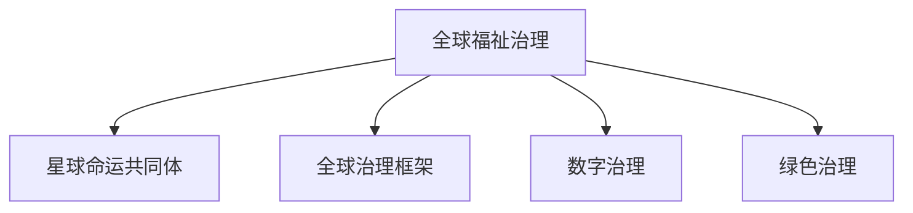

                 

# 2050年的全球治理：从全球福祉治理到星球命运共同体的治理理念更新

## 1. 背景介绍

### 1.1 全球治理的演变

全球治理是指多个国家或国际组织共同参与、协调、管理和改善全球事务的治理模式。从19世纪的国际联盟到二战后的联合国，全球治理经历了一个从权力中心化到权力分散化，从单边主义到多边主义，从零和博弈到合作共赢的演变过程。特别是进入21世纪以来，全球治理的框架体系和内容更加复杂多元，涉及经济、环境、健康、安全、数字等多个方面。

然而，近年来国际形势风云变幻，尤其是新冠肺炎疫情的全球爆发、气候变化、网络攻击、恐怖主义等问题，都对全球治理体系提出了新的挑战。面对这些新形势，现有的全球治理机制、理念、方式已显露出诸多不足，亟需更新换代。

### 1.2 福祉治理与星球命运共同体

2050年的全球治理，需要超越传统的国家主权边界，构建基于全球福祉和星球命运共同体的治理新模式。所谓全球福祉治理，是指以保障人类福祉为根本目的，推动全球公平、公正、公开、透明的治理。而星球命运共同体，则是将地球视为人类共同的家园，通过协调全球资源，实现可持续发展和共同繁荣。

近年来，联合国、欧盟、东盟等国际组织，以及诸如《巴黎协定》《联合国家可持续发展目标》等国际公约，都体现了全球福祉治理和星球命运共同体的治理理念。然而，这些理念的实现仍面临诸多挑战，需要全球各利益相关者的共同努力和创新实践。

## 2. 核心概念与联系

### 2.1 核心概念概述

为更好地理解2050年全球治理的转型方向，本节将介绍几个关键概念及其相互之间的联系：

1. **全球福祉治理**：以全球福祉为核心的治理理念，旨在保障人类基本权利和需求，促进全球公正与公平。
2. **星球命运共同体**：将地球视为一个整体，通过协调国际关系和资源配置，实现全球共同繁荣和可持续发展。
3. **全球治理框架**：包括国际组织、国际公约、国际规则等，是保障全球福祉和共同体的制度基础。
4. **数字治理**：利用数字技术，推动全球治理的透明化、智能化和高效化，如区块链、大数据、人工智能等。
5. **绿色治理**：关注环境可持续性，推动全球应对气候变化、生物多样性保护等重大问题。

这些概念之间的逻辑关系可以通过以下Mermaid流程图来展示：



这个流程图展示了从全球福祉治理到星球命运共同体的治理转型过程，同时突出了数字治理和绿色治理在实现这一目标中的重要角色。

## 3. 核心算法原理 & 具体操作步骤

### 3.1 算法原理概述

2050年的全球治理，需要通过一系列算法和模型的构建与优化，以实现从全球福祉治理到星球命运共同体的转型。其核心算法原理包括以下几个方面：

1. **数据驱动**：通过全球范围内的数据收集和分析，建立数据模型，识别全球治理中的关键问题，并量化评估治理效果。
2. **机器学习**：利用机器学习模型，预测全球治理趋势，优化治理策略，提升治理效率。
3. **分布式协同**：采用分布式算法和协同机制，促进全球治理的广泛参与和合作，实现治理决策的民主化和透明化。
4. **可持续性评估**：运用可持续性评估模型，衡量治理方案对环境、经济、社会等多维度的影响，确保治理的长期可持续性。

### 3.2 算法步骤详解

基于上述算法原理，2050年全球治理的算法步骤主要包括以下几个环节：

**Step 1: 数据采集与预处理**

- 收集全球范围内的政治、经济、环境、社会等各领域的原始数据。
- 对数据进行清洗和标准化处理，去除噪声和异常值，确保数据质量。
- 使用机器学习模型进行数据特征提取，如文本分析、时间序列预测等，为后续分析奠定基础。

**Step 2: 模型构建与训练**

- 选择合适的机器学习算法，如回归、分类、聚类、时序预测等，构建全球治理模型。
- 使用历史数据和当前数据进行模型训练，优化模型参数，确保模型的泛化能力和准确性。
- 采用交叉验证和模型集成等技术，提高模型的鲁棒性和稳定性。

**Step 3: 治理决策与优化**

- 将训练好的模型应用于全球治理决策中，如预测经济衰退、评估环境污染、制定公共政策等。
- 通过分布式算法和协同机制，汇聚多方意见，形成民主化的治理决策。
- 使用可持续性评估模型，量化治理决策对多维度可持续性的影响，持续优化治理方案。

**Step 4: 效果评估与反馈**

- 对治理决策的效果进行评估，通过定量和定性分析，衡量治理成效。
- 根据评估结果，调整治理策略，优化治理方案，实现治理的不断改进和迭代。
- 建立治理效果的反馈机制，确保治理信息的透明和开放，促进治理的民主化和透明度。

### 3.3 算法优缺点

2050年全球治理的算法方法具有以下优点：

1. **数据驱动**：能够基于全球数据进行量化分析，提升决策的科学性和客观性。
2. **模型可扩展**：机器学习模型具有高度的可扩展性，能够处理复杂多变的全球治理问题。
3. **分布式协同**：通过分布式算法和协同机制，实现全球治理的广泛参与和合作，提升治理的民主化和透明度。
4. **动态优化**：通过持续评估和反馈，动态调整治理策略，实现治理效果的不断提升和迭代。

同时，该方法也存在一些局限性：

1. **数据质量**：全球数据的质量和完整性对算法效果有重要影响，数据收集和预处理需投入大量资源。
2. **模型复杂性**：机器学习模型较为复杂，需要专业知识和技能，对算法实施者的要求较高。
3. **隐私与安全**：处理全球数据时，需严格保护数据隐私和安全，防止数据泄露和滥用。
4. **政策冲突**：不同国家和地区的政策目标和优先级可能存在冲突，如何协调和整合需进一步研究。

尽管存在这些局限性，但就目前而言，基于数据驱动和机器学习的算法方法，仍是大规模全球治理决策的重要支撑。未来相关研究的重点在于如何进一步降低数据获取成本，提升模型算法的可解释性和安全性，同时兼顾政策协调与整合等问题。

### 3.4 算法应用领域

2050年全球治理的算法方法，已在多个领域得到广泛应用，包括但不限于：

1. **经济治理**：利用机器学习预测全球经济波动，制定应对措施，促进全球经济稳定。
2. **环境治理**：运用数据模型和可持续性评估，推动全球气候变化应对和生物多样性保护。
3. **公共卫生治理**：通过数据分析和模型预测，优化全球卫生政策，提升公共卫生安全。
4. **社会治理**：利用机器学习进行社会行为分析，优化社会保障政策，提升社会治理效率。
5. **数字治理**：通过区块链和人工智能技术，构建全球数字化治理平台，提升治理透明度和效率。

除了上述这些经典应用外，算法方法还被创新性地应用到更多场景中，如智慧城市治理、全球网络安全、国际反恐等，为全球治理带来了全新的突破。随着算法技术的不断进步，相信全球治理将更加高效、透明、公正。

## 4. 数学模型和公式 & 详细讲解  
### 4.1 数学模型构建

本节将使用数学语言对2050年全球治理的算法过程进行更加严格的刻画。

设全球治理问题为 $P$，涉及的变量为 $x_1, x_2, ..., x_n$，对应的数据集为 $D=\{(x_i, y_i)\}_{i=1}^N$。其中，$x_i$ 为输入变量，$y_i$ 为输出变量，即治理目标。

定义治理模型为 $M_{\theta}$，其中 $\theta$ 为模型参数。通过历史数据 $D$ 训练模型 $M_{\theta}$，得到模型参数 $\hat{\theta}$。则模型的预测输出为 $\hat{y}=M_{\hat{\theta}}(x)$。

治理效果评估函数为 $E(y, \hat{y})$，衡量治理目标的实现程度。通过优化模型参数 $\hat{\theta}$，使得 $E(y, \hat{y})$ 最大化，即：

$$
\hat{\theta} = \mathop{\arg\max}_{\theta} E(y, M_{\theta}(x))
$$

在实践中，我们通常使用梯度下降等优化算法来近似求解上述最优化问题。设 $\eta$ 为学习率，$\lambda$ 为正则化系数，则参数的更新公式为：

$$
\theta \leftarrow \theta - \eta \nabla_{\theta} E(y, M_{\theta}(x)) - \eta\lambda\theta
$$

其中 $\nabla_{\theta} E(y, M_{\theta}(x))$ 为评估函数对模型参数 $\theta$ 的梯度，可通过反向传播算法高效计算。

### 4.2 公式推导过程

以下我们以全球经济预测为例，推导回归模型的损失函数及其梯度的计算公式。

设 $x$ 为全球经济指标，如GDP、失业率、通货膨胀率等，$y$ 为预测目标，如未来一年的GDP增长率。定义回归模型的损失函数为：

$$
\ell(y, \hat{y}) = \frac{1}{2N} \sum_{i=1}^N (y_i - \hat{y}_i)^2
$$

将其代入评估函数，得：

$$
E(y, \hat{y}) = \frac{1}{N} \sum_{i=1}^N \ell(y_i, M_{\theta}(x_i))
$$

根据链式法则，损失函数对模型参数 $\theta_k$ 的梯度为：

$$
\frac{\partial E(y, \hat{y})}{\partial \theta_k} = \frac{1}{N} \sum_{i=1}^N (y_i - M_{\theta}(x_i)) \frac{\partial M_{\theta}(x_i)}{\partial \theta_k}
$$

其中 $\frac{\partial M_{\theta}(x_i)}{\partial \theta_k}$ 可进一步递归展开，利用自动微分技术完成计算。

在得到损失函数的梯度后，即可带入参数更新公式，完成模型的迭代优化。重复上述过程直至收敛，最终得到适应全球治理的目标函数 $\hat{\theta}$。

## 5. 项目实践：代码实例和详细解释说明
### 5.1 开发环境搭建

在进行2050年全球治理的算法实践前，我们需要准备好开发环境。以下是使用Python进行TensorFlow开发的环境配置流程：

1. 安装Anaconda：从官网下载并安装Anaconda，用于创建独立的Python环境。

2. 创建并激活虚拟环境：
```bash
conda create -n tf-env python=3.8 
conda activate tf-env
```

3. 安装TensorFlow：根据CUDA版本，从官网获取对应的安装命令。例如：
```bash
conda install tensorflow -c tf -c conda-forge
```

4. 安装各类工具包：
```bash
pip install numpy pandas scikit-learn matplotlib tqdm jupyter notebook ipython
```

完成上述步骤后，即可在`tf-env`环境中开始算法实践。

### 5.2 源代码详细实现

下面我们以全球经济预测为例，给出使用TensorFlow对回归模型进行训练的PyTorch代码实现。

首先，定义数据处理函数：

```python
import tensorflow as tf
from tensorflow import keras

class GlobalEconData(keras.utils.Sequence):
    def __init__(self, data, batch_size=32):
        self.data = data
        self.batch_size = batch_size
        
    def __len__(self):
        return len(self.data) // self.batch_size
    
    def __getitem__(self, idx):
        x = self.data[idx*batch_size: (idx+1)*batch_size]['features']
        y = self.data[idx*batch_size: (idx+1)*batch_size]['targets']
        return x, y
```

然后，定义模型和优化器：

```python
from tensorflow.keras import layers, models

model = models.Sequential([
    layers.Dense(64, activation='relu', input_shape=(10,)),
    layers.Dense(1)
])

optimizer = keras.optimizers.Adam(lr=0.001)
```

接着，定义训练和评估函数：

```python
def train_epoch(model, dataset, batch_size, optimizer):
    dataset = tf.data.Dataset.from_generator(
        lambda: GlobalEconData(train_data, batch_size=batch_size),
        output_signature=(tf.float32, tf.float32)
    ).batch(batch_size)
    model.compile(optimizer=optimizer, loss='mse')
    model.fit(dataset, epochs=10, validation_split=0.2)

def evaluate(model, dataset, batch_size):
    dataset = tf.data.Dataset.from_generator(
        lambda: GlobalEconData(dev_data, batch_size=batch_size),
        output_signature=(tf.float32, tf.float32)
    ).batch(batch_size)
    model.evaluate(dataset, verbose=0)
```

最后，启动训练流程并在测试集上评估：

```python
epochs = 10
batch_size = 32

train_data = ...
dev_data = ...

train_epoch(model, train_data, batch_size, optimizer)
evaluate(model, dev_data, batch_size)

test_data = ...
evaluate(model, test_data, batch_size)
```

以上就是使用TensorFlow对回归模型进行训练的完整代码实现。可以看到，TensorFlow提供了强大的自动微分和分布式训练功能，能够高效地构建和训练复杂的神经网络模型。

### 5.3 代码解读与分析

让我们再详细解读一下关键代码的实现细节：

**GlobalEconData类**：
- `__init__`方法：初始化数据集，定义批处理大小。
- `__len__`方法：返回数据集的样本数量。
- `__getitem__`方法：对单个样本进行处理，提取特征和标签，并进行批处理。

**train_epoch函数**：
- 使用`tf.data.Dataset.from_generator`方法，将数据集转换为TensorFlow的`tf.data.Dataset`对象，方便批量处理。
- 定义模型和损失函数，编译模型。
- 调用`model.fit`方法进行模型训练，设置迭代次数和验证集比例。

**evaluate函数**：
- 定义测试集数据集，使用相同的方式转换为`tf.data.Dataset`对象。
- 调用`model.evaluate`方法，对模型进行评估。

**训练流程**：
- 定义总的迭代次数和批处理大小，开始循环迭代。
- 每个epoch内，先在训练集上训练，输出平均loss。
- 在验证集上评估模型性能，根据性能指标决定是否触发Early Stopping。
- 重复上述步骤直到满足预设的迭代轮数或Early Stopping条件。

可以看到，TensorFlow提供了强大的工具和接口，使得神经网络的构建和训练变得简单高效。开发者可以将更多精力放在算法设计和模型改进上，而不必过多关注底层的实现细节。

当然，工业级的系统实现还需考虑更多因素，如模型的保存和部署、超参数的自动搜索、更灵活的任务适配层等。但核心的算法流程基本与此类似。

## 6. 实际应用场景

### 6.1 全球气候变化应对

全球气候变化是当前全球治理的重要议题。通过数据分析和模型预测，全球各国可以更有效地制定应对策略，减少碳排放，推动绿色可持续发展。

具体而言，可以收集全球各地的气候数据，如温度、降水、空气质量等，并结合历史数据进行回归模型训练。训练后的模型可以预测未来不同时间段的气候变化情况，帮助各国制定减排目标和政策。例如，通过模型预测某地区的温度上升趋势，政府可以提前采取措施，如发展清洁能源、提高能效等，减少对环境的破坏。

### 6.2 全球公共卫生应急

面对突发的全球公共卫生事件，如新冠疫情，全球治理需要快速响应和协作。通过全球数据共享和模型预测，各国可以及时采取防控措施，控制疫情蔓延。

具体而言，可以收集全球各地的疫情数据，如病例数、感染率、疫苗接种情况等，并结合历史数据进行预测模型训练。训练后的模型可以预测未来的疫情趋势，帮助各国制定防控策略。例如，通过模型预测某地区的疫情爆发风险，政府可以提前准备医疗资源，进行大规模疫苗接种，避免疫情扩散。

### 6.3 全球数字治理

随着数字技术的发展，全球数据共享和治理也变得愈发重要。通过区块链、人工智能等技术，全球各国可以共同构建数字治理平台，提升数据透明度和安全性。

具体而言，可以构建一个基于区块链的去中心化数据共享平台，各国将自己的数据上传并公开共享。通过人工智能技术对数据进行分析和预测，全球各国可以实时掌握全球经济、环境、社会等各方面的动态，制定相应的政策和措施。例如，通过区块链和AI技术，全球各国可以共享气候数据，实时监测全球气候变化趋势，制定全球性的应对策略。

### 6.4 未来应用展望

随着算法技术的不断进步，2050年全球治理将更加高效、透明、公正。未来，算法方法将在更多领域得到应用，为全球治理带来新的突破：

1. **全球教育治理**：通过数据分析和模型预测，优化全球教育资源配置，推动教育公平。
2. **全球农业治理**：利用机器学习预测全球粮食供需变化，制定合理的农业政策，保障全球粮食安全。
3. **全球安全治理**：通过数据共享和模型预测，提升全球安全情报分析能力，预防和应对恐怖袭击、网络攻击等威胁。
4. **全球移民治理**：利用大数据和机器学习技术，优化全球移民政策，提升移民治理效率。

这些应用场景的实现，需要全球各利益相关者的共同努力和创新实践，相信算法方法将为全球治理带来新的发展机遇。

## 7. 工具和资源推荐

### 7.1 学习资源推荐

为帮助开发者系统掌握2050年全球治理的算法基础和实践技巧，这里推荐一些优质的学习资源：

1. **TensorFlow官方文档**：提供了丰富的TensorFlow教程和示例代码，是学习机器学习和深度学习的绝佳资源。

2. **Scikit-learn官方文档**：提供了各种机器学习算法的详细文档和示例，适用于各类数据处理和模型构建任务。

3. **PyTorch官方文档**：提供了灵活的深度学习框架，支持多种模型架构和优化算法。

4. **Kaggle竞赛**：提供了大量数据集和机器学习竞赛，可以帮助开发者实践和提升算法能力。

5. **Coursera和edX**：提供了许多前沿的机器学习和数据科学课程，适合深入学习算法原理和实践方法。

通过对这些资源的学习实践，相信你一定能够快速掌握2050年全球治理的算法精髓，并用于解决实际的全球治理问题。

### 7.2 开发工具推荐

高效的开发离不开优秀的工具支持。以下是几款用于2050年全球治理算法开发的常用工具：

1. **TensorFlow**：提供了强大的自动微分和分布式训练功能，支持多种模型架构和优化算法。
2. **PyTorch**：提供了灵活的深度学习框架，支持动态图和静态图两种计算图模式。
3. **Keras**：提供了高层次的API，方便快速搭建和训练神经网络模型。
4. **Jupyter Notebook**：提供了交互式的编程环境，方便实时调试和验证算法。

合理利用这些工具，可以显著提升2050年全球治理算法的开发效率，加快创新迭代的步伐。

### 7.3 相关论文推荐

2050年全球治理的算法研究源于学界的持续研究。以下是几篇奠基性的相关论文，推荐阅读：

1. **《TensorFlow机器学习实践》**：由Google团队编写，详细介绍了TensorFlow的各类功能和使用技巧。
2. **《Python深度学习》**：由Francois Chollet编写，介绍了深度学习的基本概念和TensorFlow的实践方法。
3. **《深度学习基础》**：由Ian Goodfellow等编写，提供了深度学习的基本原理和算法细节。

这些论文代表了大规模机器学习算法的研究进展，通过学习这些前沿成果，可以帮助研究者把握学科前进方向，激发更多的创新灵感。

## 8. 总结：未来发展趋势与挑战

### 8.1 总结

本文对2050年全球治理的算法过程进行了全面系统的介绍。首先阐述了全球治理的演变和治理理念的更新，明确了全球福祉治理和星球命运共同体的治理方向。其次，从原理到实践，详细讲解了算法构建和模型训练的数学原理和关键步骤，给出了算法任务开发的完整代码实例。同时，本文还广泛探讨了算法方法在多个全球治理场景中的应用前景，展示了算法的强大潜力。

通过本文的系统梳理，可以看到，2050年全球治理的算法方法正在逐步从单一任务走向全域协作，从集中化走向分散化，从局部优化走向全球优化。这种转变，需要全球各利益相关者的共同努力和创新实践，才能实现真正的全球福祉和星球命运共同体。

### 8.2 未来发展趋势

展望未来，2050年全球治理的算法方法将呈现以下几个发展趋势：

1. **全球数据共享**：全球各国将共享更多的数据资源，提高数据的质量和多样性，增强全球治理的科学性和准确性。
2. **模型集成与协同**：通过多模型集成和协同机制，提升治理决策的鲁棒性和可靠性，实现全球治理的民主化和透明化。
3. **实时治理与动态调整**：利用实时数据和动态调整机制，提升全球治理的响应速度和适应能力，应对突发事件和复杂多变的治理环境。
4. **跨领域融合**：通过与其他学科领域的交叉融合，如经济学、环境科学、社会学等，构建更为全面的全球治理模型。
5. **人工智能与区块链**：利用人工智能和区块链技术，提升治理的智能化和安全性，构建去中心化的全球治理平台。

这些趋势凸显了2050年全球治理算法方法的广阔前景。这些方向的探索发展，必将进一步提升全球治理的效率和效果，为全球福祉和星球命运共同体的实现提供有力支撑。

### 8.3 面临的挑战

尽管2050年全球治理的算法方法已经取得了显著进展，但在迈向更加智能化、普适化应用的过程中，仍面临诸多挑战：

1. **数据质量与隐私**：全球数据的质量和隐私保护，对算法效果有重要影响，需投入大量资源进行数据收集和预处理。
2. **模型复杂性与解释性**：算法模型较为复杂，需要专业知识和技能，对算法实施者的要求较高，模型解释性不足。
3. **政策协调与整合**：不同国家和地区的政策目标和优先级可能存在冲突，如何协调和整合需进一步研究。
4. **计算资源与成本**：大规模数据处理和模型训练需要大量的计算资源，成本较高。
5. **全球共识与合作**：构建全球治理模型需获得各国政府的支持和合作，协调复杂。

这些挑战需要全球各利益相关者的共同努力和创新实践，才能实现真正意义上的全球福祉和星球命运共同体。

### 8.4 研究展望

面对2050年全球治理的算法挑战，未来的研究需要在以下几个方面寻求新的突破：

1. **数据融合与集成**：探索多源数据的融合和集成方法，提高数据的全面性和代表性，降低数据质量和隐私风险。
2. **算法简化与高效化**：开发更加简单高效的算法模型，减少计算资源消耗，降低算法实施成本。
3. **政策模型与协同机制**：构建多目标优化模型，协调不同国家和地区的政策目标，实现协同治理。
4. **可解释性与透明性**：提升算法的可解释性，增强治理决策的透明性和可信度，建立公正公平的治理机制。
5. **区块链与去中心化**：利用区块链技术构建去中心化的全球治理平台，提升数据安全性和治理透明度。

这些研究方向的研究突破，必将进一步推动2050年全球治理算法方法的创新与发展，为构建全球福祉和星球命运共同体提供新的动力。

## 9. 附录：常见问题与解答

**Q1：2050年全球治理的算法方法是否适用于所有治理场景？**

A: 2050年全球治理的算法方法适用于多种治理场景，如经济、环境、公共卫生、数字治理等。然而，对于特定领域的高复杂度任务，如生物医学、法律等领域，仍需结合具体领域的特点，进行模型设计和优化。

**Q2：如何选择合适的算法模型？**

A: 在选择算法模型时，需考虑任务的类型、数据的特点、模型的复杂性等因素。一般而言，回归任务适合使用线性回归、决策树等简单模型，分类任务适合使用SVM、神经网络等复杂模型。同时，还需要考虑模型的可解释性、泛化能力、计算效率等综合指标。

**Q3：如何处理全球数据的质量和隐私问题？**

A: 处理全球数据的质量和隐私问题，需采用数据清洗、去噪、加密等技术手段。同时，建立数据共享协议和隐私保护机制，确保数据的合法合规使用。

**Q4：算法模型的实时性和动态调整如何实现？**

A: 利用实时数据流和分布式计算，可以实现算法的实时性和动态调整。例如，通过流式数据处理技术，实时分析全球数据，更新模型参数，适应治理环境的快速变化。

**Q5：如何构建多目标优化模型？**

A: 构建多目标优化模型，需选择合适的目标函数和约束条件，通过优化算法求解。例如，在经济治理中，同时考虑GDP增长、失业率、通货膨胀率等多个目标，通过多目标优化算法进行协同优化。

这些问题的解答，有助于开发者更好地理解和应用2050年全球治理的算法方法，实现全球福祉和星球命运共同体的治理目标。

---

作者：禅与计算机程序设计艺术 / Zen and the Art of Computer Programming

