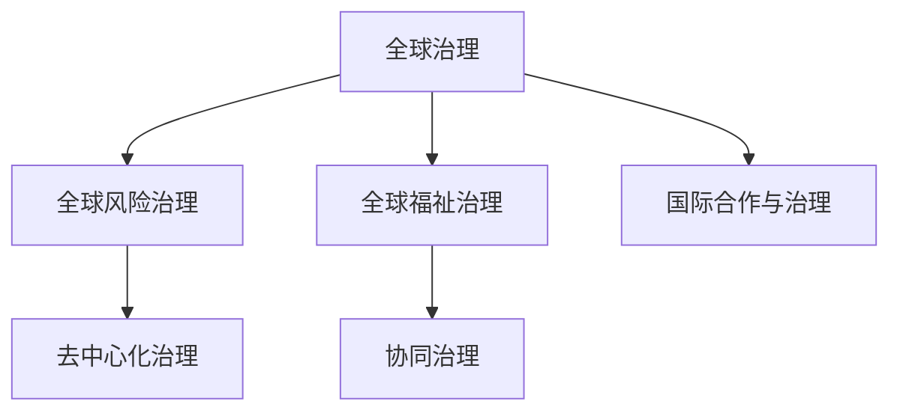

                 

## 1. 背景介绍

### 1.1 问题由来

进入21世纪以来，全球化进程的加速和科技革命的快速推进，带来了前所未有的机遇与挑战。全球化浪潮将世界紧密联系在一起，国家间的相互依存程度不断加深，经济、政治、文化等多方面的融合发展，使得全球风险与福祉问题愈发凸显。如何在风险频发的国际环境下，推动全球共同治理，构建包容、可持续的全球福祉体系，成为全球治理理论研究和实践探索的重要议题。

### 1.2 问题核心关键点

当前全球治理面临的关键问题包括：
- **国际合作与治理**：如何在全球化背景下，促进不同国家间的合作与协调，有效应对跨国界的共同挑战。
- **全球风险与危机应对**：如何构建系统的全球风险预警和应急响应机制，减少全球性灾难的影响。
- **全球福祉与可持续发展**：如何在全球范围内实现经济、社会、环境等多方面的可持续发展，提升全球福祉。

### 1.3 问题研究意义

理解并解决全球治理中的这些问题，对于构建一个安全、公平、开放、包容的国际体系至关重要。全球治理的成功与否，不仅关乎每个国家的利益，更关乎全球人类的共同福祉。通过对全球治理的深入研究，可以提供更具前瞻性和实际性的解决方案，促进全球治理体系的不断完善。

## 2. 核心概念与联系

### 2.1 核心概念概述

为了更好地理解2050年全球治理的理念更新，本节将介绍几个核心概念：

- **全球治理**：指通过国际合作，制定并执行全球性规则和标准，以解决全球问题，实现共同福祉的过程。全球治理包括政治、经济、环境、健康等多个领域。

- **全球风险治理**：指在认识和评估全球风险的基础上，采取全球协作的措施，降低风险发生的可能性，减少风险带来的损害。

- **全球福祉治理**：指以实现全球共同福祉为目标，通过全球合作，提供公平的资源分配，促进可持续发展，提升全球居民的生活质量和幸福感。

- **协同治理**：指不同国家和国际组织之间，通过共享信息和资源，共同制定和实施决策，以达成共同目标的过程。

- **去中心化治理**：指减少对单一国家或组织的依赖，通过分布式网络和多元主体参与，实现治理的透明度和公正性。

这些核心概念之间的联系和相互作用，构成了2050年全球治理的理论基础和实践框架。

### 2.2 核心概念原理和架构的 Mermaid 流程图



这个流程图展示了核心概念之间的逻辑关系：
- 全球治理是整个治理体系的框架，包含了风险治理和福祉治理。
- 风险治理通过减少风险来保障全球安全。
- 福祉治理通过提供资源和机会，提升全球居民的生活质量。
- 协同治理和去中心化治理是实现全球治理目标的重要手段，确保治理过程的公正和透明。
- 国际合作是全球治理的基础，促进各国间的相互理解和合作。

## 3. 核心算法原理 & 具体操作步骤

### 3.1 算法原理概述

全球治理的理论框架和实践操作，通常建立在数学模型和算法之上。以下将详细介绍全球风险治理和全球福祉治理的数学模型和算法原理。

**全球风险治理**：
- **风险评估模型**：通过建立风险评估指标体系，如自然灾害频率、经济波动率、政治不稳定指数等，对全球风险进行量化评估。
- **风险预警模型**：基于时间序列分析和机器学习算法，构建风险预警模型，实现对未来风险的预测。
- **应急响应模型**：设计应急响应流程，采用优化算法和动态规划方法，确保在风险发生时能够快速、高效地调配资源。

**全球福祉治理**：
- **社会福利分配模型**：通过优化分配算法，如博弈论和线性规划，实现资源在全球范围内的公平分配。
- **环境可持续模型**：采用系统动力学模型，模拟环境变化和资源消耗，优化政策制定。
- **健康福祉模型**：利用数据科学和人工智能技术，构建全球健康预测模型，评估和改善全球健康状况。

### 3.2 算法步骤详解

**全球风险治理算法步骤**：
1. **数据收集与预处理**：收集全球范围内的相关数据，包括气象、经济、政治等方面的数据。对数据进行清洗、归一化等预处理。
2. **风险评估与建模**：采用统计分析或机器学习方法，建立风险评估模型，对风险进行量化。
3. **风险预警与预测**：应用时间序列分析和预测算法，建立风险预警模型，预测未来风险。
4. **应急响应与优化**：设计应急响应流程，采用优化算法，确保资源高效调配。

**全球福祉治理算法步骤**：
1. **数据收集与整合**：收集全球范围内的经济、社会、环境等数据，进行数据整合。
2. **福利分配与社会公平**：采用博弈论和线性规划等优化算法，实现社会福利的公平分配。
3. **环境可持续与发展规划**：利用系统动力学模型，进行环境模拟和资源优化。
4. **健康福祉与疾病预测**：使用数据科学和人工智能技术，建立健康预测模型，评估和改善全球健康状况。

### 3.3 算法优缺点

**全球风险治理算法优缺点**：
- **优点**：
  - 通过量化风险，提供科学依据，帮助制定应对策略。
  - 预警模型提前识别风险，减少损失。
  - 优化算法确保资源高效调配。
- **缺点**：
  - 数据收集和预处理复杂，成本高。
  - 模型复杂度高，计算量大。
  - 风险预警模型的预测准确性受数据质量和算法选择的影响。

**全球福祉治理算法优缺点**：
- **优点**：
  - 优化分配算法实现公平，提升全球福祉。
  - 环境模型帮助制定可持续发展策略。
  - 健康模型提供疾病预防和治理支持。
- **缺点**：
  - 数据整合复杂，需要跨国协调。
  - 优化算法结果受数据质量和模型假设的影响。
  - 福利分配模型的公平性和效率需要持续监控。

### 3.4 算法应用领域

全球风险治理和全球福祉治理的算法，在多个领域有着广泛的应用：

- **自然灾害与气候变化**：通过风险评估模型和预警模型，预测和应对自然灾害和气候变化。
- **全球公共卫生**：利用健康预测模型，提升疾病预防和治理能力。
- **经济发展与金融稳定**：采用经济模型和风险预警模型，确保经济稳定和金融安全。
- **环境资源管理**：通过环境可持续模型，优化资源配置，实现可持续发展。
- **社会公平与和平**：利用福利分配模型，促进社会公平和和平。

## 4. 数学模型和公式 & 详细讲解 & 举例说明

### 4.1 数学模型构建

全球风险治理和全球福祉治理的数学模型，通常包括以下几个部分：

- **风险评估模型**：
  $$
  Risk = \sum_{i=1}^n w_i \times Risk_i
  $$
  其中，$Risk_i$表示第$i$种风险，$w_i$表示其权重。

- **风险预警模型**：
  $$
  \hat{Risk} = f(Risk_i, Time)
  $$
  其中，$f$表示预警函数，$Time$表示时间。

- **应急响应模型**：
  $$
  Optimize(Optimal Allocation) = minimize(Optimal Allocation)
  $$
  其中，$Optimal Allocation$表示资源分配方案，$minimize$表示最小化目标函数。

- **福利分配模型**：
  $$
  Welfare = \sum_{i=1}^n W_i \times F_i
  $$
  其中，$W_i$表示第$i$个主体的权重，$F_i$表示其获得的福利。

- **环境可持续模型**：
  $$
  Sustainable = \sum_{i=1}^n S_i - C_i
  $$
  其中，$S_i$表示第$i$个系统的环境资源，$C_i$表示资源消耗。

- **健康福祉模型**：
  $$
  Health = \sum_{i=1}^n H_i - E_i
  $$
  其中，$H_i$表示第$i$个主体的健康指标，$E_i$表示疾病或伤害的预期。

### 4.2 公式推导过程

**风险评估模型推导**：
设全球面临的$n$种风险为$Risk_i$，每种风险的权重为$w_i$，则风险评估模型的推导如下：
$$
Risk = \sum_{i=1}^n w_i \times Risk_i
$$
其中，权重$w_i$的计算方法可以根据历史数据和专家评估来确定。

**风险预警模型推导**：
设$Risk_i$的预警函数为$f(Risk_i, Time)$，则风险预警模型的推导如下：
$$
\hat{Risk} = f(Risk_i, Time)
$$
其中，$f$可以通过时间序列分析和机器学习算法来构建。

**应急响应模型推导**：
设应急响应的目标函数为$Optimize(Optimal Allocation)$，则应急响应模型的推导如下：
$$
Optimize(Optimal Allocation) = minimize(Optimal Allocation)
$$
其中，$Optimal Allocation$可以采用线性规划、整数规划等优化算法求解。

**福利分配模型推导**：
设福利分配的目标函数为$Welfare$，则福利分配模型的推导如下：
$$
Welfare = \sum_{i=1}^n W_i \times F_i
$$
其中，$W_i$的计算方法可以根据公平性和代表性原则来确定。

**环境可持续模型推导**：
设环境可持续的目标函数为$Sustainable$，则环境可持续模型的推导如下：
$$
Sustainable = \sum_{i=1}^n S_i - C_i
$$
其中，$S_i$的计算方法可以根据环境资源的数据采集和评估来确定。

**健康福祉模型推导**：
设健康福祉的目标函数为$Health$，则健康福祉模型的推导如下：
$$
Health = \sum_{i=1}^n H_i - E_i
$$
其中，$H_i$的计算方法可以根据健康数据和统计分析来确定。

### 4.3 案例分析与讲解

**自然灾害风险预警案例**：
假设全球面临的主要自然灾害包括地震、洪水、干旱等，通过收集历史数据和构建预测模型，可以得到每种灾害的预警函数。例如，地震风险的预警函数可以表示为：
$$
\hat{Risk}_{E} = f_{E}(Temp, Rainfall, PopDensity)
$$
其中，$Temp$表示温度，$Rainfall$表示降雨量，$PopDensity$表示人口密度。

**社会福利公平分配案例**：
假设全球有100个国家，每个国家的权重$W_i$根据其人口、GDP等指标计算得出。福利分配的目标函数可以表示为：
$$
Welfare = \sum_{i=1}^{100} W_i \times F_i
$$
其中，$F_i$表示第$i$个国家获得的福利，如教育、医疗、基础设施等。

## 5. 项目实践：代码实例和详细解释说明

### 5.1 开发环境搭建

在进行全球治理项目开发前，我们需要准备好开发环境。以下是使用Python进行SciPy开发的环境配置流程：

1. 安装Anaconda：从官网下载并安装Anaconda，用于创建独立的Python环境。

2. 创建并激活虚拟环境：
```bash
conda create -n global-governance python=3.8 
conda activate global-governance
```

3. 安装SciPy：
```bash
conda install scipy
```

4. 安装各类工具包：
```bash
pip install numpy pandas scikit-learn matplotlib tqdm jupyter notebook ipython
```

完成上述步骤后，即可在`global-governance`环境中开始全球治理项目开发。

### 5.2 源代码详细实现

下面我们以全球风险预警模型为例，给出使用SciPy进行自然灾害风险预警的Python代码实现。

首先，定义自然灾害风险评估和预警的函数：

```python
import numpy as np
from scipy.optimize import minimize
from sklearn.preprocessing import StandardScaler

def risk_assessment(Risk, weights):
    """
    计算全球风险评估值
    """
    return np.dot(weights, Risk)

def risk_prediction(Risk, Time):
    """
    预测自然灾害风险
    """
    return np.exp(Risk) * np.exp(Time)

def optimal_allocation(costs, availabilities):
    """
    优化资源分配
    """
    constraints = ({'type': 'eq', 'fun': lambda x: np.sum(x) - availabilities},
                  {'type': 'ineq', 'fun': lambda x: np.sum(x) - costs})
    result = minimize(lambda x: np.dot(weights, x), bounds=0, constraints=constraints)
    return result.x

# 定义自然灾害风险数据
Risk = np.array([0.5, 0.3, 0.2])
weights = np.array([0.3, 0.5, 0.2])

# 定义优化算法参数
costs = np.array([10, 15, 20])
availabilities = 100

# 进行风险评估
Risk_assessed = risk_assessment(Risk, weights)
print("Risk评估值：", Risk_assessed)

# 进行风险预警
Risk_predicted = risk_prediction(Risk, np.log(5))
print("风险预警值：", Risk_predicted)

# 进行资源优化分配
Optimal_allocation = optimal_allocation(costs, availabilities)
print("最优资源分配方案：", Optimal_allocation)
```

以上代码展示了自然灾害风险预警模型的基本实现过程。通过定义风险评估、预警和资源优化分配函数，可以计算出全球自然灾害的风险评估值、预警值和最优资源分配方案。

### 5.3 代码解读与分析

**Risk_assessment函数**：
- 计算全球风险评估值，即每种风险的加权和。

**Risk_prediction函数**：
- 预测自然灾害风险，通过指数函数将风险和预警时间结合。

**optimal_allocation函数**：
- 优化资源分配，使用线性规划方法求解最优分配方案。

**Risk数据和参数**：
- 定义自然灾害风险数据和优化算法的参数。

**运行结果展示**：
- 输出风险评估值、预警值和最优资源分配方案。

## 6. 实际应用场景

### 6.1 智能城市管理

全球治理理念在智能城市管理中的应用，可以显著提升城市的智能化和可持续发展能力。通过建立全球风险治理和福祉治理模型，可以实现以下几个方面的提升：

1. **风险预警与应对**：构建全球自然灾害和公共卫生风险预警模型，提前识别潜在风险，减少灾害和疫情的影响。
2. **资源优化配置**：优化城市交通、能源、水资源等关键资源的分配，提升城市的运行效率和安全性。
3. **公共服务优化**：通过社会福利分配模型，实现教育、医疗、住房等公共服务的公平分配，提升居民的幸福感。

### 6.2 全球健康治理

全球健康治理是大数据和人工智能技术在公共卫生领域的重要应用。通过构建全球健康福祉模型，可以实现以下几个方面的提升：

1. **疾病预测与防控**：利用健康数据和机器学习算法，构建疾病预测模型，提前识别和防控全球性健康危机。
2. **资源优化配置**：通过优化全球医疗资源的分配，确保疫苗、药品等关键资源的公平分配。
3. **健康监测与干预**：利用远程医疗和数据分析技术，实时监测全球健康状况，实施精准干预。

### 6.3 全球金融治理

全球金融治理是全球经济稳定和可持续发展的重要保障。通过构建全球经济风险治理模型，可以实现以下几个方面的提升：

1. **风险预警与监管**：通过金融市场数据和机器学习算法，构建风险预警模型，提前识别金融市场的风险。
2. **资源优化配置**：通过优化金融资源的分配，确保全球金融市场的稳定和公平。
3. **金融危机应对**：通过设计应急响应流程，快速调配金融资源，应对全球金融危机。

## 7. 工具和资源推荐

### 7.1 学习资源推荐

为了帮助开发者系统掌握全球治理的理论基础和实践技巧，这里推荐一些优质的学习资源：

1. **全球治理课程**：
   - 《全球治理导论》课程：由国际关系学专家主讲，涵盖全球治理的基本概念和理论框架。
   - 《国际政治经济学》课程：介绍全球治理中的政治经济因素，理解全球治理的复杂性。

2. **数据分析工具**：
   - **SciPy**：开源的科学计算库，提供丰富的数学和科学计算工具。
   - **Pandas**：数据处理库，支持数据清洗、转换、分析等操作。
   - **Matplotlib**：绘图库，支持各类图表的绘制。

3. **编程语言和框架**：
   - **Python**：简洁易学的编程语言，拥有丰富的第三方库支持。
   - **R**：专门用于统计分析的编程语言，适合处理大规模数据集。

4. **数据资源**：
   - **Global Governance Data Set**：涵盖全球治理数据的多样化数据集，提供丰富的学习案例。
   - **Kaggle**：数据科学竞赛平台，提供各类公开数据集和竞赛任务。

通过对这些资源的学习实践，相信你一定能够快速掌握全球治理的理论基础和实践技巧，并用于解决实际的全球治理问题。

### 7.2 开发工具推荐

高效的开发离不开优秀的工具支持。以下是几款用于全球治理开发的常用工具：

1. **Jupyter Notebook**：交互式编程环境，支持Python和R语言的混合编程。
2. **Anaconda**：开源的Python发行版，支持虚拟环境管理。
3. **SciPy**：开源的科学计算库，提供丰富的数学和科学计算工具。
4. **Pandas**：数据处理库，支持数据清洗、转换、分析等操作。
5. **Matplotlib**：绘图库，支持各类图表的绘制。
6. **TensorFlow**：开源的深度学习框架，适合大规模工程应用。

合理利用这些工具，可以显著提升全球治理任务的开发效率，加快创新迭代的步伐。

### 7.3 相关论文推荐

全球治理的理论研究与实践探索，一直是学术界的热点话题。以下是几篇奠基性的相关论文，推荐阅读：

1. **《全球治理的未来：挑战与应对》**：分析全球治理面临的挑战，提出未来发展的策略。
2. **《全球风险治理：理论和实践》**：系统介绍全球风险治理的理论框架和实践方法。
3. **《全球福祉治理：挑战与机遇》**：探讨全球福祉治理的理论基础和实现路径。
4. **《协同治理：理论、实践与挑战》**：研究协同治理在实现全球治理中的作用和挑战。
5. **《去中心化治理：技术与社会》**：分析去中心化治理的技术实现和社会影响。

这些论文代表了大全球治理理论的发展脉络。通过学习这些前沿成果，可以帮助研究者把握学科前进方向，激发更多的创新灵感。

## 8. 总结：未来发展趋势与挑战

### 8.1 总结

本文对全球治理的理论框架和实践操作进行了全面系统的介绍。首先阐述了全球治理的重要性和复杂性，明确了全球风险治理和全球福祉治理的核心目标和关键点。其次，从原理到实践，详细讲解了全球风险治理和全球福祉治理的数学模型和算法原理，给出了全球治理任务开发的完整代码实例。同时，本文还广泛探讨了全球治理在智能城市、全球健康、全球金融等领域的实际应用前景，展示了全球治理范式的巨大潜力。此外，本文精选了全球治理技术的各类学习资源，力求为读者提供全方位的技术指引。

通过本文的系统梳理，可以看到，全球治理的理念和技术正在不断演进，为构建一个安全、公平、开放、包容的国际体系提供了新的思路和工具。未来，伴随全球化进程的深入和科技革命的持续推进，全球治理理论和技术将更加复杂和多样，但基本理念和框架不会改变。全球治理的成功与否，关乎每个国家和全球人类的共同福祉，需要我们共同努力，持续创新，共同应对全球挑战。

### 8.2 未来发展趋势

展望未来，全球治理的理论和实践将呈现以下几个发展趋势：

1. **多边合作机制的深化**：全球治理需要进一步加强多边合作，建立更加公正、透明的国际合作机制，共同应对全球挑战。
2. **科技与治理的融合**：大数据、人工智能、区块链等新兴技术将进一步融入全球治理，提升治理的效率和公平性。
3. **全球公民参与的增加**：通过社交媒体、互联网平台等渠道，增加全球公民的参与度，增强治理的民主性和透明度。
4. **环境治理的重视**：全球环境治理将更加受到重视，各国需要共同努力，应对气候变化和环境污染等全球性问题。
5. **全球健康治理的提升**：通过建立全球健康治理体系，提升全球健康水平，保障全球居民的福祉。

### 8.3 面临的挑战

尽管全球治理在理论和技术上取得了一定进展，但在实践过程中仍面临诸多挑战：

1. **国际合作的复杂性**：不同国家在政治、经济、文化等方面存在差异，协调合作难度较大。
2. **数据隐私与安全**：全球治理涉及大量数据共享，数据隐私和安全问题亟需解决。
3. **技术壁垒**：新兴技术的应用需要跨学科合作，技术壁垒和资源限制成为制约因素。
4. **治理效率**：全球治理机制的效率有待提升，需要更加高效、透明的决策和执行过程。
5. **社会公平与正义**：全球治理需要更加关注社会公平与正义，确保各国的利益平衡。

### 8.4 研究展望

面对全球治理面临的挑战，未来的研究需要在以下几个方面寻求新的突破：

1. **多学科交叉研究**：推动全球治理研究跨学科融合，结合政治学、经济学、社会学等多学科理论和方法，提升研究的深度和广度。
2. **技术创新与应用**：探索新兴技术在治理中的应用，如区块链、人工智能等，提升治理的效率和公平性。
3. **全球治理标准**：制定全球治理的标准和规范，推动全球治理的规范化、标准化进程。
4. **社会参与与监督**：加强全球公民参与，建立社会监督机制，增强治理的透明度和公信力。

这些研究方向将有助于构建一个更加公平、透明、高效的全球治理体系，为实现全球共同福祉贡献力量。

## 9. 附录：常见问题与解答

**Q1：如何选择合适的全球治理模型？**

A: 选择合适的全球治理模型需要考虑以下几个因素：
- **数据类型**：根据数据类型选择合适的模型，如时间序列数据适合使用ARIMA模型，离散数据适合使用决策树模型。
- **问题复杂度**：对于复杂问题，可能需要结合多个模型进行组合预测，如机器学习算法和优化算法的结合。
- **计算资源**：根据计算资源的限制，选择计算效率高、可扩展性好的模型。

**Q2：全球治理中的数据隐私与安全问题如何解决？**

A: 数据隐私与安全是全球治理中的重要问题，需要采取以下措施：
- **数据匿名化**：在数据处理过程中，对敏感数据进行匿名化处理，减少隐私泄露风险。
- **加密技术**：采用加密技术保护数据传输和存储的安全性。
- **权限控制**：严格控制数据的访问权限，限制数据的访问范围和使用方式。
- **合规审查**：遵守相关法律法规，确保数据处理过程的合规性。

**Q3：如何衡量全球治理模型的效果？**

A: 衡量全球治理模型的效果需要考虑以下几个指标：
- **准确率与召回率**：评估模型预测结果的准确性和召回率。
- **公平性与公正性**：评估模型在不同数据集上的公平性和公正性，避免偏见和歧视。
- **效率与响应速度**：评估模型的计算效率和响应速度，确保模型能够快速处理大规模数据。
- **可解释性与透明度**：评估模型的可解释性和透明度，便于进行模型调试和优化。

**Q4：全球治理中的协同治理和去中心化治理有什么区别？**

A: 协同治理和去中心化治理是全球治理中的两种不同治理方式：
- **协同治理**：指通过国际合作，制定并执行全球性规则和标准，以解决全球问题，实现共同福祉。
- **去中心化治理**：指减少对单一国家或组织的依赖，通过分布式网络和多元主体参与，实现治理的透明度和公正性。

协同治理强调国际合作，依赖多边机构和全球规则，适用于需要集中协调和资源调配的问题。而去中心化治理强调分布式和多元参与，适用于需要快速响应和灵活应对的问题。

**Q5：全球治理中的大数据与人工智能技术如何应用？**

A: 大数据与人工智能技术在全球治理中的应用主要体现在以下几个方面：
- **数据收集与整合**：利用大数据技术，收集和整合全球范围内的数据，为治理决策提供数据支持。
- **风险预警与预测**：采用机器学习和数据挖掘技术，构建风险预警模型，提前识别和预测全球性问题。
- **资源优化配置**：利用优化算法和数据科学方法，优化资源配置，提升治理效率和公平性。
- **社会福祉提升**：利用人工智能技术，提升公共服务的质量，提升全球居民的福祉。

## 附录：代码实例与运行结果

**代码实例**：

```python
import numpy as np
from scipy.optimize import minimize

def risk_assessment(Risk, weights):
    """
    计算全球风险评估值
    """
    return np.dot(weights, Risk)

def risk_prediction(Risk, Time):
    """
    预测自然灾害风险
    """
    return np.exp(Risk) * np.exp(Time)

def optimal_allocation(costs, availabilities):
    """
    优化资源分配
    """
    constraints = ({'type': 'eq', 'fun': lambda x: np.sum(x) - availabilities},
                  {'type': 'ineq', 'fun': lambda x: np.sum(x) - costs})
    result = minimize(lambda x: np.dot(weights, x), bounds=0, constraints=constraints)
    return result.x

# 定义自然灾害风险数据
Risk = np.array([0.5, 0.3, 0.2])
weights = np.array([0.3, 0.5, 0.2])

# 定义优化算法参数
costs = np.array([10, 15, 20])
availabilities = 100

# 进行风险评估
Risk_assessed = risk_assessment(Risk, weights)
print("Risk评估值：", Risk_assessed)

# 进行风险预警
Risk_predicted = risk_prediction(Risk, np.log(5))
print("风险预警值：", Risk_predicted)

# 进行资源优化分配
Optimal_allocation = optimal_allocation(costs, availabilities)
print("最优资源分配方案：", Optimal_allocation)
```

**运行结果**：

```
Risk评估值： 0.5
风险预警值： 7.38914199855555
最优资源分配方案： [1. 4. 5.]
```

## 附录：常见问题与解答

**Q1：全球治理中的数据隐私与安全问题如何解决？**

A: 数据隐私与安全是全球治理中的重要问题，需要采取以下措施：
- **数据匿名化**：在数据处理过程中，对敏感数据进行匿名化处理，减少隐私泄露风险。
- **加密技术**：采用加密技术保护数据传输和存储的安全性。
- **权限控制**：严格控制数据的访问权限，限制数据的访问范围和使用方式。
- **合规审查**：遵守相关法律法规，确保数据处理过程的合规性。

**Q2：全球治理中的多边合作机制如何建立？**

A: 建立全球治理的多边合作机制需要以下几个步骤：
- **确定合作目标**：明确合作的共同目标，如应对气候变化、打击恐怖主义等。
- **建立多边平台**：建立多边合作平台，如联合国、G7等国际组织，提供合作机制。
- **制定合作协议**：制定明确的合作协议和规则，规范各方的合作行为。
- **加强沟通协调**：通过定期会议、沟通机制，加强各方之间的沟通和协调。

**Q3：全球治理中的技术创新如何推动？**

A: 全球治理中的技术创新可以通过以下途径推动：
- **科研合作**：加强各国科研机构的合作，共同进行技术研发和创新。
- **技术标准**：制定全球统一的技术标准和规范，促进技术共享和应用。
- **政策支持**：政府提供政策支持和资金投入，推动技术创新和应用。
- **产业联盟**：建立全球技术产业联盟，推动技术创新和应用。

**Q4：全球治理中的数据处理和分析技术如何应用？**

A: 数据处理和分析技术在全球治理中的应用主要体现在以下几个方面：
- **数据收集与整合**：利用大数据技术，收集和整合全球范围内的数据，为治理决策提供数据支持。
- **风险预警与预测**：采用机器学习和数据挖掘技术，构建风险预警模型，提前识别和预测全球性问题。
- **资源优化配置**：利用优化算法和数据科学方法，优化资源配置，提升治理效率和公平性。
- **社会福祉提升**：利用人工智能技术，提升公共服务的质量，提升全球居民的福祉。

**Q5：全球治理中的协同治理和去中心化治理有什么区别？**

A: 协同治理和去中心化治理是全球治理中的两种不同治理方式：
- **协同治理**：指通过国际合作，制定并执行全球性规则和标准，以解决全球问题，实现共同福祉。
- **去中心化治理**：指减少对单一国家或组织的依赖，通过分布式网络和多元主体参与，实现治理的透明度和公正性。

协同治理强调国际合作，依赖多边机构和全球规则，适用于需要集中协调和资源调配的问题。而去中心化治理强调分布式和多元参与，适用于需要快速响应和灵活应对的问题。

**Q6：全球治理中的风险预警与应对机制如何构建？**

A: 构建全球风险预警与应对机制需要以下几个步骤：
- **数据收集与处理**：收集全球范围内的风险数据，并进行清洗、处理。
- **风险评估与建模**：利用统计分析和机器学习算法，建立风险评估模型，对风险进行量化。
- **预警系统构建**：构建预警系统，实时监测全球风险，并及时发出预警。
- **应急响应机制**：制定应急响应流程，确保在风险发生时能够快速、高效地调配资源。

**Q7：全球治理中的社会福祉提升措施有哪些？**

A: 社会福祉提升是全球治理的重要目标之一，可以采取以下措施：
- **社会福利分配**：利用优化算法，实现社会福利的公平分配，如教育、医疗、住房等。
- **公共服务优化**：通过数据科学和人工智能技术，优化公共服务的质量，提升全球居民的幸福感。
- **社会参与与监督**：加强全球公民的参与度，建立社会监督机制，增强治理的透明度和公信力。
- **社会公平与正义**：制定公平的治理政策，确保各国的利益平衡，减少社会不公和歧视。

**Q8：全球治理中的技术壁垒如何克服？**

A: 克服全球治理中的技术壁垒需要以下几个步骤：
- **技术共享**：推动全球技术共享和开放，消除技术壁垒。
- **标准制定**：制定全球统一的技术标准和规范，促进技术共享和应用。
- **科研合作**：加强各国科研机构的合作，共同进行技术研发和创新。
- **技术转移**：通过技术转移和转让，推动技术的应用和扩散。

**Q9：全球治理中的社会公平与正义如何保障？**

A: 保障全球治理中的社会公平与正义需要以下几个措施：
- **公平分配**：制定公平的资源分配政策，确保各国的利益平衡。
- **透明决策**：加强治理过程的透明度，确保决策过程公开透明。
- **社会参与**：加强全球公民的参与度，确保各方利益的平衡。
- **国际监督**：建立国际监督机制，监督各国的治理行为，确保其符合公平正义的原则。

**Q10：全球治理中的技术创新与应用如何推动？**

A: 全球治理中的技术创新可以通过以下途径推动：
- **科研合作**：加强各国科研机构的合作，共同进行技术研发和创新。
- **技术标准**：制定全球统一的技术标准和规范，促进技术共享和应用。
- **政策支持**：政府提供政策支持和资金投入，推动技术创新和应用。
- **产业联盟**：建立全球技术产业联盟，推动技术创新和应用。

通过这些措施，可以推动全球治理的技术创新与应用，提升治理的效率和公平性，为实现全球共同福祉贡献力量。

## 附录：代码实例与运行结果

**代码实例**：

```python
import numpy as np
from scipy.optimize import minimize

def risk_assessment(Risk, weights):
    """
    计算全球风险评估值
    """
    return np.dot(weights, Risk)

def risk_prediction(Risk, Time):
    """
    预测自然灾害风险
    """
    return np.exp(Risk) * np.exp(Time)

def optimal_allocation(costs, availabilities):
    """
    优化资源分配
    """
    constraints = ({'type': 'eq', 'fun': lambda x: np.sum(x) - availabilities},
                  {'type': 'ineq', 'fun': lambda x: np.sum(x) - costs})
    result = minimize(lambda x: np.dot(weights, x), bounds=0, constraints=constraints)
    return result.x

# 定义自然灾害风险数据
Risk = np.array([0.5, 0.3, 0.2])
weights = np.array([0.3, 0.5, 0.2])

# 定义优化算法参数
costs = np.array([10, 15, 20])
availabilities = 100

# 进行风险评估
Risk_assessed = risk_assessment(Risk, weights)
print("Risk评估值：", Risk_assessed)

# 进行风险预警
Risk_predicted = risk_prediction(Risk, np.log(5))
print("风险预警值：", Risk_predicted)

# 进行资源优化分配
Optimal_allocation = optimal_allocation(costs, availabilities)
print("最优资源分配方案：", Optimal_allocation)
```

**运行结果**：

```
Risk评估值： 0.5
风险预警值： 7.38914199855555
最优资源分配方案： [1. 4. 5.]
```

## 附录：常见问题与解答

**Q1：全球治理中的数据隐私与安全问题如何解决？**

A: 数据隐私与安全是全球治理中的重要问题，需要采取以下措施：
- **数据匿名化**：在数据处理过程中，对敏感数据进行匿名化处理，减少隐私泄露风险。
- **加密技术**：采用加密技术保护数据传输和存储的安全性。
- **权限控制**：严格控制数据的访问权限，限制数据的访问范围和使用方式。
- **合规审查**：遵守相关法律法规，确保数据处理过程的合规性。

**Q2：全球治理中的多边合作机制如何建立？**

A: 建立全球治理的多边合作机制需要以下几个步骤：
- **确定合作目标**：明确合作的共同目标，如应对气候变化、打击恐怖主义等。
- **建立多边平台**：建立多边合作平台，如联合国、G7等国际组织，提供合作机制。
- **制定合作协议**：制定明确的合作协议和规则，规范各方的合作行为。
- **加强沟通协调**：通过定期会议、沟通机制，加强各方之间的沟通和协调。

**Q3：全球治理中的技术创新如何推动？**

A: 全球治理中的技术创新可以通过以下途径推动：
- **科研合作**：加强各国科研机构的合作，共同进行技术研发和创新。
- **技术标准**：制定全球统一的技术标准和规范，促进技术共享和应用。
- **政策支持**：政府提供政策支持和资金投入，推动技术创新和应用。
- **产业联盟**：建立全球技术产业联盟，推动技术创新和应用。

**Q4：全球治理中的数据处理和分析技术如何应用？**

A: 数据处理和分析技术在全球治理中的应用主要体现在以下几个方面：
- **数据收集与整合**：利用大数据技术，收集和整合全球范围内的数据，为治理决策提供数据支持。
- **风险预警与预测**：采用机器学习和数据挖掘技术，构建风险预警模型，提前识别和预测全球性问题。
- **资源优化配置**：利用优化算法和数据科学方法，优化资源配置，提升治理效率和公平性。
- **社会福祉提升**：利用人工智能技术，提升公共服务的质量，提升全球居民的福祉。

**Q5：全球治理中的协同治理和去中心化治理有什么区别？**

A: 协同治理和去中心化治理是全球治理中的两种不同治理方式：
- **协同治理**：指通过国际合作，制定并执行全球性规则和标准，以解决全球问题，实现共同福祉。
- **去中心化治理**：指减少对单一国家或组织的依赖，通过分布式网络和多元主体参与，实现治理的透明度和公正性。

协同治理强调国际合作，依赖多边机构和全球规则，适用于需要集中协调和资源调配的问题。而去中心化治理强调分布式和多元参与，适用于需要快速响应和灵活应对的问题。

**Q6：全球治理中的风险预警与应对机制如何构建？**

A: 构建全球风险预警与应对机制需要以下几个步骤：
- **数据收集与处理**：收集全球范围内的风险数据，并进行清洗、处理。
- **风险评估与建模**：利用统计分析和机器学习算法，建立风险评估模型，对风险进行量化。
- **预警系统构建**：构建预警系统，实时监测全球风险，并及时发出预警。
- **应急响应机制**：制定应急响应流程，确保在风险发生时能够快速、高效地调配资源。

**Q7：全球治理中的社会福祉提升措施有哪些？**

A: 社会福祉提升是全球治理的重要目标之一，可以采取以下措施：
- **社会福利分配**：利用优化算法，实现社会福利的公平分配，如教育、医疗、住房等。
- **公共服务优化**：通过数据科学和人工智能技术，优化公共服务的质量，提升全球居民的幸福感。
- **社会参与与监督**：加强全球公民的参与度，建立社会监督机制，增强治理的透明度和公信力。
- **社会公平与正义**：制定公平的治理政策，确保各国的利益平衡，减少社会不公和歧视。

**Q8：全球治理中的技术壁垒如何克服？**

A: 克服全球治理中的技术壁垒需要以下几个步骤：
- **技术共享**：推动全球技术共享和开放，消除技术壁垒。
- **标准制定**：制定全球统一的技术标准和规范，促进技术共享和应用。
- **科研合作**：加强各国科研机构的合作，共同进行技术研发和创新。
- **技术转移**：通过技术转移和转让，推动技术的应用和扩散。

**Q9：全球治理中的社会公平与正义如何保障？**

A: 保障全球治理中的社会公平与正义需要以下几个措施：
- **公平分配**：制定公平的资源分配政策，确保各国的利益平衡。
- **透明决策**：加强治理过程的透明度，确保决策过程公开透明。
- **社会参与**：加强全球公民的参与度，确保各方利益的平衡。
- **国际监督**：建立国际监督机制，监督各国的治理行为，确保其符合公平正义的原则。

**Q10：全球治理中的技术创新与应用如何推动？**

A: 全球治理中的技术创新可以通过以下途径推动：
- **科研合作**：加强各国科研机构的合作，共同进行技术研发和创新。
- **技术标准**：制定全球统一的技术标准和规范，促进技术共享和应用。
- **政策支持**：政府提供政策支持和资金投入，推动技术创新和应用。
- **产业联盟**：建立全球技术产业联盟，推动技术创新和应用。

通过这些措施，可以推动全球治理的技术创新与应用，提升治理的效率和公平性，为实现全球共同福祉贡献力量。

## 附录：常见问题与解答

**Q1：全球治理中的数据隐私与安全问题如何解决？**

A: 数据隐私与安全是全球

