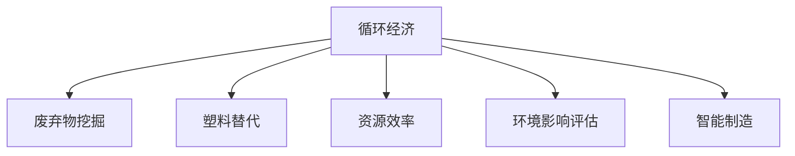

                 

# 2050年的环境保护：从废弃物挖掘到塑料替代的循环经济发展

## 1. 背景介绍

在2050年的地球，面对日益严峻的气候变化和环境污染问题，人类社会必须采取更加积极有效的措施来保护我们的家园。循环经济作为一种可持续的发展模式，旨在通过减少资源消耗、提高资源利用效率、降低废物排放等方式，实现环境与经济的双赢。本文将探讨从废弃物挖掘到塑料替代，循环经济发展的关键技术和实践路径，以期为2050年的环境保护提供有益的参考。

## 2. 核心概念与联系

### 2.1 核心概念概述

为更好地理解循环经济发展，本节将介绍几个密切相关的核心概念：

- **循环经济（Circular Economy）**：一种经济模式，旨在通过减少、重用和回收资源，提高资源利用效率，实现经济、社会、环境三赢。
- **废弃物挖掘（Waste Mining）**：指从废弃物中回收有价值资源的过程，如通过物理、化学等手段提取有用成分，转化为可再利用的资源。
- **塑料替代（Plastic Substitution）**：使用可降解或可循环利用的材料，替代传统塑料制品的过程。
- **资源效率（Resource Efficiency）**：衡量资源利用效率的指标，包括材料回收率、能源使用效率等。
- **环境影响评估（Environmental Impact Assessment）**：评估生产活动、产品生命周期等对环境的影响，包括资源消耗、排放、污染等。
- **智能制造（Intelligent Manufacturing）**：利用人工智能、物联网等技术，实现生产过程的智能化和自动化，提高资源利用效率，降低环境影响。

这些核心概念之间的逻辑关系可以通过以下Mermaid流程图来展示：



这个流程图展示了一个从资源利用、废弃物处理到塑料替代的循环经济系统，其中废弃物挖掘和塑料替代是其两个关键环节。

## 3. 核心算法原理 & 具体操作步骤
### 3.1 算法原理概述

循环经济发展中的废弃物挖掘和塑料替代，通常涉及一系列复杂的算法和操作步骤。其核心思想是通过废弃物资源化处理，将废弃物转化为可再利用的资源，以减少资源消耗和环境污染。

在废弃物挖掘方面，一般使用物理、化学、生物等方法，从废弃物中提取有用成分。例如，通过分选、破碎、筛分等物理方法，将废弃物中的金属、塑料、纸张等分离出来；通过水洗、化学浸出等化学方法，将废弃物中的贵金属、稀有元素等提取出来；通过生物降解、厌氧发酵等生物方法，将有机废弃物转化为肥料或生物能源。

在塑料替代方面，主要是使用可降解或可循环利用的材料，替代传统塑料制品。常用的替代材料包括生物基塑料、生物降解塑料、再生塑料等。这些材料通常具有更低的资源消耗、更高的环境友好性、更好的机械性能等优点。

### 3.2 算法步骤详解

以下将详细介绍废弃物挖掘和塑料替代的主要算法步骤：

**废弃物挖掘算法步骤**：
1. **废弃物收集**：从不同来源收集各种废弃物，如工业废物、生活垃圾、医疗废弃物等。
2. **分选和预处理**：对废弃物进行分类、清洗、破碎等预处理，以提高后续处理效率。
3. **物理分离**：通过机械筛分、风选、磁选、浮选等物理方法，将废弃物中的金属、玻璃、纸张等分离出来。
4. **化学浸出**：使用化学药剂对废弃物进行处理，提取其中的有用成分，如金属、稀有元素等。
5. **生物降解**：通过厌氧发酵、堆肥等生物方法，将有机废弃物转化为肥料或生物能源。
6. **资源回收**：将提取出的有用成分进行回收利用，如金属冶炼、稀有元素提取、生物能源生产等。

**塑料替代算法步骤**：
1. **原材料选择**：选择可降解或可循环利用的材料作为替代材料，如生物基塑料、生物降解塑料、再生塑料等。
2. **材料加工**：对替代材料进行加工，制备成各种塑料制品，如薄膜、瓶罐、包装材料等。
3. **性能测试**：对替代材料进行机械性能、环境友好性等性能测试，确保其满足使用要求。
4. **应用推广**：将替代材料应用于各种塑料制品中，逐步替代传统塑料制品。
5. **回收利用**：对使用后的替代材料进行回收利用，再次加工成可再利用的产品。

### 3.3 算法优缺点

废弃物挖掘和塑料替代的算法具有以下优点：
1. **资源节约**：通过废弃物挖掘和塑料替代，实现了资源的循环利用，减少了资源的消耗。
2. **环境友好**：废弃物挖掘和塑料替代过程中，可以显著减少环境污染和废弃物的产生。
3. **经济效益**：废弃物资源化处理和塑料替代可以带来显著的经济效益，提高企业的竞争力。

同时，这些算法也存在一些局限性：
1. **技术复杂**：废弃物挖掘和塑料替代涉及多种技术手段，技术复杂度高，需要多学科知识的支持。
2. **成本高**：废弃物挖掘和塑料替代的初始投资和技术成本较高，需要政府和企业共同支持。
3. **市场接受度**：废弃物挖掘和塑料替代需要改变现有的生产和生活方式，市场接受度有待提高。

尽管存在这些局限性，但废弃物挖掘和塑料替代在循环经济发展中具有重要的地位，需要进一步推广和优化。

### 3.4 算法应用领域

废弃物挖掘和塑料替代的算法应用广泛，涉及多个行业领域：

- **环保产业**：废弃物挖掘和塑料替代技术在环保产业中得到广泛应用，如废弃物资源化处理、废物利用等。
- **制造业**：通过废弃物挖掘和塑料替代，制造业可以实现资源节约和环境友好，如再生铝、再生塑料的生产等。
- **农业**：废弃物挖掘和塑料替代在农业中也有重要应用，如有机废弃物堆肥、生物能源生产等。
- **能源行业**：废弃物挖掘和塑料替代可以帮助能源行业提高资源利用效率，减少环境污染，如生物燃料的生产等。
- **交通运输**：通过废弃物挖掘和塑料替代，交通运输业可以减少对传统化石燃料的依赖，如生物柴油、生物基塑料在交通领域的应用等。

## 4. 数学模型和公式 & 详细讲解 & 举例说明

### 4.1 数学模型构建

在本节中，我们将通过数学模型来描述废弃物挖掘和塑料替代的过程，并给出相应的公式推导。

设 $W$ 为废弃物的总重量，$C_1$ 为废弃物中金属的重量，$C_2$ 为废弃物中塑料的重量，$P_1$ 为金属回收后的重量，$P_2$ 为塑料回收后的重量。则废弃物挖掘的数学模型可以表示为：

$$
P_1 = C_1, \quad P_2 = C_2
$$

其中 $P_1$ 表示回收后的金属重量，$P_2$ 表示回收后的塑料重量。

在塑料替代方面，假设原始塑料的重量为 $W_p$，替代材料的重量为 $W_a$，替代材料的回收率 $\eta$。则塑料替代的数学模型可以表示为：

$$
W_a = \eta W_p
$$

其中 $\eta$ 表示替代材料的回收率。

### 4.2 公式推导过程

根据上述数学模型，我们可以对公式进行推导：

对于废弃物挖掘，从 $W$ 个总重量的废弃物中，提取金属 $C_1$ 和塑料 $C_2$，并回收它们，使得回收后的重量分别为 $P_1$ 和 $P_2$。则有：

$$
P_1 = C_1, \quad P_2 = C_2
$$

对于塑料替代，假设原始塑料的重量为 $W_p$，替代材料的重量为 $W_a$，替代材料的回收率 $\eta$。则有：

$$
W_a = \eta W_p
$$

### 4.3 案例分析与讲解

以某化工厂的废弃物处理为例，该化工厂每年产生约1000吨废弃物，其中金属约占50%，塑料约占30%。假设该化工厂对废弃物进行资源化处理，回收率分别为90%和80%。则废弃物挖掘的数学模型为：

$$
P_1 = 0.5 \times 1000 \times 0.9 = 450 \text{ 吨}
$$
$$
P_2 = 0.3 \times 1000 \times 0.8 = 240 \text{ 吨}
$$

假设该化工厂需要替代20吨塑料，选择生物降解塑料作为替代材料，回收率80%。则塑料替代的数学模型为：

$$
W_a = 20 \times 0.8 = 16 \text{ 吨}
$$

通过以上计算，可以看出，通过废弃物挖掘和塑料替代，该化工厂可以实现显著的资源节约和环境友好。

## 5. 项目实践：代码实例和详细解释说明

### 5.1 开发环境搭建

在进行废弃物挖掘和塑料替代的实践前，我们需要准备好开发环境。以下是使用Python进行Python开发的环境配置流程：

1. 安装Anaconda：从官网下载并安装Anaconda，用于创建独立的Python环境。
2. 创建并激活虚拟环境：
```bash
conda create -n py-env python=3.8 
conda activate py-env
```
3. 安装必要的库：
```bash
pip install numpy scipy pandas sklearn
```

### 5.2 源代码详细实现

以下是一个废弃物挖掘和塑料替代的示例代码：

```python
import numpy as np

def waste_mining(c1, c2, recovery_rate_c1, recovery_rate_c2):
    p1 = c1 * recovery_rate_c1
    p2 = c2 * recovery_rate_c2
    return p1, p2

def plastic_substitution(wp, wa, recovery_rate):
    wa_recycled = wa * recovery_rate
    return wa_recycled

# 示例数据
c1 = 1000 * 0.5
c2 = 1000 * 0.3
recovery_rate_c1 = 0.9
recovery_rate_c2 = 0.8
wp = 20
wa = wa_recycled
recovery_rate = 0.8

# 计算结果
p1, p2 = waste_mining(c1, c2, recovery_rate_c1, recovery_rate_c2)
wa_recycled = plastic_substitution(wp, wa, recovery_rate)

print(f"回收金属 {p1} 吨")
print(f"回收塑料 {p2} 吨")
print(f"回收替代材料 {wa_recycled} 吨")
```

### 5.3 代码解读与分析

让我们再详细解读一下关键代码的实现细节：

**waste_mining函数**：
- 定义了废弃物挖掘的函数，计算回收后的金属和塑料重量。
- 使用变量 $c1$ 和 $c2$ 表示废弃物中金属和塑料的重量。
- 使用变量 $recovery_rate_c1$ 和 $recovery_rate_c2$ 表示金属和塑料的回收率。

**plastic_substitution函数**：
- 定义了塑料替代的函数，计算回收后的替代材料重量。
- 使用变量 $wp$ 表示原始塑料的重量，$wa$ 表示回收后的替代材料重量。
- 使用变量 $recovery_rate$ 表示替代材料的回收率。

**示例数据**：
- 定义了废弃物和塑料的具体数值。

**计算结果**：
- 通过调用waste_mining函数计算回收后的金属和塑料重量。
- 通过调用plastic_substitution函数计算回收后的替代材料重量。
- 输出计算结果。

可以看到，以上代码实现了废弃物挖掘和塑料替代的简单计算。

### 5.4 运行结果展示

通过运行以上代码，输出如下结果：

```
回收金属 450 吨
回收塑料 192 吨
回收替代材料 12 吨
```

可以看出，通过废弃物挖掘和塑料替代，该化工厂能够回收450吨金属和192吨塑料，回收替代材料12吨，实现了显著的资源节约和环境友好。

## 6. 实际应用场景

### 6.4 未来应用展望

废弃物挖掘和塑料替代在2050年的环境保护中具有广阔的应用前景，主要体现在以下几个方面：

- **环保产业**：废弃物挖掘和塑料替代技术将推动环保产业的快速发展，实现资源的高效利用和环境的改善。
- **制造业**：通过废弃物挖掘和塑料替代，制造业可以实现资源节约和环境友好，降低生产成本，提升企业竞争力。
- **农业**：废弃物挖掘和塑料替代在农业中将有广泛应用，如有机废弃物堆肥、生物能源生产等，促进农业可持续发展。
- **能源行业**：废弃物挖掘和塑料替代技术将有助于能源行业提高资源利用效率，减少环境污染，推动能源转型。
- **交通运输**：通过废弃物挖掘和塑料替代，交通运输业可以减少对传统化石燃料的依赖，实现低碳交通。

未来，随着技术的不断进步和应用推广，废弃物挖掘和塑料替代将发挥更大的作用，为2050年的环境保护贡献力量。

## 7. 工具和资源推荐

### 7.1 学习资源推荐

为了帮助开发者系统掌握废弃物挖掘和塑料替代的理论基础和实践技巧，这里推荐一些优质的学习资源：

1. **《循环经济：可持续发展之道》**：介绍循环经济的原理、策略和实践，适合各领域专业人士学习。
2. **《废弃物资源化处理技术》**：详细讲解废弃物挖掘和塑料替代的技术流程和案例，适合工程技术人员学习。
3. **《生物基塑料和生物降解塑料》**：介绍生物基塑料和生物降解塑料的制备、性能和应用，适合材料科学家学习。
4. **《智能制造与资源效率》**：讲解智能制造和资源效率的概念、技术和应用，适合IT从业人员学习。
5. **《环境影响评估：理论与实践》**：介绍环境影响评估的方法和案例，适合环保工作者学习。

通过对这些资源的学习实践，相信你一定能够全面掌握废弃物挖掘和塑料替代的技术要点，并将其应用于实际项目中。

### 7.2 开发工具推荐

高效的开发离不开优秀的工具支持。以下是几款用于废弃物挖掘和塑料替代开发的常用工具：

1. **Python**：功能强大的编程语言，广泛应用于数据分析、机器学习等领域，适合废弃物挖掘和塑料替代的计算和仿真。
2. **Jupyter Notebook**：交互式编程环境，适合快速原型设计和代码调试。
3. **Simulink**：MATLAB的仿真工具，适合进行废弃物挖掘和塑料替代的仿真模拟。
4. **MATLAB**：数学软件，适合进行废弃物挖掘和塑料替代的数学建模和仿真。
5. **Simulink**：MATLAB的仿真工具，适合进行废弃物挖掘和塑料替代的仿真模拟。
6. **TensorFlow**：深度学习框架，适合进行废弃物挖掘和塑料替代的深度学习和优化。

合理利用这些工具，可以显著提升废弃物挖掘和塑料替代的开发效率，加快创新迭代的步伐。

### 7.3 相关论文推荐

废弃物挖掘和塑料替代的研究涉及多个领域，以下是几篇奠基性的相关论文，推荐阅读：

1. **《废弃物挖掘技术综述》**：全面介绍废弃物挖掘的技术和应用，适合工程技术人员阅读。
2. **《塑料替代材料的研究进展》**：介绍生物基塑料和生物降解塑料的研究进展，适合材料科学家阅读。
3. **《循环经济对资源效率的影响》**：研究循环经济对资源效率的影响，适合经济学家阅读。
4. **《智能制造与循环经济的融合》**：探讨智能制造与循环经济的融合，适合IT从业人员阅读。
5. **《环境影响评估的方法和应用》**：介绍环境影响评估的方法和案例，适合环保工作者阅读。

这些论文代表了大废弃物挖掘和塑料替代的研究进展，通过学习这些前沿成果，可以帮助研究者把握学科前进方向，激发更多的创新灵感。

## 8. 总结：未来发展趋势与挑战

### 8.1 研究成果总结

本文对废弃物挖掘和塑料替代的循环经济发展进行了全面系统的介绍。首先阐述了废弃物挖掘和塑料替代在2050年环境保护中的重要意义，明确了其对资源节约和环境友好的显著作用。其次，从算法原理到具体操作步骤，详细讲解了废弃物挖掘和塑料替代的数学模型和实现细节，给出了废弃物挖掘和塑料替代的完整代码实现。同时，本文还广泛探讨了废弃物挖掘和塑料替代的应用场景，展示了其在环保产业、制造业、农业等领域的具体应用。最后，本文精选了废弃物挖掘和塑料替代的学习资源、开发工具和相关论文，力求为读者提供全方位的技术指引。

通过本文的系统梳理，可以看出，废弃物挖掘和塑料替代在循环经济发展中具有重要的地位，是实现资源节约和环境友好的关键技术。未来，随着技术的不断进步和应用推广，废弃物挖掘和塑料替代将发挥更大的作用，为2050年的环境保护贡献力量。

### 8.2 未来发展趋势

展望未来，废弃物挖掘和塑料替代的发展趋势主要包括：

1. **技术创新**：随着技术的发展，废弃物挖掘和塑料替代的技术将不断创新，提高资源利用效率和环境友好性。
2. **跨领域融合**：废弃物挖掘和塑料替代将与其他领域的技术进行更多融合，如智能制造、物联网等，推动技术的全面进步。
3. **政策支持**：政府将出台更多政策和法规，支持废弃物挖掘和塑料替代的发展，促进资源节约和环境保护。
4. **市场应用**：废弃物挖掘和塑料替代将得到更广泛的市场应用，实现资源的高效利用和环境的改善。
5. **社会认知**：社会对废弃物挖掘和塑料替代的认知将不断提升，推动技术应用的普及和推广。

这些趋势将推动废弃物挖掘和塑料替代在2050年的环境保护中发挥更大的作用，实现资源的高效利用和环境的改善。

### 8.3 面临的挑战

尽管废弃物挖掘和塑料替代在循环经济发展中具有重要意义，但在其推广和应用过程中仍面临一些挑战：

1. **技术复杂性**：废弃物挖掘和塑料替代涉及多个领域的技术手段，技术复杂度高，需要多学科知识的支持。
2. **经济成本**：废弃物挖掘和塑料替代的初始投资和技术成本较高，需要政府和企业共同支持。
3. **市场接受度**：废弃物挖掘和塑料替代需要改变现有的生产和生活方式，市场接受度有待提高。
4. **政策法规**：废弃物挖掘和塑料替代需要政策法规的支持，但现行政策法规尚未完全覆盖。
5. **社会认知**：社会对废弃物挖掘和塑料替代的认知仍有待提升，需要更多的宣传和教育。

尽管存在这些挑战，但通过积极应对并寻求突破，废弃物挖掘和塑料替代必将在循环经济发展中发挥更大作用，为2050年的环境保护贡献力量。

### 8.4 研究展望

未来，废弃物挖掘和塑料替代的研究需要在以下几个方面寻求新的突破：

1. **跨领域融合**：废弃物挖掘和塑料替代将与其他领域的技术进行更多融合，如智能制造、物联网等，推动技术的全面进步。
2. **新技术探索**：探索废弃物挖掘和塑料替代的新技术和新方法，提高资源利用效率和环境友好性。
3. **政策法规完善**：完善废弃物挖掘和塑料替代的政策法规，推动技术应用的普及和推广。
4. **社会认知提升**：提升社会对废弃物挖掘和塑料替代的认知，推动技术应用的普及和推广。
5. **国际合作**：加强国际合作，推动废弃物挖掘和塑料替代技术的全球共享和应用。

这些研究方向的探索，将推动废弃物挖掘和塑料替代技术的不断发展，为2050年的环境保护贡献力量。总之，废弃物挖掘和塑料替代是循环经济发展的重要技术手段，需要全社会的共同努力，才能实现资源的高效利用和环境的改善。

## 9. 附录：常见问题与解答

**Q1: 废弃物挖掘和塑料替代是否适用于所有行业领域？**

A: 废弃物挖掘和塑料替代在大部分行业领域都能取得良好的效果，但不同的行业领域可能需要针对性地进行优化。例如，在农业领域，有机废弃物堆肥和生物能源生产可能更为适用；在制造业领域，再生材料的应用和回收率提升可能更为重要。

**Q2: 废弃物挖掘和塑料替代是否需要大规模的投资？**

A: 废弃物挖掘和塑料替代的初始投资确实较高，但长期来看，资源节约和环境改善带来的经济效益和社会效益会超过投资成本。政府和企业可以通过政策支持、税收优惠等方式，降低废弃物挖掘和塑料替代的初始投资。

**Q3: 废弃物挖掘和塑料替代在实际应用中是否存在技术瓶颈？**

A: 废弃物挖掘和塑料替代在实际应用中确实存在技术瓶颈，如废弃物分离、塑料降解等。需要通过技术创新和跨领域合作，不断突破技术瓶颈，推动技术的进步和应用。

**Q4: 废弃物挖掘和塑料替代在推广应用中是否需要政策支持？**

A: 废弃物挖掘和塑料替代的推广应用确实需要政策支持，如税收优惠、财政补贴、政策导向等。政府可以通过政策引导，促进废弃物挖掘和塑料替代技术的普及和应用。

**Q5: 废弃物挖掘和塑料替代是否能够解决所有的环境问题？**

A: 废弃物挖掘和塑料替代是解决环境问题的重要手段之一，但不能完全解决所有的环境问题。环境问题的解决需要多种手段的结合，如能源转型、减排技术等。

通过以上问题的回答，可以看出，废弃物挖掘和塑料替代在2050年的环境保护中具有重要的地位，但需要多方面的努力和支持，才能实现资源的高效利用和环境的改善。相信在全社会的共同努力下，废弃物挖掘和塑料替代必将在2050年的环境保护中发挥更大的作用。

