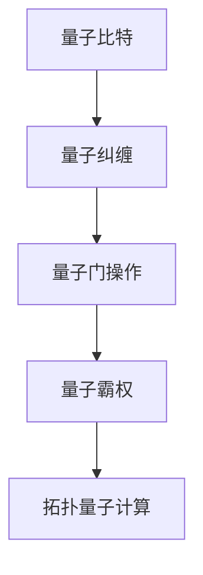

                 

# 2050年的量子计算：从量子优势到量子霸权的计算革命

## 1. 背景介绍

### 1.1 问题由来
量子计算是现代物理学与计算机科学的交叉前沿领域，其核心在于利用量子力学的原理，构建高效的量子计算机，以实现超越经典计算的计算能力。量子计算机被认为能够解决某些经典计算机无法处理的问题，如大整数分解、布尔可满足性问题等，从而在密码学、材料科学、化学计算等领域产生重大影响。

### 1.2 问题核心关键点
量子计算的研究已经历经数十年，从量子位概念的提出到近期的量子霸权实现，量子计算技术的进展引人注目。然而，量子计算技术在实际应用中仍面临诸多挑战，包括量子退相干、错误纠正、量子位数目限制等。本研究旨在探索量子计算的未来发展趋势，并分析量子计算技术在2050年可能带来的革命性变化。

## 2. 核心概念与联系

### 2.1 核心概念概述

为了深入理解量子计算的原理及其发展前景，首先介绍几个关键概念：

- **量子比特(Qubit)**：量子计算的基本单位，与经典计算中的比特(Bit)不同，量子比特能够同时处于0和1的叠加状态，从而实现并行计算。

- **量子纠缠**：两个或多个量子比特通过特定的操作关联在一起，即使它们相距遥远，也能瞬间影响对方的状态，为量子计算提供了强大的并行计算能力。

- **量子门操作**：量子计算中对量子比特进行的操作，类似于经典计算中的逻辑门操作，但更为复杂，需要考虑量子力学的干涉、测量等特性。

- **量子霸权(Qubit Supremacy)**：指量子计算机在特定任务上能够展现出超越经典计算机的计算能力，能够以量子优势处理经典计算无法处理的问题。

- **拓扑量子计算**：通过将量子比特的编码和操作转移到稳定的拓扑系统上，以避免量子退相干，从而实现更为稳定、可扩展的量子计算。

这些概念通过量子力学的理论框架相互联系，共同构成了量子计算的基础。

### 2.2 核心概念原理和架构的 Mermaid 流程图



这个流程图展示了量子计算的核心概念之间的相互关系：量子比特通过量子纠缠和量子门操作，实现量子霸权，而拓扑量子计算则是在量子霸权基础上，进一步提升量子计算的稳定性和可扩展性。

## 3. 核心算法原理 & 具体操作步骤
### 3.1 算法原理概述

量子计算的核心算法包括量子退相干校正、量子门操作、量子电路设计、量子纠缠生成等。这些算法通过利用量子力学的原理，实现对量子比特的精确操控和处理。

### 3.2 算法步骤详解

量子计算的算法步骤一般包括以下几个关键步骤：

**Step 1: 量子比特的初始化**
- 量子比特通过量子门操作初始化为0或1，或者叠加态的任意组合。

**Step 2: 量子门操作**
- 对量子比特进行各种量子门操作，如Hadamard门、CNOT门、旋转门等，改变量子比特的状态，实现量子计算。

**Step 3: 量子纠缠生成**
- 通过特定的量子操作，将多个量子比特纠缠在一起，实现量子并行计算。

**Step 4: 量子计算过程**
- 通过量子电路设计，对量子比特进行一系列的计算和测量，得到最终的计算结果。

**Step 5: 量子纠错和纠错码设计**
- 由于量子计算易受外界干扰，需要设计量子纠错码进行错误纠正，保证计算结果的准确性。

**Step 6: 量子霸权验证**
- 通过设计特定任务，如随机数生成、布尔可满足性问题等，验证量子计算机是否具备量子霸权。

这些步骤构成了量子计算的核心流程，通过对量子比特的精确操控和操作，实现超越经典计算的计算能力。

### 3.3 算法优缺点

量子计算具有以下优点：
1. 计算速度极快：量子计算能够并行处理大量数据，实现经典计算机无法处理的计算任务。
2. 解决特定问题能力突出：如大整数分解、布尔可满足性问题等。
3. 理论潜力巨大：量子计算提供了一种全新的计算模式，可能揭示物理学、数学等领域的新规律。

然而，量子计算也存在以下缺点：
1. 实现难度高：量子计算需要极端的环境条件，如超低温、低噪声等，实现成本高昂。
2. 量子退相干问题：量子比特容易受到外界干扰，计算结果容易出错。
3. 技术成熟度低：量子计算理论完善，但实际应用技术仍处于早期阶段。

### 3.4 算法应用领域

量子计算技术目前已经在物理化学、材料科学、密码学、人工智能等领域展现出一定的应用前景。例如：

- 材料科学：通过量子计算模拟分子结构和反应过程，加速新材料的研发。
- 化学计算：利用量子计算模拟化学反应，优化化学合成路线。
- 密码学：研究量子密钥分发和量子加密算法，提升信息安全。
- 人工智能：探索量子神经网络和量子机器学习，提升机器学习算法的性能。

## 4. 数学模型和公式 & 详细讲解 & 举例说明

### 4.1 数学模型构建

量子计算的数学模型基于量子力学的原理，主要包括以下几个关键部分：

- **希尔伯特空间**：描述量子系统的数学空间，通过向量表示量子比特的状态。
- **密度矩阵**：描述量子系统的状态，通过矩阵表示量子比特的概率分布。
- **薛定谔方程**：描述量子系统的演化方程，通过偏微分方程表示量子比特的变化。

### 4.2 公式推导过程

以下是量子计算中常用的几个公式：

1. **量子叠加态公式**
   $$
   |\psi\rangle = \alpha|0\rangle + \beta|1\rangle
   $$
   其中，$\alpha$ 和 $\beta$ 为复数，满足 $|\alpha|^2 + |\beta|^2 = 1$。

2. **量子门操作公式**
   $$
   U|\psi\rangle = |\psi'\rangle
   $$
   其中，$U$ 为量子门操作，$|\psi\rangle$ 为输入态，$|\psi'\rangle$ 为输出态。

3. **量子纠缠公式**
   $$
   |\psi\rangle = \alpha|00\rangle + \beta|11\rangle
   $$
   其中，两个量子比特处于纠缠状态。

### 4.3 案例分析与讲解

以Shor算法为例，分析其计算大整数分解的原理。

Shor算法利用量子叠加态和量子四元组变换，能够在多项式时间内解决经典计算中需要指数时间解决的大整数分解问题。其基本步骤如下：

1. 对输入的大整数 $N$ 进行因式分解。
2. 利用量子叠加态，对 $N$ 的因数进行概率分布的测量。
3. 通过量子四元组变换，实现因数化的量子计算。

通过Shor算法，量子计算机能够在大整数分解问题上展现出超越经典计算机的计算能力，为密码学等领域带来重大影响。

## 5. 项目实践：代码实例和详细解释说明

### 5.1 开发环境搭建

在进行量子计算的实践前，需要准备相应的开发环境。以下是使用Python进行Qiskit开发的Python环境配置流程：

1. 安装Anaconda：从官网下载并安装Anaconda，用于创建独立的Python环境。

2. 创建并激活虚拟环境：
```bash
conda create -n qiskit-env python=3.8 
conda activate qiskit-env
```

3. 安装Qiskit：
```bash
pip install qiskit
```

4. 安装各类工具包：
```bash
pip install numpy scipy sympy matplotlib jupyter notebook ipython
```

完成上述步骤后，即可在`qiskit-env`环境中开始量子计算的实践。

### 5.2 源代码详细实现

下面是使用Qiskit实现Shor算法的Python代码实现：

```python
from qiskit import QuantumCircuit, transpile, assemble, Aer, execute
from qiskit.visualization import plot_histogram, plot_bloch_multivector
from sympy import pi

# 定义量子电路
circ = QuantumCircuit(2, 2)

# 初始化量子比特
circ.h(0)

# 添加量子门操作
circ.cx(0, 1)

# 测量量子比特
circ.measure([0, 1], [0, 1])

# 绘制量子电路
circ.draw()

# 模拟量子计算
simulator = Aer.get_backend('qasm_simulator')
job = execute(circ, simulator, shots=1024)
result = job.result()

# 获取量子计算结果
counts = result.get_counts(circ)
print(counts)

# 绘制量子计算结果
plot_histogram(counts)
```

### 5.3 代码解读与分析

让我们再详细解读一下关键代码的实现细节：

** QuantumCircuit类**：
- `__init__`方法：初始化量子电路，并指定量子比特数和测量数。
- `add_gate`方法：添加各种量子门操作。
- `draw`方法：绘制量子电路。

**quantum比特**：
- 通过`h`门操作，实现量子比特的叠加态。
- 通过`cx`门操作，实现量子比特的纠缠。

**量子测量**：
- 通过`measure`方法，实现量子比特的测量，并将测量结果保存。

**模拟量子计算**：
- 使用`Aer.get_backend`方法，获取模拟器的后端。
- 使用`execute`方法，执行量子电路计算。
- 使用`result.get_counts`方法，获取量子计算结果。

**量子计算结果**：
- 通过`plot_histogram`方法，绘制量子计算结果的直方图。

可以看到，Qiskit提供的API非常直观，通过简单的代码操作，便能够实现复杂的量子计算任务。开发者可以利用这些API，快速迭代研究新的量子计算算法。

## 6. 实际应用场景

### 6.1 量子通信

量子通信是量子计算的重要应用方向之一，通过利用量子纠缠和量子测量，实现安全的量子密钥分发。量子通信具有极高的安全性和抗干扰性，能够抵御传统计算中的破解攻击。

### 6.2 量子优化

量子优化算法能够解决经典算法难以处理的优化问题，如旅行商问题、物流配送等。通过量子计算的并行性和量子门操作，量子优化算法能够在多项式时间内找到最优解，大幅提高计算效率。

### 6.3 量子模拟

量子模拟能够模拟复杂的量子系统，如量子点、分子结构等。通过量子计算的叠加态和纠缠态，量子模拟能够在短时间内计算出大量计算资源无法处理的问题，加速科学研究和实验验证。

### 6.4 未来应用展望

量子计算技术的未来发展方向包括：

- **量子霸权实现**：进一步提升量子计算机的计算能力和稳定性，实现量子霸权。
- **拓扑量子计算**：通过拓扑量子计算，提高量子计算的稳定性和可扩展性。
- **量子网络**：构建量子互联网，实现量子通信、量子计算的广泛应用。
- **量子智能**：研究量子神经网络，提升机器学习和人工智能的性能。

量子计算技术的未来发展，将深刻影响科技、经济、社会等各个方面，带来全新的计算革命。

## 7. 工具和资源推荐
### 7.1 学习资源推荐

为了帮助开发者系统掌握量子计算的理论基础和实践技巧，这里推荐一些优质的学习资源：

1. 《量子计算入门》系列博文：由量子计算专家撰写，深入浅出地介绍了量子计算的基本原理、核心算法和应用场景。

2. 《量子计算原理》书籍：作者为量子计算领域的权威人士，系统讲解了量子计算的理论基础和关键技术。

3. Qiskit官方文档：Qiskit作为量子计算的主流工具，提供了丰富的学习资源和样例代码，是量子计算学习的重要参考资料。

4. IBM Q Experience：IBM提供的在线量子计算平台，能够免费使用IBM的量子计算机，进行量子计算实验和研究。

5. Quantum Computing Specialization课程：由MIT教授开设的量子计算课程，通过Coursera平台提供，适合希望系统学习量子计算的初学者。

通过对这些资源的学习实践，相信你一定能够快速掌握量子计算的精髓，并用于解决实际的量子计算问题。

### 7.2 开发工具推荐

高效的开发离不开优秀的工具支持。以下是几款用于量子计算开发的常用工具：

1. Qiskit：由IBM开发的量子计算框架，提供丰富的API和工具支持，是量子计算开发的主流工具。

2. Cirq：由Google开发的量子计算框架，易于使用，适合进行复杂的量子电路设计。

3. OpenQASM：一种用于描述量子计算的高级编程语言，能够方便地编写和执行量子程序。

4. IBM Q System One：IBM提供的量子计算机硬件平台，支持远程访问和量子计算实验。

5. Rigetti Computing：一家专门从事量子计算的公司，提供量子计算机硬件和开发平台。

合理利用这些工具，可以显著提升量子计算的开发效率，加快创新迭代的步伐。

### 7.3 相关论文推荐

量子计算技术的发展离不开学界的持续研究。以下是几篇奠基性的相关论文，推荐阅读：

1. Quantum Computer Science: Quantum Algorithms and Quantum Complexity by Scott Aaronson：介绍了量子计算的基本概念、核心算法和复杂度理论。

2. Quantum Computation and Quantum Information by Michael A. Nielsen and Isaac L. Chuang：介绍了量子计算的理论基础和关键技术，是量子计算领域的经典教材。

3. Quantum Supremacy and Beyond: Power of Near-Term Quantum Devices by John Preskill：介绍了量子霸权的概念、实现路径和未来展望。

4. Topological Quantum Computation by Michael A. Nielsen and Isaac L. Chuang：介绍了拓扑量子计算的原理和实现方法。

5. Quantum Algorithms for Differential Equations by Matteo Frasca：介绍了量子计算在微分方程求解中的应用。

这些论文代表了大量子计算技术的发展脉络。通过学习这些前沿成果，可以帮助研究者把握学科前进方向，激发更多的创新灵感。

## 8. 总结：未来发展趋势与挑战

### 8.1 总结

本文对量子计算的理论基础和实际应用进行了全面系统的介绍。首先阐述了量子计算的基本概念和核心原理，明确了量子计算在科学计算、密码学、优化等领域的重要价值。其次，从原理到实践，详细讲解了量子计算的数学模型和关键步骤，给出了量子计算任务开发的完整代码实例。同时，本文还广泛探讨了量子计算技术的未来发展趋势和应用前景，展示了量子计算技术的广阔前景。最后，本文精选了量子计算技术的各类学习资源，力求为读者提供全方位的技术指引。

通过本文的系统梳理，可以看到，量子计算技术在21世纪末叶正处于快速发展阶段，即将迎来从量子优势到量子霸权的计算革命。这一变革将深刻影响人类社会的科技、经济、社会等各个方面，带来全新的计算能力、安全性和计算模式。未来，伴随量子计算技术的不断演进，其应用领域将更加广泛，将对人类社会产生更加深远的影响。

### 8.2 未来发展趋势

展望未来，量子计算技术将呈现以下几个发展趋势：

1. 量子计算机规模不断增大。随着算力成本的下降和数据规模的扩张，量子计算机的规模将持续增长，计算能力将不断提升。

2. 量子计算应用领域不断扩展。量子计算将逐渐从科学计算、密码学等专业领域，扩展到金融、医疗、物流等广泛应用场景。

3. 量子计算技术不断成熟。量子计算将从实验室阶段走向实用化，技术成熟度不断提升，计算能力和稳定性不断增强。

4. 量子计算硬件不断优化。量子计算硬件将不断优化，如量子位数的增加、量子纠错能力的提升等，为量子计算的实际应用提供坚实基础。

5. 量子通信网络逐渐成熟。量子通信网络将逐渐构建，实现量子计算的广泛应用和信息的安全传输。

以上趋势凸显了量子计算技术的广阔前景。这些方向的探索发展，必将进一步提升量子计算的计算能力和应用范围，为人类认知智能的进化带来深远影响。

### 8.3 面临的挑战

尽管量子计算技术已经取得了重大进展，但在迈向更加智能化、普适化应用的过程中，仍面临诸多挑战：

1. 实现难度高。量子计算需要极端的环境条件，如超低温、低噪声等，实现成本高昂。

2. 量子退相干问题。量子比特容易受到外界干扰，计算结果容易出错。

3. 技术成熟度低。量子计算技术仍在早期阶段，需要更多的研究积累和实践验证。

4. 量子算法复杂。量子算法设计复杂，需要更高的理论和实践水平。

5. 量子计算安全问题。量子计算可能被用于破解传统加密算法，需要新的量子安全加密技术。

6. 量子计算伦理问题。量子计算可能带来新的伦理问题，如隐私泄露、信息滥用等，需要严格的法律和道德约束。

这些挑战需要研究者共同努力，积极应对并寻求突破，才能实现量子计算技术的广泛应用。

### 8.4 研究展望

面对量子计算面临的种种挑战，未来的研究需要在以下几个方面寻求新的突破：

1. 探索新型的量子位和量子门。开发更加稳定、高效的量子位和量子门操作，提高量子计算的可靠性和计算速度。

2. 研究量子纠错和量子纠错码。设计更加高效的量子纠错码，保证量子计算的稳定性和可靠性。

3. 融合经典计算和量子计算。探索经典计算和量子计算的混合计算模型，实现优势互补，提升计算效率。

4. 研究量子计算网络。构建大规模量子计算网络，实现量子通信和量子计算的广泛应用。

5. 研究量子计算伦理和安全问题。建立量子计算伦理和安全的规范，确保量子计算的安全性和可控性。

这些研究方向的探索，必将引领量子计算技术迈向更高的台阶，为构建安全、可靠、可控的智能系统铺平道路。面向未来，量子计算技术还需要与其他人工智能技术进行更深入的融合，如量子神经网络、量子机器学习等，多路径协同发力，共同推动自然语言理解和智能交互系统的进步。只有勇于创新、敢于突破，才能不断拓展量子计算的边界，让智能技术更好地造福人类社会。

## 9. 附录：常见问题与解答

**Q1：量子计算和经典计算有什么区别？**

A: 量子计算和经典计算的本质区别在于信息处理的单位和处理方式。经典计算使用比特(Bit)，每个比特只能处于0或1的状态；而量子计算使用量子比特(Qubit)，量子比特可以同时处于0和1的叠加状态，实现了并行计算。

**Q2：量子计算的核心算法有哪些？**

A: 量子计算的核心算法包括量子霸权、量子搜索算法、Shor算法、量子蒙特卡罗算法等。这些算法利用量子力学的特性，实现了超越经典计算的计算能力。

**Q3：量子计算的实现难度为何如此之高？**

A: 量子计算的实现难度主要在于量子比特的稳定性和环境控制。量子比特容易受到外界干扰，如温度、电磁辐射等，导致量子退相干。因此，实现量子计算需要极端的环境条件和先进的技术手段。

**Q4：量子计算的应用前景有哪些？**

A: 量子计算的应用前景非常广阔，包括科学计算、密码学、优化问题、药物设计、材料研究等领域。通过量子计算，能够实现经典计算无法处理的计算任务，加速科学研究和工业生产。

**Q5：如何应对量子计算的伦理和安全问题？**

A: 量子计算的伦理和安全问题需要从多个方面进行应对：

1. 量子安全加密技术：开发新的量子安全加密算法，保证信息传输的安全性。
2. 量子计算伦理规范：建立量子计算的伦理规范和标准，确保算法的可控性和合法性。
3. 量子计算透明性：提高量子计算的透明性，确保算法的可解释性和可审计性。

这些措施能够有效应对量子计算带来的伦理和安全问题，确保其应用的安全性和合法性。

---

作者：禅与计算机程序设计艺术 / Zen and the Art of Computer Programming

