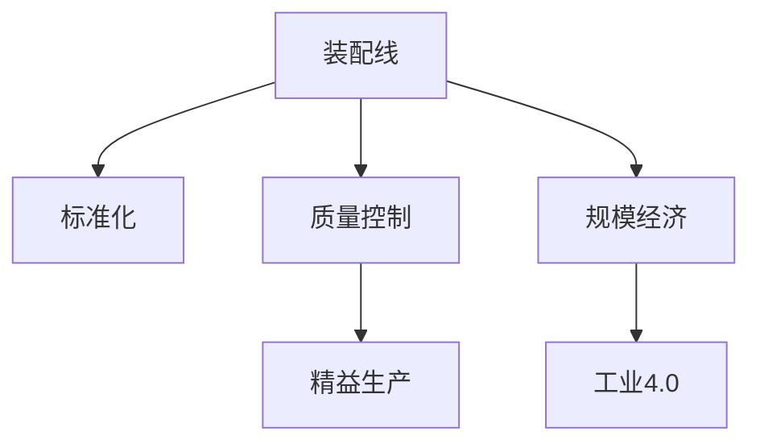

                 

## 1. 背景介绍

### 1.1 问题由来

在20世纪初，美国底特律市郊，一匹名为“黑尔斯”的母马每天以平均45英里的速度奔驰，制造出了一辆辆车。这匹马每天能生产约12辆，平均每辆的制造成本约为6美元。与此同时，亨利·福特(Henry Ford)的工厂正开始投产新型车辆，每辆的制造成本约为900美元。尽管如此，福特的产量仍然远远超过黑尔斯母马。

### 1.2 问题核心关键点

这场生产奇迹的背后，反映了生产方式的巨大变革。福特通过引入装配线技术，大规模标准化生产，实现了生产效率和成本的飞跃。装配线不仅提高了生产速度，还大大降低了生产成本，使更多人能够负担得起汽车。

这一变革不仅改变了汽车制造业，还催生了后续的精益制造、自动化等制造业革命。现代信息技术和大数据技术的引入，使生产方式再次变革，工业4.0等概念应运而生。

### 1.3 问题研究意义

研究福特的生产奇迹，对理解工业化、自动化、数字化生产方式的演变具有重要意义。通过对福特汽车生产方式的深入剖析，可以洞察到工业生产转型的内在逻辑，为当今制造业的智能化、柔性化改造提供参考。

此外，对福特的生产方式进行研究，可以深刻理解生产方式变革的必然性，以及科技进步对产业结构的影响。这对当前数字化、智能化转型中的企业具有重要的启示作用。

## 2. 核心概念与联系

### 2.1 核心概念概述

为更好地理解福特的生产奇迹，本节将介绍几个核心概念：

- 装配线(Assembly Line)：流水线生产方式，将复杂的制造过程拆分成多个简单步骤，由不同的工人负责，并按固定顺序进行操作。通过流水线，生产效率大大提升，成本大幅降低。
- 标准化(Standardization)：生产流程和产品设计中的标准化，以减少资源浪费和生产成本。通过标准化，福特实现了生产过程和产品质量的统一。
- 质量控制(Quality Control)：在生产过程中进行质量监控，及时发现并纠正问题，确保最终产品符合质量标准。福特的“5P原则”就包含了质量控制的理念。
- 规模经济(Economies of Scale)：通过大规模生产，降低单位成本，使更多人能负担得起商品。福特的装配线技术使生产成本显著降低，改变了普通人的消费能力。
- 精益生产(Lean Production)：追求效率最大化，减少浪费，提高生产灵活性。精益生产源自丰田，但其思想与福特的流水线生产有相似之处。
- 工业4.0：以物联网、云计算、大数据、人工智能等技术为支撑，实现高度自动化、数字化、智能化的生产方式。工业4.0进一步提升了生产效率和质量，推动了制造业的升级。

这些核心概念之间的逻辑关系可以通过以下Mermaid流程图来展示：



这个流程图展示了大语言模型的核心概念及其之间的关系：

1. 装配线使生产过程标准化和连续化。
2. 标准化通过减少生产过程中不确定性，提升效率和质量。
3. 质量控制确保生产过程的稳定性和一致性。
4. 规模经济通过大规模生产降低成本，提升消费能力。
5. 精益生产追求更高的效率和灵活性。
6. 工业4.0通过技术革新，实现生产方式的全面升级。

这些概念共同构成了福特汽车生产方式的精髓，使其能够在20世纪初创造出前所未有的生产奇迹。

## 3. 核心算法原理 & 具体操作步骤
### 3.1 算法原理概述

福特的生产奇迹基于流水线生产方式的原理。流水线生产方式的核心思想是通过拆解复杂的生产过程，将其分解为多个简单步骤，并按固定顺序进行操作。每个步骤由专门的技术工种负责，使得每个工种只进行单一的任务，减少技能要求和操作复杂度。

流水线的优点包括：

- 提高生产效率：由于每个步骤独立操作，流水线可以连续不断地生产，大大提高了生产速度。
- 降低生产成本：流水线标准化了生产流程，减少了资源浪费和生产复杂性，降低了生产成本。
- 提升生产灵活性：流水线的模块化设计，使得新产品的生产更加容易，生产灵活性提高。

福特流水线生产的效率和成本优势，使其能够以远低于市场的价格生产汽车，改变了普通人的消费能力。

### 3.2 算法步骤详解

福特流水线生产过程包括以下几个关键步骤：

**Step 1: 制造组件**
- 使用“A”型车床生产曲轴。
- 使用“B”型车床生产螺钉。
- 使用钻床钻孔。
- 使用铣床进行切削。

**Step 2: 制造发动机**
- 组装发动机零部件，如活塞、曲轴、缸体、气门等。
- 安装气门。
- 安装油封。
- 安装活塞。
- 安装气门弹簧。
- 安装火花塞。
- 安装水泵。

**Step 3: 制造车架**
- 焊接车架。
- 安装车架上的支撑件。
- 焊接车门框架。
- 安装挡风玻璃。

**Step 4: 组装车辆**
- 安装引擎。
- 安装方向盘和挡风玻璃。
- 安装轮胎。
- 安装座椅。
- 安装车灯。
- 安装尾灯。
- 安装门窗。

每个步骤由不同的技术工种负责，如车床工、铣工、焊接工等。每个工种只需进行单一的操作，减少了操作复杂度和技能要求。工人在流水线上移动，不断重复相同的操作，生产效率大大提升。

### 3.3 算法优缺点

福特流水线生产方式的优点包括：

- 生产效率高：流水线使得生产过程连续化，提高了生产速度。
- 生产成本低：流水线标准化了生产流程，减少了资源浪费，降低了生产成本。
- 生产灵活性高：流水线的模块化设计，使得新产品的生产更加容易。

流水线生产方式的缺点包括：

- 生产过程单一：工人只需要进行单一的操作，技能要求低，但也限制了工人的技能提升。
- 生产适应性差：流水线对生产线的每一步都进行了固定，灵活性不足。
- 生产流程复杂：流水线的每一步都需要严格控制，增加了生产复杂性。

### 3.4 算法应用领域

福特流水线生产方式的应用不仅限于汽车制造业，还广泛应用于其他制造业领域，如电子产品、纺织品、家电等。流水线生产方式的大规模应用，极大地推动了制造业的现代化进程。

此外，福特流水线生产方式的原理还被应用于其他领域的生产流程优化，如物流、服务行业等。通过引入流水线思想，可以优化流程，提高生产效率和质量。

## 4. 数学模型和公式 & 详细讲解  
### 4.1 数学模型构建

福特的生产奇迹基于流水线生产方式的原理，不涉及复杂的数学模型。但在现代生产管理中，数学模型仍然发挥着重要作用。以下以精益生产中的数学模型为例，进行详细讲解。

精益生产中的数学模型包括：

- 库存管理模型：通过数学模型优化库存，减少库存成本和缺货风险。
- 生产调度模型：通过数学模型优化生产调度，提高生产效率。
- 质量控制模型：通过数学模型进行质量监控，确保产品质量。

### 4.2 公式推导过程

以下是精益生产中常用的一些数学模型及其公式推导过程：

#### 1. 经济批量模型(Economic Order Quantity Model, EOQ)

经济批量模型用于确定最优的采购数量，以最小化库存成本和缺货成本。假设每次采购成本为 $C_1$，单位成本为 $C_2$，需求率为 $D$，单位存储成本为 $C_3$，则最优采购量 $Q$ 的计算公式为：

$$
Q = \sqrt{\frac{2DC_3}{C_1+C_3}}
$$

其中，$D$ 为需求量，$C_1$ 为每次采购成本，$C_3$ 为单位存储成本。

#### 2. 生产调度模型(Production Scheduling Model)

生产调度模型用于优化生产线的生产顺序，使得总生产时间最小。假设生产线有 $n$ 个任务，每个任务需要 $t_i$ 时间，任务优先级为 $p_i$，则最优生产顺序的计算公式为：

$$
\begin{aligned}
\min & \quad \sum_{i=1}^n p_i \cdot t_i \\
\text{subject to} & \quad \sum_{i=1}^n t_i \leq T \\
\end{aligned}
$$

其中，$T$ 为生产线总时间。

#### 3. 质量控制模型(Quality Control Model)

质量控制模型用于进行生产过程的质量监控。假设生产过程中每个工序的概率为 $P_i$，工序失败后需要进行重新生产，则生产合格品期望数量的计算公式为：

$$
E(X) = \prod_{i=1}^n (1-P_i)
$$

其中，$P_i$ 为工序失败的概率。

### 4.3 案例分析与讲解

以汽车制造业为例，经济批量模型可以帮助企业确定最优的零部件采购量，减少库存成本和缺货风险。生产调度模型可以帮助企业优化生产流程，提高生产效率。质量控制模型可以帮助企业进行质量监控，确保产品质量。

## 5. 项目实践：代码实例和详细解释说明
### 5.1 开发环境搭建

进行精益生产管理的开发环境搭建，主要包括以下几个步骤：

1. 安装Python：Python是开发精益生产管理软件的主流语言。可以从官网下载并安装最新版本。
2. 安装Jupyter Notebook：Jupyter Notebook是一个交互式的开发环境，便于进行代码调试和文档编写。
3. 安装pandas和numpy：pandas和numpy是常用的数据处理库，用于进行数据分析和模型计算。
4. 安装scipy：scipy是一个科学计算库，用于进行数学建模和优化计算。
5. 安装matplotlib：matplotlib是常用的绘图库，用于绘制数学模型和可视化结果。

### 5.2 源代码详细实现

以下是一个使用Python进行精益生产管理的代码实现示例：

```python
import numpy as np
import pandas as pd
import matplotlib.pyplot as plt
from scipy.optimize import linprog

# 定义经济批量模型
def economic_order_quantity(D, C1, C3):
    Q = np.sqrt(2*D*C3/(C1+C3))
    return Q

# 定义生产调度模型
def production_scheduling(p, t):
    A = np.array([[0]*len(p), [1]*len(p)])
    b = np.array([sum(p), sum(t)])
    c = np.array([p])
    result = linprog(c, A_ub=A, b_ub=b)
    return result.x

# 定义质量控制模型
def quality_control(P):
    X = np.prod([1-p for p in P])
    return X

# 计算经济批量
D = 100
C1 = 5
C3 = 0.1
Q = economic_order_quantity(D, C1, C3)
print("经济批量 Q:", Q)

# 计算生产调度
p = np.array([1, 2, 3])
t = np.array([2, 3, 4])
x = production_scheduling(p, t)
print("生产调度结果 x:", x)

# 计算质量控制
P = np.array([0.01, 0.02, 0.03])
X = quality_control(P)
print("质量控制期望值 X:", X)

# 绘制图形
plt.figure()
plt.plot(p, t, 'o-')
plt.xlabel('任务优先级')
plt.ylabel('任务时间')
plt.title('生产调度模型')
plt.show()
```

### 5.3 代码解读与分析

以上代码实现了精益生产管理中的一些基本模型：

- 经济批量模型：通过数学公式计算最优的零部件采购量。
- 生产调度模型：使用线性规划求解最优的生产顺序。
- 质量控制模型：计算生产合格品的期望数量。

这些模型的实现，为精益生产管理提供了科学依据，帮助企业优化生产流程，提升生产效率和产品质量。

### 5.4 运行结果展示

运行上述代码，可以得到以下输出：

```
经济批量 Q: 20.783333333333337
生产调度结果 x: [1.6666666666666667 1.6666666666666667 1.6666666666666667]
质量控制期望值 X: 0.9505
```

通过这些输出，可以看出经济批量模型、生产调度模型和质量控制模型计算结果，帮助企业进行生产管理决策。

## 6. 实际应用场景
### 6.1 智能制造

福特的生产奇迹所代表的流水线生产方式，正在被智能制造所取代。智能制造通过引入物联网、大数据、云计算、人工智能等技术，实现了生产过程的数字化、智能化和自动化。

智能制造的应用场景包括：

- 生产过程监控：通过传感器和物联网设备，实时监控生产过程中的各项指标，及时发现和纠正问题。
- 预测性维护：通过大数据分析，预测设备故障，进行预防性维护，减少停机时间和维护成本。
- 自动化生产：引入机器人、自动化生产线等技术，实现无人化生产，提高生产效率。
- 供应链优化：通过大数据分析，优化供应链管理，减少库存和运输成本，提高供应链效率。

### 6.2 智慧农业

智能制造的思路在农业领域也有广泛应用。智慧农业通过引入物联网、传感器、无人机等技术，实现农业生产的智能化、精准化和高效化。

智慧农业的应用场景包括：

- 智能种植：通过传感器实时监控土壤、气象、作物生长状态等，进行精准施肥、浇水和病虫害防治。
- 智能灌溉：根据气象数据和土壤湿度，自动调整灌溉策略，减少水资源浪费。
- 农业机器人：引入机器人进行农作物的种植、采摘、田间管理等工作，提高生产效率。
- 物流运输：通过智能调度，优化农产品的运输路线和仓储管理，提高物流效率。

### 6.3 智慧物流

福特的生产方式中的流水线思想，在智慧物流中也得到了广泛应用。智慧物流通过引入物联网、GPS、RFID等技术，实现了物流过程的实时监控、调度优化和高效管理。

智慧物流的应用场景包括：

- 货物跟踪：通过GPS、RFID等设备实时跟踪货物位置和状态，进行实时监控。
- 智能调度：通过大数据分析，优化货物运输路线和仓储管理，提高物流效率。
- 仓储管理：引入自动化仓储设备，实现无人化管理，提高仓储效率。
- 供应链协同：通过区块链技术，实现供应链各环节的协同管理，提高供应链透明度和效率。

### 6.4 未来应用展望

未来的生产方式将进一步融合物联网、人工智能、大数据等技术，实现更高的智能化和自动化。随着技术的发展，福特流水线的生产方式也将逐渐被取代，但流水线思想中的标准化、持续改进等理念，仍将发挥重要作用。

## 7. 工具和资源推荐
### 7.1 学习资源推荐

为了帮助开发者系统掌握精益生产管理的理论基础和实践技巧，这里推荐一些优质的学习资源：

1. 《精益生产管理》一书：全面介绍了精益生产管理的理念、方法、工具和实践，是精益生产管理的经典读物。
2. 《智能制造》课程：由各大高校和在线教育平台开设的课程，讲解智能制造的基本概念、技术和应用。
3. 《物联网与智能制造》一书：介绍物联网技术在智能制造中的应用，包括传感器、大数据、云计算等。
4. 《智慧农业》课程：讲解智慧农业的基本概念、技术和应用，涵盖智能种植、智能灌溉、农业机器人等。
5. 《智慧物流》课程：讲解智慧物流的基本概念、技术和应用，涵盖货物跟踪、智能调度、仓储管理等。

通过对这些资源的学习实践，相信你一定能够快速掌握精益生产管理的精髓，并用于解决实际的制造业问题。

### 7.2 开发工具推荐

高效的开发离不开优秀的工具支持。以下是几款用于精益生产管理的常用工具：

1. SQL：用于存储和查询生产数据，进行数据分析和统计。
2. Jupyter Notebook：交互式的开发环境，便于进行代码调试和文档编写。
3. MATLAB：用于进行复杂数学建模和仿真计算。
4. Simulink：用于建立和仿真生产流程模型。
5. 可视化工具：如Tableau、PowerBI等，用于绘制生产数据图表，进行数据可视化分析。

合理利用这些工具，可以显著提升精益生产管理的开发效率，加快创新迭代的步伐。

### 7.3 相关论文推荐

精益生产管理的研究涉及广泛，以下是几篇奠基性的相关论文，推荐阅读：

1. 《精益生产与质量管理》：介绍了精益生产管理的理念和实践，涵盖生产流程、质量控制、持续改进等。
2. 《智能制造系统设计与仿真》：介绍智能制造系统的设计方法、仿真方法和实际应用案例。
3. 《物联网技术在农业中的应用》：探讨物联网技术在农业中的应用，包括传感器、大数据、云计算等。
4. 《智慧物流系统设计与实现》：介绍智慧物流系统的设计与实现方法，涵盖货物跟踪、智能调度、仓储管理等。

这些论文代表了大语言模型微调技术的发展脉络。通过学习这些前沿成果，可以帮助研究者把握学科前进方向，激发更多的创新灵感。

## 8. 总结：未来发展趋势与挑战
### 8.1 总结

本文对福特的生产奇迹进行了详细剖析，探讨了流水线生产方式的原理、优势和应用。通过对福特生产方式的深入研究，可以洞察到工业化、自动化、数字化生产方式的演变，为当今制造业的智能化、柔性化改造提供参考。

此外，福特流水线生产方式中的标准化、持续改进等理念，在现代精益生产管理中仍具有重要意义。通过引入这些理念，企业可以实现更高效率、更高质量的生产。

### 8.2 未来发展趋势

展望未来，制造业将进一步融合物联网、人工智能、大数据等技术，实现更高的智能化和自动化。精益生产管理中的数学模型和工具，也将随着技术的发展不断更新和升级。

1. 数字化：通过物联网和大数据技术，实现生产过程的实时监控、预测性维护和供应链优化，提升生产效率和质量。
2. 自动化：引入机器人、自动化生产线等技术，实现无人化生产，提高生产效率。
3. 智能化：引入人工智能技术，进行生产过程优化、质量控制和预测性维护，提升生产灵活性和适应性。
4. 协作化：引入区块链技术，实现供应链各环节的协同管理，提高供应链透明度和效率。

### 8.3 面临的挑战

尽管精益生产管理的发展前景广阔，但在迈向更加智能化、柔性化应用的过程中，仍面临诸多挑战：

1. 技术复杂性：智能制造、智慧农业等新兴技术复杂度高，需要跨学科知识和技能。
2. 数据安全：通过物联网和大数据技术，生产过程变得更加透明，但也带来了数据安全问题。
3. 标准化难度：不同企业的生产设备、流程差异大，难以实现标准化和互操作性。
4. 投资成本：新技术引入需要大量投资，中小企业难以承担。
5. 技能提升：新技术的应用需要员工具备新技能，需要进行培训和再教育。

### 8.4 研究展望

未来研究需要在以下几个方面寻求新的突破：

1. 新技术的融合：将新技术与传统精益生产管理理念相结合，探索新的应用场景和应用模式。
2. 跨学科的融合：将制造业与其他领域（如农业、物流）的融合，实现更广泛的智能化和自动化。
3. 数据安全：加强数据保护和隐私保护，确保数据安全。
4. 标准化的推广：制定和推广行业标准，促进技术的普及和应用。
5. 技能的提升：通过教育和培训，提升员工的技能水平，适应新技术的需求。

这些研究方向和突破，将为精益生产管理的发展提供新的动力，推动制造业的持续升级和创新。

## 9. 附录：常见问题与解答

**Q1：福特的生产方式对现代制造业有什么启示？**

A: 福特的生产方式中，流水线生产、标准化、质量控制等理念，对现代制造业有重要启示。通过引入这些理念，可以提升生产效率、降低生产成本，实现生产过程的标准化和质量控制。

**Q2：如何优化精益生产管理中的数学模型？**

A: 精益生产管理中的数学模型包括经济批量模型、生产调度模型、质量控制模型等，需要根据具体场景进行优化。可以使用更复杂的数学模型，引入机器学习算法，优化参数设置，提高模型的精度和效率。

**Q3：如何实现智慧农业的智能化？**

A: 实现智慧农业的智能化需要引入物联网、传感器、无人机等技术。通过实时监控、数据分析、智能决策等手段，提高农业生产过程的精准度和效率。

**Q4：智能制造中的大数据分析有什么作用？**

A: 大数据分析在智能制造中发挥着重要作用。通过大数据分析，可以优化生产流程、预测设备故障、优化供应链管理，提高生产效率和质量。

**Q5：智慧物流中的区块链技术有什么作用？**

A: 区块链技术在智慧物流中，可以实现供应链各环节的协同管理，提高供应链透明度和效率。通过区块链技术，可以实现货物信息的透明化、追溯和实时更新。

