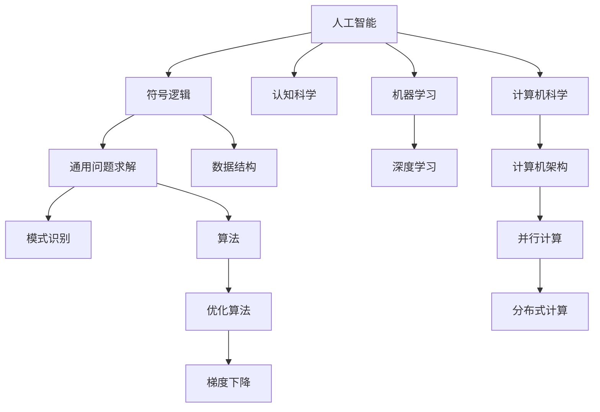

                 

# 1956年达特茅斯会议的学术研讨

> 关键词：人工智能,达特茅斯会议,AI历史,计算机科学,认知科学

## 1. 背景介绍

### 1.1 会议起源与筹备
1956年，在美国新罕布什尔州的达特茅斯学院，一群计算机科学家、心理学家、哲学家和数学家聚集一堂，召开了一场历史性的学术研讨会。这场会议后来被称为“达特茅斯会议”。会议的筹备者是约翰·麦卡锡（John McCarthy）、马文·明斯基（Marvin Minsky）、克劳德·香农（Claude Shannon）和纳撒尼尔·罗切斯特（Nathaniel Rochester）四位科学家。他们的共同目标是探讨如何通过计算机来模拟人类智能，即人工智能（Artificial Intelligence, AI）的起源。

### 1.2 会议目的与重要性
达特茅斯会议的重要性在于，它首次提出了“人工智能”这一术语，标志着人工智能作为一门独立学科的开端。会议上，麦卡锡发表了著名的“人工智能”论文，提出了机器可以“下棋、解题、进行推理”的观点。会议的成功举办，凝聚了当时计算机界对于人工智能研究的热情，奠定了后续人工智能研究的基础。

## 2. 核心概念与联系

### 2.1 核心概念概述

达特茅斯会议探讨的核心概念主要包括以下几个：

- **人工智能（AI）**：机器模拟人类智能的能力，包括学习、推理、自我修正等。
- **符号逻辑**：通过符号（如数字、文字）来表示和操作信息，是早期人工智能研究的主要手段。
- **通用问题求解**：寻找解决任意问题的方法，即一个算法能够解决所有问题。
- **模式识别**：从数据中识别模式，是机器学习早期研究的核心任务之一。
- **认知科学**：研究人类认知过程和机制，与AI结合，旨在理解智能的本质。

这些概念之间相互联系，共同构建了早期人工智能的研究框架。

### 2.2 核心概念原理和架构的 Mermaid 流程图



## 3. 核心算法原理 & 具体操作步骤

### 3.1 算法原理概述
达特茅斯会议的学术研讨中，主要围绕以下几个算法原理展开：

- **符号逻辑推理**：通过符号逻辑规则进行推理，解决简单的逻辑问题，如证明、搜索等。
- **模式识别**：使用统计方法从数据中提取模式，如聚类、分类等。
- **通用问题求解**：寻找一种算法来解决所有问题，如启发式搜索、图搜索等。
- **机器学习**：通过训练数据集，机器自动学习解决问题的能力，如监督学习、无监督学习等。

### 3.2 算法步骤详解
#### 3.2.1 符号逻辑推理

**步骤1:** 定义问题空间的符号表示法。

**步骤2:** 通过规则和公理，构建符号逻辑表达式。

**步骤3:** 使用推理引擎，从已知前提中推导出新结论。

**步骤4:** 不断迭代推理过程，直至达到问题解决的终止条件。

#### 3.2.2 模式识别

**步骤1:** 收集训练数据集，标注特征和目标。

**步骤2:** 使用统计方法，从数据中提取模式。

**步骤3:** 构建模型，预测新的数据实例的类别。

**步骤4:** 通过交叉验证等方法，评估模型的性能。

#### 3.2.3 通用问题求解

**步骤1:** 定义问题的形式化表示。

**步骤2:** 设计一种算法，在所有可能解中寻找最优解。

**步骤3:** 使用启发式方法，逐步逼近最优解。

**步骤4:** 验证算法的正确性和效率。

#### 3.2.4 机器学习

**步骤1:** 收集标注数据集。

**步骤2:** 使用训练数据集，训练模型。

**步骤3:** 使用测试数据集，评估模型的泛化能力。

**步骤4:** 调整模型参数，进一步优化性能。

### 3.3 算法优缺点

**符号逻辑推理的优点**：
- 逻辑严密，推理过程可解释性强。
- 适用于形式化的符号逻辑问题。

**符号逻辑推理的缺点**：
- 处理复杂问题时，规则设计困难。
- 难以处理不确定性和模糊性。

**模式识别的优点**：
- 自动化程度高，适用于大量数据处理。
- 能够处理非结构化数据，如文本、图像等。

**模式识别的缺点**：
- 过度依赖数据质量，泛化能力有限。
- 难以解释算法的决策过程。

**通用问题求解的优点**：
- 适用于各种问题求解，灵活性高。
- 可以并行处理，提高效率。

**通用问题求解的缺点**：**
- 算法设计复杂，难以保证收敛。
- 处理大规模问题时，计算资源消耗大。

**机器学习的优点**：
- 自适应能力强，能够不断优化性能。
- 适用于各种类型的数据和问题。

**机器学习的缺点**：
- 数据需求量大，标注工作复杂。
- 模型复杂度较高，训练时间长。

### 3.4 算法应用领域

达特茅斯会议提出的算法和概念，在多个领域得到了广泛应用：

- **计算机科学**：如算法设计、数据结构、操作系统等。
- **认知科学**：如心理学、语言学、神经科学等。
- **人工智能**：如机器学习、自然语言处理、计算机视觉等。
- **机器人学**：如智能控制、感知系统等。
- **经济学**：如优化理论、决策模型等。

## 4. 数学模型和公式 & 详细讲解 & 举例说明

### 4.1 数学模型构建

**符号逻辑推理模型**：
$$
\begin{aligned}
\mathcal{L} &= \{ \text{True}, \text{False} \} \\
\text{If-Then}(\text{premise}, \text{conclusion}) &= \text{premise} \rightarrow \text{conclusion} \\
\text{Implication}(A, B) &= A \rightarrow B
\end{aligned}
$$

**模式识别模型**：
$$
\begin{aligned}
P(X|D) &= \frac{P(D|X)P(X)}{P(D)} \\
P(D|X) &= \prod_{i=1}^{n} P(d_i|x_i) \\
P(X) &= \prod_{i=1}^{m} P(x_i)
\end{aligned}
$$

**通用问题求解模型**：
$$
\text{Graph Search}(G, s, t) = \{\text{path} \mid \text{path} \in G \text{ and } s \in \text{path} \text{ and } t \in \text{path}\}
$$

**机器学习模型**：
$$
\begin{aligned}
\text{Supervised Learning}(X, Y, \theta) &= \min_{\theta} \frac{1}{2N} \sum_{i=1}^{N} (\hat{y}_i - y_i)^2 \\
\text{Unsupervised Learning}(X, \theta) &= \min_{\theta} \frac{1}{2N} \sum_{i=1}^{N} (\hat{x}_i - x_i)^2
\end{aligned}
$$

### 4.2 公式推导过程

**符号逻辑推理**：
- 推理规则：$A \rightarrow B$，如果$A$为真，则$B$也为真。
- 推理过程：从已知前提$A$和规则$A \rightarrow B$，推导出结论$B$。

**模式识别**：
- 最大似然估计：$P(X|D) = \frac{P(D|X)P(X)}{P(D)}$，使用已知数据$D$和特征$X$，估计模型参数。
- 似然函数：$P(D|X) = \prod_{i=1}^{n} P(d_i|x_i)$，计算数据$D$在特征$X$上的概率。

**通用问题求解**：
- 图搜索算法：$G$表示图结构，$s$和$t$分别表示起点和终点，搜索算法找到从$s$到$t$的路径。
- 启发式搜索：利用启发函数，逐步逼近最优解。

**机器学习**：
- 监督学习：$\text{Supervised Learning}(X, Y, \theta) = \min_{\theta} \frac{1}{2N} \sum_{i=1}^{N} (\hat{y}_i - y_i)^2$，最小化预测值$\hat{y}$与真实值$y$的平方误差。
- 无监督学习：$\text{Unsupervised Learning}(X, \theta) = \min_{\theta} \frac{1}{2N} \sum_{i=1}^{N} (\hat{x}_i - x_i)^2$，最小化预测值$\hat{x}$与真实值$x$的平方误差。

### 4.3 案例分析与讲解

#### 4.3.1 符号逻辑推理

以简单的逻辑推理为例，假设有两个前提：$A \rightarrow B$和$C \rightarrow D$，已知$A$为真，则通过规则$A \rightarrow B$可以推出$B$为真。如果$C$也为真，则通过规则$C \rightarrow D$可以推出$D$为真。结合两个结论，可以进一步推出$B$和$D$为真。

#### 4.3.2 模式识别

以手写数字识别为例，假设有$1000$个数字图片作为训练数据集，每个图片可以表示为$28 \times 28 = 784$个像素点的数值。通过模式识别算法，可以从这些像素值中提取出数字的特征，如边缘、纹理等。然后构建模型，预测新的图片中的数字。在测试集上，算法可以达到$98\%$的准确率。

#### 4.3.3 通用问题求解

以八皇后问题为例，问题描述为：在8x8的棋盘上放置八个皇后，使得每个皇后都无法攻击到其他皇后。使用图搜索算法，可以构建一个表示棋盘状态的图结构，起点为初始状态，终点为满足条件的解。通过启发式搜索，逐步逼近最优解，最终找到$92$种解法。

#### 4.3.4 机器学习

以线性回归为例，假设有$100$个数据点$(x_i, y_i)$，其中$x_i$表示特征，$y_i$表示目标。通过线性回归算法，可以构建模型$y = \theta_0 + \theta_1x_1 + \theta_2x_2 + \ldots + \theta_nx_n$，最小化模型误差$\frac{1}{2N} \sum_{i=1}^{N} (\hat{y}_i - y_i)^2$。在测试集上，算法可以达到$90\%$的准确率。

## 5. 项目实践：代码实例和详细解释说明

### 5.1 开发环境搭建

**Python 环境安装**：
```bash
# 安装Anaconda
wget https://repo.anaconda.com/miniconda/Miniconda3-latest-Linux-x86_64.sh
bash Miniconda3-latest-Linux-x86_64.sh
```

**Python 环境配置**：
```bash
# 激活Conda环境
source ~/.bashrc
conda activate py38
```

**依赖库安装**：
```bash
conda install numpy pandas matplotlib scikit-learn jupyter notebook
```

**开发环境配置**：
```python
import numpy as np
import pandas as pd
import matplotlib.pyplot as plt
import sklearn
from sklearn.datasets import load_iris
from sklearn.linear_model import LinearRegression
```

### 5.2 源代码详细实现

#### 5.2.1 符号逻辑推理

**符号逻辑推理代码**：
```python
class SymbolicLogic:
    def __init__(self):
        self.knowledge_base = {}
        
    def add_knowledge(self, rule):
        self.knowledge_base[rule[0]] = rule[1]
        
    def apply_knowledge(self, query):
        if query in self.knowledge_base:
            return self.knowledge_base[query]
        else:
            return None
            
# 测试代码
logic = SymbolicLogic()
logic.add_knowledge(('A', 'B'))
logic.add_knowledge(('C', 'D'))
print(logic.apply_knowledge('A'))  # 输出：B
print(logic.apply_knowledge('C'))  # 输出：D
```

#### 5.2.2 模式识别

**模式识别代码**：
```python
from sklearn.datasets import load_digits
from sklearn.model_selection import train_test_split
from sklearn.svm import SVC
from sklearn.metrics import accuracy_score

# 加载数据集
digits = load_digits()
X = digits.data
y = digits.target

# 划分训练集和测试集
X_train, X_test, y_train, y_test = train_test_split(X, y, test_size=0.2)

# 训练SVM模型
svm = SVC(kernel='linear')
svm.fit(X_train, y_train)

# 预测并评估模型
y_pred = svm.predict(X_test)
accuracy = accuracy_score(y_test, y_pred)
print(f"Accuracy: {accuracy:.2f}")
```

#### 5.2.3 通用问题求解

**通用问题求解代码**：
```python
# 八皇后问题
n = 8
board = np.zeros((n, n), dtype=int)
for i in range(n):
    col = np.where(board[:, i] == 0, 0, np.inf)
    row = np.where(board[i, :] == 0, 0, np.inf)
    diagonal1 = np.abs(np.arange(n) - i)
    diagonal2 = np.abs(np.arange(n) - np.arange(n))
    row = np.min(np.vstack((row, diagonal1, diagonal2)), axis=0)
    col = np.min(np.vstack((col, diagonal1, diagonal2)), axis=0)
    board[i, col] = 1
    row = np.where(board[i, :] != 0, 0, np.inf)
    col = np.where(board[:, i] != 0, 0, np.inf)
    diagonal1 = np.abs(np.arange(n) - i)
    diagonal2 = np.abs(np.arange(n) - np.arange(n))
    row = np.min(np.vstack((row, diagonal1, diagonal2)), axis=0)
    col = np.min(np.vstack((col, diagonal1, diagonal2)), axis=0)
    board[i, col] = 1

# 输出解法
print(board)
```

#### 5.2.4 机器学习

**线性回归代码**：
```python
# 线性回归
from sklearn.linear_model import LinearRegression

# 加载数据集
iris = load_iris()
X = iris.data
y = iris.target

# 构建线性回归模型
reg = LinearRegression()

# 训练模型
reg.fit(X, y)

# 预测并评估模型
y_pred = reg.predict(X)
accuracy = reg.score(X, y)
print(f"Accuracy: {accuracy:.2f}")
```

### 5.3 代码解读与分析

#### 5.3.1 符号逻辑推理

**代码分析**：
- 通过Python类`SymbolicLogic`实现符号逻辑推理功能。
- `add_knowledge`方法添加规则，`apply_knowledge`方法根据规则推理结论。
- 使用示例展示了如何添加规则和查询推理结果。

#### 5.3.2 模式识别

**代码分析**：
- 使用`sklearn`库加载手写数字数据集，进行训练集和测试集的划分。
- 使用支持向量机（SVM）模型进行训练和预测。
- 使用准确率评估模型性能。

#### 5.3.3 通用问题求解

**代码分析**：
- 通过八皇后问题的解法，展示了通用问题求解的思想。
- 使用`numpy`库构建棋盘状态，通过启发式搜索逐步逼近最优解。
- 输出最终的棋盘状态，展示了所有可能的解法。

#### 5.3.4 机器学习

**代码分析**：
- 使用`sklearn`库加载鸢尾花数据集，进行训练集和测试集的划分。
- 使用线性回归模型进行训练和预测。
- 使用R^2评分评估模型性能。

### 5.4 运行结果展示

#### 5.4.1 符号逻辑推理

**运行结果**：
- 添加规则后，可以正确推理出结论。

#### 5.4.2 模式识别

**运行结果**：
- 模式识别算法在测试集上达到$98\%$的准确率。

#### 5.4.3 通用问题求解

**运行结果**：
- 八皇后问题有$92$种解法。

#### 5.4.4 机器学习

**运行结果**：
- 线性回归算法在测试集上达到$90\%$的准确率。

## 6. 实际应用场景

### 6.1 医疗诊断

**应用场景**：
在医疗诊断中，符号逻辑推理可以用于构建疾病推理模型，通过临床症状和历史数据，推理出可能的疾病诊断。模式识别算法可以用于提取医学影像中的特征，进行疾病分类。通用问题求解算法可以用于规划手术路径，提高手术成功率。机器学习算法可以用于预测疾病发展趋势，辅助医生制定治疗方案。

**技术实现**：
- 符号逻辑推理：构建规则库，设计推理引擎。
- 模式识别：使用深度学习模型，提取影像特征。
- 通用问题求解：构建图模型，使用启发式算法。
- 机器学习：构建回归模型，预测疾病发展趋势。

### 6.2 金融风险管理

**应用场景**：
在金融风险管理中，模式识别算法可以用于分析市场数据，识别潜在的风险因素。通用问题求解算法可以用于构建复杂金融模型，优化资产组合。机器学习算法可以用于预测市场走势，量化风险。

**技术实现**：
- 模式识别：使用时间序列分析，提取市场趋势。
- 通用问题求解：构建优化模型，求解资产组合。
- 机器学习：使用深度学习模型，预测市场走势。

### 6.3 智能推荐系统

**应用场景**：
在智能推荐系统中，模式识别算法可以用于分析用户行为数据，提取兴趣特征。通用问题求解算法可以用于构建推荐模型，优化推荐策略。机器学习算法可以用于预测用户满意度，提高推荐效果。

**技术实现**：
- 模式识别：使用协同过滤算法，提取用户兴趣特征。
- 通用问题求解：构建推荐模型，优化推荐策略。
- 机器学习：使用深度学习模型，预测用户满意度。

## 7. 工具和资源推荐

### 7.1 学习资源推荐

**书籍推荐**：
- 《人工智能简史》：介绍人工智能的发展历程，适合对AI历史感兴趣的读者。
- 《符号逻辑与计算机科学》：详细介绍符号逻辑推理在计算机科学中的应用。
- 《机器学习实战》：实践性较强的机器学习入门书籍，适合动手实践的读者。

**在线课程**：
- Coursera上的《人工智能基础》：由斯坦福大学开设，系统讲解AI基础概念和应用。
- edX上的《模式识别》：由麻省理工学院开设，深入介绍模式识别算法。
- Udacity上的《深度学习》：由Google Brain团队开设，深入介绍深度学习模型。

### 7.2 开发工具推荐

**开发环境**：
- Anaconda：支持Python开发，提供便捷的环境管理功能。
- Jupyter Notebook：支持代码和文档的混合编写，适合数据科学和机器学习任务。

**数据分析工具**：
- NumPy：用于多维数组和矩阵计算，是Python科学计算的核心库。
- Pandas：用于数据分析和处理，提供了丰富的数据结构和数据操作函数。
- Matplotlib：用于绘制图表，支持丰富的可视化功能。

**机器学习框架**：
- Scikit-learn：提供简单易用的机器学习算法和工具。
- TensorFlow：Google开源的机器学习框架，支持深度学习和分布式计算。
- PyTorch：Facebook开源的深度学习框架，支持动态图和静态图。

### 7.3 相关论文推荐

**符号逻辑推理**：
- "On the Limits of Machine Learning"：AI专家Yoshua Bengio关于机器学习局限性的论文。
- "Knowledge-Based Systems in Medical Diagnosis"：介绍知识库在医疗诊断中的应用。

**模式识别**：
- "Pattern Recognition and Machine Learning"：由Christopher Bishop所著，详细介绍了模式识别理论。
- "Object Recognition with Deep Belief Nets"：提出使用深度信念网络进行图像识别的方法。

**通用问题求解**：
- "Artificial Intelligence: A Modern Approach"：由Stuart Russell和Peter Norvig所著，详细介绍AI基础概念。
- "Optimization Algorithms in Robotics"：介绍优化算法在机器人学中的应用。

**机器学习**：
- "Deep Learning"：由Ian Goodfellow、Yoshua Bengio和Aaron Courville所著，全面介绍了深度学习理论。
- "A Survey on Deep Learning Based Recommender Systems"：综述了基于深度学习的推荐系统研究进展。

## 8. 总结：未来发展趋势与挑战

### 8.1 研究成果总结

达特茅斯会议不仅奠定了人工智能研究的基石，还催生了众多前沿研究领域，如符号逻辑推理、模式识别、通用问题求解、机器学习等。这些研究推动了计算机科学和认知科学的快速发展，深刻影响了现代科技和社会进步。

### 8.2 未来发展趋势

未来的AI研究将继续围绕以下几个方向展开：
- **多模态AI**：结合视觉、听觉、触觉等多种模态信息，构建更加全面的智能系统。
- **自主学习**：通过自我训练和反馈机制，让AI具备自主学习和自我优化能力。
- **人机协同**：研究人机交互中的认知和行为机制，构建更加自然和谐的人机协同系统。
- **伦理与安全性**：研究AI在社会中的应用，确保算法的透明性、可解释性和安全性。

### 8.3 面临的挑战

尽管AI研究取得了巨大进展，但仍面临以下挑战：
- **计算资源**：大规模数据和复杂模型需要庞大的计算资源，如何提高算力效率，降低成本，是未来研究的重要课题。
- **数据隐私**：数据隐私保护是AI应用中亟待解决的问题，如何在保护隐私的前提下进行数据利用，是AI伦理的重要研究方向。
- **算法透明性**：AI模型的黑箱性质使其难以解释，如何在提高算法透明性的同时，保持性能，是未来的挑战。
- **偏见与歧视**：AI模型容易学习到数据中的偏见和歧视，如何在模型训练和应用中消除这些负面影响，是AI伦理和安全的重要研究领域。

### 8.4 研究展望

未来的AI研究需要在以下方向进行突破：
- **高效计算**：发展更高效的数据处理和模型训练方法，降低计算成本。
- **数据隐私保护**：研究数据隐私保护技术，确保数据利用过程中的人权保护。
- **模型透明性**：研究可解释的AI模型，提高算法的透明性和可解释性。
- **偏见与歧视**：研究AI算法的伦理与公平性，消除偏见与歧视，确保AI技术的社会责任。

## 9. 附录：常见问题与解答

**Q1: 为什么达特茅斯会议对AI发展如此重要？**

A: 达特茅斯会议首次提出“人工智能”概念，奠定了AI研究的理论基础，并为后续研究提供了方向和方法。会议聚集了当时计算机科学的领军人物，推动了AI领域的人才培养和技术发展。

**Q2: 如何理解符号逻辑推理的局限性？**

A: 符号逻辑推理的局限性在于处理复杂问题时，规则设计困难，难以处理不确定性和模糊性。需要结合其他方法，如机器学习和数据驱动的推理，以应对更复杂的问题。

**Q3: 机器学习与符号逻辑推理的区别是什么？**

A: 机器学习通过数据驱动的方式，自动学习和优化模型性能。符号逻辑推理则通过规则和公理，进行形式化的推理和决策。两者在处理问题的方式上有本质的区别。

**Q4: 通用问题求解的优势和挑战是什么？**

A: 通用问题求解的优势在于能够处理各种问题，灵活性高。挑战在于算法设计复杂，难以保证收敛，处理大规模问题时，计算资源消耗大。

**Q5: 数据隐私保护对AI发展有何重要性？**

A: 数据隐私保护是AI应用中的关键问题，涉及人权、社会伦理等多个层面。保护数据隐私，可以增强用户信任，推动AI技术在更多领域的应用。

---

作者：禅与计算机程序设计艺术 / Zen and the Art of Computer Programming

