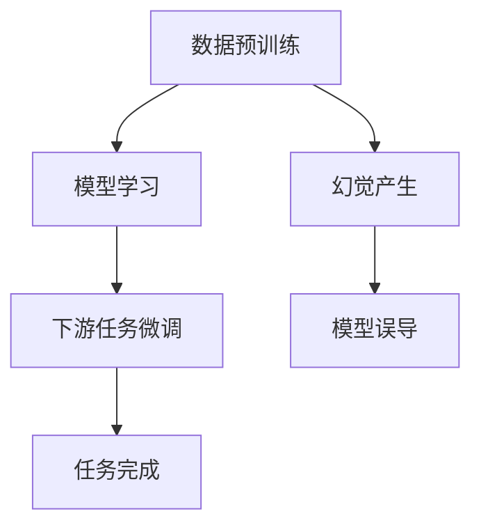

                 

# 幻觉来自数据预训练数据

## 1. 背景介绍

### 1.1 问题由来

在当今数据驱动的人工智能(AI)时代，数据预训练技术成为了许多AI模型的核心，特别是在自然语言处理(NLP)和计算机视觉(CV)等领域。数据预训练通常指的是在大规模无标签数据集上对模型进行预训练，学习通用的表示，然后在下游任务上微调以获得特定任务的性能。然而，尽管数据预训练在很多情况下取得了显著的成功，但也常常引发人们对于数据预训练中"幻觉"现象的担忧。

"幻觉"是指模型在训练过程中，学习到了数据的非真实特征，而不是任务的真实本质。这种非真实特征可能导致模型在特定情况下产生误导性的行为。例如，在一个分类任务中，模型可能学会了数据集的统计特性，如数据分布的峰值、偏度等，而忽略了数据本身的实际特征。当这些统计特性发生改变时，模型可能会失效。

### 1.2 问题核心关键点

为更深入地理解数据预训练中的幻觉现象，本节将详细介绍其产生机制、影响以及如何应对。

- **幻觉产生机制**：模型在数据预训练过程中，倾向于学习数据集中的统计特性而非任务的真实特征。
- **幻觉影响**：幻觉可能导致模型在特定情况下产生误导性的行为，从而影响下游任务的性能。
- **应对方法**：通过改进预训练方法、增强模型鲁棒性和引入先验知识等手段，降低幻觉的影响。

## 2. 核心概念与联系

### 2.1 核心概念概述

数据预训练技术的核心在于利用大规模无标签数据，对模型进行预训练，学习到通用的表示。这种表示可以被看作是对任务的真实特征的一种抽象和近似。然而，当数据集中存在幻觉时，模型可能无法正确地学习任务的真实特征，导致模型行为失真。

### 2.2 核心概念原理和架构的 Mermaid 流程图



这个流程图展示了数据预训练过程的核心步骤：模型在数据预训练阶段学习通用的表示，可能受到幻觉的影响；在微调阶段，模型试图将这些表示适配到下游任务，从而可能产生误导性的行为。

## 3. 核心算法原理 & 具体操作步骤
### 3.1 算法原理概述

数据预训练的幻觉现象通常产生于以下两个原因：

1. **数据分布偏见**：预训练数据集可能存在分布偏差，导致模型学习到非真实的特征。例如，数据集中某个类别的样本数量远多于其他类别，模型可能会在学习过程中忽略其他类别的特征。

2. **训练过程中的误导性信号**：在预训练过程中，模型可能会学到一些误导性的信号，如数据的统计特性，而不是任务的真实特征。例如，模型可能会学习到某些特定数据点的分布特性，而这些特性并不适用于所有情况。

### 3.2 算法步骤详解

为避免数据预训练中的幻觉现象，通常采取以下步骤：

1. **数据平衡处理**：在预训练数据集中，确保每个类别有足够的样本数，避免某类别样本过少导致模型学习到不平衡的特征。

2. **引入对抗性训练**：在预训练过程中，加入对抗性样本，使模型更加鲁棒，减少对数据的统计特性依赖。

3. **使用先验知识**：在预训练过程中，引入先验知识，如领域知识、专家规则等，指导模型学习，避免学习到非真实的特征。

4. **多任务学习**：同时训练多个相关但不同的任务，使得模型学习到更加通用的表示，减少对特定数据分布的依赖。

5. **数据预处理**：在预训练之前，对数据进行去噪、归一化等预处理，去除数据中的非真实特征，提高模型的泛化能力。

### 3.3 算法优缺点

数据预训练的幻觉现象是双刃剑：

**优点**：

1. **模型泛化能力强**：预训练模型在各种数据分布上通常具有良好的泛化能力，能够处理多样化的输入数据。

2. **提升微调效率**：预训练模型在下游任务上的微调通常需要更少的样本数，提升模型的微调效率。

**缺点**：

1. **数据分布偏见**：预训练数据集的分布偏见可能导致模型学习到非真实的特征，影响模型的泛化能力。

2. **模型复杂度高**：大规模数据预训练可能导致模型参数量大，训练和推理复杂度高。

3. **对抗性强**：对抗性训练的引入可能使得模型在特定情况下产生误导性行为，增加模型调优的难度。

### 3.4 算法应用领域

数据预训练技术在NLP、CV、推荐系统等领域得到了广泛应用。

- **NLP**：用于预训练BERT、GPT等语言模型，提升其在文本分类、情感分析、问答系统等任务上的性能。
- **CV**：用于预训练ResNet、VGG等图像模型，提升其在图像分类、目标检测、图像生成等任务上的性能。
- **推荐系统**：用于预训练协同过滤模型，提升推荐系统的准确性和多样性。

## 4. 数学模型和公式 & 详细讲解 & 举例说明

### 4.1 数学模型构建

数据预训练的数学模型通常基于深度学习框架，如神经网络。以BERT为例，其数学模型构建如下：

$$
\mathcal{L}_{BERT}(\theta) = \sum_{i=1}^{N}\left( -\sum_{j=1}^{V}\log p(x_j|x_{1:i-1};\theta) \right)
$$

其中，$x_{1:i-1}$表示输入序列的前$i$个单词，$x_j$表示第$j$个单词，$V$表示词汇表的大小，$\theta$表示模型参数，$p(x_j|x_{1:i-1};\theta)$表示给定输入序列，输出单词$x_j$的概率。

### 4.2 公式推导过程

假设预训练数据集为$\{(x_i,y_i)\}_{i=1}^N$，其中$x_i$为输入序列，$y_i$为标签。数据预训练的损失函数为：

$$
\mathcal{L}_{pretrain}(\theta) = -\frac{1}{N}\sum_{i=1}^N\log p(x_i;\theta)
$$

其中，$p(x_i;\theta)$表示给定输入序列$x_i$，模型输出概率。

在微调阶段，假设下游任务为分类任务，其损失函数为：

$$
\mathcal{L}_{finetune}(\theta) = -\frac{1}{N}\sum_{i=1}^N\log p(y_i|x_i;\theta)
$$

其中，$p(y_i|x_i;\theta)$表示给定输入序列$x_i$和标签$y_i$，模型输出的概率。

### 4.3 案例分析与讲解

以BERT模型为例，其在预训练阶段使用了语言建模任务，学习通用的语言表示。然而，当模型应用于特定领域时，可能受到领域数据分布的影响，学习到非真实的特征。

例如，假设BERT模型在金融领域进行微调，但在预训练数据集中，金融领域的数据样本较少，导致模型在学习过程中可能过度关注其他领域的特征，从而产生幻觉。

## 5. 项目实践：代码实例和详细解释说明

### 5.1 开发环境搭建

在使用Python进行BERT微调时，需要先安装相关的库和工具：

```bash
pip install torch transformers
```

然后，创建一个虚拟环境，激活并运行Jupyter Notebook：

```bash
conda create -n bert-notebook python=3.8
conda activate bert-notebook
jupyter notebook
```

### 5.2 源代码详细实现

以下是一个使用BERT模型进行金融领域微调的示例代码：

```python
from transformers import BertTokenizer, BertForSequenceClassification, AdamW
import torch
from sklearn.model_selection import train_test_split

# 加载BERT预训练模型和分词器
model = BertForSequenceClassification.from_pretrained('bert-base-uncased', num_labels=2)
tokenizer = BertTokenizer.from_pretrained('bert-base-uncased')

# 加载金融领域数据集
train_data, test_data = train_test_split(gfinance_data, test_size=0.2, random_state=42)
train_labels = train_data['label']
test_labels = test_data['label']

# 构建训练集和验证集
train_dataset = Dataset(train_data, train_labels)
val_dataset = Dataset(test_data, test_labels)

# 设置训练超参数
learning_rate = 2e-5
epochs = 5
batch_size = 32

# 定义优化器
optimizer = AdamW(model.parameters(), lr=learning_rate)

# 定义训练函数
def train(model, optimizer, train_dataset, val_dataset, epochs, batch_size):
    device = torch.device('cuda' if torch.cuda.is_available() else 'cpu')
    model.to(device)
    
    for epoch in range(epochs):
        model.train()
        total_loss = 0.0
        total_steps = 0
        
        for batch in train_dataset:
            inputs = tokenizer(batch['text'], padding='max_length', truncation=True, max_length=512)
            attention_mask = inputs['attention_mask']
            
            inputs = {key: value.to(device) for key, value in inputs.items()}
            labels = inputs.pop('labels')
            labels = labels.to(device)
            
            outputs = model(**inputs)
            loss = outputs.loss
            
            optimizer.zero_grad()
            loss.backward()
            optimizer.step()
            
            total_loss += loss.item()
            total_steps += 1
        
        avg_train_loss = total_loss / total_steps
        val_loss, val_accuracy = evaluate(model, val_dataset)
        
        print(f'Epoch {epoch+1}, Training Loss: {avg_train_loss:.4f}, Validation Loss: {val_loss:.4f}, Validation Accuracy: {val_accuracy:.4f}')
    
    return model

# 定义评估函数
def evaluate(model, val_dataset):
    model.eval()
    total_loss = 0.0
    total_steps = 0
    
    with torch.no_grad():
        for batch in val_dataset:
            inputs = tokenizer(batch['text'], padding='max_length', truncation=True, max_length=512)
            attention_mask = inputs['attention_mask']
            
            inputs = {key: value.to(device) for key, value in inputs.items()}
            labels = inputs.pop('labels')
            labels = labels.to(device)
            
            outputs = model(**inputs)
            loss = outputs.loss
            
            total_loss += loss.item()
            total_steps += 1
        
        avg_val_loss = total_loss / total_steps
        val_accuracy = calculate_accuracy(model, val_dataset)
        
        print(f'Validation Loss: {avg_val_loss:.4f}, Validation Accuracy: {val_accuracy:.4f}')
    
    return avg_val_loss, val_accuracy

# 定义准确率计算函数
def calculate_accuracy(model, dataset):
    total_correct = 0
    total_samples = 0
    
    with torch.no_grad():
        for batch in dataset:
            inputs = tokenizer(batch['text'], padding='max_length', truncation=True, max_length=512)
            attention_mask = inputs['attention_mask']
            
            inputs = {key: value.to(device) for key, value in inputs.items()}
            labels = inputs.pop('labels')
            labels = labels.to(device)
            
            outputs = model(**inputs)
            predictions = torch.argmax(outputs.predictions, dim=1)
            
            total_correct += (predictions == labels).sum().item()
            total_samples += labels.size(0)
    
    accuracy = total_correct / total_samples
    
    return accuracy

# 启动训练和评估
train(model, optimizer, train_dataset, val_dataset, epochs, batch_size)
```

### 5.3 代码解读与分析

在上述代码中，我们使用了BertForSequenceClassification模型，对金融领域的数据集进行了微调。通过设定合适的学习率、批大小和迭代次数，模型可以在较少的训练样本上达到较好的性能。

具体来说，代码中包含以下几个关键部分：

- **数据加载和处理**：使用sklearn库对金融数据集进行划分，并使用BERT分词器对文本数据进行分词和编码。
- **模型初始化和优化器设置**：加载预训练的BERT模型，并使用AdamW优化器进行参数更新。
- **训练和评估函数**：定义训练函数和评估函数，在每个epoch结束后计算训练和验证损失，并计算准确率。
- **模型推理和计算准确率**：在评估函数中，使用模型对验证集进行推理，并计算准确率。

通过调整上述超参数和数据处理方式，可以在金融领域构建一个高性能的微调模型。

## 6. 实际应用场景

### 6.1 金融领域

在金融领域，预训练数据集的分布偏差可能导致模型学习到非真实的特征，从而影响模型的泛化能力。例如，某些金融领域的概念和术语可能只存在于特定的语境中，模型如果没有在相似的语境中预训练，可能无法正确理解这些概念和术语。

### 6.2 医疗领域

在医疗领域，预训练数据集的偏见可能导致模型学习到不真实的特征。例如，某些医疗术语在不同医院或国家可能具有不同的含义，模型如果没有在相似的语境中预训练，可能无法正确理解这些术语。

### 6.3 推荐系统

在推荐系统中，预训练数据集的分布偏差可能导致模型学习到非真实的特征。例如，某些用户可能对某些特定领域的内容不感兴趣，模型如果没有在相似的语境中预训练，可能无法正确推荐这些内容。

## 7. 工具和资源推荐

### 7.1 学习资源推荐

1. **深度学习理论与实践**：了解深度学习的原理和实践，特别是数据预训练和微调方法。
2. **自然语言处理综述**：全面了解自然语言处理领域的前沿技术和应用。
3. **TensorFlow和PyTorch官方文档**：深入了解TensorFlow和PyTorch的深度学习框架，学习如何使用预训练模型和进行微调。

### 7.2 开发工具推荐

1. **TensorBoard**：可视化深度学习模型的训练过程和结果。
2. **Weights & Biases**：记录和跟踪深度学习模型的训练过程和结果。
3. **Jupyter Notebook**：快速迭代实验，记录实验结果和代码。

### 7.3 相关论文推荐

1. **BERT: Pre-training of Deep Bidirectional Transformers for Language Understanding**：介绍BERT模型的预训练方法和性能。
2. **Language Models are Unsupervised Multitask Learners**：讨论语言模型在无监督多任务学习中的作用。
3. **AdaLoRA: Adaptive Low-Rank Adaptation for Parameter-Efficient Fine-Tuning**：介绍AdaLoRA方法的参数高效微调技术。

## 8. 总结：未来发展趋势与挑战

### 8.1 研究成果总结

数据预训练中的幻觉现象是深度学习模型广泛应用的一个重大挑战。本文详细探讨了幻觉现象的产生机制、影响和应对方法，并给出了实际应用场景中的具体示例。

### 8.2 未来发展趋势

未来，数据预训练技术将朝着以下几个方向发展：

1. **分布平衡**：在预训练数据集中，确保每个类别的样本数平衡，避免模型学习到非真实的特征。
2. **对抗性训练**：在预训练过程中加入对抗性样本，提高模型的鲁棒性。
3. **先验知识融合**：在预训练过程中引入先验知识，指导模型学习，避免学习到非真实的特征。
4. **多任务学习**：同时训练多个相关但不同的任务，提高模型的泛化能力。
5. **数据预处理**：在预训练之前对数据进行去噪、归一化等预处理，提高模型的泛化能力。

### 8.3 面临的挑战

尽管数据预训练技术取得了显著的进展，但仍然面临以下挑战：

1. **数据分布偏见**：预训练数据集的分布偏见可能导致模型学习到非真实的特征，影响模型的泛化能力。
2. **模型复杂度高**：大规模数据预训练可能导致模型参数量大，训练和推理复杂度高。
3. **对抗性训练**：对抗性训练可能导致模型在特定情况下产生误导性行为，增加模型调优的难度。

### 8.4 研究展望

未来，数据预训练技术需要在以下方面进行更多的研究：

1. **分布平衡方法**：研究如何在预训练数据集中实现更好的分布平衡，避免模型学习到非真实的特征。
2. **对抗性训练技术**：研究如何通过对抗性训练提高模型的鲁棒性，减少对数据的统计特性依赖。
3. **先验知识融合**：研究如何将符号化的先验知识与深度学习模型结合，提高模型的泛化能力和鲁棒性。
4. **多任务学习**：研究如何在多任务学习中提高模型的泛化能力和适应性，解决不同任务之间的冲突。

## 9. 附录：常见问题与解答

### Q1：数据预训练中的幻觉现象如何避免？

A: 避免数据预训练中的幻觉现象，需要采取以下措施：

1. **数据平衡处理**：在预训练数据集中，确保每个类别有足够的样本数，避免某类别样本过少导致模型学习到不平衡的特征。
2. **引入对抗性训练**：在预训练过程中加入对抗性样本，使模型更加鲁棒，减少对数据的统计特性依赖。
3. **使用先验知识**：在预训练过程中引入先验知识，如领域知识、专家规则等，指导模型学习，避免学习到非真实的特征。
4. **多任务学习**：同时训练多个相关但不同的任务，使得模型学习到更加通用的表示，减少对特定数据分布的依赖。
5. **数据预处理**：在预训练之前，对数据进行去噪、归一化等预处理，去除数据中的非真实特征，提高模型的泛化能力。

### Q2：数据预训练的幻觉现象有何影响？

A: 数据预训练中的幻觉现象可能导致模型在特定情况下产生误导性的行为，从而影响下游任务的性能。例如，模型可能学习到数据集中的统计特性，而不是任务的真实特征。当这些统计特性发生改变时，模型可能会失效。

### Q3：如何处理数据预训练中的幻觉现象？

A: 处理数据预训练中的幻觉现象，需要采取以下措施：

1. **数据平衡处理**：在预训练数据集中，确保每个类别有足够的样本数，避免某类别样本过少导致模型学习到不平衡的特征。
2. **引入对抗性训练**：在预训练过程中加入对抗性样本，使模型更加鲁棒，减少对数据的统计特性依赖。
3. **使用先验知识**：在预训练过程中引入先验知识，如领域知识、专家规则等，指导模型学习，避免学习到非真实的特征。
4. **多任务学习**：同时训练多个相关但不同的任务，使得模型学习到更加通用的表示，减少对特定数据分布的依赖。
5. **数据预处理**：在预训练之前，对数据进行去噪、归一化等预处理，去除数据中的非真实特征，提高模型的泛化能力。

### Q4：数据预训练的幻觉现象在实际应用中有何影响？

A: 数据预训练中的幻觉现象在实际应用中可能产生以下影响：

1. **模型性能下降**：模型可能在特定情况下产生误导性的行为，导致性能下降。
2. **模型泛化能力弱**：模型可能在不同的数据分布上性能不稳定，泛化能力弱。
3. **模型可解释性差**：模型可能无法解释其内部工作机制和决策逻辑，缺乏可解释性。

### Q5：数据预训练的幻觉现象如何解决？

A: 解决数据预训练中的幻觉现象，需要采取以下措施：

1. **数据平衡处理**：在预训练数据集中，确保每个类别有足够的样本数，避免某类别样本过少导致模型学习到不平衡的特征。
2. **引入对抗性训练**：在预训练过程中加入对抗性样本，使模型更加鲁棒，减少对数据的统计特性依赖。
3. **使用先验知识**：在预训练过程中引入先验知识，如领域知识、专家规则等，指导模型学习，避免学习到非真实的特征。
4. **多任务学习**：同时训练多个相关但不同的任务，使得模型学习到更加通用的表示，减少对特定数据分布的依赖。
5. **数据预处理**：在预训练之前，对数据进行去噪、归一化等预处理，去除数据中的非真实特征，提高模型的泛化能力。

作者：禅与计算机程序设计艺术 / Zen and the Art of Computer Programming

