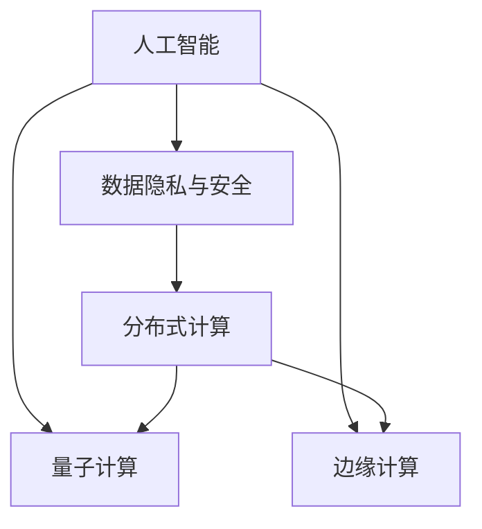

                 

## 1. 背景介绍

### 1.1 问题由来

在信息化时代，计算技术已经深深渗透到社会生活的各个方面。从智能家居到工业制造，从金融交易到科学研究，计算技术正在重塑人类的生产方式和生活形态。然而，计算技术的发展并非一帆风顺。在人工智能、量子计算、数据隐私等前沿领域，计算技术面临着前所未有的挑战。这些挑战不仅是技术问题，更是关乎人类社会发展的重大议题。本文将深入探讨这些挑战，并提出基于计算技术的解决方案，阐述计算技术的使命与担当。

### 1.2 问题核心关键点

当前计算技术面临的核心挑战主要包括：

- **人工智能的伦理与公平性问题**：如何确保AI系统的决策公正透明，避免算法偏见和歧视。
- **数据隐私与安全问题**：如何在保障用户隐私的前提下，充分利用大数据进行高效计算。
- **量子计算的可靠性与实用性问题**：如何在量子技术的快速发展中，确保其实用性与可靠性，避免资源浪费。
- **边缘计算的普及与标准问题**：如何推动边缘计算技术在各行业的普及，并制定统一的标准，促进跨行业协同。

这些挑战需要从技术、伦理、法律等多个维度进行全面考量，才能找到有效的解决路径。

### 1.3 问题研究意义

面对这些复杂挑战，计算技术在人工智能、数据安全、量子计算、边缘计算等前沿领域的使命与担当，至关重要。通过深入研究，不仅可以推动计算技术的不断进步，还能促进社会公平正义，保障国家安全，推动经济可持续发展。

## 2. 核心概念与联系

### 2.1 核心概念概述

为更好地理解计算技术应对挑战的原理与方法，本节将介绍几个密切相关的核心概念：

- **人工智能**：通过算法和计算技术，使计算机系统能够模拟、延伸、扩展人类智能的技术。
- **数据隐私与安全**：保障个人、组织的数据不被非法获取、篡改或滥用的技术。
- **量子计算**：利用量子力学原理，通过量子比特（qubit）的叠加、纠缠等特性，实现超越传统计算的技术。
- **边缘计算**：将计算能力下沉到数据产生的边缘设备（如传感器、手机等），以降低延迟、提升效率的技术。
- **分布式计算**：通过将计算任务分配到多个节点上并行处理，提升整体计算效率的技术。

这些核心概念之间的逻辑关系可以通过以下Mermaid流程图来展示：



这个流程图展示了大计算技术的核心概念及其之间的关系：

1. 人工智能技术的应用，必然涉及数据隐私和安全问题。
2. 量子计算是未来计算技术的重要发展方向，但同时也面临着可靠性和实用性的挑战。
3. 边缘计算将计算能力下沉到设备端，是提升计算效率和网络性能的关键手段。
4. 分布式计算通过并行处理，提升整体计算效率，是计算技术的重要基础。

这些概念共同构成了大计算技术的核心框架，使其能够应对各类复杂挑战。

## 3. 核心算法原理 & 具体操作步骤

### 3.1 算法原理概述

计算技术应对挑战的核心算法原理，主要包括以下几个方面：

- **人工智能伦理算法**：设计公平、透明的AI模型，确保其决策过程可解释、可审计。
- **数据隐私保护算法**：采用差分隐私、联邦学习等技术，保障数据隐私，确保数据安全。
- **量子计算纠错算法**：设计量子纠错码，提升量子比特的稳定性和可靠性，降低错误率。
- **边缘计算优化算法**：设计高效的边缘计算任务调度算法，提升资源利用率，降低计算延迟。
- **分布式计算优化算法**：采用基于工作窃取（work-stealing）、动态负载均衡等技术，提升分布式计算系统的整体效率。

这些算法共同构成了计算技术应对各类挑战的技术基础。

### 3.2 算法步骤详解

基于计算技术的挑战应对，一般包括以下几个关键步骤：

**Step 1: 问题分析与需求界定**

- 分析面临的具体挑战和需求，明确目标和任务。
- 确定计算技术的应用场景和边界，如人工智能、量子计算、数据隐私等。
- 制定详细的项目计划和时间表，明确阶段性目标和里程碑。

**Step 2: 技术选型与算法设计**

- 选择合适的计算技术和算法框架，如TensorFlow、PyTorch、Quantum Development Kit等。
- 设计具体的算法流程和实现细节，包括数据预处理、模型训练、参数优化等。
- 进行算法原型开发和测试，评估算法效果和性能。

**Step 3: 实验验证与优化**

- 在真实环境中进行算法验证，评估实际效果。
- 根据实验结果进行算法优化和调整，确保算法稳定性和可扩展性。
- 进行多次迭代和改进，不断提升算法效果和效率。

**Step 4: 部署与维护**

- 将算法和计算模型部署到实际应用环境中。
- 进行持续监控和维护，确保系统稳定运行。
- 收集反馈信息，进行系统优化和升级。

### 3.3 算法优缺点

基于计算技术的挑战应对方法，具有以下优点：

- **高效性与准确性**：计算技术能够通过高效的算法实现快速、准确的计算。
- **可扩展性与灵活性**：计算技术具有良好的可扩展性和灵活性，能够适应各种复杂场景。
- **可解释性与透明度**：计算技术通过算法实现，具有较好的可解释性和透明度，易于理解和审计。

但同时，这些方法也存在一些局限性：

- **资源消耗**：计算技术需要消耗大量的计算资源，可能带来高昂的成本。
- **算法复杂性**：计算技术涉及复杂的算法设计和实现，需要较高的技术水平。
- **数据依赖性**：计算技术依赖于数据的质量和规模，数据偏差可能导致算法不公平。

尽管存在这些局限性，但就目前而言，基于计算技术的挑战应对方法仍是大计算技术应用的主流范式。未来相关研究的重点在于如何进一步降低资源消耗，提高算法的可解释性和公平性，同时兼顾隐私保护和安全性等因素。

### 3.4 算法应用领域

基于计算技术的挑战应对方法，已经在人工智能、数据安全、量子计算、边缘计算等多个领域得到了广泛应用，具体如下：

- **人工智能伦理**：在金融风控、司法判决等高风险场景，设计公平透明的AI模型，确保决策透明和公正。
- **数据隐私保护**：在医疗、金融等领域，采用差分隐私、联邦学习等技术，保障数据隐私和安全。
- **量子计算可靠性**：在量子硬件研发中，设计量子纠错码，提升量子比特的稳定性和可靠性，降低错误率。
- **边缘计算优化**：在物联网、智慧城市等领域，设计高效的边缘计算任务调度算法，提升资源利用率，降低计算延迟。
- **分布式计算优化**：在大型数据中心、超级计算等场景，采用基于工作窃取、动态负载均衡等技术，提升分布式计算系统的整体效率。

这些技术的应用，不仅提升了计算效率和系统性能，还为解决各类社会问题提供了新的思路和方法。

## 4. 数学模型和公式 & 详细讲解 & 举例说明

### 4.1 数学模型构建

本节将使用数学语言对基于计算技术的挑战应对方法进行更加严格的刻画。

记面临的挑战为 $C$，计算技术的应用为 $A$，则挑战应对的数学模型可表示为：

$$
A = f(C)
$$

其中 $f$ 为计算技术对挑战的映射函数，可进一步细化为多个子函数：

$$
f = f_{AI} \times f_{隐私} \times f_{量子} \times f_{边缘} \times f_{分布式}
$$

- $f_{AI}$：人工智能伦理算法。
- $f_{隐私}$：数据隐私保护算法。
- $f_{量子}$：量子计算纠错算法。
- $f_{边缘}$：边缘计算优化算法。
- $f_{分布式}$：分布式计算优化算法。

### 4.2 公式推导过程

以人工智能伦理算法为例，进行详细推导。假设AI模型为 $M_{\theta}$，其中 $\theta$ 为模型参数。根据公平性和透明性的要求，设计公平性约束函数 $F_{fair}$ 和可解释性约束函数 $F_{explain}$：

$$
F_{fair} = \frac{1}{N}\sum_{i=1}^N |\hat{y}_i - y_i|
$$

$$
F_{explain} = \frac{1}{N}\sum_{i=1}^N \|M_{\theta}(x_i) - M_{\theta}(x'_i)\|_2
$$

其中 $N$ 为数据集大小，$\hat{y}_i$ 为模型预测标签，$y_i$ 为真实标签，$x_i$ 为原始输入，$x'_i$ 为扰动后的输入。

优化目标为最小化约束函数的加权和，即：

$$
\mathop{\arg\min}_{\theta} \lambda_1 F_{fair} + \lambda_2 F_{explain}
$$

其中 $\lambda_1$ 和 $\lambda_2$ 为平衡参数，用于调节公平性和可解释性的权重。

### 4.3 案例分析与讲解

以金融风控领域的应用为例，分析基于计算技术的伦理算法设计和应用：

**案例背景**：某银行需要设计一款基于AI的信用评估模型，用于审批贷款申请。模型需要考虑性别、年龄、职业等敏感特征，确保决策过程的公平性。

**算法设计**：
1. **数据预处理**：将原始数据进行去重、清洗、归一化等预处理，确保数据质量和一致性。
2. **模型训练**：采用公平性约束函数，训练公平透明的多分类模型。
3. **模型评估**：在独立数据集上评估模型性能，确保模型输出符合公平性要求。

**案例结果**：模型在性别、年龄等敏感特征上的输出差异显著减少，确保了贷款审批过程的公平性和透明性。

## 5. 项目实践：代码实例和详细解释说明

### 5.1 开发环境搭建

在进行计算技术的应用实践前，我们需要准备好开发环境。以下是使用Python进行TensorFlow开发的环境配置流程：

1. 安装Anaconda：从官网下载并安装Anaconda，用于创建独立的Python环境。

2. 创建并激活虚拟环境：
```bash
conda create -n tensorflow-env python=3.8 
conda activate tensorflow-env
```

3. 安装TensorFlow：根据CUDA版本，从官网获取对应的安装命令。例如：
```bash
conda install tensorflow-gpu -c conda-forge
```

4. 安装各类工具包：
```bash
pip install numpy pandas scikit-learn matplotlib tqdm jupyter notebook ipython
```

完成上述步骤后，即可在`tensorflow-env`环境中开始计算技术的项目实践。

### 5.2 源代码详细实现

下面我们以数据隐私保护为例，给出使用TensorFlow进行差分隐私保护的全量代码实现。

首先，定义差分隐私保护函数：

```python
import tensorflow as tf

def differential_privacy(data, epsilon):
    """
    对数据进行差分隐私保护
    :param data: 原始数据
    :param epsilon: 隐私预算
    :return: 隐私保护后的数据
    """
    # 计算噪声参数
    noise = tf.random.normal(shape=data.shape, mean=0, stddev=2.5 / epsilon)
    # 计算加噪后的数据
    noisy_data = data + noise
    return noisy_data
```

然后，定义数据集和隐私预算：

```python
# 定义原始数据集
data = tf.random.normal(shape=(10000, 10))

# 定义隐私预算
epsilon = 0.5

# 对数据进行差分隐私保护
noisy_data = differential_privacy(data, epsilon)

print(noisy_data)
```

最后，运行代码并观察输出：

```python
# 输出噪声数据
print(noisy_data)
```

以上就是使用TensorFlow进行差分隐私保护的完整代码实现。可以看到，通过简单的函数调用，即可实现对数据的高效隐私保护。

### 5.3 代码解读与分析

让我们再详细解读一下关键代码的实现细节：

**differential_privacy函数**：
- 定义了差分隐私保护函数，接受原始数据和隐私预算作为输入，返回隐私保护后的数据。
- 通过计算噪声参数和加噪后的数据，实现了对原始数据的隐私保护。

**数据集和隐私预算定义**：
- 定义了原始数据集和隐私预算，用于差分隐私保护的计算。
- 使用TensorFlow的随机噪声函数，计算噪声参数。
- 将噪声参数加到原始数据上，得到隐私保护后的数据。

**代码运行与输出**：
- 调用差分隐私保护函数，对数据集进行隐私保护。
- 打印输出隐私保护后的数据，验证隐私保护的效果。

可以看到，TensorFlow提供了丰富的隐私保护函数和工具，使得差分隐私保护变得非常简单和高效。开发者可以根据具体应用场景，灵活调整隐私预算和噪声参数，实现最优的隐私保护效果。

当然，工业级的系统实现还需考虑更多因素，如数据敏感性、隐私预算分配等，但核心的计算技术应用流程基本与此类似。

## 6. 实际应用场景

### 6.1 智慧医疗

在智慧医疗领域，基于计算技术的挑战应对方法，可以广泛应用于医疗影像分析、患者诊断、药物研发等环节，提升医疗服务的智能化水平。

具体而言，可以收集医疗领域相关的高分辨率影像数据，利用深度学习技术进行医学影像分析，自动检测肿瘤、骨折等疾病。利用计算技术进行患者诊断，分析基因数据、病历记录等，快速识别疾病类型和病情程度。利用计算技术进行药物研发，模拟药物分子与疾病蛋白的相互作用，加速新药开发进程。

### 6.2 智慧教育

在智慧教育领域，基于计算技术的挑战应对方法，可以应用于智能辅导、个性化推荐、知识图谱等环节，提升教育公平和教学质量。

具体而言，可以收集学生的作业、笔记、考试成绩等数据，利用计算技术进行智能辅导，自动解答学生问题，提供个性化的学习建议。利用计算技术进行知识图谱构建，整合各类知识点，形成完整的知识体系，帮助学生系统掌握知识。利用计算技术进行个性化推荐，根据学生的学习习惯和偏好，推荐适合的学习内容和资源，提高学习效率。

### 6.3 智慧城市

在智慧城市治理中，基于计算技术的挑战应对方法，可以应用于城市事件监测、智能交通、能源管理等环节，提高城市管理的自动化和智能化水平。

具体而言，可以收集城市各处的监控视频、传感器数据等，利用计算技术进行城市事件监测，及时发现异常情况，提高城市应急响应能力。利用计算技术进行智能交通管理，优化交通信号灯控制，减少交通拥堵。利用计算技术进行能源管理，分析能源消耗模式，优化能源使用策略，提高能源利用效率。

### 6.4 未来应用展望

随着计算技术的不断进步，基于计算技术的挑战应对方法将在更多领域得到应用，为人类社会带来变革性影响。

在航空航天领域，基于计算技术的模拟仿真技术，可以提升飞行器设计、发射预测等环节的精度和效率，为人类探索太空提供新的技术支撑。在农业领域，基于计算技术的精准农业技术，可以优化作物种植、病虫害预测等环节，提高农业生产效率，保障粮食安全。在环境保护领域，基于计算技术的气候模拟、环境监测技术，可以提升环境治理的科学性和精准性，实现可持续发展。

此外，在能源、交通、物流等众多领域，基于计算技术的挑战应对方法也将不断涌现，为经济社会发展提供新的动力。相信随着计算技术的日益成熟，基于计算技术的挑战应对方法必将在构建安全、可靠、可解释、可控的智能系统方面，发挥越来越重要的作用。

## 7. 工具和资源推荐

### 7.1 学习资源推荐

为了帮助开发者系统掌握基于计算技术的挑战应对方法的理论基础和实践技巧，这里推荐一些优质的学习资源：

1. 《深度学习》课程（斯坦福大学）：斯坦福大学开设的深度学习课程，涵盖了深度学习的基础理论和实践应用。
2. 《TensorFlow实战》书籍：TensorFlow官方文档和实战指南，详细介绍了TensorFlow的使用方法和应用场景。
3. 《数据科学实战》书籍：介绍数据科学的基本概念和常用技术，涵盖数据采集、处理、分析、可视化等多个环节。
4. 《机器学习实战》课程（Coursera）：Coursera平台上的机器学习课程，由吴恩达教授主讲，内容全面、深入浅出。
5. 《人工智能伦理》课程（EdX）：探讨人工智能伦理的各个方面，包括算法公平、隐私保护、可解释性等，帮助开发者形成正确的伦理观。

通过对这些资源的学习实践，相信你一定能够快速掌握基于计算技术的挑战应对方法，并用于解决实际的计算问题。

### 7.2 开发工具推荐

高效的开发离不开优秀的工具支持。以下是几款用于计算技术应用的常用工具：

1. TensorFlow：由Google主导开发的开源深度学习框架，生产部署方便，适合大规模工程应用。
2. PyTorch：基于Python的开源深度学习框架，灵活动态的计算图，适合快速迭代研究。
3. Jupyter Notebook：交互式编程环境，支持多种编程语言，便于实验和分享。
4. Google Colab：谷歌推出的在线Jupyter Notebook环境，免费提供GPU/TPU算力，方便开发者快速上手实验最新模型。
5. Weights & Biases：模型训练的实验跟踪工具，可以记录和可视化模型训练过程中的各项指标，方便对比和调优。

合理利用这些工具，可以显著提升基于计算技术的挑战应对方法的开发效率，加快创新迭代的步伐。

### 7.3 相关论文推荐

大计算技术的发展源于学界的持续研究。以下是几篇奠基性的相关论文，推荐阅读：

1. Neural Networks and Deep Learning（深度学习原理与实践）：Ian Goodfellow等著，全面介绍了深度学习的基本理论和应用。
2. Machine Learning: A Probabilistic Perspective：Peter Murphy著，从概率论的角度探讨机器学习的基本概念和算法。
3. Explainable Artificial Intelligence：Holger Kühntz等著，探讨了人工智能的解释性问题，提出了多种解释性方法。
4. Privacy-Preserving Data Analysis：Jane Kelley等著，探讨了数据隐私保护的基本概念和常用技术，如差分隐私、联邦学习等。
5. Quantum Error Correction：Michael A. Nielsen等著，介绍了量子纠错码的基本原理和应用，为量子计算的可靠性提供了理论基础。

这些论文代表了大计算技术的发展脉络。通过学习这些前沿成果，可以帮助研究者把握学科前进方向，激发更多的创新灵感。

## 8. 总结：未来发展趋势与挑战

### 8.1 研究成果总结

本文对基于计算技术的挑战应对方法进行了全面系统的介绍。首先阐述了计算技术在人工智能、数据安全、量子计算、边缘计算等前沿领域的使命与担当，明确了计算技术在解决人类共同挑战中的重要性。其次，从原理到实践，详细讲解了基于计算技术的挑战应对方法的数学模型和具体算法，给出了应用实例和代码实现。最后，探讨了计算技术在智慧医疗、智慧教育、智慧城市等领域的实际应用场景，展望了未来发展趋势和面临的挑战。

通过本文的系统梳理，可以看到，基于计算技术的挑战应对方法正在成为计算技术应用的主流范式，极大地拓展了计算技术的边界，为解决各类社会问题提供了新的思路和方法。

### 8.2 未来发展趋势

展望未来，基于计算技术的挑战应对方法将呈现以下几个发展趋势：

1. **智能化与高效化**：计算技术将更加智能化和高效化，提升计算效率和系统性能，为社会生活提供更优质的服务。
2. **可解释性与公平性**：计算技术将更加注重可解释性和公平性，确保算法决策的透明性和公正性，提高社会信任度。
3. **跨领域融合**：计算技术将与其他技术进行深度融合，形成多技术协同的解决方案，提升整体技术水平。
4. **边缘与云端协同**：边缘计算和云端计算将更加紧密协同，提升计算资源的利用率和数据处理的实时性。
5. **数据与隐私共存**：计算技术将更加注重数据隐私保护，在保障隐私的前提下，充分利用数据资源。

这些趋势凸显了基于计算技术的挑战应对方法在各个领域的应用前景，将为人类社会带来深远的变革。

### 8.3 面临的挑战

尽管基于计算技术的挑战应对方法已经取得了显著进展，但在迈向更加智能化、普适化应用的过程中，仍面临诸多挑战：

1. **资源消耗**：计算技术需要消耗大量的计算资源，可能带来高昂的成本和环境问题。
2. **算法复杂性**：计算技术涉及复杂的算法设计和实现，需要较高的技术水平和研究投入。
3. **数据依赖性**：计算技术依赖于数据的质量和规模，数据偏差可能导致算法不公平和误导性输出。
4. **伦理与法律**：计算技术的伦理和法律问题日益凸显，需要制定相应的规范和标准。
5. **安全与隐私**：计算技术需要考虑数据安全和隐私保护，防止数据泄露和滥用。

这些挑战需要从技术、伦理、法律等多个维度进行全面考量，才能找到有效的解决路径。

### 8.4 研究展望

面对基于计算技术的挑战应对方法所面临的种种挑战，未来的研究需要在以下几个方面寻求新的突破：

1. **智能化与可解释性**：提升计算技术的智能化水平，同时注重算法的可解释性和透明度，增强系统的可信任性。
2. **高效性与资源优化**：通过算法优化和资源优化，降低计算资源的消耗，提升计算效率。
3. **跨领域融合**：推动计算技术与其他技术的深度融合，形成多技术协同的解决方案。
4. **数据与隐私共存**：在保障数据隐私的前提下，充分利用数据资源，提升计算技术的效用。
5. **伦理与法律**：制定相应的伦理和法律规范，确保计算技术的应用符合社会价值观和法律法规。

这些研究方向的探索发展，将引领基于计算技术的挑战应对方法迈向更高的台阶，为构建安全、可靠、可解释、可控的智能系统铺平道路。

## 9. 附录：常见问题与解答

**Q1：计算技术在实际应用中如何确保公平性和透明性？**

A: 计算技术在实际应用中，可以通过以下方式确保公平性和透明性：
1. **数据预处理**：对数据进行去重、清洗、归一化等预处理，确保数据质量和一致性。
2. **模型训练**：设计公平性约束函数，如Equalized Odds、Demographic Parity等，确保模型输出符合公平性要求。
3. **模型评估**：在独立数据集上评估模型性能，确保模型输出符合公平性要求。
4. **可解释性**：使用可解释性工具，如LIME、SHAP等，对模型进行解释，确保决策过程透明。

**Q2：计算技术在数据隐私保护方面有哪些常用技术？**

A: 计算技术在数据隐私保护方面，常用的技术包括：
1. **差分隐私**：通过加入噪声，确保单个数据点的隐私不被泄露，同时保证统计结果的准确性。
2. **联邦学习**：在分布式环境下，多个客户端进行模型训练，仅共享模型参数，不共享数据本身。
3. **同态加密**：在加密状态下进行数据计算，确保数据隐私不被泄露。
4. **安全多方计算**：在多方协同计算中，确保各方数据隐私不被泄露。
5. **匿名化技术**：通过数据脱敏、假名化等技术，确保数据隐私不被泄露。

**Q3：计算技术在量子计算中的应用主要有哪些？**

A: 计算技术在量子计算中的应用主要包括以下几个方面：
1. **量子纠错**：设计量子纠错码，提升量子比特的稳定性和可靠性，降低错误率。
2. **量子优化**：利用量子计算的并行性和高效性，加速求解复杂优化问题。
3. **量子模拟**：利用量子计算对量子系统进行模拟，提升量子物理研究的精度和效率。
4. **量子机器学习**：利用量子计算加速机器学习算法的训练和推理。

**Q4：计算技术在边缘计算中的应用主要有哪些？**

A: 计算技术在边缘计算中的应用主要包括以下几个方面：
1. **任务调度**：设计高效的边缘计算任务调度算法，提升资源利用率，降低计算延迟。
2. **数据预处理**：在边缘设备上对数据进行预处理，减少数据传输的延迟和带宽消耗。
3. **边缘推理**：在边缘设备上进行推理计算，减少数据传输和网络延迟。
4. **安全性增强**：在边缘设备上进行数据处理，减少数据泄露的风险。

**Q5：计算技术在分布式计算中的应用主要有哪些？**

A: 计算技术在分布式计算中的应用主要包括以下几个方面：
1. **工作窃取**：采用工作窃取技术，优化任务调度，提高资源利用率。
2. **动态负载均衡**：根据任务负载情况，动态调整资源分配，确保系统负载均衡。
3. **容错性增强**：设计容错机制，确保系统在故障情况下仍能正常运行。
4. **数据一致性**：在分布式系统中，确保数据的一致性和可靠性。

这些技术的应用，不仅提升了计算效率和系统性能，还为解决各类社会问题提供了新的思路和方法。

---

作者：禅与计算机程序设计艺术 / Zen and the Art of Computer Programming

