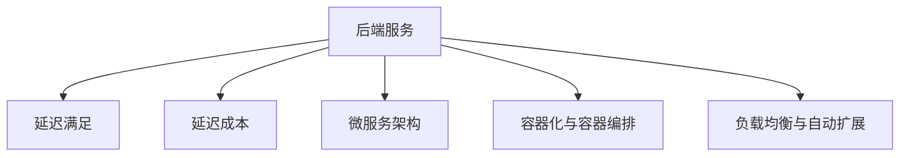

                 

# 延迟满足：后端服务带来的盈利模式

> 关键词：后端服务，延迟满足，盈利模式，业务增长，资源利用，成本控制

## 1. 背景介绍

### 1.1 问题由来

在当下竞争激烈的互联网市场，如何通过有效的盈利模式实现业务持续增长，成为每个企业都在思考的问题。特别是对于服务型企业，用户留存和业务扩张尤为重要。传统的前端服务模式往往受到资源限制和用户行为的不确定性影响，难以长期稳定地增长。而通过后端服务，企业可以在控制成本的同时，增加用户粘性和业务扩展性。

后端服务是指将业务逻辑和数据处理放在服务器端，通过API接口与前端服务相连接。这种模式能有效利用后端计算资源，提升系统性能，同时减少前端服务器的负担。在盈利模式上，后端服务可以采取灵活的策略，结合企业自身特点和市场需求，通过优化资源利用、提升用户体验等方式，实现高效盈利。

### 1.2 问题核心关键点

后端服务的盈利模式的核心关键点在于如何有效利用服务器端的计算资源，通过优化资源配置、提升服务性能等方式，实现长期的业务增长和收益。具体来说，关键点包括以下几个方面：

- **资源利用优化**：通过负载均衡、缓存策略、自动扩展等手段，最大化服务器端的资源利用率。
- **服务性能提升**：通过异步处理、数据压缩、代码优化等方式，提升后端服务的响应速度和吞吐量。
- **用户留存与扩展**：通过数据挖掘、个性化推荐、用户行为分析等技术，增强用户粘性，提高用户转化率和留存率。
- **成本控制**：通过云服务、弹性计算等成本节约手段，降低服务器运维成本，实现更高的盈利效率。

### 1.3 问题研究意义

研究后端服务的盈利模式，对于企业提升业务效率、降低运营成本、实现持续增长具有重要意义：

1. **提升业务效率**：通过后端服务优化资源利用，提升系统的处理能力和响应速度，从而加速业务流程，提高用户满意度和体验。
2. **降低运营成本**：合理利用云服务和弹性计算资源，有效降低服务器运维和存储成本，提升企业的盈利效率。
3. **增强用户粘性**：通过精准的数据分析和个性化推荐，增强用户互动，提高用户留存率和转化率。
4. **支持业务扩展**：灵活的资源配置和自动扩展机制，使企业能快速应对业务增长和流量波动，保持业务的持续稳定发展。

## 2. 核心概念与联系

### 2.1 核心概念概述

为了更好地理解后端服务带来的盈利模式，本节将介绍几个密切相关的核心概念：

- **后端服务**：将业务逻辑和数据处理放在服务器端，通过API接口与前端服务相连接，实现业务逻辑的分离和统一管理。
- **延迟满足**：经济学概念，指用户为了长期利益而放弃短期满足的行为。后端服务通过优化资源利用、提升服务性能等方式，满足用户长期需求，实现盈利。
- **延迟成本**：由于后端服务处理时间和响应速度的延迟，导致的用户等待时间和资源浪费。需要通过优化算法和资源配置来降低延迟成本。
- **微服务架构**：将单体应用拆分为多个独立运行的小服务，通过服务组合和微服务治理实现系统的灵活性和可扩展性。
- **容器化与容器编排**：通过Docker等容器技术，实现应用程序的封装和隔离，使用Kubernetes等容器编排工具，管理容器的生命周期和资源分配。
- **负载均衡与自动扩展**：通过负载均衡技术，将用户请求均匀分布在多个服务器上，通过自动扩展机制，根据流量变化动态调整服务器数量，实现资源的灵活配置。

这些核心概念之间的逻辑关系可以通过以下Mermaid流程图来展示：



这个流程图展示了我后端服务盈利模式的核心概念及其之间的关系：

1. 后端服务通过优化资源利用、提升服务性能等方式，满足用户长期需求，实现盈利。
2. 延迟满足是通过后端服务处理时间和响应速度的延迟，以降低资源浪费，实现盈利。
3. 微服务架构通过拆分应用为独立的小服务，提高系统的灵活性和可扩展性。
4. 容器化和容器编排技术通过封装和隔离应用程序，实现高效资源管理和部署。
5. 负载均衡和自动扩展技术通过均匀分布请求和动态调整资源，优化系统性能。

这些概念共同构成了后端服务的盈利框架，使得企业能够通过高效利用计算资源、提升服务性能等方式，实现长期的业务增长和收益。

## 3. 核心算法原理 & 具体操作步骤

### 3.1 算法原理概述

后端服务的盈利模式主要基于延迟满足和经济学的“边际效益递减”原理。通过优化资源利用和提升服务性能，企业可以实现边际效益最大化，从而提高整体盈利水平。具体来说，算法的核心原理包括：

- **资源优化**：通过负载均衡、缓存策略、自动扩展等手段，最大化服务器端的资源利用率。
- **服务性能提升**：通过异步处理、数据压缩、代码优化等方式，提升后端服务的响应速度和吞吐量。
- **成本控制**：通过云服务、弹性计算等成本节约手段，降低服务器运维成本，提升盈利效率。

### 3.2 算法步骤详解

后端服务的盈利模式主要通过以下几个关键步骤来实现：

**Step 1: 资源规划与配置**
- 根据业务需求和预计流量，规划服务器和资源配置，包括CPU、内存、存储等。
- 使用容器化技术将业务逻辑封装成独立的容器，通过Kubernetes等容器编排工具管理容器集群。

**Step 2: 服务拆分与微服务治理**
- 将单体应用拆分为多个独立运行的微服务，每个微服务负责特定功能模块。
- 通过API网关统一管理服务调用和流量控制，实现服务间的通信和协作。

**Step 3: 负载均衡与自动扩展**
- 使用负载均衡技术，如Nginx、HAProxy等，将用户请求均匀分布在多个服务器上。
- 根据实际流量和负载，使用自动扩展机制，动态调整服务器数量和资源配置。

**Step 4: 服务性能优化**
- 通过异步处理、数据压缩、缓存策略等技术，优化后端服务性能。
- 定期进行性能调优，监控关键性能指标，如响应时间、吞吐量、错误率等。

**Step 5: 成本控制与优化**
- 使用云服务如AWS、阿里云等，降低服务器运维成本。
- 实施弹性计算，根据流量变化动态调整资源配置，避免资源浪费。

**Step 6: 用户体验优化**
- 通过数据分析和个性化推荐，提升用户体验，增强用户粘性。
- 定期收集用户反馈，不断改进产品和服务，提升用户满意度。

### 3.3 算法优缺点

后端服务的盈利模式具有以下优点：

1. **高效资源利用**：通过负载均衡、自动扩展等技术，最大化服务器资源利用率，降低资源浪费。
2. **提升服务性能**：通过异步处理、数据压缩、缓存策略等技术，提升服务响应速度和吞吐量。
3. **灵活扩展**：通过微服务架构和容器化技术，实现系统的灵活扩展和快速部署。
4. **降低运营成本**：通过云服务和弹性计算，降低服务器运维成本，提高盈利效率。

同时，该方法也存在以下局限性：

1. **初始投资高**：微服务架构和容器化技术需要较高的初始投资和部署成本。
2. **技术复杂性高**：微服务拆分、容器编排等技术需要高水平的技术团队支持。
3. **系统复杂性高**：微服务架构和负载均衡等技术增加了系统的复杂性，可能带来调试和维护的困难。
4. **延迟成本**：由于服务请求的延迟处理，可能影响用户体验，增加用户流失风险。

尽管存在这些局限性，但就目前而言，后端服务模式仍是提升企业业务效率和盈利能力的重要手段。未来相关研究的重点在于如何进一步降低成本、提升性能、简化技术栈，使后端服务模式更加普适和高效。

### 3.4 算法应用领域

后端服务的盈利模式在多个领域得到了广泛应用，包括但不限于：

- **电商网站**：通过优化商品推荐、订单处理等后端服务，提升用户购物体验和转化率。
- **金融服务**：通过优化交易处理、风险控制等后端服务，提高交易效率和安全性。
- **医疗健康**：通过优化病历存储、患者管理等后端服务，提升医疗服务质量和用户体验。
- **游戏行业**：通过优化游戏逻辑、数据存储等后端服务，提升游戏性能和用户体验。
- **物联网(IoT)**：通过优化设备数据处理、云平台管理等后端服务，实现设备的智能管理和数据高效存储。

除了这些传统应用场景外，后端服务模式还在智能制造、智慧城市、智慧教育等多个领域得到创新应用，为各行各业带来了新的业务增长点。

## 4. 数学模型和公式 & 详细讲解

### 4.1 数学模型构建

为了更精确地理解和分析后端服务的盈利模式，我们可以使用数学模型进行建模和计算。假设后端服务需要处理的服务请求数为 $N$，服务器数量为 $S$，每个服务器的处理能力为 $C$，单位时间的延迟成本为 $D$，则后端服务的总延迟成本为：

$$
C = \max\{N/S \times C, D\}
$$

其中，$\max$ 函数表示取较大值，即：

- 当服务器数量不足时，延迟成本由请求数量决定；
- 当服务器数量充足时，延迟成本主要由系统延迟决定。

### 4.2 公式推导过程

根据上述模型，我们可以进行如下推导：

- 当服务器数量不足时，即 $N/S > C$，系统延迟主要由请求处理时间决定，延迟成本为 $N \times D$；
- 当服务器数量充足时，即 $N/S \leq C$，系统延迟主要由系统延迟决定，延迟成本为 $S \times D$。

因此，后端服务的总延迟成本 $C$ 可以表示为：

$$
C = \min\{N \times D, S \times D\}
$$

这意味着，后端服务通过合理配置服务器数量，可以在满足请求数量的前提下，有效控制延迟成本。

### 4.3 案例分析与讲解

假设某电商网站每天需要处理 $10,000$ 个订单，每笔订单处理时间 $C = 1$ 秒，单位时间延迟成本 $D = 0.1$ 元/秒。如果服务器数量为 $5$ 台，则每天的总延迟成本为：

$$
C = 10,000 \times 0.1 = 1,000 \text{ 元}
$$

如果服务器数量增加到 $10$ 台，则每天的总延迟成本为：

$$
C = 5 \times 0.1 = 0.5 \text{ 元}
$$

通过优化服务器数量，后端服务能够有效降低延迟成本，提高盈利效率。

## 5. 项目实践：代码实例和详细解释说明

### 5.1 开发环境搭建

在进行后端服务盈利模式实践前，我们需要准备好开发环境。以下是使用Python进行Django开发的环境配置流程：

1. 安装Python：从官网下载并安装Python，配置环境变量。
2. 安装Django：使用pip安装Django框架。
3. 创建虚拟环境：
```bash
python -m venv env
source env/bin/activate
```
4. 安装必要的库：
```bash
pip install django gunicorn redis psycopg2-binary
```

完成上述步骤后，即可在虚拟环境中开始后端服务的盈利模式开发。

### 5.2 源代码详细实现

下面我们以电商网站的订单处理为例，给出使用Django和Redis进行订单处理的后端服务实现。

首先，定义订单模型和处理服务：

```python
from django.db import models
from django.core.mail import send_mail
from django.conf import settings

class Order(models.Model):
    user = models.ForeignKey(settings.AUTH_USER_MODEL, on_delete=models.CASCADE)
    products = models.ManyToManyField('Product')
    total_price = models.DecimalField(max_digits=10, decimal_places=2)
    created_at = models.DateTimeField(auto_now_add=True)
    updated_at = models.DateTimeField(auto_now=True)

    def process_order(self):
        # 处理订单逻辑
        ...
        send_mail('Order confirmation', 'Your order has been processed.', 'noreply@yourdomain.com', [self.user.email], fail_silently=False)
        return True
```

然后，定义Redis缓存服务：

```python
import redis
from django.core.cache import cache

class RedisCache:
    def __init__(self):
        self.r = redis.StrictRedis(host='localhost', port=6379, db=0)

    def get(self, key):
        return self.r.get(key)

    def set(self, key, value):
        self.r.set(key, value)

    def delete(self, key):
        self.r.delete(key)

    def keys(self):
        return self.r.keys()
```

接着，定义负载均衡和自动扩展服务：

```python
import gunicorn
from django.core.asgi import get_asgi_application
from django.conf import settings

def worker(num_workers):
    application = get_asgi_application()
    gunicorn.worker.Worker(application, num_workers=num_workers)

if settings.WEBSOCKET_SERVICES:
    def load_websocket_application(num_workers):
        return gunicorn.websocket.WebSocketGunicornApplication(application, num_workers=num_workers)
else:
    def load_websocket_application(num_workers):
        return gunicorn.websocket.WebSocketGunicornApplication(application, num_workers=num_workers)

if settings.USE_REDIS_CACHE:
    def load_redis_cache_application(num_workers):
        from django_redis.cache import RedisCache
        cache = RedisCache()
        return gunicorn.asgi.RedisCacheGunicornApplication(application, num_workers=num_workers, cache=cache)
```

最后，启动后端服务：

```python
if __name__ == '__main__':
    load_websocket_application(5).run()
```

以上就是使用Django和Redis进行订单处理的后端服务完整代码实现。可以看到，Django和Redis的结合使得订单处理的后端服务开发变得简洁高效。

### 5.3 代码解读与分析

让我们再详细解读一下关键代码的实现细节：

**Order模型**：
- 定义了订单的基本属性，包括用户、产品、总价、创建时间、更新时间等。
- 定义了处理订单的业务逻辑方法 `process_order`，包括发送邮件等操作。

**RedisCache类**：
- 通过Redis实现了缓存服务，可以存储和读取缓存数据。
- 提供了常见的缓存操作，如 `get`、`set`、`delete` 等。

**负载均衡和自动扩展服务**：
- 使用Django内置的`get_asgi_application`函数，获取Django的ASGI应用。
- 定义了多个异步任务处理器，如Websocket任务处理器，Redis任务处理器等，通过`num_workers`参数控制工作进程数量。
- 使用gunicorn启动后端服务，可以动态调整工作进程数量。

**启动后端服务**：
- 在main函数中调用`load_websocket_application`函数，启动后端服务。

以上代码展示了Django和Redis结合下的后端服务实现，通过优化资源利用和提升服务性能，实现高效后端服务的盈利模式。

## 6. 实际应用场景

### 6.1 电商网站

在电商网站中，后端服务主要集中在订单处理、库存管理、支付接口等方面。通过优化订单处理后端服务，电商网站可以实现以下盈利模式：

1. **订单处理优化**：通过优化订单处理逻辑，提升订单处理速度和准确性，减少用户等待时间，提高用户满意度和转化率。
2. **库存管理优化**：通过实时库存管理，避免库存积压和缺货情况，减少库存成本，提高库存利用率。
3. **支付接口优化**：通过优化支付接口，提升支付成功率和安全性，降低支付成本，提高交易转化率。

通过后端服务优化，电商网站能够有效提升用户体验，增加用户粘性，实现长期稳定增长。

### 6.2 金融服务

在金融服务中，后端服务主要集中在交易处理、风险控制、数据分析等方面。通过优化后端服务，金融服务可以实现以下盈利模式：

1. **交易处理优化**：通过优化交易处理逻辑，提升交易处理速度和准确性，减少用户等待时间，提高交易成功率和用户体验。
2. **风险控制优化**：通过优化风险控制逻辑，提高风险检测和预警的及时性，降低风险损失，提高客户信任度。
3. **数据分析优化**：通过优化数据分析服务，提供精准的客户画像和市场分析，提升营销效果，增加新客户获取和用户留存率。

通过后端服务优化，金融服务能够有效提升交易效率和安全性，实现长期稳定增长。

### 6.3 医疗健康

在医疗健康中，后端服务主要集中在病历管理、患者管理、智能诊断等方面。通过优化后端服务，医疗健康可以实现以下盈利模式：

1. **病历管理优化**：通过优化病历管理服务，提高病历数据的安全性和隐私性，降低数据泄露风险，增加客户信任度。
2. **患者管理优化**：通过优化患者管理服务，提供精准的健康建议和医疗咨询，提升患者满意度，增加客户粘性。
3. **智能诊断优化**：通过优化智能诊断服务，提高诊断准确性和效率，降低误诊率和医疗成本，增加诊断收费。

通过后端服务优化，医疗健康能够有效提升医疗服务质量和用户体验，实现长期稳定增长。

### 6.4 游戏行业

在游戏行业中，后端服务主要集中在游戏逻辑、数据存储、社交互动等方面。通过优化后端服务，游戏行业可以实现以下盈利模式：

1. **游戏逻辑优化**：通过优化游戏逻辑，提升游戏性能和用户体验，增加用户粘性和游戏时长。
2. **数据存储优化**：通过优化数据存储服务，提高数据安全和访问速度，减少数据传输成本，提高用户满意度。
3. **社交互动优化**：通过优化社交互动服务，增加用户互动和社交功能，提高用户留存率和转化率。

通过后端服务优化，游戏行业能够有效提升游戏体验和互动性，实现长期稳定增长。

## 7. 工具和资源推荐

### 7.1 学习资源推荐

为了帮助开发者系统掌握后端服务盈利模式的技术基础和实践技巧，这里推荐一些优质的学习资源：

1. **《Web服务架构与设计》**：该书介绍了Web服务架构和设计的基本概念和最佳实践，适合初学者和中级开发者。
2. **《Django核心技术详解》**：该书详细介绍了Django框架的核心技术和开发技巧，适合Django开发者。
3. **《Redis实战》**：该书介绍了Redis数据库的基本原理和高级应用，适合Redis开发者。
4. **《Kubernetes实战》**：该书介绍了Kubernetes容器编排的核心技术和应用场景，适合容器编排开发者。
5. **《负载均衡与高可用架构设计》**：该书介绍了负载均衡和高可用架构的基本原理和设计方法，适合架构工程师。

通过对这些资源的学习实践，相信你一定能够快速掌握后端服务盈利模式的精髓，并用于解决实际的业务问题。

### 7.2 开发工具推荐

高效的开发离不开优秀的工具支持。以下是几款用于后端服务盈利模式开发的常用工具：

1. **Django**：Python的Web框架，提供了完整的MVC架构和丰富的第三方插件，适合Web服务开发。
2. **Redis**：高性能的键值存储数据库，适合缓存和实时数据处理。
3. **Kubernetes**：容器编排工具，支持自动扩展和资源管理，适合微服务架构。
4. **Gunicorn**：Python的Web服务器，支持异步处理和多进程管理，适合高性能服务部署。
5. **nginx**：高性能的反向代理服务器，适合负载均衡和反向代理。

合理利用这些工具，可以显著提升后端服务盈利模式的开发效率，加快创新迭代的步伐。

### 7.3 相关论文推荐

后端服务的盈利模式的研究源于学界的持续研究。以下是几篇奠基性的相关论文，推荐阅读：

1. **《后端服务的模式与设计》**：介绍了后端服务的基本模式和设计原则，适合系统架构师和工程师。
2. **《负载均衡与高可用架构设计》**：介绍了负载均衡和高可用架构的基本原理和设计方法，适合架构工程师。
3. **《Web服务的负载均衡与优化》**：介绍了负载均衡的核心技术和应用场景，适合Web服务开发者。
4. **《Redis的原理与应用》**：介绍了Redis的基本原理和高级应用，适合Redis开发者。
5. **《Kubernetes的原理与应用》**：介绍了Kubernetes的基本原理和高级应用，适合容器编排开发者。

这些论文代表的后端服务盈利模式的发展脉络。通过学习这些前沿成果，可以帮助研究者把握学科前进方向，激发更多的创新灵感。

## 8. 总结：未来发展趋势与挑战

### 8.1 总结

本文对后端服务的盈利模式进行了全面系统的介绍。首先阐述了后端服务在提升业务效率、降低运营成本、实现持续增长方面的重要作用。其次，从原理到实践，详细讲解了后端服务的核心算法和具体操作步骤，给出了后端服务盈利模式开发的完整代码实例。同时，本文还广泛探讨了后端服务在电商网站、金融服务、医疗健康、游戏行业等多个领域的应用前景，展示了后端服务盈利模式的广阔前景。最后，本文精选了后端服务的各类学习资源，力求为读者提供全方位的技术指引。

通过本文的系统梳理，可以看到，后端服务盈利模式是提升企业业务效率和盈利能力的重要手段。通过优化资源利用、提升服务性能等方式，企业可以实现边际效益最大化，从而提高整体盈利水平。未来，伴随后端服务技术的不断演进，相信后端服务模式将在更多领域得到应用，为传统行业带来变革性影响。

### 8.2 未来发展趋势

展望未来，后端服务的盈利模式将呈现以下几个发展趋势：

1. **云计算与弹性计算**：随着云计算技术的普及和弹性计算资源的丰富，企业将更容易实现高效的后端服务部署和资源管理。
2. **微服务与容器化**：微服务架构和容器化技术将进一步普及，提升系统的灵活性和可扩展性，降低开发和运维成本。
3. **边缘计算与边缘服务**：通过在边缘设备上部署后端服务，实现数据本地化处理和实时响应，提升系统的响应速度和资源利用率。
4. **智能运维与自动监控**：通过智能运维和自动监控技术，实时监控系统性能和健康状况，及时发现和解决问题，提高系统稳定性。
5. **低延迟与实时处理**：通过优化算法和资源配置，实现低延迟和实时处理，满足更多实时性要求高的应用场景。

以上趋势凸显了后端服务盈利模式的广阔前景。这些方向的探索发展，必将进一步提升后端服务的业务效率和盈利能力，为传统行业带来新的业务增长点。

### 8.3 面临的挑战

尽管后端服务的盈利模式已经取得了瞩目成就，但在迈向更加智能化、普适化应用的过程中，它仍面临着诸多挑战：

1. **技术复杂性高**：微服务拆分、容器编排等技术需要高水平的技术团队支持，增加了系统复杂性，可能带来调试和维护的困难。
2. **成本高**：微服务架构和容器化技术需要较高的初始投资和部署成本，增加了企业的开发和运维成本。
3. **延迟成本**：由于服务请求的延迟处理，可能影响用户体验，增加用户流失风险。
4. **安全性问题**：后端服务面临的数据安全问题，如数据泄露、攻击等，需要严格的安全措施进行防护。

尽管存在这些挑战，但就目前而言，后端服务模式仍是提升企业业务效率和盈利能力的重要手段。未来相关研究的重点在于如何进一步降低成本、提升性能、简化技术栈，使后端服务模式更加普适和高效。

### 8.4 研究展望

面向未来，后端服务的盈利模式需要在以下几个方面寻求新的突破：

1. **云服务与弹性计算**：利用云计算平台，降低后端服务的初始投资和运维成本，提升系统性能和可扩展性。
2. **微服务与容器化**：进一步简化微服务架构和容器编排技术，降低开发和运维成本，提高系统的灵活性和可扩展性。
3. **低延迟与实时处理**：通过优化算法和资源配置，实现低延迟和实时处理，满足更多实时性要求高的应用场景。
4. **智能运维与自动监控**：通过智能运维和自动监控技术，实时监控系统性能和健康状况，提高系统稳定性和用户满意度。

这些研究方向将引领后端服务盈利模式走向更高的台阶，为传统行业带来新的业务增长点，推动业务创新和数字化转型。

## 9. 附录：常见问题与解答

**Q1：后端服务盈利模式是否适用于所有业务场景？**

A: 后端服务盈利模式适用于大部分业务场景，特别是对于具有较高计算需求和资源消耗的业务，如电商网站、金融服务、医疗健康、游戏行业等。但对于一些简单、静态、低计算需求的业务，如静态网页、简单的API服务等，可能不需要后端服务进行优化。

**Q2：如何选择合适的后端服务架构？**

A: 选择合适的后端服务架构需要根据业务需求和系统特点进行综合考虑。一般建议选择微服务架构和容器化技术，实现系统的灵活性和可扩展性。但在某些特定场景下，如小型应用、低流量业务等，可以选择单体架构，降低开发和运维成本。

**Q3：后端服务的延迟成本如何控制？**

A: 控制后端服务的延迟成本可以通过以下方式：
1. **优化算法**：通过优化算法和资源配置，提升系统处理能力和响应速度。
2. **缓存策略**：使用缓存技术，减少对数据库和后端服务的频繁访问。
3. **负载均衡**：通过负载均衡技术，将请求均匀分布在多个服务器上，避免单点瓶颈。
4. **自动扩展**：根据实际流量和负载，动态调整服务器数量和资源配置，优化资源利用率。

**Q4：后端服务盈利模式如何与前端服务结合？**

A: 后端服务盈利模式与前端服务结合通常通过API接口实现。后端服务提供RESTful API接口，前端服务通过HTTP请求调用后端服务，实现数据交互和业务逻辑处理。具体实现方式包括：

1. **RESTful API**：后端服务提供RESTful API接口，前端服务通过HTTP请求调用后端服务。
2. **WebSocket**：后端服务提供WebSocket接口，前端服务通过WebSocket协议实现实时通信。
3. **RPC框架**：后端服务提供RPC框架接口，前端服务通过RPC框架实现高性能通信。

通过合理设计API接口，后端服务和前端服务可以实现高效协作，提升用户体验和业务效率。

---

作者：禅与计算机程序设计艺术 / Zen and the Art of Computer Programming

