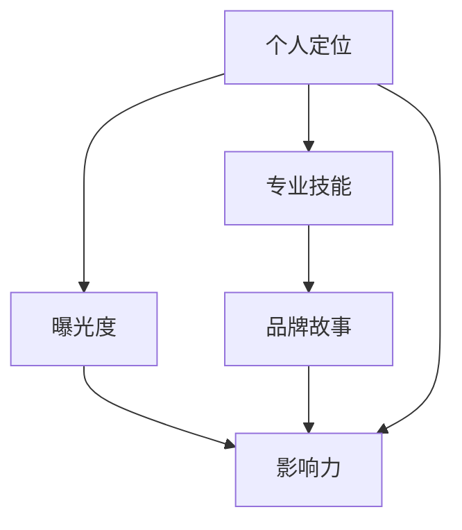

                 

## 1. 背景介绍

### 1.1 问题由来
在数字化时代，个人品牌的重要性日益凸显。通过在职场和社交平台建立独特的个人品牌，不仅能提升个人形象，还能增强职业竞争力，获得更多资源和机会。无论你是工程师、项目经理、产品经理，还是自由职业者，个人品牌的打造都已成为职业发展中不可或缺的一部分。

### 1.2 问题核心关键点
打造个人品牌，核心在于提升自我曝光度、专业技能和品牌故事。通过明确个人定位、积累专业经验、展示成果和影响他人，逐步树立自己在某一领域内的独特形象和权威地位。

### 1.3 问题研究意义
在职场竞争激烈的背景下，建立强大的个人品牌不仅能够提升个人影响力，还能在职业发展、资源获取、团队合作等方面获得明显优势。了解并掌握建立个人品牌的步骤和技巧，对于每个职场人士都具有重要意义。

## 2. 核心概念与联系

### 2.1 核心概念概述

要建立个人品牌，首先需要明确几个核心概念：

- **个人定位**：明确自己在职场中的位置和核心竞争力，确定个人发展的方向和目标。
- **专业技能**：深入学习并掌握所在领域的核心技术和方法，具备解决问题的实际能力。
- **品牌故事**：讲述自己的职业故事、成长历程、成就和教训，建立情感连接和信任。
- **曝光度**：通过社交媒体、行业会议、项目展示等方式，持续增加个人在专业领域的曝光度。
- **影响力**：通过分享知识、帮助他人、参与社区等行为，树立专业权威，影响他人。

这些概念相互联系，共同构成了个人品牌构建的基础框架。

### 2.2 核心概念原理和架构的 Mermaid 流程图



这个流程图展示了个人品牌构建的逻辑关系：

1. 个人定位是起点，明确自己擅长什么、目标是什么。
2. 专业技能是基石，提供实际的工作能力和解决方案。
3. 品牌故事是灵魂，展现个性和情感连接。
4. 曝光度是手段，通过各种方式让更多人知道和了解你。
5. 影响力是目标，通过建立信任和影响，提升个人在领域内的权威。

## 3. 核心算法原理 & 具体操作步骤

### 3.1 算法原理概述

建立个人品牌的过程，可以类比为一种“算法”，通过不断迭代和优化，逐步提升个人品牌的影响力和价值。这个“算法”的核心在于不断地曝光、学习和影响，形成正向循环。

### 3.2 算法步骤详解

#### 步骤 1: 确定个人定位

明确个人在职场中的角色和核心竞争力。这需要对自己的优势、兴趣和行业趋势进行深入分析。例如，如果你是一名软件工程师，可以定位为“技术专家”，专注于某一技术栈或领域。

#### 步骤 2: 积累专业技能

选择某一专业领域，深入学习其核心技术和方法。可以通过阅读书籍、参加培训、参与项目等方式积累经验。不断提升自己在该领域的竞争力。

#### 步骤 3: 分享和展示成果

通过写博客、做演讲、参与开源项目等方式，将自己的成果和经验分享给更多人。展示自己的专业知识和能力，建立信任和影响力。

#### 步骤 4: 建立品牌故事

讲述自己的职业故事、成长历程、成就和教训。这个故事要真实、感人，能与他人产生共鸣，建立起情感连接。

#### 步骤 5: 持续曝光和提升影响力

通过社交媒体、行业会议、项目展示等方式，持续增加个人在专业领域的曝光度。积极参与社区讨论，回答问题，帮助他人，树立专业权威。

### 3.3 算法优缺点

建立个人品牌的方法有以下优点：

- **广泛曝光**：通过多种渠道展示自己，增加个人曝光度。
- **正向循环**：通过不断学习和分享，逐步提升个人影响力和价值。
- **建立信任**：通过真实的故事和专业能力，建立情感连接和信任。

同时，也存在一些局限性：

- **时间和资源投入**：建立个人品牌需要时间和精力的投入，尤其是初期阶段。
- **难以量化**：个人品牌的影响力难以精确量化，难以评估效果。
- **需要持续维护**：品牌塑造不是一劳永逸的，需要持续的维护和更新。

### 3.4 算法应用领域

建立个人品牌的方法适用于各种职业和行业，包括但不限于：

- 软件工程师：通过技术博客、开源项目、技术分享会等展示技术实力。
- 产品经理：通过产品案例、市场分析、用户调研等展示市场洞察力。
- 自由职业者：通过作品集、客户反馈、社交媒体等展示专业能力。
- 企业高管：通过公司成功案例、领导力分享、行业论坛等展示领导力和影响力。

## 4. 数学模型和公式 & 详细讲解

### 4.1 数学模型构建

假设个人品牌的影响力 $I$ 可以通过以下几个因素计算得出：

$$
I = f(\text{曝光度} \times \text{专业技能} \times \text{品牌故事})
$$

其中，$f$ 是一个函数，表示多个因素的加权和。

### 4.2 公式推导过程

假设：

- $\text{曝光度} = E$
- $\text{专业技能} = S$
- $\text{品牌故事} = P$

则

$$
I = a \times E + b \times S + c \times P
$$

其中 $a, b, c$ 是加权系数，可以根据具体情况进行调整。

### 4.3 案例分析与讲解

假设一个软件工程师希望提升个人品牌影响力。

- 曝光度：通过GitHub开源项目、技术博客、社交媒体分享等方式，可以增加曝光度。
- 专业技能：通过学习新技术、参与大项目、发布技术文章等方式，提升专业技能。
- 品牌故事：通过分享自己的职业经历、成长故事、技术挑战等，建立情感连接。

假设 $a=0.4, b=0.3, c=0.3$，则

$$
I = 0.4E + 0.3S + 0.3P
$$

通过不断提升这三个因素的值，可以逐步提升个人品牌影响力。

## 5. 项目实践：代码实例和详细解释说明

### 5.1 开发环境搭建

建立个人品牌不需要复杂的开发环境，主要需要一些基本工具：

1. **GitHub**：用于展示开源项目和代码。
2. **博客平台**：如Medium、CSDN、掘金等，用于发布技术文章和分享经验。
3. **社交媒体**：如LinkedIn、Twitter、微信等，用于增加曝光度。

### 5.2 源代码详细实现

假设你是软件工程师，可以通过以下步骤建立个人品牌：

1. **GitHub项目展示**：
   - 在GitHub上创建一个仓库，用于展示自己的开源项目。
   - 定期更新代码和文档，确保项目活跃度。
   - 使用GitHub Pages将项目转化为静态网站展示。

2. **技术博客发布**：
   - 选择一个博客平台，如Medium、CSDN等。
   - 撰写技术文章，分享项目经验、技术心得等。
   - 定期发布新文章，保持博客更新。

3. **社交媒体互动**：
   - 在LinkedIn、Twitter、微信等社交媒体上发布技术内容。
   - 积极参与行业讨论，回答技术问题。
   - 关注行业大咖和公司，扩展人脉。

### 5.3 代码解读与分析

以下是一个简单的GitHub项目展示代码：

```python
from git import Repo
import os

def create_github_page(repo_name):
    # 创建仓库
    repo = Repo.clone_from(f'https://github.com/{repo_name}', repo_name)
    
    # 生成静态页面
    if not os.path.exists('build'):
        os.mkdir('build')
    os.chdir('build')
    os.system('hugo init && hugo')
    os.chdir('../')
    
    # 链接到静态页面
    with open('index.html', 'w') as f:
        f.write(f'<link rel="stylesheet" href="{repo_name}/build/css/base.css">')
        f.write(f'<body>\n<h1>Welcome to {repo_name}</h1>\n</body>')
```

这个代码展示了如何通过GitHub Pages将GitHub项目转化为静态页面，方便展示。

### 5.4 运行结果展示

通过上述步骤，你可以在GitHub上展示自己的开源项目，在技术博客上分享经验，在社交媒体上互动，逐步提升个人品牌影响力。

## 6. 实际应用场景

### 6.1 职场发展

在职场中，个人品牌可以帮助你获得更多资源和机会，提升职业竞争力。例如，一个技术专家通过技术博客和开源项目展示自己的能力，可以吸引更多猎头的注意，获得更好的工作机会。

### 6.2 影响力塑造

通过分享知识和经验，可以建立起自己在某一领域内的权威。例如，一个数据科学家可以通过撰写数据分析文章、参与数据分析社区等方式，树立自己在数据分析领域的权威地位。

### 6.3 社区建设

在技术社区中，个人品牌可以帮助你建立影响力，推动技术交流和创新。例如，一个前端开发者可以通过技术分享会、开源项目展示等方式，吸引更多开发者关注和参与。

### 6.4 未来应用展望

未来，个人品牌建设将更多地依赖于技术社区和社交媒体。随着技术的不断进步，个人品牌的影响力和传播范围将进一步扩大，成为职业发展的重要资产。

## 7. 工具和资源推荐

### 7.1 学习资源推荐

1. **《打造个人品牌》系列博文**：由品牌专家撰写，系统讲解个人品牌建立的方法和技巧。
2. **LinkedIn Learning**：提供关于个人品牌建设的课程和资源，涵盖职场技能、网络社交等多个方面。
3. **《个人品牌管理》书籍**：详细介绍个人品牌塑造的方法和案例，适合职场人士阅读。

### 7.2 开发工具推荐

1. **GitHub**：用于展示和分享开源项目。
2. **Medium、CSDN、掘金**：技术博客发布平台，适合分享技术文章和经验。
3. **LinkedIn、Twitter、微信**：社交媒体平台，用于增加曝光度和互动。

### 7.3 相关论文推荐

1. **《数字时代个人品牌建设》**：探讨在数字时代如何建立个人品牌，适合职场人士阅读。
2. **《社交媒体与个人品牌》**：分析社交媒体在个人品牌建设中的作用，适合技术爱好者阅读。

## 8. 总结：未来发展趋势与挑战

### 8.1 研究成果总结

建立个人品牌的过程需要明确个人定位、积累专业技能、分享和展示成果、建立品牌故事，并通过持续曝光和提升影响力。这些步骤相辅相成，共同构成了个人品牌建立的框架。

### 8.2 未来发展趋势

未来，个人品牌建设将更多依赖于技术社区和社交媒体。技术的进步将提供更多展示和互动的平台，帮助个人品牌更容易被人们发现和关注。

### 8.3 面临的挑战

建立个人品牌需要时间和精力的投入，同时需要持续维护。如何在碎片化的时间里保持稳定的输出，是每个职场人士需要面对的挑战。

### 8.4 研究展望

未来，如何将个人品牌和职业发展更好地结合，如何利用数据和技术手段提升个人品牌建设的效果，是值得深入研究的课题。

## 9. 附录：常见问题与解答

**Q1: 个人品牌和职业发展有哪些联系？**

A: 个人品牌和职业发展紧密相关。通过建立个人品牌，你可以提升自己的曝光度和影响力，获得更多资源和机会，加速职业发展。

**Q2: 如何确定自己的个人定位？**

A: 可以通过SWOT分析（优势、劣势、机会、威胁）来确定自己的个人定位。明确自己的优势和劣势，识别行业机会和威胁，从而制定明确的发展方向。

**Q3: 如何积累专业技能？**

A: 选择某一专业领域，通过阅读书籍、参加培训、参与项目等方式深入学习。不断提升自己在该领域的核心能力和技术栈。

**Q4: 如何分享和展示成果？**

A: 通过写博客、做演讲、参与开源项目等方式，将自己的成果和经验分享给更多人。展示自己的专业知识和能力，建立信任和影响力。

**Q5: 如何建立品牌故事？**

A: 讲述自己的职业故事、成长历程、成就和教训。这个故事要真实、感人，能与他人产生共鸣，建立起情感连接。

---

作者：禅与计算机程序设计艺术 / Zen and the Art of Computer Programming

