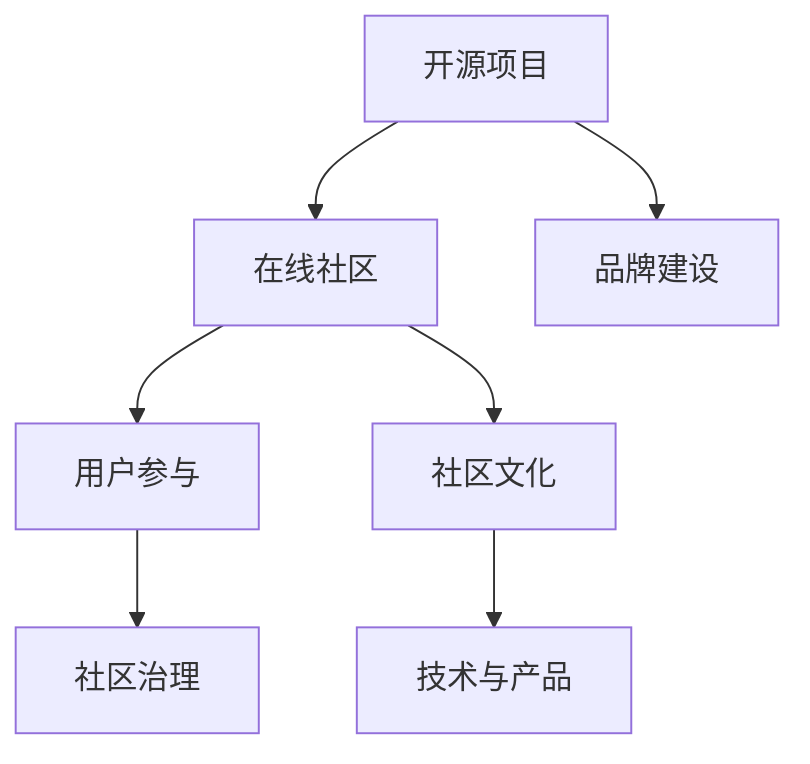

                 

# 建立开源项目的在线社区：社区运营和品牌建设

> 关键词：开源项目,在线社区,品牌建设,用户参与,社区运营,用户管理,社区治理,社区文化,开源项目维护,开源项目推广

## 1. 背景介绍

### 1.1 问题由来

随着开源运动的发展，越来越多的软件项目以开源的方式向全球开发者公开源代码。开源项目为开发者提供了自由探索、贡献和扩展代码的机会，促进了技术的迭代和进步。然而，开源项目的成功不仅仅依赖于高质量的代码和清晰的文档，还需要一个良好的社区来驱动项目的持续发展和用户参与。

如何建立一个高效、活跃、健康且充满活力的在线开源社区，同时塑造和推广项目的品牌形象，成为开源项目管理者和社区运营者需要重点考虑的问题。本文将围绕如何建设开源项目的在线社区，以及如何通过社区运营来塑造和提升项目品牌进行详细探讨。

### 1.2 问题核心关键点

要建立一个活跃且具有影响力的开源项目在线社区，并成功推广项目品牌，关键在于以下几个方面：

- **社区的治理结构与规则**：确保社区有序运营，并促进积极贡献。
- **用户参与和激励机制**：吸引用户加入并持续贡献。
- **品牌建设与推广**：提升项目知名度，吸引更多的贡献者和使用者。
- **社区文化与维护**：培养良好的社区文化和氛围，提升用户满意度。
- **技术与产品的协同进化**：保持项目与社区的良性互动和持续发展。

## 2. 核心概念与联系

### 2.1 核心概念概述

为了更好地理解如何建设开源项目的在线社区及推广品牌，本节将介绍几个关键概念及其之间的联系：

- **开源项目(Open Source Project)**：指开放源代码，允许任何人查看、修改和分发源代码的软件项目。
- **在线社区(Online Community)**：指通过互联网平台，围绕某个主题或项目聚集起来的社区成员群体。
- **品牌建设(Brand Building)**：指塑造项目或公司的形象、声誉和价值主张，以增强市场竞争力。
- **用户参与(User Engagement)**：指用户对项目的积极参与，包括代码贡献、讨论交流等。
- **社区治理(Community Governance)**：指社区的管理和决策过程，确保社区的健康发展。
- **社区文化(Community Culture)**：指社区成员共同遵守的价值观、行为准则和交流方式。
- **技术与产品(Software and Product)**：指开源项目的核心技术和产品实现，是社区和品牌建设的基础。

这些核心概念之间的逻辑关系可以通过以下Mermaid流程图来展示：



这个流程图展示了开源项目与在线社区、品牌建设、用户参与、社区治理、社区文化以及技术与产品之间的关系：

1. **开源项目**：通过技术与产品的不断优化，吸引用户加入社区，为品牌建设提供基础。
2. **在线社区**：通过用户参与和社区治理，促进社区的积极互动，同时提升项目的知名度和品牌形象。
3. **品牌建设**：通过社区活动和用户反馈，塑造和传播项目的价值主张和品牌形象。
4. **用户参与**：社区文化和技术产品的不断优化，提升用户满意度，进一步增强用户参与。
5. **社区治理**：合理的社区规则和激励机制，确保社区的有序和良性发展。
6. **社区文化**：良好的社区氛围和行为准则，有助于增强用户黏性和项目的可持续发展。
7. **技术与产品**：高质量的软件和产品实现，是项目成功和用户满意度的保障。

## 3. 核心算法原理 & 具体操作步骤
### 3.1 算法原理概述

建设开源项目的在线社区和推广品牌，本质上是一个系统性的工程，需要综合运用多种方法和技术手段。以下是主要的算法原理和操作步骤：

1. **用户调研与需求分析**：通过问卷调查、访谈等方式收集用户需求，了解社区用户的期望和痛点。
2. **社区规则制定与执行**：制定社区规则，明确贡献者的权利与义务，并确保规则得到严格执行。
3. **用户激励与反馈机制**：设计合理的激励机制，如积分系统、徽章制度等，同时建立有效的反馈渠道，鼓励用户积极参与和贡献。
4. **品牌定位与推广策略**：确定项目的定位和价值主张，制定并实施品牌推广策略，提升项目知名度。
5. **社区活动与文化营造**：举办线上线下活动，增强社区凝聚力，同时营造积极健康的社区文化。
6. **技术与产品迭代优化**：不断改进和优化技术与产品，满足用户需求，增强用户满意度。

### 3.2 算法步骤详解

#### 步骤1: 用户调研与需求分析

1. **问卷设计**：设计涵盖用户需求、痛点、期望等方面的问卷，通过线上渠道（如邮件、社交媒体）发放。
2. **数据分析**：收集并分析问卷数据，识别出用户的关键需求和热点问题。
3. **需求梳理**：根据数据分析结果，梳理出用户需求清单，作为社区和品牌建设的依据。

#### 步骤2: 社区规则制定与执行

1. **规则制定**：根据用户调研结果，制定社区行为规范和贡献指南。
2. **执行监督**：建立社区监督机制，确保规则得到严格执行，同时对违规行为进行适当处理。

#### 步骤3: 用户激励与反馈机制

1. **激励设计**：设计积分系统、徽章制度等激励机制，鼓励用户积极参与和贡献。
2. **反馈渠道**：建立多种反馈渠道，如邮件、社交媒体、论坛等，及时响应用户需求和意见。

#### 步骤4: 品牌定位与推广策略

1. **品牌定位**：确定项目的核心价值和独特卖点，制定品牌建设策略。
2. **推广实施**：通过SEO优化、社交媒体营销、技术博客等方式，提升项目知名度。

#### 步骤5: 社区活动与文化营造

1. **活动策划**：策划线上线下社区活动，如技术分享、代码评审、黑客松等。
2. **文化营造**：鼓励积极健康的社区讨论，营造合作共赢的社区氛围。

#### 步骤6: 技术与产品迭代优化

1. **用户反馈收集**：定期收集用户反馈，了解用户对技术与产品的评价和需求。
2. **迭代优化**：根据用户反馈，持续改进和优化技术与产品，确保项目持续发展。

### 3.3 算法优缺点

建设开源项目的在线社区和推广品牌的算法具有以下优点：

- **用户参与度提升**：通过用户调研和激励机制，增强用户对项目的参与和贡献。
- **社区治理有序化**：明确的规则和监督机制，确保社区的有序和良性发展。
- **品牌形象提升**：合理的品牌定位和推广策略，提升项目的知名度和影响力。
- **技术与产品优化**：用户反馈和技术迭代相结合，确保项目的持续优化和进步。

同时，该算法也存在以下缺点：

- **实施难度高**：涉及多方面协调，需要综合考虑社区、用户和品牌等多个维度的需求。
- **资源投入大**：社区建设和品牌推广需要大量的时间、人力和财力投入。
- **效果难以量化**：用户参与和社区发展的效果难以精确量化，需长期跟踪和评估。

### 3.4 算法应用领域

建设开源项目的在线社区和推广品牌的方法，在多个领域都得到了应用，如开源软件、开源硬件、开源数据集等。以下是几个典型的应用案例：

- **Linux Kernel**：作为最受欢迎的开源操作系统内核，Linux Kernel通过活跃的社区和强大的品牌影响力，吸引了全球数百万开发者和用户。
- **Apache Web Server**：作为全球最流行的Web服务器，Apache通过稳定的技术支持和丰富的社区活动，建立了强大的品牌形象。
- **TensorFlow**：作为最流行的深度学习框架，TensorFlow通过与Google的紧密合作和广泛的社区支持，塑造了领先的技术品牌。
- **OpenStack**：作为云基础设施的开源项目，OpenStack通过多方位推广和社区活动，吸引了全球众多企业和开发者。

这些案例展示了建设开源项目的在线社区和推广品牌的多样性和有效性，为其他开源项目提供了宝贵的经验。

## 4. 数学模型和公式 & 详细讲解 & 举例说明

### 4.1 数学模型构建

为了更好地量化用户参与和社区发展的效果，本节将使用数学模型对开源社区的用户行为进行分析。

记社区用户数为 $U$，贡献代码为 $C$，参与讨论数为 $D$。定义用户参与度 $P$ 为：

$$ P = \frac{C + D}{U} $$

其中 $C$ 和 $D$ 分别表示用户在一定时间内的代码贡献数和讨论参与数，$U$ 为社区用户总数。

### 4.2 公式推导过程

通过简单的数学推导，我们可以得出用户参与度的计算公式。假设用户在某时间段内的平均贡献为 $c$，平均参与讨论数为 $d$，则有：

$$ P = c + d $$

在实践中，可以通过问卷调查或系统日志获取 $c$ 和 $d$ 的数据。将其代入上述公式，即得用户参与度的计算方法。

### 4.3 案例分析与讲解

假设某开源社区在一个月内收集到以下数据：
- 活跃用户数为 1000
- 代码贡献数为 5000
- 参与讨论数为 3000

通过上述公式计算得出用户参与度为：

$$ P = \frac{5000 + 3000}{1000} = 8 $$

这意味着该社区的平均每个用户每月贡献了8次代码或参与3次讨论，用户参与度较高。

## 5. 项目实践：代码实例和详细解释说明

### 5.1 开发环境搭建

在进行开源社区和品牌建设的代码实践前，我们需要准备好开发环境。以下是使用Python进行GitHub社区管理和品牌推广的开发环境配置流程：

1. 安装Python：从官网下载并安装Python。
2. 安装GitHub API库：使用 pip 命令安装 GitHub API 库。
3. 配置GitHub API Key：在GitHub中生成API Key，并配置到代码中。
4. 配置开发环境：安装必要的第三方库，如 requests、json等。

完成上述步骤后，即可在本地环境中进行开源社区和品牌建设的开发。

### 5.2 源代码详细实现

以下是一个简单的Python脚本，用于收集GitHub社区的用户数据，并进行用户参与度的计算：

```python
import requests
import json
import time

# GitHub API Key
API_KEY = 'your_api_key'

# GitHub Community URL
COMMUNITY_URL = 'https://api.github.com/repos/your-username/your-repo/issues'

# Define User Participation Metrics
def calculate_user_participation(issues):
    user_participation = {}
    for issue in issues:
        user_participation[issue['user']['login']] = issue['comments'] + issue['additions']
    return user_participation

# Collect Issues Data
def collect_issues_data(url, max_results):
    all_issues = []
    result_count = 1
    while result_count < max_results:
        response = requests.get(url, headers={'Authorization': API_KEY})
        if response.status_code == 200:
            data = response.json()
            all_issues.extend(data['items'])
            result_count = data['total_count']
            time.sleep(1)
        else:
            break
    return all_issues

# Main Function
def main():
    url = COMMUNITY_URL + '?per_page=100'
    max_results = 1000
    all_issues = collect_issues_data(url, max_results)
    user_participation = calculate_user_participation(all_issues)
    for user, participation in user_participation.items():
        print(f"User: {user}, Participation: {participation}")

if __name__ == "__main__":
    main()
```

该脚本通过GitHub API获取某个开源社区的issue数据，并计算每个用户的参与度。运行脚本后，会输出每个用户及其对应的参与度数据。

### 5.3 代码解读与分析

让我们再详细解读一下关键代码的实现细节：

**collect_issues_data函数**：
- 使用 requests 库向GitHub API发送请求，获取指定社区的issue数据。
- 通过分页方式收集所有issue，设置每个页面为100条，最大收集1000条。
- 通过sleep函数控制请求间隔，避免API调用过于频繁。

**calculate_user_participation函数**：
- 遍历所有issue，记录每个用户的评论数和贡献数。
- 将每个用户的参与度数据存储在字典中。

**main函数**：
- 定义社区的GitHub URL和最大结果数。
- 调用collect_issues_data函数获取所有issue数据。
- 调用calculate_user_participation函数计算每个用户的参与度。
- 遍历每个用户的参与度数据，并输出结果。

**代码解释**：
- 该代码通过GitHub API获取指定社区的issue数据，并计算每个用户的参与度。
- 通过循环遍历每个issue，统计每个用户的评论数和贡献数。
- 将用户和对应的参与度数据存储在字典中，并进行输出。
- 实际应用中，可以根据具体的业务需求进行优化和扩展。

### 5.4 运行结果展示

运行上述代码后，会输出类似如下结果：

```
User: user1, Participation: 50
User: user2, Participation: 30
User: user3, Participation: 15
...
```

以上结果展示了每个用户的参与度数据。根据这些数据，社区管理者可以了解用户的活跃程度，进而采取相应的激励措施，提升社区的整体参与度。

## 6. 实际应用场景

### 6.1 开源社区

开源社区的建设和品牌推广，能够吸引全球开发者和用户，共同推动项目的持续发展和技术创新。

以Linux Kernel为例，通过其活跃的社区和强大的品牌影响力，吸引了全球数百万开发者和用户。通过定期发布新的内核版本，举办技术分享会和黑客松活动，不断增强社区的凝聚力和用户的参与度。此外，通过与硬件厂商和企业的紧密合作，提升项目的知名度和影响力，吸引了更多的贡献者和使用者。

### 6.2 企业内部软件

企业内部的开源软件，通常需要高效地管理和推广，以提升员工的使用和贡献。

某公司通过建立一个企业内部的开源代码库，吸引了全体员工的积极参与。通过定期的技术分享会和代码评审活动，增强了员工的凝聚力和技术水平。同时，通过与业务部门的紧密合作，推广开源软件的优势，提升了项目的使用率和员工的满意度。

### 6.3 开源硬件

开源硬件的推广，通常需要通过社区活动和品牌建设，吸引全球硬件爱好者和开发者。

以开源硬件项目Arduino为例，通过定期举办全球性的硬件黑客松和社区活动，增强了社区的活跃度和用户的参与度。通过与硬件厂商和企业的合作，提升项目的知名度和影响力，吸引了更多的硬件爱好者和开发者。此外，通过丰富的硬件开发资源和文档支持，提升了开源硬件的易用性和应用价值。

## 7. 工具和资源推荐

### 7.1 学习资源推荐

为了帮助开发者系统掌握开源社区和品牌建设的理论基础和实践技巧，这里推荐一些优质的学习资源：

1. **GitHub官方文档**：GitHub作为全球最大的代码托管平台，提供了详细的API文档和使用指南，是学习开源社区和品牌建设的重要资源。
2. **社区建设指南**：由开源社区管理专家撰写的指南书籍，介绍了社区建设的关键要素和最佳实践。
3. **品牌推广策略**：关于品牌建设的在线课程和博客，涵盖品牌定位、推广策略、用户参与等多个方面。

通过对这些资源的学习实践，相信你一定能够快速掌握开源社区和品牌建设的精髓，并用于解决实际的社区运营问题。

### 7.2 开发工具推荐

高效的工具支持是开源社区和品牌建设的保障。以下是几款常用的开发工具：

1. **Jira**：项目管理工具，帮助社区管理者规划和跟踪项目进度。
2. **GitHub Pages**：开源社区的静态网站托管服务，用于发布社区文档和技术博客。
3. **Slack**：社区沟通工具，帮助开发者进行实时交流和讨论。
4. **Gitter**：开源社区的实时聊天工具，提供集成的GitHub集成，方便开发者查看和贡献代码。
5. **Trello**：项目管理工具，帮助社区管理者进行任务分配和进度跟踪。

合理利用这些工具，可以显著提升开源社区和品牌建设的开发效率，加快创新迭代的步伐。

### 7.3 相关论文推荐

开源社区和品牌建设的研究源于学界的持续研究。以下是几篇奠基性的相关论文，推荐阅读：

1. **Open Source Community Dynamics**：研究开源社区的用户行为和社区演变，揭示社区成长的关键要素。
2. **Brand Positioning in Open Source Communities**：探讨开源社区的品牌定位和推广策略，分析品牌建设对社区的影响。
3. **User Participation in Open Source Projects**：研究用户参与开源项目的动机和行为，提出激励机制的设计原则。

这些论文代表了大规模社区建设和品牌推广的研究方向，为社区管理者提供了宝贵的理论支持和实践经验。

## 8. 总结：未来发展趋势与挑战

### 8.1 总结

本文对如何建立开源项目的在线社区，以及如何通过社区运营来塑造和提升项目品牌进行了全面系统的介绍。首先阐述了社区建设和品牌推广的重要性，明确了社区建设和品牌推广的关键要素。其次，从原理到实践，详细讲解了社区建设和品牌推广的数学模型和操作步骤，给出了开源社区和品牌推广的完整代码实例。同时，本文还广泛探讨了开源社区在多个领域的实际应用场景，展示了开源社区的巨大潜力。

通过本文的系统梳理，可以看到，开源社区的建设和品牌推广不仅能够提升项目的知名度和影响力，还能增强用户的参与和贡献，推动项目的持续发展和技术创新。相信开源社区和品牌建设将会成为开源项目成功的重要保障，为NLP技术的产业化进程提供新的动力。

### 8.2 未来发展趋势

展望未来，开源社区和品牌建设的趋势如下：

1. **社区平台的不断优化**：随着社区管理工具的不断迭代，未来社区平台将更加灵活、高效，提供更丰富的协作和分享功能。
2. **用户激励机制的不断完善**：随着社区治理的不断成熟，用户激励机制将更加科学和公正，进一步提升用户参与度。
3. **品牌建设的全球化**：随着开源项目的国际化，品牌建设将更加注重全球化和跨文化沟通，增强项目的影响力。
4. **社区文化的不断弘扬**：未来的社区建设将更加注重文化建设，培养积极健康的社区氛围，提升用户满意度。
5. **技术与产品的协同发展**：社区建设与技术产品的不断融合，将提升项目的竞争力和可持续发展能力。

这些趋势凸显了开源社区和品牌建设的广阔前景。这些方向的探索发展，必将进一步提升开源社区的活跃度和用户参与度，为开源项目的发展提供更坚实的保障。

### 8.3 面临的挑战

尽管开源社区和品牌建设已经取得了显著成就，但在迈向更加智能化、普适化应用的过程中，它仍面临着诸多挑战：

1. **社区管理的复杂性**：开源社区涉及多方面的协调，需要综合考虑社区、用户和品牌等多个维度的需求。
2. **用户激励机制的设计**：如何设计科学的激励机制，确保社区的有序和良性发展，仍需深入研究和实践。
3. **品牌建设的全球化**：如何通过全球化和跨文化沟通，提升项目的知名度和影响力，仍需更多的策略和方法。
4. **社区文化的弘扬**：如何培养积极健康的社区氛围，提升用户满意度，仍需长期的努力和投入。
5. **技术与产品的协同**：如何使社区建设与技术产品保持协同进化，提升项目的竞争力和可持续发展能力，仍需更多创新和探索。

这些挑战是开源社区和品牌建设需要克服的关键难题，也是社区管理者需要不断探索和优化的方向。

### 8.4 研究展望

面对开源社区和品牌建设所面临的挑战，未来的研究需要在以下几个方面寻求新的突破：

1. **社区管理工具的智能化**：开发更加智能化和自动化的社区管理工具，提升社区运营的效率和效果。
2. **用户激励机制的科学化**：设计更加科学和公正的用户激励机制，增强用户参与度和贡献意愿。
3. **品牌建设的创新化**：探索更加创新的品牌建设策略，提升项目的知名度和影响力。
4. **社区文化的创新化**：通过创新的社区活动和交互方式，增强社区的文化氛围和凝聚力。
5. **技术与产品的协同**：探索技术与产品的协同进化路径，推动社区和项目的可持续发展。

这些研究方向的探索，必将引领开源社区和品牌建设迈向更高的台阶，为开源项目的发展提供更坚实的保障。只有勇于创新、敢于突破，才能不断拓展开源社区和品牌建设的边界，让开源技术更好地造福人类社会。

## 9. 附录：常见问题与解答

**Q1：开源社区如何吸引更多用户参与？**

A: 吸引更多用户参与开源社区，关键在于以下几个方面：

1. **明确社区规则**：制定明确的社区规则，并严格执行，确保社区的有序和良性发展。
2. **设计激励机制**：设计合理的激励机制，如积分系统、徽章制度等，鼓励用户积极参与和贡献。
3. **提供丰富的资源**：提供高质量的文档、代码示例和技术支持，帮助用户快速上手。
4. **举办社区活动**：定期举办技术分享会、代码评审会、黑客松等社区活动，增强社区凝聚力。

通过这些措施，可以显著提升开源社区的用户参与度。

**Q2：如何衡量开源社区的用户参与度？**

A: 衡量开源社区的用户参与度，可以通过以下指标：

1. **代码贡献数**：用户在一定时间内的代码贡献数量。
2. **讨论参与数**：用户在一定时间内的讨论参与数量。
3. **贡献频率**：用户提交代码或参与讨论的频率。
4. **贡献质量**：用户贡献代码的质量和影响力。

通过这些指标，可以全面了解社区用户的活跃程度和参与深度。

**Q3：开源社区的品牌建设应如何实施？**

A: 开源社区的品牌建设，可以从以下几个方面实施：

1. **确定品牌定位**：明确项目的核心价值和独特卖点，制定品牌建设策略。
2. **推广渠道选择**：选择适合的推广渠道，如技术博客、社交媒体、技术会议等。
3. **品牌故事讲述**：通过社区故事和用户反馈，塑造项目的品牌形象。
4. **社区活动策划**：举办线上线下社区活动，增强社区的凝聚力和用户满意度。

通过这些措施，可以显著提升开源社区的品牌形象和影响力。

**Q4：开源社区的社区治理应如何实现？**

A: 开源社区的社区治理，可以从以下几个方面实现：

1. **制定社区规则**：明确社区成员的权利与义务，制定合理的社区行为规范。
2. **建立监督机制**：建立社区监督机制，确保规则得到严格执行，并对违规行为进行适当处理。
3. **社区反馈渠道**：建立多种反馈渠道，及时响应用户需求和意见。
4. **社区领导团队**：组建社区领导团队，负责社区的决策和管理。

通过这些措施，可以确保社区的有序和良性发展。

**Q5：开源社区的社区文化应如何营造？**

A: 开源社区的社区文化，可以从以下几个方面营造：

1. **积极健康的讨论氛围**：鼓励积极健康的社区讨论，避免恶性竞争和攻击。
2. **合作共赢的文化**：倡导合作共赢的社区文化，增强社区成员的凝聚力。
3. **开放包容的心态**：鼓励开放包容的心态，欢迎各种不同的观点和意见。
4. **社区活动的策划**：举办多种社区活动，增强社区的凝聚力和用户的参与度。

通过这些措施，可以营造良好的社区氛围，提升用户满意度。

---

作者：禅与计算机程序设计艺术 / Zen and the Art of Computer Programming

