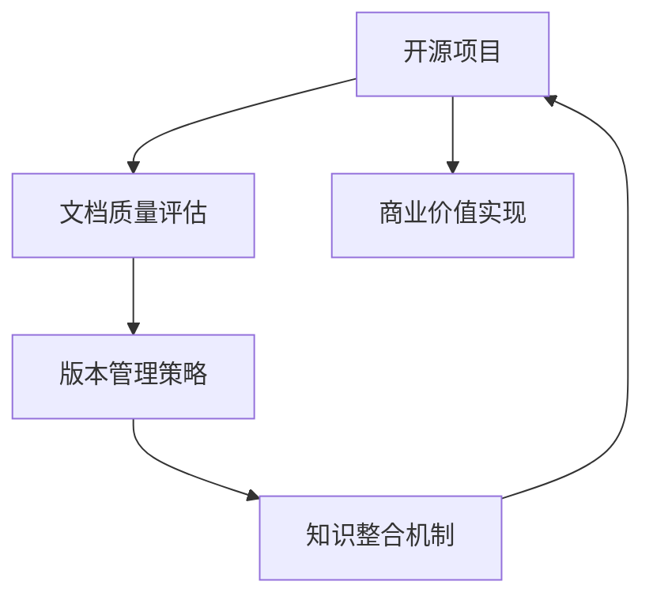

                 

## 1. 背景介绍

在当前数字化转型加速的时代，开源项目文档的商业价值日益凸显。企业利用开源项目的代码和文档，不仅可以降低技术开发成本，提升开发效率，还能借助开源社区的力量加速产品迭代。但如何最大限度地发挥开源项目文档的价值，并将其转化为实际商业收益，成为摆在企业面前的重要课题。

### 1.1 问题由来

随着开源运动的蓬勃发展，越来越多的企业意识到利用开源项目进行技术创新的潜在价值。开源社区不仅提供了丰富的代码库，还汇聚了全球顶级的技术专家。然而，如何系统化地评估和利用开源项目文档的商业价值，是很多企业面临的挑战。

企业发现，即使采用了优秀的开源技术，由于缺乏对文档价值的系统化管理和利用，导致技术团队在实际项目开发中遇到了诸多难题：

1. **技术适配问题**：开源项目文档往往缺乏对特定业务场景的适配说明，需要开发者自行适应，增加了开发难度和周期。
2. **版本兼容问题**：开源项目文档版本更新频繁，但企业内部版本管理不足，容易出现兼容问题，影响项目进度。
3. **技术培训问题**：开源项目文档风格各异，内容质量不一，导致技术培训复杂度高，培训效果差。
4. **知识整合问题**：开源项目文档零散且分散，缺乏系统化整合，难以形成企业内部知识体系，影响技术积累和知识传承。

### 1.2 问题核心关键点

开源项目文档商业价值的实现，关键在于如何系统化地评估和管理文档的价值，并将其与企业的技术战略和业务需求有效结合。核心在于以下三个方面：

1. **文档质量评估**：从技术适配性、文档结构、语言风格等方面对开源文档进行全面评估，确定其适用性和价值。
2. **版本管理策略**：建立有效的版本管理系统，跟踪开源文档的更新和迭代，确保企业内部使用的文档与最新版本一致。
3. **知识整合机制**：将开源文档与企业内部的技术文档、培训材料、编码规范等系统整合，形成完整、统一的知识体系，促进知识传承和技能提升。

## 2. 核心概念与联系

为了更好地理解如何利用开源项目文档实现商业价值，本节将介绍几个关键概念及其相互关系：

- **开源项目**：基于开源许可证提供源代码和文档的项目，如Apache、MIT、GPL等。
- **文档质量评估**：通过量化和定性分析，评估开源文档的质量和适用性，包括代码规范、文档结构、语言风格等方面。
- **版本管理策略**：对开源文档进行版本跟踪和管理系统化管理，确保企业内部使用的文档与最新版本保持一致。
- **知识整合机制**：将开源文档与企业内部文档系统整合，形成统一的知识体系，促进知识传承和技能提升。

这些核心概念之间的逻辑关系可以通过以下Mermaid流程图来展示：



这个流程图展示了几者在开源项目文档商业价值实现过程中的相互关系：

1. 开源项目作为基础资源，提供源代码和文档。
2. 文档质量评估对开源文档进行全面评估，确定其适用性。
3. 版本管理策略跟踪文档更新，确保内部使用的一致性。
4. 知识整合机制将文档与内部知识系统整合，促进知识传承和技能提升。
5. 通过以上策略和方法，最终实现开源项目文档的商业价值。

## 3. 核心算法原理 & 具体操作步骤
### 3.1 算法原理概述

开源项目文档的商业价值实现，本质上是一个系统化的文档管理和利用过程。其核心思想是：通过评估开源文档的质量和适用性，制定有效的版本管理策略，将其整合到企业的知识体系中，从而提升企业的技术开发效率和创新能力。

形式化地，假设开源文档为 $D$，企业内部文档为 $E$，知识整合后的文档系统为 $F$。实现商业价值的流程包括：

1. 通过文档质量评估模型 $M$，评估 $D$ 的适用性。
2. 制定版本管理策略 $P$，将 $D$ 更新跟踪到最新版本 $D'$。
3. 通过知识整合机制 $I$，将 $D'$ 与 $E$ 系统整合，生成 $F$。
4. 将 $F$ 应用于实际项目开发，提升开发效率和创新能力。

### 3.2 算法步骤详解

基于系统化的文档管理和利用，开源项目文档的商业价值实现一般包括以下几个关键步骤：

**Step 1: 文档质量评估**

- **目标**：评估开源文档的质量和适用性，确定其对企业技术战略和业务需求的适用性。
- **方法**：
  - **文档评估指标**：包括代码规范、文档结构、语言风格、更新频率、社区活跃度等。
  - **评估工具**：如SonarQube、Coverity等，可以自动评估文档的质量和代码健康度。
  - **评估标准**：基于企业内部的技术规范和业务需求，确定评估标准和评分体系。

**Step 2: 版本管理策略**

- **目标**：确保企业内部使用的文档与最新版本一致，避免版本兼容问题。
- **方法**：
  - **版本控制工具**：如Git、SVN等，跟踪开源文档的更新和迭代。
  - **版本发布机制**：制定文档的发布和更新流程，确保文档的版本与企业内部使用一致。
  - **版本审计**：定期审计企业内部使用的文档版本，确保与最新版本一致。

**Step 3: 知识整合机制**

- **目标**：将开源文档与企业内部文档系统整合，形成统一的知识体系。
- **方法**：
  - **文档管理系统**：如Confluence、SharePoint等，集中管理企业内部的技术文档、培训材料等。
  - **文档映射规则**：建立开源文档与企业内部文档的映射规则，确保文档一致性。
  - **知识库集成**：将开源文档与企业内部的知识库系统进行集成，形成统一的知识体系。

**Step 4: 商业价值实现**

- **目标**：将知识整合后的文档应用于实际项目开发，提升开发效率和创新能力。
- **方法**：
  - **技术适配**：根据企业内部的技术规范和业务需求，适配开源文档，形成适用的技术方案。
  - **开发支持**：利用知识整合后的文档，提升技术团队的技术水平和开发效率。
  - **持续改进**：根据项目反馈和文档更新，不断优化和改进文档管理系统。

### 3.3 算法优缺点

开源项目文档商业价值的实现，通过系统化的文档管理和利用，具有以下优点：

1. **降低开发成本**：利用开源项目文档，可以大大减少技术团队在文档编写和适配上的工作量，降低开发成本。
2. **提升开发效率**：通过文档质量评估和版本管理，确保使用的文档与最新版本一致，提升开发效率和质量。
3. **加速知识传承**：通过知识整合机制，将开源文档与企业内部文档系统整合，促进知识传承和技能提升。
4. **提升技术创新能力**：利用开源社区的技术资源，提升企业的技术创新能力和竞争力。

同时，该方法也存在一定的局限性：

1. **文档质量不一**：开源项目文档质量参差不齐，可能存在代码规范不统一、文档结构不清晰等问题。
2. **版本管理复杂**：开源项目文档版本更新频繁，需要企业内部建立有效的版本管理系统，增加管理复杂度。
3. **知识整合困难**：企业内部文档系统与开源文档系统整合存在一定难度，需要额外的工作量。

尽管存在这些局限性，但通过系统化的管理和优化，可以最大限度地发挥开源项目文档的商业价值。

### 3.4 算法应用领域

开源项目文档商业价值的实现，在软件开发、数据科学、云计算、人工智能等多个领域都有广泛应用：

1. **软件开发**：利用开源项目文档进行技术适配和快速开发，提升开发效率和质量。
2. **数据科学**：利用开源项目文档进行数据处理和分析，提升数据科学家的工作效率。
3. **云计算**：利用开源项目文档进行云平台搭建和云服务优化，提升云计算能力。
4. **人工智能**：利用开源项目文档进行AI模型训练和优化，提升AI应用效果。

## 4. 数学模型和公式 & 详细讲解 & 举例说明

### 4.1 数学模型构建

本节将使用数学语言对开源项目文档商业价值实现过程进行更加严格的刻画。

假设企业内部使用的文档为 $E$，开源项目文档为 $D$，知识整合后的文档系统为 $F$。

定义文档质量评估模型为 $M$，版本管理策略为 $P$，知识整合机制为 $I$。则文档商业价值的实现过程可以表示为：

$$
F = I(M(D), P(D))
$$

其中 $M$ 和 $P$ 分别表示文档质量评估和版本管理策略的函数。

### 4.2 公式推导过程

以下我们以代码质量评估为例，推导计算文档质量的公式及其梯度的计算公式。

假设开源文档 $D$ 中包含 $n$ 行代码，每行代码的质量由以下几个指标综合决定：
- 代码规范度 $N$
- 代码复杂度 $C$
- 代码可读性 $R$
- 代码注释度 $Cm$
- 代码复用度 $Ru$

定义 $Q_i$ 为第 $i$ 行代码的质量，则有：

$$
Q_i = \frac{N_i + C_i + R_i + Cm_i + Ru_i}{5}
$$

其中 $N_i, C_i, R_i, Cm_i, Ru_i$ 分别为第 $i$ 行代码的各项指标评分。

对代码质量 $Q_i$ 求期望，得到文档质量 $Q$：

$$
Q = \frac{1}{n}\sum_{i=1}^n Q_i
$$

通过文档质量评估模型 $M$，将 $Q$ 映射到评分 $S$，则有：

$$
S = M(Q) = \begin{cases}
1.0 & Q \geq 3.0 \\
0.5 & 1.5 \leq Q < 3.0 \\
0.0 & Q < 1.5
\end{cases}
$$

在得到文档评分 $S$ 后，使用版本管理策略 $P$ 更新文档版本 $D'$：

$$
D' = P(D, S)
$$

其中 $P$ 为版本管理策略的函数，包括版本更新、版本审计等。

最终，通过知识整合机制 $I$，将 $D'$ 与企业内部文档 $E$ 整合，生成知识体系 $F$：

$$
F = I(D', E) = E \cup D'
$$

以上公式展示了开源项目文档商业价值实现的基本过程。

### 4.3 案例分析与讲解

考虑一个企业内部使用开源项目文档 $D$ 的情况。该文档包括一个数据处理库和一组API文档，用于实现数据清洗和分析。

**Step 1: 文档质量评估**

通过使用SonarQube评估开源文档 $D$ 的质量，得到代码规范度 $N=0.8$，代码复杂度 $C=0.7$，代码可读性 $R=0.6$，代码注释度 $Cm=0.5$，代码复用度 $Ru=0.4$。计算文档质量 $Q$：

$$
Q = \frac{0.8 + 0.7 + 0.6 + 0.5 + 0.4}{5} = 0.64
$$

根据文档质量评估模型 $M$，得到文档评分 $S = 0.5$。

**Step 2: 版本管理策略**

企业内部使用开源文档的最新版本，并建立Git版本控制系统，制定文档发布机制，确保文档版本与最新版本一致。

**Step 3: 知识整合机制**

将开源文档与企业内部文档系统整合，形成统一的知识体系 $F$：

$$
F = E \cup D' = \{文档1, 文档2, API文档1, API文档2, 开源文档1, 开源文档2\}
$$

## 5. 项目实践：代码实例和详细解释说明

### 5.1 开发环境搭建

在进行开源项目文档商业价值实现实践前，我们需要准备好开发环境。以下是使用Python进行版本管理和文档整合的开发环境配置流程：

1. 安装Git：从官网下载并安装Git，用于版本控制和文档管理。

2. 创建Git仓库：在本地创建Git仓库，并上传开源项目文档。

3. 安装Confluence：从官网下载并安装Confluence，用于集中管理企业内部的技术文档、培训材料等。

4. 配置Confluence：创建企业内部文档库，上传开源文档，配置映射规则。

5. 安装SonarQube：从官网下载并安装SonarQube，用于代码质量评估。

完成上述步骤后，即可在本地环境中进行文档管理和整合实践。

### 5.2 源代码详细实现

下面以代码质量评估为例，给出使用SonarQube进行开源文档质量评估的Python代码实现。

首先，定义代码质量评估函数：

```python
import sonarpy

def calculate_code_quality(score):
    if score >= 3.0:
        return 1.0
    elif score >= 1.5:
        return 0.5
    else:
        return 0.0

# 获取SonarQube分析结果
analysis = sonarpy.get_analysis()

# 计算文档质量评分
score = 0.0
for file in analysis.get_files():
    if file.get_code_quality() is not None:
        score += file.get_code_quality() / 5
score /= len(analysis.get_files())

# 输出文档质量评分
print(f"代码质量评分: {calculate_code_quality(score)}")
```

然后，在本地Git仓库中运行代码，计算开源文档的质量评分。

### 5.3 代码解读与分析

让我们再详细解读一下关键代码的实现细节：

**calculate_code_quality函数**：
- 根据代码质量评分，将文档质量评分映射到1.0、0.5、0.0三个评分等级。

**SonarQube分析结果**：
- 使用SonarQube的Python SDK获取分析结果，包括代码质量评分。

**文档质量计算**：
- 遍历所有文件，计算每行代码的平均质量评分，最后求得文档质量评分。

**评分输出**：
- 将文档质量评分映射到1.0、0.5、0.0三个评分等级，并输出。

通过SonarQube的Python SDK，可以方便地进行代码质量评估，并将结果整合到企业内部的知识体系中。

### 5.4 运行结果展示

运行上述代码，输出开源文档的质量评分。根据文档质量评分，企业可以判断该文档是否适用于内部项目开发，并决定是否采用。

## 6. 实际应用场景

### 6.1 企业内部开发

开源项目文档在企业内部开发中的应用，可以大幅提升开发效率和质量。例如，一个企业内部进行云服务开发时，可以利用开源项目文档中的API文档和代码库，快速构建云服务架构。

在实践中，企业可以：

1. **代码质量评估**：使用SonarQube等工具评估开源文档的质量和代码健康度。
2. **版本管理**：使用Git等工具跟踪开源文档的更新和迭代，确保内部使用的一致性。
3. **知识整合**：将开源文档与企业内部的技术文档、培训材料等系统整合，形成统一的知识体系。
4. **技术适配**：根据企业内部的技术规范和业务需求，适配开源文档，形成适用的技术方案。

通过以上步骤，企业可以充分利用开源项目文档，提升开发效率和质量。

### 6.2 技术培训和知识传承

开源项目文档在技术培训和知识传承中的应用，可以提升技术团队的技能水平和知识传承能力。例如，一个企业进行大数据开发培训时，可以利用开源项目文档中的技术博客和教程，提升学员的技术水平。

在实践中，企业可以：

1. **文档质量评估**：选择高质量的开源文档进行培训，确保培训内容的质量。
2. **版本管理**：使用Git等工具跟踪开源文档的更新和迭代，确保培训材料的一致性。
3. **知识整合**：将开源文档与企业内部的技术文档、培训材料等系统整合，形成统一的知识体系。
4. **技能提升**：利用知识整合后的文档进行技术培训，提升技术团队的技能水平。

通过以上步骤，企业可以充分利用开源项目文档，提升技术团队的综合素质。

### 6.3 开源社区贡献

开源项目文档在开源社区贡献中的应用，可以提升企业的影响力和开源社区的贡献度。例如，一个企业通过贡献开源项目文档，可以提升其在开源社区的影响力，并获得更多社区资源。

在实践中，企业可以：

1. **文档质量评估**：评估开源文档的质量和适用性，确定其对开源社区的贡献价值。
2. **版本管理**：跟踪开源文档的更新和迭代，确保文档的版本与最新版本一致。
3. **知识整合**：将开源文档与企业内部的技术文档、培训材料等系统整合，形成统一的知识体系。
4. **贡献开源**：将知识整合后的文档贡献给开源社区，提升企业的影响力和开源社区的贡献度。

通过以上步骤，企业可以充分利用开源项目文档，提升在开源社区的影响力和贡献度。

## 7. 工具和资源推荐
### 7.1 学习资源推荐

为了帮助开发者系统掌握开源项目文档的商业价值实现的理论基础和实践技巧，这里推荐一些优质的学习资源：

1. **《软件开发生命周期管理》**：详细讲解软件开发生命周期管理的理论和方法，包括文档质量评估、版本管理等。
2. **《开源项目管理》**：介绍了开源项目管理的最佳实践和工具，涵盖文档评估、版本控制、知识管理等方面。
3. **《Scrum敏捷项目管理》**：讲解了敏捷项目管理的方法和工具，包括文档整合和版本管理。
4. **《SonarQube官方文档》**：详细介绍了SonarQube的使用方法和最佳实践，涵盖代码质量评估和文档整合。
5. **《Confluence使用手册》**：详细介绍了Confluence的使用方法和最佳实践，涵盖文档管理、版本控制等方面。

通过对这些资源的学习实践，相信你一定能够快速掌握开源项目文档的商业价值实现精髓，并用于解决实际的文档管理问题。

### 7.2 开发工具推荐

高效的开发离不开优秀的工具支持。以下是几款用于开源项目文档商业价值实现的常用工具：

1. **Git**：开源社区广泛使用的版本控制系统，支持分布式版本控制和协作开发。
2. **SonarQube**：开源代码质量分析工具，支持代码质量评估和代码健康度监测。
3. **Confluence**：企业级文档管理系统，支持集中管理企业内部的技术文档、培训材料等。
4. **JIRA**：企业级项目管理工具，支持敏捷开发和文档管理。
5. **GitHub**：开源代码托管平台，支持版本控制和社区协作。

合理利用这些工具，可以显著提升开源项目文档商业价值实现的开发效率，加快创新迭代的步伐。

### 7.3 相关论文推荐

开源项目文档商业价值的实现源于学界的持续研究。以下是几篇奠基性的相关论文，推荐阅读：

1. **《软件开发生命周期管理：最佳实践》**：详细介绍了软件开发生命周期管理的最佳实践，包括文档质量评估、版本管理等。
2. **《开源项目管理：理论与实践》**：介绍了开源项目管理的理论和方法，涵盖文档评估、版本控制等方面。
3. **《敏捷项目管理：理论与实践》**：讲解了敏捷项目管理的方法和工具，包括文档整合和版本管理。
4. **《SonarQube：代码质量管理最佳实践》**：详细介绍了SonarQube的使用方法和最佳实践，涵盖代码质量评估和文档整合。
5. **《Confluence：文档管理最佳实践》**：详细介绍了Confluence的使用方法和最佳实践，涵盖文档管理、版本控制等方面。

这些论文代表了大语言模型微调技术的发展脉络。通过学习这些前沿成果，可以帮助研究者把握学科前进方向，激发更多的创新灵感。

## 8. 总结：未来发展趋势与挑战

### 8.1 总结

本文对开源项目文档商业价值的实现进行了全面系统的介绍。首先阐述了开源项目文档在企业开发、技术培训、开源社区贡献等方面的应用价值，明确了文档管理在实现这些价值中的重要性。其次，从原理到实践，详细讲解了文档管理的数学模型和关键步骤，给出了文档管理任务开发的完整代码实例。同时，本文还广泛探讨了文档管理方法在企业内部开发、技术培训、开源社区贡献等多个场景中的应用前景，展示了文档管理的广泛应用。

通过本文的系统梳理，可以看到，开源项目文档的商业价值实现正在成为企业技术开发的重要手段，极大地提升了企业的技术开发效率和创新能力。未来，伴随文档管理和利用方法的不断进步，相信开源项目文档在企业内部的应用将更加广泛，为企业的技术创新和业务发展提供更强大的支撑。

### 8.2 未来发展趋势

展望未来，开源项目文档商业价值的实现将呈现以下几个发展趋势：

1. **文档质量评估的智能化**：随着人工智能技术的发展，文档质量评估将逐渐智能化，自动评估文档的质量和代码健康度，减少人工干预。
2. **版本管理的自动化**：自动化版本管理工具将进一步发展，实现文档的版本自动更新和审计，确保企业内部使用的一致性。
3. **知识整合的多样化**：文档整合将不再局限于文本文档，还将拓展到代码库、测试报告等多样化文档类型，形成更加全面、统一的知识体系。
4. **文档管理的云化**：文档管理将逐渐云化，利用云服务实现文档的集中管理和共享，提升文档管理的效率和灵活性。
5. **文档应用的场景化**：文档管理将更多地结合企业内部业务场景，实现定制化的文档应用，提升文档管理的针对性和效果。

以上趋势凸显了开源项目文档商业价值实现的广阔前景。这些方向的探索发展，必将进一步提升企业内部的文档管理水平，为企业的技术创新和业务发展提供更强大的支撑。

### 8.3 面临的挑战

尽管开源项目文档商业价值的实现已经取得了瞩目成就，但在迈向更加智能化、普适化应用的过程中，它仍面临着诸多挑战：

1. **文档质量参差不齐**：开源项目文档质量参差不齐，可能存在代码规范不统一、文档结构不清晰等问题。
2. **版本管理复杂**：开源项目文档版本更新频繁，需要企业内部建立有效的版本管理系统，增加管理复杂度。
3. **知识整合困难**：企业内部文档系统与开源文档系统整合存在一定难度，需要额外的工作量。

尽管存在这些局限性，但通过系统化的管理和优化，可以最大限度地发挥开源项目文档的商业价值。

### 8.4 未来突破

面对开源项目文档商业价值实现所面临的种种挑战，未来的研究需要在以下几个方面寻求新的突破：

1. **文档质量的自动评估**：开发自动化的文档质量评估工具，自动评估文档的质量和代码健康度，减少人工干预。
2. **版本管理的自动化**：开发自动化的版本管理工具，实现文档的版本自动更新和审计，确保企业内部使用的一致性。
3. **知识整合的多样化**：开发多样化的知识整合工具，支持代码库、测试报告等多样化文档类型的整合，形成更加全面、统一的知识体系。
4. **文档管理的云化**：开发云化的文档管理工具，利用云服务实现文档的集中管理和共享，提升文档管理的效率和灵活性。
5. **文档应用的场景化**：开发场景化的文档管理工具，实现定制化的文档应用，提升文档管理的针对性和效果。

这些研究方向的探索，必将引领开源项目文档商业价值实现的进一步发展，为企业的技术创新和业务发展提供更强大的支撑。面向未来，开源项目文档商业价值实现还需要与其他人工智能技术进行更深入的融合，如知识表示、因果推理、强化学习等，多路径协同发力，共同推动企业技术创新和业务发展。只有勇于创新、敢于突破，才能不断拓展开源项目文档的边界，让企业更好地利用开源资源，实现技术创新和业务发展。

## 9. 附录：常见问题与解答

**Q1：如何评估开源文档的质量？**

A: 开源文档的质量评估可以通过以下步骤进行：
1. **代码质量评估**：使用SonarQube等工具评估代码的质量和健康度。
2. **文档结构评估**：检查文档的结构和格式，确保文档的可读性和规范性。
3. **语言风格评估**：检查文档的语言风格，确保文档的清晰和易理解性。
4. **更新频率评估**：检查文档的更新频率，确保文档的及时性和时效性。

**Q2：版本管理工具有哪些？**

A: 版本管理工具主要有以下几种：
1. **Git**：开源社区广泛使用的版本控制系统，支持分布式版本控制和协作开发。
2. **SVN**：集中式版本控制系统，支持代码的集中管理和协作开发。
3. **Mercurial**：开源版本控制系统，支持分布式版本控制和协作开发。

**Q3：如何选择开源文档？**

A: 选择开源文档可以从以下几个方面进行评估：
1. **代码质量**：选择代码质量高的文档，确保代码的规范性和健康度。
2. **文档结构**：选择结构清晰、格式规范的文档，确保文档的可读性和易理解性。
3. **更新频率**：选择更新频繁的文档，确保文档的时效性和最新性。
4. **社区活跃度**：选择社区活跃度高的文档，确保文档的持续改进和维护。

**Q4：如何将开源文档整合到企业内部系统？**

A: 开源文档整合到企业内部系统可以通过以下步骤进行：
1. **文档上传**：将开源文档上传到企业内部的文档管理系统，如Confluence、SharePoint等。
2. **映射规则**：建立开源文档与企业内部文档的映射规则，确保文档的一致性。
3. **知识库集成**：将开源文档与企业内部的知识库系统进行集成，形成统一的知识体系。
4. **文档版本管理**：利用版本管理工具，如Git，跟踪开源文档的更新和迭代，确保文档的版本一致性。

**Q5：如何提升文档质量？**

A: 提升文档质量可以从以下几个方面进行：
1. **代码质量评估**：使用SonarQube等工具评估代码的质量和健康度。
2. **文档结构优化**：优化文档的结构和格式，确保文档的可读性和规范性。
3. **语言风格改进**：改进文档的语言风格，确保文档的清晰和易理解性。
4. **更新频率保障**：确保文档的更新频率，确保文档的时效性和最新性。

---

作者：禅与计算机程序设计艺术 / Zen and the Art of Computer Programming

