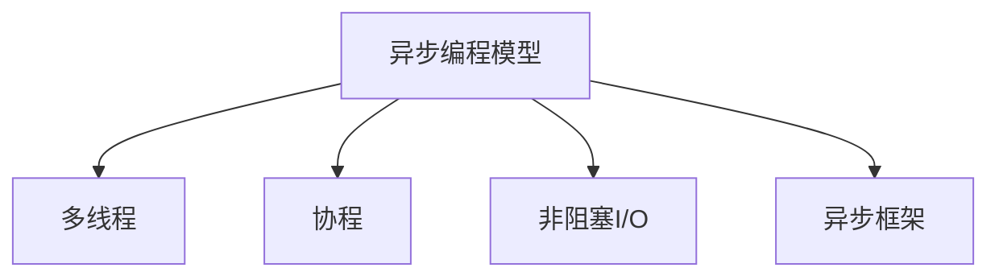

                 

# 异步处理技术的实现与优化

> 关键词：异步处理, 多线程, 协程, 非阻塞IO, 异步框架, Python, Node.js

## 1. 背景介绍

### 1.1 问题由来
随着互联网和移动设备的普及，Web应用和移动应用的用户量不断增长，数据处理量也随之激增。传统同步阻塞式I/O方式处理并发请求时，请求响应时间往往难以承受高并发压力。为了提升系统性能，许多Web框架和应用程序引入了异步处理技术，通过非阻塞式I/O和多线程机制实现高效并发处理。

然而，异步处理技术的复杂度较高，尤其是在实现和调试过程中容易出现各种问题。如何更好地理解和应用异步处理技术，提升系统性能，减少开发难度，是当前软件开发人员面临的一项重要任务。

### 1.2 问题核心关键点
异步处理技术的核心在于通过非阻塞I/O和多线程实现高效并发处理。其关键点包括：

- 理解异步编程模型。
- 掌握多线程、协程等异步处理机制。
- 了解异步框架的使用和优化。
- 学习异步处理技术在Web应用和移动应用中的实践。

## 2. 核心概念与联系

### 2.1 核心概念概述

为更好地理解异步处理技术，本节将介绍几个密切相关的核心概念：

- **异步编程模型**：一种基于事件驱动和回调机制的编程范式，相比同步阻塞式I/O，异步编程模型能显著提升系统并发处理能力。

- **多线程**：操作系统的一种并发处理机制，通过创建多个线程同时执行代码，实现并行处理，提高系统响应速度。

- **协程**：一种轻量级线程，由程序主动创建和销毁，实现异步编程，避免线程切换的开销，提升性能。

- **非阻塞I/O**：通过使用操作系统提供的非阻塞API，使得I/O操作在等待时不会阻塞主线程，从而实现高效并发处理。

- **异步框架**：封装异步编程模型和API的框架，提供完善的异步处理支持，降低开发难度。

这些核心概念之间的逻辑关系可以通过以下Mermaid流程图来展示：



这个流程图展示异步处理技术的核心概念及其之间的关系：

1. 异步编程模型是异步处理的基础，通过事件驱动和回调机制实现异步操作。
2. 多线程和协程都是实现异步编程模型的手段，多线程提供并行处理能力，协程则减少线程切换开销。
3. 非阻塞I/O提供高效I/O处理方式，避免同步阻塞。
4. 异步框架封装了异步编程模型和API，降低开发难度。

这些概念共同构成了异步处理技术的核心框架，使其能在各种场景下实现高效并发处理。

## 3. 核心算法原理 & 具体操作步骤
### 3.1 算法原理概述

异步处理技术通过非阻塞I/O和多线程机制，实现高效并发处理。其核心思想是：

1. **异步I/O操作**：通过使用非阻塞I/O，使I/O操作在等待时不会阻塞主线程，从而实现异步操作。

2. **事件驱动和回调机制**：通过事件驱动和回调机制，实现异步操作的异步处理。

3. **多线程和协程**：通过多线程和协程，实现异步操作的并发处理，提高系统响应速度。

### 3.2 算法步骤详解

异步处理技术的一般步骤如下：

1. **创建异步事件循环**：创建一个事件循环，负责监听并处理异步事件。

2. **创建异步任务**：通过创建异步任务，实现异步操作。

3. **注册事件回调**：将异步任务注册到事件循环，并定义回调函数，实现异步操作的处理。

4. **启动异步事件循环**：启动事件循环，处理异步事件，实现异步操作的异步处理。

5. **关闭异步事件循环**：在异步任务处理完毕后，关闭事件循环，释放资源。

### 3.3 算法优缺点

异步处理技术的优点包括：

- **提升系统性能**：通过非阻塞I/O和多线程机制，实现高效并发处理，提升系统响应速度和吞吐量。
- **降低资源消耗**：通过异步处理，减少线程切换和I/O等待，降低系统资源消耗。
- **增强系统稳定性**：通过异步事件驱动和回调机制，避免阻塞和死锁，提升系统稳定性。

但异步处理技术也存在一定的缺点：

- **开发复杂度较高**：异步处理需要理解事件驱动和回调机制，掌握多线程和协程等并发处理技术，开发难度较大。
- **代码可读性差**：异步处理代码往往需要嵌套回调函数，代码结构复杂，可读性较差。
- **调试困难**：异步处理代码容易出现回调地狱、线程安全等问题，调试困难。

### 3.4 算法应用领域

异步处理技术广泛应用于Web应用、移动应用、服务器端应用等多个领域，具体应用包括：

- **Web服务器**：通过使用异步框架，实现高效Web请求处理。
- **移动应用**：通过异步处理，提升移动应用响应速度和用户体验。
- **高并发服务**：通过异步处理，提升服务响应速度和稳定性，应对高并发请求。

## 4. 数学模型和公式 & 详细讲解  
### 4.1 数学模型构建

本节将使用数学语言对异步处理技术的原理进行更加严格的刻画。

假设系统中有N个I/O操作需要执行，每个操作需要等待时间T，系统事件循环的执行时间为T。则系统总的等待时间为：

$$
\text{Total Waiting Time} = N \times T
$$

假设每个I/O操作都采用异步处理方式，则每个操作都在等待时立即返回，系统总的等待时间为：

$$
\text{Total Waiting Time} = T
$$

可以看出，异步处理技术能显著提升系统性能，减少等待时间。

### 4.2 公式推导过程

以下我们推导异步处理技术的性能公式。

假设每个I/O操作都采用异步处理方式，则每个操作都在等待时立即返回，系统总的等待时间为：

$$
\text{Total Waiting Time} = T
$$

系统总的执行时间为：

$$
\text{Total Execution Time} = T + N \times T = T(1 + N)
$$

其中T为每个I/O操作所需时间，N为I/O操作数。

假设每个I/O操作都采用同步阻塞式I/O方式，则每个操作都需要等待时间T，系统总的等待时间为：

$$
\text{Total Waiting Time} = N \times T
$$

系统总的执行时间为：

$$
\text{Total Execution Time} = T \times N
$$

可以看出，异步处理技术能显著提升系统性能，降低执行时间。

## 5. 项目实践：代码实例和详细解释说明
### 5.1 开发环境搭建

在进行异步处理实践前，我们需要准备好开发环境。以下是使用Python进行Tornado开发的环境配置流程：

1. 安装Anaconda：从官网下载并安装Anaconda，用于创建独立的Python环境。

2. 创建并激活虚拟环境：
```bash
conda create -n tornado-env python=3.8 
conda activate tornado-env
```

3. 安装Tornado：从官网获取对应的安装命令。例如：
```bash
pip install tornado
```

4. 安装各类工具包：
```bash
pip install numpy pandas scikit-learn matplotlib tqdm jupyter notebook ipython
```

完成上述步骤后，即可在`tornado-env`环境中开始异步处理实践。

### 5.2 源代码详细实现

这里我们以Tornado框架为例，展示使用异步处理技术开发Web应用的过程。

首先，定义异步处理回调函数：

```python
import tornado.web
import tornado.httpclient

class AsyncHandler(tornado.web.RequestHandler):
    def get(self):
        http_client = tornado.httpclient.HTTPClient()
        http_client.fetch(self.request.uri, method='GET', callback=self.on_response)
    
    def on_response(self, response):
        print(response.body)
        self.write('Async response received.')
```

然后，创建一个Tornado应用实例：

```python
from tornado.web import Application
from tornado.ioloop import IOLoop

app = Application([(r"/", AsyncHandler)])
io_loop = IOLoop()
io_loop.start()
```

最后，启动Tornado应用：

```python
if __name__ == "__main__":
    app.listen(8888)
```

### 5.3 代码解读与分析

让我们再详细解读一下关键代码的实现细节：

**AsyncHandler类**：
- `get`方法：通过HTTPClient发起异步请求，并注册回调函数。
- `on_response`方法：在异步请求响应后，输出响应内容。

**Tornado应用实例**：
- `Application`类：封装异步处理逻辑，创建应用实例。
- `IOLoop`类：事件循环，负责处理异步事件。

**启动异步处理**：
- 启动`IOLoop`事件循环，监听异步请求，处理异步响应。

可以看到，Tornado框架通过事件驱动和回调机制，实现了异步处理。开发者只需要编写处理逻辑，框架负责处理I/O操作，大大降低了异步处理的开发难度。

当然，工业级的系统实现还需考虑更多因素，如异步任务的超时处理、错误处理、线程安全等。但核心的异步处理范式基本与此类似。

## 6. 实际应用场景
### 6.1 异步Web服务器

异步处理技术在Web应用中应用广泛，可以显著提升Web服务器的响应速度和吞吐量。例如，使用Tornado框架实现的异步Web服务器，相比传统同步阻塞式I/O方式，响应速度和吞吐量都能显著提升。

### 6.2 异步移动应用

异步处理技术同样适用于移动应用，通过异步处理，提升应用的响应速度和用户体验。例如，使用Node.js框架实现的异步移动应用，通过异步处理处理复杂的逻辑和I/O操作，提升应用的性能和稳定性。

### 6.3 高并发服务

异步处理技术在高并发服务中具有重要应用，通过异步处理，提升服务的响应速度和稳定性，应对高并发请求。例如，使用Nginx和Erlang实现的高并发Web服务器，通过异步处理，处理大规模并发请求，提升服务性能和稳定性。

### 6.4 未来应用展望

随着异步处理技术的不断发展，其在Web应用、移动应用、服务器端应用等领域的应用将更加广泛。

在智慧医疗领域，异步处理技术可以用于处理大规模医疗数据，提升数据处理速度和准确性。

在智能教育领域，异步处理技术可以用于处理学生提交的作业，提升作业批改速度和自动化水平。

在智慧城市治理中，异步处理技术可以用于处理大规模传感器数据，提升城市管理的智能化水平。

此外，在企业生产、社会治理、文娱传媒等众多领域，异步处理技术也将不断涌现，为各行各业带来新的变革。相信随着异步处理技术的持续演进，其在构建人机协同的智能时代中扮演越来越重要的角色。

## 7. 工具和资源推荐
### 7.1 学习资源推荐

为了帮助开发者系统掌握异步处理技术的理论基础和实践技巧，这里推荐一些优质的学习资源：

1.《Python异步编程实战》系列博文：由异步编程专家撰写，深入浅出地介绍了异步编程原理、Tornado框架、Asyncio库等核心技术。

2.《Node.js 异步编程基础》课程：Udemy提供的Node.js异步编程基础课程，详细讲解了异步编程模型和Node.js框架的使用。

3.《Python异步编程》书籍：Alvin Slykov的异步编程经典之作，全面介绍了异步编程的原理和实践，包括Tornado、Twisted、Asyncio等异步框架的使用。

4. Tornado官方文档：Tornado框架的官方文档，提供了完整的异步处理样例代码，是上手实践的必备资料。

5. Nginx官方文档：Nginx Web服务器的官方文档，提供了详细的异步处理和事件驱动机制，是了解异步Web服务器的经典资源。

通过对这些资源的学习实践，相信你一定能够快速掌握异步处理技术的精髓，并用于解决实际的Web开发问题。

### 7.2 开发工具推荐

高效的开发离不开优秀的工具支持。以下是几款用于异步处理开发的常用工具：

1. Tornado：Python编写的异步Web框架，提供了事件驱动和回调机制，适合开发高并发Web应用。

2. Node.js：JavaScript编写的异步处理框架，支持异步I/O、事件驱动、回调机制，适合开发高并发移动应用。

3. Twisted：Python编写的异步处理框架，支持异步I/O、事件驱动、协程，适合开发高并发网络应用。

4. Asyncio：Python标准库，提供了异步I/O和事件驱动机制，适合开发Python异步应用。

5. EventMachine：Ruby编写的异步处理框架，支持异步I/O、事件驱动、协程，适合开发Ruby异步应用。

合理利用这些工具，可以显著提升异步处理的开发效率，加快创新迭代的步伐。

### 7.3 相关论文推荐

异步处理技术的发展源于学界的持续研究。以下是几篇奠基性的相关论文，推荐阅读：

1. Asynchronous I/O, Object Synchronization, and Garbage Collection in Ozone（Erlang）：Erlang框架的异步处理模型，提出了Actor模型和消息传递机制，为异步处理提供重要参考。

2. High-Performance Python Servers (Tornado)：Tornado框架的异步处理机制，详细介绍了异步编程模型和事件驱动机制。

3. Node.js: The Reactor Architecture in the V8 JavaScript Engine：Node.js框架的异步处理机制，详细介绍了事件驱动和回调机制。

4. Twisted: An Event-Driven Network Framework：Twisted框架的异步处理机制，详细介绍了异步I/O和事件驱动机制。

5. Unbounded Coroutines: High-Performance Concurrent Programming in Python 3（Asyncio）：Asyncio库的异步处理机制，详细介绍了协程和异步I/O机制。

这些论文代表异步处理技术的发展脉络。通过学习这些前沿成果，可以帮助研究者把握学科前进方向，激发更多的创新灵感。

## 8. 总结：未来发展趋势与挑战

### 8.1 总结

本文对异步处理技术的实现与优化进行了全面系统的介绍。首先阐述了异步处理技术的背景和意义，明确了异步处理在提升系统性能、降低资源消耗、增强系统稳定性等方面的重要作用。其次，从原理到实践，详细讲解了异步处理的数学模型和操作步骤，给出了异步处理任务开发的完整代码实例。同时，本文还广泛探讨了异步处理技术在Web应用、移动应用、高并发服务等领域的实际应用场景，展示了异步处理技术的巨大潜力。此外，本文精选了异步处理技术的各类学习资源，力求为读者提供全方位的技术指引。

通过本文的系统梳理，可以看到，异步处理技术在现代软件开发中具有重要应用，通过异步处理，提升系统性能，降低开发难度，成为软件开发的重要手段。未来，伴随异步处理技术的持续演进，必将进一步推动软件开发行业的变革，带来更多高效、稳定、可扩展的解决方案。

### 8.2 未来发展趋势

展望未来，异步处理技术将呈现以下几个发展趋势：

1. **异步编程语言和框架的普及**：异步编程语言和框架的使用将越来越广泛，更多开发者将掌握异步编程技术和工具，提升开发效率。

2. **异步处理与高性能计算的结合**：异步处理技术将与高性能计算技术结合，提升数据处理和科学计算的效率。

3. **异步处理与分布式计算的结合**：异步处理技术将与分布式计算技术结合，提升大规模分布式系统的性能和稳定性。

4. **异步处理与新兴技术的结合**：异步处理技术将与新兴技术（如区块链、边缘计算等）结合，带来更多创新应用。

5. **异步处理与人工智能的结合**：异步处理技术将与人工智能技术结合，提升AI算法的计算效率和系统稳定性。

以上趋势凸显了异步处理技术的广阔前景。这些方向的探索发展，必将进一步提升异步处理技术的性能和应用范围，为软件开发行业带来新的机遇。

### 8.3 面临的挑战

尽管异步处理技术已经取得了瞩目成就，但在迈向更加智能化、普适化应用的过程中，它仍面临诸多挑战：

1. **开发复杂度较高**：异步处理需要理解事件驱动和回调机制，掌握多线程和协程等并发处理技术，开发难度较大。

2. **代码可读性差**：异步处理代码往往需要嵌套回调函数，代码结构复杂，可读性较差。

3. **调试困难**：异步处理代码容易出现回调地狱、线程安全等问题，调试困难。

4. **并发处理复杂**：异步处理需要考虑多线程和协程的调度，并发处理复杂，容易出现死锁、竞争等问题。

5. **资源消耗较大**：异步处理需要创建大量的协程和线程，资源消耗较大。

6. **性能瓶颈**：异步处理需要考虑I/O阻塞和线程切换等问题，性能瓶颈较多。

这些挑战需要开发者在实际开发中不断优化和改进，提升异步处理技术的性能和稳定性。

### 8.4 研究展望

面对异步处理面临的挑战，未来的研究需要在以下几个方面寻求新的突破：

1. **优化异步处理模型**：通过优化异步处理模型，降低异步处理的复杂度和开发难度。

2. **提升异步处理的性能**：通过优化异步处理的并发处理机制，提升异步处理的性能和稳定性。

3. **增强异步处理的可读性**：通过简化异步处理代码结构，提升异步处理的可读性和可维护性。

4. **降低异步处理的资源消耗**：通过优化异步处理的资源管理，降低异步处理的资源消耗。

5. **解决异步处理的并发问题**：通过优化异步处理的并发处理机制，解决异步处理的并发问题。

6. **增强异步处理的性能瓶颈**：通过优化异步处理的性能瓶颈，提升异步处理的性能。

这些研究方向的研究和突破，必将进一步推动异步处理技术的进步，提升异步处理技术的性能和应用范围。总之，异步处理技术将在软件开发行业中扮演越来越重要的角色，带来更多高效、稳定、可扩展的解决方案。

## 9. 附录：常见问题与解答

**Q1：异步处理技术是否适用于所有应用场景？**

A: 异步处理技术适用于大部分高并发、高吞吐量的应用场景，但在一些低并发、高资源消耗的场景下，同步阻塞式I/O方式可能更加高效。因此，开发者需要根据具体应用场景选择适合的编程模型。

**Q2：异步处理技术能否实现线程安全？**

A: 异步处理技术需要考虑线程安全问题，特别是在多线程环境下，容易出现竞态条件和死锁等问题。因此，开发者需要采取适当的线程安全措施，如互斥锁、条件变量等。

**Q3：异步处理技术是否适合开发高并发Web应用？**

A: 异步处理技术适合开发高并发Web应用，通过异步处理，提升Web应用的响应速度和吞吐量。但异步处理技术需要考虑Web服务器和客户端的兼容性和性能问题，需要谨慎选择和使用。

**Q4：异步处理技术是否适合开发高并发移动应用？**

A: 异步处理技术适合开发高并发移动应用，通过异步处理，提升应用的响应速度和用户体验。但异步处理技术需要考虑移动设备和网络环境的变化，需要合理设计异步任务和回调函数。

**Q5：异步处理技术是否适合开发高并发服务？**

A: 异步处理技术适合开发高并发服务，通过异步处理，提升服务的响应速度和稳定性。但异步处理技术需要考虑服务架构和数据一致性问题，需要合理设计异步任务和事件处理机制。

总之，异步处理技术在软件开发中具有重要应用，通过异步处理，提升系统性能，降低开发难度，成为软件开发的重要手段。未来，伴随异步处理技术的持续演进，必将进一步推动软件开发行业的变革，带来更多高效、稳定、可扩展的解决方案。

