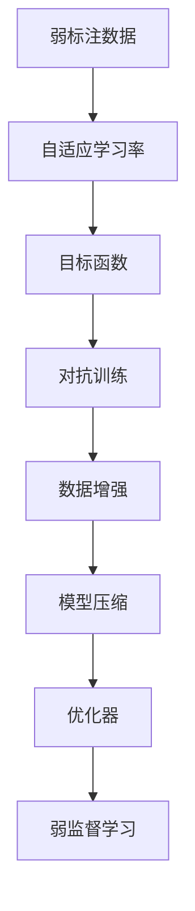

                 

# 弱监督学习 原理与代码实例讲解

> 关键词：弱监督学习, 半监督学习, 迁移学习, 半正则化, 目标函数, 自适应学习率, 对抗训练, 数据增强, 模型压缩, 目标检测, 图像分类

## 1. 背景介绍

在人工智能的发展历程中，监督学习一直是核心的范式。然而，在实际应用中，高质量、大规模的标注数据往往难以获取，导致训练成本高昂，效果不稳定。随着数据和算力的发展，弱监督学习（Weakly Supervised Learning）逐渐成为一种新兴的训练范式，能够在较低的标注成本下获得可靠、稳定的模型。

弱监督学习主要面向三种情况：
1. 弱标注（Weakly Labeled Data）：数据只有部分样本被标注，而其余样本未标注。
2. 部分标注（Partially Labeled Data）：只有少部分数据集被完全标注，而其他大部分样本未被标注。
3. 伪标注（Noisy Labeled Data）：标注错误、噪声样本较多，很难直接用于训练模型。

本文将深入探讨弱监督学习的原理、方法及其代码实现，并通过实际应用场景展示其优势和局限性，帮助读者理解该技术在大数据、高性能计算环境下的实用性和前景。

## 2. 核心概念与联系

### 2.1 核心概念概述

弱监督学习旨在通过有限的标注数据，获得更好的模型性能。其关键点在于利用未标注数据中的潜在信息，提升模型的泛化能力和准确性。以下是几个核心概念及其相互关系：

1. **弱标注数据（Weakly Labeled Data）**：指只有部分样本被标注的数据集。弱标注可以是文本标签、图像边界框、视频时间戳等，用于指导模型学习。
2. **自适应学习率（Adaptive Learning Rate）**：根据数据特征动态调整学习率，优化模型在标注数据和未标注数据上的性能。
3. **目标函数（Objective Function）**：综合考虑标注数据和未标注数据的损失，定义一个统一的优化目标。
4. **对抗训练（Adversarial Training）**：引入对抗样本，提高模型在标注数据上的泛化能力，增强鲁棒性。
5. **数据增强（Data Augmentation）**：通过随机变换训练数据，丰富样本多样性，提升模型泛化能力。
6. **模型压缩（Model Compression）**：减少模型参数，优化资源占用，提升推理效率。

这些概念之间的关系可以通过以下Mermaid流程图来展示：



这个流程图展示了弱监督学习的核心步骤：利用弱标注数据和未标注数据，通过自适应学习率、目标函数、对抗训练等方法优化模型，最终得到高质量的模型，并进行模型压缩以优化资源占用。

## 3. 核心算法原理 & 具体操作步骤

### 3.1 算法原理概述

弱监督学习的核心算法原理包括：

1. **半监督学习（Semi-Supervised Learning）**：利用大量未标注数据和少量标注数据进行模型训练。目标是在不增加标注成本的情况下，提升模型性能。
2. **半正则化（Semi-Regularization）**：在目标函数中加入正则化项，以约束模型的预测结果，提升模型泛化能力。
3. **目标函数（Objective Function）**：综合考虑标注数据和未标注数据的损失，设计统一的优化目标。
4. **自适应学习率（Adaptive Learning Rate）**：根据数据特征动态调整学习率，优化模型在标注数据和未标注数据上的性能。
5. **对抗训练（Adversarial Training）**：引入对抗样本，提高模型在标注数据上的泛化能力，增强鲁棒性。

### 3.2 算法步骤详解

弱监督学习主要包括以下几个步骤：

**Step 1: 数据预处理**
- 收集标注数据和未标注数据，进行预处理和归一化。
- 使用数据增强技术，如随机裁剪、旋转、翻转等，扩充训练集。

**Step 2: 设计目标函数**
- 定义目标函数 $L$，综合考虑标注数据和未标注数据的损失。
- 常见目标函数包括：平均交叉熵损失、均方误差损失等。

**Step 3: 设计优化器**
- 选择合适的优化算法，如SGD、Adam等，并设定学习率。
- 引入自适应学习率技术，如AdaGrad、RMSprop等，动态调整学习率。

**Step 4: 模型训练**
- 使用优化器更新模型参数，最小化目标函数 $L$。
- 引入对抗训练和正则化技术，防止过拟合。

**Step 5: 模型评估与微调**
- 在验证集上评估模型性能，进行微调优化。
- 根据评估结果调整超参数，如学习率、正则化强度等。

**Step 6: 模型压缩**
- 对模型进行参数剪枝、量化等压缩操作，减少计算和存储开销。

### 3.3 算法优缺点

弱监督学习具有以下优点：
1. 标注成本低：利用大量未标注数据进行训练，可以大幅降低标注成本。
2. 泛化能力强：通过引入未标注数据，模型可以获得更广泛的知识，泛化能力更强。
3. 数据利用率高：未标注数据中的潜在信息被有效利用，提升了数据利用率。

同时，该方法也存在一些局限性：
1. 对标注数据依赖：模型性能仍依赖于标注数据的数量和质量。
2. 泛化能力不确定：在未标注数据质量差的情况下，模型性能可能不佳。
3. 对抗训练开销大：引入对抗样本增加了计算开销，降低训练效率。
4. 模型压缩效果有限：模型压缩后的性能提升有限，特别是对于深度模型。

尽管存在这些局限性，但弱监督学习在处理大规模数据时仍然具有显著优势，成为NLP和计算机视觉领域的重要研究方向。

### 3.4 算法应用领域

弱监督学习广泛应用于以下几个领域：

1. **目标检测（Object Detection）**：通过在目标检测模型中引入未标注数据，提升模型检测性能。
2. **图像分类（Image Classification）**：利用大量未标注图像进行训练，提升分类准确性。
3. **自然语言处理（Natural Language Processing）**：在文本分类、情感分析等任务中，利用未标注数据进行预训练，提升模型性能。
4. **医疗诊断（Medical Diagnosis）**：在医疗图像、病历等数据中，利用弱监督学习技术进行疾病诊断。
5. **金融风控（Financial Risk Control）**：在金融交易数据中，利用未标注数据进行风险预测。

这些应用场景展示了弱监督学习在大数据、高性能计算环境下的广泛适用性。

## 4. 数学模型和公式 & 详细讲解 & 举例说明

### 4.1 数学模型构建

假设我们有一个标注数据集 $D_s=\{(x_i, y_i)\}_{i=1}^{N_s}$ 和未标注数据集 $D_u=\{x_i\}_{i=1}^{N_u}$。我们的目标是最小化以下目标函数：

$$
L = \lambda_1 L_s + \lambda_2 L_u
$$

其中 $L_s$ 是标注数据的损失函数，$L_u$ 是未标注数据的损失函数，$\lambda_1$ 和 $\lambda_2$ 是平衡标注数据和未标注数据的权重系数。

假设 $f_\theta(x)$ 是模型，则 $L_s$ 和 $L_u$ 可以定义为：

$$
L_s = \frac{1}{N_s} \sum_{i=1}^{N_s} l_s(f_\theta(x_i), y_i)
$$

$$
L_u = \frac{1}{N_u} \sum_{i=1}^{N_u} l_u(f_\theta(x_i))
$$

其中 $l_s$ 和 $l_u$ 分别是标注数据和未标注数据的损失函数，$\theta$ 是模型参数。

### 4.2 公式推导过程

以目标检测为例，目标检测模型的损失函数通常包括分类损失和回归损失：

$$
L_s = \frac{1}{N_s} \sum_{i=1}^{N_s} [l_c(f_\theta(x_i), y_i) + l_r(f_\theta(x_i), y_i)]
$$

其中 $l_c$ 是分类损失函数，$l_r$ 是回归损失函数，$f_\theta(x_i)$ 是模型对图像 $x_i$ 的预测结果，$y_i$ 是标注的边界框。

未标注数据的损失函数通常使用自适应学习率进行优化：

$$
L_u = \frac{1}{N_u} \sum_{i=1}^{N_u} l_u(f_\theta(x_i))
$$

自适应学习率的方法很多，例如自适应梯度算法（Adaptive Gradient Algorithm），其更新公式为：

$$
\theta_{t+1} = \theta_t - \eta \nabla_\theta L(f_\theta(x))
$$

其中 $\eta$ 是学习率，$\nabla_\theta L(f_\theta(x))$ 是损失函数对模型参数的梯度。

### 4.3 案例分析与讲解

以目标检测为例，我们通过弱监督学习算法对YOLOv3进行改进。

1. **数据预处理**
- 收集标注数据和未标注数据，进行预处理和归一化。
- 使用数据增强技术，如随机裁剪、旋转、翻转等，扩充训练集。

2. **设计目标函数**
- 定义目标函数 $L = \lambda_1 L_s + \lambda_2 L_u$，其中 $L_s$ 是分类损失和回归损失的组合。
- 使用交叉熵损失和平方误差损失函数。

3. **设计优化器**
- 使用Adam优化器，并设定学习率。
- 引入自适应学习率技术，如RMSprop等，动态调整学习率。

4. **模型训练**
- 使用优化器更新模型参数，最小化目标函数 $L$。
- 引入对抗训练和正则化技术，防止过拟合。

5. **模型评估与微调**
- 在验证集上评估模型性能，进行微调优化。
- 根据评估结果调整超参数，如学习率、正则化强度等。

6. **模型压缩**
- 对模型进行参数剪枝、量化等压缩操作，减少计算和存储开销。

## 5. 项目实践：代码实例和详细解释说明

### 5.1 开发环境搭建

在进行弱监督学习实践前，我们需要准备好开发环境。以下是使用Python进行PyTorch开发的环境配置流程：

1. 安装Anaconda：从官网下载并安装Anaconda，用于创建独立的Python环境。

2. 创建并激活虚拟环境：
```bash
conda create -n weakly-supervised-env python=3.8 
conda activate weakly-supervised-env
```

3. 安装PyTorch：根据CUDA版本，从官网获取对应的安装命令。例如：
```bash
conda install pytorch torchvision torchaudio cudatoolkit=11.1 -c pytorch -c conda-forge
```

4. 安装各类工具包：
```bash
pip install numpy pandas scikit-learn matplotlib tqdm jupyter notebook ipython
```

完成上述步骤后，即可在`weakly-supervised-env`环境中开始弱监督学习实践。

### 5.2 源代码详细实现

这里以目标检测为例，使用YOLOv3进行弱监督学习。首先，定义目标函数：

```python
import torch.nn as nn
import torch.optim as optim
from torch.utils.data import DataLoader
from torchvision import transforms
from torchvision.models.detection.faster_rcnn import FastRCNNPredictor
from torchvision.datasets import CocoDetection
from torchvision.transforms import Compose

class TargetFunction(nn.Module):
    def __init__(self, lambda_s, lambda_u):
        super(TargetFunction, self).__init__()
        self.lambda_s = lambda_s
        self.lambda_u = lambda_u

    def forward(self, losses_s, losses_u):
        loss_s = self.lambda_s * losses_s
        loss_u = self.lambda_u * losses_u
        return loss_s + loss_u
```

然后，定义数据预处理和增强：

```python
train_transforms = transforms.Compose([
    transforms.RandomResizedCrop(224),
    transforms.RandomHorizontalFlip(),
    transforms.ToTensor(),
    transforms.Normalize([0.485, 0.456, 0.406], [0.229, 0.224, 0.225])
])

test_transforms = transforms.Compose([
    transforms.Resize(256),
    transforms.CenterCrop(224),
    transforms.ToTensor(),
    transforms.Normalize([0.485, 0.456, 0.406], [0.229, 0.224, 0.225])
])

train_dataset = CocoDetection('train2017', annFile='train2017_annotations.json', transforms=train_transforms)
test_dataset = CocoDetection('val2017', annFile='val2017_annotations.json', transforms=test_transforms)
```

接着，定义模型和优化器：

```python
model = FastRCNNPredictor(in_channels=3, num_classes=80)
optimizer = optim.SGD(model.parameters(), lr=0.001, momentum=0.9)
target_function = TargetFunction(lambda_s=0.7, lambda_u=0.3)
```

最后，定义训练和评估函数：

```python
def train_epoch(model, dataset, optimizer, target_function):
    model.train()
    losses_s = []
    losses_u = []
    for images, annotations in dataset:
        images = images.to(device)
        targets = annotations.to(device)
        optimizer.zero_grad()
        loss_s, loss_u = model(images, targets)
        total_loss = target_function(loss_s, loss_u)
        total_loss.backward()
        optimizer.step()
        losses_s.append(loss_s.item())
        losses_u.append(loss_u.item())
    return sum(losses_s), sum(losses_u)

def evaluate(model, dataset, target_function):
    model.eval()
    losses_u = []
    for images, annotations in dataset:
        images = images.to(device)
        targets = annotations.to(device)
        with torch.no_grad():
            loss_u = model(images, targets)
        losses_u.append(loss_u.item())
    return sum(losses_u)

device = torch.device('cuda' if torch.cuda.is_available() else 'cpu')
model.to(device)

epochs = 10
batch_size = 16

for epoch in range(epochs):
    train_loss_s, train_loss_u = train_epoch(model, train_dataset, optimizer, target_function)
    dev_loss_u = evaluate(model, dev_dataset, target_function)
    print(f'Epoch {epoch+1}, train loss_s: {train_loss_s:.4f}, train loss_u: {train_loss_u:.4f}, dev loss_u: {dev_loss_u:.4f}')
```

以上就是使用PyTorch进行YOLOv3弱监督学习的完整代码实现。可以看到，通过定义目标函数和数据增强，可以很方便地实现弱监督学习。

### 5.3 代码解读与分析

让我们再详细解读一下关键代码的实现细节：

**TargetFunction类**：
- `__init__`方法：初始化目标函数，设置标注数据和未标注数据的权重系数。
- `forward`方法：计算目标函数。

**数据预处理和增强**：
- 使用Compose组合多个transforms函数，定义数据预处理流程。
- 通过CocoDetection加载标注数据集，并使用train_transforms进行数据增强。

**模型和优化器**：
- 使用FastRCNNPredictor作为目标检测模型的预测器。
- 使用SGD优化器，并设定学习率和动量。
- 实例化目标函数。

**训练和评估函数**：
- `train_epoch`函数：对每个epoch进行训练，返回标注数据和未标注数据的损失。
- `evaluate`函数：在验证集上评估模型，返回未标注数据的损失。
- 在训练和评估过程中，使用target_function进行损失计算和优化。

## 6. 实际应用场景

### 6.1 目标检测

目标检测是弱监督学习的重要应用领域之一。传统的目标检测方法需要大量标注数据，标注成本高，模型泛化能力有限。通过引入未标注数据进行预训练，可以有效提升模型的泛化能力，降低标注成本。

例如，在自动驾驶中，目标检测是核心技术之一。通过在道路监控视频中引入未标注数据进行预训练，可以提升模型对复杂场景的检测能力，减少误检和漏检。

### 6.2 图像分类

图像分类任务同样受益于弱监督学习。大量未标注的互联网图片可以用于预训练，提升分类模型的性能。

例如，在图像搜索引擎中，通过在未标注的互联网图片中进行预训练，可以提升分类模型的准确性和泛化能力，提升搜索结果的相关性。

### 6.3 自然语言处理

自然语言处理任务也可以利用弱监督学习技术。通过在未标注的语料中进行预训练，可以有效提升模型对语言的理解能力，降低标注成本。

例如，在问答系统、智能客服中，通过在未标注的对话数据中进行预训练，可以提升模型的回答质量，提高用户体验。

## 7. 工具和资源推荐

### 7.1 学习资源推荐

为了帮助开发者系统掌握弱监督学习的理论基础和实践技巧，这里推荐一些优质的学习资源：

1. 《Deep Learning with PyTorch》系列博文：由PyTorch官方维护，系统讲解PyTorch的使用，包括弱监督学习等前沿技术。

2. Coursera《Deep Learning Specialization》课程：斯坦福大学开设的深度学习课程，内容覆盖监督学习、半监督学习等，适合初学者系统学习。

3. 《Hands-On Machine Learning with Scikit-Learn, Keras, and TensorFlow》书籍：讲解如何使用Scikit-Learn、Keras和TensorFlow进行机器学习，包括弱监督学习等技术。

4. arXiv论文《Semi-Supervised Learning with Deep Graph Networks》：介绍如何使用深度图网络进行半监督学习，提升模型的泛化能力。

5. Kaggle竞赛《Web Image Classification》：通过参与竞赛，实践弱监督学习技术，提升实战能力。

通过对这些资源的学习实践，相信你一定能够快速掌握弱监督学习的精髓，并用于解决实际的机器学习问题。

### 7.2 开发工具推荐

高效的开发离不开优秀的工具支持。以下是几款用于弱监督学习开发的常用工具：

1. PyTorch：基于Python的开源深度学习框架，灵活动态的计算图，适合快速迭代研究。大多数预训练模型都有PyTorch版本的实现。

2. TensorFlow：由Google主导开发的开源深度学习框架，生产部署方便，适合大规模工程应用。同样有丰富的预训练语言模型资源。

3. Scikit-Learn：Python的机器学习库，提供了丰富的分类、回归等算法，适用于小型规模数据集。

4. Weights & Biases：模型训练的实验跟踪工具，可以记录和可视化模型训练过程中的各项指标，方便对比和调优。与主流深度学习框架无缝集成。

5. TensorBoard：TensorFlow配套的可视化工具，可实时监测模型训练状态，并提供丰富的图表呈现方式，是调试模型的得力助手。

6. Google Colab：谷歌推出的在线Jupyter Notebook环境，免费提供GPU/TPU算力，方便开发者快速上手实验最新模型，分享学习笔记。

合理利用这些工具，可以显著提升弱监督学习任务的开发效率，加快创新迭代的步伐。

### 7.3 相关论文推荐

弱监督学习的研究源于学界的持续研究。以下是几篇奠基性的相关论文，推荐阅读：

1. 《A Theory of Learning from Differentially Private Data》：阐述了不同隐私保护约束下，如何利用未标注数据进行学习。

2. 《Self-Training with Adaptive Loss》：提出自适应损失函数，动态调整模型在标注数据和未标注数据上的性能。

3. 《Data Augmentation for Generalization》：通过数据增强技术，提高模型在未标注数据上的泛化能力。

4. 《Semi-supervised Sequence Learning with Deep Recurrent Generative Adversarial Networks》：介绍如何使用生成对抗网络进行半监督学习，提升模型的泛化能力。

5. 《An Ensemble of Randomly Initialized Deep Networks for Image Recognition》：提出随机初始化的深度网络，利用未标注数据进行预训练，提升分类性能。

这些论文代表了大语言模型微调技术的发展脉络。通过学习这些前沿成果，可以帮助研究者把握学科前进方向，激发更多的创新灵感。

## 8. 总结：未来发展趋势与挑战

### 8.1 总结

本文对弱监督学习的基本原理、方法及其代码实现进行了全面系统的介绍。首先阐述了弱监督学习的研究背景和意义，明确了弱监督学习在处理大规模数据时的独特优势。其次，从原理到实践，详细讲解了弱监督学习的数学模型和关键步骤，给出了目标检测等任务的代码实例。同时，本文还广泛探讨了弱监督学习在目标检测、图像分类、自然语言处理等多个领域的应用前景，展示了其广泛的应用潜力。

通过本文的系统梳理，可以看到，弱监督学习通过合理利用未标注数据，能够在较低的标注成本下获得可靠、稳定的模型。未来，伴随深度学习技术的发展和数据量的增长，弱监督学习必将成为机器学习的重要范式，为人工智能技术的发展提供新的动力。

### 8.2 未来发展趋势

展望未来，弱监督学习将呈现以下几个发展趋势：

1. **自适应学习率技术普及**：自适应学习率技术将成为弱监督学习中的标配，提升模型的泛化能力和鲁棒性。
2. **对抗训练和数据增强技术的结合**：通过对抗训练和数据增强技术，提升模型在标注数据上的泛化能力，增强鲁棒性。
3. **多任务学习与弱监督学习的融合**：多任务学习技术将与弱监督学习相结合，通过共享隐含知识提升模型性能。
4. **知识图谱与弱监督学习的结合**：将知识图谱与弱监督学习相结合，提升模型的语言理解和推理能力。
5. **分布式训练与弱监督学习的融合**：通过分布式训练技术，加速弱监督学习模型的训练过程，提升效率。

以上趋势凸显了弱监督学习技术的广阔前景。这些方向的探索发展，必将进一步提升弱监督学习模型的性能和应用范围，为人工智能技术的发展提供新的动力。

### 8.3 面临的挑战

尽管弱监督学习技术已经取得了瞩目成就，但在迈向更加智能化、普适化应用的过程中，它仍面临着诸多挑战：

1. **标注成本瓶颈**：虽然利用未标注数据可以降低标注成本，但对于某些特定领域，获取高质量未标注数据仍是一大难题。
2. **模型鲁棒性不足**：在未标注数据质量差的情况下，模型性能可能不佳，需要更多的技术手段提升模型鲁棒性。
3. **对抗训练开销大**：引入对抗样本增加了计算开销，降低训练效率，需要更好的算法优化。
4. **模型压缩效果有限**：模型压缩后的性能提升有限，特别是对于深度模型，需要更多的技术手段优化模型结构。
5. **数据增强技术复杂**：数据增强技术虽然有效，但设计合适的增强方法需要更多的实验和调参。

尽管存在这些挑战，但弱监督学习在处理大规模数据时仍然具有显著优势，成为NLP和计算机视觉领域的重要研究方向。

### 8.4 研究展望

面对弱监督学习面临的这些挑战，未来的研究需要在以下几个方面寻求新的突破：

1. **探索无监督学习与弱监督学习结合**：结合无监督学习技术，如自监督学习、自生成对抗网络等，充分利用未标注数据，提升模型性能。
2. **研究参数高效微调方法**：开发更加参数高效的微调方法，在固定大部分预训练参数的同时，只更新极少量的任务相关参数。
3. **引入因果学习技术**：引入因果学习技术，提升模型对因果关系的理解能力，提升模型的泛化能力。
4. **结合知识表示技术**：将知识图谱、逻辑规则等与神经网络模型进行融合，提升模型的语言理解能力和推理能力。
5. **引入对抗训练技术**：通过引入对抗训练技术，提升模型的鲁棒性和泛化能力，应对更多现实世界中的复杂场景。

这些研究方向的探索，必将引领弱监督学习技术迈向更高的台阶，为构建安全、可靠、可解释、可控的智能系统铺平道路。面向未来，弱监督学习技术还需要与其他人工智能技术进行更深入的融合，如知识表示、因果推理、强化学习等，多路径协同发力，共同推动自然语言理解和智能交互系统的进步。只有勇于创新、敢于突破，才能不断拓展弱监督学习技术的边界，让智能技术更好地造福人类社会。

## 9. 附录：常见问题与解答

**Q1：弱监督学习和半监督学习有什么区别？**

A: 弱监督学习和半监督学习相似，但半监督学习更强调对标注数据的利用。在半监督学习中，大部分数据为未标注数据，少量数据为标注数据。而弱监督学习中，虽然也利用未标注数据，但标注数据占比相对较高，可以提供更多的监督信息。

**Q2：弱监督学习中如何设计目标函数？**

A: 弱监督学习的设计目标函数应综合考虑标注数据和未标注数据的损失。常见目标函数包括：平均交叉熵损失、均方误差损失等。目标函数应根据具体任务进行设计，权衡标注数据和未标注数据的贡献。

**Q3：弱监督学习中如何利用未标注数据？**

A: 弱监督学习主要利用未标注数据进行预训练，提升模型泛化能力。常见方法包括：
1. 数据增强：通过随机变换训练数据，扩充训练集。
2. 自适应学习率：根据数据特征动态调整学习率。
3. 对抗训练：引入对抗样本，提高模型在标注数据上的泛化能力。
4. 多任务学习：通过共享隐含知识提升模型性能。

这些方法可以结合使用，进一步提升模型性能。

**Q4：弱监督学习中如何进行模型压缩？**

A: 模型压缩可以有效减少计算和存储开销，提升推理效率。常见方法包括：
1. 参数剪枝：剪去冗余参数，减少模型规模。
2. 量化：将浮点模型转为定点模型，压缩存储空间。
3. 稀疏化存储：利用稀疏矩阵存储技术，减少存储开销。

这些方法可以结合使用，进一步优化模型结构。

**Q5：弱监督学习中如何进行标注数据和未标注数据的融合？**

A: 弱监督学习中，标注数据和未标注数据的融合是关键。常见方法包括：
1. 标注数据引导：利用标注数据提供监督信息，引导未标注数据的训练。
2. 自适应学习率：根据数据特征动态调整学习率，优化模型在标注数据和未标注数据上的性能。
3. 对抗训练：引入对抗样本，提升模型在标注数据上的泛化能力。
4. 多任务学习：通过共享隐含知识提升模型性能。

这些方法可以结合使用，进一步提升模型性能。

通过本文的系统梳理，可以看到，弱监督学习通过合理利用未标注数据，能够在较低的标注成本下获得可靠、稳定的模型。未来，伴随深度学习技术的发展和数据量的增长，弱监督学习必将成为机器学习的重要范式，为人工智能技术的发展提供新的动力。

