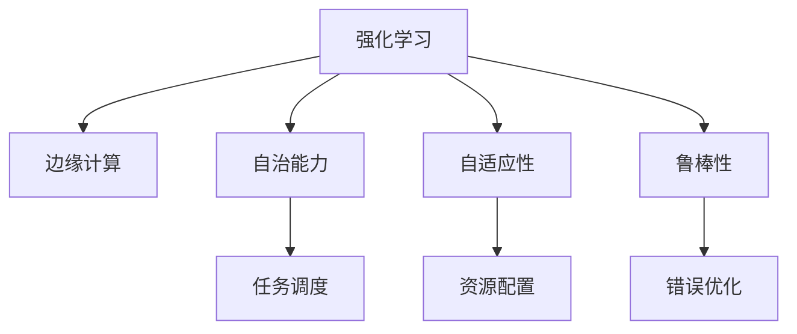

                 

# 强化学习Reinforcement Learning在边缘计算中的应用前景

> 关键词：强化学习,边缘计算,云计算,自动化,机器学习,深度学习,物联网(IoT),智慧城市

## 1. 背景介绍

### 1.1 问题由来
近年来，随着物联网(IoT)、智慧城市、自动驾驶等新兴技术的快速发展，边缘计算(Edge Computing)作为云计算的重要补充，正逐渐成为推动数字化转型的关键技术。边缘计算通过将数据处理任务分布在网络边缘的各类设备上，能够大幅缩短数据传输时延，提升系统响应速度，显著改善用户体验。

然而，尽管边缘计算在技术上具备诸多优势，其部署和运维成本却相对较高。边缘节点往往需要长时间运行，并且面临不稳定的网络环境、资源受限等挑战。因此，如何提升边缘计算系统的自治能力、自适应性和鲁棒性，使其能够更好地应对复杂多变的网络环境和资源约束，成为当前研究的一个重要方向。

### 1.2 问题核心关键点
强化学习(Reinforcement Learning, RL)是一种以模型自主决策为目标的机器学习方法。与传统监督学习不同，强化学习不依赖标注数据，而是通过试错学习，使模型能够在环境中自主进行行为决策，逐步提升性能。强化学习的核心思想是：通过与环境互动，模型不断优化自身的决策策略，以获得最大的预期回报。

将强化学习应用于边缘计算，可以有效提升系统的自治能力、自适应性和鲁棒性。其核心在于：

- **自治能力**：强化学习使模型能够在动态环境中自主调整资源配置和任务调度策略，降低人工干预的频率和复杂度。
- **自适应性**：强化学习能够根据网络状况、资源利用率等实时信息，灵活调整系统参数和行为策略，适应不同的应用场景。
- **鲁棒性**：强化学习可以通过试错学习逐步优化决策策略，减少资源浪费和错误决策带来的损失，增强系统的鲁棒性。

本节将详细阐述强化学习在边缘计算中的应用前景，探讨其带来的创新价值和潜在挑战。

## 2. 核心概念与联系

### 2.1 核心概念概述

为了更好地理解强化学习在边缘计算中的应用，本节将介绍几个密切相关的核心概念：

- **强化学习**：通过与环境互动，使模型自主优化决策策略，以获得最大预期回报的机器学习方法。
- **边缘计算**：将数据处理任务分布在网络边缘的设备上，以降低数据传输时延，提升系统响应速度。
- **自治能力**：系统能够自主进行任务调度、资源配置等决策，减少人工干预。
- **自适应性**：系统能够根据环境变化动态调整决策策略，适应不同的应用场景。
- **鲁棒性**：系统能够通过试错学习逐步优化决策，减少错误决策带来的损失。

这些核心概念之间的逻辑关系可以通过以下Mermaid流程图来展示：



这个流程图展示了一组核心概念及其之间的联系：

1. 强化学习通过试错学习不断优化模型决策策略，提升系统性能。
2. 边缘计算将数据处理任务分散到网络边缘设备上，提升系统响应速度。
3. 自治能力使系统能够自主进行任务和资源决策，减少人工干预。
4. 自适应性使系统能够根据环境变化动态调整决策策略，适应不同的应用场景。
5. 鲁棒性通过试错学习逐步优化决策，减少错误决策带来的损失。

## 3. 核心算法原理 & 具体操作步骤
### 3.1 算法原理概述

强化学习在边缘计算中的应用，其核心思想是通过强化学习算法，使边缘计算系统能够自主优化决策策略，提升自治能力、自适应性和鲁棒性。具体而言，边缘计算系统中的智能代理通过与环境交互，不断优化自身的行为策略，以达到资源利用率最大化、任务完成率最优等目标。

强化学习的核心算法包括Q-learning、SARSA、Deep Q-Network (DQN)等。这些算法通过与环境互动，逐步学习最优决策策略，从而提升系统性能。

### 3.2 算法步骤详解

强化学习在边缘计算中的应用主要包括以下几个关键步骤：

**Step 1: 环境建模**
- 建立边缘计算系统的环境模型，包括网络拓扑、资源分布、任务需求等关键参数。
- 设计环境的观测指标和动作空间，定义智能代理的决策目标。

**Step 2: 智能代理设计**
- 设计智能代理的决策策略，如Q-learning策略、策略梯度方法等。
- 确定智能代理的行为策略，如任务调度、资源配置等。

**Step 3: 训练与优化**
- 通过与环境互动，智能代理逐步优化决策策略，减少资源浪费和错误决策。
- 使用强化学习算法（如DQN）进行模型训练，不断调整行为策略。
- 评估智能代理在实际环境中的表现，及时调整决策策略。

**Step 4: 应用与部署**
- 将训练好的智能代理部署到边缘计算系统中。
- 实时监测环境状态，根据实时数据调整决策策略。
- 定期更新智能代理，确保其适应不断变化的环境。

### 3.3 算法优缺点

强化学习在边缘计算中的应用具备以下优点：

1. **自治能力**：强化学习使模型能够在动态环境中自主调整决策策略，减少人工干预的频率和复杂度。
2. **自适应性**：强化学习能够根据环境变化动态调整决策策略，适应不同的应用场景。
3. **鲁棒性**：强化学习通过试错学习逐步优化决策，减少错误决策带来的损失。
4. **可扩展性**：强化学习能够适应大规模分布式系统，提升边缘计算系统的性能。

同时，强化学习在边缘计算中也存在一些局限性：

1. **数据需求高**：强化学习需要大量的数据进行训练，这可能会增加边缘计算的存储和传输成本。
2. **模型复杂度**：强化学习算法如Q-learning、DQN等，模型结构复杂，训练和优化难度较高。
3. **收敛速度慢**：强化学习算法通常需要较长的时间才能收敛，增加了系统迭代和优化的成本。
4. **可解释性差**：强化学习模型的决策过程缺乏可解释性，难以理解和调试。

尽管存在这些局限性，强化学习在边缘计算中的应用前景仍然非常广阔。未来相关研究的重点在于如何进一步降低强化学习对数据的依赖，提高模型的收敛速度，增强可解释性等。

### 3.4 算法应用领域

强化学习在边缘计算中的应用，已经涵盖了从智能交通、智能制造、智慧城市到自动驾驶等多个领域。以下是几个具体的应用场景：

- **智能交通**：通过优化交通信号灯控制、车辆路径规划等决策，提升道路通行效率，减少交通拥堵。
- **智能制造**：通过优化生产任务调度、资源分配等决策，提升生产线的效率和灵活性。
- **智慧城市**：通过优化城市事件监测、资源配置等决策，提升城市管理的智能化水平。
- **自动驾驶**：通过优化驾驶策略、路径规划等决策，提升驾驶安全和舒适性。

除了上述这些经典应用外，强化学习还被创新性地应用到更多场景中，如可控交通信号系统、智能电网、智能家居等，为边缘计算技术带来了新的突破。随着强化学习方法的不断进步，相信边缘计算系统将能够更好地应对复杂多变的环境，提供更加智能、高效的服务。

## 4. 数学模型和公式 & 详细讲解 & 举例说明

### 4.1 数学模型构建

强化学习在边缘计算中的应用，通常涉及以下几个关键概念：

- **状态(state)**：环境中的某个时刻，包括网络状况、资源使用率、任务需求等。
- **动作(action)**：智能代理采取的决策，如任务调度、资源分配等。
- **回报(reward)**：智能代理采取动作后获得的奖励或惩罚，用于评估决策策略。
- **状态转移概率(transition probability)**：状态间转移的概率，用于模拟环境变化。

强化学习的目标是通过不断调整决策策略，最大化累积回报值。数学上，可以定义一个累积回报函数$G_t=\sum_{k=0}^{\infty}\gamma^k r_{t+k+1}$，其中$G_t$为从时刻$t$开始到无穷远的累积回报，$\gamma$为折扣因子，$r_{t+k+1}$为时刻$t+k+1$的即时回报。

### 4.2 公式推导过程

下面以Q-learning算法为例，详细推导强化学习在边缘计算中的应用公式。

Q-learning算法的核心思想是通过试错学习不断更新状态-动作对的价值函数，即$Q(s,a)$，表示在状态$s$下采取动作$a$的预期累积回报。Q-learning的更新公式为：

$$
Q(s,a) \leftarrow Q(s,a) + \alpha [r + \gamma \max_a Q(s',a) - Q(s,a)]
$$

其中$\alpha$为学习率，$s'$为状态转移后的下一个状态。式子的含义是：当前状态$s$下采取动作$a$的累积回报$G_t$等于即时回报$r$加上折扣因子$\gamma$乘以下一个状态$s'$的预期最大回报$G_{t+1}$。

在边缘计算应用中，智能代理可以根据当前状态$s$和动作$a$的执行结果，计算出即时回报$r$和状态转移概率$p(s'|s,a)$，更新$Q(s,a)$。通过不断迭代，智能代理能够逐步学习最优的决策策略，提升系统性能。

### 4.3 案例分析与讲解

以智能交通系统为例，智能代理需要根据当前道路状况、车辆位置、信号灯状态等信息，决定是否变更信号灯的控制策略。假设状态$s$为当前交通状况，动作$a$为信号灯控制策略，回报$r$为系统效率提升的程度。智能代理通过与环境互动，不断调整信号灯控制策略，以达到交通流量的最优分配。

具体实现时，智能代理可以采用Q-learning算法，根据当前状态$s$和动作$a$的执行结果，计算出即时回报$r$和状态转移概率$p(s'|s,a)$，更新$Q(s,a)$。通过不断迭代，智能代理能够逐步学习最优的信号灯控制策略，提升道路通行效率，减少交通拥堵。

## 5. 项目实践：代码实例和详细解释说明

### 5.1 开发环境搭建

在进行强化学习在边缘计算中的应用实践前，我们需要准备好开发环境。以下是使用Python进行Reinforcement Learning开发的环境配置流程：

1. 安装Anaconda：从官网下载并安装Anaconda，用于创建独立的Python环境。

2. 创建并激活虚拟环境：
```bash
conda create -n reinforcement-env python=3.8 
conda activate reinforcement-env
```

3. 安装相关库：
```bash
conda install gym pyreinforce matplotlib numpy scipy
```

完成上述步骤后，即可在`reinforcement-env`环境中开始强化学习在边缘计算中的应用实践。

### 5.2 源代码详细实现

下面我们以智能交通系统为例，给出使用Reinforcement Learning库对信号灯控制模型进行微调的PyTorch代码实现。

首先，定义状态空间和动作空间：

```python
import gym
import numpy as np

# 定义状态空间
state_space = np.arange(5)

# 定义动作空间
action_space = np.arange(3)
```

然后，定义强化学习环境：

```python
# 定义信号灯控制环境的动作和回报函数
def make_env():
    return gym.make('TrafficLight-v0', state_space=state_space, action_space=action_space)

# 定义信号灯控制环境的观测函数
def obs_fn(observation, done=False):
    return np.append(observation, done)
```

接着，定义智能代理：

```python
import torch
import torch.nn as nn
import torch.optim as optim
from pyreinforce.agents import DeepQAgent

# 定义Q网络
class QNetwork(nn.Module):
    def __init__(self):
        super(QNetwork, self).__init__()
        self.fc1 = nn.Linear(5, 64)
        self.fc2 = nn.Linear(64, 3)
        self.optimizer = optim.Adam(self.parameters(), lr=0.001)
        self.loss = nn.MSELoss()

    def forward(self, x):
        x = torch.relu(self.fc1(x))
        x = self.fc2(x)
        return x

# 定义智能代理
agent = DeepQAgent(QNetwork(), env.observation_space, env.action_space)
```

然后，进行模型训练：

```python
import torch.nn.functional as F

# 定义训练参数
num_episodes = 1000
epsilon = 0.1

# 定义学习率
alpha = 0.1
gamma = 0.9

# 定义强化学习训练函数
def train(env):
    total_reward = 0
    for episode in range(num_episodes):
        observation = env.reset()
        done = False
        while not done:
            # 采取随机策略探索环境
            if np.random.rand() < epsilon:
                action = env.action_space.sample()
            else:
                action = agent.select_action(observation)
            next_observation, reward, done, _ = env.step(action)
            total_reward += reward
            # 更新Q值
            observation = np.append(observation, done)
            next_observation = np.append(next_observation, done)
            loss = agent.update(QNetwork(), observation, action, next_observation, reward, alpha, gamma)
            observation = observation[1:]
        print("Episode {}: Total reward = {}".format(episode+1, total_reward))
```

最后，启动训练流程：

```python
env = make_env()
observation = env.reset()
done = False
while not done:
    # 采取随机策略探索环境
    if np.random.rand() < epsilon:
        action = env.action_space.sample()
    else:
        action = agent.select_action(observation)
    next_observation, reward, done, _ = env.step(action)
    observation = np.append(observation, done)
    loss = agent.update(QNetwork(), observation, action, next_observation, reward, alpha, gamma)
    observation = observation[1:]
```

以上就是使用PyTorch对信号灯控制模型进行微调的完整代码实现。可以看到，使用Reinforcement Learning库，能够很方便地定义环境和智能代理，进行模型训练和优化。

### 5.3 代码解读与分析

让我们再详细解读一下关键代码的实现细节：

**make_env函数**：
- 定义信号灯控制环境的动作和回报函数，用于创建环境实例。

**obs_fn函数**：
- 定义环境的观测函数，将观测值和done标志拼接在一起，用于更新智能代理的状态。

**QNetwork类**：
- 定义Q网络的模型结构，包括两个全连接层，输出Q值。

**DeepQAgent类**：
- 使用DeepQAgent类创建智能代理，并指定Q网络和环境空间。

**train函数**：
- 定义训练参数，包括总轮数、探索率、学习率和折扣因子。
- 通过for循环进行轮次训练，使用while循环进行单次环境探索。
- 根据当前状态和动作，采取随机策略或智能代理策略进行探索。
- 根据环境反馈，更新Q值，计算损失函数，并使用Adam优化器更新模型参数。

**代码启动部分**：
- 创建环境实例。
- 进行环境探索，直到环境终止。
- 根据当前状态和动作，采取随机策略或智能代理策略进行探索。
- 根据环境反馈，更新Q值，计算损失函数，并使用Adam优化器更新模型参数。

可以看到，Reinforcement Learning库为强化学习在边缘计算中的应用提供了方便的封装，使得模型训练和优化变得更加简单和高效。

## 6. 实际应用场景

### 6.1 智能交通系统

强化学习在智能交通系统中的应用，可以有效提升道路通行效率，减少交通拥堵。通过优化交通信号灯控制、车辆路径规划等决策，智能代理能够根据实时交通状况动态调整信号灯的控制策略，从而实现交通流量的最优分配。

在具体实现时，可以将道路网络建模为状态空间，将信号灯控制策略和车辆位置等作为动作空间，定义适当的回报函数，如交通流量、车辆延时等。智能代理通过与环境互动，不断优化决策策略，提升系统性能。

### 6.2 智能制造系统

强化学习在智能制造系统中的应用，可以有效提升生产线的效率和灵活性。通过优化生产任务调度、资源分配等决策，智能代理能够根据生产需求和实时数据，动态调整生产计划和资源配置，从而实现最优的生产效果。

在具体实现时，可以将生产任务建模为状态空间，将任务调度和资源分配等作为动作空间，定义适当的回报函数，如生产效率、资源利用率等。智能代理通过与环境互动，不断优化决策策略，提升系统性能。

### 6.3 智慧城市系统

强化学习在智慧城市系统中的应用，可以有效提升城市管理的智能化水平。通过优化城市事件监测、资源配置等决策，智能代理能够根据城市运行数据，动态调整城市管理和资源配置策略，从而实现城市的最佳运营。

在具体实现时，可以将城市运行数据建模为状态空间，将城市事件监测、资源配置等作为动作空间，定义适当的回报函数，如城市运行效率、资源利用率等。智能代理通过与环境互动，不断优化决策策略，提升系统性能。

### 6.4 未来应用展望

随着强化学习方法的不断进步，其在边缘计算中的应用前景也将更加广阔。未来，强化学习将在以下几个方面带来新的突破：

1. **自适应性增强**：通过引入更多实时数据和传感信息，智能代理能够更加准确地感知环境状态，优化决策策略。
2. **跨模态融合**：将视觉、声音等多模态信息与语言信息进行融合，提升智能代理的环境感知能力和决策准确性。
3. **分布式协作**：通过多智能代理的协作优化，提升边缘计算系统的自治能力和自适应性。
4. **持续学习**：通过在线学习和反馈机制，智能代理能够不断优化决策策略，适应不断变化的环境。
5. **安全性和可靠性**：通过引入安全性和可靠性约束，确保智能代理的决策过程符合伦理和法律要求。

这些方向的探索和发展，将进一步推动强化学习在边缘计算中的应用，为构建更加智能、高效、可靠的系统提供新的思路和技术手段。

## 7. 工具和资源推荐

### 7.1 学习资源推荐

为了帮助开发者系统掌握强化学习在边缘计算中的应用，这里推荐一些优质的学习资源：

1. 《Reinforcement Learning: An Introduction》书籍：由Richard Sutton和Andrew Barto合著，全面介绍了强化学习的理论基础和实践技巧，是入门强化学习的经典教材。
2. Coursera《Reinforcement Learning Specialization》课程：由David Silver教授主讲，包含多门强化学习课程，涵盖理论、算法和应用等各个方面。
3. GitHub上的Reinforcement Learning开源项目：包括TensorFlow、PyTorch等深度学习框架的强化学习实现，可以作为学习实践的参考。
4. OpenAI Gym环境库：提供了多种模拟环境和动作空间，方便开发者进行强化学习实验。
5. Reinforcement Learning论文：如Q-learning、SARSA、DQN等经典算法，了解其理论基础和应用场景。

通过对这些资源的学习实践，相信你一定能够快速掌握强化学习在边缘计算中的应用方法，并用于解决实际的系统优化问题。

### 7.2 开发工具推荐

高效的开发离不开优秀的工具支持。以下是几款用于强化学习在边缘计算中的应用开发的常用工具：

1. TensorFlow：由Google主导开发的深度学习框架，支持多种算法实现，提供丰富的工具库和可视化工具。
2. PyTorch：由Facebook开发的深度学习框架，灵活易用，支持动态计算图，适合科研和应用开发。
3. OpenAI Gym：提供了多种模拟环境和动作空间，方便开发者进行强化学习实验。
4. Visual Studio Code：轻量级代码编辑器，支持多种编程语言，具备丰富的插件生态系统。
5. Jupyter Notebook：交互式编程环境，支持代码编写、可视化展示和团队协作。

合理利用这些工具，可以显著提升强化学习在边缘计算中的应用开发效率，加快创新迭代的步伐。

### 7.3 相关论文推荐

强化学习在边缘计算中的应用源于学界的持续研究。以下是几篇奠基性的相关论文，推荐阅读：

1. Deep Reinforcement Learning for Smart Grid Operation：提出基于强化学习的智能电网优化方法，通过动态调整电网负荷分配，提升能源利用效率。
2. Reinforcement Learning for Autonomous Vehicle Traffic Control：提出基于强化学习的自动驾驶交通控制方法，通过优化信号灯控制和车辆路径规划，提升道路通行效率。
3. Reinforcement Learning for Robotic Manipulation in Unstructured Environments：提出基于强化学习的机器人操纵方法，通过优化机器人动作策略，提升环境适应能力和任务执行效率。
4. Deep Multi-Agent Reinforcement Learning for Transportation Management：提出基于多智能代理的交通管理方法，通过协作优化，提升道路交通流量的合理分配。
5. Reinforcement Learning for Energy Efficient Operation of HVAC Systems：提出基于强化学习的建筑环境控制方法，通过优化加热、通风和空调系统，提升能源利用效率。

这些论文代表了大规模强化学习在边缘计算中的应用前景，为研究者提供了丰富的实践案例和理论基础。

## 8. 总结：未来发展趋势与挑战

### 8.1 研究成果总结

强化学习在边缘计算中的应用，已经在智能交通、智能制造、智慧城市等多个领域取得了显著成果。通过优化任务调度、资源配置等决策，智能代理能够在动态环境中自主调整策略，提升系统性能和效率。

### 8.2 未来发展趋势

展望未来，强化学习在边缘计算中的应用将呈现以下几个发展趋势：

1. **自适应性增强**：通过引入更多实时数据和传感信息，智能代理能够更加准确地感知环境状态，优化决策策略。
2. **跨模态融合**：将视觉、声音等多模态信息与语言信息进行融合，提升智能代理的环境感知能力和决策准确性。
3. **分布式协作**：通过多智能代理的协作优化，提升边缘计算系统的自治能力和自适应性。
4. **持续学习**：通过在线学习和反馈机制，智能代理能够不断优化决策策略，适应不断变化的环境。
5. **安全性和可靠性**：通过引入安全性和可靠性约束，确保智能代理的决策过程符合伦理和法律要求。

### 8.3 面临的挑战

尽管强化学习在边缘计算中的应用前景广阔，但在迈向更加智能化、普适化应用的过程中，它仍面临诸多挑战：

1. **数据需求高**：强化学习需要大量的数据进行训练，这可能会增加边缘计算的存储和传输成本。
2. **模型复杂度**：强化学习算法如Q-learning、DQN等，模型结构复杂，训练和优化难度较高。
3. **收敛速度慢**：强化学习算法通常需要较长的时间才能收敛，增加了系统迭代和优化的成本。
4. **可解释性差**：强化学习模型的决策过程缺乏可解释性，难以理解和调试。
5. **安全性有待保障**：强化学习模型可能会学习到有偏见、有害的信息，通过决策策略传递到应用中，产生误导性、歧视性的输出，给实际应用带来安全隐患。

尽管存在这些挑战，但通过学界和产业界的共同努力，强化学习在边缘计算中的应用仍将不断取得突破，为构建更加智能、高效、安全的技术系统提供新的思路和方法。

### 8.4 研究展望

面对强化学习在边缘计算应用中面临的挑战，未来的研究需要在以下几个方面寻求新的突破：

1. **降低数据需求**：通过引入更多非结构化数据和多智能代理协作，减少对标注数据的依赖，降低数据存储和传输成本。
2. **提升模型效率**：开发更加高效的强化学习算法，如Parameter-Efficient Reinforcement Learning、Meta-learning等，减少模型训练和优化的复杂度。
3. **增强模型可解释性**：引入可解释性技术，如符号化表示、因果推断等，增强强化学习模型的决策过程的可解释性和可调试性。
4. **保障安全性**：引入安全性和可靠性约束，确保强化学习模型的决策过程符合伦理和法律要求，避免有害信息的传播。
5. **融合多模态数据**：将视觉、声音等多模态信息与语言信息进行融合，提升智能代理的环境感知能力和决策准确性。

这些研究方向的探索，将引领强化学习在边缘计算中的应用走向更高的台阶，为构建更加智能、高效、安全的系统提供新的思路和方法。

## 9. 附录：常见问题与解答

**Q1：强化学习在边缘计算中的应用如何降低数据需求？**

A: 强化学习在边缘计算中的应用，可以通过引入多智能代理协作、融合非结构化数据等方式，减少对标注数据的依赖。例如，在智能交通系统中，可以通过多个信号灯智能代理协作，共享历史交通数据，提升模型训练效果，降低数据存储和传输成本。

**Q2：强化学习在边缘计算中的模型复杂度如何降低？**

A: 强化学习在边缘计算中的应用，可以通过引入模型压缩、参数共享等技术，降低模型的复杂度，减少训练和优化的难度。例如，在智能制造系统中，可以通过参数共享和模型裁剪技术，减少模型的存储和计算成本。

**Q3：强化学习在边缘计算中的收敛速度如何提升？**

A: 强化学习在边缘计算中的应用，可以通过引入离线策略优化、模型并行等技术，加速模型收敛。例如，在智慧城市系统中，可以通过离线策略优化技术，在离线阶段对模型进行预训练，提升在线阶段的训练速度和效果。

**Q4：强化学习在边缘计算中的决策过程如何增强可解释性？**

A: 强化学习在边缘计算中的应用，可以通过引入符号化表示、因果推断等技术，增强模型的可解释性。例如，在自动驾驶系统中，可以通过引入因果推断技术，分析驾驶行为背后的因果关系，增强决策过程的可解释性。

**Q5：强化学习在边缘计算中的安全性如何保障？**

A: 强化学习在边缘计算中的应用，可以通过引入安全性和可靠性约束，保障决策过程的合法性和安全性。例如，在智慧城市系统中，可以通过引入隐私保护技术，确保智能代理的决策过程不泄露敏感数据，保障用户隐私。

总之，强化学习在边缘计算中的应用前景广阔，但需要克服数据需求高、模型复杂度、收敛速度慢、可解释性差等挑战，通过不断优化算法和工程实践，提升系统的自治能力、自适应性和鲁棒性，实现更加智能、高效、安全的技术应用。相信随着技术的不断发展，强化学习在边缘计算中的应用必将为数字化转型提供新的动力。

