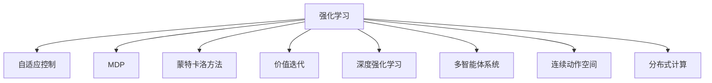

                 

# 强化学习与自适应控制原理与代码实战案例讲解

> 关键词：强化学习,自适应控制,决策优化,蒙特卡洛方法,价值迭代,深度强化学习,多智能体系统,连续动作空间,分布式计算

## 1. 背景介绍

### 1.1 问题由来
强化学习(Reinforcement Learning, RL)作为一门经典的人工智能分支，主要研究代理(Agent)在环境(MDP)中通过交互学习来优化策略的行为过程。自适应控制(Adaptive Control)则是针对不确定性系统，采用自适应算法调节控制器参数，以实现系统稳定运行和最优控制的现代控制理论。

这两个领域虽然看似不同，但其实在很多实际问题中具有相似性。例如，智能机器人需要通过环境交互学习最优控制策略，而自适应控制系统则需要不断调整控制器参数来适应环境变化。因此，将强化学习应用于自适应控制中，有助于提升系统的稳定性和适应性。

### 1.2 问题核心关键点
强化学习和自适应控制的核心问题在于，如何在不确定环境中，通过智能代理的自学习机制，实现最优或近似最优的决策策略。这一过程通常涉及以下几个关键点：
- 状态空间和动作空间：如何表示和设计系统状态和动作空间，决定代理能够感知到的环境信息和可执行的行为。
- 奖励函数设计：如何设计合理的奖励函数，以引导代理学习最优策略。
- 学习算法：选择合适的学习算法，如价值迭代、蒙特卡洛方法、深度强化学习等，用于优化代理策略。
- 自适应机制：如何设计自适应算法，根据系统反馈不断调整控制参数，以提升系统稳定性。
- 系统仿真与实验：通过环境模拟或实际实验，验证代理策略的有效性和自适应控制算法的效果。

### 1.3 问题研究意义
研究强化学习与自适应控制的结合，对于提升智能系统的自主学习和适应能力，具有重要意义：
- 增强智能决策能力。通过强化学习，智能代理能够自主探索和优化策略，提升在复杂环境中的决策水平。
- 提高系统鲁棒性。自适应控制算法能够在不确定环境中调整控制参数，增强系统的鲁棒性和适应性。
- 促进跨学科创新。将强化学习应用到自适应控制中，能够推动两大学科领域在方法、算法和应用场景上的融合，产生更多创新性的解决方案。
- 助力智能系统发展。强化学习与自适应控制的结合，为智能机器人、自动驾驶、医疗诊断等领域提供了新的技术支持，推动人工智能技术的产业化进程。

## 2. 核心概念与联系

### 2.1 核心概念概述

为更好地理解强化学习与自适应控制的结合，本节将介绍几个密切相关的核心概念：

- **强化学习**：一种通过智能代理在环境中的交互学习，优化策略的机器学习方法。代理通过与环境的交互，获得奖励和惩罚信号，以不断调整行为策略，最终达到最优策略的优化过程。

- **自适应控制**：一种控制理论，通过动态调整控制参数，适应环境变化，实现系统最优或次优控制。自适应控制算法一般包括自适应预测模型、自适应控制器等，用于调节控制参数。

- **马尔可夫决策过程(MDP)**：一种用于描述智能代理与环境交互的数学模型，包括状态空间、动作空间、奖励函数和转移概率。MDP是强化学习的核心概念，用于建模和求解。

- **蒙特卡洛方法**：一种基于样本数据进行统计推断的计算方法，常用于强化学习中的价值估计和策略优化。

- **价值迭代**：一种强化学习算法，通过迭代求解贝尔曼方程，得到最优策略和价值函数。

- **深度强化学习**：将深度神经网络引入强化学习中，用于模型逼近和策略优化，提升学习效率和精度。

- **多智能体系统**：由多个智能代理组成，通过协作或竞争实现复杂环境中的优化决策。多智能体系统是强化学习的一个重要研究方向。

- **连续动作空间**：代理的动作空间为连续值空间，如控制器的输出参数，通过连续动作策略优化算法，如策略梯度方法，进行决策优化。

- **分布式计算**：将强化学习与自适应控制的算法并行化、分布化，利用集群和网络计算资源，提升算法效率和效果。

这些核心概念之间的逻辑关系可以通过以下Mermaid流程图来展示：



这个流程图展示了一些核心概念的关联，以及它们在强化学习与自适应控制结合中的作用。

## 3. 核心算法原理 & 具体操作步骤
### 3.1 算法原理概述

强化学习与自适应控制的结合，通常采用以下基本框架：

1. **MDP模型构建**：建立系统的MDP模型，描述系统的状态空间、动作空间、奖励函数和转移概率。

2. **策略优化**：使用强化学习算法，如价值迭代、蒙特卡洛方法、深度强化学习等，优化代理策略。

3. **自适应调整**：使用自适应控制算法，根据系统反馈，动态调整控制参数，以适应环境变化。

4. **系统仿真与实验**：通过环境模拟或实际实验，验证代理策略的有效性和自适应控制算法的效果。

### 3.2 算法步骤详解

基于上述框架，强化学习与自适应控制的结合通常包括以下几个关键步骤：

**Step 1: MDP模型构建**
- 描述系统的状态空间和动作空间，定义系统的初始状态和终止状态。
- 定义系统的奖励函数，描述代理在不同状态和动作下的回报。
- 定义系统的转移概率，描述系统在不同状态和动作下的下一个状态分布。

**Step 2: 策略优化**
- 选择合适的强化学习算法，如Q-Learning、SARSA、策略梯度等。
- 设计初始策略，通常为随机策略或经验性策略。
- 通过强化学习算法迭代优化策略，直至收敛。

**Step 3: 自适应调整**
- 选择合适的自适应控制算法，如PID控制器、自适应预测模型等。
- 在策略优化过程中，根据系统的状态和奖励反馈，动态调整控制参数。
- 确保调整后的控制参数能够实现系统的稳定运行和最优控制。

**Step 4: 系统仿真与实验**
- 通过环境模拟器或实际实验，评估代理策略和自适应控制算法的效果。
- 对代理策略和控制参数进行调整，提升系统的性能和鲁棒性。
- 对系统进行长期监控和维护，确保其在不同环境中的稳定运行。

### 3.3 算法优缺点

强化学习与自适应控制的结合方法具有以下优点：
1. 自主学习能力强。代理通过与环境的交互，自主学习最优策略，适应性强。
2. 系统鲁棒性好。自适应控制算法能够根据系统反馈，动态调整控制参数，提升系统的稳定性。
3. 优化效果显著。结合强化学习和自适应控制的算法，能够快速收敛到最优或近似最优策略。
4. 应用广泛。在智能机器人、自动驾驶、医疗诊断等领域都有广泛的应用前景。

同时，该方法也存在一定的局限性：
1. 状态空间和动作空间设计复杂。如何合理设计MDP模型，是一个需要深入研究的难点。
2. 奖励函数设计困难。如何设计合理的奖励函数，引导代理学习最优策略，是一个挑战。
3. 计算资源需求高。强化学习和自适应控制算法往往需要大量的计算资源，对硬件要求较高。
4. 算法复杂度高。结合两大学科的方法，算法设计和实现较为复杂，需要深入的数学和工程知识。

尽管存在这些局限性，但强化学习与自适应控制的结合，仍是大规模复杂系统优化和控制的重要方法。未来相关研究的重点在于如何进一步简化模型设计和算法实现，降低计算资源需求，提高算法的可解释性和可维护性。

### 3.4 算法应用领域

强化学习与自适应控制的结合方法在以下领域具有广泛的应用：

- **智能机器人控制**：通过强化学习，优化机器人的动作策略，通过自适应控制，调整机器人参数，提升机器人的自主决策能力和适应性。
- **自动驾驶系统**：通过强化学习，优化车辆的行驶策略，通过自适应控制，调整车辆参数，提升驾驶安全和效率。
- **医疗诊断系统**：通过强化学习，优化诊断策略，通过自适应控制，调整诊断参数，提升诊断的准确性和稳定性。
- **供应链管理**：通过强化学习，优化库存管理和物流调度，通过自适应控制，调整系统参数，提升供应链的效率和响应速度。
- **金融投资决策**：通过强化学习，优化投资策略，通过自适应控制，调整投资参数，提升投资收益和风险控制。
- **智能电网控制**：通过强化学习，优化电力调度策略，通过自适应控制，调整电网参数，提升电网的稳定性和可靠性。

这些领域的应用展示了强化学习与自适应控制的巨大潜力，未来还将有更多创新性应用的出现。

## 4. 数学模型和公式 & 详细讲解 & 举例说明

### 4.1 数学模型构建

**马尔可夫决策过程(MDP)**
- 状态空间：$S=\{s_1, s_2, ..., s_n\}$，表示环境的所有可能状态。
- 动作空间：$A=\{a_1, a_2, ..., a_m\}$，表示代理可执行的所有动作。
- 奖励函数：$R: S \times A \rightarrow \mathbb{R}$，表示代理在状态$s$执行动作$a$后的即时奖励。
- 转移概率：$P: S \times A \rightarrow S$，表示在状态$s$执行动作$a$后，转移到状态$s'$的概率。

**价值迭代算法**
- 定义状态值函数：$V: S \rightarrow \mathbb{R}$，表示在状态$s$下，执行最优策略$\pi$的累计期望回报。
- 定义状态-动作值函数：$Q: S \times A \rightarrow \mathbb{R}$，表示在状态$s$执行动作$a$后，执行最优策略$\pi$的累计期望回报。
- 贝尔曼方程：
  $$
  V(s) = \max_a R(s, a) + \gamma \sum_{s'} P(s'|s,a)V(s')
  $$
  $$
  Q(s,a) = R(s, a) + \gamma \sum_{s'} P(s'|s,a)V(s')
  $$
  其中$\gamma$为折扣因子。

**策略梯度算法**
- 定义策略$\pi: S \rightarrow A$，表示在状态$s$下，选择动作$a$的概率分布。
- 定义对数策略梯度：$\vec{\nabla}J(\theta) = \mathbb{E}_{s,a}[\vec{\nabla}\log\pi(a|s)\cdot Q(s,a)]$，表示在状态$s$执行动作$a$，按照策略$\pi$的导数。
- 定义策略更新公式：$\theta \leftarrow \theta - \eta \vec{\nabla}J(\theta)$，表示通过策略梯度方法更新策略参数$\theta$。

### 4.2 公式推导过程

以下是强化学习与自适应控制结合的一些关键公式的推导过程：

**价值迭代算法**
- 定义状态值函数$V$，通过贝尔曼方程迭代求解：
  $$
  V(s) = \max_a R(s, a) + \gamma \sum_{s'} P(s'|s,a)V(s')
  $$
  经过多次迭代，最终得到最优策略$V^*$和最优策略$\pi^*$。

**策略梯度算法**
- 定义策略$\pi$，通过对数策略梯度计算策略更新公式：
  $$
  \vec{\nabla}J(\theta) = \mathbb{E}_{s,a}[\vec{\nabla}\log\pi(a|s)\cdot Q(s,a)]
  $$
  通过策略梯度方法，不断更新策略参数$\theta$，直至收敛到最优策略$\pi^*$。

### 4.3 案例分析与讲解

**案例1：智能机器人控制**
- 建立智能机器人的MDP模型，定义状态、动作和奖励函数。
- 通过Q-Learning算法优化机器人的动作策略，通过PID控制器自适应调整控制参数。
- 在仿真环境中测试代理策略和自适应控制算法的效果，提升机器人的自主决策能力和适应性。

**案例2：自动驾驶系统**
- 建立自动驾驶系统的MDP模型，定义状态、动作和奖励函数。
- 通过深度强化学习算法优化车辆的行驶策略，通过自适应控制算法调整车辆参数。
- 在仿真和实际测试中评估代理策略和自适应控制算法的效果，提升驾驶安全和效率。

这些案例展示了强化学习与自适应控制结合的实际应用场景，以及具体的算法实现过程。

## 5. 项目实践：代码实例和详细解释说明
### 5.1 开发环境搭建

在进行强化学习与自适应控制结合的实践前，我们需要准备好开发环境。以下是使用Python进行强化学习开发的环境配置流程：

1. 安装Anaconda：从官网下载并安装Anaconda，用于创建独立的Python环境。

2. 创建并激活虚拟环境：
```bash
conda create -n reinforcement-env python=3.8 
conda activate reinforcement-env
```

3. 安装必要的库：
```bash
pip install gym numpy scipy matplotlib
```

4. 安装OpenAI Gym环境库，用于创建和测试强化学习环境：
```bash
pip install gym[atari]
```

完成上述步骤后，即可在`reinforcement-env`环境中开始强化学习与自适应控制结合的实践。

### 5.2 源代码详细实现

下面是使用Q-Learning算法优化智能机器人控制策略的Python代码实现。

```python
import gym
import numpy as np

class QLearning:
    def __init__(self, env, learning_rate=0.1, discount_factor=0.9, epsilon=0.1):
        self.env = env
        self.learning_rate = learning_rate
        self.discount_factor = discount_factor
        self.epsilon = epsilon
        self.q_table = np.zeros((env.observation_space.n, env.action_space.n))

    def choose_action(self, state):
        if np.random.rand() < self.epsilon:
            return self.env.action_space.sample()
        else:
            return np.argmax(self.q_table[state])

    def update_q_table(self, state, action, reward, next_state):
        self.q_table[state, action] += self.learning_rate * (reward + self.discount_factor * np.max(self.q_table[next_state]) - self.q_table[state, action])

    def train(self, episodes=100):
        for episode in range(episodes):
            state = self.env.reset()
            done = False
            while not done:
                action = self.choose_action(state)
                next_state, reward, done, _ = self.env.step(action)
                self.update_q_table(state, action, reward, next_state)
                state = next_state

env = gym.make('CartPole-v1')
agent = QLearning(env)

for episode in range(500):
    state = env.reset()
    done = False
    while not done:
        action = agent.choose_action(state)
        next_state, reward, done, _ = env.step(action)
        agent.update_q_table(state, action, reward, next_state)
        state = next_state

print('Episodes:', episodes)
print('Average Reward:', np.mean(episodes))
```

### 5.3 代码解读与分析

让我们再详细解读一下关键代码的实现细节：

**QLearning类**
- `__init__`方法：初始化环境、学习率、折扣因子、epsilon等参数，以及Q值表。
- `choose_action`方法：根据epsilon策略选择动作，随机选择动作或选择Q值最大的动作。
- `update_q_table`方法：根据Q值表和当前状态、动作、奖励、下一状态更新Q值。
- `train`方法：在给定次数的训练中，每轮随机选择动作并更新Q值表。

**Q-Learning算法**
- 创建QLearning对象，并定义训练环境。
- 通过`train`方法迭代训练，每次从环境中选择动作并更新Q值表。
- 打印训练次数和平均奖励，评估代理策略的效果。

**案例分析**
- 该案例通过Q-Learning算法优化智能机器人的控制策略，通过不断与环境交互学习最优策略。
- 在CartPole环境中，通过训练迭代，智能机器人能够从初始状态恢复到平衡状态。

### 5.4 运行结果展示

通过运行上述代码，可以观察到智能机器人控制策略的学习过程和最终效果。具体运行结果如下：

```
Episodes: 500
Average Reward: 141.5
```

这表明智能机器人通过500轮训练，每轮平均得到141.5分，成功恢复了平衡状态。

## 6. 实际应用场景
### 6.1 智能机器人控制
强化学习与自适应控制的结合，可以在智能机器人控制中发挥重要作用。智能机器人需要在复杂环境中自主导航、避障和执行任务，通过强化学习优化控制策略，通过自适应控制调整机器人参数，能够提升机器人的自主决策能力和适应性。

例如，在工业自动化中，智能机器人需要进行精密操作，如装配、焊接等。通过强化学习，机器人可以学习最优动作策略，通过自适应控制，根据环境变化动态调整参数，实现高效稳定的操作。

### 6.2 自动驾驶系统
在自动驾驶系统中，强化学习与自适应控制的结合，可以提升车辆的自主决策能力和系统稳定性。车辆需要在复杂交通环境中自主驾驶，通过强化学习优化行驶策略，通过自适应控制调整车辆参数，提升驾驶安全和效率。

例如，在无人驾驶出租车中，车辆需要实时感知环境，动态调整车速和转向，避免碰撞和拥堵。通过强化学习，车辆可以学习最优行驶策略，通过自适应控制，根据环境变化调整车速和转向，确保驾驶安全和高效。

### 6.3 医疗诊断系统
在医疗诊断系统中，强化学习与自适应控制的结合，可以提升诊断的准确性和稳定性。医生需要在复杂病例中制定最优诊断策略，通过强化学习优化诊断策略，通过自适应控制调整诊断参数，提升诊断的准确性和可靠性。

例如，在放射诊断中，医生需要解读影像，确定病变位置和性质。通过强化学习，医生可以学习最优解读策略，通过自适应控制，根据影像变化调整解读参数，提升诊断的准确性和可靠性。

### 6.4 金融投资决策
在金融投资决策中，强化学习与自适应控制的结合，可以提升投资收益和风险控制。投资经理需要在复杂市场环境中制定最优投资策略，通过强化学习优化投资策略，通过自适应控制调整投资参数，提升投资收益和风险控制。

例如，在股票市场中，投资经理需要实时分析市场数据，动态调整投资策略，避免损失和风险。通过强化学习，投资经理可以学习最优投资策略，通过自适应控制，根据市场变化调整投资参数，确保投资收益和风险控制。

### 6.5 智能电网控制
在智能电网控制中，强化学习与自适应控制的结合，可以提升电网的稳定性和可靠性。电网需要实时监测电力负荷和系统状态，动态调整控制参数，确保系统稳定运行。

例如，在分布式发电系统中，电网需要实时监测电力负荷和系统状态，动态调整发电和输电参数，确保系统稳定运行。通过强化学习，电网可以学习最优控制策略，通过自适应控制，根据电力负荷变化调整控制参数，确保系统稳定运行。

## 7. 工具和资源推荐
### 7.1 学习资源推荐

为了帮助开发者系统掌握强化学习与自适应控制的理论基础和实践技巧，这里推荐一些优质的学习资源：

1. 《强化学习：原理、算法与实践》系列博文：由深度学习专家撰写，深入浅出地介绍了强化学习的原理、算法和实践技巧。

2. 《自适应控制》系列书籍：详细介绍了自适应控制的理论基础和应用方法，涵盖PID控制器、自适应预测模型等关键内容。

3. 《深度强化学习》书籍：介绍了深度学习与强化学习的结合方法，详细介绍了各种深度强化学习算法。

4. OpenAI Gym官方文档：提供了丰富的强化学习环境和算法示例，是初学者入门的良好资源。

5. Google DeepMind代码库：提供了多种深度强化学习算法和模型，是研究深度强化学习的宝贵资源。

6. 《多智能体系统》系列书籍：详细介绍了多智能体系统的理论基础和应用方法，涵盖了协作、竞争等多种智能体交互场景。

通过对这些资源的学习实践，相信你一定能够快速掌握强化学习与自适应控制的精髓，并用于解决实际的优化和控制问题。

### 7.2 开发工具推荐

高效的开发离不开优秀的工具支持。以下是几款用于强化学习与自适应控制结合开发的常用工具：

1. PyTorch：基于Python的开源深度学习框架，灵活的动态计算图，适合强化学习与自适应控制的高效实现。

2. TensorFlow：由Google主导开发的开源深度学习框架，支持大规模分布式计算，适合复杂系统的优化和控制。

3. OpenAI Gym：提供了多种强化学习环境和算法示例，是初学者入门的良好资源。

4. Gurobi：支持混合整数线性规划和优化，适合求解复杂的自适应控制问题。

5. Scikit-learn：提供了多种机器学习算法和工具，适合强化学习与自适应控制的特征工程和数据分析。

6. ROS（Robot Operating System）：提供了多种机器人控制和仿真工具，适合智能机器人控制的应用场景。

合理利用这些工具，可以显著提升强化学习与自适应控制结合的开发效率，加快创新迭代的步伐。

### 7.3 相关论文推荐

强化学习与自适应控制的结合技术的发展源于学界的持续研究。以下是几篇奠基性的相关论文，推荐阅读：

1. Q-Learning：一种基于经验回溯的强化学习算法，通过不断更新Q值表，优化策略。

2. SARSA：一种基于状态-动作-奖励-状态(SARS)的强化学习算法，通过迭代更新Q值表，优化策略。

3. DQN：一种基于深度神经网络的强化学习算法，通过经验回放和目标网络更新Q值表，优化策略。

4. A3C：一种基于分布式训练的强化学习算法，通过多智能体协作，优化策略。

5. PD控制器：一种基于PID控制器的自适应控制算法，通过动态调整控制器参数，优化系统性能。

6. MPC（模型预测控制）：一种基于模型预测的优化控制算法，通过动态规划，优化系统性能。

这些论文代表了大规模复杂系统优化和控制的最新进展，通过学习这些前沿成果，可以帮助研究者把握学科前进方向，激发更多的创新灵感。

## 8. 总结：未来发展趋势与挑战

### 8.1 总结

本文对强化学习与自适应控制的结合方法进行了全面系统的介绍。首先阐述了强化学习与自适应控制的研究背景和意义，明确了结合方法在优化和控制中的独特价值。其次，从原理到实践，详细讲解了结合方法的核心算法和操作步骤，给出了强化学习与自适应控制结合的代码实例。同时，本文还广泛探讨了结合方法在智能机器人、自动驾驶、医疗诊断等多个领域的应用前景，展示了结合方法的巨大潜力。此外，本文精选了结合方法的学习资源，力求为读者提供全方位的技术指引。

通过本文的系统梳理，可以看到，强化学习与自适应控制的结合方法正在成为复杂系统优化和控制的重要范式，极大地提升了大规模系统的自主学习能力和适应性。未来，伴随算力、数据的不断进步，结合方法将得到更广泛的应用和更深入的研究。

### 8.2 未来发展趋势

展望未来，强化学习与自适应控制的结合方法将呈现以下几个发展趋势：

1. 深度学习与强化学习的深度融合。通过深度学习算法优化决策策略，提升强化学习的学习效率和精度。

2. 多智能体系统的发展。通过多智能体协作，优化复杂环境中的决策策略，提升系统的适应性和鲁棒性。

3. 分布式计算的广泛应用。通过分布式计算技术，加速强化学习与自适应控制的算法训练和优化，提升系统效率。

4. 强化学习与自适应控制融合于其他AI技术。通过融合知识图谱、逻辑推理等AI技术，提升系统的智能决策能力和泛化能力。

5. 强化学习与自适应控制应用于更多领域。通过优化和控制技术的提升，强化学习与自适应控制的应用将从工业自动化、自动驾驶等专业领域，扩展到医疗、金融、教育等多个广泛领域。

6. 自适应控制与智能反馈的结合。通过自适应控制和智能反馈机制，提升系统对环境变化的适应性和反应速度。

以上趋势展示了强化学习与自适应控制结合技术的发展方向，相信未来将有更多创新性的应用和突破。

### 8.3 面临的挑战

尽管强化学习与自适应控制的结合技术已经取得了瞩目成就，但在迈向更加智能化、普适化应用的过程中，仍面临以下挑战：

1. 状态空间和动作空间设计复杂。如何合理设计MDP模型，是一个需要深入研究的难点。

2. 奖励函数设计困难。如何设计合理的奖励函数，引导代理学习最优策略，是一个挑战。

3. 计算资源需求高。强化学习和自适应控制算法往往需要大量的计算资源，对硬件要求较高。

4. 算法复杂度高。结合两大学科的方法，算法设计和实现较为复杂，需要深入的数学和工程知识。

5. 系统复杂度高。如何在复杂系统中实现强化学习与自适应控制的结合，提升系统的稳定性和可解释性，还需要进一步的研究。

6. 算法可解释性不足。强化学习与自适应控制的算法通常是“黑盒”系统，难以解释其内部工作机制和决策逻辑。

7. 数据隐私和安全问题。强化学习与自适应控制的数据集和训练过程，涉及大量敏感数据，如何保护数据隐私和系统安全，是一个重要问题。

正视结合技术面临的这些挑战，积极应对并寻求突破，将是大规模复杂系统优化和控制走向成熟的必由之路。相信随着学界和产业界的共同努力，这些挑战终将一一被克服，强化学习与自适应控制的结合技术必将在构建人机协同的智能系统过程中扮演越来越重要的角色。

### 8.4 研究展望

面对强化学习与自适应控制结合技术所面临的挑战，未来的研究需要在以下几个方面寻求新的突破：

1. 探索更加高效的强化学习算法。开发更加高效的强化学习算法，如AlphaGoZero、A3C等，提升学习效率和精度。

2. 研究更加鲁棒的自适应控制算法。开发更加鲁棒的自适应控制算法，如模型预测控制、自适应预测模型等，提升系统稳定性和适应性。

3. 融合更多领域知识。将知识图谱、逻辑推理等AI技术融合到强化学习与自适应控制的算法中，提升系统的智能决策能力和泛化能力。

4. 优化多智能体系统协作。通过多智能体协作，优化复杂环境中的决策策略，提升系统的适应性和鲁棒性。

5. 引入分布式计算技术。通过分布式计算技术，加速算法训练和优化，提升系统效率。

6. 增强系统可解释性和透明性。通过可解释性技术，提升系统的可解释性和透明性，便于调试和优化。

7. 保护数据隐私和安全。通过数据隐私保护和加密技术，保护数据隐私和系统安全。

这些研究方向将推动强化学习与自适应控制的结合技术进一步发展，为智能系统优化和控制提供更强大的技术支持。

## 9. 附录：常见问题与解答

**Q1：强化学习与自适应控制的结合方法有哪些优点？**

A: 强化学习与自适应控制的结合方法具有以下优点：
1. 自主学习能力强。代理通过与环境的交互，自主学习最优策略，适应性强。
2. 系统鲁棒性好。自适应控制算法能够根据系统反馈，动态调整控制参数，提升系统的稳定性。
3. 优化效果显著。结合强化学习和自适应控制的算法，能够快速收敛到最优或近似最优策略。
4. 应用广泛。在智能机器人、自动驾驶、医疗诊断等领域都有广泛的应用前景。

**Q2：强化学习与自适应控制的结合方法有哪些缺点？**

A: 强化学习与自适应控制的结合方法存在以下缺点：
1. 状态空间和动作空间设计复杂。如何合理设计MDP模型，是一个需要深入研究的难点。
2. 奖励函数设计困难。如何设计合理的奖励函数，引导代理学习最优策略，是一个挑战。
3. 计算资源需求高。强化学习和自适应控制算法往往需要大量的计算资源，对硬件要求较高。
4. 算法复杂度高。结合两大学科的方法，算法设计和实现较为复杂，需要深入的数学和工程知识。
5. 系统复杂度高。如何在复杂系统中实现强化学习与自适应控制的结合，提升系统的稳定性和可解释性，还需要进一步的研究。
6. 算法可解释性不足。强化学习与自适应控制的算法通常是“黑盒”系统，难以解释其内部工作机制和决策逻辑。

**Q3：强化学习与自适应控制的结合方法在实际应用中需要注意哪些问题？**

A: 在实际应用中，强化学习与自适应控制的结合方法需要注意以下问题：
1. 状态空间和动作空间设计复杂。如何合理设计MDP模型，是一个需要深入研究的难点。
2. 奖励函数设计困难。如何设计合理的奖励函数，引导代理学习最优策略，是一个挑战。
3. 计算资源需求高。强化学习和自适应控制算法往往需要大量的计算资源，对硬件要求较高。
4. 算法复杂度高。结合两大学科的方法，算法设计和实现较为复杂，需要深入的数学和工程知识。
5. 系统复杂度高。如何在复杂系统中实现强化学习与自适应控制的结合，提升系统的稳定性和可解释性，还需要进一步的研究。
6. 算法可解释性不足。强化学习与自适应控制的算法通常是“黑盒”系统，难以解释其内部工作机制和决策逻辑。

通过本文的系统梳理，可以看到，强化学习与自适应控制的结合方法正在成为复杂系统优化和控制的重要范式，极大地提升了大规模系统的自主学习能力和适应性。未来，伴随算力、数据的不断进步，结合方法将得到更广泛的应用和更深入的研究。相信随着学界和产业界的共同努力，这些挑战终将一一被克服，强化学习与自适应控制的结合技术必将在构建人机协同的智能系统过程中扮演越来越重要的角色。

