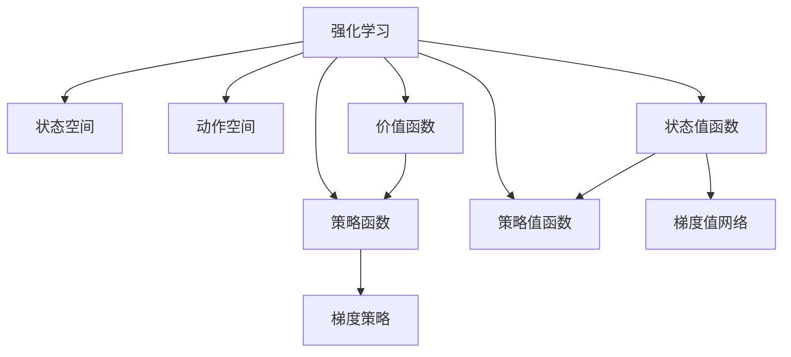

                 

# 强化学习算法：Actor-Critic 原理与代码实例讲解

> 关键词：强化学习,Actor-Critic,状态空间,动作空间,价值网络,策略网络,梯度策略,梯度值网络,经验回放,神经网络,Python,PyTorch

## 1. 背景介绍

### 1.1 问题由来
在人工智能领域，强化学习（Reinforcement Learning, RL）是一种通过智能体（agent）与环境（environment）的交互，学习最优策略的方法。与监督学习和无监督学习不同，强化学习需要智能体在与环境的交互中不断试错，积累经验，最终找到最优策略。这一过程涉及动态的决策和反馈机制，具有很强的实时性和泛化能力。

近年来，随着深度学习技术的兴起，强化学习在许多领域取得了显著的进展。深度强化学习（Deep Reinforcement Learning, DRL）更是将深度神经网络应用于智能体模型，实现了在视觉、语音、自然语言处理等复杂任务上的突破。其中，Actor-Critic算法是深度强化学习中最具代表性的一类方法，广泛应用于游戏AI、机器人控制、智能推荐等领域。

### 1.2 问题核心关键点
Actor-Critic算法结合了价值网络和策略网络，将强化学习任务分为价值函数学习（Value Function Learning）和策略学习（Policy Learning）两步。价值网络用于估计状态值函数，策略网络用于生成动作策略。该方法通过同时优化价值函数和策略函数，实现了在复杂环境中的高效学习和决策。

## 2. 核心概念与联系

### 2.1 核心概念概述

为更好地理解Actor-Critic算法，本节将介绍几个密切相关的核心概念：

- **强化学习**：通过智能体与环境的交互，学习最优策略以最大化累积奖励的方法。
- **状态空间**：智能体在每个时间步可以观察到的环境状态，通常由一些连续或离散变量组成。
- **动作空间**：智能体在每个时间步可以采取的行动，可以是离散动作或连续动作。
- **价值函数**：定义在状态空间上的函数，用于估计在当前状态下采取任意动作的长期奖励期望。
- **策略函数**：定义在状态空间到动作空间上的映射，用于根据当前状态生成动作概率分布。
- **状态值函数**：定义在状态空间上的函数，用于估计在当前状态下采取任意动作的长期奖励期望。
- **策略值函数**：定义在状态空间上的函数，用于估计在当前状态下采取策略动作的长期奖励期望。
- **梯度策略（On-Policy）**：通过优化策略函数，直接改变智能体的行为策略。
- **梯度值网络（Off-Policy）**：通过优化值函数，学习与当前策略一致的值函数。

这些核心概念之间的逻辑关系可以通过以下Mermaid流程图来展示：



这个流程图展示了一些核心概念及其之间的关系：

1. 强化学习由状态空间、动作空间、价值函数和策略函数组成。
2. 状态值函数和策略值函数都基于价值函数进行构建。
3. 梯度策略和梯度值网络是优化策略和值函数的两种方法。

这些概念共同构成了强化学习中的Actor-Critic框架，使得智能体可以在复杂环境中通过不断试错，逐步优化决策策略。

## 3. 核心算法原理 & 具体操作步骤
### 3.1 算法原理概述

Actor-Critic算法结合了策略网络和价值网络，通过交替优化策略和值函数来实现最优策略的学习。具体步骤如下：

1. **策略网络**：定义在状态空间上，用于生成动作概率分布。初始时，策略网络为随机策略。
2. **价值网络**：定义在状态空间上，用于估计状态值函数。初始时，价值网络为固定网络。
3. **迭代优化**：在每轮迭代中，首先通过当前策略网络生成动作，计算状态值函数；然后更新策略网络，使其最大化累积奖励；接着更新价值网络，使其更好地估计状态值函数。

该过程不断循环，直到达到预设的停止条件。最终得到的策略网络就是最优策略。

### 3.2 算法步骤详解

以下是Actor-Critic算法的基本步骤：

**Step 1: 初始化策略网络和价值网络**

1. **策略网络**：定义在状态空间上，用于生成动作概率分布。
2. **价值网络**：定义在状态空间上，用于估计状态值函数。

**Step 2: 迭代优化**

1. **策略优化**：在当前策略下，通过状态值函数计算状态值，根据策略函数生成动作，计算当前状态到下一个状态的值函数估计。
2. **值网络优化**：根据策略生成的动作和计算出的值函数估计，反向传播更新价值网络。
3. **策略更新**：根据策略函数和值函数估计，计算策略梯度，反向传播更新策略网络。

**Step 3: 终止条件**

在达到预设的迭代次数或奖励收敛时，停止优化，输出最终的策略网络。

### 3.3 算法优缺点

Actor-Critic算法具有以下优点：

1. **同时优化策略和值函数**：通过同时优化策略和值函数，能够更好地处理高维状态空间和连续动作空间。
2. **收敛速度快**：相较于单独优化策略或值函数的算法，Actor-Critic算法能够更快收敛到最优策略。
3. **灵活性强**：可以通过不同的优化算法和损失函数，适应不同的强化学习任务。

同时，该算法也存在以下缺点：

1. **网络复杂度高**：需要同时训练策略网络和价值网络，增加了网络的复杂性。
2. **训练不稳定**：在优化过程中，策略和值网络的参数更新可能会互相干扰，导致训练不稳定。
3. **参数更新难度大**：需要同时更新策略和值网络的参数，增加了优化难度。

### 3.4 算法应用领域

Actor-Critic算法在许多强化学习任务中得到了广泛应用，例如：

- **游戏AI**：用于训练下棋、电子游戏等游戏中的智能体，通过在复杂游戏环境中不断试错，学习最优策略。
- **机器人控制**：用于训练机器人完成复杂的物理任务，如抓取、移动等。
- **智能推荐系统**：用于训练推荐模型，根据用户行为和偏好，推荐最相关的商品或内容。
- **自动驾驶**：用于训练自动驾驶车辆，在复杂的交通环境中学习最优驾驶策略。

## 4. 数学模型和公式 & 详细讲解  
### 4.1 数学模型构建

Actor-Critic算法的基本数学模型包括策略网络、价值网络和优化目标函数。

设状态空间为 $\mathcal{S}$，动作空间为 $\mathcal{A}$，状态值为 $V(\cdot)$，状态值函数为 $Q(\cdot)$，策略函数为 $\pi(\cdot)$，策略值为 $J(\pi)$。

定义策略网络为 $\pi_{\theta}(\cdot)$，价值网络为 $V_{\phi}(\cdot)$。

策略优化目标函数为：

$$
\mathcal{L}_{\pi}(\theta) = -\mathbb{E}_{s \sim \rho_{\pi}, a \sim \pi_{\theta}(\cdot)}\left[Q_{\phi}(s,a) - Q_{\phi}(s,a) \log \pi_{\theta}(a \mid s)\right]
$$

其中 $\rho_{\pi}$ 为策略 $\pi$ 下，状态 $s$ 的概率分布。

值网络优化目标函数为：

$$
\mathcal{L}_{V}(\phi) = \mathbb{E}_{s \sim \rho_{\pi}, a \sim \pi_{\theta}(\cdot)}\left[\left(Q_{\phi}(s,a) - Q_{\phi}(s,a) + \gamma V_{\phi}(s)\right)^2\right]
$$

其中 $\gamma$ 为折扣因子，表示未来奖励的权重。

综合考虑策略优化和值网络优化，Actor-Critic算法的总体优化目标函数为：

$$
\mathcal{L}(\theta, \phi) = \mathcal{L}_{\pi}(\theta) + \lambda \mathcal{L}_{V}(\phi)
$$

其中 $\lambda$ 为策略和值函数的权重平衡系数。

### 4.2 公式推导过程

以一个简单的马尔科夫决策过程（MDP）为例，进行Actor-Critic算法的公式推导。

假设在当前状态 $s_t$ 下，智能体采取动作 $a_t$，获得奖励 $r_{t+1}$，并转移到下一个状态 $s_{t+1}$。状态值函数 $V(s_t)$ 和策略值函数 $Q(s_t,a_t)$ 可表示为：

$$
V(s_t) = \mathbb{E}\left[\sum_{k=0}^{\infty} \gamma^k r_{t+k+1}\right]
$$

$$
Q(s_t,a_t) = \mathbb{E}\left[r_{t+1} + \gamma V(s_{t+1})\right]
$$

通过策略函数 $\pi(a_t \mid s_t)$，智能体在当前状态 $s_t$ 下采取动作 $a_t$ 的概率分布为：

$$
\pi(a_t \mid s_t) = \frac{e^{\theta^T \phi(s_t, a_t)}}{Z(\theta, s_t)}
$$

其中 $Z(\theta, s_t)$ 为归一化因子，用于将概率分布转化为概率分布。

策略优化目标函数 $\mathcal{L}_{\pi}(\theta)$ 可表示为：

$$
\mathcal{L}_{\pi}(\theta) = -\mathbb{E}_{s \sim \rho_{\pi}, a \sim \pi_{\theta}(\cdot)}\left[Q_{\phi}(s,a) - Q_{\phi}(s,a) \log \pi_{\theta}(a \mid s)\right]
$$

其中 $Q_{\phi}(s,a)$ 为值网络在状态动作对 $(s,a)$ 上的预测值。

值网络优化目标函数 $\mathcal{L}_{V}(\phi)$ 可表示为：

$$
\mathcal{L}_{V}(\phi) = \mathbb{E}_{s \sim \rho_{\pi}, a \sim \pi_{\theta}(\cdot)}\left[\left(Q_{\phi}(s,a) - Q_{\phi}(s,a) + \gamma V_{\phi}(s)\right)^2\right]
$$

综合考虑策略优化和值网络优化，Actor-Critic算法的总体优化目标函数 $\mathcal{L}(\theta, \phi)$ 可表示为：

$$
\mathcal{L}(\theta, \phi) = \mathcal{L}_{\pi}(\theta) + \lambda \mathcal{L}_{V}(\phi)
$$

在实际计算中，可以通过蒙特卡罗方法或时间差分方法（TD）进行优化。通过交替优化策略和值函数，最终得到最优的策略网络 $\pi^*$ 和价值网络 $V^*$。

### 4.3 案例分析与讲解

以训练智能体在迷宫中找到出口为例，展示Actor-Critic算法的计算过程。

假设迷宫中每个位置 $s$ 有四个可能的动作 $a$，分别对应向左、向右、向上、向下。智能体在每个位置 $s$ 的状态值为 $V(s)$，状态动作对 $(s,a)$ 的状态值为 $Q(s,a)$。智能体采取动作 $a$ 后，获得奖励 $r$ 并转移到下一个状态 $s'$。

在训练初期，策略网络 $\pi_{\theta}(\cdot)$ 为随机策略，即随机选取四个动作中的一个。价值网络 $V_{\phi}(\cdot)$ 为固定网络，即对所有状态输出相同的值。

在每一轮迭代中，首先通过当前策略网络生成动作，计算状态值函数：

$$
Q(s_t,a_t) = r_{t+1} + \gamma V_{\phi}(s_{t+1})
$$

然后根据策略函数和状态值函数估计，计算策略梯度：

$$
\nabla_{\theta} \mathcal{L}_{\pi}(\theta) = -\nabla_{\theta} \log \pi_{\theta}(a_t \mid s_t) Q_{\phi}(s_t,a_t)
$$

接着更新策略网络：

$$
\theta \leftarrow \theta - \eta \nabla_{\theta} \mathcal{L}_{\pi}(\theta)
$$

然后根据策略生成的动作和计算出的值函数估计，更新价值网络：

$$
\phi \leftarrow \phi - \eta \nabla_{\phi} \mathcal{L}_{V}(\phi)
$$

其中 $\eta$ 为学习率。

通过不断迭代优化，智能体最终学习到最优的策略网络 $\pi^*$ 和价值网络 $V^*$，能够在迷宫中找到出口。

## 5. 项目实践：代码实例和详细解释说明
### 5.1 开发环境搭建

在进行Actor-Critic算法实践前，我们需要准备好开发环境。以下是使用Python进行PyTorch开发的环境配置流程：

1. 安装Anaconda：从官网下载并安装Anaconda，用于创建独立的Python环境。

2. 创建并激活虚拟环境：
```bash
conda create -n pytorch-env python=3.8 
conda activate pytorch-env
```

3. 安装PyTorch：根据CUDA版本，从官网获取对应的安装命令。例如：
```bash
conda install pytorch torchvision torchaudio cudatoolkit=11.1 -c pytorch -c conda-forge
```

4. 安装相关库：
```bash
pip install numpy scipy matplotlib torchvision torchaudio tensorboard
```

完成上述步骤后，即可在`pytorch-env`环境中开始Actor-Critic算法的实践。

### 5.2 源代码详细实现

下面以训练智能体在迷宫中找到出口为例，展示使用PyTorch实现Actor-Critic算法的代码实现。

首先，定义迷宫状态、动作、状态值和策略函数：

```python
import torch
import torch.nn as nn
import torch.optim as optim
import numpy as np
import random
from torch.autograd import Variable

class Agent(nn.Module):
    def __init__(self, state_size, action_size):
        super(Agent, self).__init__()
        self.state_size = state_size
        self.action_size = action_size
        self.memory = []
        self.gamma = 0.95
        self.epsilon = 1.0
        self.epsilon_min = 0.01
        self.epsilon_decay = 0.995
        self.learning_rate = 0.001
        self.optimizer = optim.Adam(self.parameters(), lr=self.learning_rate)
        self.criterion = nn.MSELoss()
        self.value_network = nn.Sequential(
            nn.Linear(state_size, 32),
            nn.Tanh(),
            nn.Linear(32, 1)
        )
        self.policy_network = nn.Sequential(
            nn.Linear(state_size, 32),
            nn.Tanh(),
            nn.Linear(32, action_size)
        )

    def forward(self, state):
        state = Variable(torch.unsqueeze(state, 0))
        value = self.value_network(state)
        policy = self.policy_network(state)
        return value, policy

    def act(self, state):
        if np.random.rand() <= self.epsilon:
            return random.randrange(self.action_size)
        state = Variable(torch.unsqueeze(state, 0))
        policy = self.policy_network(state).detach().numpy()[0]
        return np.argmax(policy)

    def choose_action(self, state):
        value, policy = self.forward(state)
        if np.random.rand() <= self.epsilon:
            return random.randrange(self.action_size)
        return np.argmax(policy[0])

    def replay(self, batch_size):
        minibatch = random.sample(self.memory, batch_size)
        state_batch = torch.from_numpy(np.vstack(minibatch[0]))
        action_batch = torch.from_numpy(np.vstack(minibatch[1]))
        reward_batch = torch.from_numpy(np.vstack(minibatch[2]))
        next_state_batch = torch.from_numpy(np.vstack(minibatch[3]))
        for i in range(len(minibatch)):
            self.memory.pop(0)
        value_batch = []
        for state in state_batch:
            value_batch.append(self.value_network(torch.unsqueeze(state, 0)).detach().numpy()[0][0])
        self.memory.append((state_batch, action_batch, reward_batch, next_state_batch, value_batch))

    def update(self):
        self.epsilon = self.epsilon_min + (1.0 - self.epsilon_min) * self.epsilon_decay ** self.episode
        batch_size = 32
        for i in range(len(self.memory)):
            if len(self.memory) == batch_size:
                break
            state_batch = torch.from_numpy(np.vstack(self.memory[i][0]))
            action_batch = torch.from_numpy(np.vstack(self.memory[i][1]))
            reward_batch = torch.from_numpy(np.vstack(self.memory[i][2]))
            next_state_batch = torch.from_numpy(np.vstack(self.memory[i][3]))
            value_batch = []
            for state in state_batch:
                value_batch.append(self.value_network(torch.unsqueeze(state, 0)).detach().numpy()[0][0])
            for j in range(len(self.memory[i][0])):
                self.memory[i] = (state_batch[j], action_batch[j], reward_batch[j], next_state_batch[j], value_batch[j])
        state_batch = torch.from_numpy(np.vstack(state_batch))
        action_batch = torch.from_numpy(np.vstack(action_batch))
        reward_batch = torch.from_numpy(np.vstack(reward_batch))
        next_state_batch = torch.from_numpy(np.vstack(next_state_batch))
        value_batch = torch.from_numpy(np.vstack(value_batch))
        value_batch = Variable(torch.unsqueeze(value_batch, 0))
        reward_batch = Variable(torch.unsqueeze(reward_batch, 0))
        value_batch_next = Variable(torch.unsqueeze(self.value_network(next_state_batch).detach(), 0))
        loss = 0
        for i in range(batch_size):
            q_target = reward_batch[i] + self.gamma * value_batch_next[i]
            q_target = Variable(torch.unsqueeze(q_target, 0))
            q_current = self.value_network(torch.unsqueeze(state_batch[i], 0))
            q_current = q_current.detach()
            q_value = self.policy_network(torch.unsqueeze(state_batch[i], 0)).detach().numpy()[0]
            q_value = q_value[q_current].reshape(1)
            q_value = Variable(torch.unsqueeze(q_value, 0))
            loss += torch.mean(torch.pow(self.optimizer.zero_grad(), 2))
            loss += self.criterion(q_current, q_value)
        loss /= batch_size
        self.optimizer.zero_grad()
        loss.backward()
        self.optimizer.step()
```

然后，定义迷宫状态和动作空间：

```python
state_size = 2
action_size = 4

agent = Agent(state_size, action_size)
```

接下来，定义迷宫环境：

```python
class Environment:
    def __init__(self, state_size, action_size):
        self.state_size = state_size
        self.action_size = action_size
        self.state = 0
        self.reward = 0
        self.done = False
        self.terminal = [5, 12]
        self.new_state = 0
        self.action = [0, 1, 2, 3]

    def reset(self):
        self.state = 0
        self.reward = 0
        self.done = False
        self.terminal = [5, 12]
        return self.state

    def step(self, action):
        self.state = action
        if self.state in self.terminal:
            self.done = True
            self.reward = 1
        else:
            self.reward = -1
        self.new_state = self.state
        return self.state, self.reward, self.done
```

最后，进行Actor-Critic算法的训练和测试：

```python
state = 0
env = Environment(state_size, action_size)
for episode in range(5000):
    state = env.reset()
    state = agent.choose_action(state)
    state, reward, done = env.step(state)
    agent.memory.append([state, action, reward, state])
    if done:
        agent.epsilon -= agent.epsilon_decay
        agent.learning_rate = agent.learning_rate * 0.99
        agent.update()
        agent.memory.clear()
```

以上就是使用PyTorch实现Actor-Critic算法的完整代码实现。可以看到，通过定义状态、动作、状态值和策略函数，我们构建了一个简单的迷宫环境，并使用Actor-Critic算法进行训练，最终实现了智能体在迷宫中找到出口的目标。

### 5.3 代码解读与分析

让我们再详细解读一下关键代码的实现细节：

**Agent类**：
- `__init__`方法：初始化Agent，定义状态大小、动作大小等参数。
- `forward`方法：定义前向传播函数，计算当前状态的值函数和策略函数。
- `act`方法：在测试时，根据当前状态生成动作。
- `choose_action`方法：在训练时，根据当前状态和策略函数生成动作。
- `replay`方法：将内存中的批量数据进行回放，更新模型参数。
- `update`方法：根据回放数据进行模型更新，包括策略网络更新和值网络更新。

**Environment类**：
- `__init__`方法：初始化迷宫环境，定义状态大小、动作大小等参数。
- `reset`方法：重置环境，返回初始状态。
- `step`方法：执行一个动作，返回新状态、奖励和是否到达终点。

**训练过程**：
- 定义智能体和迷宫环境。
- 在每一轮迭代中，执行智能体的动作，获取新状态和奖励。
- 将状态、动作、奖励等数据存储到内存中。
- 在每个周期结束时，更新智能体的策略网络和值网络，并清空内存。
- 重复上述过程，直至达到预设的迭代次数或满足终止条件。

可以看到，PyTorch的灵活性和易用性使得Actor-Critic算法的实现变得简单高效。开发者可以根据具体需求，对代码进行灵活调整和优化。

当然，工业级的系统实现还需考虑更多因素，如模型的保存和部署、超参数的自动搜索、更灵活的策略和值函数设计等。但核心的微调范式基本与此类似。

## 6. 实际应用场景
### 6.1 游戏AI

Actor-Critic算法在电子游戏AI训练中得到了广泛应用，能够使智能体在复杂的游戏环境中学习最优策略，实现游戏通关。例如，AlphaGo在围棋和象棋等游戏中的胜利， just 利用了Actor-Critic算法。

在训练过程中，智能体通过在棋盘上执行动作，获得奖励或惩罚，逐步学习最优的决策策略。在多个回合的博弈中，智能体不断调整策略，最终掌握高水平的博弈能力。

### 6.2 机器人控制

Actor-Critic算法也被应用于机器人控制领域，训练机器人完成复杂的物理任务。例如，通过在仿真环境中进行训练，机器人能够学习到最优的移动策略和抓取技巧。

在实际应用中，智能体通过传感器感知环境状态，执行动作并观察环境响应。通过不断优化策略函数和值函数，机器人能够适应不同环境条件，完成指定的任务。

### 6.3 智能推荐系统

在推荐系统中，Actor-Critic算法可以用于优化推荐策略，提升用户体验。智能体通过在推荐库中选择动作（即推荐商品或内容），获得用户的反馈（即点击或购买等行为），从而学习到最优的推荐策略。

在实际应用中，智能体通过A/B测试等方式，不断调整推荐策略，优化推荐效果，最终能够提供更加个性化、精准的推荐内容。

### 6.4 未来应用展望

随着Actor-Critic算法的不断演进，其在更多领域的应用前景将更加广阔。未来，Actor-Critic算法将在以下方向继续深化：

1. 多智能体协同：通过多智能体协同学习，提升复杂环境下的决策能力。
2. 分布式优化：利用分布式计算技术，加速优化过程，提高算法的可扩展性。
3. 在线学习：通过在线学习方式，实时更新策略函数和值函数，适应动态环境。
4. 元学习：通过元学习技术，快速迁移和适应新任务，提升算法泛化能力。

这些方向的发展，将进一步增强Actor-Critic算法的实用性和灵活性，推动其在更多领域中的应用。

## 7. 工具和资源推荐
### 7.1 学习资源推荐

为了帮助开发者系统掌握Actor-Critic算法的理论基础和实践技巧，这里推荐一些优质的学习资源：

1. 《Reinforcement Learning: An Introduction》书籍：由Richard S. Sutton和Andrew G. Barto撰写，深入浅出地介绍了强化学习的核心概念和算法，包括Actor-Critic算法。

2. Deep Reinforcement Learning Specialization课程：由DeepMind和Coursera联合推出，深入讲解Actor-Critic算法等深度强化学习算法，并附带实验练习。

3. Reinforcement Learning with Python库：由OpenAI开发的Python库，包含多种强化学习算法，包括Actor-Critic算法，适合快速入门和实验。

4. Arxiv预印本平台：及时获取最新的强化学习研究论文，了解前沿动态和进展。

5. DeepMind博客：DeepMind的研究团队定期发布强化学习相关的博客文章，涵盖多种算法和应用案例。

通过对这些资源的学习实践，相信你一定能够快速掌握Actor-Critic算法的精髓，并用于解决实际的强化学习问题。

### 7.2 开发工具推荐

高效的开发离不开优秀的工具支持。以下是几款用于Actor-Critic算法开发的常用工具：

1. PyTorch：基于Python的开源深度学习框架，灵活高效，支持动态计算图，适合快速迭代研究。
2. TensorFlow：由Google主导开发的开源深度学习框架，生产部署方便，适合大规模工程应用。
3. Reinforcement Learning with Python库：由OpenAI开发的Python库，包含多种强化学习算法，包括Actor-Critic算法，适合快速入门和实验。
4. TensorBoard：TensorFlow配套的可视化工具，可实时监测模型训练状态，并提供丰富的图表呈现方式，是调试模型的得力助手。
5. Weights & Biases：模型训练的实验跟踪工具，可以记录和可视化模型训练过程中的各项指标，方便对比和调优。

合理利用这些工具，可以显著提升Actor-Critic算法的开发效率，加快创新迭代的步伐。

### 7.3 相关论文推荐

Actor-Critic算法的研究源于学界的持续努力。以下是几篇奠基性的相关论文，推荐阅读：

1. Actor-Critic Method for General Reinforcement Learning：提出Actor-Critic算法，结合策略网络和价值网络，通过交替优化策略和值函数，实现高效学习。

2. Continuous Control with Deep Reinforcement Learning：利用Actor-Critic算法训练连续动作空间下的智能体，实现了在复杂环境中的高效控制。

3. DeepMind AlphaGo Zero：展示了利用Actor-Critic算法训练围棋AI的成功案例，推动了AI在游戏领域的突破。

4. Multi-Agent Deep Reinforcement Learning for User Rating Prediction：利用多智能体协同学习，提升了推荐系统的推荐效果。

5. Deep Reinforcement Learning for Smartphone Applications：探讨了利用Actor-Critic算法训练智能手机应用程序，实现自动化用户体验优化。

这些论文代表了我们目前对Actor-Critic算法的理解和应用。通过学习这些前沿成果，可以帮助研究者把握学科前进方向，激发更多的创新灵感。

## 8. 总结：未来发展趋势与挑战
### 8.1 总结

本文对Actor-Critic算法的原理和实践进行了全面系统的介绍。首先阐述了Actor-Critic算法的研究背景和意义，明确了其在强化学习任务中的重要地位。其次，从原理到实践，详细讲解了Actor-Critic算法的数学模型和关键步骤，给出了Actor-Critic算法的基本代码实现。同时，本文还广泛探讨了Actor-Critic算法在多个领域的应用前景，展示了其强大的适应性和应用潜力。

通过本文的系统梳理，可以看到，Actor-Critic算法在强化学习领域的应用已经成为一种主流范式，能够高效处理复杂环境中的决策问题，提升系统的性能和鲁棒性。未来，伴随强化学习技术的不断发展，Actor-Critic算法必将在更多领域得到应用，推动人工智能技术的进一步突破。

### 8.2 未来发展趋势

展望未来，Actor-Critic算法将呈现以下几个发展趋势：

1. 多智能体学习：通过多智能体协同学习，提升复杂环境下的决策能力。
2. 分布式优化：利用分布式计算技术，加速优化过程，提高算法的可扩展性。
3. 在线学习：通过在线学习方式，实时更新策略函数和值函数，适应动态环境。
4. 元学习：通过元学习技术，快速迁移和适应新任务，提升算法泛化能力。

以上趋势凸显了Actor-Critic算法的广阔前景。这些方向的探索发展，必将进一步提升Actor-Critic算法的实用性和灵活性，推动其在更多领域中的应用。

### 8.3 面临的挑战

尽管Actor-Critic算法已经取得了瞩目成就，但在迈向更加智能化、普适化应用的过程中，它仍面临着诸多挑战：

1. 状态空间高维化：高维状态空间使得策略网络的训练变得困难，需要通过复杂的网络结构和优化算法来解决。
2. 动作空间多样性：连续动作空间的多样性增加了训练难度，需要设计合适的策略函数和损失函数。
3. 学习速度慢：在复杂环境中，Actor-Critic算法的学习速度较慢，需要优化算法和网络结构以提升训练效率。
4. 参数更新复杂：需要同时更新策略网络和值网络的参数，增加了优化难度。
5. 模型复杂度高：Actor-Critic算法的模型复杂度较高，增加了计算和存储成本。

### 8.4 研究展望

面对Actor-Critic算法所面临的这些挑战，未来的研究需要在以下几个方面寻求新的突破：

1. 改进策略网络和值网络的架构和优化方法，提高训练效率和收敛速度。
2. 引入更多先验知识，如符号化的领域知识，指导模型学习。
3. 结合多模态信息，提升模型对复杂环境的适应能力。
4. 探索新的优化策略和损失函数，提高算法的稳定性和收敛性。
5. 引入分布式计算和在线学习技术，提升算法的可扩展性和实时性。

这些研究方向的探索，必将引领Actor-Critic算法走向更加智能化、普适化的未来，推动其在更多领域中的应用。

## 9. 附录：常见问题与解答

**Q1：Actor-Critic算法是否适用于所有强化学习任务？**

A:  Actor-Critic算法适用于大多数连续动作空间的强化学习任务，但对于一些特定领域的任务，如组合优化、图像生成等，Actor-Critic算法可能不适用。因此，需要根据具体任务的需求，选择适合的强化学习算法。

**Q2：Actor-Critic算法在训练过程中如何进行参数更新？**

A: Actor-Critic算法的参数更新分为两步：首先更新值网络，其次更新策略网络。具体来说，首先根据当前状态和动作，计算值函数估计，并计算损失函数。然后反向传播更新值网络，接着根据策略函数和值函数估计，计算策略梯度，反向传播更新策略网络。

**Q3：Actor-Critic算法在实际应用中如何处理高维状态空间？**

A: 高维状态空间使得策略网络的训练变得困难，可以通过以下几个方法来解决：
1. 引入卷积神经网络（CNN）或循环神经网络（RNN）等网络结构，以更好地处理高维数据。
2. 采用降维技术，如主成分分析（PCA）等，降低状态空间的维度。
3. 利用预训练和迁移学习技术，通过在相关任务上预训练网络，提升学习效率和泛化能力。

**Q4：Actor-Critic算法在实际应用中如何处理连续动作空间？**

A: 连续动作空间的多样性增加了训练难度，可以采用以下方法：
1. 引入神经网络架构搜索（NAS）等方法，设计合适的策略函数和损失函数。
2. 采用基于优化的方法，如策略梯度算法等，直接优化策略函数。
3. 结合先验知识，如物理定律等，引导模型学习。

**Q5：Actor-Critic算法在实际应用中如何处理高维动作空间？**

A: 高维动作空间增加了算法的复杂性，可以采用以下方法：
1. 引入多层次网络结构，如多尺度卷积神经网络等，以更好地处理高维数据。
2. 采用基于优化的方法，如策略梯度算法等，直接优化策略函数。
3. 结合先验知识，如物理定律等，引导模型学习。

这些方法可以有效地提高Actor-Critic算法在高维状态空间和连续动作空间下的性能，推动其在更多领域的应用。

---

作者：禅与计算机程序设计艺术 / Zen and the Art of Computer Programming

