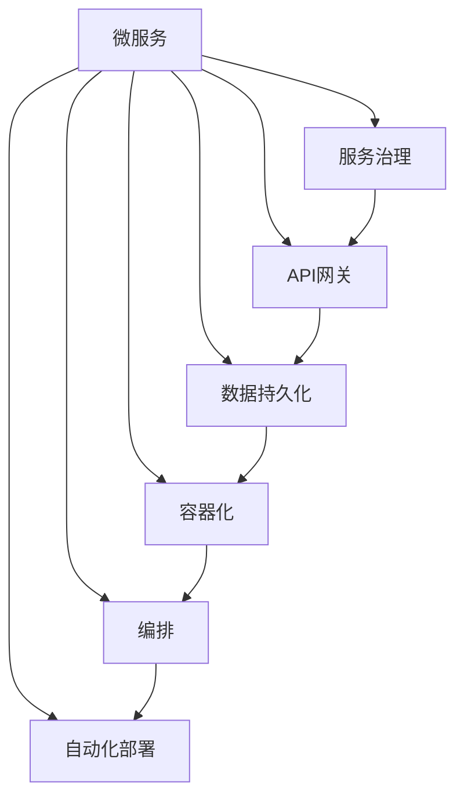

                 

# 微服务架构在高扩展性中的实例应用

## 1. 背景介绍

随着互联网和数字经济的发展，企业业务不断扩展，系统复杂度急剧增加，传统单块架构面临诸多挑战。微服务架构作为一种新兴的分布式架构，通过将应用拆分成多个独立的小服务，大幅提升了系统的扩展性、敏捷性和灵活性，成为当下软件开发的主流趋势。

微服务架构允许各个服务独立部署、独立扩展，适应企业业务场景的动态变化。系统可以动态调整服务数量和资源分配，确保高负载环境下的性能稳定和快速响应。然而，微服务架构也带来了新的问题，如服务通信复杂度提升、数据一致性维护困难、服务间依赖管理复杂等。本文将介绍微服务架构的基本概念、设计原则和应用实践，并结合实例，探讨微服务在高扩展性中的具体应用。

## 2. 核心概念与联系

### 2.1 核心概念概述

为更好地理解微服务架构，本节将介绍几个关键概念：

- **微服务（Microservices）**：将应用拆分成多个独立的小服务，每个服务负责特定的业务功能，并通过轻量级通信协议相互调用。
- **服务治理（Service Governance）**：通过集中管理服务，确保服务间的高可用性和一致性，包括服务注册、配置管理、负载均衡、故障恢复等功能。
- **API网关（API Gateway）**：作为服务的集中入口，统一处理请求路由、鉴权、限流等操作，简化服务间通信。
- **数据持久化（Data Persistence）**：为每个服务提供独立的数据库实例，确保数据独立性和高可用性，同时提升系统的扩展性。
- **容器化（Containerization）**：使用Docker等容器技术，将服务打包为可移植的镜像，简化部署和管理。
- **编排（Orchestration）**：使用Kubernetes等容器编排工具，自动化服务部署、扩展、监控和调度，提升系统的自动化水平。
- **自动化部署（Automated Deployment）**：通过持续集成/持续交付（CI/CD）流程，自动化构建、测试和部署，加快开发迭代速度。

这些概念之间的逻辑关系可以通过以下Mermaid流程图来展示：



这个流程图展示了一个典型的微服务架构系统组成，各个组件通过不同的方式协作，共同构建出高扩展性的系统。

## 3. 核心算法原理 & 具体操作步骤
### 3.1 算法原理概述

微服务架构的设计原理主要包括服务拆分、独立部署、动态扩展、服务发现和通信机制。

- **服务拆分**：将大型应用拆分为多个小服务，每个服务专注于特定的业务功能。服务之间通过API接口进行通信，提升系统的解耦度和灵活性。
- **独立部署**：每个服务可以独立开发、测试和部署，避免了单点故障和版本冲突，提高了系统的稳定性和可维护性。
- **动态扩展**：服务可以独立扩展，根据负载动态调整资源分配，确保系统的高可用性和高性能。
- **服务发现**：通过服务发现机制，服务能够动态注册和发现其他服务，确保通信的可靠性和高效性。
- **通信机制**：采用轻量级通信协议，如HTTP/REST、gRPC等，简化服务间通信，提升系统的可扩展性和性能。

### 3.2 算法步骤详解

微服务架构的实施步骤通常包括服务拆分、服务设计、服务部署和系统集成等环节。

**Step 1: 服务拆分**：
- 根据业务领域和功能模块，将大型应用拆分为多个独立的服务，每个服务承担具体的业务功能。
- 设计服务的接口和通信协议，确保服务的独立性和可复用性。

**Step 2: 服务设计**：
- 明确服务的边界和功能，编写接口规范和文档，指导服务的开发和测试。
- 考虑数据一致性和服务依赖，设计合理的数据存储和业务流程。

**Step 3: 服务部署**：
- 使用容器技术打包服务，生成可移植的镜像文件。
- 使用编排工具部署服务，自动化资源分配和管理。

**Step 4: 系统集成**：
- 搭建API网关，集中管理服务路由和鉴权。
- 设计服务发现机制，实现服务间的动态注册和发现。
- 实现分布式事务管理，确保数据一致性。

### 3.3 算法优缺点

微服务架构的优势包括：
1. 高扩展性：服务可以独立扩展，根据负载动态调整资源，提升系统的可用性和性能。
2. 独立部署：服务可以独立开发、测试和部署，降低了版本冲突的风险。
3. 灵活性：服务间通信简单，易于维护和扩展，提升系统的灵活性和适应性。

同时，微服务架构也存在一些缺点：
1. 服务通信复杂：服务间通信需要处理大量的请求和响应，增加了系统的复杂度和延迟。
2. 数据一致性维护困难：多服务环境下的数据一致性维护和事务管理更加复杂。
3. 服务间依赖管理复杂：服务间依赖关系需要明确和规范，否则容易产生网络效应和瓶颈。
4. 开发和维护成本高：微服务架构需要投入更多的开发和运维资源，增加了系统复杂度。

### 3.4 算法应用领域

微服务架构在多个领域得到了广泛应用，如电商、金融、社交、医疗等。以下列举几个典型的应用场景：

- **电商系统**：电商系统通常涉及多个业务模块，如商品管理、订单处理、支付结算等。通过微服务架构，可以将其拆分为多个独立的服务，提高系统的扩展性和稳定性。
- **金融系统**：金融系统需要处理大量的交易和数据，微服务架构可以确保各个模块的高可用性和独立性，提升系统的稳定性和安全性。
- **社交平台**：社交平台需要处理大量的用户交互和内容生成，微服务架构可以提升系统的灵活性和扩展性，支持复杂的社交功能。
- **医疗系统**：医疗系统需要处理大量的患者数据和诊疗信息，微服务架构可以提升系统的可靠性和可维护性，支持多医疗机构的数据共享和协同诊疗。

## 4. 数学模型和公式 & 详细讲解  
### 4.1 数学模型构建

微服务架构的数学模型主要涉及服务负载均衡、资源分配和调度优化等。

- **服务负载均衡**：假设系统中有$n$个服务实例，每个实例处理请求的概率相等。服务负载均衡的目标是最大化系统吞吐量。

- **资源分配**：假设每个服务需要$m$个计算资源，系统总资源为$R$。资源分配的目标是最大化系统吞吐量，同时保证服务的高可用性和性能。

- **调度优化**：假设每个服务需要$k$个计算资源，系统总资源为$R$。调度优化的目标是根据服务负载动态分配资源，提升系统的稳定性和性能。

### 4.2 公式推导过程

以下我们将通过简单的数学公式推导，阐述微服务架构的优化目标。

假设系统中有$n$个服务实例，每个实例的请求处理时间$T$服从指数分布，请求到达时间$D$服从泊松分布。

- **服务负载均衡**：服务负载均衡的目标是最大化系统吞吐量。吞吐量$Q$可以表示为服务实例数$n$和请求处理时间$T$的函数：

$$
Q = n \cdot \frac{1}{\lambda} = n \cdot \frac{1}{\mu}
$$

其中，$\lambda$为单位时间的请求到达率，$\mu$为请求处理时间。

- **资源分配**：资源分配的目标是最大化系统吞吐量，同时保证服务的高可用性和性能。假设每个服务需要$m$个计算资源，系统总资源为$R$。资源分配的目标可以表示为：

$$
\max_{n} Q \cdot \eta - C_n
$$

其中，$\eta$为资源利用率，$C_n$为服务实例数量$n$的固定成本。

- **调度优化**：调度优化的目标是根据服务负载动态分配资源，提升系统的稳定性和性能。假设每个服务需要$k$个计算资源，系统总资源为$R$。调度优化的目标可以表示为：

$$
\max_{\alpha} Q \cdot \eta - \alpha \cdot C
$$

其中，$\alpha$为资源分配比例，$C$为系统总资源。

### 4.3 案例分析与讲解

以下通过一个简单的电商系统示例，分析微服务架构的优化效果。

假设电商系统有$n$个商品服务实例，每个实例处理订单请求的时间服从指数分布。系统总资源为$R$，每个实例需要$m$个计算资源。

- **服务负载均衡**：通过调整服务实例数量$n$，可以最大化系统吞吐量$Q$。

$$
\max_{n} n \cdot \frac{1}{\lambda} = n \cdot \frac{1}{\mu}
$$

其中，$\lambda$为单位时间的订单到达率，$\mu$为订单处理时间。

- **资源分配**：通过调整服务实例数量$n$和资源分配比例$\alpha$，可以最大化系统吞吐量。

$$
\max_{n,\alpha} n \cdot \frac{1}{\lambda} \cdot \alpha - n \cdot m
$$

其中，$\alpha$为资源分配比例。

- **调度优化**：通过动态调整服务实例数量$n$和资源分配比例$\alpha$，可以提升系统吞吐量和稳定性。

$$
\max_{n,\alpha} n \cdot \frac{1}{\lambda} \cdot \alpha - n \cdot m
$$

其中，$\alpha$为资源分配比例。

## 5. 项目实践：代码实例和详细解释说明
### 5.1 开发环境搭建

在进行微服务架构的实践前，我们需要准备好开发环境。以下是使用Spring Boot和Docker搭建微服务架构的环境配置流程：

1. 安装Java和Maven：从官网下载并安装Java和Maven。

2. 创建Spring Boot项目：
```bash
mkdir my-service
cd my-service
mvn archetype:generate -DgroupId=com.example -DartifactId=my-service -DarchetypeArtifactId=maven-archetype-quickstart -DinteractiveMode=false
```

3. 配置Docker环境：安装Docker和Docker Compose。

4. 编写微服务代码：
```java
@SpringBootApplication
public class MyServiceApplication {
    public static void main(String[] args) {
        SpringApplication.run(MyServiceApplication.class, args);
    }
}
```

5. 编写Docker镜像文件：
```dockerfile
FROM openjdk:8
ADD target/my-service.jar /
ENTRYPOINT ["java", "-jar", "/my-service.jar"]
```

6. 编写Docker Compose文件：
```yaml
version: '3'
services:
  my-service:
    image: my-service:latest
    deploy:
      replicas: 3
    ports:
      - "8080:8080"
```

完成上述步骤后，即可在本地启动微服务架构的应用。

### 5.2 源代码详细实现

下面以电商系统中的商品服务为例，给出使用Spring Boot和Docker进行微服务架构开发的完整代码实现。

首先，定义商品服务的API接口和实现：

```java
@RestController
@RequestMapping("/api/products")
public class ProductController {
    @Autowired
    private ProductService productService;
    
    @GetMapping("/{id}")
    public ResponseEntity<Product> getProductById(@PathVariable Long id) {
        Product product = productService.findById(id);
        return ResponseEntity.ok(product);
    }
    
    @PostMapping
    public ResponseEntity<Product> addProduct(@RequestBody Product product) {
        Product savedProduct = productService.save(product);
        return ResponseEntity.ok(savedProduct);
    }
}
```

然后，定义商品服务的逻辑实现：

```java
@Service
public class ProductService {
    @Autowired
    private ProductRepository productRepository;
    
    public Product findById(Long id) {
        return productRepository.findById(id).orElse(null);
    }
    
    public Product save(Product product) {
        return productRepository.save(product);
    }
}
```

接着，定义商品服务的存储实现：

```java
@Repository
public interface ProductRepository extends JpaRepository<Product, Long> {
}
```

最后，编写Docker镜像文件和Docker Compose文件，并在项目根目录下运行Docker Compose启动微服务架构的应用：

```dockerfile
FROM openjdk:8
ADD target/my-service.jar /
ENTRYPOINT ["java", "-jar", "/my-service.jar"]
```

```yaml
version: '3'
services:
  my-service:
    image: my-service:latest
    deploy:
      replicas: 3
    ports:
      - "8080:8080"
```

```bash
docker-compose up
```

以上就是使用Spring Boot和Docker进行微服务架构开发的完整代码实现。可以看到，通过Spring Boot的微服务封装，我们能够快速搭建起微服务架构的应用。同时，通过Docker容器技术，能够实现服务的独立部署和管理，提升系统的扩展性和稳定性。

### 5.3 代码解读与分析

让我们再详细解读一下关键代码的实现细节：

**ProductController类**：
- `@RestController`注解：标记该类为RESTful控制器，使用`@RequestMapping`注解指定请求路径。
- `@Autowired`注解：自动注入依赖。
- `@GetMapping`注解：标记该方法为处理GET请求的接口。
- `@PostMapping`注解：标记该方法为处理POST请求的接口。

**ProductService类**：
- `@Service`注解：标记该类为Spring管理的服务，用于处理业务逻辑。
- `@Autowired`注解：自动注入依赖。
- `findById`方法：根据ID查找商品。
- `save`方法：保存商品。

**ProductRepository接口**：
- `@Repository`注解：标记该接口为Spring管理的仓库，用于数据访问。
- `extends JpaRepository`：继承JpaRepository接口，提供数据访问的CRUD方法。

通过这些代码，我们可以看到Spring Boot的微服务架构封装非常简洁高效，开发者只需关注核心业务逻辑的实现，而不必过多关注底层实现细节。同时，通过Docker容器技术，微服务架构的应用部署和管理变得更加灵活和自动化。

## 6. 实际应用场景

### 6.1 电商系统

电商系统通常涉及多个业务模块，如商品管理、订单处理、支付结算等。通过微服务架构，可以将其拆分为多个独立的服务，提高系统的扩展性和稳定性。

在电商系统中，商品服务负责处理商品的增删改查操作，通过Docker容器化技术，可以快速部署和扩展服务实例，确保系统的高可用性和性能。同时，通过Spring Boot的微服务封装，可以简化服务间通信，提升系统的灵活性和适应性。

### 6.2 金融系统

金融系统需要处理大量的交易和数据，微服务架构可以确保各个模块的高可用性和独立性，提升系统的稳定性和安全性。

在金融系统中，交易服务负责处理交易请求，通过Docker容器化技术，可以快速部署和扩展服务实例，确保系统的高可用性和性能。同时，通过Spring Boot的微服务封装，可以简化服务间通信，提升系统的灵活性和适应性。

### 6.3 社交平台

社交平台需要处理大量的用户交互和内容生成，微服务架构可以提升系统的灵活性和扩展性，支持复杂的社交功能。

在社交平台中，用户服务负责处理用户注册、登录、信息管理等操作，通过Docker容器化技术，可以快速部署和扩展服务实例，确保系统的高可用性和性能。同时，通过Spring Boot的微服务封装，可以简化服务间通信，提升系统的灵活性和适应性。

### 6.4 医疗系统

医疗系统需要处理大量的患者数据和诊疗信息，微服务架构可以提升系统的可靠性和可维护性，支持多医疗机构的数据共享和协同诊疗。

在医疗系统中，医生服务负责处理诊疗请求，通过Docker容器化技术，可以快速部署和扩展服务实例，确保系统的高可用性和性能。同时，通过Spring Boot的微服务封装，可以简化服务间通信，提升系统的灵活性和适应性。

## 7. 工具和资源推荐
### 7.1 学习资源推荐

为了帮助开发者系统掌握微服务架构的理论基础和实践技巧，这里推荐一些优质的学习资源：

1. **Spring Boot官方文档**：Spring Boot官方文档提供了详细的微服务开发指南和示例代码，是学习Spring Boot微服务架构的最佳资源。
2. **Spring Cloud官方文档**：Spring Cloud官方文档提供了Spring Cloud微服务架构的详细设计原理和实践指南，是学习Spring Cloud微服务架构的必备资源。
3. **Docker官方文档**：Docker官方文档提供了Docker容器技术的详细使用说明和最佳实践，是学习Docker容器技术的最佳资源。
4. **Kubernetes官方文档**：Kubernetes官方文档提供了Kubernetes容器编排技术的详细使用说明和最佳实践，是学习Kubernetes容器编排技术的必备资源。
5. **微服务架构设计指南**：这是一本系统介绍微服务架构设计原理和实践技巧的书籍，适合深入学习微服务架构的开发者阅读。

通过对这些资源的学习实践，相信你一定能够快速掌握微服务架构的精髓，并用于解决实际的业务问题。

### 7.2 开发工具推荐

高效的开发离不开优秀的工具支持。以下是几款用于微服务架构开发的常用工具：

1. **Spring Boot**：基于Spring框架的微服务开发框架，提供了丰富的功能和模块，适合快速开发微服务应用。
2. **Docker**：Docker容器技术可以封装应用和依赖，简化部署和管理，提升系统的扩展性和灵活性。
3. **Kubernetes**：Kubernetes容器编排工具可以自动化管理容器集群，提升系统的自动化水平和可维护性。
4. **Jenkins**：Jenkins持续集成/持续交付工具可以自动化构建、测试和部署，加速开发迭代速度。

合理利用这些工具，可以显著提升微服务架构的开发效率，加快创新迭代的步伐。

### 7.3 相关论文推荐

微服务架构的研究源于学界的持续研究。以下是几篇奠基性的相关论文，推荐阅读：

1. **《Microservices: A Definition and Terminology Guide》**：这篇文章由Martin Fowler提出微服务的定义和术语，是微服务架构理论的基石。
2. **《Designing Distributed Systems》**：这是一本详细介绍分布式系统设计的经典书籍，涵盖微服务架构的多个方面。
3. **《Microservices Patterns》**：这本书详细介绍了微服务架构的各种设计模式和最佳实践，是微服务架构学习的必备资源。
4. **《Building Microservices》**：这本书由Sam Newman撰写，详细介绍了微服务架构的设计原理和实践技巧，是微服务架构学习的最佳资源。
5. **《Designing Distributed Microservices with Spring Cloud》**：这篇文章详细介绍了使用Spring Cloud构建微服务架构的方法和最佳实践。

这些论文代表了大规模微服务架构的发展脉络。通过学习这些前沿成果，可以帮助研究者把握学科前进方向，激发更多的创新灵感。

## 8. 总结：未来发展趋势与挑战

### 8.1 总结

本文对微服务架构在高扩展性中的应用进行了全面系统的介绍。首先阐述了微服务架构的基本概念和设计原理，明确了微服务在提升系统扩展性、灵活性和可维护性方面的独特价值。其次，从原理到实践，详细讲解了微服务架构的数学模型和关键步骤，给出了微服务架构的完整代码实例。同时，本文还广泛探讨了微服务架构在电商、金融、社交、医疗等多个行业领域的应用前景，展示了微服务架构的巨大潜力。此外，本文精选了微服务架构的学习资源，力求为读者提供全方位的技术指引。

通过本文的系统梳理，可以看到，微服务架构在高扩展性方面的应用前景广阔，已经成为了当下软件开发的主流趋势。伴随微服务架构技术的不断演进，相信微服务架构必将在构建高可用性、高扩展性、高可靠性的分布式系统方面发挥重要作用，为数字化转型和智能化升级提供有力支持。

### 8.2 未来发展趋势

展望未来，微服务架构将呈现以下几个发展趋势：

1. **服务治理和编排的智能化**：随着微服务架构的普及，服务治理和编排将更加智能化，使用机器学习和人工智能技术自动调优资源分配，提升系统的性能和稳定性。
2. **服务间通信的优化**：微服务架构将更加注重服务间通信的优化，通过服务网格、API网关等技术，提升系统的高可用性和扩展性。
3. **容器化和Kubernetes的普及**：Docker容器化和Kubernetes编排将更加普及，提升系统的自动化水平和可维护性。
4. **微服务架构的安全性**：微服务架构将更加注重安全性，使用安全通信协议、访问控制等技术，保护系统的安全性和隐私。
5. **微服务架构的易用性**：微服务架构将更加注重易用性，使用服务发现、API网关等技术，简化服务间通信和管理，提升系统的可维护性。

以上趋势凸显了微服务架构在构建高可用性、高扩展性、高可靠性的分布式系统方面的广阔前景。这些方向的探索发展，必将进一步提升微服务架构的性能和应用范围，为数字化转型和智能化升级提供有力支持。

### 8.3 面临的挑战

尽管微服务架构已经取得了瞩目成就，但在迈向更加智能化、普适化应用的过程中，它仍面临着诸多挑战：

1. **服务间通信复杂**：微服务架构需要处理大量的服务间通信，增加了系统的复杂度和延迟。
2. **数据一致性维护困难**：多服务环境下的数据一致性维护和事务管理更加复杂。
3. **服务依赖管理复杂**：服务间依赖关系需要明确和规范，否则容易产生网络效应和瓶颈。
4. **开发和维护成本高**：微服务架构需要投入更多的开发和运维资源，增加了系统复杂度。

### 8.4 研究展望

面对微服务架构面临的这些挑战，未来的研究需要在以下几个方面寻求新的突破：

1. **优化服务间通信**：通过服务网格、API网关等技术，简化服务间通信，提升系统的灵活性和扩展性。
2. **提升数据一致性**：使用分布式事务、数据库事务、读写锁等技术，确保数据一致性和事务管理。
3. **简化服务依赖管理**：通过服务发现、API网关等技术，简化服务间依赖关系，提升系统的可维护性和可扩展性。
4. **提升开发和维护效率**：通过持续集成/持续交付、DevOps等技术，提升开发和运维效率，降低系统复杂度。

这些研究方向的探索，必将引领微服务架构技术迈向更高的台阶，为构建高可用性、高扩展性、高可靠性的分布式系统提供有力支持。面向未来，微服务架构还需要与其他人工智能技术进行更深入的融合，如大数据、机器学习、人工智能等，多路径协同发力，共同推动微服务架构技术的进步。只有勇于创新、敢于突破，才能不断拓展微服务架构的边界，让微服务架构技术更好地服务于数字化转型和智能化升级。

## 9. 附录：常见问题与解答

**Q1：微服务架构与单体架构的区别是什么？**

A: 微服务架构和单体架构的区别主要在于系统的拆分和独立部署。微服务架构将大型应用拆分为多个独立的小服务，每个服务专注于特定的业务功能，通过轻量级通信协议相互调用，实现解耦和独立部署。单体架构则是将整个应用作为一个整体，通过单一进程或线程实现，不同模块间存在紧密耦合和依赖。

**Q2：微服务架构的优点有哪些？**

A: 微服务架构的主要优点包括：
1. 高扩展性：服务可以独立扩展，根据负载动态调整资源分配，提升系统的可用性和性能。
2. 独立部署：服务可以独立开发、测试和部署，降低了版本冲突的风险。
3. 灵活性：服务间通信简单，易于维护和扩展，提升系统的灵活性和适应性。
4. 可维护性：服务可以独立维护和升级，降低了系统维护的复杂度和风险。

**Q3：微服务架构的缺点有哪些？**

A: 微服务架构的主要缺点包括：
1. 服务间通信复杂：服务间通信需要处理大量的请求和响应，增加了系统的复杂度和延迟。
2. 数据一致性维护困难：多服务环境下的数据一致性维护和事务管理更加复杂。
3. 服务依赖管理复杂：服务间依赖关系需要明确和规范，否则容易产生网络效应和瓶颈。
4. 开发和维护成本高：微服务架构需要投入更多的开发和运维资源，增加了系统复杂度。

**Q4：微服务架构如何处理服务间通信？**

A: 微服务架构主要通过轻量级通信协议，如HTTP/REST、gRPC等，简化服务间通信。服务间通信通常采用同步或异步方式，使用API网关等技术集中管理服务路由和鉴权。

**Q5：微服务架构如何保证服务的高可用性和性能？**

A: 微服务架构主要通过服务治理、服务发现、负载均衡等技术，保证服务的高可用性和性能。服务治理可以集中管理服务，确保服务间的高可用性和一致性。服务发现可以实时注册和发现服务，避免服务间通信故障。负载均衡可以动态调整服务实例数量和资源分配，提升系统的性能和稳定性。

通过本文的系统梳理，可以看到，微服务架构在高扩展性方面的应用前景广阔，已经成为了当下软件开发的主流趋势。伴随微服务架构技术的不断演进，相信微服务架构必将在构建高可用性、高扩展性、高可靠性的分布式系统方面发挥重要作用，为数字化转型和智能化升级提供有力支持。

