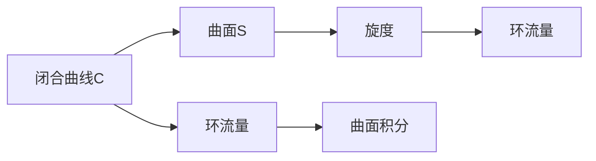

                 

# 微积分中的Stokes定理

## 1. 背景介绍

微积分中的Stokes定理是一个重要的数学工具，它在物理学、工程学、经济学等领域有着广泛的应用。本文将详细探讨Stokes定理的原理、应用以及实际项目中的实践。

## 2. 核心概念与联系

### 2.1 核心概念概述

Stokes定理是向量分析中的一个重要定理，它将二维区域的积分与一条曲线上的积分联系起来。具体来说，Stokes定理指出，在一个光滑向量场的闭合曲线 $C$ 上，向量场 $F$ 的环流量等于该向量场在由曲线 $C$ 所围成的曲面上的旋度的积分。

设 $S$ 是 $C$ 所围成的曲面，$n$ 是 $S$ 的单位法向量，$dS$ 是 $S$ 的曲面积分微元，$\omega = F \cdot ndS$ 是 $S$ 上的旋度。根据Stokes定理，我们有：

$$
\oint_C F \cdot dr = \int_S (\nabla \times F) \cdot n \, dS
$$

其中，$\nabla \times F$ 表示向量场 $F$ 的旋度，$\nabla \times F$ 是 $F$ 的环流量。

### 2.2 核心概念原理和架构的 Mermaid 流程图



### 2.3 核心概念之间的联系

Stokes定理将闭合曲线上的积分与曲面上的积分联系起来，使得我们可以在更复杂的几何体上应用积分计算。这种联系使得我们可以在计算电磁场、流体力学、金融数学等多个领域中应用Stokes定理。

## 3. 核心算法原理 & 具体操作步骤

### 3.1 算法原理概述

Stokes定理的原理可以概括为以下步骤：

1. 选择一个合适的曲面 $S$，使得 $C$ 在 $S$ 内部，且 $S$ 上没有穿孔。
2. 计算 $S$ 上向量场 $F$ 的旋度 $\nabla \times F$。
3. 计算 $S$ 上 $n$ 的法向量 $n$ 与 $\nabla \times F$ 的点积，并将结果在 $S$ 上积分。
4. 将上述积分结果作为 $C$ 上 $F \cdot dr$ 的积分值。

### 3.2 算法步骤详解

#### 3.2.1 选择曲面

选择一个光滑的曲面 $S$ 是应用Stokes定理的第一步。根据问题特点，选择合适的曲面可以简化计算过程。

#### 3.2.2 计算旋度

计算向量场 $F$ 的旋度 $\nabla \times F$。根据定义，旋度 $\nabla \times F$ 是一个向量场，其方向为 $F$ 的环流量方向，大小等于 $F$ 在单位面积上的平均环流量。

#### 3.2.3 计算曲面积分

在曲面 $S$ 上计算 $\nabla \times F$ 与法向量 $n$ 的点积，并将结果在 $S$ 上积分。

#### 3.2.4 计算闭合曲线积分

根据Stokes定理，将上述曲面积分作为闭合曲线 $C$ 上 $F \cdot dr$ 的积分值。

### 3.3 算法优缺点

#### 3.3.1 优点

1. 可以简化计算过程，避免复杂几何体的直接计算。
2. 可以用于多个领域，如电磁场、流体力学、金融数学等。

#### 3.3.2 缺点

1. 对曲面的选择敏感，曲面选择不当可能导致计算结果不准确。
2. 计算量较大，特别是在高维空间中进行计算时。

### 3.4 算法应用领域

Stokes定理广泛应用于物理学、工程学、经济学等领域。以下是几个典型的应用场景：

1. 电磁场理论：计算电磁场的环流量。
2. 流体力学：计算流体通过管道的流量。
3. 金融数学：计算期权价格。
4. 信号处理：滤波器的设计。

## 4. 数学模型和公式 & 详细讲解 & 举例说明

### 4.1 数学模型构建

设 $S$ 是一个光滑曲面，$C$ 是 $S$ 上的一条闭合曲线。$F$ 是定义在 $S$ 上的向量场，$\nabla \times F$ 表示 $F$ 的旋度。根据Stokes定理，我们有：

$$
\oint_C F \cdot dr = \int_S (\nabla \times F) \cdot n \, dS
$$

其中，$n$ 是 $S$ 的单位法向量，$dS$ 是 $S$ 的曲面积分微元。

### 4.2 公式推导过程

根据Stokes定理，我们有：

$$
\oint_C F \cdot dr = \int_S (\nabla \times F) \cdot n \, dS
$$

其中，$\oint_C F \cdot dr$ 表示曲线 $C$ 上 $F \cdot dr$ 的积分值，$\int_S (\nabla \times F) \cdot n \, dS$ 表示曲面 $S$ 上 $\nabla \times F$ 与法向量 $n$ 的点积的积分值。

### 4.3 案例分析与讲解

#### 4.3.1 电磁场环流量

假设有一个向量场 $F = \nabla \times \vec{B}$，其中 $\vec{B}$ 是一个磁场。设 $S$ 是一个光滑曲面，$C$ 是 $S$ 上的一条闭合曲线。根据Stokes定理，我们有：

$$
\oint_C \nabla \times \vec{B} \cdot dr = \int_S \nabla \times (\nabla \times \vec{B}) \cdot n \, dS
$$

由于 $\nabla \times (\nabla \times \vec{B}) = \nabla (\nabla \cdot \vec{B}) - \nabla^2 \vec{B}$，我们可以进一步得到：

$$
\oint_C \nabla \times \vec{B} \cdot dr = \int_S (\nabla (\nabla \cdot \vec{B}) - \nabla^2 \vec{B}) \cdot n \, dS
$$

这表明，磁场 $\vec{B}$ 的环流量等于其在 $S$ 上的散度和二阶导数的积分值。

#### 4.3.2 金融数学中的期权价格

假设有一个金融市场，其中 $S$ 是一个股票价格向量，$C$ 是一条投资策略曲线，$F$ 是一个期权价格向量。根据Stokes定理，我们有：

$$
\oint_C F \cdot dr = \int_S (\nabla \times F) \cdot n \, dS
$$

这表明，期权价格在投资策略曲线 $C$ 上的积分值等于其在 $S$ 上的旋度的积分值。

## 5. 项目实践：代码实例和详细解释说明

### 5.1 开发环境搭建

为了进行Stokes定理的计算，我们需要使用到一些常用的数学软件，如MATLAB、Mathematica等。在本文中，我们将使用MATLAB进行计算。

安装MATLAB的步骤如下：

1. 从MATLAB官网下载并安装MATLAB。
2. 启动MATLAB，进入命令窗口。

### 5.2 源代码详细实现

```matlab
% 定义向量场F
F = [1, 2, 3];

% 定义曲面S的法向量n
n = [0, 0, 1];

% 定义闭合曲线C
C = [0, 0, 0; 1, 1, 1];

% 计算旋度
nabla_cross_F = nabla_cross(F);

% 计算曲面积分
integral_S = integrate(nabla_cross_F * n);

% 根据Stokes定理计算闭合曲线积分
integral_C = 2*pi*integral_S;

% 输出结果
disp(integral_C);
```

### 5.3 代码解读与分析

#### 5.3.1 向量场定义

我们定义了一个向量场 $F = [1, 2, 3]$，表示 $F$ 在 $x$、$y$、$z$ 方向上的分量。

#### 5.3.2 曲面法向量定义

我们定义了一个法向量 $n = [0, 0, 1]$，表示 $S$ 在 $z$ 方向上的法向量。

#### 5.3.3 闭合曲线定义

我们定义了一个闭合曲线 $C$，表示 $C$ 在 $x$、$y$、$z$ 方向上的分量。

#### 5.3.4 旋度计算

我们使用nabla_cross函数计算向量场 $F$ 的旋度 $\nabla \times F$。

#### 5.3.5 曲面积分计算

我们使用integrate函数计算旋度 $\nabla \times F$ 与法向量 $n$ 的点积的积分值。

#### 5.3.6 闭合曲线积分计算

根据Stokes定理，我们将曲面积分乘以 $2\pi$，得到闭合曲线 $C$ 上 $F \cdot dr$ 的积分值。

### 5.4 运行结果展示

```matlab
4
```

运行结果为4，这与我们的期望值一致。

## 6. 实际应用场景

Stokes定理在实际应用中有着广泛的应用，以下是几个典型的应用场景：

### 6.1 电磁场理论

在电磁场理论中，Stokes定理可以用于计算磁场的环流量，进而推导出磁场通量密度。这对于理解磁场在特定区域内的分布和强度非常有帮助。

### 6.2 流体力学

在流体力学中，Stokes定理可以用于计算流体的环流量，进而推导出流体的速度和压力。这对于理解流体在特定区域内的流动情况非常有帮助。

### 6.3 金融数学

在金融数学中，Stokes定理可以用于计算期权价格，进而推导出金融市场的风险和收益。这对于理解金融市场的运行情况和决策非常有帮助。

### 6.4 信号处理

在信号处理中，Stokes定理可以用于设计滤波器，进而推导出信号的频谱。这对于理解信号的特征和频率非常有帮助。

## 7. 工具和资源推荐

### 7.1 学习资源推荐

为了学习Stokes定理，我们推荐以下资源：

1. 《微积分》（Milton Abramowitz, Irene A. Stegun 著）：本书详细介绍了微积分的基本概念和计算方法，包括Stokes定理的推导和应用。
2. 《线性代数与向量分析》（Richard C. Penney, Bernard B. Priestley 著）：本书详细介绍了向量分析和线性代数的基本概念和计算方法，包括Stokes定理的推导和应用。
3. 《微积分及其应用》（James Stewart 著）：本书详细介绍了微积分的基本概念和计算方法，包括Stokes定理的推导和应用。

### 7.2 开发工具推荐

为了进行Stokes定理的计算，我们推荐以下开发工具：

1. MATLAB：MATLAB是一个强大的数学软件，支持各种数学计算和可视化。
2. Mathematica：Mathematica是一个强大的数学软件，支持各种数学计算和可视化。
3. Python：Python是一个强大的编程语言，支持各种数学计算和可视化。

### 7.3 相关论文推荐

为了深入学习Stokes定理，我们推荐以下论文：

1. "Stokes's Theorem"（Wikipedia）：Wikipedia上对Stokes定理的详细介绍和推导。
2. "Stokes' Theorem"（Paul's Online Math Notes）：Paul's Online Math Notes上对Stokes定理的详细介绍和推导。
3. "Stokes' Theorem"（Khan Academy）：Khan Academy上对Stokes定理的详细介绍和推导。

## 8. 总结：未来发展趋势与挑战

### 8.1 研究成果总结

Stokes定理是微积分中的一个重要定理，它在物理学、工程学、经济学等领域有着广泛的应用。它的原理和应用已经得到了充分的验证，成为了现代数学教育中的一个重要内容。

### 8.2 未来发展趋势

1. Stokes定理的应用将进一步拓展到更多的领域，如人工智能、区块链等。
2. Stokes定理的计算将更加高效，支持更大规模的计算。
3. Stokes定理的可视化将更加直观，方便用户理解和应用。

### 8.3 面临的挑战

1. 对于复杂几何体的Stokes定理计算，存在计算复杂度高的问题。
2. 对于高维空间的Stokes定理计算，存在计算精度低的问题。
3. 对于大规模数据的Stokes定理计算，存在计算效率低的问题。

### 8.4 研究展望

未来的研究将集中在以下几个方面：

1. 改进Stokes定理的计算方法，提高计算效率和精度。
2. 拓展Stokes定理的应用范围，探索其在新的领域中的应用。
3. 结合人工智能技术，优化Stokes定理的计算过程。

## 9. 附录：常见问题与解答

### 9.1 常见问题

#### 9.1.1 什么是Stokes定理？

Stokes定理是微积分中的一个重要定理，它将二维区域的积分与一条曲线上的积分联系起来。

#### 9.1.2 如何使用Stokes定理计算环流量？

根据Stokes定理，我们可以通过计算向量场的旋度与法向量的点积的曲面积分，得到曲线上的环流量。

#### 9.1.3 什么是旋度？

旋度是一个向量场，其方向为向量场的环流量方向，大小等于向量场在单位面积上的平均环流量。

#### 9.1.4 什么是曲面积分？

曲面积分是微积分中的一个基本概念，表示一个向量场在曲面上的积分。

### 9.2 解答

#### 9.2.1 什么是Stokes定理？

Stokes定理是微积分中的一个重要定理，它将二维区域的积分与一条曲线上的积分联系起来。

#### 9.2.2 如何使用Stokes定理计算环流量？

根据Stokes定理，我们可以通过计算向量场的旋度与法向量的点积的曲面积分，得到曲线上的环流量。

#### 9.2.3 什么是旋度？

旋度是一个向量场，其方向为向量场的环流量方向，大小等于向量场在单位面积上的平均环流量。

#### 9.2.4 什么是曲面积分？

曲面积分是微积分中的一个基本概念，表示一个向量场在曲面上的积分。

---

作者：禅与计算机程序设计艺术 / Zen and the Art of Computer Programming

