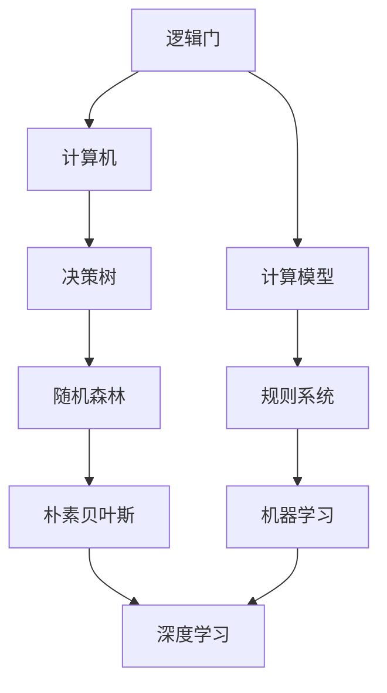

                 

## 1. 背景介绍

### 1.1 问题由来

在计算机科学和人工智能的历程中，从简单的逻辑门到复杂的深度神经网络，技术的进步展示了思想的演进。思想，作为驱动技术发展的核心力量，其形态从简单到复杂，逐渐塑造出今日的人工智能领域。这一过程，如同生物的进化，充满了偶然与必然，理性与启示。

### 1.2 问题核心关键点

思想的进化是计算机技术演进的重要主题。其核心关键点在于：

1. **计算范式的转变**：从早期的基于规则的系统到机器学习的模型，计算范式的发展极大地改变了技术的实现方式。
2. **数据的重要性**：数据不仅是训练模型的原料，也是技术演进的催化剂。
3. **算法的创新**：算法作为技术的心脏，其设计和改进驱动了思想的发展。
4. **硬件的突破**：从早期的电子管到现代的GPU，硬件的进步为思想的具体实现提供了支撑。
5. **理论与实践的结合**：理论的突破与实践的深入相互促进，推动了技术的发展。

## 2. 核心概念与联系

### 2.1 核心概念概述

理解思想的演进，需要先把握几个核心概念：

1. **简单逻辑门与复杂深度网络**：逻辑门是电子计算机的基础，而深度神经网络则是现代人工智能的核心。
2. **决策树与随机森林**：决策树通过树状结构进行决策，随机森林则是一种集成学习的方法。
3. **朴素贝叶斯与深度学习**：朴素贝叶斯是一种简单的贝叶斯分类方法，深度学习则是现代分类和回归的强大工具。
4. **规则系统与机器学习**：规则系统基于明确规则进行决策，而机器学习通过数据自动提取规则。
5. **计算机科学的基本理论**：如信息论、图灵机理论等，这些理论为计算机科学的发展提供了理论基础。

### 2.2 核心概念原理和架构的 Mermaid 流程图



### 2.3 核心概念联系

以上核心概念之间存在紧密的联系，如下所示：

1. 逻辑门作为计算机的基本组件，是构建计算模型的基础。
2. 决策树和随机森林是规则系统的扩展，通过集成多个规则提升准确性。
3. 朴素贝叶斯与深度学习都属于机器学习的范畴，但朴素贝叶斯简单直观，而深度学习则具有强大的表达能力。
4. 规则系统与机器学习相互补充，规则系统提供明确的决策逻辑，机器学习则通过数据挖掘发现更复杂的模式。

## 3. 核心算法原理 & 具体操作步骤

### 3.1 算法原理概述

思想的演进不仅体现在概念的转变，更体现在算法的进步。算法作为解决具体问题的工具，其原理和步骤构成了技术进化的核心。

算法通常分为三个阶段：数据预处理、模型训练和模型评估。数据预处理包括数据清洗、标准化等步骤；模型训练涉及选择合适的算法和参数，进行优化；模型评估则通过测试集验证模型性能。

### 3.2 算法步骤详解

以朴素贝叶斯分类器为例，其核心步骤如下：

1. **数据预处理**：将原始数据清洗、归一化，并分割为训练集和测试集。
2. **模型训练**：计算先验概率和条件概率，并使用贝叶斯公式计算后验概率。
3. **模型评估**：在测试集上评估模型准确率和召回率，分析模型性能。

具体代码实现如下：

```python
from sklearn.naive_bayes import GaussianNB
from sklearn.metrics import accuracy_score, precision_score, recall_score

# 加载数据
train_X, train_y, test_X, test_y = load_data()

# 创建朴素贝叶斯分类器
model = GaussianNB()

# 训练模型
model.fit(train_X, train_y)

# 预测测试集
pred_y = model.predict(test_X)

# 评估模型性能
acc = accuracy_score(test_y, pred_y)
precision = precision_score(test_y, pred_y)
recall = recall_score(test_y, pred_y)

print(f"Accuracy: {acc:.2f}, Precision: {precision:.2f}, Recall: {recall:.2f}")
```

### 3.3 算法优缺点

**优点**：

1. **高效性**：朴素贝叶斯分类器在处理大规模数据时效率高，适用于在线实时预测。
2. **可解释性**：模型结果易于理解，适用于解释性强的场景。
3. **无过拟合风险**：由于模型假设条件独立，减少过拟合风险。

**缺点**：

1. **假设过于简单**：朴素贝叶斯假设属性之间独立，可能导致性能下降。
2. **先验概率难以获取**：需要手动设定先验概率，否则模型效果不佳。
3. **对异常值敏感**：异常值可能严重影响模型结果。

### 3.4 算法应用领域

朴素贝叶斯分类器在多个领域都有广泛应用，包括：

1. **文本分类**：如垃圾邮件过滤、情感分析等。
2. **图像识别**：如手写数字识别、人脸识别等。
3. **推荐系统**：如协同过滤、基于内容的推荐等。
4. **金融风险评估**：如信用评分、欺诈检测等。
5. **生物信息学**：如基因序列分类、蛋白质结构预测等。

## 4. 数学模型和公式 & 详细讲解 & 举例说明

### 4.1 数学模型构建

朴素贝叶斯分类器基于贝叶斯定理，假设各属性之间条件独立，通过先验概率和条件概率计算后验概率，进而进行分类。

公式如下：

$$ P(C_i|X) = \frac{P(X|C_i)P(C_i)}{P(X)} = \frac{P(X|C_i)P(C_i)}{\sum_j P(X|C_j)P(C_j)} $$

其中，$P(C_i|X)$表示在已知数据$X$的条件下，类$C_i$的概率；$P(X|C_i)$表示在已知类$C_i$的条件下，数据$X$的概率；$P(C_i)$表示类$C_i$的先验概率。

### 4.2 公式推导过程

朴素贝叶斯的推导过程相对简单，主要涉及以下两个步骤：

1. **计算先验概率**：$P(C_i) = \frac{count(C_i)}{total_count}$，其中$count(C_i)$表示类$C_i$的样本数，$total_count$表示总样本数。
2. **计算条件概率**：$P(X|C_i) = \frac{count(X,C_i)}{count(C_i)}$，其中$count(X,C_i)$表示在类$C_i$中，数据$X$的样本数。

### 4.3 案例分析与讲解

以手写数字识别为例，假设有一个包含若干手写数字的图像数据集，每张图片被标记为0到9中的一个数字。

1. **数据预处理**：将图片转换为像素值向量，并进行归一化处理。
2. **模型训练**：计算每个数字类别的先验概率和条件概率。
3. **模型评估**：使用测试集评估模型准确率，调整参数以提高性能。

## 5. 项目实践：代码实例和详细解释说明

### 5.1 开发环境搭建

在开始项目实践前，需要先搭建开发环境。具体步骤如下：

1. **安装Python和相关库**：使用Anaconda安装Python，并安装必要的库，如scikit-learn、numpy等。
2. **创建虚拟环境**：使用conda创建虚拟环境，以避免环境污染。
3. **安装工具和框架**：安装TensorFlow、PyTorch等深度学习框架，以及相关的开发工具，如Jupyter Notebook、Git等。

### 5.2 源代码详细实现

以下是一个简单的朴素贝叶斯分类器实现示例：

```python
from sklearn.naive_bayes import GaussianNB
from sklearn.metrics import accuracy_score, precision_score, recall_score

# 加载数据
train_X, train_y, test_X, test_y = load_data()

# 创建朴素贝叶斯分类器
model = GaussianNB()

# 训练模型
model.fit(train_X, train_y)

# 预测测试集
pred_y = model.predict(test_X)

# 评估模型性能
acc = accuracy_score(test_y, pred_y)
precision = precision_score(test_y, pred_y)
recall = recall_score(test_y, pred_y)

print(f"Accuracy: {acc:.2f}, Precision: {precision:.2f}, Recall: {recall:.2f}")
```

### 5.3 代码解读与分析

**代码解读**：

1. **数据加载**：使用自定义函数`load_data`加载数据，包括训练集和测试集。
2. **模型创建**：创建朴素贝叶斯分类器对象。
3. **模型训练**：使用训练集数据训练模型。
4. **预测和评估**：使用测试集数据进行预测，并评估模型性能。

**分析**：

1. **数据预处理**：数据清洗和归一化是模型训练的前提。
2. **模型训练**：选择合适的算法和参数，使用训练集进行优化。
3. **模型评估**：通过测试集评估模型性能，调整参数以提高准确率。

## 6. 实际应用场景

### 6.1 金融风险评估

金融领域需要评估客户的信用风险，朴素贝叶斯分类器可以通过历史交易数据预测客户的违约概率。具体实现步骤如下：

1. **数据收集**：收集客户的历史交易数据、信用记录等信息。
2. **数据预处理**：对数据进行清洗、归一化等处理。
3. **模型训练**：使用朴素贝叶斯分类器训练模型，预测客户违约概率。
4. **模型评估**：在测试集上评估模型性能，调整参数以提高准确率。

### 6.2 医学诊断

医学领域需要根据患者的症状和历史数据诊断疾病，朴素贝叶斯分类器可以用于疾病的初步筛查。具体实现步骤如下：

1. **数据收集**：收集患者的症状、病历、实验室检查结果等信息。
2. **数据预处理**：对数据进行清洗、归一化等处理。
3. **模型训练**：使用朴素贝叶斯分类器训练模型，预测患者疾病类型。
4. **模型评估**：在测试集上评估模型性能，调整参数以提高准确率。

### 6.3 智能推荐

推荐系统需要根据用户的历史行为和兴趣，推荐商品或内容。朴素贝叶斯分类器可以用于分析用户行为，预测用户的兴趣偏好。具体实现步骤如下：

1. **数据收集**：收集用户的历史行为数据、商品或内容标签等信息。
2. **数据预处理**：对数据进行清洗、归一化等处理。
3. **模型训练**：使用朴素贝叶斯分类器训练模型，预测用户对商品或内容的偏好。
4. **模型评估**：在测试集上评估模型性能，调整参数以提高推荐效果。

## 7. 工具和资源推荐

### 7.1 学习资源推荐

1. **《Python机器学习》**：由Sebastian Raschka撰写，系统介绍了Python在机器学习中的应用，包括朴素贝叶斯分类器的实现。
2. **《Pattern Recognition and Machine Learning》**：由Christopher M. Bishop撰写，介绍了机器学习的基本概念和算法，包括朴素贝叶斯的详细推导。
3. **《Data Science for Business》**：由Foster Provost和Tom Fawcett撰写，介绍了数据科学在商业领域的应用，包括朴素贝叶斯的实际案例。
4. **Coursera上的机器学习课程**：由Andrew Ng教授主讲，介绍了机器学习的基本概念和算法，包括朴素贝叶斯的实现和应用。

### 7.2 开发工具推荐

1. **Jupyter Notebook**：基于Web的交互式开发环境，支持Python、R等多种编程语言。
2. **PyCharm**：强大的Python IDE，支持代码高亮、调试等功能。
3. **Anaconda**：基于Python的集成开发环境，支持多种数据科学库和工具。
4. **TensorFlow**：开源的深度学习框架，支持多种算法和模型。
5. **PyTorch**：开源的深度学习框架，支持动态图和静态图两种计算图。

### 7.3 相关论文推荐

1. **《A Tutorial on Probabilistic Machine Learning for Big Data》**：介绍了概率模型在大数据中的应用，包括朴素贝叶斯的详细推导和实现。
2. **《Bayesian Methods for Machine Learning》**：由Michael E. Tipping撰写，介绍了贝叶斯方法在机器学习中的应用，包括朴素贝叶斯的推导和优化。
3. **《Pattern Recognition and Machine Learning》**：由Christopher M. Bishop撰写，介绍了机器学习的基本概念和算法，包括朴素贝叶斯的详细推导和实现。
4. **《A Survey of Modern Probabilistic Machine Learning》**：由E.B. Sudderth等撰写，介绍了现代概率模型的应用，包括朴素贝叶斯的多维扩展和优化。

## 8. 总结：未来发展趋势与挑战

### 8.1 总结

本文详细介绍了思想的演进，从简单的逻辑门到复杂的深度网络，计算机技术的发展展示了思想的演进过程。通过朴素贝叶斯分类器的实现，展示了算法作为技术演进的核心力量。从概念的转变到算法的进步，技术的进步不仅仅体现在硬件和软件的进步，更体现在对问题理解的深入和解决方式的变化。

### 8.2 未来发展趋势

1. **算法的自动化**：未来，算法的设计和优化将更加自动化，通过机器学习优化算法参数，提升模型的性能。
2. **模型的跨领域应用**：模型将跨越不同的领域，实现跨领域的迁移学习，提升模型的泛化能力。
3. **算法的可解释性**：未来的算法将更加注重可解释性，通过模型解释技术，使模型的决策过程更加透明。
4. **模型的小型化**：随着硬件和算法的进步，模型将变得更加小型化，实现更高效的推理和计算。
5. **模型的自适应能力**：未来的模型将具备更强的自适应能力，能够根据环境变化自动调整参数，提高模型的鲁棒性。

### 8.3 面临的挑战

1. **数据的稀缺性**：随着数据量的增加，数据的收集和处理变得更加困难。
2. **模型的复杂性**：模型的复杂性增加，导致训练和推理过程变得复杂。
3. **算法的瓶颈**：算法的性能瓶颈可能限制模型的扩展能力。
4. **伦理和法律问题**：模型的应用可能涉及伦理和法律问题，需要更严格的规定和监管。
5. **安全性和隐私保护**：模型的应用可能涉及数据隐私和安全问题，需要更严格的保护措施。

### 8.4 研究展望

未来的研究需要在以下几个方面进行探索：

1. **自动化算法设计**：研究如何通过自动化算法设计，提升算法的性能和可解释性。
2. **跨领域模型的应用**：研究如何通过跨领域模型，提升模型的泛化能力。
3. **模型的自适应能力**：研究如何通过自适应模型，提升模型的鲁棒性。
4. **数据隐私和安全保护**：研究如何在保护数据隐私的前提下，实现模型的安全应用。
5. **算法的伦理和法律合规性**：研究如何在保证算法合规性的前提下，实现模型的公平性和透明性。

## 9. 附录：常见问题与解答

**Q1：朴素贝叶斯分类器适用于哪些类型的数据？**

A: 朴素贝叶斯分类器适用于具有离散或连续属性的数据，并且各属性之间条件独立。

**Q2：朴素贝叶斯分类器有哪些优点和缺点？**

A: 优点：模型简单、易于实现、计算速度快、适用于大规模数据。缺点：假设属性之间条件独立，可能限制模型性能。

**Q3：如何使用朴素贝叶斯分类器进行文本分类？**

A: 将文本转换为词袋模型，提取特征向量，然后使用朴素贝叶斯分类器进行分类。

**Q4：朴素贝叶斯分类器的先验概率和条件概率如何计算？**

A: 先验概率可以通过数据集中的样本数计算，条件概率可以通过在特定类别中，数据出现的次数计算。

**Q5：朴素贝叶斯分类器的优点是什么？**

A: 模型简单、易于实现、计算速度快、适用于大规模数据、适用于在线实时预测、可解释性强、无过拟合风险。

---

作者：禅与计算机程序设计艺术 / Zen and the Art of Computer Programming

