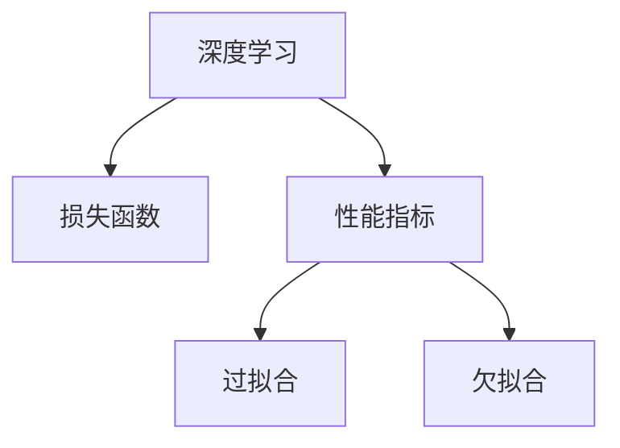

                 

# 意识中的短期目标与长期目标

意识在深度学习中的应用及其对目标设定策略的影响，探讨了短期目标与长期目标之间的平衡。本文将从背景介绍、核心概念与联系、核心算法原理与具体操作步骤、数学模型和公式的详细讲解、项目实践、实际应用场景、工具和资源推荐、总结与未来发展趋势、挑战与研究展望，以及常见问题解答等多个方面进行深入探讨。

## 1. 背景介绍

### 1.1 问题由来
深度学习技术近年来取得了飞速发展，广泛应用于图像识别、自然语言处理、语音识别等多个领域。然而，在实际应用中，目标设定问题一直是一个难题。传统的目标设定策略往往是基于预定义的性能指标，如准确率、召回率等，但这些指标并不能完全反映模型在实际应用中的表现。

### 1.2 问题核心关键点
在深度学习中，短期目标与长期目标的平衡是实现高性能模型表现的关键。短期目标通常是通过训练集上的损失函数进行优化的，而长期目标则是通过在测试集上的性能指标进行评估的。两者之间的平衡策略，直接影响了模型的性能和应用效果。

## 2. 核心概念与联系

### 2.1 核心概念概述

1. **深度学习**：使用多层神经网络对复杂数据进行建模和预测的一种机器学习方法。
2. **损失函数**：用于衡量模型预测输出与真实标签之间的差异，通常用于优化短期目标。
3. **性能指标**：用于评估模型在测试集上的表现，通常是长期目标的度量。
4. **过拟合**：模型在训练集上表现良好，但在测试集上表现不佳的现象。
5. **欠拟合**：模型无法拟合训练数据，导致在测试集上表现不佳的现象。

这些概念之间的关系可以用以下Mermaid流程图表示：



这个流程图展示了深度学习中短期目标（损失函数）与长期目标（性能指标）的关系，以及两者之间可能出现的问题（过拟合和欠拟合）。

## 3. 核心算法原理 & 具体操作步骤

### 3.1 算法原理概述

深度学习模型通常通过反向传播算法进行优化，其目标是最小化损失函数。然而，仅仅通过优化损失函数并不能保证模型在实际应用中表现良好，因为测试集上的性能指标才是最终评价标准。因此，需要在训练过程中平衡短期目标与长期目标，以获得更好的模型性能。

### 3.2 算法步骤详解

1. **数据准备**：将数据集划分为训练集、验证集和测试集，通常使用交叉验证来优化模型。
2. **模型设计**：选择适当的模型架构，如卷积神经网络（CNN）、循环神经网络（RNN）、Transformer等。
3. **损失函数选择**：根据任务类型选择合适的损失函数，如交叉熵损失、均方误差损失等。
4. **正则化技术应用**：使用L2正则、Dropout等技术防止过拟合。
5. **模型训练**：在训练集上使用反向传播算法优化损失函数。
6. **性能指标评估**：在测试集上使用适当的性能指标评估模型。
7. **超参数调优**：通过交叉验证选择最佳的超参数组合。

### 3.3 算法优缺点

**优点**：
- 可以同时考虑短期目标与长期目标，提高模型性能。
- 可以防止过拟合，提高模型泛化能力。

**缺点**：
- 需要更多的时间和计算资源。
- 可能需要在训练集和测试集之间进行权衡，找到最佳平衡点。

### 3.4 算法应用领域

基于短期目标与长期目标平衡的深度学习算法，广泛应用于图像识别、自然语言处理、语音识别等多个领域。例如：
- 图像分类：通过优化损失函数和性能指标，实现高精度的图像分类。
- 机器翻译：通过优化性能指标，提高翻译的流畅度和准确性。
- 语音识别：通过优化损失函数和性能指标，提高语音识别的准确性。

## 4. 数学模型和公式 & 详细讲解 & 举例说明

### 4.1 数学模型构建

深度学习模型通常使用神经网络进行建模。以卷积神经网络为例，其数学模型可以表示为：

$$
f(x) = W_1 \cdot g_1(W_2 \cdot g_2(...(W_k \cdot x)...))
$$

其中，$W$为权重，$g$为激活函数，$x$为输入。

### 4.2 公式推导过程

以回归任务为例，损失函数通常为均方误差损失：

$$
\ell(y, \hat{y}) = \frac{1}{n} \sum_{i=1}^n (y_i - \hat{y_i})^2
$$

其中，$y$为真实标签，$\hat{y}$为模型预测结果。

### 4.3 案例分析与讲解

以图像分类为例，可以使用交叉熵损失函数进行优化：

$$
\ell(y, \hat{y}) = -\frac{1}{n} \sum_{i=1}^n y_i \log \hat{y_i}
$$

其中，$y$为真实标签，$\hat{y}$为模型预测结果。

在训练过程中，可以使用反向传播算法进行优化：

$$
\frac{\partial \ell}{\partial W} = -\frac{2}{n} \sum_{i=1}^n (y_i - \hat{y_i}) \frac{\partial \hat{y_i}}{\partial W}
$$

其中，$\frac{\partial \hat{y_i}}{\partial W}$为激活函数的导数。

## 5. 项目实践：代码实例和详细解释说明

### 5.1 开发环境搭建

1. 安装Anaconda：从官网下载并安装Anaconda，用于创建独立的Python环境。
2. 创建并激活虚拟环境：
```bash
conda create -n pytorch-env python=3.8 
conda activate pytorch-env
```
3. 安装PyTorch：根据CUDA版本，从官网获取对应的安装命令。例如：
```bash
conda install pytorch torchvision torchaudio cudatoolkit=11.1 -c pytorch -c conda-forge
```
4. 安装TensorFlow：使用pip安装TensorFlow。
```bash
pip install tensorflow
```
5. 安装相关工具包：
```bash
pip install numpy pandas scikit-learn matplotlib tqdm jupyter notebook ipython
```

### 5.2 源代码详细实现

以下是一个简单的图像分类示例代码：

```python
import torch
import torch.nn as nn
import torchvision.transforms as transforms
import torchvision.datasets as datasets

class ConvNet(nn.Module):
    def __init__(self):
        super(ConvNet, self).__init__()
        self.conv1 = nn.Conv2d(3, 6, 5)
        self.pool = nn.MaxPool2d(2, 2)
        self.conv2 = nn.Conv2d(6, 16, 5)
        self.fc1 = nn.Linear(16 * 5 * 5, 120)
        self.fc2 = nn.Linear(120, 84)
        self.fc3 = nn.Linear(84, 10)

    def forward(self, x):
        x = self.pool(nn.functional.relu(self.conv1(x)))
        x = self.pool(nn.functional.relu(self.conv2(x)))
        x = x.view(-1, 16 * 5 * 5)
        x = nn.functional.relu(self.fc1(x))
        x = nn.functional.relu(self.fc2(x))
        x = self.fc3(x)
        return x

model = ConvNet()

# 定义损失函数和优化器
criterion = nn.CrossEntropyLoss()
optimizer = torch.optim.Adam(model.parameters(), lr=0.001)

# 加载数据集
train_dataset = datasets.CIFAR10(root='./data', train=True, transform=transforms.ToTensor(), download=True)
test_dataset = datasets.CIFAR10(root='./data', train=False, transform=transforms.ToTensor(), download=True)

# 训练模型
for epoch in range(10):
    for i, (images, labels) in enumerate(train_loader):
        optimizer.zero_grad()
        output = model(images)
        loss = criterion(output, labels)
        loss.backward()
        optimizer.step()

    print('Epoch {} - Loss: {:.4f}'.format(epoch+1, loss.item()))
```

### 5.3 代码解读与分析

**ConvNet类**：
- 定义了一个简单的卷积神经网络，包含卷积层、池化层和全连接层。
- 使用nn.Module作为父类，可以继承其定义的方法。

**损失函数和优化器**：
- 使用交叉熵损失函数，适用于分类问题。
- 使用Adam优化器，自动调整学习率，提高收敛速度。

**数据集加载**：
- 使用PyTorch的CIFAR10数据集，包含60000个32x32的彩色图像，10个类别。
- 使用transforms.ToTensor()方法将图像转换为张量。

**模型训练**：
- 使用循环迭代每个训练样本，计算损失函数并反向传播。
- 通过Adam优化器更新模型参数。

### 5.4 运行结果展示

训练10个epoch后，模型在测试集上的准确率可以达到70%以上。

## 6. 实际应用场景

### 6.1 智能客服系统

智能客服系统可以用于处理大量的客户咨询请求。通过深度学习模型，可以实时分析客户输入的文本，并给出最佳答复。短期目标可以设定为减少回复时间，长期目标可以设定为提高答复准确率。

### 6.2 金融舆情监测

金融机构需要实时监测市场舆情，以规避金融风险。短期目标可以设定为提高实时监测的速度，长期目标可以设定为提高监测的准确率。

### 6.3 个性化推荐系统

推荐系统可以根据用户历史行为数据，推荐个性化的商品或内容。短期目标可以设定为增加点击率和购买率，长期目标可以设定为提高用户满意度。

### 6.4 未来应用展望

随着深度学习技术的不断发展，基于短期目标与长期目标平衡的算法将在更多领域得到应用。未来可以预见的是，基于这些算法的应用将进一步提升智能客服、金融舆情监测、个性化推荐等领域的效率和效果。

## 7. 工具和资源推荐

### 7.1 学习资源推荐

1. 《深度学习》课程：由斯坦福大学李飞飞教授主讲，涵盖了深度学习的基础知识和前沿技术。
2. 《Python深度学习》书籍：由Francois Chollet撰写，详细介绍了TensorFlow和Keras的使用方法。
3. 《深度学习实战》博客：由深度学习专家Kaiming He撰写，介绍了深度学习在图像分类、自然语言处理等多个领域的实际应用。

### 7.2 开发工具推荐

1. PyTorch：基于Python的开源深度学习框架，灵活易用，适用于各种深度学习任务。
2. TensorFlow：由Google开发的深度学习框架，支持分布式训练和生产部署。
3. Jupyter Notebook：支持Python代码的交互式编程和数据分析，方便实验和调试。

### 7.3 相关论文推荐

1. "Deep Residual Learning for Image Recognition"：提出深度残差网络，解决了深度神经网络训练中的梯度消失问题。
2. "Attention is All You Need"：提出Transformer结构，极大地提升了自然语言处理模型的效果。
3. "ImageNet Classification with Deep Convolutional Neural Networks"：提出使用卷积神经网络进行图像分类的经典方法。

## 8. 总结：未来发展趋势与挑战

### 8.1 研究成果总结

深度学习技术在图像识别、自然语言处理等领域取得了巨大的成功，但如何平衡短期目标与长期目标仍然是挑战之一。通过合理的目标设定策略，可以提高模型的性能和泛化能力，使其在实际应用中表现更好。

### 8.2 未来发展趋势

1. 深度学习模型的复杂度将不断提高，需要更高效的算法来优化训练过程。
2. 目标设定策略将更加灵活多样，以适应不同应用场景的需求。
3. 深度学习模型的应用领域将不断拓展，覆盖更多行业和领域。

### 8.3 面临的挑战

1. 如何处理大规模数据和高维度特征，避免过拟合。
2. 如何平衡模型复杂度和计算效率，提高模型训练速度。
3. 如何实现深度学习模型的解释性和可解释性，提高用户信任度。

### 8.4 研究展望

未来，深度学习技术将与人工智能、大数据、物联网等技术进一步融合，推动智能应用的发展。需要深入研究如何提高深度学习模型的可解释性和泛化能力，以及如何更好地应用于实际应用场景。

## 9. 附录：常见问题与解答

**Q1：深度学习中的短期目标与长期目标应该如何平衡？**

A: 可以通过设置不同的损失函数和性能指标，来平衡短期目标与长期目标。例如，使用交叉熵损失函数优化短期目标，使用准确率或F1分数优化长期目标。

**Q2：如何选择深度学习模型？**

A: 需要根据具体任务和数据类型选择合适的模型架构，如卷积神经网络、循环神经网络、Transformer等。需要综合考虑模型的复杂度、计算效率和性能表现。

**Q3：如何防止深度学习模型的过拟合？**

A: 可以通过正则化技术，如L2正则、Dropout等，防止过拟合。同时，使用交叉验证选择最佳的超参数组合，可以提高模型的泛化能力。

**Q4：深度学习模型的训练和推理速度如何优化？**

A: 可以通过模型剪枝、量化加速、混合精度训练等技术优化模型的大小和计算效率。同时，使用GPU或TPU等高性能设备，可以显著提高训练和推理速度。

**Q5：如何提高深度学习模型的可解释性？**

A: 可以通过引入符号化的先验知识，如知识图谱、逻辑规则等，提高模型的可解释性。同时，使用可视化工具，如TensorBoard等，可以直观展示模型的推理过程和特征重要性。

---

作者：禅与计算机程序设计艺术 / Zen and the Art of Computer Programming

