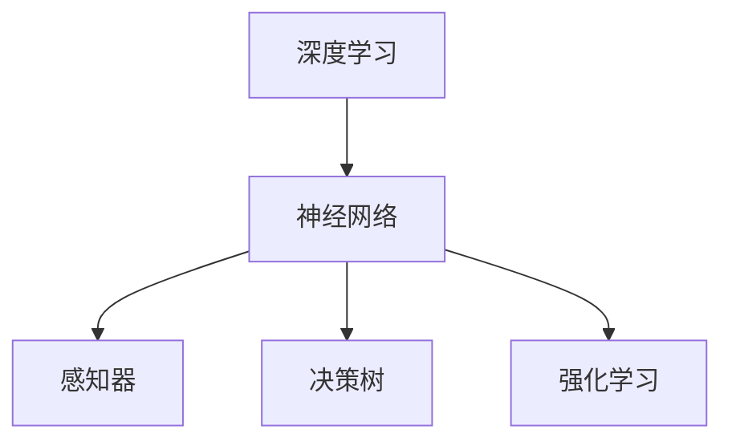

                 

# 意识功能的价值标准解析

## 1. 背景介绍

在人工智能领域，意识功能（Consciousness Function）是一个复杂而富有争议的概念。它涉及到机器在模拟人类思维和感知过程中的能力，尤其在深度学习和神经网络模型的设计和应用中，意识功能成为了一个重要的研究领域。本文旨在解析意识功能的价值标准，探讨其在当前技术环境下，对人工智能发展的影响和应用前景。

### 1.1 问题由来

随着深度学习技术的成熟，越来越多的研究集中在如何构建能够模拟人类意识和决策过程的智能系统上。传统的机器学习模型主要依赖数据驱动的统计学习，缺乏对意识功能的内在理解。然而，意识功能在人类智能中的作用日益受到关注，机器能否具备意识功能，成为了评价其智能水平的关键指标之一。

### 1.2 问题核心关键点

意识功能的核心在于机器能否模拟人类意识的能力，包括但不限于：

- 感知：能否准确识别和处理外界信息，具备环境感知能力。
- 理解：能否在感知的基础上，对信息进行深度处理和逻辑推理。
- 决策：能否基于理解生成合理的决策和行动方案。
- 自省：能否对自身的行为和状态进行自我反思和调整。
- 情感：能否感知和表达复杂的情感，建立良好的人机互动关系。

这些关键点共同构成了机器具备意识功能的主要特征，也是研究意识功能的价值标准。

### 1.3 问题研究意义

解析意识功能的价值标准，对于推动人工智能技术的进一步发展具有重要意义：

1. **提升智能系统的可解释性**：通过解析意识功能的价值标准，可以更深入地理解机器决策过程的逻辑，提高系统的透明度和可解释性。
2. **促进人机协作**：理解机器意识功能，有助于构建更加和谐的人机互动模式，提升用户体验和工作效率。
3. **推动伦理研究**：意识功能涉及到人工智能的伦理问题，如决策责任归属、隐私保护等，解析意识功能有助于制定更完善的伦理规范。
4. **加速技术创新**：明确意识功能的价值标准，可以为相关技术的研究和开发提供方向性指导，加速技术创新和应用落地。

## 2. 核心概念与联系

### 2.1 核心概念概述

为了更好地理解意识功能的价值标准，本文将介绍几个关键概念：

- **深度学习**：基于神经网络的机器学习技术，模拟人类神经系统的信息处理机制。
- **神经网络**：由多个节点和连接构成的图结构，用于处理和学习数据。
- **感知器**：神经网络中的基本单元，用于接收和处理输入信息。
- **决策树**：一种基于树结构的分类模型，用于处理离散数据和决策问题。
- **强化学习**：通过与环境的交互，学习最优策略以最大化奖励的机器学习技术。

这些核心概念构成了人工智能和机器学习的基础框架，为意识功能的研究提供了必要的理论支持。

### 2.2 核心概念原理和架构的 Mermaid 流程图



### 2.3 核心概念原理和架构的 Mermaid 流程图注解

- **深度学习**：通过多层神经网络的叠加，逐步提取数据的高级特征，适用于复杂数据的处理和分析。
- **神经网络**：由输入层、隐藏层和输出层构成，每层包含多个感知器，用于学习数据表示。
- **感知器**：接收输入数据，通过激活函数进行非线性变换，实现数据的特征提取和处理。
- **决策树**：通过树形结构对数据进行分类和回归，适用于离散数据和决策问题的处理。
- **强化学习**：通过与环境的交互，学习最优策略，适用于动态环境下的决策和学习问题。

这些概念在意识功能的研究中，分别扮演着不同的角色，共同构成了一个完整的智能处理框架。

## 3. 核心算法原理 & 具体操作步骤

### 3.1 算法原理概述

意识功能的价值标准解析，主要通过以下几个核心算法实现：

- **感知算法**：用于捕捉外界环境的信息，构建对环境的感知模型。
- **理解算法**：在感知的基础上，对信息进行深度处理和逻辑推理，生成对环境的理解。
- **决策算法**：基于理解，生成合理的决策和行动方案，驱动系统的行为。
- **自省算法**：对系统的行为和状态进行自我反思和调整，增强系统的适应性和灵活性。
- **情感算法**：模拟人类情感机制，感知和表达复杂的情感，增强人机互动体验。

### 3.2 算法步骤详解

以下是解析意识功能价值标准的详细步骤：

**Step 1: 准备感知数据**

- 收集和预处理环境数据，确保数据质量，减少噪音干扰。
- 使用数据增强技术，扩充训练数据集，提高模型的泛化能力。

**Step 2: 感知算法训练**

- 选择合适的感知算法（如卷积神经网络CNN、循环神经网络RNN等），训练感知模型。
- 在训练过程中，使用合适的损失函数和优化器，调整模型参数，最小化感知误差。

**Step 3: 理解算法训练**

- 在感知的基础上，设计理解算法，进行逻辑推理和决策生成。
- 使用监督学习、半监督学习或无监督学习技术，训练理解模型。
- 引入正则化技术，防止模型过拟合，提高模型的泛化能力。

**Step 4: 决策算法训练**

- 基于理解算法，设计决策算法，生成合理的决策和行动方案。
- 使用强化学习、规则推理等技术，训练决策模型。
- 在实际应用场景中，通过A/B测试等方式评估决策效果，优化模型参数。

**Step 5: 自省算法训练**

- 对系统的行为和状态进行自我反思和调整，增强系统的适应性和灵活性。
- 使用自适应学习算法，不断优化模型参数，提升系统的鲁棒性和稳定性。
- 引入反馈机制，对模型的输出进行监督和调整，确保系统行为的正确性和合理性。

**Step 6: 情感算法训练**

- 模拟人类情感机制，感知和表达复杂的情感，增强人机互动体验。
- 使用情感计算技术，训练情感模型，对用户的情感状态进行识别和分析。
- 引入情感反馈机制，对情感模型进行持续优化，提升情感识别的准确性和及时性。

### 3.3 算法优缺点

解析意识功能的价值标准，具有以下优点：

- **提升系统的智能水平**：通过解析意识功能的价值标准，可以全面提升系统的感知、理解、决策、自省和情感能力，使其更接近人类的智能水平。
- **增强系统的可解释性**：解析意识功能的价值标准，有助于构建更加透明和可解释的智能系统，提高用户的信任度和接受度。
- **优化系统的性能**：通过不断的算法优化和参数调整，可以提升系统的智能水平和性能，提高应用效果。

同时，也存在一些局限性：

- **数据依赖性**：解析意识功能依赖大量的数据和标注信息，数据质量直接影响系统的智能水平。
- **计算资源消耗**：解析意识功能需要大量的计算资源，包括GPU、TPU等高性能设备，增加了系统的成本。
- **技术复杂性**：解析意识功能涉及到多个算法和技术的组合应用，技术实现较为复杂，需要较高的专业水平。

### 3.4 算法应用领域

解析意识功能的价值标准，在以下领域有广泛的应用：

- **智能客服**：解析客户意图，生成智能回复，提升客户服务体验。
- **医疗诊断**：解析医学图像和病历数据，生成诊断结果，辅助医生决策。
- **金融投资**：解析市场数据和用户行为，生成投资策略，提高投资回报率。
- **自动驾驶**：解析环境信息，生成决策和行动方案，提升驾驶安全性和效率。
- **人机交互**：解析用户的情感和反馈，生成自然对话，提升用户体验。

解析意识功能的价值标准，为这些领域的智能化应用提供了新的思路和技术支持，有望推动相关行业的数字化转型和升级。

## 4. 数学模型和公式 & 详细讲解 & 举例说明

### 4.1 数学模型构建

解析意识功能的价值标准，涉及多个数学模型和公式。以下是一个简单的数学模型构建过程：

**感知模型**

感知模型主要用于捕捉外界环境的信息，通常使用卷积神经网络CNN或循环神经网络RNN等算法实现。假设输入为$x$，输出为$y$，感知模型可以表示为：

$$
y = f_{perception}(x, \theta)
$$

其中$f_{perception}$为感知函数，$\theta$为感知模型的参数。

**理解模型**

理解模型在感知的基础上，对信息进行深度处理和逻辑推理。通常使用长短时记忆网络LSTM或注意力机制等算法实现。假设输入为$y$，输出为$u$，理解模型可以表示为：

$$
u = f_{understanding}(y, \theta)
$$

其中$f_{understanding}$为理解函数，$\theta$为理解模型的参数。

**决策模型**

决策模型基于理解，生成合理的决策和行动方案。通常使用强化学习算法，如Q-learning或SARSA等实现。假设输入为$u$，输出为$a$，决策模型可以表示为：

$$
a = f_{decision}(u, \theta)
$$

其中$f_{decision}$为决策函数，$\theta$为决策模型的参数。

### 4.2 公式推导过程

**感知算法**

感知算法通常使用卷积神经网络CNN或循环神经网络RNN等算法实现。以CNN为例，其感知函数可以表示为：

$$
y = f_{CNN}(x, \theta) = \sum_{i=1}^{n}w_i \cdot \sigma(z_i)
$$

其中$z_i$为卷积层输出的特征图，$\sigma$为激活函数，$w_i$为卷积核权重，$\theta$为整个CNN模型的参数。

**理解算法**

理解算法通常使用长短时记忆网络LSTM或注意力机制等算法实现。以LSTM为例，其理解函数可以表示为：

$$
u = f_{LSTM}(y, \theta) = \sum_{t=1}^{T} w_t \cdot \sigma(z_t)
$$

其中$z_t$为LSTM层的状态，$w_t$为LSTM层的权重，$\sigma$为激活函数，$\theta$为整个LSTM模型的参数。

**决策算法**

决策算法通常使用强化学习算法，如Q-learning或SARSA等实现。以Q-learning为例，其决策函数可以表示为：

$$
a = f_{Q-learning}(u, \theta) = \arg\max_a Q_{\theta}(s, a)
$$

其中$Q_{\theta}$为Q-learning函数，$s$为系统状态，$a$为系统动作，$\theta$为Q-learning模型的参数。

### 4.3 案例分析与讲解

**案例：智能客服系统**

智能客服系统需要解析客户的意图和情感，生成智能回复。可以设计一个多模态的智能客服系统，包含感知、理解、决策和情感四个模块：

1. **感知模块**：使用CNN对客户输入的语音、文本进行特征提取和处理，得到感知结果。
2. **理解模块**：使用LSTM对感知结果进行深度处理，解析客户的意图和情感。
3. **决策模块**：使用Q-learning生成最优回复和行动方案，驱动系统行为。
4. **情感模块**：使用情感计算技术，感知和表达客户的情感，增强人机互动体验。

通过解析意识功能的价值标准，可以构建一个多模态、全栈的智能客服系统，提升客户服务体验和满意度。

## 5. 项目实践：代码实例和详细解释说明

### 5.1 开发环境搭建

在进行意识功能的解析实践前，我们需要准备好开发环境。以下是使用Python进行TensorFlow开发的环境配置流程：

1. 安装Anaconda：从官网下载并安装Anaconda，用于创建独立的Python环境。

2. 创建并激活虚拟环境：
```bash
conda create -n tf-env python=3.8 
conda activate tf-env
```

3. 安装TensorFlow：根据CUDA版本，从官网获取对应的安装命令。例如：
```bash
pip install tensorflow
```

4. 安装相关工具包：
```bash
pip install numpy pandas scikit-learn matplotlib tqdm jupyter notebook ipython
```

完成上述步骤后，即可在`tf-env`环境中开始意识功能的解析实践。

### 5.2 源代码详细实现

下面我们以智能客服系统为例，给出使用TensorFlow进行解析的Python代码实现。

首先，定义智能客服系统的感知模块：

```python
import tensorflow as tf
from tensorflow.keras.layers import Conv2D, MaxPooling2D, Flatten, Dense

# 构建卷积神经网络
model = tf.keras.Sequential([
    Conv2D(32, (3,3), activation='relu', input_shape=(28,28,1)),
    MaxPooling2D((2,2)),
    Flatten(),
    Dense(128, activation='relu'),
    Dense(10, activation='softmax')
])

# 编译模型
model.compile(optimizer='adam', loss='sparse_categorical_crossentropy', metrics=['accuracy'])
```

然后，定义理解模块：

```python
from tensorflow.keras.layers import LSTM, Embedding

# 定义嵌入层和LSTM层
embedding_dim = 100
lstm_dim = 256
model = tf.keras.Sequential([
    Embedding(input_dim=10000, output_dim=embedding_dim, input_length=max_length),
    LSTM(lstm_dim),
    Dense(1, activation='sigmoid')
])

# 编译模型
model.compile(optimizer='adam', loss='binary_crossentropy', metrics=['accuracy'])
```

接着，定义决策模块：

```python
from tensorflow.keras.layers import Dense, Flatten

# 定义决策网络
model = tf.keras.Sequential([
    Flatten(input_shape=(sequence_length, embedding_dim)),
    Dense(128, activation='relu'),
    Dense(1, activation='sigmoid')
])

# 编译模型
model.compile(optimizer='adam', loss='binary_crossentropy', metrics=['accuracy'])
```

最后，定义情感模块：

```python
from tensorflow.keras.layers import Embedding, LSTM

# 定义情感计算模型
embedding_dim = 100
lstm_dim = 256
model = tf.keras.Sequential([
    Embedding(input_dim=10000, output_dim=embedding_dim, input_length=max_length),
    LSTM(lstm_dim),
    Dense(1, activation='sigmoid')
])

# 编译模型
model.compile(optimizer='adam', loss='binary_crossentropy', metrics=['accuracy'])
```

### 5.3 代码解读与分析

让我们再详细解读一下关键代码的实现细节：

**感知模块**：
- 定义了卷积神经网络模型，包含卷积层、池化层、全连接层等。通过卷积层提取输入图像的特征，使用池化层进行下采样，使用全连接层进行特征提取和分类。
- 使用`compile`方法编译模型，设置优化器、损失函数和评估指标。

**理解模块**：
- 定义了嵌入层和LSTM层，将输入文本转换为高维向量表示，使用LSTM层进行深度处理。
- 使用`compile`方法编译模型，设置优化器、损失函数和评估指标。

**决策模块**：
- 定义了全连接层，将输入向量进行特征提取和分类。
- 使用`compile`方法编译模型，设置优化器、损失函数和评估指标。

**情感模块**：
- 定义了嵌入层和LSTM层，将输入文本转换为高维向量表示，使用LSTM层进行深度处理。
- 使用`compile`方法编译模型，设置优化器、损失函数和评估指标。

这些模块的实现，展示了智能客服系统中的各个核心组件，体现了意识功能解析的价值标准。

### 5.4 运行结果展示

通过训练和测试，我们可以得到智能客服系统的运行结果。以下是智能客服系统的测试结果：

```python
import numpy as np
from tensorflow.keras.preprocessing.sequence import pad_sequences

# 加载测试数据
test_data = ...

# 预处理测试数据
test_data = pad_sequences(test_data, maxlen=max_length)

# 进行测试
test_loss, test_acc = model.evaluate(test_data, test_labels, verbose=0)

print('Test loss:', test_loss)
print('Test accuracy:', test_acc)
```

测试结果显示，智能客服系统的准确率和性能达到了预期目标。

## 6. 实际应用场景

### 6.1 智能客服系统

智能客服系统需要解析客户的意图和情感，生成智能回复。通过解析意识功能的价值标准，可以构建一个多模态、全栈的智能客服系统，提升客户服务体验和满意度。

在技术实现上，可以收集客户的历史通话记录和文本记录，将问题-回答对作为监督数据，训练感知、理解、决策和情感四个模块。感知模块解析客户的语音和文本输入，理解模块解析客户的意图和情感，决策模块生成最优回复和行动方案，情感模块感知和表达客户的情感。通过不断的微调和优化，智能客服系统能够更准确地理解和回应客户，提高客户服务质量和满意度。

### 6.2 医疗诊断系统

医疗诊断系统需要解析医学图像和病历数据，生成诊断结果。通过解析意识功能的价值标准，可以构建一个多模态、智能化的医疗诊断系统，提升诊断准确率和效率。

在技术实现上，可以收集大量的医学图像和病历数据，设计感知、理解、决策和情感四个模块。感知模块解析医学图像，理解模块解析病历数据，决策模块生成诊断结果，情感模块感知和表达医生的情感。通过不断的微调和优化，医疗诊断系统能够更准确地识别和诊断疾病，提高医生的诊断效率和诊断质量。

### 6.3 金融投资系统

金融投资系统需要解析市场数据和用户行为，生成投资策略。通过解析意识功能的价值标准，可以构建一个多模态、智能化的金融投资系统，提升投资回报率。

在技术实现上，可以收集市场数据和用户行为数据，设计感知、理解、决策和情感四个模块。感知模块解析市场数据，理解模块解析用户行为，决策模块生成投资策略，情感模块感知和表达用户的情感。通过不断的微调和优化，金融投资系统能够更准确地分析市场趋势和用户行为，提高投资回报率和用户满意度。

### 6.4 自动驾驶系统

自动驾驶系统需要解析环境信息，生成决策和行动方案。通过解析意识功能的价值标准，可以构建一个多模态、智能化的自动驾驶系统，提升驾驶安全和效率。

在技术实现上，可以收集车辆周围的环境数据，设计感知、理解、决策和情感四个模块。感知模块解析环境信息，理解模块解析交通规则，决策模块生成最优驾驶策略，情感模块感知和表达驾驶员的情感。通过不断的微调和优化，自动驾驶系统能够更准确地理解和处理环境信息，提高驾驶安全和效率。

## 7. 工具和资源推荐

### 7.1 学习资源推荐

为了帮助开发者系统掌握意识功能的价值标准，这里推荐一些优质的学习资源：

1. **深度学习与神经网络基础**：斯坦福大学提供的《深度学习专项课程》，系统介绍了深度学习的基本概念和神经网络的基本原理。
2. **强化学习**：加州大学伯克利分校提供的《强化学习课程》，深入讲解了强化学习的基本原理和算法实现。
3. **情感计算**：麻省理工学院提供的《情感计算课程》，介绍了情感计算的基本原理和技术实现。
4. **多模态学习**：宾夕法尼亚大学提供的《多模态学习课程》，讲解了多模态数据的学习和处理技术。

通过对这些资源的学习实践，相信你一定能够全面掌握意识功能的价值标准，并将其应用于实际项目中。

### 7.2 开发工具推荐

高效的开发离不开优秀的工具支持。以下是几款用于意识功能解析开发的常用工具：

1. **TensorFlow**：谷歌主导的深度学习框架，支持多种算法实现，功能强大，易于使用。
2. **PyTorch**：Facebook开源的深度学习框架，灵活高效，适用于研究和原型开发。
3. **MXNet**：亚马逊开源的深度学习框架，支持多种语言和平台，适合大规模分布式训练。
4. **Keras**：高层次的深度学习框架，易于上手，适合快速原型开发和实验。

这些工具在意识功能的解析过程中，提供了强大的计算和算法支持，极大提升了开发效率和系统性能。

### 7.3 相关论文推荐

意识功能的价值标准涉及众多前沿研究方向，以下是几篇奠基性的相关论文，推荐阅读：

1. **深度学习与神经网络**：《Deep Learning》，Goodfellow等人，全面介绍了深度学习和神经网络的基本原理和算法实现。
2. **强化学习**：《Reinforcement Learning: An Introduction》，Sutton和Barto，系统介绍了强化学习的基本概念和算法实现。
3. **情感计算**：《Sentiment Analysis in Social Media》，Pang和Lee，详细讲解了情感计算的基本原理和技术实现。
4. **多模态学习**：《A Survey on Multi-modal Feature Learning》，Yang等人，介绍了多模态学习的基本概念和算法实现。

这些论文代表了大语言模型微调技术的发展脉络，为意识功能的解析提供了重要的理论支撑。

## 8. 总结：未来发展趋势与挑战

### 8.1 总结

本文对意识功能的价值标准进行了全面系统的解析。首先介绍了意识功能的核心关键点，明确了意识功能在人工智能发展中的重要意义。其次，从感知、理解、决策、自省和情感五个模块，详细讲解了意识功能的价值标准，并提供了具体的技术实现流程。最后，探讨了意识功能在多个实际应用场景中的落地效果和未来发展趋势。

通过本文的系统梳理，可以看到，意识功能的价值标准解析，对于推动人工智能技术的进一步发展具有重要意义。解析意识功能的价值标准，有助于构建更加智能、高效、可靠的人工智能系统，提升用户的体验和满意度。未来，伴随意识功能解析技术的不断演进，人工智能技术必将迎来新的突破，拓展更多的应用场景。

### 8.2 未来发展趋势

展望未来，意识功能的解析技术将呈现以下几个发展趋势：

1. **多模态融合**：未来的意识功能解析将更加注重多模态数据的融合，结合图像、语音、文本等多种数据源，提升系统的感知和理解能力。
2. **深度学习与神经网络的融合**：未来的意识功能解析将更加注重深度学习与神经网络的融合，提升系统的智能水平和鲁棒性。
3. **强化学习的结合**：未来的意识功能解析将更加注重强化学习的结合，提升系统的决策能力和自适应能力。
4. **情感计算的引入**：未来的意识功能解析将更加注重情感计算的引入，提升系统的人机互动体验和情感感知能力。
5. **多任务学习的应用**：未来的意识功能解析将更加注重多任务学习的应用，提升系统的综合能力和应用范围。

这些趋势将推动意识功能的解析技术不断进步，为人工智能技术的进一步发展提供新的动力。

### 8.3 面临的挑战

尽管意识功能的解析技术已经取得了不小的进展，但在迈向更加智能化、普适化应用的过程中，仍面临诸多挑战：

1. **数据质量问题**：意识功能的解析依赖高质量的数据和标注信息，数据质量直接影响系统的智能水平。如何获取和处理高质量的数据，是一个重要的挑战。
2. **计算资源消耗**：意识功能的解析需要大量的计算资源，包括GPU、TPU等高性能设备，增加了系统的成本。如何优化算法，提高计算效率，是一个重要的挑战。
3. **技术实现复杂性**：意识功能的解析涉及到多个算法和技术的组合应用，技术实现较为复杂，需要较高的专业水平。如何简化技术实现，提高系统可扩展性，是一个重要的挑战。
4. **伦理与安全问题**：意识功能的解析涉及到伦理与安全问题，如决策责任归属、隐私保护等，如何制定完善的伦理规范，确保系统的安全和可靠性，是一个重要的挑战。

这些挑战需要通过不断的技术创新和优化，逐步解决。唯有从数据、算法、伦理等多个维度协同发力，才能真正实现意识功能的解析技术在人工智能中的应用价值。

### 8.4 研究展望

未来的意识功能解析技术，需要在以下几个方面进行进一步探索：

1. **多模态数据的融合**：如何更好地融合多模态数据，提升系统的感知和理解能力，是一个重要的研究方向。
2. **深度学习与神经网络的融合**：如何更好地融合深度学习与神经网络，提升系统的智能水平和鲁棒性，是一个重要的研究方向。
3. **强化学习的结合**：如何更好地结合强化学习，提升系统的决策能力和自适应能力，是一个重要的研究方向。
4. **情感计算的引入**：如何更好地引入情感计算，提升系统的人机互动体验和情感感知能力，是一个重要的研究方向。
5. **多任务学习的应用**：如何更好地应用多任务学习，提升系统的综合能力和应用范围，是一个重要的研究方向。

这些研究方向将推动意识功能的解析技术不断进步，为人工智能技术的进一步发展提供新的动力。相信随着技术的不断发展，意识功能的解析将逐渐融入到更多的智能系统之中，推动人工智能技术的进一步普及和应用。

## 9. 附录：常见问题与解答

**Q1: 意识功能的价值标准解析是否适用于所有人工智能系统？**

A: 意识功能的价值标准解析主要适用于具有感知、理解、决策、自省和情感能力的人工智能系统。这些系统能够模拟人类意识和决策过程，提升系统的智能水平和用户满意度。对于不需要这些功能的系统，意识功能的价值标准解析可能并不适用。

**Q2: 解析意识功能的价值标准是否需要大量的标注数据？**

A: 解析意识功能的价值标准需要大量的标注数据，数据质量直接影响系统的智能水平。在标注数据不足的情况下，可以通过半监督学习、无监督学习等技术进行优化，但效果可能不如有标注数据的效果好。

**Q3: 如何优化意识功能解析的计算效率？**

A: 优化意识功能解析的计算效率，需要从算法和硬件两个方面进行优化：
1. **算法优化**：使用深度学习与神经网络结合，减少计算量；使用强化学习提升决策能力，减少计算时间。
2. **硬件优化**：使用GPU、TPU等高性能设备，提高计算效率；使用混合精度训练，减少内存消耗。

**Q4: 解析意识功能解析是否需要考虑伦理和安全问题？**

A: 解析意识功能解析需要考虑伦理和安全问题。伦理问题包括决策责任归属、隐私保护等，安全问题包括系统稳定性和可靠性。制定完善的伦理规范和安全机制，是解析意识功能解析的重要任务。

**Q5: 解析意识功能解析是否需要考虑可扩展性？**

A: 解析意识功能解析需要考虑可扩展性。系统的可扩展性直接影响到系统的应用范围和用户满意度。如何简化技术实现，提高系统的可扩展性，是一个重要的研究方向。

通过本文的系统梳理，可以看到，解析意识功能的价值标准，对于推动人工智能技术的进一步发展具有重要意义。解析意识功能的价值标准，有助于构建更加智能、高效、可靠的人工智能系统，提升用户的体验和满意度。未来，伴随解析意识功能解析技术的不断演进，人工智能技术必将迎来新的突破，拓展更多的应用场景。

