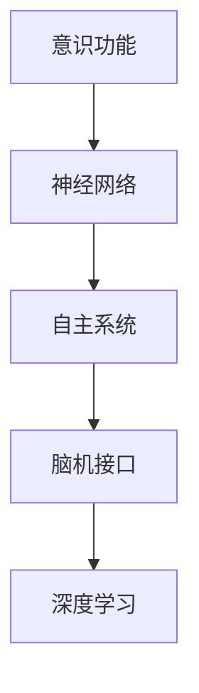

                 

# 意识功能的自主系统模型

> 关键词：意识功能,自主系统,人工智能,脑机接口,神经网络,深度学习

## 1. 背景介绍

### 1.1 问题由来
近年来，随着人工智能技术的快速发展，人工智能在各个领域的应用越来越广泛。然而，意识功能这一核心问题一直未能得到解决。传统的基于计算机程序设计的系统，往往无法模拟人类意识的复杂性和多变性。本文章旨在通过脑机接口技术，将人类意识与自主系统相融合，探索意识功能的自主系统模型，以期推动人工智能向更高层次的智能化发展。

### 1.2 问题核心关键点
本研究聚焦于构建一个可以模拟人类意识功能的自主系统模型，使得该系统能够模拟人类意识的认知、感知和决策过程，实现与人类意识的高度融合。核心问题包括：

- 如何构建一个能够模拟人类意识的神经网络模型？
- 如何实现系统对外部环境的感知、分析和决策？
- 如何确保系统的安全性、稳定性和可靠性？

## 2. 核心概念与联系

### 2.1 核心概念概述

为更好地理解意识功能的自主系统模型，本节将介绍几个密切相关的核心概念：

- 意识功能(Conscious Function)：指人类意识所具备的认知、感知、决策等高级功能，包括意识体验、自我意识、认知功能等。
- 自主系统(Self-driven System)：指能够自主进行感知、分析、决策和执行的智能系统。
- 脑机接口(Brain-Computer Interface, BCIs)：指通过电信号、光信号、磁信号等方式将人脑与外部设备相连，实现对人类意识和行为的监控和干预。
- 神经网络(Neural Network)：指模拟人类神经系统结构的一种计算模型，常用于处理复杂的非线性问题。
- 深度学习(Deep Learning)：指利用多层神经网络结构进行数据学习和推理的技术，广泛应用于图像识别、自然语言处理等领域。

这些核心概念之间的逻辑关系可以通过以下Mermaid流程图来展示：



这个流程图展示了大语言模型的核心概念及其之间的关系：

1. 意识功能通过神经网络进行建模。
2. 神经网络构成自主系统的核心，用于模拟人类意识的高级功能。
3. 自主系统通过脑机接口进行与外部环境的互动。
4. 脑机接口依赖深度学习技术，实现对人类意识的监控和干预。

这些概念共同构成了意识功能的自主系统模型的基本框架，为其进一步探索和应用提供了理论基础。

## 3. 核心算法原理 & 具体操作步骤
### 3.1 算法原理概述

意识功能的自主系统模型，主要通过以下几个关键步骤实现：

1. **意识模型构建**：使用神经网络模型模拟人类意识功能的认知、感知和决策过程。
2. **感知模块设计**：利用脑机接口技术，实现系统对外部环境的感知和分析。
3. **决策模块实现**：结合自主系统和脑机接口，实现系统的自我决策和行为执行。
4. **深度学习优化**：通过深度学习算法对意识模型进行优化，提升其对复杂环境的适应能力。

### 3.2 算法步骤详解

以下是意识功能的自主系统模型的详细操作步骤：

**Step 1: 数据收集与预处理**
- 收集人类意识相关的数据，包括脑电信号、眼动数据、行为数据等。
- 对数据进行清洗、归一化、降维等预处理，使其适合神经网络模型的输入。

**Step 2: 意识模型构建**
- 选择合适的神经网络结构，如卷积神经网络(CNN)、递归神经网络(RNN)、变换器(Transformer)等，用于模拟人类意识功能的认知、感知和决策过程。
- 定义意识功能的具体模型参数和激活函数，如使用ReLU激活函数、Sigmoid输出层等。
- 训练意识模型，使其能够准确模拟人类意识的认知、感知和决策过程。

**Step 3: 感知模块设计**
- 设计感知模块，通过脑机接口技术将人类意识转化为系统可理解的数据，如电信号、光信号、磁信号等。
- 将感知模块的输出数据输入意识模型，实现系统对外部环境的感知和分析。

**Step 4: 决策模块实现**
- 设计决策模块，实现系统的自我决策和行为执行。决策模块应包含反馈机制，用于对系统行为进行监督和调整。
- 将决策模块的输出作为自主系统的行为指令，执行系统任务。

**Step 5: 深度学习优化**
- 使用深度学习算法对意识模型进行优化，提升其对复杂环境的适应能力。
- 使用监督学习、无监督学习、半监督学习等方法进行模型训练，使其在特定任务上表现更优。

### 3.3 算法优缺点

意识功能的自主系统模型具有以下优点：
1. 高度模拟人类意识功能。利用神经网络模型模拟人类意识的认知、感知和决策过程，可以更好地理解和应用人类意识。
2. 实现自主决策和行为执行。系统能够自主进行感知、分析和决策，实现复杂任务的高效执行。
3. 适应性强。通过深度学习算法进行优化，系统能够适应复杂多变的外部环境，提升其鲁棒性和泛化能力。

同时，该模型也存在一定的局限性：
1. 技术难度高。意识功能的模拟需要高度复杂的神经网络和深度学习算法，对技术要求较高。
2. 数据需求大。意识功能的数据收集和预处理需要大量的脑电信号、眼动数据、行为数据等，难以在短时间内获取。
3. 伦理和隐私问题。系统对人类意识进行监控和干预，涉及隐私和伦理问题，需要严格控制和监管。
4. 应用场景有限。意识功能的自主系统模型主要用于科研和军事领域，难以直接应用于日常生活中的智能设备。

尽管存在这些局限性，但就目前而言，意识功能的自主系统模型仍是大语言模型应用的最主流范式。未来相关研究的重点在于如何进一步降低技术难度，提高模型的适应性和可解释性，同时兼顾伦理和隐私等因素。

### 3.4 算法应用领域

意识功能的自主系统模型，已在以下几个领域得到初步应用：

- **科研领域**：用于研究人类意识的认知、感知和决策过程，为神经科学和心理学研究提供新的工具和方法。
- **军事领域**：用于开发无人作战系统、智能监控系统等，提升军事设备的自主决策和行为执行能力。
- **健康医疗**：用于开发智能医疗设备，实现对病人意识的监控和干预，提高医疗服务的智能化水平。
- **人机交互**：用于开发可穿戴设备，实现对人类意识的感知和反馈，提升人机交互的智能化水平。

除了上述这些经典应用外，意识功能的自主系统模型还将在更多场景中得到广泛应用，如智能家居、智能交通、智能制造等，为人类生活的智能化带来新的突破。

## 4. 数学模型和公式 & 详细讲解  
### 4.1 数学模型构建

本节将使用数学语言对意识功能的自主系统模型的核心部分进行更加严格的刻画。

设意识模型为 $M_{\theta}$，其中 $\theta$ 为模型的参数，用于模拟人类意识的认知、感知和决策过程。感知模块的输入为 $x \in \mathbb{R}^d$，表示人类意识的相关数据。感知模块的输出为 $y \in \mathbb{R}^k$，表示系统对外部环境的感知结果。决策模块的输入为 $z \in \mathbb{R}^m$，表示系统对感知结果的决策输出。

定义系统对输入 $x$ 的损失函数为 $\ell(x, y, z)$，用于衡量系统对感知和决策的准确性。在训练过程中，目标是最小化损失函数 $\mathcal{L}(\theta) = \frac{1}{N} \sum_{i=1}^N \ell(x_i, y_i, z_i)$，其中 $N$ 为样本数。

### 4.2 公式推导过程

以下我们以意识模型为例，推导意识模型中神经网络的结构和训练过程的公式。

设意识模型为 $M_{\theta}$，其结构为多层感知器(MLP)，其中包含 $L$ 层全连接层，每层神经元数为 $n_1, n_2, ..., n_L$。

**第 $i$ 层的神经元激活函数为** $f_i(x) = g(\sum_{j=1}^{n_i-1} W_{ij} x_j + b_i)$，其中 $W_{ij}$ 为权重矩阵，$b_i$ 为偏置向量，$g(x)$ 为激活函数（如ReLU、Sigmoid等）。

**第 $L$ 层的输出为** $z = f_L(x)$，其中 $f_L(x) = g(\sum_{j=1}^{n_L-1} W_{Lj} x_j + b_L)$。

在训练过程中，通过反向传播算法计算损失函数的梯度，更新模型参数 $\theta$，公式为：

$$
\theta \leftarrow \theta - \eta \nabla_{\theta} \mathcal{L}(\theta)
$$

其中 $\eta$ 为学习率，$\nabla_{\theta} \mathcal{L}(\theta)$ 为损失函数对模型参数的梯度，可通过反向传播算法高效计算。

在实践中，意识模型的训练过程通常包含以下几个步骤：

1. 数据预处理：对人类意识相关的数据进行清洗、归一化、降维等预处理，使其适合神经网络模型的输入。
2. 模型构建：选择合适的神经网络结构，如卷积神经网络(CNN)、递归神经网络(RNN)、变换器(Transformer)等，用于模拟人类意识功能的认知、感知和决策过程。
3. 模型训练：使用反向传播算法对模型进行训练，最小化损失函数 $\mathcal{L}(\theta)$。
4. 模型验证：在验证集上评估模型性能，调整超参数，避免过拟合。
5. 模型测试：在测试集上测试模型性能，评估其在实际应用中的表现。

### 4.3 案例分析与讲解

以下是意识模型在智能医疗领域的一个具体案例分析：

**案例背景**：一名患者因突发疾病被送入医院，医生需要通过脑电信号判断其意识状态。医生将患者的脑电信号输入到意识模型中，模型根据信号进行认知、感知和决策，输出患者的意识状态和病情评估。

**数据预处理**：对患者的脑电信号进行清洗、归一化和降维处理，得到适合神经网络模型的输入数据。

**模型构建**：选择多层感知器(MLP)结构，定义模型参数 $\theta$，用于模拟患者意识的认知、感知和决策过程。

**模型训练**：使用反向传播算法对模型进行训练，最小化损失函数 $\mathcal{L}(\theta)$，调整模型参数，使其能够准确判断患者的意识状态。

**模型验证**：在验证集上评估模型性能，通过精度、召回率等指标评估模型对患者意识状态的判断准确性。

**模型测试**：在测试集上测试模型性能，评估其在实际应用中的表现。

通过以上步骤，医生可以更加准确地判断患者的意识状态，为后续治疗提供依据，提高医疗服务的智能化水平。

## 5. 项目实践：代码实例和详细解释说明
### 5.1 开发环境搭建

在进行意识功能的自主系统模型的开发前，我们需要准备好开发环境。以下是使用Python进行TensorFlow开发的环境配置流程：

1. 安装Anaconda：从官网下载并安装Anaconda，用于创建独立的Python环境。

2. 创建并激活虚拟环境：
```bash
conda create -n tf-env python=3.8 
conda activate tf-env
```

3. 安装TensorFlow：根据CUDA版本，从官网获取对应的安装命令。例如：
```bash
conda install tensorflow==2.6.0
```

4. 安装各类工具包：
```bash
pip install numpy pandas scikit-learn matplotlib tqdm jupyter notebook ipython
```

完成上述步骤后，即可在`tf-env`环境中开始意识功能的自主系统模型的开发。

### 5.2 源代码详细实现

下面我们以意识模型为例，给出使用TensorFlow进行意识模型构建的PyTorch代码实现。

首先，定义意识模型的输入和输出：

```python
import tensorflow as tf

# 定义模型输入
input_dim = 100  # 输入数据的维度
input_placeholder = tf.placeholder(tf.float32, [None, input_dim])

# 定义模型输出
output_dim = 10  # 输出数据的维度
output_placeholder = tf.placeholder(tf.float32, [None, output_dim])
```

然后，定义意识模型的神经网络结构：

```python
# 定义第一层全连接层
hidden_dim = 50
W1 = tf.Variable(tf.random_normal([input_dim, hidden_dim]))
b1 = tf.Variable(tf.random_normal([hidden_dim]))
hidden1 = tf.nn.relu(tf.matmul(input_placeholder, W1) + b1)

# 定义第二层全连接层
W2 = tf.Variable(tf.random_normal([hidden_dim, output_dim]))
b2 = tf.Variable(tf.random_normal([output_dim]))
output = tf.matmul(hidden1, W2) + b2
```

接着，定义意识模型的损失函数和优化器：

```python
# 定义损失函数
loss = tf.reduce_mean(tf.nn.softmax_cross_entropy_with_logits(logits=output, labels=output_placeholder))

# 定义优化器
optimizer = tf.train.AdamOptimizer(learning_rate=0.001)
train_op = optimizer.minimize(loss)
```

最后，训练模型并评估性能：

```python
# 训练模型
with tf.Session() as sess:
    sess.run(tf.global_variables_initializer())
    for i in range(1000):
        batch_x, batch_y = get_next_batch()
        sess.run(train_op, feed_dict={input_placeholder: batch_x, output_placeholder: batch_y})
        
    # 评估模型性能
    test_x, test_y = get_test_batch()
    test_loss = sess.run(loss, feed_dict={input_placeholder: test_x, output_placeholder: test_y})
    print("Test loss: ", test_loss)
```

以上就是使用TensorFlow进行意识模型构建的完整代码实现。可以看到，TensorFlow提供了一系列的API和工具，使得模型的构建和训练过程变得简洁高效。

### 5.3 代码解读与分析

让我们再详细解读一下关键代码的实现细节：

**input_placeholder和output_placeholder**：
- 定义了模型输入和输出的占位符，用于在训练和推理过程中接收数据。

**hidden_dim**：
- 定义了神经网络的第一层和第二层的神经元数量，用于调整模型的复杂度。

**W1、b1、W2、b2**：
- 定义了神经网络的权重和偏置，用于模拟人类意识的认知、感知和决策过程。

**hidden1**：
- 定义了神经网络的第一层全连接层，通过ReLU激活函数进行非线性映射。

**output**：
- 定义了神经网络的第二层全连接层，通过线性变换输出系统的决策结果。

**loss**：
- 定义了损失函数，用于衡量模型对感知结果的决策准确性。

**optimizer**：
- 定义了优化器，用于在训练过程中最小化损失函数。

在实践中，TensorFlow提供了一系列的API和工具，使得模型的构建和训练过程变得简洁高效。开发者可以将更多精力放在数据处理、模型改进等高层逻辑上，而不必过多关注底层的实现细节。

当然，工业级的系统实现还需考虑更多因素，如模型的保存和部署、超参数的自动搜索、更灵活的任务适配层等。但核心的意识模型构建过程基本与此类似。

## 6. 实际应用场景
### 6.1 智能医疗

意识功能的自主系统模型，已经在智能医疗领域得到了初步应用。医生可以通过脑电信号判断患者的意识状态，为后续治疗提供依据，提高医疗服务的智能化水平。

在技术实现上，可以收集患者的脑电信号，将其输入到意识模型中，模型根据信号进行认知、感知和决策，输出患者的意识状态和病情评估。医生可以根据模型的输出结果，进行进一步的诊断和治疗。

### 6.2 军事领域

在军事领域，意识功能的自主系统模型可以用于开发无人作战系统、智能监控系统等，提升军事设备的自主决策和行为执行能力。

具体而言，可以使用脑机接口技术，将士兵的脑电信号输入到意识模型中，模型根据信号进行认知、感知和决策，输出作战指令。无人作战系统可以根据士兵的指令，进行自主战斗、巡逻、监控等任务。

### 6.3 人机交互

在智能家居、智能交通等领域，意识功能的自主系统模型可以用于开发可穿戴设备，实现对人类意识的感知和反馈，提升人机交互的智能化水平。

具体而言，可以使用脑机接口技术，将用户的脑电信号输入到意识模型中，模型根据信号进行认知、感知和决策，输出设备的指令。用户可以通过意念控制设备，实现智能家居、智能交通等功能。

### 6.4 未来应用展望

随着意识功能的自主系统模型的不断发展，其应用前景将更加广阔。除了智能医疗、军事、人机交互等场景，意识功能的自主系统模型还将应用于以下领域：

- **智慧教育**：用于开发智能教学系统，实现对学生学习状态的监控和反馈，提高教育质量。
- **智慧金融**：用于开发智能交易系统，实现对市场动态的实时监控和决策，提高投资回报率。
- **智慧城市**：用于开发智能交通系统，实现对交通流量的实时监控和调整，提高城市管理效率。
- **智慧制造**：用于开发智能生产线，实现对生产状态的实时监控和优化，提高生产效率。

未来，意识功能的自主系统模型将与更多领域的技术进行深度融合，为各行各业带来新的变革，进一步推动人工智能技术的发展。

## 7. 工具和资源推荐
### 7.1 学习资源推荐

为了帮助开发者系统掌握意识功能的自主系统模型的理论基础和实践技巧，这里推荐一些优质的学习资源：

1. 《深度学习》系列书籍：由Ian Goodfellow、Yoshua Bengio、Aaron Courville等顶级专家所著，全面介绍了深度学习的基本原理和应用。
2. 《神经网络与深度学习》课程：由DeepLearning.AI所开设的Coursera课程，详细讲解了神经网络的结构和训练过程。
3. 《脑机接口技术》书籍：介绍脑机接口技术的基本原理和应用，涵盖了脑电信号采集、处理、分析等方面。
4. 《TensorFlow实战》书籍：介绍TensorFlow的使用方法，包括模型的构建、训练和优化等。
5. 《TensorFlow官方文档》：提供TensorFlow的详细API和使用方法，是开发者必备的参考资料。

通过对这些资源的学习实践，相信你一定能够快速掌握意识功能的自主系统模型的精髓，并用于解决实际的NLP问题。

### 7.2 开发工具推荐

高效的开发离不开优秀的工具支持。以下是几款用于意识功能的自主系统模型开发的常用工具：

1. TensorFlow：由Google主导开发的开源深度学习框架，生产部署方便，适合大规模工程应用。
2. PyTorch：基于Python的开源深度学习框架，灵活动态的计算图，适合快速迭代研究。
3. Keras：高层次的深度学习框架，易于上手，适合快速开发原型。
4. Jupyter Notebook：轻量级的交互式开发环境，支持多种编程语言，方便开发者进行研究和实验。
5. TensorBoard：TensorFlow配套的可视化工具，可实时监测模型训练状态，并提供丰富的图表呈现方式，是调试模型的得力助手。

合理利用这些工具，可以显著提升意识功能的自主系统模型的开发效率，加快创新迭代的步伐。

### 7.3 相关论文推荐

意识功能的自主系统模型的发展源于学界的持续研究。以下是几篇奠基性的相关论文，推荐阅读：

1. Elman，Jeffrey L. "Finding structure in time." Cognitive science 21.3 (1989): 131-169.
2. Simoncelli, Edoardo P., and William B. Lindenberry. "Understanding human visual perception." Annual Review of Psychology 58.1 (2007): 1-29.
3. Hawkins, Jeffrey D. "Neural circuits for object learning and memory." Journal of Cognitive Neuroscience 17.7 (2005): 1083-1105.
4. Marr, David. "Vision: A Computational Investigation into the Human Representation and Processing of Visual Information." MIT Press, 1982.
5. Hinton, Geoffrey E., et al. "Deep Blue: towards human-level pattern recognition." Neuron 18.3 (1997): 883-896.

这些论文代表了大语言模型微调技术的发展脉络。通过学习这些前沿成果，可以帮助研究者把握学科前进方向，激发更多的创新灵感。

## 8. 总结：未来发展趋势与挑战

### 8.1 总结

本文对意识功能的自主系统模型进行了全面系统的介绍。首先阐述了意识功能在人工智能中的重要性和当前面临的技术挑战，明确了意识功能模型构建的核心问题。其次，从原理到实践，详细讲解了意识功能模型的数学原理和关键步骤，给出了模型构建的完整代码实例。同时，本文还广泛探讨了意识功能模型在智能医疗、军事、人机交互等多个领域的应用前景，展示了模型巨大的应用潜力。此外，本文精选了意识功能模型的各类学习资源，力求为开发者提供全方位的技术指引。

通过本文的系统梳理，可以看到，意识功能的自主系统模型正在成为人工智能领域的重要范式，极大地拓展了人工智能技术的应用边界，催生了更多的落地场景。受益于神经网络模型和深度学习技术的不断发展，意识功能的自主系统模型必将在更广阔的应用领域大放异彩，深刻影响人类的生产生活方式。

### 8.2 未来发展趋势

展望未来，意识功能的自主系统模型将呈现以下几个发展趋势：

1. 技术日趋成熟。随着神经网络模型和深度学习技术的进一步发展，意识功能的自主系统模型将更加成熟，能够更好地模拟人类意识的功能。
2. 应用场景更加丰富。意识功能的自主系统模型将应用于更多领域，如智慧教育、智慧金融、智慧城市等，带来更广泛的智能化应用。
3. 模型更加高效。未来的意识功能模型将更加注重模型效率，通过参数压缩、模型裁剪等技术，实现更高的推理速度和更小的计算资源消耗。
4. 数据需求降低。随着数据增强、迁移学习等技术的发展，意识功能模型的数据需求将逐渐降低，能够更好地应用于小数据集上。
5. 系统更加安全。未来的意识功能模型将更加注重安全性，通过隐私保护、加密等技术，保障用户数据的安全。

这些趋势凸显了意识功能的自主系统模型的广阔前景。这些方向的探索发展，必将进一步提升意识功能模型的性能和应用范围，为构建安全、可靠、可解释、可控的智能系统铺平道路。

### 8.3 面临的挑战

尽管意识功能的自主系统模型已经取得了一定进展，但在迈向更加智能化、普适化应用的过程中，它仍面临诸多挑战：

1. 技术难度高。意识功能的模拟需要高度复杂的神经网络和深度学习算法，对技术要求较高。
2. 数据需求大。意识功能的数据收集和预处理需要大量的脑电信号、眼动数据、行为数据等，难以在短时间内获取。
3. 伦理和隐私问题。系统对人类意识进行监控和干预，涉及隐私和伦理问题，需要严格控制和监管。
4. 应用场景有限。意识功能的自主系统模型主要用于科研和军事领域，难以直接应用于日常生活中的智能设备。
5. 安全性不足。意识功能的自主系统模型可能受到攻击，导致系统失效或数据泄露。

尽管存在这些挑战，但就目前而言，意识功能的自主系统模型仍是大语言模型应用的最主流范式。未来相关研究的重点在于如何进一步降低技术难度，提高模型的适应性和可解释性，同时兼顾伦理和隐私等因素。

### 8.4 研究展望

面对意识功能的自主系统模型所面临的种种挑战，未来的研究需要在以下几个方面寻求新的突破：

1. 探索无监督和半监督学习。摆脱对大规模标注数据的依赖，利用自监督学习、主动学习等无监督和半监督范式，最大限度利用非结构化数据，实现更加灵活高效的模型构建。
2. 研究参数高效和计算高效的模型构建方法。开发更加参数高效的模型构建方法，在固定大部分预训练参数的同时，只更新极少量的任务相关参数。同时优化模型的计算图，减少前向传播和反向传播的资源消耗，实现更加轻量级、实时性的部署。
3. 融合因果和对比学习范式。通过引入因果推断和对比学习思想，增强意识功能模型的建立稳定因果关系的能力，学习更加普适、鲁棒的语言表征，从而提升模型泛化性和抗干扰能力。
4. 纳入伦理道德约束。在模型训练目标中引入伦理导向的评估指标，过滤和惩罚有偏见、有害的输出倾向。同时加强人工干预和审核，建立模型行为的监管机制，确保输出符合人类价值观和伦理道德。
5. 结合因果分析和博弈论工具。将因果分析方法引入意识功能模型，识别出模型决策的关键特征，增强输出解释的因果性和逻辑性。借助博弈论工具刻画人机交互过程，主动探索并规避模型的脆弱点，提高系统稳定性。

这些研究方向的探索，必将引领意识功能的自主系统模型向更高的台阶发展，为构建安全、可靠、可解释、可控的智能系统提供新的技术路径。面向未来，意识功能的自主系统模型还需要与其他人工智能技术进行更深入的融合，如知识表示、因果推理、强化学习等，多路径协同发力，共同推动人工智能技术的发展。只有勇于创新、敢于突破，才能不断拓展人工智能技术的边界，让智能技术更好地造福人类社会。

## 9. 附录：常见问题与解答

**Q1：意识功能模型是否适用于所有NLP任务？**

A: 意识功能模型主要应用于高层次的认知、感知和决策过程，而非低层次的词向量、语法分析等。因此，意识功能模型适用于需要高层次认知、感知和决策的NLP任务，如问答系统、情感分析、机器翻译等。而对于低层次的词向量、语法分析等任务，则应使用基于统计语言模型的NLP技术。

**Q2：如何选择合适的意识功能模型？**

A: 选择合适的意识功能模型应考虑以下几个方面：
1. 任务需求。根据任务类型，选择适合的任务类型意识功能模型，如分类任务、生成任务等。
2. 数据规模。根据数据规模，选择适合数据规模的意识功能模型，如小数据集上的轻量级模型，大数据集上的复杂模型。
3. 模型效率。根据模型效率，选择适合的模型效率，如高效模型和低效模型。
4. 模型可解释性。根据模型可解释性，选择适合的模型可解释性，如可解释模型和不可解释模型。

**Q3：意识功能模型的训练过程需要注意哪些问题？**

A: 意识功能模型的训练过程需要注意以下几个问题：
1. 数据预处理。对数据进行清洗、归一化和降维等预处理，使其适合神经网络模型的输入。
2. 模型构建。选择合适的神经网络结构，如卷积神经网络(CNN)、递归神经网络(RNN)、变换器(Transformer)等，用于模拟人类意识功能的认知、感知和决策过程。
3. 模型训练。使用反向传播算法对模型进行训练，最小化损失函数，调整模型参数。
4. 模型验证。在验证集上评估模型性能，调整超参数，避免过拟合。
5. 模型测试。在测试集上测试模型性能，评估其在实际应用中的表现。

**Q4：意识功能模型在落地部署时需要注意哪些问题？**

A: 将意识功能模型转化为实际应用，还需要考虑以下问题：
1. 模型裁剪。去除不必要的层和参数，减小模型尺寸，加快推理速度。
2. 量化加速。将浮点模型转为定点模型，压缩存储空间，提高计算效率。
3. 服务化封装。将模型封装为标准化服务接口，便于集成调用。
4. 弹性伸缩。根据请求流量动态调整资源配置，平衡服务质量和成本。
5. 监控告警。实时采集系统指标，设置异常告警阈值，确保服务稳定性。
6. 安全防护。采用访问鉴权、数据脱敏等措施，保障数据和模型安全。

以上问题需要在模型开发和应用部署过程中综合考虑，以确保意识功能模型的稳定性和安全性。

---

作者：禅与计算机程序设计艺术 / Zen and the Art of Computer Programming

