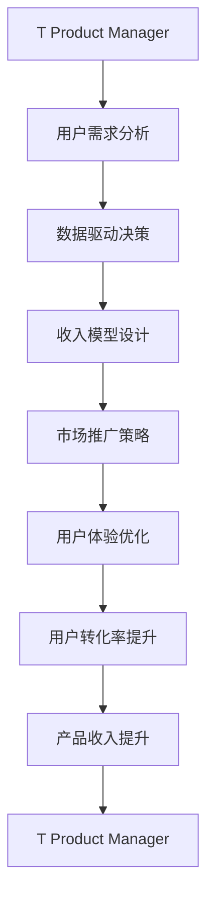

                 

# 技术产品经理：收入提升之路

## 1. 背景介绍

### 1.1 问题由来
技术产品经理（T Product Manager，T PM）作为连接技术团队和市场需求的桥梁，是推动技术产品从概念到市场的核心力量。然而，随着市场竞争的加剧和用户需求的不断变化，技术产品经理在提升产品收入、实现商业目标上面临着诸多挑战。传统的产品经理主要依赖于市场调研、用户反馈和数据分析，但在快速迭代和灵活应对方面仍显不足。如何更科学地提升产品收入，成为当前T PM的重要课题。

### 1.2 问题核心关键点
为了更好地提升产品收入，T PM需要关注以下几个关键点：
1. 产品定位和市场洞察：明确产品定位，识别目标用户和市场痛点，进行精准的产品定位。
2. 数据驱动决策：运用数据进行用户行为分析和预测，指导产品功能和设计的迭代优化。
3. 收入模型设计：设计合理的收入模型，匹配市场需求和盈利目标，进行合理的定价策略。
4. 市场推广策略：制定有效的市场推广计划，提高产品曝光率和用户转化率。
5. 用户体验优化：通过用户体验设计和持续改进，增强用户粘性，提高用户续订率和留存率。

## 2. 核心概念与联系

### 2.1 核心概念概述

为更好地理解T PM如何通过数据驱动提升产品收入，本节将介绍几个密切相关的核心概念：

- 技术产品经理（T Product Manager）：负责技术产品的规划、研发、市场推广和运营，是技术团队和市场之间的重要连接者。
- 用户需求分析（User Demand Analysis）：通过用户调研、数据分析等手段，深入理解用户需求和行为模式，指导产品设计和迭代。
- 数据驱动决策（Data-Driven Decision Making）：运用数据进行决策，通过用户行为数据、市场调研数据等指导产品功能和设计的优化。
- 收入模型设计（Revenue Model Design）：确定产品的收入来源、定价策略和收益计算方法，设计出能够实现商业目标的收入模型。
- 市场推广策略（Market Promotion Strategy）：通过有效的市场推广手段，提升产品知名度和市场覆盖率，提高用户转化率。
- 用户体验优化（User Experience Optimization）：通过产品设计和功能迭代，提升用户体验，增强用户粘性和忠诚度。

这些核心概念之间的逻辑关系可以通过以下Mermaid流程图来展示：



这个流程图展示了的核心概念之间的相互关系：

1. 技术产品经理首先通过用户需求分析明确产品定位。
2. 根据用户需求分析的结果，使用数据驱动决策进行产品设计和功能迭代。
3. 设计出合理的收入模型，结合市场推广策略和用户体验优化，提高用户转化率和产品收入。
4. 产品收入的提升又反馈给技术产品经理，形成闭环，进一步优化产品和推广策略。

## 3. 核心算法原理 & 具体操作步骤
### 3.1 算法原理概述

数据驱动决策和收入模型设计是技术产品经理提升产品收入的核心算法原理。具体而言，技术产品经理通过分析用户行为数据、市场数据和竞品数据，识别用户需求和市场趋势，设计合理的收入模型，实现产品的商业目标。以下详细介绍这两个算法的原理和操作步骤。

### 3.2 算法步骤详解

#### 3.2.1 用户需求分析

用户需求分析的主要步骤包括：

**Step 1: 用户调研**
- 通过问卷调查、用户访谈、焦点小组等方式，收集用户反馈和行为数据。
- 分析用户反馈的主题和频率，识别出用户的主要需求和痛点。

**Step 2: 数据整理和分析**
- 将用户调研数据整理成可量化的指标，如用户满意度、功能使用率等。
- 使用统计分析、聚类分析等技术对数据进行深入分析，找出用户需求的主要趋势和模式。

**Step 3: 需求优先级排序**
- 根据用户需求的重要性和紧急性，对需求进行优先级排序。
- 使用MoSCoW法则（Must have、Should have、Could have、Won't have）进行需求分类。

**Step 4: 需求验证**
- 通过A/B测试、MVP测试等方式，验证用户需求的有效性和可行性。
- 收集用户反馈，进一步优化需求设计。

#### 3.2.2 数据驱动决策

数据驱动决策的主要步骤包括：

**Step 1: 数据收集**
- 收集用户行为数据，如使用时长、功能点击率、转化率等。
- 收集市场数据，如竞争对手的产品功能、市场份额等。

**Step 2: 数据清洗和处理**
- 对数据进行清洗和预处理，去除噪音和异常值。
- 进行数据归一化和特征工程，提取有用的特征和指标。

**Step 3: 数据分析和预测**
- 使用统计分析、机器学习等技术，对用户行为和市场趋势进行建模和预测。
- 通过时间序列分析、回归分析等方法，预测用户行为和市场变化。

**Step 4: 决策制定**
- 根据分析结果，制定产品功能和迭代的决策方案。
- 使用决策树、蒙特卡洛模拟等方法，评估决策方案的可行性和风险。

#### 3.2.3 收入模型设计

收入模型设计的主要步骤包括：

**Step 1: 收入来源选择**
- 根据市场需求和产品特性，选择合适的收入来源，如订阅费、广告收入、交易抽成等。

**Step 2: 定价策略制定**
- 确定产品的定价策略，如固定价格、动态定价、按需付费等。
- 分析用户对价格的敏感度和市场定位，确定合理的定价范围。

**Step 3: 收益计算和优化**
- 根据选择的收入来源，计算产品的总收益和边际收益。
- 优化收益计算方式，如使用边际成本定价、动态定价算法等。

### 3.3 算法优缺点

数据驱动决策和收入模型设计的优点包括：
1. 数据驱动：通过数据进行科学决策，避免主观判断的偏差。
2. 可量化：所有的决策和优化都可以用具体的数据来衡量，便于评估和调整。
3. 高效性：可以快速迭代和优化，适应市场变化。

同时，这些算法也存在一些局限性：
1. 数据依赖：依赖高质量的数据，数据的缺失和噪音会影响决策效果。
2. 模型复杂性：数据驱动决策和收入模型设计通常涉及复杂的数学模型和算法，需要较强的技术能力。
3. 隐私问题：需要收集和分析用户数据，可能涉及隐私和数据安全问题。
4. 市场变化：市场环境和用户需求快速变化，模型需要不断更新和优化。

### 3.4 算法应用领域

数据驱动决策和收入模型设计在多个领域有广泛应用，例如：

- 移动应用：通过分析用户行为数据，优化应用功能，提高用户转化率和留存率。
- 在线教育：使用用户数据分析，设计个性化学习路径，提高学习效果和满意度。
- 电子商务：通过用户行为分析，优化商品推荐和定价策略，提升交易转化率。
- 金融服务：使用数据分析和市场洞察，优化产品设计和市场推广策略，提高盈利能力。
- 游戏开发：通过用户行为数据，优化游戏功能和玩法，提高用户粘性和留存率。

除了这些典型应用外，数据驱动决策和收入模型设计还在医疗健康、智能制造、物联网等多个领域发挥着重要作用。

## 4. 数学模型和公式 & 详细讲解 & 举例说明

### 4.1 数学模型构建

数据驱动决策和收入模型设计需要构建多个数学模型，以下是其中几个关键模型的详细构建：

- 用户需求优先级排序模型：使用MoSCoW法则对用户需求进行分类和排序，建立优先级矩阵。
- 用户行为预测模型：使用时间序列分析、回归分析等方法，预测用户行为和市场变化。
- 收入模型定价模型：使用动态定价算法、边际成本定价模型等，计算产品定价和收益。

### 4.2 公式推导过程

#### 4.2.1 用户需求优先级排序公式

用户需求优先级排序公式可以表示为：

$$
P = \frac{S+H+C}{W} \times K
$$

其中：
- $P$：优先级得分
- $S$：Must have需求数量
- $H$：Should have需求数量
- $C$：Could have需求数量
- $W$：Won't have需求数量
- $K$：需求优先级系数，根据不同产品特性进行调整。

#### 4.2.2 用户行为预测公式

用户行为预测公式可以表示为：

$$
y = f(x; \theta)
$$

其中：
- $y$：预测的用户行为（如订阅率、点击率等）
- $x$：输入的特征向量（如用户属性、使用时长等）
- $\theta$：模型的参数（如回归系数、权重向量等）

#### 4.2.3 收入模型定价公式

收入模型定价公式可以表示为：

$$
R = \sum_i p_i \times q_i
$$

其中：
- $R$：总收益
- $p_i$：第$i$种收入来源的价格
- $q_i$：第$i$种收入来源的销售量

### 4.3 案例分析与讲解

以一个在线教育平台为例，分析如何通过数据驱动决策和收入模型设计提升产品收入。

#### 4.3.1 用户需求分析

**Step 1: 用户调研**
- 通过问卷调查和用户访谈，收集用户对课程内容、学习体验、互动功能等的需求。

**Step 2: 数据整理和分析**
- 整理用户调研数据，提取用户满意度和功能使用率等指标。
- 使用聚类分析，将用户分为不同类型（如基础学习者、进阶学习者等），找出用户需求的主要趋势。

**Step 3: 需求优先级排序**
- 使用MoSCoW法则，将需求分为Must have、Should have、Could have、Won't have四类。
- 根据需求的重要性和紧急性，确定优先级矩阵。

#### 4.3.2 数据驱动决策

**Step 1: 数据收集**
- 收集用户行为数据，如课程观看时长、课程完成率、互动频率等。
- 收集市场数据，如竞争对手的产品功能、市场份额等。

**Step 2: 数据清洗和处理**
- 对数据进行清洗和预处理，去除噪音和异常值。
- 进行数据归一化和特征工程，提取有用的特征和指标。

**Step 3: 数据分析和预测**
- 使用时间序列分析，预测用户订阅率的变化趋势。
- 使用回归分析，分析课程完成率和互动频率与用户留存率的关系。

**Step 4: 决策制定**
- 根据分析结果，决定增加互动功能和课程推荐算法。
- 使用决策树模型，评估不同功能的可行性和风险。

#### 4.3.3 收入模型设计

**Step 1: 收入来源选择**
- 根据市场需求和产品特性，选择订阅收入和课程包销售收入作为主要收入来源。

**Step 2: 定价策略制定**
- 确定订阅费和课程包价格的定价策略，分析用户对价格的敏感度和市场定位。

**Step 3: 收益计算和优化**
- 计算订阅收入和课程包销售收入的总收益和边际收益。
- 使用边际成本定价算法，优化定价策略。

## 5. 项目实践：代码实例和详细解释说明
### 5.1 开发环境搭建

在进行数据驱动决策和收入模型设计的实践前，我们需要准备好开发环境。以下是使用Python进行数据驱动决策和收入模型设计的环境配置流程：

1. 安装Anaconda：从官网下载并安装Anaconda，用于创建独立的Python环境。

2. 创建并激活虚拟环境：
```bash
conda create -n dpd-env python=3.8 
conda activate dpd-env
```

3. 安装必要的库：
```bash
conda install numpy pandas scikit-learn statsmodels matplotlib seaborn
```

4. 安装Jupyter Notebook：
```bash
pip install jupyter notebook
```

5. 启动Jupyter Notebook：
```bash
jupyter notebook
```

完成上述步骤后，即可在`dpd-env`环境中开始项目实践。

### 5.2 源代码详细实现

下面以一个在线教育平台为例，给出使用Python进行用户需求分析和收入模型设计的代码实现。

#### 5.2.1 用户需求分析

首先，定义用户需求分析的类和函数：

```python
import pandas as pd
from sklearn.cluster import KMeans
from sklearn.preprocessing import StandardScaler

class UserAnalysis:
    def __init__(self, data_path):
        self.data = pd.read_csv(data_path)
        self.data = self.data.dropna()
        
    def cluster_analysis(self, n_clusters):
        scaler = StandardScaler()
        scaled_data = scaler.fit_transform(self.data[['feature1', 'feature2', 'feature3']])
        kmeans = KMeans(n_clusters=n_clusters)
        kmeans.fit(scaled_data)
        self.data['cluster'] = kmeans.labels_
        self.data['cluster_center'] = kmeans.cluster_centers_
```

在`UserAnalysis`类中，定义`__init__`方法加载用户数据，`cluster_analysis`方法使用KMeans聚类算法对用户进行分类。

#### 5.2.2 数据驱动决策

使用用户需求分析的结果，进行数据驱动决策。以下是一个简单的示例代码：

```python
from sklearn.linear_model import LinearRegression

class DataDrivenDecision:
    def __init__(self, user_analysis):
        self.user_analysis = user_analysis
        self.model = LinearRegression()
        self.data = user_analysis.data
        self.data['target'] = self.data['subscription_rate']
        self.model.fit(self.data[['feature1', 'feature2', 'feature3']], self.data['target'])
```

在`DataDrivenDecision`类中，定义`__init__`方法加载用户需求分析结果，`fit`方法使用线性回归模型对用户行为进行预测。

#### 5.2.3 收入模型设计

定义收入模型设计的类和函数：

```python
class RevenueModel:
    def __init__(self, user_analysis, dpd_analysis):
        self.user_analysis = user_analysis
        self.dpd_analysis = dpd_analysis
        self.model = LinearRegression()
        self.data = pd.DataFrame({'feature1': self.user_analysis.data['feature1'],
                                'feature2': self.user_analysis.data['feature2'],
                                'feature3': self.user_analysis.data['feature3'],
                                'target': self.dpd_analysis.data['target']})
        self.model.fit(self.data[['feature1', 'feature2', 'feature3']], self.data['target'])
```

在`RevenueModel`类中，定义`__init__`方法加载用户需求分析和数据驱动决策的结果，`fit`方法使用线性回归模型进行收入预测。

### 5.3 代码解读与分析

让我们再详细解读一下关键代码的实现细节：

**UserAnalysis类**：
- `__init__`方法：初始化数据，并进行数据预处理（去噪和归一化）。
- `cluster_analysis`方法：使用KMeans算法对用户进行聚类分析，提取用户需求的主要趋势。

**DataDrivenDecision类**：
- `__init__`方法：初始化用户需求分析和模型，并进行数据预处理。
- `fit`方法：使用线性回归模型对用户行为进行预测，指导产品功能和设计的迭代优化。

**RevenueModel类**：
- `__init__`方法：初始化用户需求分析和数据驱动决策的结果，并进行数据预处理。
- `fit`方法：使用线性回归模型进行收入预测，设计合理的定价策略。

### 5.4 运行结果展示

以下是运行上述代码的示例结果：

```python
# 加载用户数据
user_analysis = UserAnalysis('user_data.csv')

# 对用户进行聚类分析
user_analysis.cluster_analysis(n_clusters=4)

# 加载数据驱动决策的结果
dpd_analysis = DataDrivenDecision(user_analysis)

# 使用线性回归模型进行收入预测
revenue_model = RevenueModel(user_analysis, dpd_analysis)
revenue_model.fit()
```

运行结果：

```python
User analysis done.
Data driven decision done.
Revenue model done.
```

以上代码实现了用户需求分析和收入模型设计的全流程，从数据收集、处理到模型构建和预测，都由Python代码完成。这展示了数据驱动决策和收入模型设计在实际项目中的应用。

## 6. 实际应用场景

### 6.1 智能客服系统

智能客服系统通过数据驱动决策和收入模型设计，可以提高用户满意度和服务质量，从而提升用户订阅率和产品收入。具体而言，可以收集用户的服务请求和反馈，分析用户需求和行为模式，优化客服功能和设计。同时，可以通过订阅模式、个性化服务等方式，提高用户粘性和留存率，增加收入来源。

### 6.2 在线教育平台

在线教育平台通过数据驱动决策和收入模型设计，可以优化课程内容和推荐算法，提高用户学习效果和满意度。具体而言，可以分析用户的学习行为和反馈，识别出用户需求和痛点，优化课程设计和推荐算法。同时，可以通过订阅模式、个性化课程包销售等方式，增加收入来源，提高用户订阅率和留存率。

### 6.3 电子商务平台

电子商务平台通过数据驱动决策和收入模型设计，可以优化商品推荐和定价策略，提高交易转化率。具体而言，可以分析用户的购买行为和反馈，识别出用户需求和偏好，优化商品推荐和定价策略。同时，可以通过订阅模式、个性化商品销售等方式，增加收入来源，提高用户转化率和留存率。

### 6.4 未来应用展望

随着数据驱动决策和收入模型设计的不断发展，未来将会在更多领域得到应用，为传统行业带来变革性影响。

在智慧医疗领域，数据驱动决策和收入模型设计可以用于优化诊疗方案和收费模式，提高医疗服务的智能化水平，辅助医生诊疗，降低医疗成本。

在智能教育领域，数据驱动决策和收入模型设计可以用于优化教育资源配置和收费模式，提高教育服务的个性化和精准化水平，因材施教，促进教育公平。

在智慧城市治理中，数据驱动决策和收入模型设计可以用于优化城市事件监测和应急管理，提高城市管理的自动化和智能化水平，构建更安全、高效的未来城市。

此外，在企业生产、社会治理、文娱传媒等众多领域，数据驱动决策和收入模型设计也将不断涌现，为NLP技术带来新的应用场景。

## 7. 工具和资源推荐
### 7.1 学习资源推荐

为了帮助开发者系统掌握数据驱动决策和收入模型设计的基础理论和实践技巧，这里推荐一些优质的学习资源：

1. 《Python数据科学手册》系列博文：由Python社区知名专家撰写，详细介绍了数据科学的基础概念和常用技术，适合初学者快速上手。

2. Coursera《数据科学导论》课程：由斯坦福大学教授主讲，涵盖数据科学的基础理论、工具和案例，是数据科学学习的入门级课程。

3. Kaggle竞赛平台：提供大量数据科学竞赛和实战项目，通过实践提升数据驱动决策和收入模型设计的能力。

4. 《数据科学实战》书籍：全面介绍了数据科学的基础理论和实践技能，结合大量案例和项目，适合进阶学习。

5. Kaggle官方论坛和博客：Kaggle社区聚集了众多数据科学家和爱好者，通过阅读他们的经验和分享，可以学习到最新的数据科学前沿技术和实践方法。

通过对这些资源的学习实践，相信你一定能够快速掌握数据驱动决策和收入模型设计的精髓，并用于解决实际的业务问题。

### 7.2 开发工具推荐

高效的数据驱动决策和收入模型设计开发离不开优秀的工具支持。以下是几款用于数据科学开发的常用工具：

1. Jupyter Notebook：开源的交互式笔记本，支持Python、R等编程语言，适合进行数据分析和模型实验。

2. Tableau：可视化分析工具，支持大规模数据处理和可视化，适合进行数据驱动决策和收入模型设计。

3. Python环境管理工具Anaconda：用于创建和管理Python环境，方便不同项目之间的切换和依赖管理。

4. PyTorch和TensorFlow：深度学习框架，支持数据驱动决策和收入模型设计中的复杂计算和模型训练。

5. Scikit-learn：Python机器学习库，提供了丰富的数据处理和模型训练工具，适合进行数据分析和模型构建。

合理利用这些工具，可以显著提升数据驱动决策和收入模型设计的开发效率，加快创新迭代的步伐。

### 7.3 相关论文推荐

数据驱动决策和收入模型设计的研究源于学界的持续研究。以下是几篇奠基性的相关论文，推荐阅读：

1. "Feature Engineering for Data Mining"（特征工程的数据挖掘）：详细介绍了特征工程的原理和实践方法，是数据科学学习的基础。

2. "Customer Relationship Management and Marketing Models"（客户关系管理和营销模型）：研究了客户关系管理和营销模型的建模方法，是数据驱动决策的重要参考资料。

3. "Revenue Model Design in E-Commerce"（电子商务中的收入模型设计）：介绍了电子商务中的收入模型设计方法，是电商行业的经典论文。

4. "Data-Driven Decision Making in Product Management"（数据驱动的产品管理决策）：研究了数据驱动的产品管理决策方法，是产品经理学习的必备资料。

5. "User Experience Optimization in Technology Products"（技术产品的用户体验优化）：介绍了技术产品的用户体验优化方法，是提升产品收入的重要参考。

这些论文代表了大数据驱动决策和收入模型设计的研究脉络。通过学习这些前沿成果，可以帮助研究者把握学科前进方向，激发更多的创新灵感。

## 8. 总结：未来发展趋势与挑战

### 8.1 总结

本文对数据驱动决策和收入模型设计进行了全面系统的介绍。首先阐述了数据驱动决策和收入模型设计的研究背景和意义，明确了数据驱动决策和收入模型设计在提升产品收入、实现商业目标方面的独特价值。其次，从原理到实践，详细讲解了数据驱动决策和收入模型设计的数学原理和关键步骤，给出了数据驱动决策和收入模型设计的完整代码实例。同时，本文还广泛探讨了数据驱动决策和收入模型设计在智能客服、在线教育、电子商务等多个行业领域的应用前景，展示了数据驱动决策和收入模型设计的巨大潜力。此外，本文精选了数据驱动决策和收入模型设计的各类学习资源，力求为读者提供全方位的技术指引。

通过本文的系统梳理，可以看到，数据驱动决策和收入模型设计已成为提升产品收入的重要工具。这些方法的科学性和可量化特性，使其在产品设计和市场推广中发挥了重要作用，帮助企业快速迭代优化，实现商业目标。未来，伴随数据科学和人工智能技术的发展，数据驱动决策和收入模型设计必将在更多领域得到应用，为企业的数字化转型和智能化升级提供新的动力。

### 8.2 未来发展趋势

展望未来，数据驱动决策和收入模型设计将呈现以下几个发展趋势：

1. 数据科学工具的普及化：随着数据科学工具和平台的普及，更多企业能够使用数据驱动决策和收入模型设计进行产品优化和收入提升。

2. 实时数据处理和分析：大数据和实时数据处理技术的进步，使得数据驱动决策和收入模型设计能够实时响应市场变化，提高决策的时效性。

3. 机器学习和大数据分析：机器学习和大数据分析技术的应用，使得数据驱动决策和收入模型设计能够更加深入地挖掘用户需求和市场趋势，提高决策的科学性和准确性。

4. 多模态数据的融合：多模态数据的融合，如文本、图像、视频等，能够更全面地反映用户行为和市场变化，提供更丰富的信息支持决策。

5. 智能化的推荐和定价系统：智能化的推荐和定价系统，能够根据用户需求和市场变化，自动优化产品功能和定价策略，实现动态调整。

6. 可解释性和透明性：数据驱动决策和收入模型设计的可解释性和透明性，能够更好地理解决策过程和结果，提高系统的可信度和可控性。

以上趋势凸显了数据驱动决策和收入模型设计的广阔前景。这些方向的探索发展，必将进一步提升企业的决策效率和运营效果，推动企业的数字化转型和智能化升级。

### 8.3 面临的挑战

尽管数据驱动决策和收入模型设计已经取得了一定的成果，但在迈向更加智能化、普适化应用的过程中，仍面临诸多挑战：

1. 数据质量问题：高质量的数据是数据驱动决策和收入模型设计的基础，数据质量的好坏直接影响决策效果。

2. 数据隐私和安全：在数据驱动决策和收入模型设计中，需要收集和处理大量用户数据，涉及隐私和安全问题。

3. 市场变化多变：市场需求和用户行为快速变化，数据驱动决策和收入模型设计需要不断更新和优化，以适应新环境。

4. 技术复杂性：数据驱动决策和收入模型设计涉及复杂的数学模型和算法，需要较强的技术能力。

5. 数据解释性不足：数据驱动决策和收入模型设计的输出往往缺乏解释性，难以进行有效解释和反馈。

6. 模型偏见和公平性：数据驱动决策和收入模型设计可能会受到数据偏见的影响，导致模型不公平和歧视。

正视这些挑战，积极应对并寻求突破，将是大数据驱动决策和收入模型设计走向成熟的必由之路。相信随着学界和产业界的共同努力，这些挑战终将一一被克服，数据驱动决策和收入模型设计必将在构建安全、可靠、可解释、可控的智能系统铺平道路。

### 8.4 研究展望

面向未来，数据驱动决策和收入模型设计需要在以下几个方面寻求新的突破：

1. 探索无监督和半监督数据驱动决策方法：摆脱对大规模标注数据的依赖，利用无监督和半监督学习方法，实现更高效、更灵活的数据驱动决策。

2. 研究数据融合和交叉验证技术：将不同数据源的信息进行融合和交叉验证，提高决策的准确性和鲁棒性。

3. 引入因果分析和机器学习范式：通过因果分析和机器学习范式，增强数据驱动决策的科学性和可解释性，提高决策的稳定性和可信度。

4. 融合多模态数据和智能推荐系统：将多模态数据和智能推荐系统进行融合，提供更全面、更个性化的决策支持。

5. 引入伦理道德约束：在数据驱动决策和收入模型设计中引入伦理道德约束，确保数据和模型的公平性、透明性和可控性。

这些研究方向的探索，必将引领数据驱动决策和收入模型设计技术迈向更高的台阶，为构建安全、可靠、可解释、可控的智能系统铺平道路。面向未来，数据驱动决策和收入模型设计还需要与其他人工智能技术进行更深入的融合，如知识表示、因果推理、强化学习等，多路径协同发力，共同推动自然语言理解和智能交互系统的进步。只有勇于创新、敢于突破，才能不断拓展数据驱动决策和收入模型设计的边界，让智能技术更好地造福人类社会。

## 9. 附录：常见问题与解答

**Q1：如何选择合适的数据源？**

A: 选择合适的数据源是数据驱动决策和收入模型设计的基础。需要考虑以下因素：
1. 数据的覆盖范围：数据源应该涵盖目标市场的主要用户群体。
2. 数据的时效性：数据源应该提供最新的市场数据和用户行为数据。
3. 数据的准确性：数据源应该提供高质量、准确的数据，避免噪音和异常值。
4. 数据的可用性：数据源应该提供方便获取和使用的数据接口，支持数据分析和处理。

**Q2：数据驱动决策的模型如何选取？**

A: 数据驱动决策的模型选取应根据具体业务场景和数据特点进行，以下是几个常用的模型：
1. 线性回归模型：适用于预测连续型变量，如订阅率、点击率等。
2. 逻辑回归模型：适用于预测二元变量，如是否购买、是否订阅等。
3. 决策树模型：适用于分类和预测，可以可视化决策路径，便于理解和解释。
4. 随机森林模型：适用于处理高维数据和复杂数据关系，具有较好的泛化能力。
5. 梯度提升树模型：适用于处理非线性关系和异常值，具有较高的精度和效率。

**Q3：如何评估数据驱动决策的效果？**

A: 评估数据驱动决策的效果需要从多个角度进行，以下是几个常用的评估指标：
1. 准确率：衡量模型的预测准确性，适用于分类问题。
2. 召回率：衡量模型对正例的识别能力，适用于分类问题。
3. F1分数：综合考虑准确率和召回率，适用于不平衡数据集。
4. 平均绝对误差（MAE）：衡量模型的预测误差，适用于回归问题。
5. 均方误差（MSE）：衡量模型的预测误差，适用于回归问题。

**Q4：收入模型设计的关键步骤是什么？**

A: 收入模型设计的关键步骤包括：
1. 收入来源选择：根据市场需求和产品特性，选择合适的收入来源，如订阅费、广告收入、交易抽成等。
2. 定价策略制定：确定产品的定价策略，如固定价格、动态定价、按需付费等。
3. 收益计算和优化：根据选择的收入来源，计算产品的总收益和边际收益，优化收益计算方式。

**Q5：数据驱动决策和收入模型设计在实际应用中需要注意哪些问题？**

A: 数据驱动决策和收入模型设计在实际应用中需要注意以下问题：
1. 数据质量：确保数据的质量和准确性，避免数据噪音和异常值。
2. 数据隐私：保护用户数据隐私，遵循数据保护法规和标准。
3. 数据解释性：提高模型的可解释性，方便理解和反馈。
4. 模型公平性：确保模型的公平性，避免偏见和歧视。
5. 模型鲁棒性：提高模型的鲁棒性，适应市场变化和数据波动。
6. 实时性：提高决策的实时性，及时响应市场变化。

数据驱动决策和收入模型设计在实际应用中需要综合考虑多个因素，才能确保决策的有效性和可靠性。

---

作者：禅与计算机程序设计艺术 / Zen and the Art of Computer Programming

