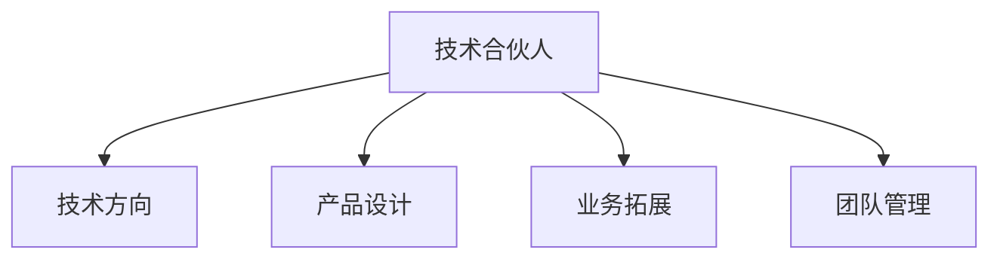

                 

## 1. 背景介绍

在创业公司中，技术合伙人（Technical Co-founder）扮演着至关重要的角色，他们不仅是技术领域的专业人士，更是公司的核心决策者之一。在技术和市场之间架起桥梁，推动公司不断前进。本文旨在探讨技术合伙人在创业公司中的核心角色，以及他们在技术、产品、业务等方面的重要贡献。

## 2. 核心概念与联系

### 2.1 核心概念概述

技术合伙人在创业公司的角色涵盖多个方面，包括但不限于：

- **技术方向**：确定公司的技术路线、产品需求和技术架构。
- **产品设计**：负责产品的技术实现、性能优化和用户体验。
- **业务拓展**：利用技术手段支持公司业务的发展和增长。
- **团队管理**：指导技术团队，推动技术团队的发展和成长。

技术合伙人的工作与公司的战略、文化和创新息息相关。一个优秀的技术合伙人能够在公司发展的各个阶段提供关键的技术支撑和方向指导。

### 2.2 核心概念原理和架构的 Mermaid 流程图



该流程图展示了技术合伙人在创业公司中的核心角色，他们从技术方向、产品设计、业务拓展和团队管理四个方面，全面支持公司的发展。

## 3. 核心算法原理 & 具体操作步骤

### 3.1 算法原理概述

技术合伙人需要在技术领域有深入的理解和经验，能够把握技术趋势，识别技术风险，提出有效的技术方案。他们需要具备以下核心能力：

- **技术战略规划**：根据市场和用户需求，制定技术战略，选择合适的技术栈和框架。
- **架构设计**：设计高效、可扩展、易于维护的系统架构，确保系统的稳定性和可维护性。
- **问题解决**：在项目开发过程中，能够快速识别和解决技术问题，确保项目按时交付。
- **持续学习**：不断学习新技术，保持技术领先，推动公司技术进步。

### 3.2 算法步骤详解

技术合伙人在创业公司中的工作可以分为以下几个关键步骤：

1. **需求分析**：与业务团队协作，明确产品需求和功能要求。
2. **技术选型**：根据产品需求，选择合适的技术栈和框架。
3. **架构设计**：设计系统的整体架构，包括数据库、缓存、消息队列等组件。
4. **开发实施**：指导开发团队进行代码编写、测试和集成。
5. **性能优化**：优化系统性能，确保系统的高效稳定运行。
6. **技术支持**：在项目开发过程中，提供技术支持和解决方案。

### 3.3 算法优缺点

技术合伙人在创业公司的优点包括：

- **技术权威性**：在技术领域有深厚的知识和经验，能够提供专业的技术指导。
- **创新驱动**：能够推动技术创新，提高公司技术竞争力。
- **风险管理**：识别和规避技术风险，确保项目顺利进行。

缺点则包括：

- **沟通难度**：技术语言与非技术人员存在差异，可能导致沟通不畅。
- **时间压力**：在快速变化的市场环境中，需要快速做出技术决策，可能面临时间压力。
- **资源限制**：技术团队的规模和资源有限，可能无法实现所有技术设想。

### 3.4 算法应用领域

技术合伙人在以下领域有广泛应用：

- **互联网创业**：指导技术团队实现产品的技术实现和性能优化。
- **传统企业转型**：推动企业技术转型，实现数字化转型。
- **初创公司**：在创业初期提供技术方向和战略指导，帮助公司快速发展。
- **大型企业**：在技术创新和战略规划方面，提供指导和支持。

## 4. 数学模型和公式 & 详细讲解 & 举例说明

### 4.1 数学模型构建

技术合伙人在创业公司的角色可以用以下数学模型来表示：

$$
\text{技术合伙人} = \text{技术方向} \times \text{产品设计} \times \text{业务拓展} \times \text{团队管理}
$$

这个模型表明，技术合伙人在多个方面为公司提供了全面支持。

### 4.2 公式推导过程

技术合伙人在不同阶段的工作可以用以下公式来表示：

$$
\text{技术合伙人工作} = \sum_{i=1}^n \text{技术需求}_i \times \text{技术解决方案}_i
$$

其中，$n$ 表示不同阶段的工作数量，$\text{技术需求}$ 和 $\text{技术解决方案}$ 分别为每个阶段的需求和方案。

### 4.3 案例分析与讲解

一个典型的案例是字节跳动的技术合伙人杨伟东。他在公司成立之初，负责确定技术方向，推动产品设计和业务拓展。通过与业务团队的紧密协作，制定了高效的技术方案，实现了产品的快速迭代和市场扩展。

## 5. 项目实践：代码实例和详细解释说明

### 5.1 开发环境搭建

创建一个虚拟开发环境，并安装所需的技术栈和工具。例如，在Linux系统中安装Python、Docker、Kubernetes等工具。

### 5.2 源代码详细实现

以一个简单的Web应用为例，展示技术合伙人如何设计和实现系统架构。

```python
from flask import Flask, jsonify

app = Flask(__name__)

@app.route('/')
def index():
    data = {'message': 'Hello, world!'}
    return jsonify(data)

if __name__ == '__main__':
    app.run(debug=True)
```

### 5.3 代码解读与分析

该代码实现了一个简单的Flask Web应用，展示了技术合伙人在设计和实现系统架构时，需要考虑的问题，如路由设计、数据处理等。

### 5.4 运行结果展示

运行代码，在浏览器中访问 `http://localhost:5000/`，应该能看到 `Hello, world!` 的响应。

## 6. 实际应用场景

### 6.1 互联网创业

技术合伙人在互联网创业中，主要负责产品的技术实现和性能优化。例如，对于社交媒体应用，需要设计高效的算法和数据结构，确保用户数据的快速查询和处理。

### 6.2 传统企业转型

在传统企业转型中，技术合伙人需要推动企业技术升级，实现数字化转型。例如，通过引入云计算和大数据技术，优化业务流程，提升企业效率。

### 6.3 初创公司

在初创公司中，技术合伙人不仅需要提供技术方向，还需要参与市场和业务决策。例如，在一家AI初创公司中，技术合伙人需要确定产品方向，设计算法模型，并与市场团队协作，推广产品。

### 6.4 未来应用展望

未来，技术合伙人在创业公司中的角色将更加多样化和复杂化。随着技术的不断进步，技术合伙人需要在更多领域提供支持，如区块链、人工智能、物联网等新兴技术。

## 7. 工具和资源推荐

### 7.1 学习资源推荐

- **《深度学习》**：Ian Goodfellow等著，深入讲解深度学习原理和实践。
- **《Designing Data-Intensive Applications》**：Martin Kleppmann著，讲解数据密集型应用的架构设计和实现。
- **《The Pragmatic Programmer》**：Andrew Hunt等著，提供软件开发的最佳实践和经验。

### 7.2 开发工具推荐

- **Git**：版本控制工具，用于代码管理和协作。
- **JIRA**：项目管理工具，用于任务分配和跟踪。
- **Slack**：团队沟通工具，用于实时交流和协作。

### 7.3 相关论文推荐

- **《Deep Learning for Self-Driving Cars》**：Ian Goodfellow等著，讲解深度学习在自动驾驶中的应用。
- **《Blockchain: The State of the Art》**：Stuartabit等著，讲解区块链技术的最新进展和应用。
- **《Exploring the Machine Learning Landscape》**：Andrew Ng著，讲解机器学习领域的现状和未来。

## 8. 总结：未来发展趋势与挑战

### 8.1 研究成果总结

技术合伙人在创业公司的角色涵盖了技术方向、产品设计、业务拓展和团队管理等多个方面，为公司的持续发展和创新提供了关键支持。

### 8.2 未来发展趋势

未来，技术合伙人在以下几个方面会有新的发展：

- **技术多元化**：随着技术领域的不断扩展，技术合伙人需要掌握更多的新兴技术，如区块链、人工智能等。
- **跨领域协作**：技术合伙人需要与更多领域的专业人士协作，推动公司的综合发展。
- **持续学习**：技术合伙人需要不断学习和更新知识，保持技术领先。

### 8.3 面临的挑战

技术合伙人在创业公司中面临的挑战包括：

- **快速变化**：技术环境变化快，需要快速适应和调整。
- **跨部门协作**：需要与市场、销售等部门协作，确保技术决策符合业务需求。
- **资源有限**：技术团队的规模和资源有限，需要合理分配和使用。

### 8.4 研究展望

未来的研究需要关注以下几个方面：

- **技术创新**：推动技术创新，提升公司的技术竞争力。
- **用户体验**：关注用户体验，提供更好的产品和服务。
- **数据安全**：加强数据安全管理，保护用户隐私和数据安全。

## 9. 附录：常见问题与解答

**Q1：技术合伙人在公司中扮演什么角色？**

A: 技术合伙人在公司中扮演技术方向、产品设计、业务拓展和团队管理等核心角色，提供全面的技术支持和指导。

**Q2：如何成为一名优秀的技术合伙人？**

A: 成为一名优秀的技术合伙人，需要具备深厚的技术知识、良好的沟通能力、跨领域协作能力以及持续学习能力。

**Q3：技术合伙人与CEO有哪些不同？**

A: 技术合伙人主要负责技术方向和产品实现，而CEO则需要全面负责公司的战略、运营和团队管理。两者需要紧密协作，共同推动公司发展。

**Q4：技术合伙人如何与其他部门协作？**

A: 技术合伙人需要与市场、销售、产品等多个部门协作，确保技术决策符合业务需求。建立跨部门沟通机制，提高协作效率。

**Q5：技术合伙人在公司中的职业发展路径是什么？**

A: 技术合伙人可以在公司内部逐步晋升为CTO或CEO，或者在创业公司中担任更高的技术和管理职位。

---

作者：禅与计算机程序设计艺术 / Zen and the Art of Computer Programming

