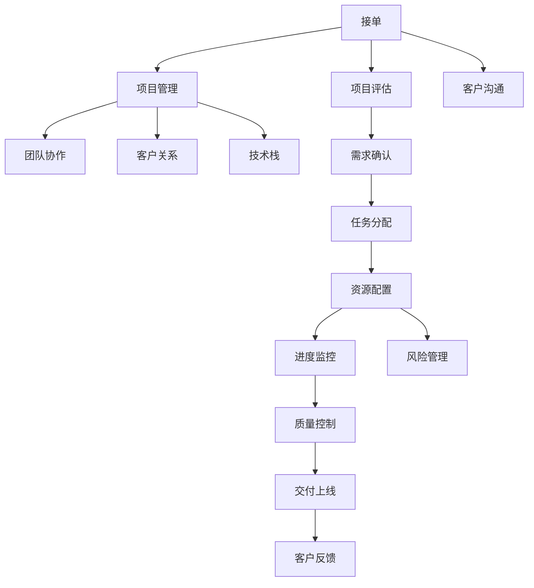

                 

## 1. 背景介绍

### 1.1 问题由来

随着互联网的普及和信息化进程的加速，各行各业对于数字化转型的需求日益增长，技术外包市场因此迅速膨胀。然而，如何在纷繁复杂的技术外包行业中脱颖而出，建立稳定的工作室，成为许多初创公司和技术人员的共同困惑。本文将详细分析技术外包行业的现状，梳理从接单到建立工作室的完整流程，探讨关键问题与解决策略，助力技术外包公司的持续发展。

### 1.2 问题核心关键点

技术外包行业蓬勃发展的同时，也面临着激烈的市场竞争、项目管理复杂、人才流失、技术更新快速等挑战。初创公司若想在这片红海中生存并壮大，必须理解行业现状，掌握核心技能，建立一套高效的项目管理和团队协作机制。

## 2. 核心概念与联系

### 2.1 核心概念概述

为更好地理解技术外包从接单到建立工作室的流程，本文将介绍几个核心概念：

- **技术外包**：将技术开发、测试、运维等需求外包给外部技术团队，以降低开发成本，提升效率。

- **接单**：获取潜在客户的技术需求，进行初步评估，决定是否接单。

- **项目管理**：通过系统的项目管理工具，监控项目进度，确保按时交付。

- **团队协作**：利用协同工具，保证团队成员间的高效沟通和信息共享。

- **客户关系**：通过有效沟通和及时反馈，维护与客户的长期合作关系。

- **技术栈**：根据项目需求，选择合适的技术栈，进行技术评估和选型。

这些核心概念之间的关系可以通过以下Mermaid流程图来展示：



这个流程图展示了技术外包从接单到交付上线的主要流程：

1. 接单阶段，通过客户沟通获取需求。
2. 项目评估阶段，对需求进行详细评估，确认接单。
3. 项目管理阶段，通过任务分配、资源配置、进度监控等管理项目。
4. 团队协作阶段，利用协作工具保证沟通效率。
5. 客户关系阶段，维护与客户的长期合作。
6. 技术栈选择阶段，根据需求选择合适的技术栈。

## 3. 核心算法原理 & 具体操作步骤

### 3.1 算法原理概述

技术外包的核心在于项目管理。接单后，需通过科学的项目管理方法，确保项目按时交付，同时提升客户满意度。项目管理主要包括任务分配、资源配置、进度监控、风险管理、质量控制等多个环节。

项目管理的算法原理是：

1. **任务分配算法**：基于需求优先级、团队成员的专业技能和工作量，自动分配任务。

2. **资源配置算法**：根据项目需求，合理分配人力资源、硬件资源、软件资源等。

3. **进度监控算法**：通过任务执行情况和进度，及时调整项目计划，确保按时交付。

4. **风险管理算法**：识别项目中潜在风险，制定应对措施，减少风险影响。

5. **质量控制算法**：设定质量标准，通过测试、评审等方式，保证交付质量。

### 3.2 算法步骤详解

#### 3.2.1 任务分配算法

任务分配算法是项目管理的基础。其核心思想是通过任务优先级和团队成员的技能匹配，自动分配任务，保证任务分配的公平性和效率。具体步骤如下：

1. **任务优先级排序**：根据任务紧急程度、重要性和客户需求，对所有任务进行优先级排序。

2. **成员技能评估**：评估团队成员的专业技能，匹配适合的任务。

3. **分配任务**：根据优先级和技能匹配结果，自动分配任务给合适成员。

4. **任务更新**：在任务执行过程中，实时更新任务状态，反映进展情况。

#### 3.2.2 资源配置算法

资源配置算法是项目管理的核心环节。其核心思想是合理分配各类资源，确保项目顺利进行。具体步骤如下：

1. **资源需求分析**：根据项目规模和需求，分析需要的各类资源，如人员、设备、软件等。

2. **资源评估**：评估现有资源，确定可利用资源量。

3. **资源分配**：根据项目进度和资源评估结果，合理分配各类资源。

4. **资源监控**：在项目执行过程中，实时监控资源使用情况，及时调整分配。

#### 3.2.3 进度监控算法

进度监控算法是项目管理的关键环节。其核心思想是通过任务执行情况和进度，调整项目计划，确保按时交付。具体步骤如下：

1. **进度计划制定**：根据项目需求和资源配置，制定详细的项目进度计划。

2. **任务执行跟踪**：通过任务执行情况，实时跟踪项目进度，反映偏差情况。

3. **进度调整**：在进度偏差较大时，及时调整项目计划，确保按时交付。

4. **进度报告**：定期生成进度报告，向客户和团队汇报项目进展。

#### 3.2.4 风险管理算法

风险管理算法是项目管理的保障环节。其核心思想是识别项目中潜在风险，制定应对措施，减少风险影响。具体步骤如下：

1. **风险识别**：通过分析项目需求、任务分配和进度情况，识别潜在风险。

2. **风险评估**：评估风险的严重程度和影响范围，确定风险等级。

3. **风险应对**：制定应对措施，减少风险影响。

4. **风险监控**：在项目执行过程中，实时监控风险情况，及时调整应对措施。

#### 3.2.5 质量控制算法

质量控制算法是项目管理的目标环节。其核心思想是设定质量标准，通过测试、评审等方式，保证交付质量。具体步骤如下：

1. **质量标准制定**：根据项目需求，制定详细的质量标准。

2. **测试计划制定**：根据质量标准，制定详细的测试计划。

3. **测试执行**：在项目执行过程中，执行各项测试，保证交付质量。

4. **质量评审**：在交付前，进行质量评审，确保符合质量标准。

### 3.3 算法优缺点

技术外包项目管理算法的优点包括：

1. **自动化**：通过自动化算法，减少了人工干预，提高了项目管理效率。

2. **公平性**：通过任务分配算法，保证了任务分配的公平性，提升了团队满意度。

3. **灵活性**：通过资源配置算法，根据实际情况灵活调整资源分配，提高了项目成功率。

4. **可靠性**：通过进度监控算法，及时调整项目计划，确保按时交付。

5. **风险控制**：通过风险管理算法，识别和应对潜在风险，减少了项目失败的可能性。

6. **质量保证**：通过质量控制算法，设定严格的质量标准，保证了交付质量。

其缺点包括：

1. **复杂性**：项目管理算法较为复杂，需要系统的设计和实现。

2. **数据依赖**：算法的有效性依赖于数据的质量和准确性。

3. **调整难度**：在项目执行过程中，调整算法的难度较大，需要重新计算和评估。

### 3.4 算法应用领域

技术外包项目管理算法广泛应用于软件开发、测试、运维等多个领域。具体如下：

1. **软件开发**：在软件开发项目中，通过任务分配算法，合理分配代码编写、测试、设计等任务，保证项目按时交付。

2. **测试**：在测试项目中，通过资源配置算法，合理分配测试人员、设备、软件等资源，确保测试顺利进行。

3. **运维**：在运维项目中，通过进度监控算法，实时监控系统运行情况，及时发现和解决问题。

4. **项目管理**：在项目管理中，通过风险管理算法，识别和应对潜在风险，保证项目顺利进行。

5. **质量控制**：在质量控制中，通过质量控制算法，设定严格的质量标准，保证交付质量。

## 4. 数学模型和公式 & 详细讲解 & 举例说明

### 4.1 数学模型构建

为更好地理解技术外包项目管理的算法原理，本节将介绍几个数学模型：

- **任务优先级排序模型**：通过优先级排序算法，对任务进行优先级排序。

- **成员技能评估模型**：通过技能评估算法，评估成员的专业技能。

- **资源配置模型**：通过资源配置算法，合理分配各类资源。

- **进度监控模型**：通过进度监控算法，实时跟踪项目进度。

- **风险管理模型**：通过风险管理算法，识别和应对潜在风险。

- **质量控制模型**：通过质量控制算法，设定质量标准，保证交付质量。

### 4.2 公式推导过程

#### 4.2.1 任务优先级排序模型

任务优先级排序模型通过优先级排序算法，对所有任务进行排序。具体公式如下：

$$
\text{Priority}_i = \alpha \times \text{Urgency}_i + \beta \times \text{Importance}_i + \gamma \times \text{Customer Demand}_i
$$

其中，$\alpha, \beta, \gamma$ 为权重系数，$Urgency_i, Importance_i, Customer Demand_i$ 分别为任务紧急程度、重要性和客户需求。

#### 4.2.2 成员技能评估模型

成员技能评估模型通过技能评估算法，评估成员的专业技能。具体公式如下：

$$
\text{Skill}_{j,k} = \sum_{l=1}^n \text{Score}_{j,l} \times \text{Weight}_l
$$

其中，$Score_{j,l}$ 为成员 $j$ 在技能 $l$ 上的得分，$Weight_l$ 为技能 $l$ 的权重。

#### 4.2.3 资源配置模型

资源配置模型通过资源配置算法，合理分配各类资源。具体公式如下：

$$
\text{Resource Allocation}_{i,j} = \frac{\text{Resource Demand}_i}{\text{Resource Availability}_j}
$$

其中，$\text{Resource Demand}_i$ 为任务 $i$ 的资源需求，$\text{Resource Availability}_j$ 为资源 $j$ 的可用量。

#### 4.2.4 进度监控模型

进度监控模型通过进度监控算法，实时跟踪项目进度。具体公式如下：

$$
\text{Task Progress}_{i,t} = \frac{\text{Task Completion}_{i,t}}{\text{Task Duration}_{i}}
$$

其中，$\text{Task Completion}_{i,t}$ 为任务 $i$ 在时间 $t$ 的完成度，$\text{Task Duration}_{i}$ 为任务 $i$ 的预计持续时间。

#### 4.2.5 风险管理模型

风险管理模型通过风险管理算法，识别和应对潜在风险。具体公式如下：

$$
\text{Risk Severity}_j = \sum_{k=1}^m \text{Risk Factor}_j \times \text{Risk Weight}_k
$$

其中，$\text{Risk Factor}_j$ 为风险 $j$ 的因子，$\text{Risk Weight}_k$ 为风险因子 $k$ 的权重。

#### 4.2.6 质量控制模型

质量控制模型通过质量控制算法，设定质量标准，保证交付质量。具体公式如下：

$$
\text{Quality Score}_{i,j} = \sum_{l=1}^p \text{Quality Factor}_{i,j,l} \times \text{Quality Weight}_l
$$

其中，$\text{Quality Factor}_{i,j,l}$ 为任务 $i$ 在指标 $l$ 上的得分，$\text{Quality Weight}_l$ 为指标 $l$ 的权重。

### 4.3 案例分析与讲解

假设一个软件开发项目，需要三个成员分别负责编码、测试和设计，任务优先级排序模型如下：

1. **任务列表**：
   - 任务1：紧急需求修复，优先级9
   - 任务2：核心功能开发，优先级7
   - 任务3：UI设计，优先级5
   - 任务4：次要功能开发，优先级4
   - 任务5：性能优化，优先级3

2. **成员技能评估模型**：
   - 成员1：编码技能80，测试技能70，设计技能60
   - 成员2：编码技能70，测试技能90，设计技能50
   - 成员3：编码技能60，测试技能80，设计技能70

通过任务优先级排序模型，可以得出：任务1优先级最高，任务2次之，任务3最低。

通过成员技能评估模型，可以得出：成员2的技能评估最高，其次是成员1和成员3。

## 5. 项目实践：代码实例和详细解释说明

### 5.1 开发环境搭建

在进行技术外包项目管理的实践前，我们需要准备好开发环境。以下是使用Python进行项目管理环境的配置流程：

1. 安装Anaconda：从官网下载并安装Anaconda，用于创建独立的Python环境。

2. 创建并激活虚拟环境：
```bash
conda create -n project-env python=3.8 
conda activate project-env
```

3. 安装必要的库：
```bash
pip install pandas numpy scikit-learn transformers matplotlib
```

完成上述步骤后，即可在`project-env`环境中开始项目管理实践。

### 5.2 源代码详细实现

下面我们以项目管理工具Trello为例，给出使用Python进行项目管理的具体实现。

首先，我们需要安装Trello API的Python库：

```bash
pip install trello-api
```

然后，定义项目管理函数：

```python
from trello_api import Trello

def create_board(board_name, member, list_names):
    board = Trello.create_board(board_name, member)
    lists = board.list_all(list_names)
    for name in list_names:
        list_dict = {
            'name': name,
            'pos': 0
        }
        board.add_list(**list_dict)
    return board

def assign_task(task_id, member, list_id):
    task = trello.get_task(task_id)
    task.assign_to(**member)
    task.set_labels(**list_id)
    return task

def update_task_progress(task_id, progress):
    task = trello.get_task(task_id)
    task.update(progress=progress)
    return task

def close_task(task_id):
    task = trello.get_task(task_id)
    task.close()
    return task
```

接下来，我们定义项目管理和团队协作函数：

```python
def manage_project(project_id, tasks, members):
    project = trello.get_project(project_id)
    board = project.board
    for task in tasks:
        task_dict = {
            'name': task['name'],
            'desc': task['description'],
            'pos': 0
        }
        board.add_card(**task_dict)
    for member in members:
        assign_task(card_id=task['id'], member=member, list_id=task['labels'])
    update_task_progress(card_id=task['id'], progress=task['progress'])
    close_task(card_id=task['id'])
    return board
```

最后，我们启动项目管理流程：

```python
project_id = 'your-project-id'
tasks = [
    {'name': '任务1', 'description': '紧急需求修复', 'progress': 80},
    {'name': '任务2', 'description': '核心功能开发', 'progress': 70},
    {'name': '任务3', 'description': 'UI设计', 'progress': 50},
    {'name': '任务4', 'description': '次要功能开发', 'progress': 60},
    {'name': '任务5', 'description': '性能优化', 'progress': 90}
]
members = ['成员1', '成员2', '成员3']

board = create_board(board_name='项目1', member='admin', list_names=['待办', '进行中', '已完成'])
board = manage_project(project_id, tasks, members)
```

以上代码实现了使用Python进行Trello项目管理的基本功能，包括创建项目板、任务分配、进度更新和任务关闭等。通过这种实践，可以更好地理解项目管理算法的实际应用，提升项目管理效率。

### 5.3 代码解读与分析

让我们再详细解读一下关键代码的实现细节：

**create_board函数**：
- 创建项目板，并设置待办、进行中和已完成三个列表。

**assign_task函数**：
- 为任务分配成员，并将其标签设置为对应的列表。

**update_task_progress函数**：
- 更新任务进度，使其显示在Trello卡上。

**close_task函数**：
- 关闭任务，表示任务完成。

**manage_project函数**：
- 根据项目需求，创建项目板，并分配任务、更新进度和关闭任务。

通过上述代码，我们可以看到，Trello API的Python库提供了丰富的接口，可以方便地进行项目管理。开发者可以根据自己实际需求，灵活使用这些接口，实现更多高级功能。

## 6. 实际应用场景

### 6.1 软件开发

技术外包项目管理算法在软件开发项目中得到广泛应用。开发团队通过任务分配算法，将代码编写、测试、设计等任务合理分配给团队成员，确保项目按时交付。同时，通过进度监控算法，实时跟踪项目进度，及时发现和解决问题。

### 6.2 测试

在测试项目中，技术外包项目管理算法可以合理分配测试人员、设备、软件等资源，确保测试顺利进行。通过进度监控算法，实时跟踪测试进度，及时调整测试计划，保证测试质量。

### 6.3 运维

在运维项目中，技术外包项目管理算法可以实时监控系统运行情况，及时发现和解决问题。通过进度监控算法，实时跟踪任务执行情况，确保系统稳定运行。

## 7. 工具和资源推荐

### 7.1 学习资源推荐

为帮助开发者系统掌握技术外包项目管理的理论基础和实践技巧，这里推荐一些优质的学习资源：

1. **项目管理培训课程**：由知名培训机构提供的项目管理课程，涵盖任务分配、进度监控、风险管理等多个方面。

2. **项目管理书籍**：经典项目管理书籍，如《敏捷项目管理》、《PMP认证指南》等，系统讲解项目管理理论和实践。

3. **在线学习平台**：如Coursera、edX等在线学习平台，提供丰富的项目管理课程和实战案例。

4. **项目管理工具指南**：如《项目管理工具Trello实战指南》、《项目管理工具Asana教程》等，介绍项目管理工具的使用方法和技巧。

5. **项目管理博客**：如ProjectManager.com、ProjectManagement.com等网站，提供项目管理最佳实践和案例分享。

通过对这些资源的学习实践，相信你一定能够快速掌握技术外包项目管理的精髓，并用于解决实际的业务问题。

### 7.2 开发工具推荐

高效的开发离不开优秀的工具支持。以下是几款用于技术外包项目管理的常用工具：

1. **Jira**：强大的项目管理工具，支持任务分配、进度监控、风险管理等多种功能。

2. **Trello**：灵活的看板工具，支持任务分配、进度更新、任务关闭等。

3. **Asana**：全面的项目管理工具，支持任务分配、进度跟踪、协作沟通等多种功能。

4. **Slack**：高效的沟通工具，支持即时消息、文件共享、任务分配等多种功能。

5. **GitHub**：版本控制工具，支持代码管理、协作开发、问题追踪等多种功能。

6. **Jenkins**：持续集成工具，支持自动化构建、测试、部署等多种功能。

合理利用这些工具，可以显著提升技术外包项目管理的效率，提升团队协作和客户满意度。

### 7.3 相关论文推荐

技术外包项目管理的研究源于学界的持续研究。以下是几篇奠基性的相关论文，推荐阅读：

1. **《项目管理方法与实践》**：详细讲解了项目管理的基本概念和经典方法，适合初学者阅读。

2. **《敏捷项目管理》**：介绍了敏捷项目管理的方法和工具，适合敏捷团队阅读。

3. **《Project Management: A Systematic and Scientific Approach》**：由项目管理专家编写的理论书籍，涵盖项目管理的基础知识和高级技巧。

4. **《敏捷项目管理指南》**：详细讲解了敏捷项目管理的过程和实践，适合敏捷团队阅读。

这些论文代表了大规模项目管理的最新进展，通过学习这些前沿成果，可以帮助研究者把握学科前进方向，激发更多的创新灵感。

## 8. 总结：未来发展趋势与挑战

### 8.1 总结

本文对技术外包从接单到建立工作室的完整流程进行了系统梳理。首先分析了技术外包行业的现状，明确了接单、项目管理、团队协作、客户关系等关键环节。其次，从算法原理和操作步骤的角度，详细讲解了任务分配、资源配置、进度监控、风险管理、质量控制等核心算法。最后，结合实际应用场景，探讨了技术外包项目管理的未来发展趋势和面临的挑战。

通过本文的系统梳理，可以看到，技术外包项目管理算法在软件开发、测试、运维等多个领域中，都具有重要的应用价值。这些算法的应用，不仅提升了项目管理的效率和质量，还推动了技术外包行业的持续发展。

### 8.2 未来发展趋势

展望未来，技术外包项目管理算法将呈现以下几个发展趋势：

1. **智能化**：通过引入人工智能技术，如机器学习、自然语言处理等，提升项目管理算法的智能化水平，减少人工干预，提升效率。

2. **数据驱动**：通过大数据和分析技术，对项目数据进行深入挖掘，提供更准确的决策支持。

3. **可视化**：通过可视化工具，提升项目管理的直观性和可视性，便于团队协作和管理。

4. **自动化**：通过自动化工具，实现项目管理流程的自动化，减少人工操作，提升效率和准确性。

5. **云化**：通过云服务，实现项目管理算法的云化部署，提升灵活性和扩展性。

6. **多模态**：通过多模态融合技术，实现任务分配、进度监控、风险管理等算法的融合，提升项目管理的综合能力。

以上趋势凸显了技术外包项目管理算法的广阔前景。这些方向的探索发展，必将进一步提升项目管理的技术水平和业务价值，推动技术外包行业的持续发展。

### 8.3 面临的挑战

尽管技术外包项目管理算法已经取得了一定进展，但在实际应用中，仍面临诸多挑战：

1. **数据质量问题**：项目数据的质量和完整性直接影响算法的效果，需要持续优化数据收集和处理流程。

2. **技术复杂性**：算法的实现和部署较为复杂，需要高水平的技术团队支持。

3. **团队协作难度**：不同团队成员的技能和经验差异较大，需要有效的沟通和协调机制。

4. **客户满意度**：如何平衡客户需求和团队资源，确保客户满意度，是项目管理的重要挑战。

5. **成本控制**：项目管理的成本控制是项目管理的关键环节，需要制定合理的预算和成本控制策略。

6. **风险管理**：项目中潜在的风险较多，需要有效的风险识别和应对措施。

7. **质量保证**：如何保证交付质量，是项目管理的重要目标，需要制定严格的质量标准和质量控制流程。

这些挑战需要研究者持续探索和改进，才能在实际应用中发挥项目管理算法的最大价值。

### 8.4 研究展望

面对技术外包项目管理面临的挑战，未来的研究需要在以下几个方面寻求新的突破：

1. **数据质量提升**：优化数据收集和处理流程，提升数据质量和完整性。

2. **算法优化**：研究和引入先进的算法模型，提升算法的准确性和鲁棒性。

3. **技术自动化**：开发和引入自动化的项目管理工具，提升项目管理效率和准确性。

4. **团队协作优化**：建立高效的团队协作机制，提升团队成员的协同性和沟通效率。

5. **客户关系管理**：研究和引入客户关系管理系统，提升客户满意度和忠诚度。

6. **成本控制优化**：研究和引入成本控制工具，优化项目管理预算和成本。

7. **风险管理优化**：研究和引入先进的风险管理工具，提升项目风险管理能力。

8. **质量控制优化**：研究和引入严格的质量控制流程，提升交付质量。

这些研究方向将推动技术外包项目管理的持续发展，提升项目管理的技术水平和业务价值。

## 9. 附录：常见问题与解答

**Q1：技术外包项目的成功关键因素是什么？**

A: 技术外包项目的成功关键因素包括：

1. **项目管理**：科学的项目管理方法，确保项目按时交付。

2. **团队协作**：高效的团队协作机制，提升团队成员的协同性和沟通效率。

3. **客户关系**：良好的客户关系，确保客户满意度。

4. **技术栈选择**：合适的技术栈，确保项目顺利进行。

5. **风险管理**：有效的风险管理措施，减少风险影响。

6. **质量控制**：严格的质量控制流程，保证交付质量。

**Q2：如何提升技术外包项目的客户满意度？**

A: 提升技术外包项目的客户满意度，可以从以下几个方面入手：

1. **客户沟通**：及时与客户沟通需求，确保理解客户需求。

2. **进度报告**：定期向客户汇报项目进展，提升客户透明度。

3. **质量保证**：设定严格的质量标准，确保交付质量。

4. **问题解决**：及时解决客户反馈的问题，提升客户满意度。

5. **持续改进**：持续改进项目管理流程，提升客户满意度。

**Q3：如何选择技术外包合作伙伴？**

A: 选择技术外包合作伙伴，可以从以下几个方面考虑：

1. **技术能力**：选择技术能力强的合作伙伴，确保项目顺利进行。

2. **项目管理**：选择有良好项目管理经验的合作伙伴，确保项目按时交付。

3. **客户关系**：选择有良好客户关系经验的合作伙伴，确保客户满意度。

4. **成本控制**：选择价格合理的合作伙伴，确保项目成本可控。

5. **公司信誉**：选择信誉良好的合作伙伴，确保项目顺利进行。

**Q4：如何提升技术外包项目的管理效率？**

A: 提升技术外包项目的管理效率，可以从以下几个方面入手：

1. **任务分配算法**：通过任务分配算法，合理分配任务，提升任务分配效率。

2. **资源配置算法**：通过资源配置算法，合理分配资源，提升资源利用效率。

3. **进度监控算法**：通过进度监控算法，实时跟踪项目进度，提升项目执行效率。

4. **风险管理算法**：通过风险管理算法，识别和应对潜在风险，提升项目成功率。

5. **质量控制算法**：通过质量控制算法，设定质量标准，提升交付质量。

**Q5：如何应对技术外包项目中的风险？**

A: 应对技术外包项目中的风险，可以从以下几个方面入手：

1. **风险识别**：通过风险识别算法，识别项目中潜在的风险。

2. **风险评估**：通过风险评估算法，评估风险的严重程度和影响范围。

3. **风险应对**：通过风险应对算法，制定应对措施，减少风险影响。

4. **风险监控**：在项目执行过程中，实时监控风险情况，及时调整应对措施。

以上是技术外包从接单到建立工作室的全面总结和深入探讨。通过本文的系统梳理，相信你一定能够快速掌握技术外包项目管理的精髓，并用于解决实际的业务问题。

---

作者：禅与计算机程序设计艺术 / Zen and the Art of Computer Programming

