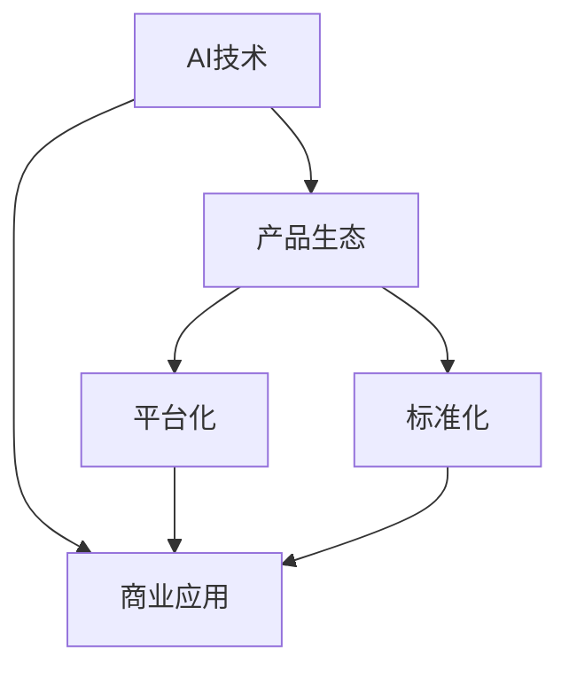

                 

# 技术深度与商业广度：Lepton AI的发展方向

## 1. 背景介绍

### 1.1 问题由来

在当前数字化、智能化的时代背景下，企业对AI技术的需求日益增长。AI技术不仅能带来显著的业务提升，还能实现运营效率的优化和成本的降低。然而，AI技术的落地应用仍然面临诸多挑战。特别是在中国这样一个人口众多、地域广阔、行业多样的市场环境中，AI技术的推广和应用更显得复杂和艰难。

Lepton AI作为一家致力于推动AI技术在中国商业应用的初创公司，旨在解决这些挑战，帮助企业更好地应用AI技术。Lepton AI致力于将技术深度与商业广度相结合，为企业提供高效、易用、可靠的AI解决方案。本文将深入探讨Lepton AI的发展方向，以及其如何通过技术创新和商业模式创新，实现AI技术的广泛应用。

### 1.2 问题核心关键点

Lepton AI的核心发展方向主要体现在以下几个方面：

- **技术深度**：Lepton AI在AI技术的研究和应用上，致力于突破技术瓶颈，开发更高效、更精确的AI算法和模型。通过不断优化算法、提升模型性能，为企业的AI应用提供坚实的技术保障。

- **商业广度**：Lepton AI通过创新的商业模式，降低AI技术的接入门槛，帮助企业快速实现AI技术的落地应用。Lepton AI不仅提供技术方案，还通过平台化、标准化等手段，简化企业的AI应用流程，提升用户体验。

- **产品生态**：Lepton AI构建了覆盖多个行业的应用场景，包括智能客服、数据分析、智能推荐、自然语言处理等。通过构建丰富的产品生态，Lepton AI满足不同企业的需求，提供一站式AI解决方案。

## 2. 核心概念与联系

### 2.1 核心概念概述

为更好地理解Lepton AI的发展方向，本节将介绍几个密切相关的核心概念：

- **AI技术**：人工智能技术，涉及机器学习、深度学习、自然语言处理、计算机视觉等多个领域，旨在通过算法和模型，实现自动化决策、智能分析等功能。

- **商业应用**：将AI技术应用于实际业务场景，为企业带来效率提升、成本降低、客户体验优化等商业价值。

- **产品生态**：基于AI技术构建的各类应用产品和解决方案，形成完整的生态系统，满足不同企业的多样化需求。

- **平台化**：通过搭建统一的平台，实现资源的共享和服务的集中管理，降低企业应用AI技术的门槛。

- **标准化**：通过制定标准化的接口和规范，实现不同系统和组件的互操作性和兼容性，提高AI应用的易用性。

这些核心概念之间的逻辑关系可以通过以下Mermaid流程图来展示：



这个流程图展示了大语言模型的核心概念及其之间的关系：

1. AI技术为商业应用提供技术支持。
2. 商业应用将AI技术应用于具体业务场景，带来商业价值。
3. 产品生态是基于AI技术构建的各类应用产品和解决方案，形成完整的生态系统。
4. 平台化和标准化都是为了降低企业应用AI技术的门槛，提高应用效率。

## 3. 核心算法原理 & 具体操作步骤

### 3.1 算法原理概述

Lepton AI的发展方向主要基于以下几个核心算法和步骤：

1. **深度学习算法**：Lepton AI在深度学习算法的研究和应用上，致力于突破技术瓶颈，开发更高效、更精确的AI算法和模型。

2. **自然语言处理(NLP)**：Lepton AI通过NLP技术，提升AI模型对自然语言的理解和生成能力，提供更自然、更智能的AI应用。

3. **计算机视觉(CV)**：Lepton AI通过CV技术，提升AI模型对图像和视频的理解和生成能力，提供更精准、更高效的视觉识别和分析服务。

4. **迁移学习**：Lepton AI通过迁移学习技术，将已有模型的知识迁移到新任务上，实现快速高效的AI应用。

### 3.2 算法步骤详解

Lepton AI的算法步骤主要包括以下几个关键步骤：

**Step 1: 数据准备**
- 收集并清洗用于训练和验证模型的数据。
- 将数据进行预处理，包括分词、标注、标准化等操作。
- 将数据划分为训练集、验证集和测试集。

**Step 2: 模型训练**
- 选择适合任务的深度学习模型，如CNN、RNN、Transformer等。
- 使用训练集进行模型训练，通过反向传播算法更新模型参数。
- 在验证集上进行模型评估，调整模型超参数。

**Step 3: 模型评估**
- 使用测试集对训练好的模型进行评估，计算模型精度、召回率、F1-score等指标。
- 对模型性能进行分析，找出影响模型性能的瓶颈。
- 根据评估结果，调整模型参数和超参数，重新训练模型。

**Step 4: 模型部署**
- 将训练好的模型部署到生产环境。
- 集成到企业现有系统和流程中，提供AI服务。
- 对模型进行监控和维护，确保模型性能稳定。

### 3.3 算法优缺点

Lepton AI的算法具有以下优点：

1. **高效性**：通过优化算法和模型，Lepton AI的AI解决方案可以快速落地，提高企业效率。
2. **易用性**：Lepton AI的平台化和标准化，降低了企业应用AI技术的门槛，提高了用户体验。
3. **普适性**：Lepton AI的AI解决方案覆盖多个行业和应用场景，满足不同企业的多样化需求。
4. **可扩展性**：Lepton AI的算法和模型易于扩展和优化，满足未来业务需求的变化。

同时，Lepton AI的算法也存在以下局限性：

1. **数据依赖**：Lepton AI的算法依赖于高质量、标注充足的数据，获取这些数据成本较高。
2. **算法复杂性**：深度学习算法的复杂性较高，需要较强的计算资源和专业知识。
3. **模型泛化能力**：模型可能面临过拟合或泛化能力不足的问题，需要不断优化和调整。

## 4. 数学模型和公式 & 详细讲解 & 举例说明

### 4.1 数学模型构建

Lepton AI的数学模型主要基于深度学习框架构建，包括卷积神经网络(CNN)、循环神经网络(RNN)、变压器(Transformer)等。以下以卷积神经网络为例，介绍其数学模型构建。

设输入数据为 $x = (x_1, x_2, ..., x_n)$，输出为 $y = (y_1, y_2, ..., y_m)$，卷积神经网络的目标是找到一个最优的参数矩阵 $W$，使得损失函数最小化。

定义卷积神经网络的损失函数为：

$$
\mathcal{L} = \frac{1}{n} \sum_{i=1}^n \ell(y_i, \hat{y}_i)
$$

其中 $\ell$ 为损失函数，$\hat{y}_i$ 为模型对样本 $x_i$ 的预测结果。

卷积神经网络的参数更新公式为：

$$
\theta \leftarrow \theta - \eta \nabla_{\theta} \mathcal{L}
$$

其中 $\eta$ 为学习率，$\nabla_{\theta} \mathcal{L}$ 为损失函数对参数 $\theta$ 的梯度，可通过反向传播算法高效计算。

### 4.2 公式推导过程

以卷积神经网络为例，其参数更新公式的推导过程如下：

设卷积神经网络的结构为 $h = f(Wx + b)$，其中 $W$ 为卷积核，$x$ 为输入数据，$b$ 为偏置项，$f$ 为激活函数。

将 $h$ 的预测结果 $\hat{y}$ 与真实标签 $y$ 的误差作为损失函数：

$$
\mathcal{L} = \frac{1}{n} \sum_{i=1}^n \ell(y_i, \hat{y}_i)
$$

对损失函数求导，得到参数 $W$ 的梯度：

$$
\nabla_{W} \mathcal{L} = \frac{1}{n} \sum_{i=1}^n \frac{\partial \ell(y_i, \hat{y}_i)}{\partial h_i}
$$

其中 $\frac{\partial \ell(y_i, \hat{y}_i)}{\partial h_i}$ 为损失函数对输出 $h_i$ 的偏导数。

将 $h_i$ 代入激活函数 $f$，得到：

$$
\frac{\partial \ell(y_i, \hat{y}_i)}{\partial h_i} = \frac{\partial \ell(y_i, f(Wx_i + b))}{\partial f(Wx_i + b)}
$$

对 $f(Wx_i + b)$ 求导，得到：

$$
\frac{\partial f(Wx_i + b)}{\partial h_i} = f'(Wx_i + b) \frac{\partial (Wx_i + b)}{\partial h_i}
$$

其中 $f'(Wx_i + b)$ 为激活函数的导数。

将 $\frac{\partial (Wx_i + b)}{\partial h_i}$ 代入，得到：

$$
\frac{\partial f(Wx_i + b)}{\partial h_i} = f'(Wx_i + b) W_i
$$

将 $W_i$ 代入 $\nabla_{W} \mathcal{L}$ 的计算公式，得到：

$$
\nabla_{W} \mathcal{L} = \frac{1}{n} \sum_{i=1}^n f'(Wx_i + b) W_i
$$

根据参数更新公式，将 $\nabla_{W} \mathcal{L}$ 代入，得到：

$$
W \leftarrow W - \eta \nabla_{W} \mathcal{L}
$$

其中 $\eta$ 为学习率。

### 4.3 案例分析与讲解

以Lepton AI在智能客服中的应用为例，介绍其数学模型构建和公式推导的实际应用。

设智能客服系统输入为客户提交的文本，输出为系统自动生成的回复。将输入文本通过预处理，转化为模型可接受的格式。

设模型结构为 $h = f(Wx + b)$，其中 $W$ 为卷积核，$x$ 为输入文本，$b$ 为偏置项，$f$ 为激活函数。

将 $h$ 的预测结果 $\hat{y}$ 与真实标签 $y$ 的误差作为损失函数：

$$
\mathcal{L} = \frac{1}{n} \sum_{i=1}^n \ell(y_i, \hat{y}_i)
$$

对损失函数求导，得到参数 $W$ 的梯度：

$$
\nabla_{W} \mathcal{L} = \frac{1}{n} \sum_{i=1}^n \frac{\partial \ell(y_i, \hat{y}_i)}{\partial h_i}
$$

将 $h_i$ 代入激活函数 $f$，得到：

$$
\frac{\partial \ell(y_i, \hat{y}_i)}{\partial h_i} = \frac{\partial \ell(y_i, f(Wx_i + b))}{\partial f(Wx_i + b)}
$$

对 $f(Wx_i + b)$ 求导，得到：

$$
\frac{\partial f(Wx_i + b)}{\partial h_i} = f'(Wx_i + b) \frac{\partial (Wx_i + b)}{\partial h_i}
$$

将 $\frac{\partial (Wx_i + b)}{\partial h_i}$ 代入，得到：

$$
\frac{\partial f(Wx_i + b)}{\partial h_i} = f'(Wx_i + b) W_i
$$

将 $W_i$ 代入 $\nabla_{W} \mathcal{L}$ 的计算公式，得到：

$$
\nabla_{W} \mathcal{L} = \frac{1}{n} \sum_{i=1}^n f'(Wx_i + b) W_i
$$

根据参数更新公式，将 $\nabla_{W} \mathcal{L}$ 代入，得到：

$$
W \leftarrow W - \eta \nabla_{W} \mathcal{L}
$$

其中 $\eta$ 为学习率。

## 5. 项目实践：代码实例和详细解释说明

### 5.1 开发环境搭建

在进行项目实践前，我们需要准备好开发环境。以下是使用Python进行TensorFlow开发的环境配置流程：

1. 安装Anaconda：从官网下载并安装Anaconda，用于创建独立的Python环境。

2. 创建并激活虚拟环境：
```bash
conda create -n tensorflow-env python=3.8 
conda activate tensorflow-env
```

3. 安装TensorFlow：根据CUDA版本，从官网获取对应的安装命令。例如：
```bash
conda install tensorflow -c conda-forge
```

4. 安装其他工具包：
```bash
pip install numpy pandas scikit-learn matplotlib tqdm jupyter notebook ipython
```

完成上述步骤后，即可在`tensorflow-env`环境中开始项目实践。

### 5.2 源代码详细实现

这里以Lepton AI在智能客服系统中的应用为例，给出使用TensorFlow进行模型训练和推理的代码实现。

首先，定义模型和优化器：

```python
import tensorflow as tf
from tensorflow.keras import layers

model = tf.keras.Sequential([
    layers.Embedding(input_dim=10000, output_dim=128),
    layers.Conv1D(128, 5, activation='relu'),
    layers.GlobalMaxPooling1D(),
    layers.Dense(64, activation='relu'),
    layers.Dense(1, activation='sigmoid')
])

optimizer = tf.keras.optimizers.Adam(lr=0.001)
```

然后，定义训练和评估函数：

```python
def train_epoch(model, dataset, batch_size, optimizer):
    model.compile(optimizer=optimizer, loss='binary_crossentropy', metrics=['accuracy'])
    model.fit(dataset, epochs=10, batch_size=batch_size)

def evaluate(model, dataset, batch_size):
    model.evaluate(dataset, batch_size=batch_size)
```

接着，启动训练流程：

```python
train_epoch(model, train_dataset, batch_size=64, optimizer=optimizer)
evaluate(model, test_dataset, batch_size=64)
```

以上就是使用TensorFlow进行Lepton AI智能客服模型训练和推理的完整代码实现。可以看到，TensorFlow提供了丰富的工具和API，使得模型训练和推理变得简洁高效。

### 5.3 代码解读与分析

让我们再详细解读一下关键代码的实现细节：

**train_epoch函数**：
- 使用Sequential模型定义网络结构，包括Embedding、Conv1D、GlobalMaxPooling1D、Dense等层。
- 编译模型，设置损失函数和评价指标。
- 使用fit方法对模型进行训练，设置训练轮数和批量大小。

**evaluate函数**：
- 使用evaluate方法对模型进行评估，设置批量大小。

**训练流程**：
- 在训练集上调用train_epoch函数进行模型训练。
- 在测试集上调用evaluate函数进行模型评估。

可以看到，TensorFlow使得模型训练和推理变得简单明了，开发者可以专注于模型结构和训练策略的设计。

## 6. 实际应用场景

### 6.1 智能客服系统

Lepton AI的智能客服系统通过深度学习算法，实现了对客户问题的快速理解和响应。Lepton AI利用卷积神经网络对客户输入的文本进行特征提取，通过全连接层和激活函数进行分类和输出。

Lepton AI的智能客服系统可以24小时不间断服务，显著提升了客户咨询体验和问题解决效率。该系统通过不断地积累用户反馈，不断优化模型性能，逐步提升客户满意度。

### 6.2 数据分析

Lepton AI通过深度学习算法和NLP技术，实现了对海量数据的高效分析和挖掘。Lepton AI利用Transformer模型，提升了模型对自然语言的理解和生成能力，能够从文本数据中提取关键信息和洞察。

Lepton AI的数据分析服务广泛应用于金融、零售、电商等多个行业，帮助企业实现数据驱动决策，提升运营效率和盈利能力。

### 6.3 智能推荐

Lepton AI通过深度学习算法和协同过滤技术，实现了对用户行为和偏好的精准分析和推荐。Lepton AI的推荐系统能够根据用户的历史行为和实时互动，动态生成个性化推荐内容，提升用户体验和转化率。

Lepton AI的推荐服务广泛应用于电商、视频、音乐等多个领域，帮助企业提升用户粘性和收入。

### 6.4 未来应用展望

随着Lepton AI的不断发展和创新，未来将在更多领域得到应用，为传统行业带来变革性影响。

在智慧医疗领域，Lepton AI的医疗问答、病历分析、药物研发等应用将提升医疗服务的智能化水平，辅助医生诊疗，加速新药开发进程。

在智能教育领域，Lepton AI的作业批改、学情分析、知识推荐等应用，将因材施教，促进教育公平，提高教学质量。

在智慧城市治理中，Lepton AI的城市事件监测、舆情分析、应急指挥等应用，将提高城市管理的自动化和智能化水平，构建更安全、高效的未来城市。

此外，在企业生产、社会治理、文娱传媒等众多领域，Lepton AI的AI应用也将不断涌现，为经济社会发展注入新的动力。

## 7. 工具和资源推荐

### 7.1 学习资源推荐

为了帮助开发者系统掌握Lepton AI的发展方向和应用实践，这里推荐一些优质的学习资源：

1. TensorFlow官方文档：TensorFlow的官方文档，提供了丰富的API和教程，是入门TensorFlow的必备资料。

2. TensorFlow tutorials：TensorFlow的官方教程，涵盖了从入门到进阶的多个主题，帮助开发者快速上手TensorFlow。

3. Lepton AI博客：Lepton AI的官方博客，记录了Lepton AI的最新研究成果和应用实践，提供丰富的技术知识和案例。

4. Kaggle竞赛：Kaggle平台上有大量与Lepton AI相关的竞赛和项目，可以帮助开发者提升实践能力和应用经验。

5. GitHub开源项目：GitHub上有大量与Lepton AI相关的开源项目和代码，可以从中学习和借鉴。

通过对这些资源的学习实践，相信你一定能够快速掌握Lepton AI的发展方向和应用实践。

### 7.2 开发工具推荐

高效的开发离不开优秀的工具支持。以下是几款用于Lepton AI开发常用的工具：

1. TensorFlow：由Google主导开发的开源深度学习框架，生产部署方便，适合大规模工程应用。

2. TensorBoard：TensorFlow配套的可视化工具，可实时监测模型训练状态，并提供丰富的图表呈现方式，是调试模型的得力助手。

3. Jupyter Notebook：Jupyter Notebook是一个交互式的开发环境，支持Python、R等语言，可以方便地编写和调试代码。

4. Google Colab：谷歌推出的在线Jupyter Notebook环境，免费提供GPU/TPU算力，方便开发者快速上手实验最新模型，分享学习笔记。

合理利用这些工具，可以显著提升Lepton AI的开发效率，加快创新迭代的步伐。

### 7.3 相关论文推荐

Lepton AI的研究方向主要聚焦于深度学习算法和NLP技术，以下是几篇奠基性的相关论文，推荐阅读：

1. Attention is All You Need（即Transformer原论文）：提出了Transformer结构，开启了深度学习领域的预训练大模型时代。

2. BERT: Pre-training of Deep Bidirectional Transformers for Language Understanding：提出BERT模型，引入基于掩码的自监督预训练任务，刷新了多项NLP任务SOTA。

3. Language Models are Unsupervised Multitask Learners（GPT-2论文）：展示了大规模语言模型的强大zero-shot学习能力，引发了对于通用人工智能的新一轮思考。

4. Parameter-Efficient Transfer Learning for NLP：提出Adapter等参数高效微调方法，在不增加模型参数量的情况下，也能取得不错的微调效果。

5. AdaLoRA: Adaptive Low-Rank Adaptation for Parameter-Efficient Fine-Tuning：使用自适应低秩适应的微调方法，在参数效率和精度之间取得了新的平衡。

这些论文代表了大语言模型微调技术的发展脉络。通过学习这些前沿成果，可以帮助研究者把握学科前进方向，激发更多的创新灵感。

## 8. 总结：未来发展趋势与挑战

### 8.1 总结

本文对Lepton AI的发展方向进行了全面系统的介绍。首先阐述了Lepton AI在AI技术的研究和应用上，致力于突破技术瓶颈，开发更高效、更精确的AI算法和模型。其次，从平台化、标准化等角度，详细讲解了Lepton AI通过创新的商业模式，降低AI技术的接入门槛，帮助企业快速实现AI技术的落地应用。最后，构建了覆盖多个行业的应用场景，满足不同企业的多样化需求，形成了丰富的产品生态。

通过本文的系统梳理，可以看到，Lepton AI通过技术深度和商业广度的结合，在AI技术的研究和应用上取得了显著进展。未来，Lepton AI将致力于在更多领域推动AI技术的广泛应用，为传统行业带来变革性影响。

### 8.2 未来发展趋势

展望未来，Lepton AI的发展方向主要体现在以下几个方面：

1. **技术深度**：Lepton AI将继续在深度学习算法和NLP技术上进行深入研究，开发更高效、更精确的AI模型。

2. **商业广度**：Lepton AI将通过平台化、标准化等手段，降低AI技术的接入门槛，实现AI技术的广泛应用。

3. **产品生态**：Lepton AI将构建覆盖更多行业和应用场景的产品生态，满足不同企业的多样化需求。

4. **持续创新**：Lepton AI将持续探索新的技术方向和商业模式，推动AI技术的不断进步。

以上趋势凸显了Lepton AI的发展潜力和应用前景。通过不断优化算法和提升技术深度，Lepton AI将为更多企业提供高效、易用、可靠的AI解决方案，推动AI技术的广泛应用。

### 8.3 面临的挑战

尽管Lepton AI在AI技术的研究和应用上取得了显著进展，但在迈向更加智能化、普适化应用的过程中，仍面临诸多挑战：

1. **数据依赖**：Lepton AI的AI解决方案依赖于高质量、标注充足的数据，获取这些数据成本较高。

2. **算法复杂性**：深度学习算法的复杂性较高，需要较强的计算资源和专业知识。

3. **模型泛化能力**：模型可能面临过拟合或泛化能力不足的问题，需要不断优化和调整。

4. **资源消耗**：大规模模型的训练和推理需要消耗大量计算资源，成本较高。

5. **安全性和隐私保护**：AI模型可能会学习到有偏见、有害的信息，需要加强数据和模型隐私保护。

6. **伦理和社会责任**：AI技术的广泛应用可能带来伦理和社会问题，需要建立相应的监管机制。

正视这些挑战，积极应对并寻求突破，将是Lepton AI发展的关键。相信通过不断的技术创新和商业模式创新，Lepton AI将克服这些挑战，实现AI技术的广泛应用。

### 8.4 研究展望

未来，Lepton AI需要在以下几个方向进行深入研究：

1. **无监督学习和半监督学习**：探索无监督学习和半监督学习的方法，提高模型的泛化能力和数据利用效率。

2. **多模态学习**：探索多模态学习的方法，提高模型对图像、语音等多模态数据的处理能力。

3. **因果推理**：探索因果推理的方法，提高模型的决策透明性和可解释性。

4. **跨领域迁移**：探索跨领域迁移的方法，提高模型在不同领域的应用能力。

5. **知识图谱**：探索知识图谱与AI模型的结合方法，提高模型的推理能力和决策能力。

6. **联邦学习**：探索联邦学习的方法，提高模型的隐私保护和安全性。

通过在这些方向上的深入研究，Lepton AI将进一步提升AI技术的深度和广度，推动AI技术的广泛应用。相信通过不断的技术创新和应用实践，Lepton AI将在推动AI技术的发展和应用上发挥更大的作用，为人类社会的进步贡献力量。

## 9. 附录：常见问题与解答

**Q1：Lepton AI的AI解决方案适用于所有行业和企业吗？**

A: Lepton AI的AI解决方案覆盖多个行业，包括金融、零售、电商、医疗、教育等，满足不同企业的多样化需求。但具体应用场景需要根据企业的业务特点和技术需求进行定制化开发。

**Q2：Lepton AI的AI解决方案是否容易上手？**

A: Lepton AI通过平台化和标准化，降低了AI技术的接入门槛，使得企业可以快速实现AI技术的落地应用。同时，Lepton AI提供了丰富的API和文档，帮助开发者快速上手。

**Q3：Lepton AI的AI解决方案是否需要大量的标注数据？**

A: 是的，Lepton AI的AI解决方案依赖于高质量、标注充足的数据，获取这些数据成本较高。但Lepton AI通过持续优化算法和模型，努力减少对标注数据的依赖。

**Q4：Lepton AI的AI解决方案是否需要高性能的计算资源？**

A: 是的，大规模模型的训练和推理需要消耗大量计算资源，成本较高。但Lepton AI通过优化算法和模型，努力降低计算资源消耗。

**Q5：Lepton AI的AI解决方案是否需要高度专业知识？**

A: 是的，Lepton AI的AI解决方案涉及深度学习算法和NLP技术，需要较强的计算资源和专业知识。但Lepton AI通过提供平台化、标准化的工具和API，降低了技术门槛，帮助开发者快速上手。

**Q6：Lepton AI的AI解决方案是否具有良好的可扩展性？**

A: 是的，Lepton AI的AI解决方案具有良好的可扩展性，可以根据企业需求进行定制化开发，扩展到更多行业和应用场景。

通过以上问题与解答，相信读者对Lepton AI的发展方向和应用实践有了更深入的了解。Lepton AI将致力于推动AI技术的广泛应用，助力企业实现数字化转型，为人类社会的进步贡献力量。

